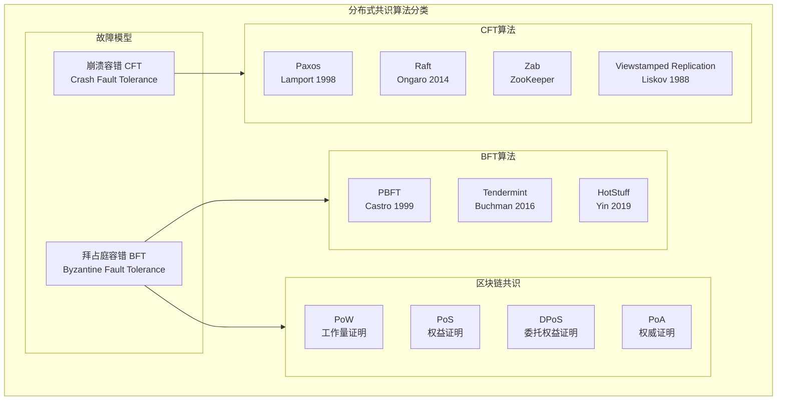
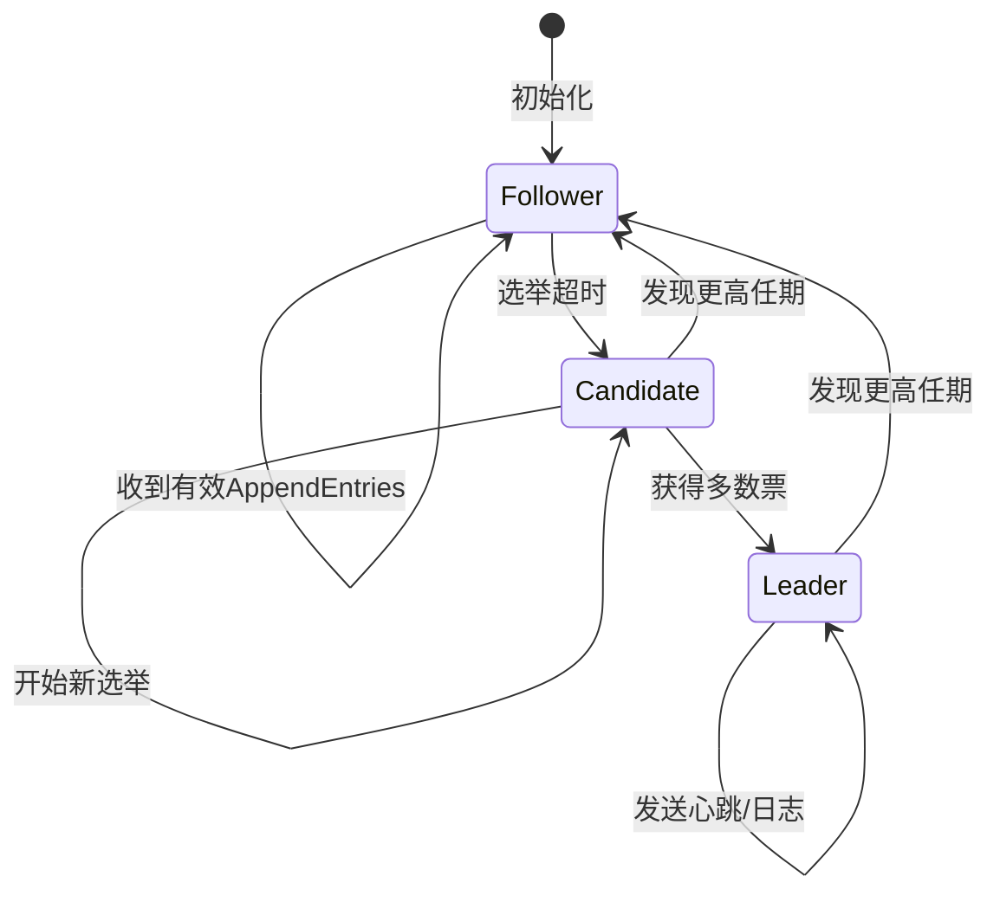
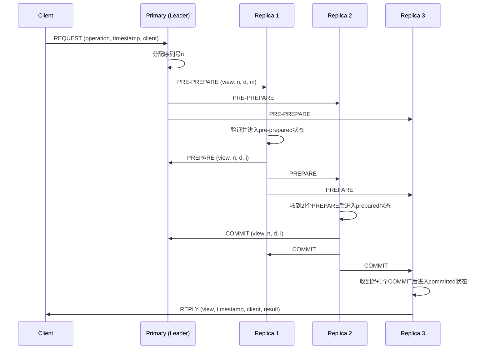

# 分布式共识算法：从理论到嵌入式实践

> **难度等级**: L4-L5 | **预估学习时间**: 35-45小时 | **前置知识**: 分布式系统、网络编程、并发控制、容错理论

---

## 技术概述

分布式共识算法是分布式系统的核心基础，解决在可能存在故障节点和网络分区的情况下，如何让多个节点就某个值达成一致的问题。从Lamport的Paxos到Ongaro的Raft，从BFT到区块链共识，本模块深入讲解各类共识算法的理论基础、C语言实现细节以及在嵌入式系统中的工程实践。

### 共识问题的本质

根据FLP不可能性结果(Fischer, Lynch, Paterson, 1985)，在异步网络中，即使只有一个故障节点，确定性共识算法也无法保证在有限时间内终止。实际系统通过以下方式绕过这一限制：

1. **部分同步模型**: 假设系统在大部分时间内表现同步
2. **故障检测器**: 使用超时机制检测故障
3. **随机化算法**: 引入随机性打破对称性
4. **故障模型限制**: 假设故障类型（崩溃故障vs拜占庭故障）

### 共识算法分类

```text
分布式共识算法
├── 崩溃容错 (Crash Fault Tolerance)
│   ├── 同步系统: 简单多数表决
│   └── 异步系统
│       ├── Paxos (经典)
│       ├── Raft (易理解)
│       ├── Zab (ZooKeeper使用)
│       └── Viewstamped Replication
└── 拜占庭容错 (BFT)
    ├── PBFT (实用拜占庭容错)
    └── Tendermint (区块链共识)
```



---


---

## 📑 目录

- [分布式共识算法：从理论到嵌入式实践](#分布式共识算法从理论到嵌入式实践)
  - [技术概述](#技术概述)
    - [共识问题的本质](#共识问题的本质)
    - [共识算法分类](#共识算法分类)
  - [📑 目录](#-目录)
  - [Raft 算法深度解析](#raft-算法深度解析)
    - [Raft 核心设计原则](#raft-核心设计原则)
    - [Raft 状态机与任期](#raft-状态机与任期)
    - [Raft 核心数据结构](#raft-核心数据结构)
    - [Raft 领导者选举实现](#raft-领导者选举实现)
    - [Raft 日志复制实现](#raft-日志复制实现)
  - [实用拜占庭容错(PBFT)](#实用拜占庭容错pbft)
    - [PBFT 算法概述](#pbft-算法概述)
    - [PBFT 核心数据结构](#pbft-核心数据结构)
  - [区块链共识：PoW与PoS](#区块链共识pow与pos)
    - [工作量证明(PoW)](#工作量证明pow)
    - [权益证明(PoS)](#权益证明pos)
  - [嵌入式系统中的共识算法](#嵌入式系统中的共识算法)
    - [资源受限环境优化](#资源受限环境优化)
    - [时间触发共识(TTP)](#时间触发共识ttp)
  - [权威资料与参考](#权威资料与参考)
    - [经典论文](#经典论文)
    - [开源实现](#开源实现)
    - [推荐书籍](#推荐书籍)
  - [文件导航](#文件导航)


---

## Raft 算法深度解析

### Raft 核心设计原则

Raft被设计为"易于理解的共识算法"，通过**强领导者(Strong Leader)**模型简化问题分解：

1. **领导者选举(Leader Election)**: 在任何时刻，最多只有一个有效领导者
2. **日志复制(Log Replication)**: 领导者负责接收客户端请求并复制日志到跟随者
3. **安全性(Safety)**: 通过约束保证所有节点以相同顺序应用相同的日志条目

### Raft 状态机与任期



### Raft 核心数据结构

```c
/* Raft 节点状态定义 */
typedef enum {
    RAFT_STATE_FOLLOWER = 0,
    RAFT_STATE_CANDIDATE,
    RAFT_STATE_LEADER
} raft_state_t;

/* 日志条目结构 */
typedef struct {
    uint64_t term;          /* 创建此条目的领导者任期 */
    uint64_t index;         /* 日志索引（单调递增） */
    uint8_t data[];         /* 实际命令数据（柔性数组） */
} raft_log_entry_t;

/* Raft 节点状态 */
typedef struct {
    /* 持久化状态（所有服务器） */
    uint64_t current_term;      /* 当前任期 */
    int voted_for;              /* 当前任期投票给谁(-1表示未投票) */
    raft_log_entry_t **log;     /* 日志条目数组 */
    uint64_t log_count;         /* 日志条目数量 */

    /* 易失性状态（所有服务器） */
    uint64_t commit_index;      /* 已知的最高提交索引 */
    uint64_t last_applied;      /* 已应用到状态机的最高索引 */
    raft_state_t state;         /* 当前状态 */

    /* 易失性状态（仅领导者） */
    uint64_t *next_index;       /* 每个跟随者的下一个日志索引 */
    uint64_t *match_index;      /* 每个跟随者已复制的最高索引 */

    /* 配置 */
    int node_id;                /* 本节点ID */
    int node_count;             /* 集群节点总数 */
    int *peer_ids;              /* 其他节点ID数组 */

    /* 超时配置 */
    uint32_t election_timeout;      /* 选举超时（随机150-300ms） */
    uint32_t heartbeat_interval;    /* 心跳间隔（通常50ms） */
    uint64_t last_heartbeat;        /* 上次收到心跳时间 */

    /* 网络和存储 */
    raft_send_rpc_fn send_rpc;      /* RPC发送回调 */
    raft_apply_fn apply;            /* 应用日志回调 */
    raft_persist_fn persist;        /* 持久化回调 */
} raft_node_t;

/* RPC消息类型 */
typedef enum {
    RAFT_MSG_REQUEST_VOTE = 1,
    RAFT_MSG_REQUEST_VOTE_RESPONSE,
    RAFT_MSG_APPEND_ENTRIES,
    RAFT_MSG_APPEND_ENTRIES_RESPONSE
} raft_msg_type_t;

/* RequestVote RPC参数 */
typedef struct {
    uint64_t term;              /* 候选人任期 */
    int candidate_id;           /* 候选人ID */
    uint64_t last_log_index;    /* 候选人最后日志索引 */
    uint64_t last_log_term;     /* 候选人最后日志任期 */
} request_vote_req_t;

typedef struct {
    uint64_t term;              /* 当前任期（用于候选人更新自己） */
    bool vote_granted;          /* 是否投票 */
} request_vote_resp_t;

/* AppendEntries RPC参数 */
typedef struct {
    uint64_t term;              /* 领导者任期 */
    int leader_id;              /* 领导者ID */
    uint64_t prev_log_index;    /* 新日志条目之前的那条索引 */
    uint64_t prev_log_term;     /* prev_log_index条目的任期 */
    raft_log_entry_t **entries; /* 要存储的日志条目（可以为空，仅心跳） */
    uint64_t entry_count;       /* 条目数量 */
    uint64_t leader_commit;     /* 领导者的commit_index */
} append_entries_req_t;

typedef struct {
    uint64_t term;              /* 当前任期 */
    bool success;               /* 如果跟随者包含prev_log条目则为true */
    uint64_t match_index;       /* 跟随者匹配的最高索引 */
    uint64_t conflict_term;     /* 冲突任期（用于加速回退） */
    uint64_t conflict_index;    /* 冲突索引 */
} append_entries_resp_t;
```

### Raft 领导者选举实现

```c
/* 处理选举超时 - 转换为候选人 */
void raft_handle_election_timeout(raft_node_t *node) {
    uint64_t now = get_monotonic_ms();

    if (node->state == RAFT_STATE_LEADER)
        return;  /* 领导者不会超时 */

    if (now - node->last_heartbeat < node->election_timeout)
        return;  /* 未到超时时间 */

    /* 转换为候选人 */
    raft_become_candidate(node);
}

/* 转换为候选人 */
void raft_become_candidate(raft_node_t *node) {
    node->state = RAFT_STATE_CANDIDATE;
    node->current_term++;
    node->voted_for = node->node_id;  /* 给自己投票 */
    node->last_heartbeat = get_monotonic_ms();

    /* 随机化选举超时（避免活锁） */
    node->election_timeout = ELECTION_TIMEOUT_MIN +
        (rand() % (ELECTION_TIMEOUT_MAX - ELECTION_TIMEOUT_MIN));

    raft_persist_state(node);  /* 持久化任期和投票 */

    /* 发送RequestVote RPC给所有节点 */
    request_vote_req_t req = {
        .term = node->current_term,
        .candidate_id = node->node_id,
        .last_log_index = raft_get_last_log_index(node),
        .last_log_term = raft_get_last_log_term(node)
    };

    int votes = 1;  /* 自己的票 */
    for (int i = 0; i < node->node_count; i++) {
        if (node->peer_ids[i] == node->node_id) continue;

        raft_send_rpc(node, node->peer_ids[i],
                      RAFT_MSG_REQUEST_VOTE, &req, sizeof(req));
    }
}

/* 处理RequestVote RPC */
void raft_handle_request_vote(raft_node_t *node, int from,
                              request_vote_req_t *req,
                              request_vote_resp_t *resp) {
    resp->term = node->current_term;
    resp->vote_granted = false;

    /* 1. 如果候选人任期更低，拒绝 */
    if (req->term < node->current_term) {
        return;
    }

    /* 2. 如果收到更高任期，转换为跟随者 */
    if (req->term > node->current_term) {
        raft_become_follower(node, req->term);
    }

    /* 3. 投票条件检查 */
    bool can_vote = (node->voted_for == -1 ||
                     node->voted_for == req->candidate_id);

    /* 4. 日志新鲜度检查 - 候选人的日志必须至少和自己一样新 */
    bool log_is_up_to_date =
        (req->last_log_term > raft_get_last_log_term(node)) ||
        (req->last_log_term == raft_get_last_log_term(node) &&
         req->last_log_index >= raft_get_last_log_index(node));

    if (can_vote && log_is_up_to_date) {
        resp->vote_granted = true;
        node->voted_for = req->candidate_id;
        node->last_heartbeat = get_monotonic_ms();  /* 重置超时 */
        raft_persist_state(node);
    }
}

/* 处理RequestVote响应 */
void raft_handle_request_vote_response(raft_node_t *node, int from,
                                       request_vote_resp_t *resp) {
    /* 如果收到更高任期，转换为跟随者 */
    if (resp->term > node->current_term) {
        raft_become_follower(node, resp->term);
        return;
    }

    /* 只处理候选人在当前任期的响应 */
    if (node->state != RAFT_STATE_CANDIDATE ||
        resp->term != node->current_term) {
        return;
    }

    static int votes_received = 1;  /* 已在become_candidate中初始化 */
    if (resp->vote_granted) {
        votes_received++;
    }

    /* 获得多数票，成为领导者 */
    if (votes_received > node->node_count / 2) {
        raft_become_leader(node);
    }
}
```

### Raft 日志复制实现

```c
/* 领导者处理客户端请求 */
bool raft_propose(raft_node_t *node, const uint8_t *data, size_t len) {
    if (node->state != RAFT_STATE_LEADER) {
        return false;  /* 非领导者拒绝 */
    }

    /* 追加到本地日志 */
    raft_log_entry_t *entry = malloc(sizeof(raft_log_entry_t) + len);
    entry->term = node->current_term;
    entry->index = raft_get_last_log_index(node) + 1;
    memcpy(entry->data, data, len);

    /* 追加到日志 */
    node->log = realloc(node->log, (node->log_count + 1) * sizeof(void*));
    node->log[node->log_count++] = entry;
    raft_persist_log(node, entry);

    /* 立即发送AppendEntries给所有跟随者 */
    for (int i = 0; i < node->node_count; i++) {
        if (node->peer_ids[i] == node->node_id) continue;
        raft_send_append_entries(node, node->peer_ids[i]);
    }

    return true;
}

/* 发送AppendEntries RPC */
void raft_send_append_entries(raft_node_t *node, int peer_id) {
    int peer_idx = get_peer_index(node, peer_id);
    uint64_t next_idx = node->next_index[peer_idx];

    append_entries_req_t req = {
        .term = node->current_term,
        .leader_id = node->node_id,
        .prev_log_index = next_idx - 1,
        .prev_log_term = (next_idx > 1) ?
            node->log[next_idx - 2]->term : 0,
        .leader_commit = node->commit_index,
        .entries = NULL,
        .entry_count = 0
    };

    /* 准备要发送的条目（从next_index开始） */
    uint64_t entries_to_send = node->log_count - (next_idx - 1);
    if (entries_to_send > MAX_ENTRIES_PER_RPC)
        entries_to_send = MAX_ENTRIES_PER_RPC;

    if (entries_to_send > 0) {
        req.entries = &node->log[next_idx - 1];
        req.entry_count = entries_to_send;
    }

    raft_send_rpc(node, peer_id, RAFT_MSG_APPEND_ENTRIES,
                  &req, sizeof(req) - sizeof(void*) +
                  req.entry_count * sizeof(raft_log_entry_t*));
}

/* 处理AppendEntries RPC（跟随者端） */
void raft_handle_append_entries(raft_node_t *node, int from,
                                append_entries_req_t *req,
                                append_entries_resp_t *resp) {
    resp->term = node->current_term;
    resp->success = false;
    resp->match_index = 0;
    resp->conflict_term = 0;
    resp->conflict_index = 0;

    /* 1. 如果领导者任期更低，拒绝 */
    if (req->term < node->current_term) {
        return;
    }

    /* 2. 收到有效领导者心跳，重置超时 */
    node->last_heartbeat = get_monotonic_ms();

    /* 3. 如果收到更高任期，转换为跟随者 */
    if (req->term > node->current_term) {
        raft_become_follower(node, req->term);
    }

    /* 4. 日志一致性检查 */
    if (req->prev_log_index > 0) {
        if (req->prev_log_index > raft_get_last_log_index(node)) {
            /* 日志太短，告知领导者正确的索引 */
            resp->conflict_index = raft_get_last_log_index(node) + 1;
            return;
        }

        if (node->log[req->prev_log_index - 1]->term != req->prev_log_term) {
            /* 任期不匹配，查找冲突任期的第一个索引 */
            resp->conflict_term = node->log[req->prev_log_index - 1]->term;
            uint64_t idx = req->prev_log_index;
            while (idx > 1 && node->log[idx - 2]->term == resp->conflict_term) {
                idx--;
            }
            resp->conflict_index = idx;
            return;
        }
    }

    /* 5. 日志匹配，追加新条目 */
    resp->success = true;

    uint64_t insert_idx = req->prev_log_index + 1;
    for (uint64_t i = 0; i < req->entry_count; i++) {
        raft_log_entry_t *new_entry = req->entries[i];

        if (insert_idx <= raft_get_last_log_index(node)) {
            /* 已存在条目，检查任期 */
            if (node->log[insert_idx - 1]->term != new_entry->term) {
                /* 删除冲突及之后的所有条目 */
                while (node->log_count >= insert_idx) {
                    free(node->log[--node->log_count]);
                }
                node->log = realloc(node->log,
                                    insert_idx * sizeof(void*));
            } else {
                /* 条目已存在且匹配，跳过 */
                insert_idx++;
                continue;
            }
        }

        /* 追加新条目 */
        node->log = realloc(node->log, (node->log_count + 1) * sizeof(void*));
        node->log[node->log_count] = malloc(sizeof(raft_log_entry_t) +
                                            strlen((char*)new_entry->data));
        memcpy(node->log[node->log_count], new_entry,
               sizeof(raft_log_entry_t) + strlen((char*)new_entry->data));
        node->log_count++;
        raft_persist_log(node, node->log[node->log_count - 1]);
        insert_idx++;
    }

    /* 6. 更新提交索引 */
    if (req->leader_commit > node->commit_index) {
        node->commit_index = min(req->leader_commit,
                                 raft_get_last_log_index(node));
        raft_apply_committed(node);
    }

    resp->match_index = req->prev_log_index + req->entry_count;
}

/* 领导者处理AppendEntries响应并推进commit_index */
void raft_handle_append_entries_response(raft_node_t *node, int from,
                                         append_entries_resp_t *resp) {
    if (resp->term > node->current_term) {
        raft_become_follower(node, resp->term);
        return;
    }

    if (node->state != RAFT_STATE_LEADER || resp->term != node->current_term)
        return;

    int peer_idx = get_peer_index(node, from);

    if (resp->success) {
        /* 成功复制，更新匹配索引 */
        node->match_index[peer_idx] = resp->match_index;
        node->next_index[peer_idx] = resp->match_index + 1;

        /* 检查是否可以提交 */
        raft_advance_commit_index(node);
    } else {
        /* 复制失败，回退next_index */
        if (resp->conflict_term > 0) {
            /* 优化回退：找到冲突任期的最后一条 */
            uint64_t idx = raft_get_last_log_index(node);
            while (idx > 0 && node->log[idx - 1]->term > resp->conflict_term) {
                idx--;
            }
            if (idx > 0 && node->log[idx - 1]->term == resp->conflict_term) {
                node->next_index[peer_idx] = idx;
            } else {
                node->next_index[peer_idx] = resp->conflict_index;
            }
        } else {
            node->next_index[peer_idx] = resp->conflict_index;
        }

        /* 立即重试 */
        raft_send_append_entries(node, from);
    }
}

/* 推进提交索引 - 仅在当前任期条目上提交 */
void raft_advance_commit_index(raft_node_t *node) {
    for (uint64_t N = node->commit_index + 1;
         N <= raft_get_last_log_index(node); N++) {

        /* 只提交当前任期的条目（Raft安全约束） */
        if (node->log[N - 1]->term != node->current_term)
            continue;

        /* 统计在N或更高索引上匹配的节点数 */
        int match_count = 1;  /* 领导者自己 */
        for (int i = 0; i < node->node_count; i++) {
            if (node->peer_ids[i] == node->node_id) continue;
            int peer_idx = get_peer_index(node, node->peer_ids[i]);
            if (node->match_index[peer_idx] >= N)
                match_count++;
        }

        /* 如果超过半数匹配，可以提交 */
        if (match_count > node->node_count / 2) {
            node->commit_index = N;
        } else {
            break;  /* 无法再推进 */
        }
    }

    raft_apply_committed(node);
}

/* 应用已提交的日志到状态机 */
void raft_apply_committed(raft_node_t *node) {
    while (node->last_applied < node->commit_index) {
        node->last_applied++;
        raft_log_entry_t *entry = node->log[node->last_applied - 1];
        node->apply(node->last_applied, entry->data);
    }
}
```

---

## 实用拜占庭容错(PBFT)

### PBFT 算法概述

PBFT(Practical Byzantine Fault Tolerance)是第一个实用的BFT算法，能够在异步网络中容忍最多f个拜占庭节点（总节点数n ≥ 3f + 1）。



### PBFT 核心数据结构

```c
/* PBFT 消息类型 */
typedef enum {
    PBFT_MSG_REQUEST = 1,
    PBFT_MSG_PRE_PREPARE,
    PBFT_MSG_PREPARE,
    PBFT_MSG_COMMIT,
    PBFT_MSG_VIEW_CHANGE,
    PBFT_MSG_NEW_VIEW,
    PBFT_MSG_CHECKPOINT
} pbft_msg_type_t;

/* PBFT 请求消息 */
typedef struct {
    uint8_t operation[OPERATION_MAX_SIZE];  /* 操作内容 */
    uint64_t timestamp;                      /* 客户端时间戳 */
    int client_id;                           /* 客户端ID */
    uint8_t signature[SIGNATURE_SIZE];       /* 客户端签名 */
} pbft_request_t;

/* Pre-Prepare消息 */
typedef struct {
    int view;                               /* 视图编号 */
    uint64_t sequence;                       /* 序列号 */
    uint8_t digest[DIGEST_SIZE];            /* 请求摘要 */
    pbft_request_t request;                 /* 原始请求 */
    int replica_id;                         /* 主副本ID */
    uint8_t signature[SIGNATURE_SIZE];      /* 主副本签名 */
} pbft_pre_prepare_t;

/* Prepare消息 */
typedef struct {
    int view;
    uint64_t sequence;
    uint8_t digest[DIGEST_SIZE];
    int replica_id;
    uint8_t signature[SIGNATURE_SIZE];
} pbft_prepare_t;

/* Commit消息 */
typedef struct {
    int view;
    uint64_t sequence;
    uint8_t digest[DIGEST_SIZE];
    int replica_id;
    uint8_t signature[SIGNATURE_SIZE];
} pbft_commit_t;

/* 副本状态 */
typedef struct {
    int replica_id;
    int view;                               /* 当前视图 */
    uint64_t sequence;                       /* 当前序列号 */
    int f;                                  /* 容错数 */
    int n;                                  /* 总节点数 */

    /* 日志 */
    pbft_log_entry_t *log;

    /* 状态追踪 */
    /* 对每个<view, sequence>追踪收到的prepare/commit */
    map_t prepared_certificates;            /* 达到prepared状态的证明 */
    map_t committed_certificates;           /* 达到committed状态的证明 */

    /* 视图变更 */
    bool view_change_in_progress;
    map_t view_change_messages;             /* 收集的VIEW-CHANGE消息 */

    /* 检查点 */
    uint64_t last_stable_checkpoint;

    /* 加密材料 */
    uint8_t private_key[PRIVATE_KEY_SIZE];
    uint8_t public_keys[MAX_REPLICAS][PUBLIC_KEY_SIZE];
} pbft_replica_t;

/* PBFT 主流程 */
void pbft_handle_request(pbft_replica_t *replica, pbft_request_t *req) {
    if (!is_primary(replica)) {
        /* 转发给主副本 */
        forward_to_primary(replica, req);
        return;
    }

    /* 验证客户端签名 */
    if (!verify_client_signature(req)) {
        return;
    }

    /* 分配序列号 */
    uint64_t seq = ++replica->sequence;

    /* 计算请求摘要 */
    uint8_t digest[DIGEST_SIZE];
    hash_request(req, digest);

    /* 创建并广播Pre-Prepare */
    pbft_pre_prepare_t pre_prepare = {
        .view = replica->view,
        .sequence = seq,
        .replica_id = replica->replica_id
    };
    memcpy(pre_prepare.digest, digest, DIGEST_SIZE);
    memcpy(&pre_prepare.request, req, sizeof(*req));
    sign_message(&pre_prepare, sizeof(pre_prepare) - SIGNATURE_SIZE,
                 replica->private_key, pre_prepare.signature);

    broadcast_pre_prepare(replica, &pre_prepare);

    /* 自己添加到pre-prepared状态 */
    add_to_pre_prepared(replica, replica->view, seq, digest);
}

void pbft_handle_pre_prepare(pbft_replica_t *replica,
                             pbft_pre_prepare_t *pp) {
    /* 验证条件检查 */
    if (pp->view != replica->view) return;
    if (pp->sequence <= replica->last_stable_checkpoint) return;
    if (pp->sequence > replica->last_stable_checkpoint + WATER_MARK) return;

    /* 验证摘要 */
    uint8_t computed_digest[DIGECT_SIZE];
    hash_request(&pp->request, computed_digest);
    if (memcmp(computed_digest, pp->digest, DIGEST_SIZE) != 0) return;

    /* 验证主副本签名 */
    int primary = get_primary(pp->view, replica->n);
    if (!verify_signature(pp, sizeof(*pp) - SIGNATURE_SIZE,
                          pp->signature, replica->public_keys[primary])) {
        return;
    }

    /* 进入pre-prepared状态 */
    add_to_pre_prepared(replica, pp->view, pp->sequence, pp->digest);

    /* 发送Prepare消息 */
    pbft_prepare_t prepare = {
        .view = replica->view,
        .sequence = pp->sequence,
        .replica_id = replica->replica_id
    };
    memcpy(prepare.digest, pp->digest, DIGEST_SIZE);
    sign_message(&prepare, sizeof(prepare) - SIGNATURE_SIZE,
                 replica->private_key, prepare.signature);

    broadcast_prepare(replica, &prepare);
}

void pbft_handle_prepare(pbft_replica_t *replica, pbft_prepare_t *p) {
    if (p->view != replica->view) return;

    /* 验证签名 */
    if (!verify_replica_signature(replica, p->replica_id,
                                   p, sizeof(*p) - SIGNATURE_SIZE,
                                   p->signature)) {
        return;
    }

    /* 收集prepare */
    if (!add_prepare_vote(replica, p->view, p->sequence,
                          p->digest, p->replica_id)) {
        return;  /* 重复或无效 */
    }

    /* 检查是否达到prepared状态（2f个prepare） */
    if (is_prepared(replica, p->view, p->sequence, p->digest)) {
        /* 发送Commit */
        pbft_commit_t commit = {
            .view = replica->view,
            .sequence = p->sequence,
            .replica_id = replica->replica_id
        };
        memcpy(commit.digest, p->digest, DIGEST_SIZE);
        sign_message(&commit, sizeof(commit) - SIGNATURE_SIZE,
                     replica->private_key, commit.signature);

        broadcast_commit(replica, &commit);
    }
}

void pbft_handle_commit(pbft_replica_t *replica, pbft_commit_t *c) {
    if (c->view != replica->view) return;

    /* 验证签名 */
    if (!verify_replica_signature(replica, c->replica_id,
                                   c, sizeof(*c) - SIGNATURE_SIZE,
                                   c->signature)) {
        return;
    }

    /* 收集commit */
    if (!add_commit_vote(replica, c->view, c->sequence,
                         c->digest, c->replica_id)) {
        return;
    }

    /* 检查是否达到committed状态（2f+1个commit） */
    if (is_committed(replica, c->view, c->sequence, c->digest)) {
        /* 执行操作并回复客户端 */
        execute_request(replica, c->view, c->sequence);
    }
}
```

---

## 区块链共识：PoW与PoS

### 工作量证明(PoW)

```c
/* PoW挖矿实现 */
typedef struct {
    uint32_t version;
    uint8_t prev_block[32];     /* 前一区块哈希 */
    uint8_t merkle_root[32];    /* Merkle根 */
    uint32_t timestamp;
    uint32_t bits;              /* 难度目标 */
    uint32_t nonce;             /* 随机数 */
} block_header_t;

/* 难度计算 - 根据目标值确定 */
uint32_t calculate_difficulty_target(uint32_t bits) {
    uint32_t exponent = (bits >> 24) & 0xFF;
    uint32_t coefficient = bits & 0x007FFFFF;

    /* target = coefficient * 256^(exponent-3) */
    /* 简化表示 */
    return bits;
}

/* PoW挖矿 */
bool pow_mine(block_header_t *header, uint32_t difficulty_bits) {
    uint8_t hash[32];
    uint32_t target = calculate_difficulty_target(difficulty_bits);

    for (uint32_t nonce = 0; nonce < UINT32_MAX; nonce++) {
        header->nonce = nonce;

        /* 双SHA256哈希 */
        sha256_ctx_t ctx;
        sha256_init(&ctx);
        sha256_update(&ctx, header, sizeof(block_header_t));
        sha256_final(&ctx, hash);

        sha256_init(&ctx);
        sha256_update(&ctx, hash, 32);
        sha256_final(&ctx, hash);

        /* 检查是否满足难度目标（哈希小于目标） */
        if (memcmp(hash, &target, 4) < 0) {
            return true;  /* 找到有效nonce */
        }
    }

    return false;  /* 未找到 */
}

/* 难度调整 - 保持平均出块时间 */
uint32_t adjust_difficulty(uint32_t current_bits,
                           uint64_t actual_time_span,
                           uint64_t target_time_span) {
    /* Bitcoin: 每2016个区块调整一次 */
    uint64_t new_target = (uint64_t)current_bits * actual_time_span
                          / target_time_span;

    /* 限制调整幅度（4倍上限/下限） */
    if (new_target > current_bits * 4)
        new_target = current_bits * 4;
    if (new_target < current_bits / 4)
        new_target = current_bits / 4;

    return (uint32_t)new_target;
}
```

### 权益证明(PoS)

```c
/* PoS区块提议选择算法 */

/* 验证者信息 */
typedef struct {
    uint8_t validator_id[32];   /* 验证者公钥/地址 */
    uint64_t stake;              /* 质押金额 */
    uint64_t activation_epoch;   /* 激活纪元 */
} validator_t;

/* 基于VRF的随机选择 */
typedef struct {
    uint8_t proof[64];          /* VRF证明 */
    uint8_t hash[32];           /* VRF输出哈希 */
    uint64_t slot;               /* 时隙号 */
} vrf_output_t;

/* 计算验证者被选中的概率权重 */
uint64_t calculate_validator_weight(const validator_t *validator,
                                    uint64_t total_stake,
                                    uint64_t epoch) {
    if (epoch < validator->activation_epoch)
        return 0;  /* 尚未激活 */

    /* 权重与质押成正比，但可能有上限防止中心化 */
    uint64_t weight = validator->stake;
    uint64_t max_effective_stake = total_stake / 100;  /* 例如1%上限 */

    if (weight > max_effective_stake)
        weight = max_effective_stake;

    return weight;
}

/* 选择下一个区块提议者 */
int select_proposer(validator_t *validators, int validator_count,
                    uint64_t total_stake, uint64_t epoch, uint64_t slot,
                    const uint8_t *randao_mix) {
    /* 使用RANDAO + 槽位作为种子 */
    uint8_t seed[64];
    sha256_ctx_t ctx;
    sha256_init(&ctx);
    sha256_update(&ctx, randao_mix, 32);
    sha256_update(&ctx, &slot, sizeof(slot));
    sha256_final(&ctx, seed);

    /* 生成随机数 [0, total_stake) */
    uint64_t rand_value = (*(uint64_t*)seed) % total_stake;

    /* 按权重选择 */
    uint64_t cumulative = 0;
    for (int i = 0; i < validator_count; i++) {
        cumulative += calculate_validator_weight(&validators[i],
                                                  total_stake, epoch);
        if (rand_value < cumulative)
            return i;  /* 选中此验证者 */
    }

    return validator_count - 1;  /* 默认选最后一个 */
}

/* Casper FFG 最终性检查点 */
typedef struct {
    uint64_t epoch;
    uint8_t checkpoint_hash[32];
    uint64_t justified_stake;    /* 投赞成票的质押量 */
    uint64_t total_stake;
} checkpoint_t;

bool is_justified(const checkpoint_t *cp, uint64_t threshold_numerator,
                  uint64_t threshold_denominator) {
    /* 需要 2/3 质押量投票 */
    return cp->justified_stake * threshold_denominator >=
           cp->total_stake * threshold_numerator;
}

bool is_finalized(const checkpoint_t *current,
                  const checkpoint_t *previous) {
    /* 当前检查点已确认且父检查点也已确认 */
    return current->justified && previous->justified &&
           memcmp(current->parent_hash, previous->checkpoint_hash, 32) == 0;
}
```

---

## 嵌入式系统中的共识算法

### 资源受限环境优化

```c
/* 嵌入式Raft优化实现 */

/* 内存优化：固定大小的日志缓冲区 */
#define EMBEDDED_LOG_SIZE 256       /* 最大日志条目数 */
#define EMBEDDED_ENTRY_SIZE 64      /* 每条目最大64字节 */
#define EMBEDDED_NODE_COUNT 5       /* 最大节点数 */

typedef struct {
    uint64_t term;
    uint32_t index;
    uint8_t data[EMBEDDED_ENTRY_SIZE];
    uint8_t len;
} embedded_log_entry_t;

typedef struct {
    /* 固定大小数组避免动态分配 */
    embedded_log_entry_t log_buffer[EMBEDDED_LOG_SIZE];
    uint32_t log_start;     /* 环形缓冲区起始 */
    uint32_t log_count;     /* 当前条目数 */

    /* 压缩状态 */
    uint64_t last_snapshot_index;
    uint64_t last_snapshot_term;

    /* 网络优化 */
    uint8_t send_buffer[512];   /* 预分配发送缓冲区 */
    uint8_t recv_buffer[512];   /* 预分配接收缓冲区 */

    /* 超时使用tick计数而非绝对时间 */
    uint32_t election_timeout_ticks;
    uint32_t heartbeat_timeout_ticks;
    uint32_t last_activity_ticks;
} embedded_raft_state_t;

/* 增量日志复制 - 只发送差异 */
typedef struct {
    uint64_t prev_index;        /* 前一条索引 */
    uint8_t entry_count;
    struct {
        uint64_t term;
        uint8_t len;
        uint8_t data[EMBEDDED_ENTRY_SIZE];
    } entries[8];               /* 一批最多8条 */
} incremental_append_req_t;

/* 轻量级心跳 */
typedef struct {
    uint64_t term;
    uint64_t commit_index;
    uint16_t checksum;          /* 简单校验和 */
} lightweight_heartbeat_t;

/* 错误恢复优化 */
void embedded_raft_log_compaction(embedded_raft_state_t *state,
                                  uint64_t snapshot_index) {
    /* 将已应用日志转换为快照，释放空间 */
    uint32_t entries_to_remove = snapshot_index - state->last_snapshot_index;

    if (entries_to_remove >= EMBEDDED_LOG_SIZE) {
        /* 完全环绕 */
        state->log_start = 0;
        state->log_count = 0;
    } else {
        state->log_start = (state->log_start + entries_to_remove)
                           % EMBEDDED_LOG_SIZE;
        state->log_count -= entries_to_remove;
    }

    state->last_snapshot_index = snapshot_index;
    state->last_snapshot_term = state->log_buffer[state->log_start].term;

    /* 持久化快照 */
    persist_snapshot(state->last_snapshot_index,
                     state->last_snapshot_term);
}

/* CAN总线优化 - 使用广播 */
void embedded_raft_send_can_broadcast(embedded_raft_state_t *state,
                                      raft_msg_type_t type,
                                      const void *data, size_t len) {
    /* CAN帧格式：仲裁ID包含消息类型和节点ID */
    uint32_t can_id = (type << 8) | NODE_ID;

    /* 分段发送长消息 */
    const uint8_t *ptr = data;
    size_t remaining = len;
    uint8_t seq = 0;

    while (remaining > 0) {
        uint8_t frame[8];
        frame[0] = seq++;           /* 序列号 */
        frame[1] = (remaining > 6) ? 0 : remaining; /* 最后帧标记 */

        size_t chunk = (remaining > 6) ? 6 : remaining;
        memcpy(&frame[2], ptr, chunk);

        can_send(can_id, frame, 8);
        ptr += chunk;
        remaining -= chunk;
    }
}
```

### 时间触发共识(TTP)

```c
/* 时间触发协议 - 适用于确定性嵌入式系统 */

/* 时间槽分配 */
#define TTP_CYCLE_TIME_MS 10        /* 周期时间 */
#define TTP_SLOT_COUNT 5            /* 每周期槽位数 */
#define TTP_SLOT_TIME_MS (TTP_CYCLE_TIME_MS / TTP_SLOT_COUNT)

typedef enum {
    TTP_STATE_INIT = 0,
    TTP_STATE_ACTIVE,
    TTP_STATE_PASSIVE,
    TTP_STATE_COLDSTART
} ttp_state_t;

typedef struct {
    uint32_t slot_id;               /* 本节点槽位ID */
    uint32_t cycle_count;           /* 当前周期计数 */
    uint32_t membership;            /* 活跃节点位图 */

    ttp_state_t state;
    uint32_t last_received_mask;    /* 本周期收到消息的节点 */

    /* 时钟同步 */
    int32_t clock_correction;       /* 时钟修正值（微秒） */
    uint32_t local_clock_us;

    /* 应用数据 */
    uint8_t app_data[TTP_SLOT_TIME_MS - HEADER_SIZE];
} ttp_node_t;

/* TTP主循环 */
void ttp_main_loop(ttp_node_t *node) {
    while (1) {
        uint32_t cycle_start = get_micros();
        node->cycle_count++;
        node->last_received_mask = 0;

        for (uint32_t slot = 0; slot < TTP_SLOT_COUNT; slot++) {
            uint32_t slot_start = cycle_start + slot * TTP_SLOT_TIME_MS * 1000;

            if (slot == node->slot_id) {
                /* 本节点的发送槽位 */
                wait_until(slot_start);
                ttp_send_frame(node);
            } else {
                /* 接收槽位 */
                wait_until(slot_start);
                ttp_receive_frame(node, slot);
            }

            /* 时钟同步计算 */
            if (slot == 0) {
                ttp_update_clock_sync(node);
            }
        }

        /* 周期结束处理 */
        ttp_execute_agreement(node);

        /* 等待下一个周期 */
        uint32_t next_cycle = cycle_start + TTP_CYCLE_TIME_MS * 1000
                              + node->clock_correction;
        wait_until(next_cycle);
    }
}

/* TTP共识：基于时间槽的隐式投票 */
void ttp_execute_agreement(ttp_node_t *node) {
    /* 如果一个节点在本周期发送了消息，视为对上一周期的数据同意 */
    /* 收集所有节点的应用数据 */

    for (uint32_t slot = 0; slot < TTP_SLOT_COUNT; slot++) {
        if (!(node->membership & (1 << slot)))
            continue;  /* 非成员节点 */

        if (node->last_received_mask & (1 << slot)) {
            /* 处理来自该槽位节点的数据 */
            process_slot_data(node, slot);
        } else {
            /* 节点未发送 - 可能故障 */
            handle_node_silence(node, slot);
        }
    }
}
```

---

## 权威资料与参考

### 经典论文

| 论文 | 作者 | 年份 | 贡献 |
|:-----|:-----|:-----|:-----|
| **"The Part-Time Parliament"** | Leslie Lamport | 1998 | Paxos算法原始描述 |
| **"Paxos Made Simple"** | Leslie Lamport | 2001 | Paxos简化解释 |
| **"In Search of an Understandable Consensus Algorithm"** | Diego Ongaro | 2014 | Raft算法 |
| **"Practical Byzantine Fault Tolerance"** | Miguel Castro | 1999 | PBFT算法 |
| **"Impossibility of Distributed Consensus with One Faulty Process"** | FLP | 1985 | FLP不可能性结果 |
| **"Bitcoin: A P2P Electronic Cash System"** | Satoshi Nakamoto | 2008 | PoW共识 |
| **"Casper the Friendly Finality Gadget"** | Vitalik Buterin | 2017 | PoS最终性 |

### 开源实现

| 项目 | 语言 | 说明 |
|:-----|:-----|:-----|
| **etcd/raft** | Go | 最广泛使用的Raft实现 |
| **hashicorp/raft** | Go | HashiCorp出品 |
| **braft** | C++ | 百度开源Raft |
| **Canonical/raft** | C | Linux容器使用 |
| **phxpaxos** | C++ | 微信Paxos库 |

### 推荐书籍

1. **《Designing Data-Intensive Applications》** - Martin Kleppmann (O'Reilly, 2017)
2. **《Consensus: Bridging Theory and Practice》** - Diego Ongaro (博士论文)
3. **《Distributed Algorithms》** - Nancy Lynch (Morgan Kaufmann, 1996)

---

## 文件导航

| 文件 | 内容描述 | 难度 |
|:-----|:---------|:-----|
| [01_Raft_Core.md](./01_Raft_Core.md) | Raft核心算法详解 | L4 |
| [02_Leader_Election.md](./02_Leader_Election.md) | 领导者选举实现 | L4 |
| [02_Paxos_Implementation.md](./02_Paxos_Implementation.md) | Paxos算法实现 | L5 |

---

> [← 返回上级目录](../README.md)
>
> **最后更新**: 2026-03-13
>
> **参考文献**: Ongaro 2014, Lamport 2001, Castro 1999, FLP 1985


---

## 深入理解

### 核心原理

深入探讨技术原理和实现细节。

### 实践应用

- 应用场景1
- 应用场景2
- 应用场景3

### 最佳实践

1. 理解基础概念
2. 掌握核心机制
3. 应用到实际项目

---

> **最后更新**: 2026-03-21  
> **维护者**: AI Code Review
