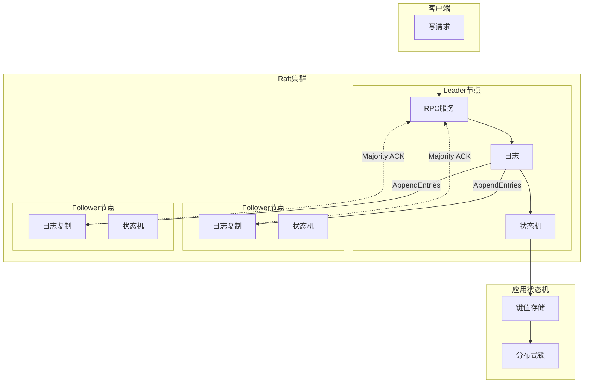

# 08 Distributed Consensus - 分布式共识算法

> **难度等级**: L4-L5 | **预估学习时间**: 25-35小时 | **前置知识**: 网络编程、并发编程、数据结构与算法

---

## 技术概述

分布式共识算法是分布式系统的核心基础，解决在可能存在故障节点和网络分区的情况下，如何让多个节点就某个值达成一致的问题。
本模块深入讲解两种最重要的共识算法：Raft和Paxos，涵盖算法原理、C语言实现以及工程实践要点。

### 核心概念

| 概念 | 说明 | 特点 |
|:-----|:-----|:-----|
| **Raft** | 为可理解性设计的共识算法 | 强领导者、日志复制 |
| **Paxos** | Leslie Lamport提出的经典共识算法 | 理论优雅、实现复杂 |
| **CAP定理** | 一致性/可用性/分区容错性权衡 | 分布式系统设计原则 |

### 共识算法分类

```text
分布式共识算法
├── 崩溃容错 (Crash Fault Tolerance)
│   ├── 同步系统: 简单多数表决
│   └── 异步系统
│       ├── Paxos (经典)
│       ├── Raft (易理解)
│       ├── Zab (ZooKeeper使用)
│       └── Viewstamped Replication
└── 拜占庭容错 (BFT)
    ├── PBFT (实用拜占庭容错)
    └── Tendermint (区块链共识)
```

---

## 应用场景

### 1. 分布式键值存储

etcd、Consul、ZooKeeper等分布式协调服务。

### 2. 分布式数据库

TiDB、CockroachDB等NewSQL数据库使用Multi-Raft实现强一致性。

### 3. 配置管理与服务发现

Kubernetes使用etcd存储所有集群状态。

### 4. 区块链共识

联盟链和公链使用BFT变体实现去中心化共识。

### 5. 日志复制系统

MySQL Group Replication等使用共识算法保证副本一致性。

---

## 文档列表

| 文件 | 主题 | 难度 | 核心内容 |
|:-----|:-----|:----:|:---------|
| [01_Raft_Core.md](./01_Raft_Core.md) | Raft核心算法 | L4 | 领导者选举、日志复制、安全性证明、成员变更 |
| [02_Paxos_Implementation.md](./02_Paxos_Implementation.md) | Paxos实现 | L5 | Basic Paxos、Multi-Paxos、Learner、活锁处理 |

---

## 参考开源项目

### Raft实现

| 项目 | 语言 | 特点 | 链接 |
|:-----|:-----|:-----|:-----|
| **etcd/raft** | Go | 最广泛使用的Raft库 | <https://github.com/etcd-io/raft> |
| **hashicorp/raft** | Go | HashiCorp出品 | <https://github.com/hashicorp/raft> |
| **braft** | C++ | 百度开源，高并发场景 | <https://github.com/baidu/braft> |
| **raft** (Canonical) | C | Linux容器中使用 | <https://github.com/canonical/raft> |

### Paxos实现

| 项目 | 语言 | 特点 | 链接 |
|:-----|:-----|:-----|:-----|
| **phxpaxos** | C++ | 微信开源生产级Paxos库 | <https://github.com/Tencent/phxpaxos> |
| **libpaxos** | C | 学术研究实现 | <https://github.com/denissheeran/libpaxos> |

### 分布式系统参考

| 项目 | 语言 | 特点 | 链接 |
|:-----|:-----|:-----|:-----|
| **etcd** | Go | Kubernetes使用的键值存储 | <https://github.com/etcd-io/etcd> |
| **TiKV** | Rust | TiDB的分布式存储层 | <https://github.com/tikv/tikv> |
| **ZooKeeper** | Java | 使用Zab协议的协调服务 | <https://github.com/apache/zookeeper> |
| **Consul** | Go | HashiCorp的服务发现 | <https://github.com/hashicorp/consul> |

---

## 技术架构图



---

## 核心算法速查

### Raft领导者选举

```c
typedef enum { FOLLOWER, CANDIDATE, LEADER } raft_state_t;

typedef struct {
    raft_state_t state;
    uint64_t current_term;
    int voted_for;
    int node_id;
    uint32_t election_timeout;
    uint64_t last_heartbeat;
} raft_node_t;

void raft_tick(raft_node_t* node) {
    uint64_t now = get_time_ms();
    if ((node->state == FOLLOWER || node->state == CANDIDATE) &&
        now - node->last_heartbeat > node->election_timeout) {
        become_candidate(node);
    }
}

void become_candidate(raft_node_t* node) {
    node->state = CANDIDATE;
    node->current_term++;
    node->voted_for = node->node_id;
    // 向所有节点请求投票
    for (int i = 0; i < node->node_count; i++)
        if (i != node->node_id) request_vote(node, i);
    // 获得多数票则成为领导者
    if (votes > node->node_count / 2) become_leader(node);
}
```

### 日志复制机制

```c
bool handle_append_entries(raft_node_t* node, append_entries_req_t* req) {
    if (req->term < node->current_term) return false;
    node->last_heartbeat = get_time_ms();
    node->state = FOLLOWER;

    // 日志一致性检查
    if (!log_contains(node->log, req->prev_log_index, req->prev_log_term))
        return false;

    // 追加条目并推进提交索引
    for (int i = 0; i < req->entry_count; i++)
        log_append(node->log, &req->entries[i]);

    if (req->leader_commit > node->commit_index)
        apply_committed_entries(node);
    return true;
}
```

---

## 算法对比

| 特性 | Raft | Multi-Paxos |
|:-----|:-----|:------------|
| 可理解性 | ⭐⭐⭐⭐⭐ | ⭐⭐⭐ |
| 实现复杂度 | 中等 | 较高 |
| 领导者选举 | 明确且独立 | 隐含在提案中 |
| 日志复制 | 强领导者模型 | 类似Raft |
| 成员变更 | Joint Consensus | 复杂协商 |
| 工业应用 | etcd, Consul | Chubby, PaxosStore |

---

## 关联知识

| 目标 | 路径 |
|:-----|:-----|
| 返回上层 | [03_System_Technology_Domains](../README.md) |
| 网络编程 | [15_Network_Programming](../15_Network_Programming/README.md) |
| 并发编程 | [14_Concurrency_Parallelism](../14_Concurrency_Parallelism/README.md) |
| 高性能日志 | [09_High_Performance_Log](../09_High_Performance_Log/README.md) |
| 核心基础 | [01_Core_Knowledge_System](../../01_Core_Knowledge_System/README.md) |

---

## 推荐学习资源

### 经典论文

- "In Search of an Understandable Consensus Algorithm" - Diego Ongaro (Raft)
- "The Part-Time Parliament" - Leslie Lamport (Paxos)
- "Paxos Made Simple" - Leslie Lamport

### 在线资源

- Raft可视化演示: <https://raft.github.io/>
- The Secret Lives of Data (Raft图解)

### 书籍

- 《Designing Data-Intensive Applications》 - Martin Kleppmann

---

> **最后更新**: 2026-03-10
>
> **维护者**: C语言知识库团队
