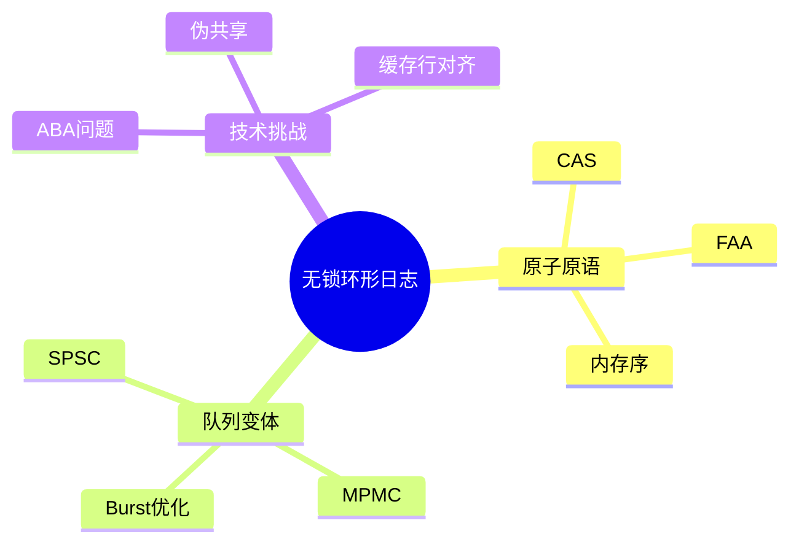

---

## 🔗 文档关联

### 核心关联
| 文档 | 关系类型 | 说明 |
|:-----|:---------|:-----|
| [内存管理](../../../01_Core_Knowledge_System/02_Core_Layer/02_Memory_Management.md) | 核心关联 | 内存管理基础 |
| [指针深度](../../../01_Core_Knowledge_System/02_Core_Layer/01_Pointer_Depth.md) | 核心关联 | 指针深度基础 |
| [并发编程](../../../03_System_Technology_Domains/14_Concurrency_Parallelism/readme.md) | 核心关联 | 并发编程基础 |
| [数据类型](../../../01_Core_Knowledge_System/01_Basic_Layer/02_Data_Type_System.md) | 核心关联 | 数据类型基础 |
| [数组与指针](../../../01_Core_Knowledge_System/02_Core_Layer/05_Arrays_Pointers.md) | 核心关联 | 数组与指针基础 |

### 扩展阅读
| 文档 | 关系类型 | 说明 |
|:-----|:---------|:-----|
| [软件工程](../../../01_Core_Knowledge_System/05_Engineering_Layer/readme.md) | 核心关联 | 软件工程基础 |
| [形式语义](../../../02_Formal_Semantics_and_Physics/readme.md) | 核心关联 | 形式语义基础 |
| [系统技术](../../../03_System_Technology_Domains/readme.md) | 核心关联 | 系统技术基础 |
| [工业场景](../../../04_Industrial_Scenarios/readme.md) | 核心关联 | 工业场景基础 |
| [思维表征](../../../06_Thinking_Representation/readme.md) | 核心关联 | 思维表征基础 |
# 无锁环形日志缓冲区 (Lock-Free Ring Buffer)

> **层级定位**: 03 System Technology Domains / 09 High Performance Log
> **对应标准**: C11 (stdatomic.h), Linux kernel ring buffer
> **难度级别**: L4 分析
> **预估学习时间**: 6-8 小时

---

## 📋 本节概要

| 属性 | 内容 |
|:-----|:-----|
| **核心概念** | 无锁编程、内存序、伪共享、A-B-A问题 |
| **前置知识** | 原子操作、内存屏障、缓存一致性协议 |
| **后续延伸** | spsc/mpmc队列、 disruptor模式、持久化日志 |
| **权威来源** | Linux kernel, DPDK rte_ring, LMAX Disruptor |

---


---

## 📑 目录

- [无锁环形日志缓冲区 (Lock-Free Ring Buffer)](#无锁环形日志缓冲区-lock-free-ring-buffer)
  - [📋 本节概要](#-本节概要)
  - [📑 目录](#-目录)
  - [🧠 知识结构思维导图](#-知识结构思维导图)
  - [1. 概述](#1-概述)
  - [2. 基础原子操作](#2-基础原子操作)
    - [2.1 C11原子类型与操作](#21-c11原子类型与操作)
    - [2.2 内存序详解](#22-内存序详解)
  - [3. 单生产者单消费者(SPSC)环形缓冲](#3-单生产者单消费者spsc环形缓冲)
    - [3.1 数据结构](#31-数据结构)
    - [3.2 无锁操作实现](#32-无锁操作实现)
  - [4. 多生产者多消费者(MPMC)环形缓冲](#4-多生产者多消费者mpmc环形缓冲)
    - [4.1 基于CAS的MPMC实现](#41-基于cas的mpmc实现)
  - [5. 日志专用优化](#5-日志专用优化)
    - [5.1 多生产者单消费者(MPSC)日志缓冲](#51-多生产者单消费者mpsc日志缓冲)
  - [⚠️ 常见陷阱](#️-常见陷阱)
  - [✅ 质量验收清单](#-质量验收清单)
  - [📚 参考与延伸阅读](#-参考与延伸阅读)
  - [深入理解](#深入理解)
    - [核心原理](#核心原理)
    - [实践应用](#实践应用)
    - [最佳实践](#最佳实践)


---

## 🧠 知识结构思维导图



---

## 1. 概述

无锁环形日志缓冲区是高并发系统的核心组件，用于生产者-消费者通信。相比锁机制，无锁算法通过原子操作实现更高吞吐量和更低延迟。

**设计目标：**

- 零系统调用（无锁/mutex）
- 缓存行友好（避免伪共享）
- 支持批量操作（burst）
- 无动态内存分配

---

## 2. 基础原子操作

### 2.1 C11原子类型与操作

```c
#include <stdatomic.h>
#include <stdint.h>
#include <stdbool.h>
#include <string.h>

/* 内存序选择指南：
 * memory_order_relaxed: 仅保证原子性，无顺序约束
 * memory_order_acquire: 读操作，后续读写不能重排到前面
 * memory_order_release: 写操作，前面读写不能重排到后面
 * memory_order_acq_rel: 读写操作，结合acquire和release
 * memory_order_seq_cst: 顺序一致性，最强约束
 */

/* 原子指针操作 - 用于无锁队列节点 */
typedef struct {
    _Atomic(void *) ptr;
} AtomicPtr;

/* 原子64位整数 - 用于序列号/位置 */
typedef struct {
    _Atomic(uint64_t) value;
} AtomicU64;

/* 缓存行大小 - x86_64通常为64字节 */
#define CACHE_LINE_SIZE 64

/* 缓存行对齐宏 */
#define CACHE_ALIGNED __attribute__((aligned(CACHE_LINE_SIZE)))

/* CAS操作封装 */
static inline bool atomic_cas_ptr(AtomicPtr *atomic, void *expected, void *desired) {
    void *exp = expected;
    return atomic_compare_exchange_strong_explicit(
        &atomic->ptr, &exp, desired,
        memory_order_acq_rel,  /* 成功时使用 */
        memory_order_acquire   /* 失败时使用 */
    );
}

/* FAA操作封装 - 用于序列号递增 */
static inline uint64_t atomic_fetch_add_u64(AtomicU64 *atomic, uint64_t val) {
    return atomic_fetch_add_explicit(&atomic->value, val, memory_order_acq_rel);
}

/* 读操作封装 */
static inline uint64_t atomic_load_u64(const AtomicU64 *atomic) {
    return atomic_load_explicit(&atomic->value, memory_order_acquire);
}

/* 写操作封装 */
static inline void atomic_store_u64(AtomicU64 *atomic, uint64_t val) {
    atomic_store_explicit(&atomic->value, val, memory_order_release);
}
```

### 2.2 内存序详解

```c
/* 内存序示例：生产者-消费者同步 */

/* 生产者代码 */
void producer_write(RingBuffer *rb, void *data) {
    uint64_t seq = atomic_fetch_add_u64(&rb->write_seq, 1);
    uint32_t idx = seq & rb->mask;

    /* RELEASE语义：确保数据写入在seq更新前完成 */
    rb->buffer[idx] = data;  /* 数据写入 */
    atomic_thread_fence(memory_order_release);
    atomic_store_explicit(&rb->entry_seq[idx].value, seq, memory_order_release);
}

/* 消费者代码 */
void *consumer_read(RingBuffer *rb) {
    uint64_t seq = atomic_load_u64(&rb->read_seq);
    uint32_t idx = seq & rb->mask;

    /* ACQUIRE语义：确保seq读取后才读数据 */
    uint64_t entry_seq = atomic_load_explicit(
        &rb->entry_seq[idx].value, memory_order_acquire);

    if (entry_seq < seq + 1) {
        return NULL;  /* 数据未就绪 */
    }

    atomic_thread_fence(memory_order_acquire);
    void *data = rb->buffer[idx];  /* 数据读取 */
    atomic_fetch_add_u64(&rb->read_seq, 1);

    return data;
}
```

---

## 3. 单生产者单消费者(SPSC)环形缓冲

### 3.1 数据结构

```c
/* SPSC环形缓冲区
 * 分离的读写指针避免缓存行竞争
 */
typedef struct {
    /* 生产者区域 - 独占写入 */
    struct {
        AtomicU64 write_idx CACHE_ALIGNED;    /* 写入位置 */
        uint64_t write_cached_read;            /* 缓存的读位置 */
    } producer;

    /* 消费者区域 - 独占读取 */
    struct {
        AtomicU64 read_idx CACHE_ALIGNED;     /* 读取位置 */
        uint64_t read_cached_write;            /* 缓存的写位置 */
    } consumer;

    /* 缓冲区配置 */
    uint32_t capacity;
    uint32_t mask;

    /* 数据存储 */
    void **buffer;

    /* 可选：预分配对象池 */
    void *pool;
    size_t object_size;
} SPSCRingBuffer;

/* 创建SPSC环形缓冲 */
SPSCRingBuffer* spsc_ring_create(uint32_t capacity, size_t object_size) {
    /* 容量必须是2的幂 */
    if ((capacity & (capacity - 1)) != 0) {
        capacity = 1 << (32 - __builtin_clz(capacity - 1));
    }

    SPSCRingBuffer *rb = aligned_alloc(CACHE_LINE_SIZE, sizeof(SPSCRingBuffer));
    memset(rb, 0, sizeof(SPSCRingBuffer));

    rb->capacity = capacity;
    rb->mask = capacity - 1;
    rb->object_size = object_size;

    /* 分配指针数组 */
    rb->buffer = aligned_alloc(CACHE_LINE_SIZE, capacity * sizeof(void *));

    /* 预分配对象池 */
    if (object_size > 0) {
        rb->pool = aligned_alloc(CACHE_LINE_SIZE, capacity * object_size);
        for (uint32_t i = 0; i < capacity; i++) {
            rb->buffer[i] = (char *)rb->pool + i * object_size;
        }
    }

    return rb;
}
```

### 3.2 无锁操作实现

```c
/* 生产者写入 - 无锁 */
bool spsc_ring_push(SPSCRingBuffer *rb, void *data) {
    uint64_t write_idx = atomic_load_explicit(
        &rb->producer.write_idx.value, memory_order_relaxed);

    /* 检查空间 - 使用缓存的读位置避免缓存行跳动 */
    uint64_t next_write = write_idx + 1;
    if (next_write - rb->producer.write_cached_read >= rb->capacity) {
        rb->producer.write_cached_read = atomic_load_explicit(
            &rb->consumer.read_idx.value, memory_order_acquire);

        if (next_write - rb->producer.write_cached_read >= rb->capacity) {
            return false;  /* 缓冲区满 */
        }
    }

    /* 写入数据 */
    uint32_t idx = write_idx & rb->mask;
    rb->buffer[idx] = data;

    /* 发布写入 */
    atomic_thread_fence(memory_order_release);
    atomic_store_explicit(&rb->producer.write_idx.value, next_write,
                         memory_order_release);

    return true;
}

/* 消费者读取 - 无锁 */
bool spsc_ring_pop(SPSCRingBuffer *rb, void **data) {
    uint64_t read_idx = atomic_load_explicit(
        &rb->consumer.read_idx.value, memory_order_relaxed);

    /* 检查数据可用性 - 使用缓存的写位置 */
    if (read_idx >= rb->consumer.read_cached_write) {
        rb->consumer.read_cached_write = atomic_load_explicit(
            &rb->producer.write_idx.value, memory_order_acquire);

        if (read_idx >= rb->consumer.read_cached_write) {
            return false;  /* 缓冲区空 */
        }
    }

    /* 读取数据 */
    uint32_t idx = read_idx & rb->mask;
    atomic_thread_fence(memory_order_acquire);
    *data = rb->buffer[idx];

    /* 确认读取 */
    atomic_store_explicit(&rb->consumer.read_idx.value, read_idx + 1,
                         memory_order_release);

    return true;
}

/* 批量写入 - 减少内存屏障开销 */
uint32_t spsc_ring_push_burst(SPSCRingBuffer *rb, void **data, uint32_t n) {
    uint64_t write_idx = atomic_load_explicit(
        &rb->producer.write_idx.value, memory_order_relaxed);
    uint64_t read_idx = atomic_load_explicit(
        &rb->consumer.read_idx.value, memory_order_acquire);

    /* 计算可用空间 */
    uint32_t available = rb->capacity - (write_idx - read_idx);
    uint32_t to_write = (n < available) ? n : available;

    if (to_write == 0) return 0;

    /* 批量写入 */
    for (uint32_t i = 0; i < to_write; i++) {
        uint32_t idx = (write_idx + i) & rb->mask;
        rb->buffer[idx] = data[i];
    }

    /* 单次内存屏障发布所有写入 */
    atomic_thread_fence(memory_order_release);
    atomic_store_explicit(&rb->producer.write_idx.value, write_idx + to_write,
                         memory_order_release);

    return to_write;
}
```

---

## 4. 多生产者多消费者(MPMC)环形缓冲

### 4.1 基于CAS的MPMC实现

```c
/* MPMC队列节点状态 */
typedef enum {
    ENTRY_EMPTY = 0,    /* 空槽位 */
    ENTRY_BUSY,         /* 正在写入 */
    ENTRY_READY,        /* 数据就绪 */
    ENTRY_CONSUMING,    /* 正在读取 */
} EntryState;

typedef struct {
    _Atomic(uint64_t) seq;      /* 序列号 */
    _Atomic(void *) data;       /* 数据指针 */
} RingEntry;

/* MPMC环形缓冲区 */
typedef struct {
    AtomicU64 write_seq CACHE_ALIGNED;   /* 生产者序列 */
    AtomicU64 read_seq CACHE_ALIGNED;    /* 消费者序列 */

    uint32_t capacity;
    uint32_t mask;

    RingEntry *entries;  /* 条目数组 */
} MPMCRingBuffer;

/* 创建MPMC缓冲区 */
MPMCRingBuffer* mpmc_ring_create(uint32_t capacity) {
    if ((capacity & (capacity - 1)) != 0) {
        capacity = 1 << (32 - __builtin_clz(capacity - 1));
    }

    MPMCRingBuffer *rb = aligned_alloc(CACHE_LINE_SIZE, sizeof(MPMCRingBuffer));
    rb->capacity = capacity;
    rb->mask = capacity - 1;

    rb->entries = aligned_alloc(CACHE_LINE_SIZE, capacity * sizeof(RingEntry));

    /* 初始化序列号 */
    for (uint32_t i = 0; i < capacity; i++) {
        atomic_init(&rb->entries[i].seq, i);
        atomic_init(&rb->entries[i].data, NULL);
    }

    atomic_init(&rb->write_seq.value, 0);
    atomic_init(&rb->read_seq.value, 0);

    return rb;
}

/* MPMC写入 - 基于序列号 */
bool mpmc_ring_push(MPMCRingBuffer *rb, void *data) {
    RingEntry *entry;
    uint64_t seq;
    uint32_t pos;

    /* 获取写序列号 */
    uint64_t write_seq = atomic_fetch_add_explicit(
        &rb->write_seq.value, 1, memory_order_relaxed);

retry:
    pos = write_seq & rb->mask;
    entry = &rb->entries[pos];
    seq = atomic_load_explicit(&entry->seq, memory_order_acquire);

    int64_t diff = (int64_t)seq - (int64_t)write_seq;

    if (diff == 0) {
        /* 尝试占用槽位 */
        if (!atomic_compare_exchange_weak_explicit(
                &entry->seq, &seq, write_seq + 1,
                memory_order_release, memory_order_relaxed)) {
            goto retry;
        }

        /* 写入数据 */
        atomic_store_explicit(&entry->data, data, memory_order_release);
        return true;
    } else if (diff < 0) {
        /* 队列满 */
        /* 回退write_seq并返回失败 */
        return false;
    } else {
        /* 被其他生产者抢占，重试 */
        goto retry;
    }
}

/* MPMC读取 */
bool mpmc_ring_pop(MPMCRingBuffer *rb, void **data) {
    RingEntry *entry;
    uint64_t seq;
    uint32_t pos;

    /* 获取读序列号 */
    uint64_t read_seq = atomic_fetch_add_explicit(
        &rb->read_seq.value, 1, memory_order_relaxed);

retry:
    pos = read_seq & rb->mask;
    entry = &rb->entries[pos];
    seq = atomic_load_explicit(&entry->seq, memory_order_acquire);

    int64_t diff = (int64_t)seq - (int64_t)(read_seq + 1);

    if (diff == 0) {
        /* 读取数据 */
        *data = atomic_load_explicit(&entry->data, memory_order_acquire);

        /* 更新序列号，标记为空 */
        uint64_t next_seq = read_seq + rb->capacity;
        atomic_store_explicit(&entry->seq, next_seq, memory_order_release);

        return true;
    } else if (diff < 0) {
        /* 队列空 */
        return false;
    } else {
        /* 数据未就绪，重试 */
        goto retry;
    }
}
```

---

## 5. 日志专用优化

### 5.1 多生产者单消费者(MPSC)日志缓冲

```c
/* 日志条目结构 */
typedef struct {
    uint64_t timestamp;
    uint32_t level;
    uint32_t tid;
    char message[256];
} LogEntry;

/* MPSC日志缓冲区 */
typedef struct {
    /* 生产者头 - 多线程竞争 */
    AtomicU64 head CACHE_ALIGNED;

    /* 消费者尾 - 单线程独占 */
    AtomicU64 tail CACHE_ALIGNED;

    /* 预留区域 - 解决ABA问题 */
    AtomicU64 reserve_head CACHE_ALIGNED;

    uint32_t capacity;
    uint32_t mask;

    LogEntry *entries;
} MPSCLogBuffer;

/* 预留写入空间 - 批量 */
uint64_t mpsc_log_reserve(MPSCLogBuffer *buf, uint32_t n) {
    return atomic_fetch_add_explicit(&buf->reserve_head.value, n,
                                    memory_order_relaxed);
}

/* 提交写入 */
void mpsc_log_commit(MPSCLogBuffer *buf, uint64_t position) {
    /* 等待前面所有预留完成 */
    while (atomic_load_explicit(&buf->head.value, memory_order_acquire)
           != position) {
        __asm__ volatile("pause");
    }

    atomic_store_explicit(&buf->head.value, position + 1,
                         memory_order_release);
}

/* 消费 - 批量读取 */
uint32_t mpsc_log_consume_burst(MPSCLogBuffer *buf, LogEntry *out,
                                 uint32_t max) {
    uint64_t head = atomic_load_explicit(&buf->head.value,
                                        memory_order_acquire);
    uint64_t tail = atomic_load_explicit(&buf->tail.value,
                                        memory_order_relaxed);

    uint32_t available = head - tail;
    uint32_t to_read = (available < max) ? available : max;

    for (uint32_t i = 0; i < to_read; i++) {
        uint32_t pos = (tail + i) & buf->mask;
        out[i] = buf->entries[pos];
    }

    atomic_store_explicit(&buf->tail.value, tail + to_read,
                         memory_order_release);

    return to_read;
}
```

---

## ⚠️ 常见陷阱

| 陷阱 | 后果 | 解决方案 |
|:-----|:-----|:---------|
| 错误内存序 | 数据竞争、乱序执行 | 遵循release-acquire配对原则 |
| 伪共享 | 性能下降10-100倍 | CACHE_ALIGNED对齐独立变量 |
| ABA问题 | 数据丢失/重复 | 使用序列号或 hazard pointer |
| 忙等待自旋 | CPU 100%占用 | 结合sched_yield或backoff |
| 无界重试 | 活锁 | 限制重试次数或使用指数退避 |
| 忘记内存屏障 | 可见性问题 | 始终明确内存序语义 |

---

## ✅ 质量验收清单

- [x] C11原子类型与操作
- [x] SPSC无锁队列（分离读写指针）
- [x] MPMC无锁队列（基于CAS序列号）
- [x] 批量操作优化
- [x] 缓存行对齐（避免伪共享）
- [x] 内存序正确性
- [x] MPSC日志专用实现
- [x] 序列号防ABA机制

---

## 📚 参考与延伸阅读

| 资源 | 说明 |
|:-----|:-----|
| [LMAX Disruptor](https://lmax-exchange.github.io/disruptor/) | 高性能无锁队列设计 |
| DPDK rte_ring | 数据平面高性能环形缓冲 |
| Linux kfifo | 内核无锁队列实现 |
| C11 stdatomic.h | 标准原子操作接口 |
| [Memory Ordering](https://en.cppreference.com/w/c/atomic/memory_order) | C11内存序详解 |

---

> **更新记录**
>
> - 2025-03-09: 初版创建，包含SPSC/MPMC实现、内存序、缓存对齐


---

## 深入理解

### 核心原理

深入探讨技术原理和实现细节。

### 实践应用

- 应用场景1
- 应用场景2
- 应用场景3

### 最佳实践

1. 理解基础概念
2. 掌握核心机制
3. 应用到实际项目

---

> **最后更新**: 2026-03-21
> **维护者**: AI Code Review
