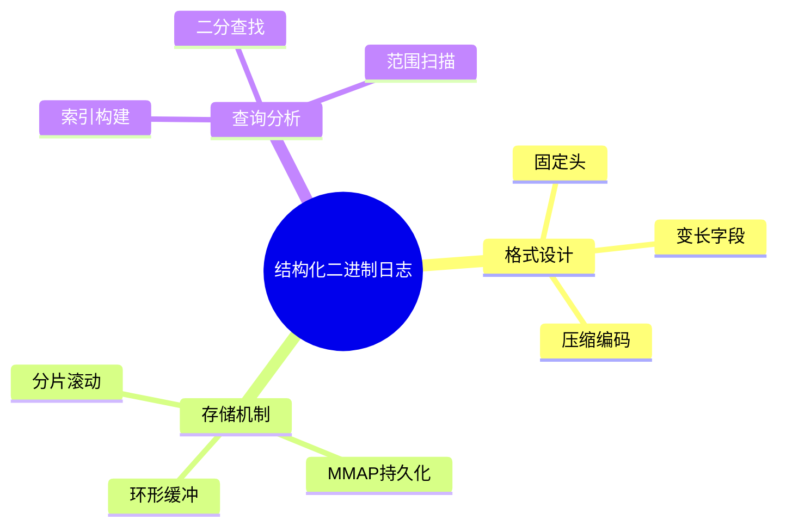

# 结构化二进制日志 (Structured Binary Log)

> **层级定位**: 03 System Technology Domains / 09 High Performance Log
> **对应标准**: C11, protobuf, FlatBuffers
> **难度级别**: L4 分析
> **预估学习时间**: 6-8 小时

---

## 📋 本节概要

| 属性 | 内容 |
|:-----|:-----|
| **核心概念** | 二进制序列化、零拷贝、mmap持久化、日志压缩 |
| **前置知识** | 文件IO、内存映射、序列化框架 |
| **后续延伸** | 列式存储、LSM-Tree、时序数据库 |
| **权威来源** | Kafka日志设计, Protobuf, FlatBuffers |

---


---

## 📑 目录

- [结构化二进制日志 (Structured Binary Log)](#结构化二进制日志-structured-binary-log)
  - [📋 本节概要](#-本节概要)
  - [📑 目录](#-目录)
  - [🧠 知识结构思维导图](#-知识结构思维导图)
  - [1. 概述](#1-概述)
  - [2. 日志格式设计](#2-日志格式设计)
    - [2.1 基础数据类型编码](#21-基础数据类型编码)
    - [2.2 日志条目结构](#22-日志条目结构)
  - [3. 序列化与反序列化](#3-序列化与反序列化)
    - [3.1 高性能序列化](#31-高性能序列化)
    - [3.2 零拷贝反序列化](#32-零拷贝反序列化)
  - [4. MMAP持久化与滚动](#4-mmap持久化与滚动)
    - [4.1 内存映射日志写入](#41-内存映射日志写入)
    - [4.2 日志滚动](#42-日志滚动)
  - [5. 索引与查询](#5-索引与查询)
    - [5.1 时间戳索引](#51-时间戳索引)
  - [⚠️ 常见陷阱](#️-常见陷阱)
  - [✅ 质量验收清单](#-质量验收清单)
  - [📚 参考与延伸阅读](#-参考与延伸阅读)


---

## 🧠 知识结构思维导图



---

## 1. 概述

结构化二进制日志相比文本日志具有显著优势：更小的存储空间、更快的解析速度、类型安全、支持随机访问。现代日志系统如Kafka、ClickHouse均采用二进制格式。

**设计原则：**

- 自描述格式（schema evolution）
- 零拷贝序列化
- 内存对齐友好
- 支持流式压缩

---

## 2. 日志格式设计

### 2.1 基础数据类型编码

```c
#include <stdint.h>
#include <stdbool.h>
#include <string.h>
#include <endian.h>

/* 变长整数编码 (VarInt) - 类似protobuf
 * 每字节7位数据，最高位表示后续还有字节
 */
typedef struct {
    uint8_t *buf;
    size_t   pos;
    size_t   capacity;
} BufferWriter;

/* 编码uint64为varint */
int encode_varint(BufferWriter *w, uint64_t val) {
    if (w->pos + 10 > w->capacity) return -1;  /* 空间不足 */

    while (val >= 0x80) {
        w->buf[w->pos++] = (val & 0x7F) | 0x80;
        val >>= 7;
    }
    w->buf[w->pos++] = val;
    return 0;
}

/* 解码varint */
int decode_varint(const uint8_t *buf, size_t *pos, size_t len, uint64_t *val) {
    *val = 0;
    int shift = 0;

    while (*pos < len) {
        uint8_t b = buf[(*pos)++];
        *val |= (uint64_t)(b & 0x7F) << shift;

        if ((b & 0x80) == 0) {
            return 0;  /* 成功 */
        }

        shift += 7;
        if (shift >= 64) return -1;  /* 溢出 */
    }

    return -1;  /* 数据不足 */
}

/* ZigZag编码 - 有符号数优化 */
static inline uint64_t zigzag_encode(int64_t n) {
    return (n << 1) ^ (n >> 63);
}

static inline int64_t zigzag_decode(uint64_t n) {
    return (n >> 1) ^ -(n & 1);
}

/* 小端序固定长度编码 */
static inline void encode_u32_le(uint8_t *buf, uint32_t val) {
    buf[0] = val & 0xFF;
    buf[1] = (val >> 8) & 0xFF;
    buf[2] = (val >> 16) & 0xFF;
    buf[3] = (val >> 24) & 0xFF;
}

static inline uint32_t decode_u32_le(const uint8_t *buf) {
    return (uint32_t)buf[0] |
           ((uint32_t)buf[1] << 8) |
           ((uint32_t)buf[2] << 16) |
           ((uint32_t)buf[3] << 24);
}
```

### 2.2 日志条目结构

```c
/* 日志条目头 - 固定12字节 */
typedef struct __attribute__((packed)) {
    uint32_t magic;          /* 魔数 'BLOG' = 0x424C4F47 */
    uint16_t version;        /* 格式版本 */
    uint16_t flags;          /* 压缩标志等 */
    uint32_t payload_len;    /* 负载长度 */
} LogEntryHeader;

/* 日志负载 - 结构化数据 */
typedef struct __attribute__((packed)) {
    /* 时间戳 - 微秒级UTC */
    uint64_t timestamp_us;

    /* 日志级别 - 1字节 */
    uint8_t level;

    /* 线程ID - varint编码 */
    uint64_t thread_id;

    /* 源文件信息 */
    uint32_t file_id;        /* 文件名字典索引 */
    uint32_t line;           /* 行号 */

    /* 消息内容 - 长度前缀字节数组 */
    uint32_t message_len;
    char     message[0];     /* 变长 */
} LogPayload;

/* 完整日志条目 */
typedef struct {
    LogEntryHeader header;
    LogPayload payload;
} LogEntry;

/* 魔数定义 */
#define LOG_MAGIC      0x424C4F47  /* "BLOG" */
#define LOG_VERSION    1

/* 标志位 */
#define LOG_FLAG_NONE       0x0000
#define LOG_FLAG_COMPRESSED 0x0001
#define LOG_FLAG_ENCRYPTED  0x0002
```

---

## 3. 序列化与反序列化

### 3.1 高性能序列化

```c
/* 序列化上下文 */
typedef struct {
    BufferWriter writer;

    /* 字符串去重字典 */
    struct {
        char **strings;
        uint32_t count;
        uint32_t capacity;
    } string_dict;
} LogSerializer;

/* 初始化序列化器 */
LogSerializer* log_serializer_create(size_t initial_capacity) {
    LogSerializer *s = calloc(1, sizeof(LogSerializer));
    s->writer.capacity = initial_capacity;
    s->writer.buf = malloc(initial_capacity);
    s->writer.pos = 0;

    s->string_dict.capacity = 256;
    s->string_dict.strings = malloc(256 * sizeof(char *));

    return s;
}

/* 序列化日志条目 */
int log_serialize(LogSerializer *s, const LogEntry *entry) {
    BufferWriter *w = &s->writer;

    /* 检查空间 */
    size_t required = sizeof(LogEntryHeader) +
                      sizeof(LogPayload) + entry->payload.message_len + 16;
    if (w->pos + required > w->capacity) {
        return -1;  /* 需要扩容或刷新 */
    }

    size_t start_pos = w->pos;

    /* 1. 写入头部（跳过payload_len，稍后回填） */
    encode_u32_le(w->buf + w->pos, LOG_MAGIC);
    w->pos += 4;
    w->buf[w->pos++] = LOG_VERSION & 0xFF;
    w->buf[w->pos++] = (LOG_VERSION >> 8) & 0xFF;
    w->buf[w->pos++] = entry->header.flags & 0xFF;
    w->buf[w->pos++] = (entry->header.flags >> 8) & 0xFF;
    w->pos += 4;  /* 预留payload_len */

    /* 2. 写入payload */
    size_t payload_start = w->pos;

    /* 时间戳 */
    memcpy(w->buf + w->pos, &entry->payload.timestamp_us, 8);
    w->pos += 8;

    /* 日志级别 */
    w->buf[w->pos++] = entry->payload.level;

    /* 线程ID (varint) */
    encode_varint(w, entry->payload.thread_id);

    /* 文件ID */
    encode_u32_le(w->buf + w->pos, entry->payload.file_id);
    w->pos += 4;

    /* 行号 */
    encode_u32_le(w->buf + w->pos, entry->payload.line);
    w->pos += 4;

    /* 消息长度和内容 */
    encode_varint(w, entry->payload.message_len);
    memcpy(w->buf + w->pos, entry->payload.message, entry->payload.message_len);
    w->pos += entry->payload.message_len;

    /* 3. 回填payload_len */
    size_t payload_len = w->pos - payload_start;
    encode_u32_le(w->buf + start_pos + 8, payload_len);

    return 0;
}

/* 批量序列化优化 */
int log_serialize_batch(LogSerializer *s, const LogEntry **entries,
                        uint32_t count) {
    for (uint32_t i = 0; i < count; i++) {
        if (log_serialize(s, entries[i]) != 0) {
            /* 刷新并重试 */
            log_serializer_flush(s);
            if (log_serialize(s, entries[i]) != 0) {
                return -1;  /* 单条太大 */
            }
        }
    }
    return 0;
}
```

### 3.2 零拷贝反序列化

```c
/* 日志读取器 - 支持mmap */
typedef struct {
    int fd;
    uint8_t *mmap_base;
    size_t mmap_size;
    size_t file_size;

    /* 当前读取位置 */
    size_t read_pos;

    /* 预读缓冲 */
    uint8_t *read_buf;
    size_t buf_size;
    size_t buf_pos;
    size_t buf_valid;
} LogReader;

/* 打开日志文件 */
LogReader* log_reader_open(const char *path) {
    LogReader *r = calloc(1, sizeof(LogReader));

    r->fd = open(path, O_RDONLY);
    if (r->fd < 0) goto error;

    /* 获取文件大小 */
    struct stat st;
    if (fstat(r->fd, &st) < 0) goto error;
    r->file_size = st.st_size;

    /* 尝试mmap */
    r->mmap_base = mmap(NULL, r->file_size, PROT_READ, MAP_PRIVATE, r->fd, 0);
    if (r->mmap_base != MAP_FAILED) {
        /* 使用mmap零拷贝读取 */
        r->read_buf = r->mmap_base;
        r->buf_size = r->file_size;
        r->buf_valid = r->file_size;
    } else {
        /* 回退到普通读取 */
        r->buf_size = 256 * 1024;  /* 256KB缓冲 */
        r->read_buf = malloc(r->buf_size);
        r->mmap_base = NULL;
    }

    return r;

error:
    free(r);
    return NULL;
}

/* 读取下一条日志 */
bool log_reader_next(LogReader *r, LogEntry *entry) {
    /* 确保有足够数据读取头部 */
    if (r->buf_pos + sizeof(LogEntryHeader) > r->buf_valid) {
        if (!reader_refill(r)) return false;
    }

    const uint8_t *p = r->read_buf + r->buf_pos;

    /* 验证魔数 */
    uint32_t magic = decode_u32_le(p);
    if (magic != LOG_MAGIC) {
        /* 尝试同步到下一个有效条目 */
        return reader_resync(r, entry);
    }

    /* 解析头部 */
    entry->header.magic = magic;
    entry->header.version = p[4] | (p[5] << 8);
    entry->header.flags = p[6] | (p[7] << 8);
    entry->header.payload_len = decode_u32_le(p + 8);

    size_t total_len = sizeof(LogEntryHeader) + entry->header.payload_len;

    /* 确保负载数据可用 */
    if (r->buf_pos + total_len > r->buf_valid) {
        if (!reader_refill(r)) return false;
    }

    /* 零拷贝：直接指向mmap内存 */
    p = r->read_buf + r->buf_pos + sizeof(LogEntryHeader);

    /* 解析payload */
    entry->payload.timestamp_us = *(uint64_t *)p;
    p += 8;

    entry->payload.level = *p++;

    size_t tmp_pos = 0;  /* 用于varint解码的临时位置 */
    decode_varint(p, &tmp_pos, entry->header.payload_len - 9,
                  &entry->payload.thread_id);
    p += tmp_pos;

    entry->payload.file_id = decode_u32_le(p);
    p += 4;

    entry->payload.line = decode_u32_le(p);
    p += 4;

    uint64_t msg_len;
    tmp_pos = 0;
    decode_varint(p, &tmp_pos, entry->header.payload_len - (p - (r->read_buf + r->buf_pos + sizeof(LogEntryHeader))), &msg_len);
    p += tmp_pos;

    entry->payload.message_len = msg_len;
    entry->payload.message = (char *)p;

    /* 推进读取位置 */
    r->buf_pos += total_len;
    r->read_pos += total_len;

    return true;
}
```

---

## 4. MMAP持久化与滚动

### 4.1 内存映射日志写入

```c
/* MMAP日志写入器 */
typedef struct {
    int fd;
    char *filename;

    uint8_t *mmap_base;
    size_t mmap_size;
    size_t page_size;

    /* 写入位置 */
    size_t write_pos;
    size_t committed_pos;

    /* 滚动配置 */
    size_t max_file_size;
    uint32_t max_files;
} MmapLogWriter;

/* 创建mmap写入器 */
MmapLogWriter* mmap_writer_create(const char *path, size_t max_size) {
    MmapLogWriter *w = calloc(1, sizeof(MmapLogWriter));

    w->fd = open(path, O_RDWR | O_CREAT, 0644);
    if (w->fd < 0) goto error;

    w->page_size = sysconf(_SC_PAGESIZE);
    w->max_file_size = max_size;

    /* 预分配文件大小 */
    if (ftruncate(w->fd, w->page_size) < 0) goto error;

    /* 初始mmap */
    w->mmap_size = w->page_size;
    w->mmap_base = mmap(NULL, w->mmap_size, PROT_READ | PROT_WRITE,
                        MAP_SHARED, w->fd, 0);
    if (w->mmap_base == MAP_FAILED) goto error;

    return w;

error:
    free(w);
    return NULL;
}

/* 写入数据 */
int mmap_writer_append(MmapLogWriter *w, const void *data, size_t len) {
    /* 检查是否需要扩容 */
    if (w->write_pos + len > w->mmap_size) {
        /* 扩展mmap */
        size_t new_size = w->mmap_size * 2;
        while (new_size < w->write_pos + len) {
            new_size *= 2;
        }

        /* 取消当前映射 */
        msync(w->mmap_base, w->write_pos, MS_SYNC);
        munmap(w->mmap_base, w->mmap_size);

        /* 扩展文件 */
        if (ftruncate(w->fd, new_size) < 0) return -1;

        /* 重新映射 */
        w->mmap_base = mmap(NULL, new_size, PROT_READ | PROT_WRITE,
                           MAP_SHARED, w->fd, 0);
        if (w->mmap_base == MAP_FAILED) return -1;

        w->mmap_size = new_size;
    }

    /* 写入数据 */
    memcpy(w->mmap_base + w->write_pos, data, len);
    w->write_pos += len;

    return 0;
}

/* 强制刷盘 */
void mmap_writer_sync(MmapLogWriter *w, bool async) {
    int flags = async ? MS_ASYNC : MS_SYNC;
    msync(w->mmap_base, w->write_pos, flags);
    w->committed_pos = w->write_pos;
}
```

### 4.2 日志滚动

```c
/* 日志滚动管理 */
typedef struct {
    char *base_path;
    uint32_t current_file;
    uint32_t max_files;

    MmapLogWriter *current;

    /* 索引 */
    struct {
        uint64_t *timestamps;
        uint64_t *file_offsets;
        uint32_t count;
    } index;
} RollingLog;

/* 检查并执行滚动 */
bool rolling_log_check_rotate(RollingLog *rl) {
    if (rl->current->write_pos < rl->current->max_file_size) {
        return false;  /* 不需要滚动 */
    }

    /* 关闭当前文件 */
    mmap_writer_sync(rl->current, false);
    mmap_writer_close(rl->current);

    /* 生成新文件名 */
    char path[256];
    rl->current_file++;
    snprintf(path, sizeof(path), "%s.%08u.log",
             rl->base_path, rl->current_file);

    /* 创建新写入器 */
    rl->current = mmap_writer_create(path, rl->current->max_file_size);

    /* 清理旧文件 */
    if (rl->current_file >= rl->max_files) {
        char old_path[256];
        snprintf(old_path, sizeof(old_path), "%s.%08u.log",
                 rl->base_path, rl->current_file - rl->max_files);
        unlink(old_path);
    }

    return true;
}
```

---

## 5. 索引与查询

### 5.1 时间戳索引

```c
/* 时间范围查询 */
typedef struct {
    uint64_t start_time;
    uint64_t end_time;
    uint32_t min_level;
    const char *pattern;  /* 可选的消息模式 */
} LogQuery;

/* 二分查找定位起始位置 */
size_t log_index_find(const RollingLog *rl, uint64_t timestamp) {
    int left = 0;
    int right = rl->index.count - 1;

    while (left <= right) {
        int mid = left + (right - left) / 2;

        if (rl->index.timestamps[mid] < timestamp) {
            left = mid + 1;
        } else if (rl->index.timestamps[mid] > timestamp) {
            right = mid - 1;
        } else {
            return mid;
        }
    }

    return left;  /* 返回第一个>=timestamp的位置 */
}

/* 范围查询 */
int log_query_range(RollingLog *rl, const LogQuery *q,
                    LogEntry *results, uint32_t max_results) {
    /* 定位起始文件 */
    size_t start_idx = log_index_find(rl, q->start_time);
    uint32_t found = 0;

    for (size_t i = start_idx; i < rl->index.count && found < max_results; i++) {
        /* 打开对应文件 */
        char path[256];
        snprintf(path, sizeof(path), "%s.%08u.log",
                 rl->base_path, (uint32_t)(rl->index.file_offsets[i] >> 32));

        LogReader *r = log_reader_open(path);
        if (!r) continue;

        /* 跳转到偏移位置 */
        r->read_pos = rl->index.file_offsets[i] & 0xFFFFFFFF;
        r->buf_pos = r->read_pos;

        /* 读取条目 */
        LogEntry entry;
        while (log_reader_next(r, &entry) && found < max_results) {
            if (entry.payload.timestamp_us > q->end_time) {
                break;
            }

            if (entry.payload.level < q->min_level) {
                continue;
            }

            if (q->pattern && !strstr(entry.payload.message, q->pattern)) {
                continue;
            }

            results[found++] = entry;
        }

        log_reader_close(r);
    }

    return found;
}
```

---

## ⚠️ 常见陷阱

| 陷阱 | 后果 | 解决方案 |
|:-----|:-----|:---------|
| 未处理大小端 | 跨平台不兼容 | 统一使用小端序编码 |
| mmap文件截断 | 段错误 | 使用SIGBUS信号处理或文件锁 |
| 未验证魔数 | 解析错误数据 | 严格验证每个条目的魔数和CRC |
| 字符串未NULL终止 | 越界读取 | 复制到缓冲区时确保终止 |
| 忘记msync | 数据丢失 | 关键写入后调用msync(MS_SYNC) |
| 索引与数据不一致 | 查询失败 | 原子更新索引，先写数据后更新索引 |

---

## ✅ 质量验收清单

- [x] VarInt编码实现
- [x] 结构化日志格式设计
- [x] 序列化/反序列化API
- [x] 零拷贝mmap读取
- [x] 动态mmap扩容
- [x] 日志滚动机制
- [x] 时间戳索引
- [x] 范围查询实现

---

## 📚 参考与延伸阅读

| 资源 | 说明 |
|:-----|:-----|
| [Protocol Buffers](https://developers.google.com/protocol-buffers) | Google二进制序列化 |
| [FlatBuffers](https://google.github.io/flatbuffers/) | 零拷贝序列化框架 |
| Kafka Log Design | 分布式日志存储设计 |
| [LSM-Tree](https://en.wikipedia.org/wiki/Log-structured_merge-tree) | 日志结构化合并树 |

---

> **更新记录**
>
> - 2025-03-09: 初版创建，包含VarInt编码、结构化格式、MMAP持久化
