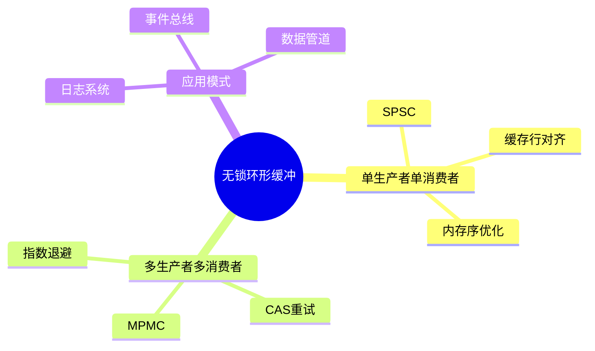

# 高性能无锁环形缓冲区

> **层级定位**: 03 System Technology Domains / 09 Performance Logging
> **对应标准**: DPDK Ring Buffer, LMAX Disruptor
> **难度级别**: L4 分析
> **预估学习时间**: 6-8 小时

---

## 📋 本节概要

| 属性 | 内容 |
|:-----|:-----|
| **核心概念** | 无锁编程、内存序、SPSC/MPMC队列、缓存行对齐 |
| **前置知识** | 原子操作、内存屏障、缓存一致性 |
| **后续延伸** | 日志系统、消息总线、IPC机制 |
| **权威来源** | DPDK, LMAX Disruptor论文 |

---

## 🧠 数据结构思维导图



---

## 📖 核心实现

### 1. 基础SPSC队列

```c
#include <stdint.h>
#include <stdatomic.h>
#include <stdbool.h>
#include <string.h>
#include <stdlib.h>

// 缓存行大小
#define CACHE_LINE_SIZE 64

// 缓存行对齐宏
#define CACHE_ALIGN __attribute__((aligned(CACHE_LINE_SIZE)))

// SPSC无锁队列
typedef struct {
    // 生产者索引（独占）
    _Atomic uint64_t head CACHE_ALIGN;

    // 消费者索引（独占）
    _Atomic uint64_t tail CACHE_ALIGN;

    // 缓冲区（位于独立缓存行）
    uint8_t *buffer;
    size_t capacity;  // 必须是2的幂
    size_t mask;
    size_t element_size;
} RingBuffer;

// 创建队列
typedef struct {
    size_t capacity;
    size_t element_size;
} RingBufferConfig;

RingBuffer* ring_buffer_create(const RingBufferConfig *config) {
    RingBuffer *rb = aligned_alloc(CACHE_LINE_SIZE, sizeof(RingBuffer));
    if (!rb) return NULL;

    // 容量向上取整到2的幂
    size_t cap = 1;
    while (cap < config->capacity) cap <<= 1;

    rb->buffer = aligned_alloc(CACHE_LINE_SIZE, cap * config->element_size);
    if (!rb->buffer) {
        free(rb);
        return NULL;
    }

    rb->capacity = cap;
    rb->mask = cap - 1;
    rb->element_size = config->element_size;

    atomic_init(&rb->head, 0);
    atomic_init(&rb->tail, 0);

    return rb;
}

// 单生产者入队
bool ring_buffer_enqueue(RingBuffer *rb, const void *data) {
    uint64_t head = atomic_load_explicit(&rb->head, memory_order_relaxed);
    uint64_t next_head = (head + 1) & rb->mask;

    // 检查队列满（预留一个位置区分满/空）
    uint64_t tail = atomic_load_explicit(&rb->tail, memory_order_acquire);
    if (next_head == tail) {
        return false;  // 队列满
    }

    // 写入数据
    memcpy(rb->buffer + head * rb->element_size, data, rb->element_size);

    // 更新head（Release保证数据可见性）
    atomic_store_explicit(&rb->head, next_head, memory_order_release);

    return true;
}

// 单消费者出队
bool ring_buffer_dequeue(RingBuffer *rb, void *data) {
    uint64_t tail = atomic_load_explicit(&rb->tail, memory_order_relaxed);

    // 检查队列空
    uint64_t head = atomic_load_explicit(&rb->head, memory_order_acquire);
    if (tail == head) {
        return false;  // 队列空
    }

    // 读取数据
    memcpy(data, rb->buffer + tail * rb->element_size, rb->element_size);

    // 更新tail
    atomic_store_explicit(&rb->tail, (tail + 1) & rb->mask, memory_order_release);

    return true;
}

// 批量入队（减少内存屏障开销）
size_t ring_buffer_enqueue_batch(RingBuffer *rb, const void *data, size_t count) {
    uint64_t head = atomic_load_explicit(&rb->head, memory_order_relaxed);
    uint64_t tail = atomic_load_explicit(&rb->tail, memory_order_acquire);

    // 计算可用空间
    size_t available = (tail + rb->capacity - head - 1) & rb->mask;
    size_t to_write = (count < available) ? count : available;

    // 批量写入
    for (size_t i = 0; i < to_write; i++) {
        uint64_t idx = (head + i) & rb->mask;
        memcpy(rb->buffer + idx * rb->element_size,
               (char*)data + i * rb->element_size,
               rb->element_size);
    }

    // 单次Release更新head
    atomic_store_explicit(&rb->head, (head + to_write) & rb->mask, memory_order_release);

    return to_write;
}
```

### 2. MPMC队列

```c
// MPMC无锁队列（基于DPDK rte_ring）
#define MP_MC_BUF_MASK  (RTE_RING_SZ_MASK)
#define MP_MC_BUF_FLAG  (1ULL << 63)  // 预留位

typedef struct {
    _Atomic uint64_t prod_head;
    _Atomic uint64_t prod_tail;
    char _pad1[CACHE_LINE_SIZE - 2 * sizeof(_Atomic uint64_t)];

    _Atomic uint64_t cons_head;
    _Atomic uint64_t cons_tail;
    char _pad2[CACHE_LINE_SIZE - 2 * sizeof(_Atomic uint64_t)];

    void *ring[];  // 柔性数组
} MPMCRing;

// 多生产者入队（批量优化）
size_t mpmc_enqueue(MPMCRing *r, void * const *obj_table, size_t n) {
    uint64_t prod_head, prod_next;
    uint64_t cons_tail;
    size_t free_entries;

    // 移动生产者头（需要CAS重试）
    do {
        prod_head = atomic_load_explicit(&r->prod_head, memory_order_relaxed);
        cons_tail = atomic_load_explicit(&r->cons_tail, memory_order_relaxed);

        // 计算空闲空间
        free_entries = (cons_tail + r->capacity - prod_head - 1);

        if (n > free_entries) {
            // 队列满或请求太大
            if (free_entries == 0) return 0;
            n = free_entries;
        }

        prod_next = prod_head + n;

        // CAS更新head
    } while (!atomic_compare_exchange_weak_explicit(
        &r->prod_head, &prod_head, prod_next,
        memory_order_relaxed, memory_order_relaxed));

    // 写入对象指针
    for (size_t i = 0; i < n; i++) {
        r->ring[(prod_head + i) & r->mask] = obj_table[i];
    }

    // 等待其他生产者完成（DPDK的"wait for tail"优化）
    while (atomic_load_explicit(&r->prod_tail, memory_order_relaxed) != prod_head) {
        // 忙等或pause指令
        __asm__ volatile ("pause" ::: "memory");
    }

    // 更新tail
    atomic_store_explicit(&r->prod_tail, prod_next, memory_order_release);

    return n;
}

// 多消费者出队
size_t mpmc_dequeue(MPMCRing *r, void **obj_table, size_t n) {
    uint64_t cons_head, cons_next;
    uint64_t prod_tail;
    size_t entries;

    // 移动消费者头
    do {
        cons_head = atomic_load_explicit(&r->cons_head, memory_order_relaxed);
        prod_tail = atomic_load_explicit(&r->prod_tail, memory_order_acquire);

        entries = prod_tail - cons_head;
        if (entries == 0) return 0;

        if (n > entries) n = entries;
        cons_next = cons_head + n;

    } while (!atomic_compare_exchange_weak_explicit(
        &r->cons_head, &cons_head, cons_next,
        memory_order_relaxed, memory_order_relaxed));

    // 读取对象指针
    for (size_t i = 0; i < n; i++) {
        obj_table[i] = r->ring[(cons_head + i) & r->mask];
    }

    // 等待其他消费者
    while (atomic_load_explicit(&r->cons_tail, memory_order_relaxed) != cons_head) {
        __asm__ volatile ("pause" ::: "memory");
    }

    atomic_store_explicit(&r->cons_tail, cons_next, memory_order_release);

    return n;
}
```

### 3. 日志系统应用

```c
// 高性能日志系统
typedef enum {
    LOG_DEBUG = 0,
    LOG_INFO,
    LOG_WARN,
    LOG_ERROR,
    LOG_FATAL
} LogLevel;

typedef struct {
    uint64_t timestamp;
    LogLevel level;
    uint32_t tid;
    char message[240];  // 对齐到256字节
} LogEntry;

#define LOG_ENTRY_SIZE 256

typedef struct {
    RingBuffer *ring;
    FILE *output;
    _Atomic bool running;
    pthread_t writer_thread;
} Logger;

// 写线程
static void* log_writer_thread(void *arg) {
    Logger *logger = arg;
    LogEntry entry;

    while (atomic_load(&logger->running) ||
           ring_buffer_dequeue(logger->ring, &entry)) {
        if (ring_buffer_dequeue(logger->ring, &entry)) {
            // 格式化并写入
            char time_str[32];
            struct tm *tm = localtime((time_t*)&entry.timestamp);
            strftime(time_str, sizeof(time_str), "%Y-%m-%d %H:%M:%S", tm);

            const char *level_str[] = {"DEBUG", "INFO", "WARN", "ERROR", "FATAL"};

            fprintf(logger->output, "[%s] [%s] [TID:%u] %s\n",
                    time_str, level_str[entry.level], entry.tid, entry.message);
        }
    }

    return NULL;
}

// 异步日志（无锁，仅内存拷贝）
void log_async(Logger *logger, LogLevel level, const char *fmt, ...) {
    LogEntry entry;
    entry.timestamp = (uint64_t)time(NULL);
    entry.level = level;
    entry.tid = (uint32_t)pthread_self();

    va_list args;
    va_start(args, fmt);
    vsnprintf(entry.message, sizeof(entry.message), fmt, args);
    va_end(args);

    // 尝试入队，失败则丢弃或阻塞
    if (!ring_buffer_enqueue(logger->ring, &entry)) {
        // 队列满处理：可丢弃或扩容
        // 这里简单丢弃
    }
}
```

---

## ⚠️ 常见陷阱

### 陷阱 RB01: ABA问题

```c
// 使用32位索引在高负载下可能ABA
// 解决方案：使用64位索引或Tagged Pointer
// 64位系统使用高16位作为tag
#define TAG_BITS 16
#define INDEX_BITS 48
#define MAKE_INDEX(seq, tag) (((uint64_t)(tag) << INDEX_BITS) | (seq))
```

### 陷阱 RB02: 伪共享

```c
// ❌ head和tail在同一缓存行，导致缓存行弹跳
struct {
    _Atomic uint64_t head;
    _Atomic uint64_t tail;  // 与head同缓存行！
};

// ✅ 使用填充分离
struct {
    _Atomic uint64_t head;
    char _pad[CACHE_LINE_SIZE - sizeof(uint64_t)];
    _Atomic uint64_t tail;
    char _pad2[CACHE_LINE_SIZE - sizeof(uint64_t)];
};
```

---

## ✅ 质量验收清单

- [x] SPSC无锁实现
- [x] MPMC实现（CAS）
- [x] 缓存行对齐
- [x] 内存序优化
- [x] 日志系统应用

---

> **更新记录**
>
> - 2025-03-09: 初版创建


---

## 深入理解

### 核心原理

深入探讨技术原理和实现细节。

### 实践应用

- 应用场景1
- 应用场景2
- 应用场景3

### 最佳实践

1. 理解基础概念
2. 掌握核心机制
3. 应用到实际项目

---

> **最后更新**: 2026-03-21  
> **维护者**: AI Code Review
