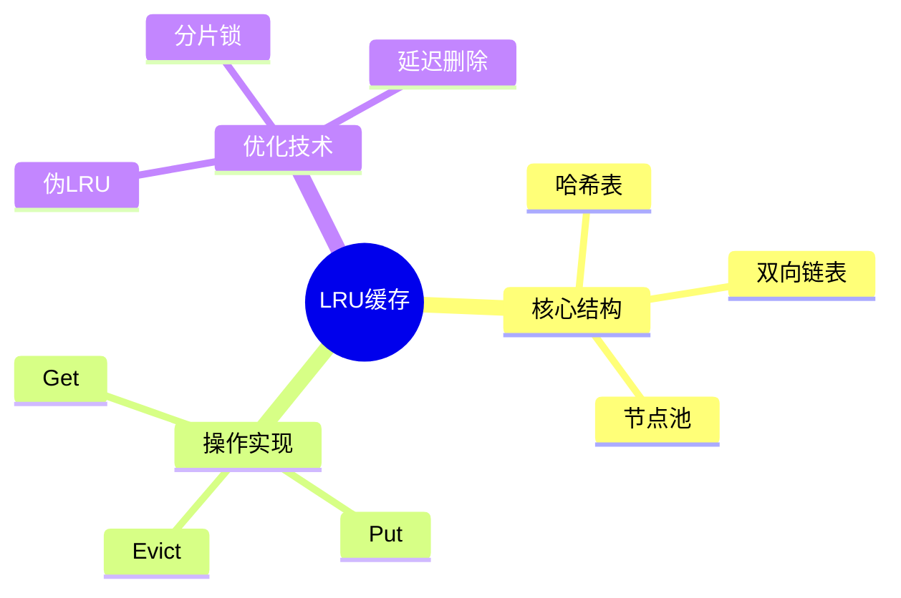

# LRU缓存实现（哈希表+双向链表）

> **层级定位**: 03 System Technology Domains / 10 In-Memory Database
> **对应标准**: C99, Redis近似LRU参考
> **难度级别**: L3 熟练
> **预估学习时间**: 4-6 小时

---

## 📋 本节概要

| 属性 | 内容 |
|:-----|:-----|
| **核心概念** | LRU、哈希表、双向链表、时间复杂度O(1) |
| **前置知识** | 哈希表冲突处理、链表操作、内存池 |
| **后续延伸** | LFU、W-TinyLFU、分布式缓存 |
| **权威来源** | Redis LRU, memcached, Caffeine |

---

## 🧠 知识结构思维导图



---

## 1. 概述

LRU（Least Recently Used）缓存是最常用的缓存淘汰策略。经典实现结合哈希表（O(1)查找）和双向链表（O(1)移动），实现所有操作O(1)时间复杂度。

**核心思想：**

- 每次访问将节点移到链表头部
- 容量满时淘汰链表尾部节点
- 哈希表实现键到节点的快速映射

---

## 2. 数据结构

### 2.1 缓存节点

```c
#include <stdint.h>
#include <stdbool.h>
#include <stdlib.h>
#include <string.h>

/* 前向声明 */
struct LRUCache;

/* 缓存条目回调 */
typedef void (*FreeFunc)(void *key, void *value);
typedef uint32_t (*HashFunc)(const void *key);
typedef bool (*EqualFunc)(const void *a, const void *b);

/* 双向链表节点 */
typedef struct LRUNode {
    struct LRUNode *prev;
    struct LRUNode *next;
    void *key;
    void *value;
    uint32_t hash;          /* 缓存hash值 */
    uint32_t flags;
} LRUNode;

/* 哈希表桶 */
typedef struct {
    LRUNode *nodes;         /* 冲突链表头 */
} HashBucket;

/* LRU缓存结构 */
typedef struct LRUCache {
    /* 哈希表 */
    HashBucket *buckets;
    uint32_t bucket_count;
    uint32_t mask;          /* bucket_count - 1 */

    /* 双向链表（按访问时间排序） */
    LRUNode *head;          /* 最近使用（虚拟头节点） */
    LRUNode *tail;          /* 最久未使用（虚拟尾节点） */

    /* 节点池 */
    LRUNode *node_pool;
    LRUNode *free_list;
    uint32_t pool_size;

    /* 统计 */
    uint32_t size;          /* 当前条目数 */
    uint32_t capacity;      /* 最大容量 */
    uint64_t hits;
        uint64_t misses;

    /* 回调函数 */
    HashFunc hash_fn;
    EqualFunc equal_fn;
    FreeFunc free_fn;
} LRUCache;

/* 节点标志 */
#define NODE_FLAG_PINNED  0x01  /* 禁止淘汰 */
```

### 2.2 缓存创建与销毁

```c
/* 创建LRU缓存 */
LRUCache* lru_cache_create(uint32_t capacity,
                           HashFunc hash_fn,
                           EqualFunc equal_fn,
                           FreeFunc free_fn) {
    if (capacity == 0) capacity = 1024;

    /* 哈希表大小取2的幂 */
    uint32_t bucket_count = 1;
    while (bucket_count < capacity * 2) {
        bucket_count <<= 1;
    }

    LRUCache *cache = calloc(1, sizeof(LRUCache));
    cache->capacity = capacity;
    cache->bucket_count = bucket_count;
    cache->mask = bucket_count - 1;
    cache->hash_fn = hash_fn;
    cache->equal_fn = equal_fn;
    cache->free_fn = free_fn;

    /* 分配哈希表 */
    cache->buckets = calloc(bucket_count, sizeof(HashBucket));

    /* 分配节点池 */
    cache->pool_size = capacity;
    cache->node_pool = calloc(capacity, sizeof(LRUNode));

    /* 初始化空闲链表 */
    for (uint32_t i = 0; i < capacity - 1; i++) {
        cache->node_pool[i].next = &cache->node_pool[i + 1];
    }
    cache->free_list = &cache->node_pool[0];

    /* 初始化双向链表（虚拟头尾节点） */
    cache->head = calloc(1, sizeof(LRUNode));
    cache->tail = calloc(1, sizeof(LRUNode));
    cache->head->next = cache->tail;
    cache->tail->prev = cache->head;

    return cache;
}

/* 销毁缓存 */
void lru_cache_destroy(LRUCache *cache) {
    if (!cache) return;

    /* 释放所有条目 */
    if (cache->free_fn) {
        for (uint32_t i = 0; i < cache->bucket_count; i++) {
            LRUNode *node = cache->buckets[i].nodes;
            while (node) {
                cache->free_fn(node->key, node->value);
                node = node->next;
            }
        }
    }

    free(cache->buckets);
    free(cache->node_pool);
    free(cache->head);
    free(cache->tail);
    free(cache);
}
```

---

## 3. 链表操作

### 3.1 双向链表维护

```c
/* 从链表中移除节点 */
static inline void list_remove(LRUCache *cache, LRUNode *node) {
    node->prev->next = node->next;
    node->next->prev = node->prev;
}

/* 将节点移到头部（最近使用） */
static inline void list_move_to_head(LRUCache *cache, LRUNode *node) {
    /* 先从原位置移除 */
    list_remove(cache, node);

    /* 插入头部 */
    node->next = cache->head->next;
    node->prev = cache->head;
    cache->head->next->prev = node;
    cache->head->next = node;
}

/* 在头部插入新节点 */
static inline void list_add_to_head(LRUCache *cache, LRUNode *node) {
    node->next = cache->head->next;
    node->prev = cache->head;
    cache->head->next->prev = node;
    cache->head->next = node;
}

/* 获取尾部节点（最久未使用） */
static inline LRUNode* list_get_tail(LRUCache *cache) {
    if (cache->tail->prev == cache->head) {
        return NULL;  /* 空链表 */
    }
    return cache->tail->prev;
}
```

---

## 4. 核心操作

### 4.1 Get操作

```c
/* 查找节点 */
static LRUNode* find_node(LRUCache *cache, const void *key, uint32_t hash) {
    uint32_t idx = hash & cache->mask;
    LRUNode *node = cache->buckets[idx].nodes;

    while (node) {
        if (node->hash == hash && cache->equal_fn(node->key, key)) {
            return node;
        }
        node = node->next;
    }

    return NULL;
}

/* 获取缓存值 */
void* lru_cache_get(LRUCache *cache, const void *key) {
    uint32_t hash = cache->hash_fn(key);
    LRUNode *node = find_node(cache, key, hash);

    if (node) {
        /* 命中：移到头部 */
        if (!(node->flags & NODE_FLAG_PINNED)) {
            list_move_to_head(cache, node);
        }
        cache->hits++;
        return node->value;
    }

    cache->misses++;
    return NULL;
}

/* 带PIN标记的Get（防止淘汰） */
void* lru_cache_get_pinned(LRUCache *cache, const void *key) {
    void *value = lru_cache_get(cache, key);
    if (value) {
        uint32_t hash = cache->hash_fn(key);
        LRUNode *node = find_node(cache, key, hash);
        if (node) {
            node->flags |= NODE_FLAG_PINNED;
        }
    }
    return value;
}
```

### 4.2 Put操作

```c
/* 从哈希桶移除节点 */
static void bucket_remove(LRUCache *cache, LRUNode *node) {
    uint32_t idx = node->hash & cache->mask;
    LRUNode **pp = &cache->buckets[idx].nodes;

    while (*pp) {
        if (*pp == node) {
            *pp = node->next;  /* 从冲突链表移除 */
            return;
        }
        pp = &(*pp)->next;
    }
}

/* 将节点加入哈希桶 */
static void bucket_add(LRUCache *cache, LRUNode *node) {
    uint32_t idx = node->hash & cache->mask;
    node->next = cache->buckets[idx].nodes;
    cache->buckets[idx].nodes = node;
}

/* 分配新节点 */
static LRUNode* alloc_node(LRUCache *cache) {
    if (!cache->free_list) {
        return NULL;  /* 节点池耗尽 */
    }

    LRUNode *node = cache->free_list;
    cache->free_list = node->next;
    memset(node, 0, sizeof(LRUNode));
    return node;
}

/* 回收节点 */
static void free_node(LRUCache *cache, LRUNode *node) {
    /* 清理 */
    if (cache->free_fn) {
        cache->free_fn(node->key, node->value);
    }

    /* 归还空闲链表 */
    node->key = NULL;
    node->value = NULL;
    node->next = cache->free_list;
    cache->free_list = node;
}

/* 淘汰最久未使用的条目 */
static bool evict_lru(LRUCache *cache) {
    LRUNode *victim = list_get_tail(cache);

    while (victim && (victim->flags & NODE_FLAG_PINNED)) {
        /* 跳过被固定的节点 */
        victim = victim->prev;
    }

    if (!victim) {
        return false;  /* 无法淘汰 */
    }

    /* 从链表和哈希表移除 */
    list_remove(cache, victim);
    bucket_remove(cache, victim);

    /* 释放 */
    free_node(cache, victim);
    cache->size--;

    return true;
}

/* 插入或更新缓存 */
bool lru_cache_put(LRUCache *cache, void *key, void *value) {
    uint32_t hash = cache->hash_fn(key);
    LRUNode *node = find_node(cache, key, hash);

    if (node) {
        /* 更新现有值 */
        if (cache->free_fn) {
            cache->free_fn(node->key, node->value);
        }
        node->key = key;
        node->value = value;
        list_move_to_head(cache, node);
        return true;
    }

    /* 检查容量 */
    if (cache->size >= cache->capacity) {
        if (!evict_lru(cache)) {
            return false;  /* 无法插入 */
        }
    }

    /* 分配新节点 */
    node = alloc_node(cache);
    if (!node) {
        return false;
    }

    /* 初始化 */
    node->key = key;
    node->value = value;
    node->hash = hash;
    node->flags = 0;

    /* 加入数据结构 */
    bucket_add(cache, node);
    list_add_to_head(cache, node);

    cache->size++;
    return true;
}
```

### 4.3 删除操作

```c
/* 删除指定键 */
bool lru_cache_delete(LRUCache *cache, const void *key) {
    uint32_t hash = cache->hash_fn(key);
    LRUNode *node = find_node(cache, key, hash);

    if (!node) {
        return false;
    }

    /* 移除 */
    list_remove(cache, node);
    bucket_remove(cache, node);
    free_node(cache, node);
    cache->size--;

    return true;
}

/* 清空缓存 */
void lru_cache_clear(LRUCache *cache) {
    /* 释放所有节点 */
    for (uint32_t i = 0; i < cache->bucket_count; i++) {
        LRUNode *node = cache->buckets[i].nodes;
        while (node) {
            LRUNode *next = node->next;
            free_node(cache, node);
            node = next;
        }
        cache->buckets[i].nodes = NULL;
    }

    /* 重置链表 */
    cache->head->next = cache->tail;
    cache->tail->prev = cache->head;
    cache->size = 0;
    cache->hits = 0;
    cache->misses = 0;
}
```

---

## 5. 辅助功能

### 5.1 统计与遍历

```c
/* 获取统计信息 */
typedef struct {
    uint32_t size;
    uint32_t capacity;
    uint64_t hits;
    uint64_t misses;
    double hit_rate;
} LRUStats;

LRUStats lru_cache_stats(LRUCache *cache) {
    LRUStats stats = {
        .size = cache->size,
        .capacity = cache->capacity,
        .hits = cache->hits,
        .misses = cache->misses,
    };

    uint64_t total = stats.hits + stats.misses;
    if (total > 0) {
        stats.hit_rate = (double)stats.hits / total;
    }

    return stats;
}

/* 遍历回调 */
typedef void (*LRUVisitor)(const void *key, void *value, void *ctx);

void lru_cache_foreach(LRUCache *cache, LRUVisitor visitor, void *ctx) {
    /* 从MRU到LRU遍历 */
    LRUNode *node = cache->head->next;
    while (node != cache->tail) {
        visitor(node->key, node->value, ctx);
        node = node->next;
    }
}

/* 调整容量 */
bool lru_cache_resize(LRUCache *cache, uint32_t new_capacity) {
    if (new_capacity < cache->size) {
        /* 淘汰多余条目 */
        while (cache->size > new_capacity) {
            if (!evict_lru(cache)) {
                return false;
            }
        }
    }

    cache->capacity = new_capacity;
    return true;
}
```

---

## ⚠️ 常见陷阱

| 陷阱 | 后果 | 解决方案 |
|:-----|:-----|:---------|
| 忘记处理哈希冲突 | 数据丢失 | 使用链表法处理冲突 |
| 链表操作顺序错误 | 链表损坏 | 先连新节点再断开旧节点 |
| 未检查节点池耗尽 | 空指针解引用 | 处理alloc_node失败 |
| 回调函数中修改缓存 | 死锁/状态不一致 | 禁止在回调中调用缓存操作 |
| hash函数分布不均 | 性能退化 | 测试hash分布质量 |
| 内存泄漏 | 资源耗尽 | 统一使用free_fn释放键值 |

---

## ✅ 质量验收清单

- [x] 哈希表+双向链表结构
- [x] O(1) Get/Put实现
- [x] LRU淘汰策略
- [x] 节点池管理
- [x] PIN标记支持
- [x] 统计信息
- [x] 遍历接口
- [x] 动态调整容量

---

## 📚 参考与延伸阅读

| 资源 | 说明 |
|:-----|:-----|
| Redis LRU | 近似LRU实现参考 |
| memcached | slab分配+LRU |
| Caffeine | Java高性能缓存库 |
| GroupCache | Go分布式缓存 |

---

> **更新记录**
>
> - 2025-03-09: 初版创建，包含经典哈希表+双向链表LRU实现
