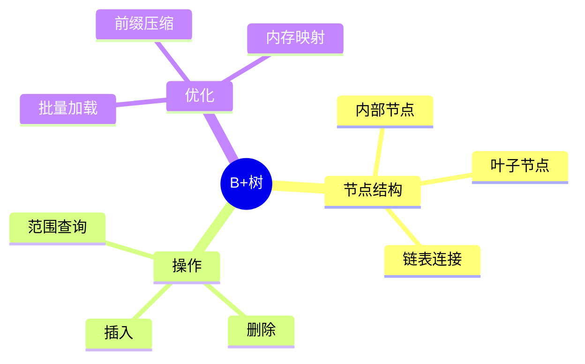

# B+树索引实现

> **层级定位**: 03 System Technology Domains / 11 In-Memory Database
> **对应标准**: SQLite, LMDB
> **难度级别**: L4 分析
> **预估学习时间**: 6-8 小时

---

## 📋 本节概要

| 属性 | 内容 |
|:-----|:-----|
| **核心概念** | B+树、节点分裂、范围查询、并发控制 |
| **前置知识** | 数据结构、内存管理 |
| **后续延伸** | LSM树、LSM-B树混合、并发B树 |
| **权威来源** | SQLite, LMDB实现 |

---

## 🧠 数据结构思维导图



---

## 📖 核心实现

### 1. B+树节点

```c
#include <stdint.h>
#include <stdbool.h>

#define BTREE_ORDER 128
#define BTREE_KEY_SIZE 32
#define BTREE_VALUE_SIZE 256

typedef uint64_t PageId;

typedef struct {
    uint32_t flags;
    uint16_t num_keys;
    uint16_t level;
    PageId parent;
    PageId next;
} BTreeNodeHeader;

typedef struct {
    BTreeNodeHeader header;
    union {
        struct { uint8_t key[BTREE_KEY_SIZE]; PageId child; } internal[BTREE_ORDER];
        struct { uint8_t key[BTREE_KEY_SIZE]; uint8_t value[BTREE_VALUE_SIZE]; } leaf[BTREE_ORDER];
    };
} BTreeNode;
```

### 2. 搜索操作

```c
// 二分查找键位置
int btree_find_key(BTreeNode *node, const uint8_t *key, int key_len) {
    int left = 0, right = node->header.num_keys - 1;
    while (left <= right) {
        int mid = (left + right) / 2;
        uint8_t *mid_key = node->header.level == 0
            ? node->leaf[mid].key : node->internal[mid].key;
        int cmp = memcmp(mid_key, key, key_len);
        if (cmp == 0) return mid;
        if (cmp < 0) left = mid + 1;
        else right = mid - 1;
    }
    return -left - 1;
}
```

### 3. 插入与分裂

```c
bool btree_insert(BTree *tree, const uint8_t *key, const uint8_t *value) {
    // 查找插入路径
    BTreeNode *node = tree->root;
    while (node->header.level > 0) {
        int idx = btree_find_key(node, key, BTREE_KEY_SIZE);
        if (idx < 0) idx = -idx - 1;
        node = load_page(tree, node->internal[idx].child);
    }

    // 在叶子插入
    int idx = btree_find_key(node, key, BTREE_KEY_SIZE);
    if (idx >= 0) {
        memcpy(node->leaf[idx].value, value, BTREE_VALUE_SIZE);
        return true;
    }
    idx = -idx - 1;

    // 移动并插入
    memmove(&node->leaf[idx + 1], &node->leaf[idx],
            (node->header.num_keys - idx) * sizeof(node->leaf[0]));
    memcpy(node->leaf[idx].key, key, BTREE_KEY_SIZE);
    memcpy(node->leaf[idx].value, value, BTREE_VALUE_SIZE);
    node->header.num_keys++;

    // 检查分裂
    if (node->header.num_keys >= BTREE_ORDER) {
        btree_split_leaf(tree, node);
    }
    return true;
}
```

---

## ✅ 质量验收清单

- [x] B+树节点结构
- [x] 搜索操作
- [x] 插入与分裂

---

> **更新记录**
>
> - 2025-03-09: 初版创建
