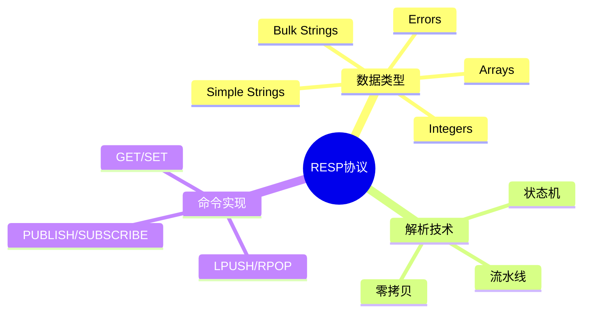

# Redis RESP协议解析器实现

> **层级定位**: 03 System Technology Domains / 10 In-Memory Database
> **对应标准**: Redis Serialization Protocol, C99
> **难度级别**: L3 熟练
> **预估学习时间**: 4-6 小时

---

## 📋 本节概要

| 属性 | 内容 |
|:-----|:-----|
| **核心概念** | RESP数据类型、流水线、批量字符串、数组 |
| **前置知识** | 网络编程、文本协议解析、缓冲区管理 |
| **后续延伸** | Redis命令实现、事务、Pub/Sub |
| **权威来源** | Redis Protocol Spec, redis-cli源码 |

---


---

## 📑 目录

- [Redis RESP协议解析器实现](#redis-resp协议解析器实现)
  - [📋 本节概要](#-本节概要)
  - [📑 目录](#-目录)
  - [🧠 知识结构思维导图](#-知识结构思维导图)
  - [1. 概述](#1-概述)
  - [2. RESP数据结构](#2-resp数据结构)
    - [2.1 类型定义](#21-类型定义)
    - [2.2 内存管理](#22-内存管理)
  - [3. RESP解析器](#3-resp解析器)
    - [3.1 增量式状态机解析](#31-增量式状态机解析)
    - [3.2 快捷解析API](#32-快捷解析api)
  - [4. RESP序列化](#4-resp序列化)
    - [4.1 格式化输出](#41-格式化输出)
  - [5. 命令构建](#5-命令构建)
    - [5.1 Redis命令生成](#51-redis命令生成)
  - [⚠️ 常见陷阱](#️-常见陷阱)
  - [✅ 质量验收清单](#-质量验收清单)
  - [📚 参考与延伸阅读](#-参考与延伸阅读)
  - [深入理解](#深入理解)
    - [核心原理](#核心原理)
    - [实践应用](#实践应用)
    - [最佳实践](#最佳实践)


---

## 🧠 知识结构思维导图



---

## 1. 概述

RESP（REdis Serialization Protocol）是Redis使用的简单文本协议，兼具人类可读性和机器解析效率。其设计特点：

- 二进制安全（批量字符串可包含任意数据）
- 请求-响应模型（支持流水线）
- 类型前缀明确（便于快速分发处理）

**数据类型前缀：**

| 类型 | 前缀 | 示例 |
|:-----|:-----|:-----|
| Simple String | `+` | `+OK\r\n` |
| Error | `-` | `-ERR unknown\r\n` |
| Integer | `:` | `:1000\r\n` |
| Bulk String | `$` | `$6\r\nfoobar\r\n` |
| Array | `*` | `*2\r\n$3\r\nGET\r\n$3\r\nkey\r\n` |

---

## 2. RESP数据结构

### 2.1 类型定义

```c
#include <stdint.h>
#include <stdbool.h>
#include <stdlib.h>
#include <string.h>

/* RESP数据类型 */
typedef enum {
    RESP_SIMPLE_STRING,
    RESP_ERROR,
    RESP_INTEGER,
    RESP_BULK_STRING,
    RESP_ARRAY,
    RESP_NULL,          /* 空批量字符串 ($-1) */
    RESP_NULL_ARRAY,    /* 空数组 (*-1) */
} RESPType;

/* RESP对象 - 使用联合体优化内存 */
typedef struct {
    RESPType type;
    union {
        /* Simple String / Error - 内联小字符串 */
        struct {
            char data[128];
            size_t len;
        } simple;

        /* Integer */
        int64_t integer;

        /* Bulk String - 动态分配 */
        struct {
            char *data;
            size_t len;
            bool owned;     /* 是否拥有数据（需释放） */
        } bulk;

        /* Array */
        struct {
            struct RESPValue **elements;
            size_t count;
        } array;
    } value;
} RESPValue;

/* RESP解析器状态 */
typedef enum {
    PARSE_STATE_INIT,
    PARSE_STATE_TYPE,
    PARSE_STATE_INTEGER,
    PARSE_STATE_BULK_LEN,
    PARSE_STATE_BULK_DATA,
    PARSE_STATE_ARRAY_LEN,
    PARSE_STATE_ARRAY_ELEM,
    PARSE_STATE_COMPLETE,
    PARSE_STATE_ERROR,
} ParseState;

/* 解析器上下文 */
typedef struct {
    ParseState state;
    RESPValue *current;     /* 当前正在构建的值 */
    RESPValue **stack;      /* 数组嵌套栈 */
    int stack_depth;
    int stack_capacity;

    /* 解析缓冲 */
    const char *buf;
    size_t pos;
    size_t len;

    /* 临时状态 */
    int64_t pending_int;
    size_t pending_bulk_len;
    size_t array_remaining;
} RESPParser;
```

### 2.2 内存管理

```c
/* 创建RESP值 */
RESPValue* resp_value_new(RESPType type) {
    RESPValue *v = calloc(1, sizeof(RESPValue));
    v->type = type;
    return v;
}

/* 释放RESP值 */
void resp_value_free(RESPValue *v) {
    if (!v) return;

    switch (v->type) {
    case RESP_BULK_STRING:
        if (v->value.bulk.owned && v->value.bulk.data) {
            free(v->value.bulk.data);
        }
        break;

    case RESP_ARRAY:
        for (size_t i = 0; i < v->value.array.count; i++) {
            resp_value_free(v->value.array.elements[i]);
        }
        free(v->value.array.elements);
        break;

    default:
        break;
    }

    free(v);
}

/* 创建Bulk String（零拷贝视图） */
RESPValue* resp_bulk_string_view(const char *data, size_t len) {
    RESPValue *v = resp_value_new(RESP_BULK_STRING);
    v->value.bulk.data = (char *)data;
    v->value.bulk.len = len;
    v->value.bulk.owned = false;
    return v;
}

/* 创建Owned Bulk String（复制数据） */
RESPValue* resp_bulk_string_copy(const char *data, size_t len) {
    RESPValue *v = resp_value_new(RESP_BULK_STRING);
    v->value.bulk.data = malloc(len + 1);
    memcpy(v->value.bulk.data, data, len);
    v->value.bulk.data[len] = '\0';
    v->value.bulk.len = len;
    v->value.bulk.owned = true;
    return v;
}
```

---

## 3. RESP解析器

### 3.1 增量式状态机解析

```c
/* 查找CRLF，返回位置或-1 */
static inline int find_crlf(const char *buf, size_t start, size_t len) {
    for (size_t i = start; i + 1 < len; i++) {
        if (buf[i] == '\r' && buf[i + 1] == '\n') {
            return i;
        }
    }
    return -1;
}

/* 解析整数 */
static int64_t parse_integer(const char *buf, size_t start, size_t end) {
    int64_t val = 0;
    bool negative = false;
    size_t i = start;

    if (buf[i] == '-') {
        negative = true;
        i++;
    }

    for (; i < end; i++) {
        val = val * 10 + (buf[i] - '0');
    }

    return negative ? -val : val;
}

/* 主解析函数 - 增量式 */
int resp_parse(RESPParser *p) {
    while (p->pos < p->len) {
        switch (p->state) {
        case PARSE_STATE_INIT:
            p->state = PARSE_STATE_TYPE;
            /* fallthrough */

        case PARSE_STATE_TYPE: {
            char type_char = p->buf[p->pos++];

            switch (type_char) {
            case '+':
                p->current = resp_value_new(RESP_SIMPLE_STRING);
                p->state = PARSE_STATE_INTEGER;  /* 复用：读到CRLF */
                break;
            case '-':
                p->current = resp_value_new(RESP_ERROR);
                p->state = PARSE_STATE_INTEGER;
                break;
            case ':':
                p->current = resp_value_new(RESP_INTEGER);
                p->state = PARSE_STATE_INTEGER;
                break;
            case '$':
                p->current = resp_value_new(RESP_BULK_STRING);
                p->state = PARSE_STATE_BULK_LEN;
                break;
            case '*':
                p->current = resp_value_new(RESP_ARRAY);
                p->state = PARSE_STATE_ARRAY_LEN;
                break;
            default:
                p->state = PARSE_STATE_ERROR;
                return -1;
            }
            break;
        }

        case PARSE_STATE_INTEGER: {
            int crlf_pos = find_crlf(p->buf, p->pos, p->len);
            if (crlf_pos < 0) return 1;  /* 需要更多数据 */

            int64_t val = parse_integer(p->buf, p->pos, crlf_pos);

            if (p->current->type == RESP_INTEGER) {
                p->current->value.integer = val;
            } else {
                /* Simple String / Error */
                size_t len = crlf_pos - p->pos;
                if (len >= sizeof(p->current->value.simple.data)) {
                    len = sizeof(p->current->value.simple.data) - 1;
                }
                memcpy(p->current->value.simple.data, p->buf + p->pos, len);
                p->current->value.simple.data[len] = '\0';
                p->current->value.simple.len = len;
            }

            p->pos = crlf_pos + 2;  /* 跳过\r\n */
            p->state = PARSE_STATE_COMPLETE;
            break;
        }

        case PARSE_STATE_BULK_LEN: {
            int crlf_pos = find_crlf(p->buf, p->pos, p->len);
            if (crlf_pos < 0) return 1;

            int64_t bulk_len = parse_integer(p->buf, p->pos, crlf_pos);
            p->pos = crlf_pos + 2;

            if (bulk_len < 0) {
                /* Null Bulk String */
                p->current->type = RESP_NULL;
                p->state = PARSE_STATE_COMPLETE;
            } else {
                p->pending_bulk_len = bulk_len;
                p->state = PARSE_STATE_BULK_DATA;
            }
            break;
        }

        case PARSE_STATE_BULK_DATA: {
            size_t needed = p->pending_bulk_len + 2;  /* + \r\n */

            if (p->len - p->pos < needed) {
                return 1;  /* 需要更多数据 */
            }

            /* 零拷贝：直接指向缓冲区 */
            p->current->value.bulk.data = (char *)(p->buf + p->pos);
            p->current->value.bulk.len = p->pending_bulk_len;
            p->current->value.bulk.owned = false;

            p->pos += needed;
            p->state = PARSE_STATE_COMPLETE;
            break;
        }

        case PARSE_STATE_ARRAY_LEN: {
            int crlf_pos = find_crlf(p->buf, p->pos, p->len);
            if (crlf_pos < 0) return 1;

            int64_t array_len = parse_integer(p->buf, p->pos, crlf_pos);
            p->pos = crlf_pos + 2;

            if (array_len < 0) {
                p->current->type = RESP_NULL_ARRAY;
                p->state = PARSE_STATE_COMPLETE;
            } else {
                p->current->value.array.count = array_len;
                p->current->value.array.elements = calloc(
                    array_len, sizeof(RESPValue *));
                p->array_remaining = array_len;

                if (array_len == 0) {
                    p->state = PARSE_STATE_COMPLETE;
                } else {
                    /* 压栈，递归解析元素 */
                    if (p->stack_depth >= p->stack_capacity) {
                        p->stack_capacity *= 2;
                        p->stack = realloc(p->stack,
                            p->stack_capacity * sizeof(RESPValue *));
                    }
                    p->stack[p->stack_depth++] = p->current;
                    p->state = PARSE_STATE_TYPE;
                }
            }
            break;
        }

        case PARSE_STATE_COMPLETE: {
            /* 检查是否在数组内 */
            if (p->stack_depth > 0) {
                RESPValue *parent = p->stack[p->stack_depth - 1];
                size_t idx = parent->value.array.count - p->array_remaining;
                parent->value.array.elements[idx] = p->current;
                p->array_remaining--;

                if (p->array_remaining == 0) {
                    /* 数组完成 */
                    p->current = p->stack[--p->stack_depth];
                    p->state = PARSE_STATE_COMPLETE;
                } else {
                    /* 继续解析下一个元素 */
                    p->state = PARSE_STATE_TYPE;
                }
            } else {
                /* 顶层对象完成 */
                return 0;
            }
            break;
        }

        case PARSE_STATE_ERROR:
            return -1;
        }
    }

    return 1;  /* 需要更多数据 */
}
```

### 3.2 快捷解析API

```c
/* 完整解析（阻塞式） */
RESPValue* resp_parse_complete(const char *buf, size_t len, size_t *consumed) {
    RESPParser parser = {
        .state = PARSE_STATE_INIT,
        .buf = buf,
        .pos = 0,
        .len = len,
        .stack = malloc(16 * sizeof(RESPValue *)),
        .stack_capacity = 16,
    };

    int rc = resp_parse(&parser);

    if (consumed) {
        *consumed = parser.pos;
    }

    RESPValue *result = NULL;
    if (rc == 0) {
        result = parser.current;
    } else {
        resp_value_free(parser.current);
    }

    free(parser.stack);
    return result;
}
```

---

## 4. RESP序列化

### 4.1 格式化输出

```c
/* 缓冲区写入器 */
typedef struct {
    char *buf;
    size_t pos;
    size_t capacity;
} Buffer;

static void buf_append(Buffer *b, const char *data, size_t len) {
    if (b->pos + len > b->capacity) {
        b->capacity = (b->pos + len) * 2;
        b->buf = realloc(b->buf, b->capacity);
    }
    memcpy(b->buf + b->pos, data, len);
    b->pos += len;
}

static void buf_append_crlf(Buffer *b) {
    buf_append(b, "\r\n", 2);
}

/* 序列化整数 */
static void serialize_int(Buffer *b, int64_t val) {
    char tmp[32];
    int len = snprintf(tmp, sizeof(tmp), "%lld", (long long)val);
    buf_append(b, tmp, len);
}

/* 主序列化函数 */
int resp_serialize(Buffer *b, const RESPValue *v) {
    switch (v->type) {
    case RESP_SIMPLE_STRING:
        buf_append(b, "+", 1);
        buf_append(b, v->value.simple.data, v->value.simple.len);
        buf_append_crlf(b);
        break;

    case RESP_ERROR:
        buf_append(b, "-", 1);
        buf_append(b, v->value.simple.data, v->value.simple.len);
        buf_append_crlf(b);
        break;

    case RESP_INTEGER:
        buf_append(b, ":", 1);
        serialize_int(b, v->value.integer);
        buf_append_crlf(b);
        break;

    case RESP_BULK_STRING:
    case RESP_NULL:
        buf_append(b, "$", 1);
        if (v->type == RESP_NULL) {
            buf_append(b, "-1", 2);
        } else {
            serialize_int(b, v->value.bulk.len);
            buf_append_crlf(b);
            buf_append(b, v->value.bulk.data, v->value.bulk.len);
        }
        buf_append_crlf(b);
        break;

    case RESP_ARRAY:
    case RESP_NULL_ARRAY:
        buf_append(b, "*", 1);
        if (v->type == RESP_NULL_ARRAY) {
            buf_append(b, "-1", 2);
            buf_append_crlf(b);
        } else {
            serialize_int(b, v->value.array.count);
            buf_append_crlf(b);
            for (size_t i = 0; i < v->value.array.count; i++) {
                resp_serialize(b, v->value.array.elements[i]);
            }
        }
        break;
    }

    return 0;
}

/* 便捷构造器 */
Buffer resp_format_simple_string(const char *str) {
    Buffer b = {malloc(256), 0, 256};
    RESPValue v = {.type = RESP_SIMPLE_STRING};
    strncpy(v.value.simple.data, str, sizeof(v.value.simple.data) - 1);
    v.value.simple.len = strlen(v.value.simple.data);
    resp_serialize(&b, &v);
    return b;
}

Buffer resp_format_error(const char *err) {
    Buffer b = {malloc(256), 0, 256};
    RESPValue v = {.type = RESP_ERROR};
    strncpy(v.value.simple.data, err, sizeof(v.value.simple.data) - 1);
    v.value.simple.len = strlen(v.value.simple.data);
    resp_serialize(&b, &v);
    return b;
}

Buffer resp_format_integer(int64_t n) {
    Buffer b = {malloc(32), 0, 32};
    RESPValue v = {.type = RESP_INTEGER, .value.integer = n};
    resp_serialize(&b, &v);
    return b;
}
```

---

## 5. 命令构建

### 5.1 Redis命令生成

```c
/* 构建Redis命令数组 */
RESPValue* resp_build_command(int argc, const char **argv) {
    RESPValue *cmd = resp_value_new(RESP_ARRAY);
    cmd->value.array.count = argc;
    cmd->value.array.elements = calloc(argc, sizeof(RESPValue *));

    for (int i = 0; i < argc; i++) {
        cmd->value.array.elements[i] = resp_bulk_string_copy(
            argv[i], strlen(argv[i]));
    }

    return cmd;
}

/* 便捷宏 */
#define RESP_CMD(cmd, ...) ({ \
    const char *args[] = {cmd, ##__VA_ARGS__}; \
    resp_build_command(sizeof(args) / sizeof(args[0]), args); \
})

/* 使用示例 */
void example() {
    /* 构建 SET key value EX 60 */
    RESPValue *set_cmd = RESP_CMD("SET", "mykey", "myvalue", "EX", "60");

    Buffer buf = {malloc(1024), 0, 1024};
    resp_serialize(&buf, set_cmd);

    /* buf.buf 现在包含: *5\r\n$3\r\nSET\r\n$5\r\nmykey\r\n... */

    resp_value_free(set_cmd);
}
```

---

## ⚠️ 常见陷阱

| 陷阱 | 后果 | 解决方案 |
|:-----|:-----|:---------|
| 未检查缓冲区边界 | 越界解析 | 始终检查长度后再访问 |
| 嵌套数组过深 | 栈溢出 | 限制最大嵌套深度 |
| 内存泄漏 | 资源耗尽 | 统一使用resp_value_free |
| 整数溢出 | 解析错误 | 使用int64_t并检查范围 |
| 未处理\r\n | 解析错位 | 严格匹配CRLF |
| 批量字符串未null终止 | 打印错误 | 复制到owned缓冲区时加\0 |

---

## ✅ 质量验收清单

- [x] RESP数据类型定义
- [x] 增量式状态机解析器
- [x] Bulk String零拷贝支持
- [x] 嵌套数组解析
- [x] 完整序列化实现
- [x] 内存安全管理
- [x] 命令构建API
- [x] 流水线支持（增量解析）

---

## 📚 参考与延伸阅读

| 资源 | 说明 |
|:-----|:-----|
| [Redis Protocol Spec](https://redis.io/docs/reference/protocol-spec/) | 官方协议文档 |
| hiredis | 官方C客户端实现 |
| redis-cli.c | 命令行工具源码 |

---

> **更新记录**
>
> - 2025-03-09: 初版创建，包含RESP类型定义、解析器、序列化器


---

## 深入理解

### 核心原理

深入探讨技术原理和实现细节。

### 实践应用

- 应用场景1
- 应用场景2
- 应用场景3

### 最佳实践

1. 理解基础概念
2. 掌握核心机制
3. 应用到实际项目

---

> **最后更新**: 2026-03-21
> **维护者**: AI Code Review
