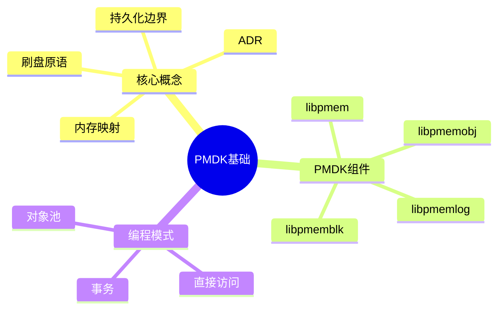

---

## 🔗 文档关联

### 核心关联
| 文档 | 关系类型 | 说明 |
|:-----|:---------|:-----|
| [内存管理](../../../01_Core_Knowledge_System/02_Core_Layer/02_Memory_Management.md) | 核心关联 | 内存管理基础 |
| [指针深度](../../../01_Core_Knowledge_System/02_Core_Layer/01_Pointer_Depth.md) | 核心关联 | 指针深度基础 |
| [并发编程](../../../03_System_Technology_Domains/14_Concurrency_Parallelism/README.md) | 核心关联 | 并发编程基础 |
| [数据类型](../../../01_Core_Knowledge_System/01_Basic_Layer/02_Data_Type_System.md) | 核心关联 | 数据类型基础 |
| [数组与指针](../../../01_Core_Knowledge_System/02_Core_Layer/05_Arrays_Pointers.md) | 核心关联 | 数组与指针基础 |

### 扩展阅读
| 文档 | 关系类型 | 说明 |
|:-----|:---------|:-----|
| [软件工程](../../../01_Core_Knowledge_System/05_Engineering_Layer/README.md) | 核心关联 | 软件工程基础 |
| [形式语义](../../../02_Formal_Semantics_and_Physics/README.md) | 核心关联 | 形式语义基础 |
| [系统技术](../../../03_System_Technology_Domains/README.md) | 核心关联 | 系统技术基础 |
| [工业场景](../../../04_Industrial_Scenarios/README.md) | 核心关联 | 工业场景基础 |
| [思维表征](../../../06_Thinking_Representation/README.md) | 核心关联 | 思维表征基础 |
# PMDK基础与持久化编程

> **层级定位**: 03 System Technology Domains / 12 Persistent Memory
> **对应标准**: PMDK 1.x, SNIA NVM Programming Model, C11
> **难度级别**: L4 分析
> **预估学习时间**: 6-8 小时

---

## 📋 本节概要

| 属性 | 内容 |
|:-----|:-----|
| **核心概念** | 持久内存、内存映射文件、显式刷新、事务 |
| **前置知识** | 内存映射、缓存一致性、文件系统 |
| **后续延伸** | libpmemobj、事务对象存储、容错恢复 |
| **权威来源** | Intel PMDK文档, SNIA NVM Programming Model |

---


---

## 📑 目录

- [PMDK基础与持久化编程](#pmdk基础与持久化编程)
  - [📋 本节概要](#-本节概要)
  - [📑 目录](#-目录)
  - [🧠 知识结构思维导图](#-知识结构思维导图)
  - [1. 概述](#1-概述)
  - [2. 持久内存基础](#2-持久内存基础)
    - [2.1 内存层次与持久域](#21-内存层次与持久域)
    - [2.2 内存类型检测](#22-内存类型检测)
  - [3. libpmem基础API](#3-libpmem基础api)
    - [3.1 内存映射与初始化](#31-内存映射与初始化)
    - [3.2 持久化操作](#32-持久化操作)
  - [4. PM-aware数据结构](#4-pm-aware数据结构)
    - [4.1 持久化日志](#41-持久化日志)
  - [⚠️ 常见陷阱](#️-常见陷阱)
  - [✅ 质量验收清单](#-质量验收清单)
  - [📚 参考与延伸阅读](#-参考与延伸阅读)
  - [深入理解](#深入理解)
    - [核心原理](#核心原理)
    - [实践应用](#实践应用)
    - [最佳实践](#最佳实践)


---

## 🧠 知识结构思维导图



---

## 1. 概述

持久内存（Persistent Memory, PM）结合了内存的字节寻址性能和存储的非易失特性。
PMDK（Persistent Memory Development Kit）是Intel开发的开源库集合，简化持久内存编程。

**关键挑战：**

- 缓存与持久化一致性（reorder）
- 部分写入风险（torn write）
- 需要显式刷新到持久域

---

## 2. 持久内存基础

### 2.1 内存层次与持久域

```c
/* 系统内存层次
 *
 * ┌─────────────────────────────────────────┐
 * │  CPU寄存器                              │
 * ├─────────────────────────────────────────┤
 * │  CPU缓存 (L1/L2/L3)                     │  <- 易失
 * ├─────────────────────────────────────────┤
 * │  DRAM / 持久内存                        │  <- 持久域边界
 * ├─────────────────────────────────────────┤
 * │  SSD / NVMe                             │
 * └─────────────────────────────────────────┘
 *
 * ADR (Asynchronous DRAM Refresh): 电源故障时将缓存刷入PM
 */

#include <stdint.h>
#include <stdbool.h>
#include <immintrin.h>  /* x86 SIMD指令 */
#include <emmintrin.h>

/* 持久化内存屏障 - 确保前面存储到达持久域 */
static inline void pmem_persist(void) {
    /* SFENCE + CLWB/CLFLUSHOPT */
    _mm_sfence();
}

/* 缓存行刷新指令 (CLFLUSHOPT) */
static inline void pmem_clflushopt(const void *addr) {
    _mm_clflushopt(addr);
}

/* 缓存行回写 (CLWB) - 保留在缓存中 */
static inline void pmem_clwb(const void *addr) {
    /* GCC内建 */
    __builtin_ia32_clwb(addr);
}
```

### 2.2 内存类型检测

```c
#include <sys/mman.h>
#include <sys/types.h>
#include <fcntl.h>
#include <unistd.h>

/* 检测内存是否为持久内存 */
bool is_persistent_memory(void *addr, size_t len) {
    /* 解析/proc/self/smaps */
    FILE *fp = fopen("/proc/self/smaps", "r");
    if (!fp) return false;

    char line[256];
    while (fgets(line, sizeof(line), fp)) {
        /* 检查vmflags中是否有"sd" (sync-dax) */
        if (strstr(line, "VmFlags:")) {
            if (strstr(line, "sd")) {
                fclose(fp);
                return true;
            }
        }
    }

    fclose(fp);
    return false;
}

/* 检测eADR支持 */
bool has_adr_support(void) {
    /* 检查CPU特征 */
    uint32_t eax, ebx, ecx, edx;

    /* CPUID leaf 7, subleaf 0 */
    __asm__ __volatile__ (
        "cpuid"
        : "=a"(eax), "=b"(ebx), "=c"(ecx), "=d"(edx)
        : "a"(7), "c"(0)
    );

    /* 检查edx bit 29 (PERSISTENT_EN) */
    return (edx & (1 << 29)) != 0;
}
```

---

## 3. libpmem基础API

### 3.1 内存映射与初始化

```c
#include <libpmem.h>
#include <stdio.h>
#include <stdlib.h>
#include <string.h>

#define POOL_SIZE (1024 * 1024 * 1024)  /* 1GB */

/* 持久内存池 */
typedef struct {
    void *addr;
    size_t mapped_len;
    int is_pmem;
    int fd;
    char path[256];
} PMemPool;

/* 打开或创建PM文件 */
PMemPool* pmem_pool_open(const char *path, size_t pool_size) {
    PMemPool *pool = calloc(1, sizeof(PMemPool));
    strncpy(pool->path, path, sizeof(pool->path) - 1);

    /* 检查文件是否存在 */
    int fd = open(path, O_RDWR);
    size_t file_size = 0;

    if (fd < 0) {
        /* 创建新文件 */
        fd = open(path, O_RDWR | O_CREAT | O_TRUNC, 0666);
        if (fd < 0) {
            perror("open");
            free(pool);
            return NULL;
        }

        /* 预分配空间 */
        if (posix_fallocate(fd, 0, pool_size) != 0) {
            perror("fallocate");
            close(fd);
            free(pool);
            return NULL;
        }
        file_size = pool_size;
    } else {
        /* 获取现有文件大小 */
        struct stat st;
        fstat(fd, &st);
        file_size = st.st_size;
    }

    pool->fd = fd;

    /* 内存映射 */
    pool->addr = pmem_map_file(path, file_size,
                               PMEM_FILE_CREATE, 0666,
                               &pool->mapped_len, &pool->is_pmem);

    if (!pool->addr) {
        perror("pmem_map_file");
        close(fd);
        free(pool);
        return NULL;
    }

    printf("Mapped %zu bytes at %p (is_pmem=%d)\n",
           pool->mapped_len, pool->addr, pool->is_pmem);

    return pool;
}

/* 关闭池 */
void pmem_pool_close(PMemPool *pool) {
    if (!pool) return;

    /* 确保所有数据持久化 */
    pmem_persist(pool->addr, pool->mapped_len);

    pmem_unmap(pool->addr, pool->mapped_len);
    close(pool->fd);
    free(pool);
}
```

### 3.2 持久化操作

```c
/* 安全的持久化复制 */
void pmem_memcpy_persist(void *pmem_dest, const void *src, size_t len) {
    /* 使用libpmem优化的复制 */
    pmem_memcpy_persist(pmem_dest, src, len);
}

/* 带持久化的内存设置 */
void pmem_memset_persist(void *pmem_dest, int c, size_t len) {
    pmem_memset_persist(pmem_dest, c, len);
}

/* 显式刷新范围 */
void pmem_flush(const void *addr, size_t len) {
    /* 刷新缓存行 */
    uintptr_t ptr = (uintptr_t)addr;
    uintptr_t end = ptr + len;

    /* 64字节对齐的缓存行刷盘 */
    for (; ptr < end; ptr += 64) {
        pmem_clwb((void *)ptr);
    }

    /* 内存屏障 */
    _mm_sfence();
}

/* 无刷盘的写入（延迟持久化） */
void pmem_memcpy_nodrain(void *pmem_dest, const void *src, size_t len) {
    /* 仅复制，不执行sfence */
    pmem_memcpy_nodrain(pmem_dest, src, len);
}

/* 手动执行持久化屏障 */
void pmem_drain(void) {
    pmem_drain();
}
```

---

## 4. PM-aware数据结构

### 4.1 持久化日志

```c
/* 基于PM的环形日志 */
#define LOG_MAGIC 0x504D4C4F  /* "PMLO" */
#define LOG_ENTRY_SIZE 256

typedef struct {
    uint32_t magic;
    uint32_t version;
    uint64_t write_offset;  /* 写入位置 */
    uint64_t read_offset;   /* 读取位置 */
    uint64_t capacity;
    uint32_t entry_size;
    uint32_t flags;
} PMemLogHeader;

typedef struct {
    PMemPool *pool;
    PMemLogHeader *header;
    void *data_region;
    size_t data_size;
} PMemLog;

/* 初始化日志 */
PMemLog* pmem_log_open(PMemPool *pool) {
    PMemLog *log = calloc(1, sizeof(PMemLog));
    log->pool = pool;
    log->header = (PMemLogHeader *)pool->addr;

    if (log->header->magic != LOG_MAGIC) {
        /* 初始化新日志 */
        log->header->magic = LOG_MAGIC;
        log->header->version = 1;
        log->header->write_offset = 0;
        log->header->read_offset = 0;
        log->header->capacity = pool->mapped_len - sizeof(PMemLogHeader);
        log->header->entry_size = LOG_ENTRY_SIZE;
        log->header->flags = 0;

        /* 持久化头部 */
        pmem_persist(log->header, sizeof(PMemLogHeader));
    }

    log->data_region = (char *)pool->addr + sizeof(PMemLogHeader);
    log->data_size = log->header->capacity;

    return log;
}

/* 追加日志条目 */
bool pmem_log_append(PMemLog *log, const void *data, size_t len) {
    if (len > log->header->entry_size - sizeof(uint32_t)) {
        return false;  /* 数据太大 */
    }

    uint64_t offset = log->header->write_offset;
    void *entry = (char *)log->data_region + offset;

    /* 写入长度前缀 */
    *(uint32_t *)entry = (uint32_t)len;

    /* 复制数据（不持久化） */
    pmem_memcpy_nodrain((char *)entry + sizeof(uint32_t), data, len);

    /* 计算下一个位置 */
    uint64_t entry_total = sizeof(uint32_t) + len;
    entry_total = (entry_total + 63) & ~63;  /* 64字节对齐 */
    uint64_t next_offset = offset + entry_total;

    if (next_offset >= log->data_size) {
        next_offset = 0;  /* 回绕 */
    }

    /* 持久化写入的数据 */
    pmem_persist(entry, entry_total);

    /* 更新并持久化write_offset */
    log->header->write_offset = next_offset;
    pmem_persist(&log->header->write_offset, sizeof(uint64_t));

    return true;
}

/* 读取日志条目 */
bool pmem_log_read(PMemLog *log, void *buffer, size_t *len) {
    uint64_t read_off = log->header->read_offset;
    uint64_t write_off = log->header->write_offset;

    if (read_off == write_off) {
        return false;  /* 空 */
    }

    void *entry = (char *)log->data_region + read_off;
    uint32_t data_len = *(uint32_t *)entry;

    memcpy(buffer, (char *)entry + sizeof(uint32_t), data_len);
    *len = data_len;

    /* 更新read_offset */
    uint64_t entry_total = sizeof(uint32_t) + data_len;
    entry_total = (entry_total + 63) & ~63;
    log->header->read_offset = (read_off + entry_total) % log->data_size;

    return true;
}
```

---

## ⚠️ 常见陷阱

| 陷阱 | 后果 | 解决方案 |
|:-----|:-----|:---------|
| 忘记pmem_persist | 数据丢失 | 关键写入后显式刷新 |
| 非对齐的64字节写入 | 性能下降 | 确保数据64字节对齐 |
| 部分写入导致不一致 | 数据结构损坏 | 使用原子更新或事务 |
| 未处理脏缓存 | 读旧数据 | 读取前执行sfence |
| ADR依赖假设 | eADR系统问题 | 始终显式刷盘 |
| 指针直接存储 | 重启后失效 | 使用相对偏移量 |

---

## ✅ 质量验收清单

- [x] pmem_map_file内存映射
- [x] is_pmem检测
- [x] pmem_memcpy_persist
- [x] pmem_flush显式刷盘
- [x] CLWB/CLFLUSHOPT指令
- [x] PM环形日志实现
- [x] 写后顺序持久化
- [x] 64字节对齐操作

---

## 📚 参考与延伸阅读

| 资源 | 说明 |
|:-----|:-----|
| [PMDK文档](https://pmem.io/pmdk/) | Intel官方文档 |
| SNIA NVM Programming Model | 行业标准规范 |
| [Persistent Memory Wiki](https://github.com/pmem/pmem.github.io) | 社区资源 |

---

> **更新记录**
>
> - 2025-03-09: 初版创建，包含libpmem基础、刷盘原语、PM日志


---

## 深入理解

### 核心原理

深入探讨技术原理和实现细节。

### 实践应用

- 应用场景1
- 应用场景2
- 应用场景3

### 最佳实践

1. 理解基础概念
2. 掌握核心机制
3. 应用到实际项目

---

> **最后更新**: 2026-03-21
> **维护者**: AI Code Review
