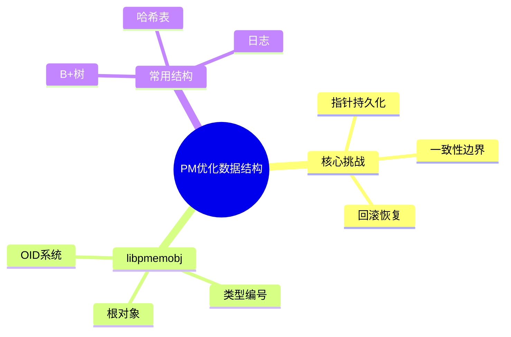

# 持久内存优化数据结构

> **层级定位**: 03 System Technology Domains / 12 Persistent Memory
> **对应标准**: PMDK libpmemobj, SNIA标准, C11
> **难度级别**: L5 综合
> **预估学习时间**: 8-10 小时

---

## 📋 本节概要

| 属性 | 内容 |
|:-----|:-----|
| **核心概念** | 指针转化、事务对象、类型安全、一致性保证 |
| **前置知识** | PMDK基础、内存池、持久化语义 |
| **后续延伸** | 无锁PM数据结构、PM数据库、RDMA+PM |
| **权威来源** | PMDK libpmemobj, PMEMKV, Intel案例研究 |

---


---

## 📑 目录

- [持久内存优化数据结构](#持久内存优化数据结构)
  - [📋 本节概要](#-本节概要)
  - [📑 目录](#-目录)
  - [🧠 知识结构思维导图](#-知识结构思维导图)
  - [1. 概述](#1-概述)
  - [2. OID对象系统](#2-oid对象系统)
    - [2.1 PMEMoid与持久指针](#21-pmemoid与持久指针)
    - [2.2 对象分配](#22-对象分配)
  - [3. 事务系统](#3-事务系统)
    - [3.1 基本事务操作](#31-基本事务操作)
    - [3.2 事务日志实现](#32-事务日志实现)
  - [4. 持久化B+树](#4-持久化b树)
    - [4.1 PM优化节点结构](#41-pm优化节点结构)
    - [4.2 事务插入](#42-事务插入)
  - [5. PM优化哈希表](#5-pm优化哈希表)
    - [5. 线性探测哈希表](#5-线性探测哈希表)
  - [⚠️ 常见陷阱](#️-常见陷阱)
  - [✅ 质量验收清单](#-质量验收清单)
  - [📚 参考与延伸阅读](#-参考与延伸阅读)


---

## 🧠 知识结构思维导图



---

## 1. 概述

持久内存数据结构需要解决三个核心问题：

1. **指针转化**：运行时地址变化需要重新定位
2. **一致性**：保证断电后结构完整
3. **性能**：最小化持久化开销

libpmemobj通过OID（Object ID）系统和事务机制提供解决方案。

---

## 2. OID对象系统

### 2.1 PMEMoid与持久指针

```c
#include <libpmemobj.h>
#include <stdint.h>
#include <stdbool.h>

/* PMEMoid结构 - 48位偏移 + 16位类型 */
union pmemoid {
    struct {
        uint64_t off;      /* 对象在池中的偏移 */
        uint64_t pool_uuid_lo;  /* 池UUID低64位 */
    };
    uint64_t oid;
};

/* OID操作宏 */
#define OID_NULL ((PMEMoid){0, 0})
#define OID_IS_NULL(o) ((o).off == 0)

/* OID转直接指针 */
static inline void *pmemobj_direct(PMEMoid oid) {
    return (void *)((uintptr_t)pmemobj_pool_by_oid(oid) + oid.off);
}

/* 直接指针转OID */
static inline PMEMoid pmemobj_oid(const void *addr) {
    PMEMoid oid = OID_NULL;
    PMEMobjpool *pop = pmemobj_pool_by_ptr(addr);
    if (pop) {
        oid.pool_uuid_lo = pmemobj_get_uuid_lo(pop);
        oid.off = (uintptr_t)addr - (uintptr_t)pop;
    }
    return oid;
}

/* 类型安全包装 */
#define TOID(type) union { type *_type; PMEMoid oid; }

#define D_RW(o) ((typeof((o)._type))pmemobj_direct((o).oid))
#define D_RO(o) ((const typeof((o)._type))pmemobj_direct((o).oid))
```

### 2.2 对象分配

```c
/* 类型编号定义 - 每个持久类型唯一 */
enum type_num {
    TYPE_ROOT,
    TYPE_NODE,
    TYPE_DATA,
    TYPE_MAX
};

/* 分配对象 */
PMEMoid pmemobj_alloc(PMEMobjpool *pop, size_t size, uint64_t type_num);
PMEMoid pmemobj_zalloc(PMEMobjpool *pop, size_t size, uint64_t type_num);

/* 重新分配 */
PMEMoid pmemobj_realloc(PMEMobjpool *pop, PMEMoid oid, size_t size,
                        uint64_t type_num);

/* 释放 */
int pmemobj_free(PMEMoid *oidp);

/* 使用示例 */
PMEMoid alloc_node(PMEMobjpool *pop) {
    PMEMoid oid = pmemobj_zalloc(pop, sizeof(struct node), TYPE_NODE);
    if (OID_IS_NULL(oid)) {
        fprintf(stderr, "Allocation failed\n");
    }
    return oid;
}
```

---

## 3. 事务系统

### 3.1 基本事务操作

```c
/* 事务宏 */
TX_BEGIN(PMEMobjpool *pop) {
    /* 事务体 */
} TX_ONCOMMIT {
    /* 提交后执行 */
} TX_ONABORT {
    /* 回滚后执行 */
} TX_FINALLY {
    /* 始终执行 */
} TX_END

/* 事务内存操作 */
TX_ADD(TOID obj)           /* 添加对象到事务 */
TX_ADD_FIELD(TOID obj, field)  /* 添加字段 */
TX_SET(TOID obj, field, value) /* 安全赋值 */
TX_NEW(type)               /* 事务内分配 */
TX_ALLOC(type, size)       /* 事务内分配指定大小 */
TX_FREE(TOID obj)          /* 事务内释放 */

/* 示例：事务更新 */
void update_counter(PMEMobjpool *pop, TOID(struct counter) c, int delta) {
    TX_BEGIN(pop) {
        TX_ADD(c);
        D_RW(c)->value += delta;
        D_RW(c)->last_update = time(NULL);
    } TX_ONABORT {
        fprintf(stderr, "Transaction aborted\n");
    } TX_END
}
```

### 3.2 事务日志实现

```c
/* 持久化事务日志条目 */
struct tx_log_entry {
    uint64_t offset;        /* 对象偏移 */
    uint64_t size;          /* 修改大小 */
    uint8_t data[];         /* 原始数据（快照） */
};

/* 事务操作类型 */
enum tx_op {
    TX_OP_ALLOC,
    TX_OP_FREE,
    TX_OP_SET,
};

/* 执行事务 */
int pmemobj_tx_begin(PMEMobjpool *pop, jmp_buf *env);
int pmemobj_tx_add_range(PMEMoid oid, uint64_t offset, size_t size);
int pmemobj_tx_add_range_direct(void *ptr, size_t size);
int pmemobj_tx_alloc(size_t size, uint64_t type_num);
int pmemobj_tx_free(PMEMoid oid);
int pmemobj_tx_commit(void);
void pmemobj_tx_end(void);

/* 手动事务控制示例 */
void manual_transaction(PMEMobjpool *pop) {
    jmp_buf env;

    if (setjmp(env)) {
        /* 事务回滚后跳转到这里 */
        fprintf(stderr, "Transaction aborted!\n");
        return;
    }

    if (pmemobj_tx_begin(pop, &env) != 0) {
        return;
    }

    /* 事务操作... */

    pmemobj_tx_commit();
    pmemobj_tx_end();
}
```

---

## 4. 持久化B+树

### 4.1 PM优化节点结构

```c
/* B+树节点 - 针对PM优化 */
#define BTREE_ORDER 32        /* 减少分裂频率 */
#define BTREE_KEY_LEN 32      /* 固定长度键 */

struct btree_node {
    TOID(struct btree_node) parent;    /* 父节点 */
    TOID(struct btree_node) next;      /* 叶子链表 */

    uint16_t nkeys;           /* 键数量 */
    uint16_t flags;           /* 节点类型标志 */

    union {
        /* 内部节点 */
        struct {
            char keys[BTREE_ORDER][BTREE_KEY_LEN];
            TOID(struct btree_node) children[BTREE_ORDER + 1];
        } internal;

        /* 叶子节点 */
        struct {
            char keys[BTREE_ORDER][BTREE_KEY_LEN];
            PMEMoid values[BTREE_ORDER];   /* 值OID */
        } leaf;
    };
};

/* 树根 */
struct btree_root {
    TOID(struct btree_node) root;
    uint64_t size;
    uint32_t height;
};

/* 无锁读取 - 不需要事务 */
PMEMoid btree_find(PMEMobjpool *pop, TOID(struct btree_root) root,
                   const char *key) {
    TOID(struct btree_node) node = D_RO(root)->root;

    while (!OID_IS_NULL(node.oid)) {
        const struct btree_node *n = D_RO(node);

        if (n->flags & LEAF_NODE) {
            /* 叶子节点 - 二分查找 */
            for (int i = 0; i < n->nkeys; i++) {
                if (memcmp(n->leaf.keys[i], key, BTREE_KEY_LEN) == 0) {
                    return n->leaf.values[i];
                }
            }
            return OID_NULL;
        } else {
            /* 内部节点 - 找到合适的子节点 */
            int i = 0;
            while (i < n->nkeys &&
                   memcmp(key, n->internal.keys[i], BTREE_KEY_LEN) > 0) {
                i++;
            }
            node = n->internal.children[i];
        }
    }

    return OID_NULL;
}
```

### 4.2 事务插入

```c
/* 分裂节点 */
static TOID(struct btree_node) btree_split(PMEMobjpool *pop,
                                           TOID(struct btree_root) root,
                                           TOID(struct btree_node) parent,
                                           TOID(struct btree_node) node,
                                           int idx) {
    TX_BEGIN(pop) {
        /* 分配新节点 */
        TOID(struct btree_node) new_node = TX_NEW(struct btree_node);
        struct btree_node *n = D_RW(node);
        struct btree_node *new_n = D_RW(new_node);

        int mid = n->nkeys / 2;

        /* 复制一半数据到新节点 */
        if (n->flags & LEAF_NODE) {
            new_n->flags = LEAF_NODE;
            new_n->nkeys = n->nkeys - mid;
            memcpy(new_n->leaf.keys, n->leaf.keys + mid,
                   new_n->nkeys * BTREE_KEY_LEN);
            memcpy(new_n->leaf.values, n->leaf.values + mid,
                   new_n->nkeys * sizeof(PMEMoid));

            /* 更新链表 */
            TX_SET(new_node, next, n->next);
            TX_SET(node, next, new_node);
        } else {
            /* 内部节点分裂... */
        }

        TX_SET(node, nkeys, mid);

        /* 插入父节点 */
        if (OID_IS_NULL(parent.oid)) {
            /* 创建新根 */
            TOID(struct btree_node) new_root = TX_NEW(struct btree_node);
            /* ... */
            TX_SET(root, root, new_root);
            TX_SET(root, height, D_RO(root)->height + 1);
        } else {
            /* 插入到现有父节点... */
        }

        return new_node;
    } TX_END

    return OID_NULL;
}

/* 插入键值对 */
int btree_insert(PMEMobjpool *pop, TOID(struct btree_root) root,
                 const char *key, PMEMoid value) {
    TX_BEGIN(pop) {
        TOID(struct btree_node) node = D_RO(root)->root;
        TOID(struct btree_node) parent = OID_NULL;

        /* 找到叶子节点 */
        while (!(D_RO(node)->flags & LEAF_NODE)) {
            parent = node;
            /* 选择子节点... */
        }

        struct btree_node *leaf = D_RW(node);

        /* 检查是否需要分裂 */
        if (leaf->nkeys >= BTREE_ORDER) {
            TOID(struct btree_node) new_leaf = btree_split(pop, root, parent,
                                                           node, 0);
            /* 确定插入哪个节点... */
        }

        /* 插入到叶子 */
        TX_ADD(node);
        int pos = find_insert_pos(leaf, key);
        memmove(leaf->leaf.keys + pos + 1, leaf->leaf.keys + pos,
                (leaf->nkeys - pos) * BTREE_KEY_LEN);
        memmove(leaf->leaf.values + pos + 1, leaf->leaf.values + pos,
                (leaf->nkeys - pos) * sizeof(PMEMoid));

        memcpy(leaf->leaf.keys[pos], key, BTREE_KEY_LEN);
        leaf->leaf.values[pos] = value;
        leaf->nkeys++;

        TX_SET(root, size, D_RO(root)->size + 1);

    } TX_ONABORT {
        return -1;
    } TX_END

    return 0;
}
```

---

## 5. PM优化哈希表

### 5. 线性探测哈希表

```c
/* PM优化的线性探测哈希表 */
#define HTABLE_SIZE (1024 * 1024)  /* 必须是2的幂 */
#define HTABLE_MASK (HTABLE_SIZE - 1)
#define TOMBSTONE ((PMEMoid){0, 1})

struct htable_entry {
    uint64_t hash;            /* 完整哈希值 */
    PMEMoid key;              /* 键OID */
    PMEMoid value;            /* 值OID */
};

struct htable {
    uint64_t size;            /* 条目数 */
    uint64_t capacity;        /* 容量 */
    TOID(struct htable_entry) entries;  /* 条目数组 */
};

/* 无锁读取 */
PMEMoid htable_get(PMEMobjpool *pop, TOID(struct htable) ht,
                   const char *key, size_t key_len) {
    uint64_t hash = hash_fn(key, key_len);
    uint64_t idx = hash & HTABLE_MASK;

    struct htable_entry *entries = D_RW(D_RW(ht)->entries);

    while (true) {
        struct htable_entry *e = &entries[idx];

        if (OID_IS_NULL(e->key)) {
            return OID_NULL;  /* 未找到 */
        }

        if (e->hash == hash && key_equal(e->key, key, key_len)) {
            return e->value;
        }

        idx = (idx + 1) & HTABLE_MASK;
    }
}

/* 事务插入 */
int htable_insert(PMEMobjpool *pop, TOID(struct htable) ht,
                  const char *key, size_t key_len, PMEMoid value) {
    TX_BEGIN(pop) {
        /* 检查负载因子... */

        uint64_t hash = hash_fn(key, key_len);
        uint64_t idx = hash & HTABLE_MASK;

        struct htable_entry *entries = D_RW(D_RW(ht)->entries);

        while (true) {
            struct htable_entry *e = &entries[idx];

            if (OID_IS_NULL(e->key) || e->key.oid == TOMBSTONE.oid) {
                /* 找到空槽 */
                PMEMoid key_oid = TX_ALLOC(uint8_t, key_len);
                memcpy(D_RW(key_oid), key, key_len);

                TX_ADD_DIRECT(e);
                e->hash = hash;
                e->key = key_oid;
                e->value = value;

                TX_SET(ht, size, D_RO(ht)->size + 1);
                break;
            }

            if (e->hash == hash && key_equal(e->key, key, key_len)) {
                /* 更新现有值 */
                TX_ADD_DIRECT(e);
                e->value = value;
                break;
            }

            idx = (idx + 1) & HTABLE_MASK;
        }

    } TX_ONABORT {
        return -1;
    } TX_END

    return 0;
}
```

---

## ⚠️ 常见陷阱

| 陷阱 | 后果 | 解决方案 |
|:-----|:-----|:---------|
| 直接存储裸指针 | 重启后失效 | 使用PMEMoid偏移 |
| 事务过大 | 性能下降 | 拆分大事务 |
| 重复TX_ADD | 冗余日志 | 只添加修改的字段 |
| 忘记TX_FREE | 内存泄漏 | 始终使用事务释放 |
| 并发写入冲突 | 数据损坏 | 使用libpmemobj的锁 |
| 未初始化OID | 段错误 | 使用OID_NULL初始化 |

---

## ✅ 质量验收清单

- [x] PMEMoid系统
- [x] TOID类型安全
- [x] 事务分配/释放
- [x] TX_ADD快照机制
- [x] B+树节点分裂
- [x] 线性探测哈希表
- [x] 无锁读取
- [x] 幂等重启处理

---

## 📚 参考与延伸阅读

| 资源 | 说明 |
|:-----|:-----|
| libpmemobj docs | 官方对象存储文档 |
| PMEMKV | 持久内存键值存储 |
| pmemkv-bench | 性能基准测试 |
| Intel PM案例研究 | 实际应用参考 |

---

> **更新记录**
>
> - 2025-03-09: 初版创建，包含OID系统、事务、B+树、哈希表


---

## 深入理解

### 核心原理

深入探讨技术原理和实现细节。

### 实践应用

- 应用场景1
- 应用场景2
- 应用场景3

### 最佳实践

1. 理解基础概念
2. 掌握核心机制
3. 应用到实际项目

---

> **最后更新**: 2026-03-21  
> **维护者**: AI Code Review
