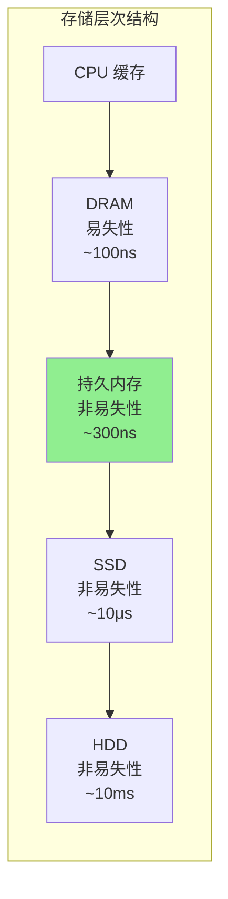
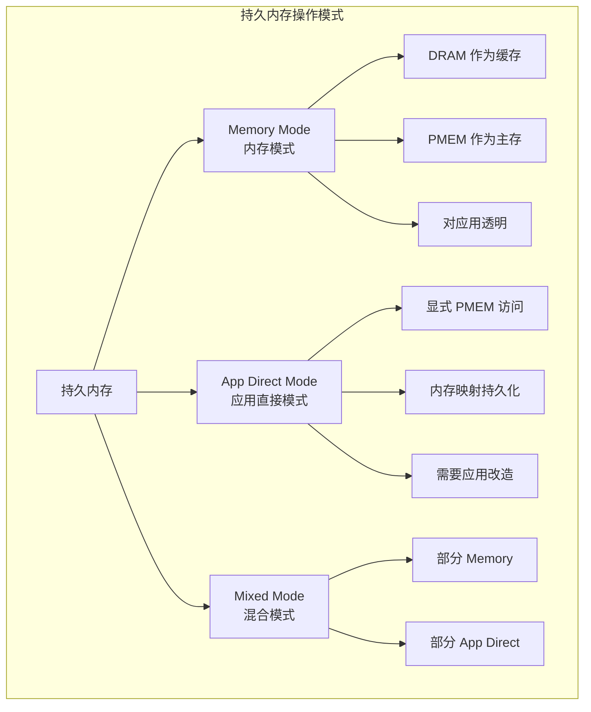
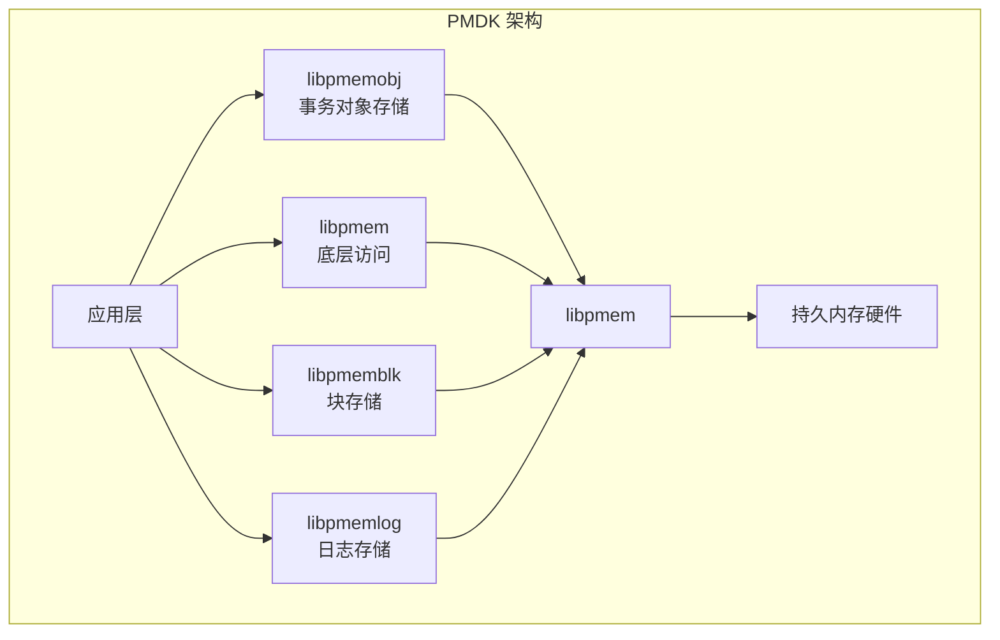
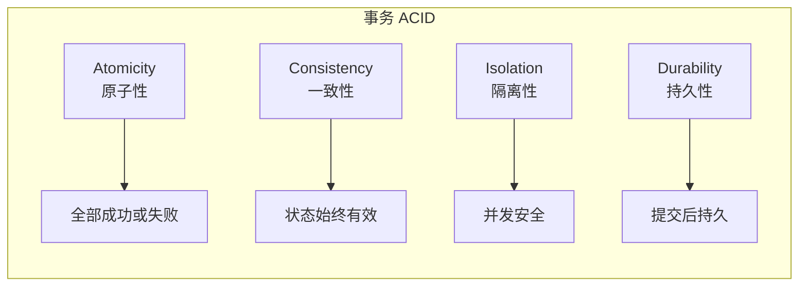
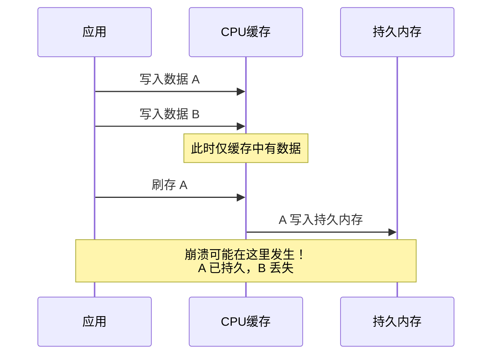
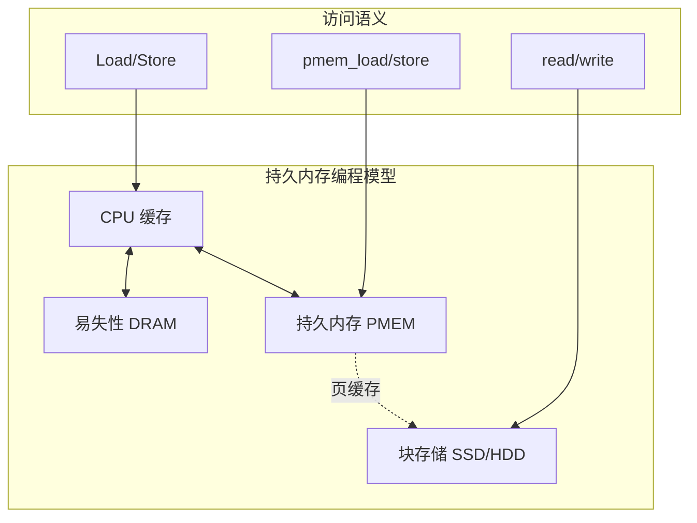
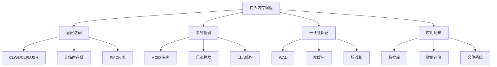

# 持久内存编程

## 目录

- [持久内存编程](#持久内存编程)
  - [目录](#目录)
  - [持久内存概述](#持久内存概述)
    - [什么是持久内存](#什么是持久内存)
    - [Intel Optane 持久内存](#intel-optane-持久内存)
    - [操作模式](#操作模式)
  - [内存映射持久化](#内存映射持久化)
    - [mmap 基础](#mmap-基础)
    - [显式缓存刷新](#显式缓存刷新)
    - [优化的复制操作](#优化的复制操作)
  - [PMDK 库简介](#pmdk-库简介)
    - [libpmem 基础库](#libpmem-基础库)
    - [libpmemobj 事务对象存储](#libpmemobj-事务对象存储)
    - [类型安全宏详解](#类型安全宏详解)
    - [libpmemblk 块存储](#libpmemblk-块存储)
  - [事务内存](#事务内存)
    - [ACID 属性与持久内存](#acid-属性与持久内存)
    - [手动事务实现](#手动事务实现)
    - [乐观并发控制](#乐观并发控制)
  - [崩溃一致性](#崩溃一致性)
    - [一致性挑战](#一致性挑战)
    - [一致性协议](#一致性协议)
    - [检测与恢复](#检测与恢复)
  - [持久内存编程模型](#持久内存编程模型)
    - [内存分层架构](#内存分层架构)
    - [对象存储模型](#对象存储模型)
    - [键值存储实现](#键值存储实现)
    - [持久内存最佳实践](#持久内存最佳实践)
  - [总结](#总结)

---

## 持久内存概述

### 什么是持久内存

持久内存 (Persistent Memory, PMEM) 是一种新型存储技术，它结合了 DRAM 的高性能和传统存储的持久性特性。



### Intel Optane 持久内存

Intel Optane DC 持久内存是当前主流的持久内存产品，主要特性：

| 特性 | 规格 |
|------|------|
| 容量 | 128GB / 256GB / 512GB |
| 读取延迟 | ~300ns |
| 写入延迟 | ~100ns (AD 模式) |
| 耐久性 | 约 60 PBW (128GB) |
| 接口 | DDR4 DIMM |

### 操作模式



**内存模式 (Memory Mode)**:

- DRAM 作为持久内存的缓存
- 对应用完全透明
- 提供大容量易失性内存

**应用直接模式 (App Direct Mode)**:

- 应用直接访问持久内存
- 需要显式持久化操作
- 提供数据持久性保证

---

## 内存映射持久化

### mmap 基础

持久内存的核心访问方式是通过内存映射 (mmap) 将持久内存设备映射到进程地址空间。

```c
#include <sys/mman.h>
#include <sys/types.h>
#include <sys/stat.h>
#include <fcntl.h>
#include <unistd.h>
#include <stdio.h>
#include <stdlib.h>
#include <string.h>
#include <errno.h>

/* 基本的内存映射持久内存操作 */
#define PMEM_PATH "/dev/dax0.0"  /* DAX 设备路径 */
#define PMEM_LEN (1024 * 1024 * 1024)  /* 1GB */

void *pmem_map(const char *path, size_t len) {
    int fd = open(path, O_RDWR);
    if (fd < 0) {
        perror("open");
        return MAP_FAILED;
    }

    /* 使用 MAP_SYNC 标志确保持久化 */
    void *addr = mmap(NULL, len, PROT_READ | PROT_WRITE,
                     MAP_SHARED_VALIDATE | MAP_SYNC, fd, 0);

    if (addr == MAP_FAILED) {
        /* 回退到普通 mmap */
        addr = mmap(NULL, len, PROT_READ | PROT_WRITE,
                   MAP_SHARED, fd, 0);
    }

    close(fd);
    return addr;
}

int pmem_unmap(void *addr, size_t len) {
    return munmap(addr, len);
}
```

### 显式缓存刷新

持久内存编程的关键挑战是确保数据真正写入持久内存而非停留在 CPU 缓存中。

```c
#include <immintrin.h>
#include <emmintrin.h>

/* x86 缓存行刷新指令 */
#define CACHE_LINE_SIZE 64

/* 单个缓存行刷新的内建函数 */
static inline void pmem_clflush(const void *addr) {
    _mm_clflush(addr);
}

/* CLWB (Cache Line Write Back) - 保留在缓存中 */
static inline void pmem_clwb(const void *addr) {
    _mm_clwb(addr);
}

/* CLFLUSHOPT - 优化版刷新 */
static inline void pmem_clflushopt(const void *addr) {
    _mm_clflushopt(addr);
}

/* 内存屏障 */
static inline void pmem_sfence(void) {
    _mm_sfence();
}

/* 刷存一片内存区域 */
void pmem_flush(const void *addr, size_t len) {
    uintptr_t uptr = (uintptr_t)addr;
    uintptr_t end = uptr + len;

    /* 对齐到缓存行 */
    uptr = (uptr + CACHE_LINE_SIZE - 1) & ~(CACHE_LINE_SIZE - 1);

    for (; uptr < end; uptr += CACHE_LINE_SIZE) {
        pmem_clwb((const void *)uptr);
    }

    /* 确保顺序性 */
    pmem_sfence();
}

/* 非临时存储 (绕过缓存) */
void pmem_ntstore(void *dest, const void *src, size_t len) {
    char *d = dest;
    const char *s = src;

    /* 使用非临时移动指令 */
    while (len >= 64) {
        __m512i data = _mm512_loadu_si512((__m512i const *)s);
        _mm512_stream_si512((__m512i *)d, data);

        s += 64;
        d += 64;
        len -= 64;
    }

    /* 处理剩余字节 */
    while (len > 0) {
        *d = *s;
        d++;
        s++;
        len--;
    }

    pmem_sfence();
}
```

### 优化的复制操作

```c
#include <immintrin.h>

/* 针对持久内存优化的 memcpy */
void *pmem_memcpy(void *dest, const void *src, size_t n, int flags) {
    if (flags & PMEM_F_MEM_NONTEMPORAL) {
        /* 非临时存储，适合大内存块 */
        return pmem_memcpy_nt(dest, src, n);
    } else {
        /* 普通存储 + 显式刷新 */
        void *ret = memcpy(dest, src, n);
        pmem_flush(dest, n);
        return ret;
    }
}

/* 非临时 memcpy 实现 */
static void *pmem_memcpy_nt(void *dest, const void *src, size_t n) {
    char *d = dest;
    const char *s = src;

    /* 处理不对齐部分 */
    while (n && ((uintptr_t)d & 63)) {
        *d = *s;
        d++;
        s++;
        n--;
    }

    /* 64字节块复制 */
    while (n >= 64) {
        __m512i zmm0 = _mm512_loadu_si512((__m512i const *)s);
        _mm512_stream_si512((__m512i *)d, zmm0);

        s += 64;
        d += 64;
        n -= 64;
    }

    /* 剩余字节 */
    while (n > 0) {
        *d = *s;
        d++;
        s++;
        n--;
    }

    _mm_sfence();
    return dest;
}

/* 持久化 memset */
void *pmem_memset(void *dest, int c, size_t n, int flags) {
    if (flags & PMEM_F_MEM_NONTEMPORAL) {
        /* 非临时存储的 memset */
        char *d = dest;
        __m512i zmm = _mm512_set1_epi8((char)c);

        while (n >= 64) {
            _mm512_stream_si512((__m512i *)d, zmm);
            d += 64;
            n -= 64;
        }

        while (n > 0) {
            *d++ = (char)c;
            n--;
        }

        _mm_sfence();
    } else {
        memset(dest, c, n);
        pmem_flush(dest, n);
    }

    return dest;
}
```

---

## PMDK 库简介

PMDK (Persistent Memory Development Kit) 是一组用于简化持久内存编程的库。



### libpmem 基础库

```c
#include <libpmem.h>
#include <stdio.h>
#include <stdlib.h>
#include <string.h>

/* 检测持久内存支持 */
void pmem_features_check(void) {
    int has_clflush = pmem_has_auto_flush();
    printf("Has CPU automatic flush: %s\n", has_clflush ? "yes" : "no");

    /* 获取内存映射文件的持久内存属性 */
    size_t mapped_len;
    int is_pmem;

    void *addr = pmem_map_file("/mnt/pmem/testfile", 1024 * 1024,
                              PMEM_FILE_CREATE, 0666, &mapped_len, &is_pmem);

    if (addr) {
        printf("Is persistent memory: %s\n", is_pmem ? "yes" : "no");
        printf("Mapped length: %zu\n", mapped_len);

        /* 使用持久内存 */
        strcpy((char *)addr, "Hello, Persistent Memory!");

        /* 显式持久化 */
        if (is_pmem) {
            pmem_persist(addr, 26);
        } else {
            pmem_msync(addr, 26);
        }

        pmem_unmap(addr, mapped_len);
    }
}

/* 高性能持久化写入 */
void pmem_optimized_write(void *pmemaddr, const void *src, size_t len) {
    /* 根据数据大小选择最佳策略 */
    if (len < 256) {
        /* 小数据：普通 memcpy + persist */
        memcpy(pmemaddr, src, len);
        pmem_persist(pmemaddr, len);
    } else if (len < 4096) {
        /* 中数据：使用 flush */
        memcpy(pmemaddr, src, len);
        pmem_flush(pmemaddr, len);
        pmem_drain();  /* fence */
    } else {
        /* 大数据：非临时存储 */
        pmem_memcpy_persist(pmemaddr, src, len);
    }
}
```

### libpmemobj 事务对象存储

```c
#include <libpmemobj.h>
#include <stdio.h>
#include <stdlib.h>
#include <string.h>

/* 对象布局定义 */
POBJ_LAYOUT_BEGIN(pmem_store);
POBJ_LAYOUT_ROOT(pmem_store, struct store_root);
POBJ_LAYOUT_TOID(pmem_store, struct store_item);
POBJ_LAYOUT_END(pmem_store);

struct store_item {
    uint64_t id;
    char data[256];
    uint64_t timestamp;
};

struct store_root {
    TOID(struct store_item) items;
    uint64_t count;
};

/* 打开或创建持久内存池 */
PMEMobjpool *pool_open(const char *path) {
    PMEMobjpool *pop = pmemobj_open(path, POBJ_LAYOUT_NAME(pmem_store));

    if (!pop) {
        /* 创建新池 */
        pop = pmemobj_create(path, POBJ_LAYOUT_NAME(pmem_store),
                            PMEMOBJ_MIN_POOL, 0666);
        if (!pop) {
            perror("pmemobj_create");
            return NULL;
        }

        /* 初始化根对象 */
        TX_BEGIN(pop) {
            TX_ADD(pool_root(pop, NULL));
            struct store_root *root = D_RW(pool_root(pop, NULL));
            root->count = 0;
            root->items = TX_NULL;
        } TX_END
    }

    return pop;
}

/* 事务添加项目 */
int add_item(PMEMobjpool *pop, const char *data) {
    int ret = 0;

    TX_BEGIN(pop) {
        /* 分配新对象 */
        TOID(struct store_item) item = TX_NEW(struct store_item);

        /* 在事务中修改 */
        TX_ADD(item);
        struct store_item *item_ptr = D_RW(item);
        item_ptr->id = D_RO(pool_root(pop, NULL))->count;
        strncpy(item_ptr->data, data, sizeof(item_ptr->data) - 1);
        item_ptr->timestamp = time(NULL);

        /* 更新根对象 */
        TX_ADD(pool_root(pop, NULL));
        struct store_root *root = D_RW(pool_root(pop, NULL));
        root->count++;

    } TX_ONABORT {
        fprintf(stderr, "Transaction aborted\n");
        ret = -1;
    } TX_END

    return ret;
}

/* 原子更新 */
void atomic_update(PMEMobjpool *pop, TOID(struct store_item) item,
                   const char *new_data) {
    TX_BEGIN(pop) {
        TX_ADD(item);
        struct store_item *ptr = D_RW(item);
        strncpy(ptr->data, new_data, sizeof(ptr->data) - 1);
        ptr->timestamp = time(NULL);
    } TX_END
}

/* 使用操作日志 */
void logged_operation(PMEMobjpool *pop) {
    TX_BEGIN(pop) {
        /* 操作会被记录到日志 */
        TX_SET(D_RW(pool_root(pop, NULL)), count,
               D_RO(pool_root(pop, NULL))->count + 1);
    } TX_END
}
```

### 类型安全宏详解

```c
/* PMDK 类型系统 */
TOID(struct my_struct) obj;  /* 类型安全的对象 ID */

D_RO(obj)  /* 只读访问 */
D_RW(obj)  /* 读写访问 */
D_RO_DIRECT(obj)  /* 直接指针访问 */

/* 类型安全的事务操作 */
TX_ADD(obj)           /* 添加对象到事务 */
TX_ADD_DIRECT(ptr)    /* 添加直接指针 */
TX_SET(obj, field, value)  /* 安全设置字段 */
TX_NEW(type)          /* 事务分配 */
TX_ALLOC(type, size)  /* 事务分配指定大小 */
TX_FREE(obj)          /* 事务释放 */
```

### libpmemblk 块存储

```c
#include <libpmemblk.h>
#include <stdio.h>
#include <string.h>

#define BLOCK_SIZE 512
#define NUM_BLOCKS 1000

/* 块存储操作 */
void pmemblk_example(void) {
    PMEMblkpool *pbp = pmemblk_open("/mnt/pmem/myblkpool", BLOCK_SIZE);

    if (!pbp) {
        pbp = pmemblk_create("/mnt/pmem/myblkpool", BLOCK_SIZE,
                            NUM_BLOCKS, 0666);
    }

    if (!pbp) {
        perror("pmemblk_create");
        return;
    }

    /* 写入块 */
    char buf[BLOCK_SIZE];
    memset(buf, 'A', BLOCK_SIZE);
    pmemblk_write(pbp, buf, 0);  /* 写入块 0 */

    /* 读取块 */
    char read_buf[BLOCK_SIZE];
    pmemblk_read(pbp, read_buf, 0);

    printf("Block 0 data: %c\n", read_buf[0]);

    pmemblk_close(pbp);
}
```

---

## 事务内存

### ACID 属性与持久内存



### 手动事务实现

```c
#include <stdatomic.h>
#include <stdlib.h>
#include <string.h>
#include <stdio.h>

/* 事务日志结构 */
typedef struct {
    uint64_t transaction_id;
    uint64_t sequence_number;
    void *destination;
    void *old_value;
    size_t size;
    uint32_t checksum;
} log_entry_t;

typedef struct {
    uint64_t tx_id;
    log_entry_t *entries;
    size_t num_entries;
    size_t capacity;
    int committed;
} transaction_t;

/* 写前日志 (WAL) */
typedef struct {
    log_entry_t *log_buffer;
    atomic_size_t log_tail;
    size_t log_capacity;
    void *pmem_base;
} wal_manager_t;

/* 开始事务 */
transaction_t *transaction_begin(wal_manager_t *wal) {
    transaction_t *tx = calloc(1, sizeof(transaction_t));
    static atomic_uint_least64_t tx_id_counter = 0;
    tx->tx_id = atomic_fetch_add(&tx_id_counter, 1);
    tx->capacity = 16;
    tx->entries = calloc(tx->capacity, sizeof(log_entry_t));
    return tx;
}

/* 添加修改到事务 */
void transaction_write(transaction_t *tx, void *dest, const void *src, size_t size) {
    /* 扩容 */
    if (tx->num_entries >= tx->capacity) {
        tx->capacity *= 2;
        tx->entries = realloc(tx->entries, tx->capacity * sizeof(log_entry_t));
    }

    log_entry_t *entry = &tx->entries[tx->num_entries++];
    entry->transaction_id = tx->tx_id;
    entry->destination = dest;
    entry->old_value = malloc(size);
    memcpy(entry->old_value, dest, size);  /* 保存旧值 */
    entry->size = size;

    /* 计算校验和 */
    entry->checksum = compute_checksum(src, size);

    /* 写入目标 */
    memcpy(dest, src, size);
}

/* 提交事务 */
int transaction_commit(wal_manager_t *wal, transaction_t *tx) {
    /* 1. 写入日志条目 */
    for (size_t i = 0; i < tx->num_entries; i++) {
        size_t idx = atomic_fetch_add(&wal->log_tail, 1);
        wal->log_buffer[idx] = tx->entries[i];
        pmem_persist(&wal->log_buffer[idx], sizeof(log_entry_t));
    }

    /* 2. 写入提交记录 */
    tx->committed = 1;
    pmem_persist(&tx->committed, sizeof(tx->committed));

    /* 3. 确保所有数据持久化 */
    for (size_t i = 0; i < tx->num_entries; i++) {
        pmem_persist(tx->entries[i].destination, tx->entries[i].size);
    }

    /* 4. 清理日志 */
    for (size_t i = 0; i < tx->num_entries; i++) {
        free(tx->entries[i].old_value);
    }
    free(tx->entries);
    free(tx);

    return 0;
}

/* 崩溃恢复 */
void recover(wal_manager_t *wal) {
    printf("Starting recovery...\n");

    size_t tail = atomic_load(&wal->log_tail);
    for (size_t i = 0; i < tail; i++) {
        log_entry_t *entry = &wal->log_buffer[i];

        /* 验证校验和 */
        uint32_t current_checksum = compute_checksum(entry->destination, entry->size);

        if (current_checksum != entry->checksum) {
            printf("Inconsistent data at entry %zu, rolling back\n", i);
            memcpy(entry->destination, entry->old_value, entry->size);
            pmem_persist(entry->destination, entry->size);
        }
    }

    /* 清空日志 */
    atomic_store(&wal->log_tail, 0);
    pmem_persist(&wal->log_tail, sizeof(wal->log_tail));

    printf("Recovery complete\n");
}
```

### 乐观并发控制

```c
#include <stdatomic.h>

/* 版本化对象 */
typedef struct {
    atomic_uint_least64_t version;
    void *data;
    size_t size;
} versioned_object_t;

typedef struct {
    versioned_object_t **read_set;
    size_t read_count;
    versioned_object_t **write_set;
    void **write_values;
    size_t write_count;
    uint64_t start_version;
} ooc_transaction_t;

/* 读取对象 - 记录到读集合 */
void *ooc_read(ooc_transaction_t *tx, versioned_object_t *obj) {
    uint64_t version = atomic_load(&obj->version);
    void *data = obj->data;

    /* 记录读集合 */
    tx->read_set[tx->read_count++] = obj;

    /* 验证版本未变化 */
    if (atomic_load(&obj->version) != version) {
        return NULL;
    }

    return data;
}

/* 写入对象 - 延迟到提交 */
void ooc_write(ooc_transaction_t *tx, versioned_object_t *obj, void *value) {
    tx->write_set[tx->write_count] = obj;
    tx->write_values[tx->write_count] = value;
    tx->write_count++;
}

/* 提交事务 */
int ooc_commit(ooc_transaction_t *tx) {
    /* 1. 验证读集合 */
    for (size_t i = 0; i < tx->read_count; i++) {
        if (atomic_load(&tx->read_set[i]->version) > tx->start_version) {
            return -1;  /* 冲突，提交失败 */
        }
    }

    /* 2. 获取新版本号 */
    uint64_t new_version = tx->start_version + 1;

    /* 3. 写入所有修改 */
    for (size_t i = 0; i < tx->write_count; i++) {
        versioned_object_t *obj = tx->write_set[i];
        memcpy(obj->data, tx->write_values[i], obj->size);
        pmem_persist(obj->data, obj->size);

        atomic_store(&obj->version, new_version);
        pmem_persist(&obj->version, sizeof(obj->version));
    }

    return 0;
}
```

---

## 崩溃一致性

### 一致性挑战



### 一致性协议

```c
#include <stdlib.h>
#include <string.h>

/* 带校验和的数据块 */
typedef struct {
    uint64_t sequence_number;
    uint32_t data_checksum;
    uint32_t header_checksum;
    uint8_t data[];
} checksummed_block_t;

/* 双缓冲一致性 */
typedef struct {
    void *buffer_a;
    void *buffer_b;
    atomic_int active_buffer;  /* 0 = A, 1 = B */
    atomic_uint_least64_t sequence;
} double_buffer_t;

/* 原子双缓冲写入 */
void double_buffer_write(double_buffer_t *db, const void *data, size_t len) {
    int current = atomic_load(&db->active_buffer);
    int next = 1 - current;

    void *target = (next == 0) ? db->buffer_a : db->buffer_b;

    /* 1. 写入到非活动缓冲区 */
    memcpy(target, data, len);
    pmem_persist(target, len);

    /* 2. 原子切换活动缓冲区 */
    atomic_store(&db->active_buffer, next);
    pmem_persist(&db->active_buffer, sizeof(db->active_buffer));
}

/* 读取 */
void *double_buffer_read(double_buffer_t *db) {
    int current = atomic_load(&db->active_buffer);
    return (current == 0) ? db->buffer_a : db->buffer_b;
}

/* 影子页机制 */
typedef struct {
    void *current_page;
    void *shadow_page;
    atomic_uint_least64_t version;
} shadow_page_t;

void shadow_page_update(shadow_page_t *sp, const void *data, size_t len) {
    /* 1. 写入影子页 */
    memcpy(sp->shadow_page, data, len);
    pmem_persist(sp->shadow_page, len);

    /* 2. 原子切换指针 */
    void *temp = sp->current_page;
    sp->current_page = sp->shadow_page;
    pmem_persist(&sp->current_page, sizeof(sp->current_page));

    sp->shadow_page = temp;
    atomic_fetch_add(&sp->version, 1);
}
```

### 检测与恢复

```c
#include <stdbool.h>
#include <stdlib.h>

/* 元数据头部 */
typedef struct {
    uint64_t magic;
    uint64_t version;
    uint64_t checksum;
    uint64_t size;
    uint64_t flags;
    uint8_t padding[64 - 40];
} pmem_header_t;

#define PMEM_MAGIC 0x504D454D20202020ULL
#define FLAG_CLEAN_SHUTDOWN 0x0001
#define FLAG_IN_PROGRESS 0x0002

/* 检查并修复 */
bool pmem_check_and_repair(void *base, size_t len) {
    pmem_header_t *hdr = (pmem_header_t *)base;

    /* 检查魔数 */
    if (hdr->magic != PMEM_MAGIC) {
        fprintf(stderr, "Invalid magic number\n");
        return false;
    }

    /* 检查是否干净关闭 */
    if (hdr->flags & FLAG_CLEAN_SHUTDOWN) {
        printf("Clean shutdown detected\n");
        hdr->flags &= ~FLAG_CLEAN_SHUTDOWN;
        hdr->flags |= FLAG_IN_PROGRESS;
        pmem_persist(&hdr->flags, sizeof(hdr->flags));
        return true;
    }

    /* 检查是否有未完成的事务 */
    if (hdr->flags & FLAG_IN_PROGRESS) {
        printf("Crash detected, starting recovery\n");

        if (!perform_recovery(base, len)) {
            fprintf(stderr, "Recovery failed\n");
            return false;
        }
    }

    /* 标记为进行中 */
    hdr->flags |= FLAG_IN_PROGRESS;
    pmem_persist(&hdr->flags, sizeof(hdr->flags));

    return true;
}

/* 干净关闭 */
void pmem_clean_shutdown(void *base) {
    pmem_header_t *hdr = (pmem_header_t *)base;

    hdr->flags &= ~FLAG_IN_PROGRESS;
    hdr->flags |= FLAG_CLEAN_SHUTDOWN;
    pmem_persist(&hdr->flags, sizeof(hdr->flags));
}
```

---

## 持久内存编程模型

### 内存分层架构



### 对象存储模型

```c
#include <stdint.h>
#include <stdlib.h>

/* 对象标识符 */
typedef uint64_t pmem_oid_t;

/* 对象类型定义 */
typedef enum {
    PMEM_TYPE_RAW,
    PMEM_TYPE_STRING,
    PMEM_TYPE_ARRAY,
    PMEM_TYPE_TREE,
    PMEM_TYPE_GRAPH
} pmem_type_t;

/* 对象头部 */
typedef struct {
    pmem_oid_t oid;
    pmem_type_t type;
    uint64_t size;
    uint64_t refcount;
    uint64_t version;
    uint32_t checksum;
} pmem_obj_header_t;

/* 对象存储 */
typedef struct {
    void *heap_base;
    size_t heap_size;
    pmem_oid_t next_oid;
    void *root_table;
} pmem_heap_t;

/* 分配对象 */
pmem_oid_t pmem_alloc(pmem_heap_t *heap, pmem_type_t type, size_t size) {
    pmem_oid_t oid = heap->next_oid++;

    size_t total_size = sizeof(pmem_obj_header_t) + size;
    void *ptr = pmem_heap_allocate(heap, total_size);

    pmem_obj_header_t *hdr = ptr;
    hdr->oid = oid;
    hdr->type = type;
    hdr->size = size;
    hdr->refcount = 1;
    hdr->version = 1;
    hdr->checksum = 0;

    pmem_persist(hdr, sizeof(pmem_obj_header_t));

    return oid;
}

/* 获取对象指针 */
void *pmem_resolve(pmem_heap_t *heap, pmem_oid_t oid) {
    void *ptr = pmem_heap_lookup(heap, oid);
    if (!ptr) return NULL;

    pmem_obj_header_t *hdr = ptr;
    if (hdr->oid != oid) {
        return NULL;
    }

    return (char *)ptr + sizeof(pmem_obj_header_t);
}
```

### 键值存储实现

```c
#include <string.h>
#include <stdlib.h>
#include <stdint.h>

/* 持久化键值对 */
typedef struct pmem_kv_entry {
    uint32_t key_hash;
    uint16_t key_len;
    uint16_t value_len;
    struct pmem_kv_entry *next;
    char data[];
} pmem_kv_entry_t;

typedef struct {
    pmem_kv_entry_t **buckets;
    size_t num_buckets;
    size_t num_entries;
    uint64_t version;
} pmem_kv_store_t;

/* FNV-1a 哈希 */
static uint32_t fnv1a_hash(const char *key, size_t len) {
    uint32_t hash = 2166136261U;
    for (size_t i = 0; i < len; i++) {
        hash ^= (uint8_t)key[i];
        hash *= 16777619U;
    }
    return hash;
}

/* 设置键值对 */
int pmem_kv_set(pmem_heap_t *heap, pmem_kv_store_t *store,
                const char *key, const char *value) {
    size_t key_len = strlen(key);
    size_t value_len = strlen(value);
    uint32_t hash = fnv1a_hash(key, key_len);
    size_t bucket_idx = hash % store->num_buckets;

    pmem_kv_entry_t *entry = store->buckets[bucket_idx];
    pmem_kv_entry_t *prev = NULL;

    while (entry) {
        if (entry->key_hash == hash && entry->key_len == key_len &&
            memcmp(entry->data, key, key_len) == 0) {
            TX_BEGIN(heap) {
                TX_ADD_DIRECT(entry);

                if (entry->value_len >= value_len) {
                    memcpy(entry->data + key_len, value, value_len + 1);
                    entry->value_len = value_len;
                } else {
                    pmem_kv_entry_t *new_entry = TX_ALLOC(pmem_kv_entry_t,
                        sizeof(pmem_kv_entry_t) + key_len + value_len + 2);

                    new_entry->key_hash = hash;
                    new_entry->key_len = key_len;
                    new_entry->value_len = value_len;
                    new_entry->next = entry->next;

                    memcpy(new_entry->data, key, key_len + 1);
                    memcpy(new_entry->data + key_len + 1, value, value_len + 1);

                    if (prev) {
                        TX_ADD_DIRECT(prev);
                        prev->next = new_entry;
                    } else {
                        TX_ADD_DIRECT(&store->buckets[bucket_idx]);
                        store->buckets[bucket_idx] = new_entry;
                    }

                    TX_FREE(entry);
                }
            } TX_END

            return 0;
        }
        prev = entry;
        entry = entry->next;
    }

    TX_BEGIN(heap) {
        pmem_kv_entry_t *new_entry = TX_ALLOC(pmem_kv_entry_t,
            sizeof(pmem_kv_entry_t) + key_len + value_len + 2);

        new_entry->key_hash = hash;
        new_entry->key_len = key_len;
        new_entry->value_len = value_len;

        memcpy(new_entry->data, key, key_len + 1);
        memcpy(new_entry->data + key_len + 1, value, value_len + 1);

        TX_ADD_DIRECT(&store->buckets[bucket_idx]);
        new_entry->next = store->buckets[bucket_idx];
        store->buckets[bucket_idx] = new_entry;

        TX_ADD_DIRECT(&store->num_entries);
        store->num_entries++;
    } TX_END

    return 0;
}
```

### 持久内存最佳实践

```c
#include <libpmem.h>

/* 性能优化指南 */

/* 1. 批量持久化 */
void batch_persist_example(void *pmem, size_t len) {
    /* 差：频繁刷存 */
    for (int i = 0; i < 100; i++) {
        ((int *)pmem)[i] = i;
        pmem_persist(&((int *)pmem)[i], sizeof(int));
    }

    /* 好：批量刷存 */
    for (int i = 0; i < 100; i++) {
        ((int *)pmem)[i] = i;
    }
    pmem_persist(pmem, 100 * sizeof(int));
}

/* 2. 缓存行对齐 */
#define CACHELINE_ALIGN __attribute__((aligned(64)))

typedef struct {
    CACHELINE_ALIGN atomic_uint_least64_t counter;
    CACHELINE_ALIGN atomic_uint_least64_t reads;
    CACHELINE_ALIGN atomic_uint_least64_t writes;
} aligned_stats_t;

/* 3. 避免伪共享 */
typedef struct {
    CACHELINE_ALIGN atomic_int counter_a;
    char padding[60];
    atomic_int counter_b;
} no_false_sharing_t;

/* 4. 关键建议总结 */
/*
 * 1. 小数据 (<256B): memcpy + pmem_persist
 * 2. 中数据 (256B-4KB): memcpy + pmem_flush + pmem_drain
 * 3. 大数据 (>4KB): pmem_memcpy_persist (非临时存储)
 * 4. 使用事务库 (libpmemobj) 简化一致性管理
 * 5. 始终考虑崩溃恢复场景
 * 6. 使用校验和验证数据完整性
 * 7. 对齐数据到缓存行边界
 */
```

---

## 总结

持久内存编程为高性能数据持久化提供了新的可能性：



**关键要点：**

1. **显式持久化**: 必须通过 CLWB/CLFLUSH + SFENCE 确保持久化
2. **事务支持**: 使用 PMDK 事务简化崩溃一致性管理
3. **性能优化**: 根据数据大小选择合适的持久化策略
4. **数据完整性**: 使用校验和检测静默数据损坏
5. **恢复机制**: 设计完善的崩溃恢复流程
