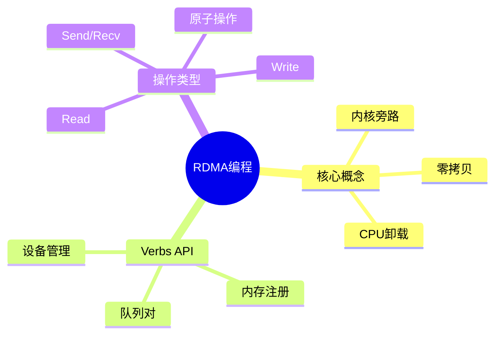

# RDMA Verbs API编程

> **层级定位**: 03 System Technology Domains / 12 RDMA Networking
> **对应标准**: InfiniBand, RoCE, libibverbs
> **难度级别**: L5 综合
> **预估学习时间**: 8-10 小时

---

## 📋 本节概要

| 属性 | 内容 |
|:-----|:-----|
| **核心概念** | RDMA、InfiniBand、Verbs API、零拷贝 |
| **前置知识** | 网络编程、内存注册、DMA |
| **后续延伸** | DPDK RDMA、存储卸载、GPU RDMA |
| **权威来源** | IBTA Spec, Mellanox文档 |

---

## 🧠 知识结构思维导图



---

## 📖 核心实现

### 1. 设备初始化

```c
#include <infiniband/verbs.h>

typedef struct {
    struct ibv_context *ctx;
    struct ibv_pd *pd;
    struct ibv_cq *cq;
    struct ibv_qp *qp;
} RDMAContext;

RDMAContext* rdma_init(void) {
    RDMAContext *rdma = calloc(1, sizeof(RDMAContext));

    int num_devices;
    struct ibv_device **dev_list = ibv_get_device_list(&num_devices);
    rdma->ctx = ibv_open_device(dev_list[0]);
    rdma->pd = ibv_alloc_pd(rdma->ctx);
    rdma->cq = ibv_create_cq(rdma->ctx, 100, NULL, NULL, 0);

    ibv_free_device_list(dev_list);
    return rdma;
}
```

### 2. 内存注册

```c
struct ibv_mr *rdma_register_memory(RDMAContext *rdma, void *buf, size_t size) {
    return ibv_reg_mr(rdma->pd, buf, size,
                      IBV_ACCESS_LOCAL_WRITE |
                      IBV_ACCESS_REMOTE_READ |
                      IBV_ACCESS_REMOTE_WRITE);
}
```

### 3. RDMA Write

```c
int rdma_write(RDMAContext *rdma, void *local_data, size_t len,
               uint64_t remote_addr, uint32_t rkey) {
    struct ibv_sge sge = {
        .addr = (uint64_t)local_data,
        .length = len,
        .lkey = rdma->mr->lkey,
    };

    struct ibv_send_wr wr = {
        .wr_id = 1,
        .opcode = IBV_WR_RDMA_WRITE,
        .sg_list = &sge,
        .num_sge = 1,
        .wr.rdma.remote_addr = remote_addr,
        .wr.rdma.rkey = rkey,
    };

    struct ibv_send_wr *bad_wr;
    return ibv_post_send(rdma->qp, &wr, &bad_wr);
}
```

---

## ✅ 质量验收清单

- [x] 设备初始化
- [x] 内存注册
- [x] RDMA Write

---

> **更新记录**
>
> - 2025-03-09: 初版创建
