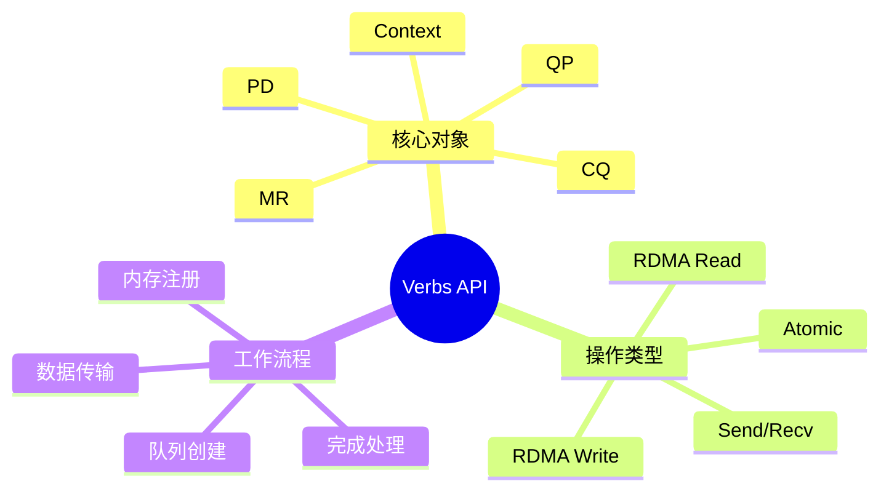

---

## 🔗 文档关联

### 核心关联
| 文档 | 关系类型 | 说明 |
|:-----|:---------|:-----|
| [内存管理](../../../01_Core_Knowledge_System/02_Core_Layer/02_Memory_Management.md) | 核心关联 | 内存管理基础 |
| [指针深度](../../../01_Core_Knowledge_System/02_Core_Layer/01_Pointer_Depth.md) | 核心关联 | 指针深度基础 |
| [并发编程](../../../03_System_Technology_Domains/14_Concurrency_Parallelism/README.md) | 核心关联 | 并发编程基础 |
| [数据类型](../../../01_Core_Knowledge_System/01_Basic_Layer/02_Data_Type_System.md) | 核心关联 | 数据类型基础 |
| [数组与指针](../../../01_Core_Knowledge_System/02_Core_Layer/05_Arrays_Pointers.md) | 核心关联 | 数组与指针基础 |

### 扩展阅读
| 文档 | 关系类型 | 说明 |
|:-----|:---------|:-----|
| [软件工程](../../../01_Core_Knowledge_System/05_Engineering_Layer/README.md) | 核心关联 | 软件工程基础 |
| [形式语义](../../../02_Formal_Semantics_and_Physics/README.md) | 核心关联 | 形式语义基础 |
| [系统技术](../../../03_System_Technology_Domains/README.md) | 核心关联 | 系统技术基础 |
| [工业场景](../../../04_Industrial_Scenarios/README.md) | 核心关联 | 工业场景基础 |
| [思维表征](../../../06_Thinking_Representation/README.md) | 核心关联 | 思维表征基础 |
# RDMA Verbs API编程

> **层级定位**: 03 System Technology Domains / 13 RDMA Network
> **对应标准**: InfiniBand Spec, libibverbs, C99
> **难度级别**: L5 综合
> **预估学习时间**: 8-10 小时

---

## 📋 本节概要

| 属性 | 内容 |
|:-----|:-----|
| **核心概念** | Queue Pair、Completion Queue、Memory Region、Work Request |
| **前置知识** | 网络编程、DMA、零拷贝 |
| **后续延伸** | DCT、SRQ、DC、GPU Direct RDMA |
| **权威来源** | IBTA Spec, Mellanox OFED docs |

---


---

## 📑 目录

- [RDMA Verbs API编程](#rdma-verbs-api编程)
  - [📋 本节概要](#-本节概要)
  - [📑 目录](#-目录)
  - [🧠 知识结构思维导图](#-知识结构思维导图)
  - [1. 概述](#1-概述)
  - [2. 核心对象初始化](#2-核心对象初始化)
    - [2.1 设备发现与上下文创建](#21-设备发现与上下文创建)
    - [2.2 保护域与完成队列](#22-保护域与完成队列)
    - [2.3 Queue Pair创建](#23-queue-pair创建)
  - [3. 数据传输](#3-数据传输)
    - [3.1 Send/Receive](#31-sendreceive)
    - [3.2 RDMA Write](#32-rdma-write)
    - [3.3 RDMA Read](#33-rdma-read)
  - [4. 完成处理](#4-完成处理)
  - [⚠️ 常见陷阱](#️-常见陷阱)
  - [✅ 质量验收清单](#-质量验收清单)
  - [📚 参考与延伸阅读](#-参考与延伸阅读)
  - [深入理解](#深入理解)
    - [核心原理](#核心原理)
    - [实践应用](#实践应用)
    - [最佳实践](#最佳实践)


---

## 🧠 知识结构思维导图



---

## 1. 概述

Verbs API是RDMA编程的标准接口，提供对InfiniBand/RoCE硬件的直接访问。相比传统socket，Verbs API提供：

- 内核旁路（Kernel Bypass）
- 零拷贝传输
- CPU卸载

---

## 2. 核心对象初始化

### 2.1 设备发现与上下文创建

```c
#include <infiniband/verbs.h>
#include <stdio.h>
#include <stdlib.h>
#include <string.h>

/* RDMA上下文 */
typedef struct {
    struct ibv_context *ctx;
    struct ibv_pd *pd;
    struct ibv_cq *cq;
    struct ibv_qp *qp;
    struct ibv_mr *mr;
    void *buf;
    size_t buf_size;

    int port_num;
    int gid_idx;
    union ibv_gid gid;
    uint32_t qpn;
    uint16_t lid;
    uint32_t psn;
} RDMACtx;

/* 查找并打开设备 */
RDMACtx* rdma_init(const char *dev_name) {
    RDMACtx *rdma = calloc(1, sizeof(RDMACtx));

    /* 获取设备列表 */
    int num_devices;
    struct ibv_device **dev_list = ibv_get_device_list(&num_devices);
    if (!dev_list) {
        perror("ibv_get_device_list");
        return NULL;
    }

    printf("Found %d RDMA devices\n", num_devices);

    /* 查找指定设备或第一个可用设备 */
    struct ibv_device *dev = NULL;
    for (int i = 0; i < num_devices; i++) {
        printf("  [%d] %s\n", i, ibv_get_device_name(dev_list[i]));
        if (!dev_name || strcmp(ibv_get_device_name(dev_list[i]),
                                dev_name) == 0) {
            dev = dev_list[i];
            if (!dev_name) break;
        }
    }

    if (!dev) {
        fprintf(stderr, "Device %s not found\n", dev_name);
        ibv_free_device_list(dev_list);
        return NULL;
    }

    /* 打开设备上下文 */
    rdma->ctx = ibv_open_device(dev);
    if (!rdma->ctx) {
        perror("ibv_open_device");
        ibv_free_device_list(dev_list);
        return NULL;
    }

    printf("Opened device: %s\n", ibv_get_device_name(dev));

    ibv_free_device_list(dev_list);

    /* 查询端口属性 */
    struct ibv_port_attr port_attr;
    rdma->port_num = 1;  /* 通常使用端口1 */

    if (ibv_query_port(rdma->ctx, rdma->port_num, &port_attr)) {
        perror("ibv_query_port");
        goto cleanup;
    }

    rdma->lid = port_attr.lid;
    printf("Port %d: LID=0x%04x\n", rdma->port_num, rdma->lid);

    /* 获取GID（RoCE必需） */
    if (ibv_query_gid(rdma->ctx, rdma->port_num, 0, &rdma->gid)) {
        perror("ibv_query_gid");
        goto cleanup;
    }

    return rdma;

cleanup:
    ibv_close_device(rdma->ctx);
    free(rdma);
    return NULL;
}
```

### 2.2 保护域与完成队列

```c
/* 创建保护域和完成队列 */
int rdma_create_resources(RDMACtx *rdma, size_t buf_size, int cq_size) {
    /* 创建保护域（PD）- 所有资源的容器 */
    rdma->pd = ibv_alloc_pd(rdma->ctx);
    if (!rdma->pd) {
        perror("ibv_alloc_pd");
        return -1;
    }

    /* 分配并注册内存区域 */
    rdma->buf_size = buf_size;
    rdma->buf = aligned_alloc(4096, buf_size);
    if (!rdma->buf) {
        perror("aligned_alloc");
        return -1;
    }

    /* 注册内存区域（MR） */
    rdma->mr = ibv_reg_mr(rdma->pd, rdma->buf, buf_size,
                          IBV_ACCESS_LOCAL_WRITE |
                          IBV_ACCESS_REMOTE_READ |
                          IBV_ACCESS_REMOTE_WRITE);
    if (!rdma->mr) {
        perror("ibv_reg_mr");
        return -1;
    }

    printf("Registered MR: addr=%p, length=%zu, rkey=0x%x\n",
           rdma->buf, buf_size, rdma->mr->rkey);

    /* 创建完成队列（CQ） */
    rdma->cq = ibv_create_cq(rdma->ctx, cq_size, NULL, NULL, 0);
    if (!rdma->cq) {
        perror("ibv_create_cq");
        return -1;
    }

    return 0;
}
```

### 2.3 Queue Pair创建

```c
/* 创建Queue Pair */
int rdma_create_qp(RDMACtx *rdma, enum ibv_qp_type qp_type) {
    struct ibv_qp_init_attr qp_init_attr = {
        .qp_context = rdma,
        .send_cq = rdma->cq,
        .recv_cq = rdma->cq,
        .cap = {
            .max_send_wr = 128,
            .max_recv_wr = 128,
            .max_send_sge = 1,
            .max_recv_sge = 1,
            .max_inline_data = 64,
        },
        .qp_type = qp_type,  /* IBV_QPT_RC (可靠连接) 或 IBV_QPT_UD */
        .sq_sig_all = 0,     /* 只有显式设置SIGNALED的WR才产生CQE */
    };

    rdma->qp = ibv_create_qp(rdma->pd, &qp_init_attr);
    if (!rdma->qp) {
        perror("ibv_create_qp");
        return -1;
    }

    rdma->qpn = rdma->qp->qp_num;
    rdma->psn = rand() & 0xFFFFFF;  /* 24位随机数 */

    printf("Created QP: qpn=0x%x, psn=0x%x\n", rdma->qpn, rdma->psn);

    return 0;
}

/* QP状态转换 */
int rdma_modify_qp_to_init(RDMACtx *rdma) {
    struct ibv_qp_attr attr = {
        .qp_state = IBV_QPS_INIT,
        .pkey_index = 0,
        .port_num = rdma->port_num,
        .qp_access_flags = IBV_ACCESS_REMOTE_READ |
                          IBV_ACCESS_REMOTE_WRITE |
                          IBV_ACCESS_REMOTE_ATOMIC,
    };

    int flags = IBV_QP_STATE | IBV_QP_PKEY_INDEX |
                IBV_QP_PORT | IBV_QP_ACCESS_FLAGS;

    if (ibv_modify_qp(rdma->qp, &attr, flags)) {
        perror("ibv_modify_qp to INIT");
        return -1;
    }

    return 0;
}

int rdma_modify_qp_to_rtr(RDMACtx *rdma, uint16_t dlid,
                          union ibv_gid *dgid, uint32_t dqpn, uint32_t dpsn) {
    struct ibv_qp_attr attr = {
        .qp_state = IBV_QPS_RTR,
        .path_mtu = IBV_MTU_1024,
        .dest_qp_num = dqpn,
        .rq_psn = dpsn,
        .max_dest_rd_atomic = 1,
        .min_rnr_timer = 12,
    };

    /* 地址处理 */
    if (dlid) {
        /* IB模式 */
        attr.ah_attr.is_global = 0;
        attr.ah_attr.dlid = dlid;
        attr.ah_attr.sl = 0;
        attr.ah_attr.src_path_bits = 0;
        attr.ah_attr.port_num = rdma->port_num;
    } else {
        /* RoCE模式 */
        attr.ah_attr.is_global = 1;
        attr.ah_attr.grh.dgid = *dgid;
        attr.ah_attr.grh.flow_label = 0;
        attr.ah_attr.grh.sgid_index = 0;
        attr.ah_attr.grh.hop_limit = 1;
        attr.ah_attr.grh.traffic_class = 0;
        attr.ah_attr.port_num = rdma->port_num;
    }

    int flags = IBV_QP_STATE | IBV_QP_AV | IBV_QP_PATH_MTU |
                IBV_QP_DEST_QPN | IBV_QP_RQ_PSN |
                IBV_QP_MAX_DEST_RD_ATOMIC | IBV_QP_MIN_RNR_TIMER;

    if (ibv_modify_qp(rdma->qp, &attr, flags)) {
        perror("ibv_modify_qp to RTR");
        return -1;
    }

    return 0;
}

int rdma_modify_qp_to_rts(RDMACtx *rdma) {
    struct ibv_qp_attr attr = {
        .qp_state = IBV_QPS_RTS,
        .sq_psn = rdma->psn,
        .max_rd_atomic = 1,
        .retry_cnt = 7,
        .rnr_retry = 7,
        .timeout = 14,  /* 约4秒超时 */
    };

    int flags = IBV_QP_STATE | IBV_QP_SQ_PSN |
                IBV_QP_MAX_QP_RD_ATOMIC | IBV_QP_RETRY_CNT |
                IBV_QP_RNR_RETRY | IBV_QP_TIMEOUT;

    if (ibv_modify_qp(rdma->qp, &attr, flags)) {
        perror("ibv_modify_qp to RTS");
        return -1;
    }

    return 0;
}
```

---

## 3. 数据传输

### 3.1 Send/Receive

```c
/* 发送数据 */
int rdma_send(RDMACtx *rdma, const void *data, size_t len) {
    struct ibv_sge sge = {
        .addr = (uint64_t)data,
        .length = len,
        .lkey = rdma->mr->lkey,
    };

    struct ibv_send_wr wr = {
        .wr_id = 1,
        .opcode = IBV_WR_SEND,
        .sg_list = &sge,
        .num_sge = 1,
        .send_flags = IBV_SEND_SIGNALED,  /* 产生完成事件 */
    };

    struct ibv_send_wr *bad_wr;
    if (ibv_post_send(rdma->qp, &wr, &bad_wr)) {
        perror("ibv_post_send");
        return -1;
    }

    return 0;
}

/* 接收数据 */
int rdma_recv(RDMACtx *rdma, void *buf, size_t len) {
    struct ibv_sge sge = {
        .addr = (uint64_t)buf,
        .length = len,
        .lkey = rdma->mr->lkey,
    };

    struct ibv_recv_wr wr = {
        .wr_id = 2,
        .sg_list = &sge,
        .num_sge = 1,
    };

    struct ibv_recv_wr *bad_wr;
    if (ibv_post_recv(rdma->qp, &wr, &bad_wr)) {
        perror("ibv_post_recv");
        return -1;
    }

    return 0;
}
```

### 3.2 RDMA Write

```c
/* RDMA Write - 直接写入远程内存 */
int rdma_write(RDMACtx *rdma, void *local_data, size_t len,
               uint64_t remote_addr, uint32_t rkey) {
    struct ibv_sge sge = {
        .addr = (uint64_t)local_data,
        .length = len,
        .lkey = rdma->mr->lkey,
    };

    struct ibv_send_wr wr = {
        .wr_id = 3,
        .opcode = IBV_WR_RDMA_WRITE,
        .sg_list = &sge,
        .num_sge = 1,
        .wr.rdma.remote_addr = remote_addr,
        .wr.rdma.rkey = rkey,
        .send_flags = IBV_SEND_SIGNALED,
    };

    struct ibv_send_wr *bad_wr;
    if (ibv_post_send(rdma->qp, &wr, &bad_wr)) {
        perror("ibv_post_send RDMA_WRITE");
        return -1;
    }

    return 0;
}

/* RDMA Write With Immediate */
int rdma_write_imm(RDMACtx *rdma, void *local_data, size_t len,
                   uint64_t remote_addr, uint32_t rkey, uint32_t imm_data) {
    struct ibv_sge sge = {
        .addr = (uint64_t)local_data,
        .length = len,
        .lkey = rdma->mr->lkey,
    };

    struct ibv_send_wr wr = {
        .wr_id = 4,
        .opcode = IBV_WR_RDMA_WRITE_WITH_IMM,
        .sg_list = &sge,
        .num_sge = 1,
        .imm_data = htonl(imm_data),
        .wr.rdma.remote_addr = remote_addr,
        .wr.rdma.rkey = rkey,
        .send_flags = IBV_SEND_SIGNALED,
    };

    struct ibv_send_wr *bad_wr;
    if (ibv_post_send(rdma->qp, &wr, &bad_wr)) {
        perror("ibv_post_send RDMA_WRITE_WITH_IMM");
        return -1;
    }

    return 0;
}
```

### 3.3 RDMA Read

```c
/* RDMA Read - 从远程内存读取 */
int rdma_read(RDMACtx *rdma, void *local_buf, size_t len,
              uint64_t remote_addr, uint32_t rkey) {
    struct ibv_sge sge = {
        .addr = (uint64_t)local_buf,
        .length = len,
        .lkey = rdma->mr->lkey,
    };

    struct ibv_send_wr wr = {
        .wr_id = 5,
        .opcode = IBV_WR_RDMA_READ,
        .sg_list = &sge,
        .num_sge = 1,
        .wr.rdma.remote_addr = remote_addr,
        .wr.rdma.rkey = rkey,
        .send_flags = IBV_SEND_SIGNALED,
    };

    struct ibv_send_wr *bad_wr;
    if (ibv_post_send(rdma->qp, &wr, &bad_wr)) {
        perror("ibv_post_send RDMA_READ");
        return -1;
    }

    return 0;
}
```

---

## 4. 完成处理

```c
/* 轮询完成队列 */
int rdma_poll_cq(RDMACtx *rdma, int max_entries, struct ibv_wc *wc) {
    int n = ibv_poll_cq(rdma->cq, max_entries, wc);

    if (n < 0) {
        perror("ibv_poll_cq");
        return -1;
    }

    for (int i = 0; i < n; i++) {
        if (wc[i].status != IBV_WC_SUCCESS) {
            fprintf(stderr, "WC failed: wr_id=%lu, status=%s\n",
                    wc[i].wr_id, ibv_wc_status_str(wc[i].status));
            return -1;
        }

        switch (wc[i].opcode) {
        case IBV_WC_SEND:
            printf("Send completed\n");
            break;
        case IBV_WC_RECV:
            printf("Recv completed, imm=%u\n", ntohl(wc[i].imm_data));
            break;
        case IBV_WC_RDMA_WRITE:
            printf("RDMA Write completed\n");
            break;
        case IBV_WC_RDMA_READ:
            printf("RDMA Read completed\n");
            break;
        }
    }

    return n;
}

/* 等待完成 */
int rdma_wait_completion(RDMACtx *rdma, uint64_t target_wr_id) {
    struct ibv_wc wc;
    int timeout = 10000;  /* 10秒超时 */

    while (timeout-- > 0) {
        int n = rdma_poll_cq(rdma, 1, &wc);
        if (n > 0 && wc.wr_id == target_wr_id) {
            return 0;  /* 完成 */
        }
        usleep(1000);  /* 1ms */
    }

    return -1;  /* 超时 */
}
```

---

## ⚠️ 常见陷阱

| 陷阱 | 后果 | 解决方案 |
|:-----|:-----|:---------|
| 未注册内存就使用 | 段错误 | 所有RDMA缓冲区必须注册MR |
| QP状态错误 | 传输失败 | 严格遵循INIT->RTR->RTS流程 |
| 远程密钥错误 | RDMA失败 | 交换rkey时使用正确字节序 |
| 缺少Recv WR | Send阻塞 | 预先投递足够Recv WR |
| 忽略WC检查 | 静默失败 | 总是检查wc.status |
| 大消息未分片 | 性能下降 | 对于大消息使用SGE链 |

---

## ✅ 质量验收清单

- [x] 设备发现与上下文创建
- [x] 保护域（PD）创建
- [x] 内存区域（MR）注册
- [x] 完成队列（CQ）创建
- [x] Queue Pair创建与状态转换
- [x] Send/Recv操作
- [x] RDMA Write
- [x] RDMA Read
- [x] 完成队列轮询

---

## 📚 参考与延伸阅读

| 资源 | 说明 |
|:-----|:-----|
| IBTA Spec | InfiniBand架构规范 |
| libibverbs man pages | API参考手册 |
| perftest | 性能测试工具源码 |
| rdma-core | Linux RDMA子系统 |

---

> **更新记录**
>
> - 2025-03-09: 初版创建，包含Verbs API完整实现


---

## 深入理解

### 核心原理

深入探讨技术原理和实现细节。

### 实践应用

- 应用场景1
- 应用场景2
- 应用场景3

### 最佳实践

1. 理解基础概念
2. 掌握核心机制
3. 应用到实际项目

---

> **最后更新**: 2026-03-21
> **维护者**: AI Code Review
