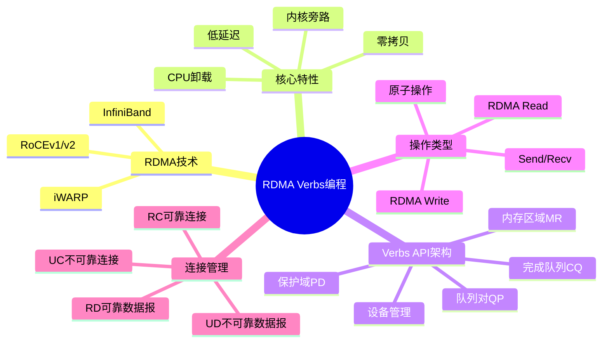
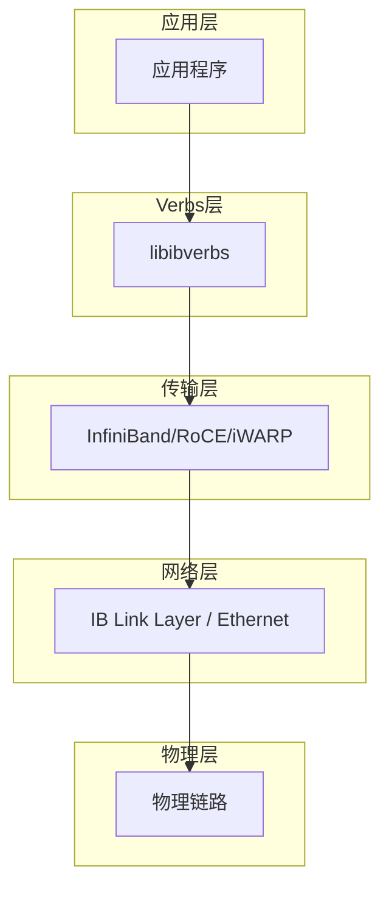
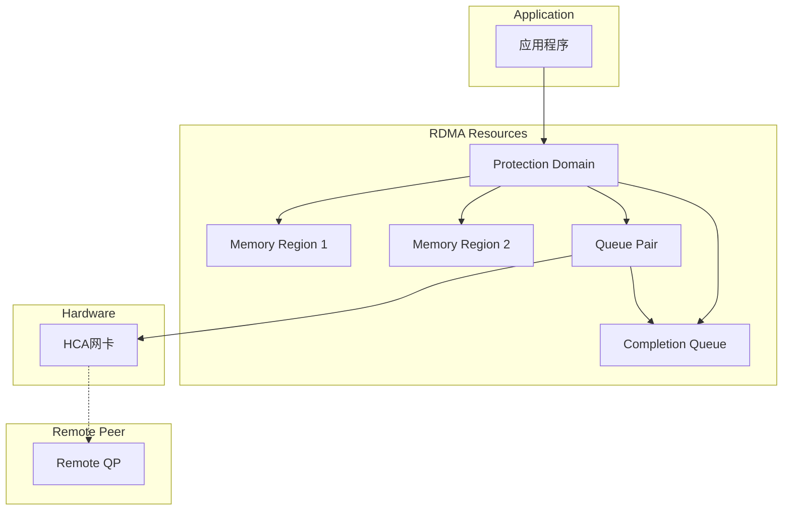
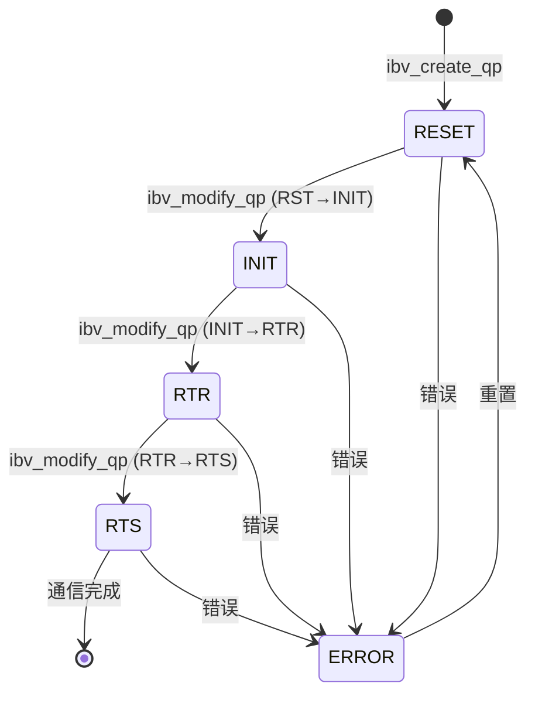
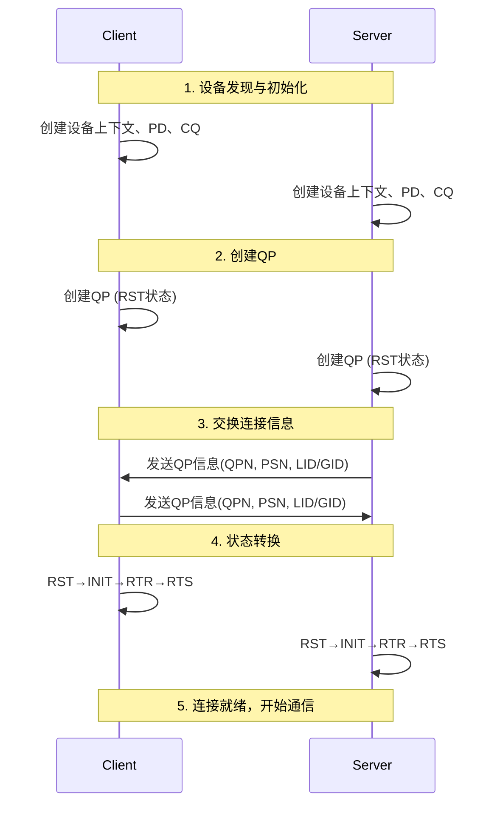

# RDMA Verbs API编程完整指南

> **层级定位**: 03 System Technology Domains / 12 RDMA Networking
> **对应标准**: InfiniBand, RoCE, iWARP, libibverbs
> **难度级别**: L5 综合
> **预估学习时间**: 12-16 小时

---

## 📋 本节概要

| 属性 | 内容 |
|:-----|:-----|
| **核心概念** | RDMA、InfiniBand、RoCE、iWARP、Verbs API、零拷贝、内核旁路 |
| **前置知识** | C语言、网络编程、内存管理、DMA原理 |
| **后续延伸** | DPDK RDMA、存储卸载、GPU RDMA、RDMA over converged Ethernet |
| **权威来源** | IBTA Spec 1.5, Mellanox OFED, rdma-core |

---


---

## 📑 目录

- [RDMA Verbs API编程完整指南](#rdma-verbs-api编程完整指南)
  - [📋 本节概要](#-本节概要)
  - [📑 目录](#-目录)
  - [🧠 知识结构思维导图](#-知识结构思维导图)
  - [1. RDMA技术概述](#1-rdma技术概述)
    - [1.1 什么是RDMA](#11-什么是rdma)
    - [1.2 RDMA技术实现对比](#12-rdma技术实现对比)
    - [1.3 RDMA协议栈架构](#13-rdma协议栈架构)
  - [2. Verbs API架构详解](#2-verbs-api架构详解)
    - [2.1 核心对象层次结构](#21-核心对象层次结构)
    - [2.2 Verbs API架构图](#22-verbs-api架构图)
  - [3. 设备发现与初始化](#3-设备发现与初始化)
    - [3.1 完整设备初始化代码](#31-完整设备初始化代码)
  - [4. 保护域(PD)与内存注册(MR)](#4-保护域pd与内存注册mr)
    - [4.1 保护域概念](#41-保护域概念)
    - [4.2 内存注册详解](#42-内存注册详解)
    - [4.3 内存注册完整代码](#43-内存注册完整代码)
  - [5. 完成队列(CQ)与事件处理](#5-完成队列cq与事件处理)
    - [5.1 完成队列类型](#51-完成队列类型)
    - [5.2 工作完成(Work Completion)结构](#52-工作完成work-completion结构)
    - [5.3 完成队列处理代码](#53-完成队列处理代码)
  - [6. 队列对(QP)状态机与转换](#6-队列对qp状态机与转换)
    - [6.1 QP状态机](#61-qp状态机)
    - [6.2 QP状态说明](#62-qp状态说明)
    - [6.3 QP创建与配置代码](#63-qp创建与配置代码)
  - [7. 连接建立（RC/UC/RD/UD模式）](#7-连接建立rcucrdud模式)
    - [7.1 传输模式对比](#71-传输模式对比)
    - [7.2 连接建立流程](#72-连接建立流程)
    - [7.3 连接管理代码](#73-连接管理代码)
  - [8. Send/Recv操作实现](#8-sendrecv操作实现)
    - [8.1 Send/Recv操作说明](#81-sendrecv操作说明)
    - [8.2 Send/Recv完整代码](#82-sendrecv完整代码)
  - [9. RDMA Read/Write操作实现](#9-rdma-readwrite操作实现)
    - [9.1 RDMA Read/Write说明](#91-rdma-readwrite说明)
    - [9.2 RDMA Read/Write代码](#92-rdma-readwrite代码)
  - [10. 原子操作](#10-原子操作)
    - [10.1 原子操作说明](#101-原子操作说明)
    - [10.2 原子操作代码](#102-原子操作代码)
  - [11. 内存窗口(Memory Window)](#11-内存窗口memory-window)
    - [11.1 内存窗口概念](#111-内存窗口概念)
    - [11.2 内存窗口代码](#112-内存窗口代码)
  - [12. 错误处理与调试技巧](#12-错误处理与调试技巧)
    - [12.1 常见错误码](#121-常见错误码)
    - [12.2 错误处理代码](#122-错误处理代码)
  - [13. 性能优化建议](#13-性能优化建议)
    - [13.1 优化策略](#131-优化策略)
    - [13.2 性能优化代码示例](#132-性能优化代码示例)
  - [14. 完整的服务器/客户端示例](#14-完整的服务器客户端示例)
    - [14.1 公共头文件 (rdma\_common.h)](#141-公共头文件-rdma_commonh)
    - [14.2 服务器代码 (rdma\_server.c)](#142-服务器代码-rdma_serverc)
    - [14.3 客户端代码 (rdma\_client.c)](#143-客户端代码-rdma_clientc)
  - [✅ 质量验收清单](#-质量验收清单)


---

## 🧠 知识结构思维导图



---

## 1. RDMA技术概述

### 1.1 什么是RDMA

RDMA（Remote Direct Memory Access，远程直接内存访问）是一种允许网络中的计算机直接访问彼此内存的技术，无需操作系统介入和CPU参与，从而实现：

- **零拷贝（Zero-copy）**: 数据直接从发送方内存传输到接收方内存
- **内核旁路（Kernel Bypass）**: 应用程序直接访问网卡，绕过操作系统内核
- **CPU卸载（CPU Offload）**: 数据传输由网卡处理，释放CPU资源
- **低延迟（Low Latency）**: 典型延迟在微秒甚至亚微秒级别

### 1.2 RDMA技术实现对比

| 特性 | InfiniBand | RoCEv1 | RoCEv2 | iWARP |
|:-----|:-----------|:-------|:-------|:------|
| **传输层** | 专用IB网络 | 以太网二层 | 以太网三层 | TCP/IP |
| **拥塞控制** | 基于信用的流控 | PFC/ECN | PFC/ECN | TCP拥塞控制 |
| **路由能力** | 子网内路由 | 二层交换 | 三层路由 | 标准IP路由 |
| **网络要求** | 专用交换机 | DCB交换机 | DCB交换机 | 标准以太网 |
| **部署成本** | 高 | 中 | 中 | 低 |
| **延迟** | <1μs | ~1-2μs | ~1-2μs | ~5-10μs |
| **应用场** | HPC/金融 | 数据中心 | 数据中心 | 通用网络 |

### 1.3 RDMA协议栈架构



---

## 2. Verbs API架构详解

### 2.1 核心对象层次结构

RDMA编程涉及以下核心对象：

| 对象 | 描述 | 创建API |
|:-----|:-----|:--------|
| **Context** | 设备上下文，代表一个RDMA设备 | `ibv_open_device()` |
| **Protection Domain (PD)** | 保护域，资源隔离单元 | `ibv_alloc_pd()` |
| **Completion Queue (CQ)** | 完成队列，存放工作完成事件 | `ibv_create_cq()` |
| **Queue Pair (QP)** | 队列对，通信端点 | `ibv_create_qp()` |
| **Memory Region (MR)** | 内存区域，注册的DMA内存 | `ibv_reg_mr()` |
| **Shared Receive Queue (SRQ)** | 共享接收队列，多个QP共享 | `ibv_create_srq()` |

### 2.2 Verbs API架构图



---

## 3. 设备发现与初始化

### 3.1 完整设备初始化代码

```c
/**
 * RDMA设备初始化完整实现
 * 包含设备发现、上下文创建、PD分配
 */

#include <stdio.h>
#include <stdlib.h>
#include <string.h>
#include <infiniband/verbs.h>
#include <errno.h>

#define CQ_SIZE 1024
#define MAX_WR 256

/* RDMA上下文结构 */
typedef struct {
    struct ibv_context *ctx;        /* 设备上下文 */
    struct ibv_pd *pd;              /* 保护域 */
    struct ibv_cq *cq;              /* 发送/接收完成队列 */
    struct ibv_qp *qp;              /* 队列对 */
    struct ibv_comp_channel *comp_channel;  /* 完成事件通道 */
    int port_num;                   /* 端口号 */
    int gid_idx;                    /* GID索引 */
} rdma_context_t;

/* 设备信息结构 */
typedef struct {
    char name[64];
    uint64_t node_guid;
    uint8_t port_count;
    enum ibv_node_type node_type;
    enum ibv_transport_type transport_type;
} device_info_t;

/**
 * 发现并列出所有RDMA设备
 */
int list_rdma_devices(device_info_t **devices, int *num_devs) {
    struct ibv_device **dev_list;
    int num_devices, i;

    /* 获取设备列表 */
    dev_list = ibv_get_device_list(&num_devices);
    if (!dev_list || num_devices == 0) {
        fprintf(stderr, "No RDMA devices found\n");
        return -1;
    }

    *devices = calloc(num_devices, sizeof(device_info_t));
    if (!*devices) {
        ibv_free_device_list(dev_list);
        return -ENOMEM;
    }

    printf("发现 %d 个RDMA设备:\n", num_devices);
    printf("%-20s %-20s %-10s %-15s\n",
           "设备名称", "Node GUID", "端口数", "传输类型");
    printf("%-20s %-20s %-10s %-15s\n",
           "--------", "---------", "------", "--------");

    for (i = 0; i < num_devices; i++) {
        struct ibv_device *dev = dev_list[i];
        device_info_t *info = &(*devices)[i];

        strncpy(info->name, ibv_get_device_name(dev), 63);
        info->node_guid = ibv_get_device_guid(dev);
        info->node_type = dev->node_type;
        info->transport_type = dev->transport_type;

        const char *trans_str;
        switch (dev->transport_type) {
            case IBV_TRANSPORT_IB: trans_str = "InfiniBand"; break;
            case IBV_TRANSPORT_IWARP: trans_str = "iWARP"; break;
            case IBV_TRANSPORT_UNSPEC: trans_str = "Unspecified"; break;
            default: trans_str = "Unknown"; break;
        }

        printf("%-20s %016llx %-10d %-15s\n",
               info->name,
               (unsigned long long)info->node_guid,
               info->port_count,
               trans_str);
    }

    *num_devs = num_devices;
    ibv_free_device_list(dev_list);
    return 0;
}

/**
 * 打开指定RDMA设备
 */
struct ibv_context* open_rdma_device(const char *dev_name) {
    struct ibv_device **dev_list;
    struct ibv_context *ctx = NULL;
    int num_devices, i;

    dev_list = ibv_get_device_list(&num_devices);
    if (!dev_list) {
        perror("ibv_get_device_list");
        return NULL;
    }

    for (i = 0; i < num_devices; i++) {
        if (strcmp(ibv_get_device_name(dev_list[i]), dev_name) == 0) {
            ctx = ibv_open_device(dev_list[i]);
            if (!ctx) {
                perror("ibv_open_device");
            }
            break;
        }
    }

    if (!ctx && i == num_devices) {
        fprintf(stderr, "Device %s not found\n", dev_name);
    }

    ibv_free_device_list(dev_list);
    return ctx;
}

/**
 * 查询端口属性
 */
int query_port_info(struct ibv_context *ctx, int port_num,
                    struct ibv_port_attr *port_attr) {
    int ret = ibv_query_port(ctx, port_num, port_attr);
    if (ret) {
        perror("ibv_query_port");
        return ret;
    }

    printf("\n端口 %d 信息:\n", port_num);
    printf("  状态: %s\n",
           port_attr->state == IBV_PORT_ACTIVE ? "Active" : "Inactive");
    printf("  最大MTU: %d\n", port_attr->max_mtu);
    printf("  活动MTU: %d\n", port_attr->active_mtu);
    printf("  LID: 0x%04x\n", port_attr->lid);
    printf("  最大消息大小: %u\n", port_attr->max_msg_sz);
    printf("  最大VL: %d\n", port_attr->max_vl_num);

    return 0;
}

/**
 * 完整的RDMA初始化
 */
rdma_context_t* rdma_init_full(const char *dev_name, int port_num) {
    rdma_context_t *rdma = calloc(1, sizeof(rdma_context_t));
    if (!rdma) {
        perror("calloc");
        return NULL;
    }

    /* 1. 打开设备 */
    if (dev_name) {
        rdma->ctx = open_rdma_device(dev_name);
    } else {
        /* 使用第一个可用设备 */
        struct ibv_device **dev_list;
        int num_devices;
        dev_list = ibv_get_device_list(&num_devices);
        if (num_devices > 0) {
            rdma->ctx = ibv_open_device(dev_list[0]);
        }
        ibv_free_device_list(dev_list);
    }

    if (!rdma->ctx) {
        fprintf(stderr, "Failed to open RDMA device\n");
        free(rdma);
        return NULL;
    }

    printf("成功打开RDMA设备\n");

    /* 2. 查询设备属性 */
    struct ibv_device_attr device_attr;
    if (ibv_query_device(rdma->ctx, &device_attr) == 0) {
        printf("设备属性:\n");
        printf("  固件版本: %s\n", device_attr.fw_ver);
        printf("  最大QP数: %d\n", device_attr.max_qp);
        printf("  最大CQ数: %d\n", device_attr.max_cq);
        printf("  最大MR数: %d\n", device_attr.max_mr);
        printf("  最大PD数: %d\n", device_attr.max_pd);
    }

    /* 3. 分配保护域 */
    rdma->pd = ibv_alloc_pd(rdma->ctx);
    if (!rdma->pd) {
        perror("ibv_alloc_pd");
        goto err_pd;
    }
    printf("成功分配保护域\n");

    /* 4. 创建完成事件通道（用于异步通知） */
    rdma->comp_channel = ibv_create_comp_channel(rdma->ctx);
    if (!rdma->comp_channel) {
        perror("ibv_create_comp_channel");
        /* 非致命错误，继续 */
    }

    /* 5. 创建完成队列 */
    rdma->cq = ibv_create_cq(rdma->ctx, CQ_SIZE, NULL,
                             rdma->comp_channel, 0);
    if (!rdma->cq) {
        perror("ibv_create_cq");
        goto err_cq;
    }
    printf("成功创建CQ，大小: %d\n", CQ_SIZE);

    /* 6. 请求CQ通知 */
    if (rdma->comp_channel) {
        ibv_req_notify_cq(rdma->cq, 0);
    }

    /* 7. 设置端口 */
    rdma->port_num = port_num > 0 ? port_num : 1;

    struct ibv_port_attr port_attr;
    query_port_info(rdma->ctx, rdma->port_num, &port_attr);

    /* 8. 查找GID索引 */
    rdma->gid_idx = 0;  /* 默认使用GID 0 */

    printf("\nRDMA初始化完成!\n");
    return rdma;

err_cq:
    if (rdma->comp_channel) ibv_destroy_comp_channel(rdma->comp_channel);
    ibv_dealloc_pd(rdma->pd);
err_pd:
    ibv_close_device(rdma->ctx);
    free(rdma);
    return NULL;
}

/**
 * 清理RDMA资源
 */
void rdma_cleanup(rdma_context_t *rdma) {
    if (!rdma) return;

    if (rdma->qp) {
        ibv_destroy_qp(rdma->qp);
        printf("销毁QP\n");
    }
    if (rdma->cq) {
        ibv_destroy_cq(rdma->cq);
        printf("销毁CQ\n");
    }
    if (rdma->comp_channel) {
        ibv_destroy_comp_channel(rdma->comp_channel);
    }
    if (rdma->pd) {
        ibv_dealloc_pd(rdma->pd);
        printf("释放PD\n");
    }
    if (rdma->ctx) {
        ibv_close_device(rdma->ctx);
        printf("关闭设备\n");
    }
    free(rdma);
}
```

---

## 4. 保护域(PD)与内存注册(MR)

### 4.1 保护域概念

保护域（Protection Domain, PD）是RDMA资源的隔离单元。属于同一PD的资源才能相互关联：

- QP必须属于某个PD
- MR必须属于某个PD
- 只有属于同一PD的QP才能访问该PD的MR

### 4.2 内存注册详解

内存注册是将虚拟内存锁定并映射到DMA地址空间的过程：

| 访问标志 | 说明 |
|:---------|:-----|
| `IBV_ACCESS_LOCAL_WRITE` | 允许本地写入 |
| `IBV_ACCESS_REMOTE_READ` | 允许远程读取 |
| `IBV_ACCESS_REMOTE_WRITE` | 允许远程写入 |
| `IBV_ACCESS_REMOTE_ATOMIC` | 允许远程原子操作 |
| `IBV_ACCESS_MW_BIND` | 允许绑定内存窗口 |
| `IBV_ACCESS_ON_DEMAND` | 按需分页（ODP）|

### 4.3 内存注册完整代码

```c
/**
 * 内存注册与管理
 */

#include <infiniband/verbs.h>
#include <stdlib.h>
#include <string.h>

/* 内存区域管理结构 */
typedef struct {
    void *buf;                      /* 虚拟地址 */
    size_t size;                    /* 大小 */
    struct ibv_mr *mr;              /* 内存区域句柄 */
    uint32_t lkey;                  /* 本地密钥 */
    uint32_t rkey;                  /* 远程密钥 */
} rdma_buffer_t;

/**
 * 注册内存区域
 */
rdma_buffer_t* rdma_register_memory(struct ibv_pd *pd, size_t size,
                                     int access_flags) {
    rdma_buffer_t *buf = calloc(1, sizeof(rdma_buffer_t));
    if (!buf) {
        perror("calloc");
        return NULL;
    }

    /* 分配对齐的内存 */
    if (posix_memalign(&buf->buf, 4096, size)) {
        perror("posix_memalign");
        free(buf);
        return NULL;
    }

    memset(buf->buf, 0, size);
    buf->size = size;

    /* 注册内存 */
    buf->mr = ibv_reg_mr(pd, buf->buf, size, access_flags);
    if (!buf->mr) {
        perror("ibv_reg_mr");
        free(buf->buf);
        free(buf);
        return NULL;
    }

    buf->lkey = buf->mr->lkey;
    buf->rkey = buf->mr->rkey;

    printf("内存注册成功:\n");
    printf("  虚拟地址: %p\n", buf->buf);
    printf("  大小: %zu bytes\n", buf->size);
    printf("  LKey: 0x%08x\n", buf->lkey);
    printf("  RKey: 0x%08x\n", buf->rkey);

    return buf;
}

/**
 * 注册具有特定访问权限的内存
 */
rdma_buffer_t* rdma_register_buffer_full(struct ibv_pd *pd, void *addr,
                                          size_t size, int local_write,
                                          int remote_read, int remote_write,
                                          int remote_atomic) {
    int access = 0;

    if (local_write) access |= IBV_ACCESS_LOCAL_WRITE;
    if (remote_read) access |= IBV_ACCESS_REMOTE_READ;
    if (remote_write) access |= IBV_ACCESS_REMOTE_WRITE;
    if (remote_atomic) access |= IBV_ACCESS_REMOTE_ATOMIC;

    rdma_buffer_t *buf = calloc(1, sizeof(rdma_buffer_t));
    if (!buf) return NULL;

    buf->buf = addr;
    buf->size = size;

    buf->mr = ibv_reg_mr(pd, addr, size, access);
    if (!buf->mr) {
        free(buf);
        return NULL;
    }

    buf->lkey = buf->mr->lkey;
    buf->rkey = buf->mr->rkey;

    return buf;
}

/**
 * 使用ODP（On-Demand Paging）注册内存
 */
rdma_buffer_t* rdma_register_odp(struct ibv_pd *pd, size_t size) {
    rdma_buffer_t *buf = calloc(1, sizeof(rdma_buffer_t));
    if (!buf) return NULL;

    /* ODP不需要预分配内存 */
    buf->size = size;

    /* 使用ON_DEMAND标志 */
    buf->mr = ibv_reg_mr(pd, NULL, size,
                         IBV_ACCESS_LOCAL_WRITE |
                         IBV_ACCESS_REMOTE_READ |
                         IBV_ACCESS_REMOTE_WRITE |
                         IBV_ACCESS_ON_DEMAND);
    if (!buf->mr) {
        perror("ibv_reg_mr ODP");
        free(buf);
        return NULL;
    }

    buf->lkey = buf->mr->lkey;
    buf->rkey = buf->mr->rkey;

    return buf;
}

/**
 * 注销并释放内存
 */
void rdma_deregister_buffer(rdma_buffer_t *buf) {
    if (!buf) return;

    if (buf->mr) {
        ibv_dereg_mr(buf->mr);
    }
    if (buf->buf) {
        free(buf->buf);
    }
    free(buf);
}

/**
 * 修改内存区域访问权限
 */
int rdma_reregister_memory(struct ibv_mr *mr, int new_access) {
    /* 注意：ibv_rereg_mr需要较新版本的rdma-core */
    /* 这里展示概念性代码 */

    struct ibv_rereg_mr_attr attr = {
        .pd = NULL,  /* 保持原PD */
        .addr = mr->addr,
        .len = mr->length,
        .access = new_access,
    };

    return ibv_rereg_mr(mr, IBV_REREG_MR_CHANGE_ACCESS, &attr);
}
```

---

## 5. 完成队列(CQ)与事件处理

### 5.1 完成队列类型

| 类型 | 用途 | 特点 |
|:-----|:-----|:-----|
| **CQ (Completion Queue)** | 存放发送/接收完成事件 | 每个WC包含操作结果 |
| **SRQ (Shared Receive Queue)** | 多个QP共享接收队列 | 节省内存，适用于服务器 |

### 5.2 工作完成(Work Completion)结构

```c
/* 简化的Work Completion结构 */
struct ibv_wc {
    uint64_t wr_id;          /* 用户提供的WR标识 */
    enum ibv_wc_status status;  /* 完成状态 */
    enum ibv_wc_opcode opcode;  /* 操作类型 */
    uint32_t qp_num;         /* QP编号 */
    uint32_t byte_len;       /* 接收的字节数 */
    uint32_t imm_data;       /* 即时数据 */
    uint32_t src_qp;         /* 源QP（用于UD） */
    uint16_t pkey_index;     /* PKey索引 */
    uint16_t slid;           /* 源LID */
    uint8_t  sl;             /* 服务级别 */
    uint8_t  dlid_path_bits; /* DLID路径位 */
};
```

### 5.3 完成队列处理代码

```c
/**
 * 完成队列轮询与事件处理
 */

#include <infiniband/verbs.h>
#include <stdio.h>
#include <poll.h>

#define MAX_WC 16

/**
 * 轮询CQ（非阻塞）
 */
int poll_cq_batch(struct ibv_cq *cq, int max_wc) {
    struct ibv_wc wc[MAX_WC];
    int num_wc, i;

    num_wc = ibv_poll_cq(cq, max_wc > MAX_WC ? MAX_WC : max_wc, wc);

    if (num_wc < 0) {
        fprintf(stderr, "ibv_poll_cq failed: %d\n", num_wc);
        return -1;
    }

    for (i = 0; i < num_wc; i++) {
        if (wc[i].status != IBV_WC_SUCCESS) {
            fprintf(stderr, "WC failed: wr_id=%lu, status=%s\n",
                    (unsigned long)wc[i].wr_id,
                    ibv_wc_status_str(wc[i].status));
            continue;
        }

        /* 处理成功的完成 */
        printf("WC success: wr_id=%lu, opcode=%s, bytes=%u\n",
               (unsigned long)wc[i].wr_id,
               ibv_wc_opcode_str(wc[i].opcode),
               wc[i].byte_len);

        /* 根据操作类型处理 */
        switch (wc[i].opcode) {
            case IBV_WC_SEND:
                printf("  Send完成\n");
                break;
            case IBV_WC_RECV:
                printf("  Recv完成，接收 %u 字节\n", wc[i].byte_len);
                break;
            case IBV_WC_RDMA_WRITE:
                printf("  RDMA Write完成\n");
                break;
            case IBV_WC_RDMA_READ:
                printf("  RDMA Read完成，读取 %u 字节\n", wc[i].byte_len);
                break;
            case IBV_WC_COMP_SWAP:
            case IBV_WC_FETCH_ADD:
                printf("  原子操作完成\n");
                break;
            default:
                printf("  其他操作完成\n");
                break;
        }
    }

    return num_wc;
}

/**
 * 等待CQ事件（阻塞方式，使用完成通道）
 */
int wait_cq_event(struct ibv_cq *cq, struct ibv_comp_channel *channel) {
    struct ibv_cq *ev_cq;
    void *ev_ctx;
    int ret;

    /* 等待事件通知 */
    ret = ibv_get_cq_event(channel, &ev_cq, &ev_ctx);
    if (ret) {
        perror("ibv_get_cq_event");
        return -1;
    }

    /* 确认事件 */
    ibv_ack_cq_events(ev_cq, 1);

    /* 重新请求通知 */
    ret = ibv_req_notify_cq(cq, 0);
    if (ret) {
        perror("ibv_req_notify_cq");
        return -1;
    }

    /* 处理所有完成的WR */
    poll_cq_batch(cq, MAX_WC);

    return 0;
}

/**
 * CQ处理主循环（事件驱动）
 */
void cq_event_loop(struct ibv_cq *cq, struct ibv_comp_channel *channel,
                   volatile int *stop_flag) {
    struct pollfd pfd;

    pfd.fd = channel->fd;
    pfd.events = POLLIN;

    while (!(*stop_flag)) {
        int ret = poll(&pfd, 1, 100);  /* 100ms超时 */

        if (ret < 0) {
            perror("poll");
            break;
        }

        if (ret > 0) {
            /* 有事件到来 */
            wait_cq_event(cq, channel);
        }
    }
}

/**
 * 带超时的CQ轮询
 */
int poll_cq_timeout(struct ibv_cq *cq, int timeout_ms) {
    int elapsed = 0;
    const int poll_interval = 1;  /* 1ms */

    while (elapsed < timeout_ms) {
        int num = ibv_poll_cq(cq, 1, NULL);
        if (num > 0) {
            return num;
        }

        /* 短暂休眠避免忙等待 */
        struct timespec ts = {0, poll_interval * 1000000};
        nanosleep(&ts, NULL);
        elapsed += poll_interval;
    }

    return 0;  /* 超时 */
}
```

---

## 6. 队列对(QP)状态机与转换

### 6.1 QP状态机



### 6.2 QP状态说明

| 状态 | 缩写 | 描述 | 允许的操作 |
|:-----|:-----|:-----|:-----------|
| **Reset** | RST | 初始状态 | 可修改QP属性 |
| **Initialized** | INIT | 已初始化 | 接收Post Recv |
| **Ready to Receive** | RTR | 可接收 | Post Recv, 接收数据 |
| **Ready to Send** | RTS | 可收发 | 完整Send/Recv操作 |
| **Error** | ERR | 错误状态 | 只能销毁或重置 |

### 6.3 QP创建与配置代码

```c
/**
 * 队列对(QP)创建与状态转换
 */

#include <infiniband/verbs.h>
#include <string.h>

/* QP类型与传输服务 */
typedef enum {
    QP_TYPE_RC = IBV_QPT_RC,  /* 可靠连接 */
    QP_TYPE_UC = IBV_QPT_UC,  /* 不可靠连接 */
    QP_TYPE_UD = IBV_QPT_UD,  /* 不可靠数据报 */
    QP_TYPE_RD = IBV_QPT_RD,  /* 可靠数据报 */
} qp_type_t;

/**
 * 创建队列对
 */
struct ibv_qp* create_qp(struct ibv_pd *pd, struct ibv_cq *cq,
                         uint32_t max_send_wr, uint32_t max_recv_wr,
                         enum ibv_qp_type qp_type) {
    struct ibv_qp_init_attr qp_init_attr;

    memset(&qp_init_attr, 0, sizeof(qp_init_attr));

    qp_init_attr.qp_type = qp_type;
    qp_init_attr.sq_sig_all = 0;  /* 只有设置了SIGNAL的WR才产生完成事件 */
    qp_init_attr.send_cq = cq;
    qp_init_attr.recv_cq = cq;

    qp_init_attr.cap.max_send_wr = max_send_wr;
    qp_init_attr.cap.max_recv_wr = max_recv_wr;
    qp_init_attr.cap.max_send_sge = 1;
    qp_init_attr.cap.max_recv_sge = 1;
    qp_init_attr.cap.max_inline_data = 256;  /* 内联数据大小 */

    struct ibv_qp *qp = ibv_create_qp(pd, &qp_init_attr);
    if (!qp) {
        perror("ibv_create_qp");
        return NULL;
    }

    printf("QP创建成功，编号: %u\n", qp->qp_num);
    printf("  最大发送WR: %u\n", qp_init_attr.cap.max_send_wr);
    printf("  最大接收WR: %u\n", qp_init_attr.cap.max_recv_wr);

    return qp;
}

/**
 * 转换QP到INIT状态
 */
int qp_transition_init(struct ibv_qp *qp, int port_num, int pkey_idx) {
    struct ibv_qp_attr attr;
    int flags;

    memset(&attr, 0, sizeof(attr));

    attr.qp_state = IBV_QPS_INIT;
    attr.pkey_index = pkey_idx;
    attr.port_num = port_num;
    attr.qp_access_flags = IBV_ACCESS_LOCAL_WRITE |
                           IBV_ACCESS_REMOTE_READ |
                           IBV_ACCESS_REMOTE_WRITE |
                           IBV_ACCESS_REMOTE_ATOMIC;

    flags = IBV_QP_STATE | IBV_QP_PKEY_INDEX | IBV_QP_PORT | IBV_QP_ACCESS_FLAGS;

    int ret = ibv_modify_qp(qp, &attr, flags);
    if (ret) {
        perror("ibv_modify_qp (INIT)");
        return ret;
    }

    printf("QP %u 转换到INIT状态成功\n", qp->qp_num);
    return 0;
}

/**
 * 转换QP到RTR状态
 */
int qp_transition_rtr(struct ibv_qp *qp, int port_num,
                      uint32_t dest_qp_num, uint16_t dlid,
                      uint8_t *dgid, uint32_t psn) {
    struct ibv_qp_attr attr;
    int flags;

    memset(&attr, 0, sizeof(attr));

    attr.qp_state = IBV_QPS_RTR;
    attr.path_mtu = IBV_MTU_1024;
    attr.dest_qp_num = dest_qp_num;
    attr.rq_psn = psn;
    attr.max_dest_rd_atomic = 16;
    attr.min_rnr_timer = 12;

    /* 主路径 */
    attr.ah_attr.is_global = 0;
    attr.ah_attr.dlid = dlid;
    attr.ah_attr.sl = 0;
    attr.ah_attr.src_path_bits = 0;
    attr.ah_attr.port_num = port_num;

    /* GID设置（用于RoCE） */
    if (dgid) {
        attr.ah_attr.is_global = 1;
        attr.ah_attr.grh.dgid.global.subnet_prefix =
            ((uint64_t)dgid[0] << 56) | ((uint64_t)dgid[1] << 48) |
            ((uint64_t)dgid[2] << 40) | ((uint64_t)dgid[3] << 32) |
            ((uint64_t)dgid[4] << 24) | ((uint64_t)dgid[5] << 16) |
            ((uint64_t)dgid[6] << 8) | (uint64_t)dgid[7];
        attr.ah_attr.grh.dgid.global.interface_id =
            ((uint64_t)dgid[8] << 56) | ((uint64_t)dgid[9] << 48) |
            ((uint64_t)dgid[10] << 40) | ((uint64_t)dgid[11] << 32) |
            ((uint64_t)dgid[12] << 24) | ((uint64_t)dgid[13] << 16) |
            ((uint64_t)dgid[14] << 8) | (uint64_t)dgid[15];
        attr.ah_attr.grh.sgid_index = 0;
        attr.ah_attr.grh.hop_limit = 1;
    }

    flags = IBV_QP_STATE | IBV_QP_AV | IBV_QP_PATH_MTU | IBV_QP_DEST_QPN |
            IBV_QP_RQ_PSN | IBV_QP_MAX_DEST_RD_ATOMIC | IBV_QP_MIN_RNR_TIMER;

    int ret = ibv_modify_qp(qp, &attr, flags);
    if (ret) {
        perror("ibv_modify_qp (RTR)");
        return ret;
    }

    printf("QP %u 转换到RTR状态成功 (dest_qpn=%u)\n", qp->qp_num, dest_qp_num);
    return 0;
}

/**
 * 转换QP到RTS状态
 */
int qp_transition_rts(struct ibv_qp *qp, uint32_t psn) {
    struct ibv_qp_attr attr;
    int flags;

    memset(&attr, 0, sizeof(attr));

    attr.qp_state = IBV_QPS_RTS;
    attr.timeout = 14;           /* 4.096μs * 2^14 ≈ 67ms */
    attr.retry_cnt = 7;          /* 重试次数 */
    attr.rnr_retry = 7;          /* RNR重试次数 */
    attr.sq_psn = psn;
    attr.max_rd_atomic = 16;     /* 最大未完成RDMA Read/Atomic */

    flags = IBV_QP_STATE | IBV_QP_TIMEOUT | IBV_QP_RETRY_CNT |
            IBV_QP_RNR_RETRY | IBV_QP_SQ_PSN | IBV_QP_MAX_QP_RD_ATOMIC;

    int ret = ibv_modify_qp(qp, &attr, flags);
    if (ret) {
        perror("ibv_modify_qp (RTS)");
        return ret;
    }

    printf("QP %u 转换到RTS状态成功\n", qp->qp_num);
    return 0;
}

/**
 * 完整QP初始化流程
 */
int qp_full_init(struct ibv_qp *qp, int port_num, uint32_t dest_qp_num,
                 uint16_t dlid, uint8_t *dgid) {
    int ret;
    uint32_t psn = rand() & 0xffffff;  /* 24位PSN */

    /* RST -> INIT */
    ret = qp_transition_init(qp, port_num, 0);
    if (ret) return ret;

    /* INIT -> RTR */
    ret = qp_transition_rtr(qp, port_num, dest_qp_num, dlid, dgid, psn);
    if (ret) return ret;

    /* RTR -> RTS */
    ret = qp_transition_rts(qp, psn);
    if (ret) return ret;

    printf("QP初始化完成，PSN: 0x%06x\n", psn);
    return 0;
}

/**
 * 查询QP状态
 */
void query_qp_state(struct ibv_qp *qp) {
    struct ibv_qp_attr attr;
    struct ibv_qp_init_attr init_attr;

    if (ibv_query_qp(qp, &attr, IBV_QP_STATE, &init_attr)) {
        perror("ibv_query_qp");
        return;
    }

    const char *state_str;
    switch (attr.qp_state) {
        case IBV_QPS_RESET: state_str = "RESET"; break;
        case IBV_QPS_INIT: state_str = "INIT"; break;
        case IBV_QPS_RTR: state_str = "RTR"; break;
        case IBV_QPS_RTS: state_str = "RTS"; break;
        case IBV_QPS_SQD: state_str = "SQD"; break;
        case IBV_QPS_SQE: state_str = "SQE"; break;
        case IBV_QPS_ERR: state_str = "ERR"; break;
        default: state_str = "UNKNOWN"; break;
    }

    printf("QP %u 当前状态: %s\n", qp->qp_num, state_str);
}
```

---

## 7. 连接建立（RC/UC/RD/UD模式）

### 7.1 传输模式对比

| 特性 | RC (Reliable Connected) | UC (Unreliable Conn) | UD (Unreliable Datagram) | RD (Reliable Datagram) |
|:-----|:------------------------|:---------------------|:-------------------------|:-----------------------|
| **连接模式** | 1对1连接 | 1对1连接 | 无连接 | 1对多 |
| **可靠性** | 可靠、有序 | 不可靠 | 不可靠 | 可靠、有序 |
| **消息大小** | 无限制 | 无限制 | 最大MTU | 无限制 |
| **适用场景** | 主要数据传输 | 视频流 | 多播/广播 | 多连接复用 |
| **开销** | 高 | 中 | 低 | 高 |

### 7.2 连接建立流程



### 7.3 连接管理代码

```c
/**
 * RDMA连接建立与管理
 */

#include <infiniband/verbs.h>
#include <stdint.h>
#include <string.h>

/* 连接信息交换结构 */
typedef struct {
    uint32_t qpn;           /* QP编号 */
    uint32_t psn;           /* 包序列号 */
    uint16_t lid;           /* 本地标识符 */
    uint8_t gid[16];        /* 全局标识符 */
    uint32_t rkey;          /* 远程密钥 */
    uint64_t vaddr;         /* 虚拟地址 */
} conn_info_t;

/* 连接上下文 */
typedef struct {
    struct ibv_qp *qp;
    conn_info_t local;
    conn_info_t remote;
    int is_connected;
} rdma_conn_t;

/**
 * 准备本地连接信息
 */
void prepare_local_conn_info(rdma_conn_t *conn, struct ibv_qp *qp,
                             struct ibv_port_attr *port_attr,
                             struct ibv_gid *gid,
                             rdma_buffer_t *buf) {
    conn->qp = qp;
    conn->local.qpn = qp->qp_num;
    conn->local.psn = rand() & 0xffffff;
    conn->local.lid = port_attr->lid;
    if (gid) {
        memcpy(conn->local.gid, gid->raw, 16);
    }
    if (buf) {
        conn->local.rkey = buf->rkey;
        conn->local.vaddr = (uint64_t)buf->buf;
    }
}

/**
 * 建立RC连接
 */
int establish_rc_connection(rdma_conn_t *conn, int port_num,
                            conn_info_t *remote_info) {
    conn->remote = *remote_info;

    /* 转换QP状态 */
    int ret = qp_transition_init(conn->qp, port_num, 0);
    if (ret) return ret;

    ret = qp_transition_rtr(conn->qp, port_num,
                            remote_info->qpn,
                            remote_info->lid,
                            remote_info->gid,
                            remote_info->psn);
    if (ret) return ret;

    ret = qp_transition_rts(conn->qp, conn->local.psn);
    if (ret) return ret;

    conn->is_connected = 1;
    printf("RC连接建立成功\n");
    return 0;
}

/**
 * UD连接设置（无连接模式）
 */
struct ibv_ah* setup_ud_address_handle(struct ibv_pd *pd, int port_num,
                                       uint16_t dlid, uint8_t *dgid) {
    struct ibv_ah_attr ah_attr;

    memset(&ah_attr, 0, sizeof(ah_attr));
    ah_attr.dlid = dlid;
    ah_attr.sl = 0;
    ah_attr.src_path_bits = 0;
    ah_attr.port_num = port_num;

    if (dgid) {
        ah_attr.is_global = 1;
        memcpy(ah_attr.grh.dgid.raw, dgid, 16);
        ah_attr.grh.sgid_index = 0;
        ah_attr.grh.hop_limit = 1;
    }

    struct ibv_ah *ah = ibv_create_ah(pd, &ah_attr);
    if (!ah) {
        perror("ibv_create_ah");
        return NULL;
    }

    return ah;
}

/**
 * 断开连接
 */
void disconnect_qp(rdma_conn_t *conn) {
    if (!conn->is_connected) return;

    struct ibv_qp_attr attr;
    memset(&attr, 0, sizeof(attr));
    attr.qp_state = IBV_QPS_RESET;

    ibv_modify_qp(conn->qp, &attr, IBV_QP_STATE);
    conn->is_connected = 0;

    printf("连接已断开\n");
}
```

---

## 8. Send/Recv操作实现

### 8.1 Send/Recv操作说明

Send/Recv是最基础的RDMA通信原语：

- **Send**: 发送方将数据放入发送队列，通知对端接收
- **Recv**: 接收方预先在工作请求中指定接收缓冲区
- **特点**: 需要接收方预先Post Recv，适合控制消息传输

### 8.2 Send/Recv完整代码

```c
/**
 * Send/Recv操作实现
 */

#include <infiniband/verbs.h>
#include <string.h>

/**
 * Post Send操作
 */
int post_send(struct ibv_qp *qp, void *buf, uint32_t len, uint32_t lkey,
              int signaled) {
    struct ibv_sge sge;
    struct ibv_send_wr wr;
    struct ibv_send_wr *bad_wr;

    /* 设置散集元素 */
    sge.addr = (uint64_t)buf;
    sge.length = len;
    sge.lkey = lkey;

    /* 设置发送WR */
    memset(&wr, 0, sizeof(wr));
    wr.wr_id = 1;  /* 用户标识 */
    wr.opcode = IBV_WR_SEND;
    wr.sg_list = &sge;
    wr.num_sge = 1;

    if (signaled) {
        wr.send_flags = IBV_SEND_SIGNALED;
    }

    /* 内联小数据优化 */
    if (len <= 256) {
        wr.send_flags |= IBV_SEND_INLINE;
    }

    int ret = ibv_post_send(qp, &wr, &bad_wr);
    if (ret) {
        fprintf(stderr, "ibv_post_send failed: %d\n", ret);
        return ret;
    }

    return 0;
}

/**
 * Post Recv操作
 */
int post_recv(struct ibv_qp *qp, void *buf, uint32_t len, uint32_t lkey) {
    struct ibv_sge sge;
    struct ibv_recv_wr wr;
    struct ibv_recv_wr *bad_wr;

    sge.addr = (uint64_t)buf;
    sge.length = len;
    sge.lkey = lkey;

    memset(&wr, 0, sizeof(wr));
    wr.wr_id = 2;
    wr.sg_list = &sge;
    wr.num_sge = 1;

    int ret = ibv_post_recv(qp, &wr, &bad_wr);
    if (ret) {
        fprintf(stderr, "ibv_post_recv failed: %d\n", ret);
        return ret;
    }

    return 0;
}

/**
 * 批量Post Recv
 */
int post_recv_batch(struct ibv_qp *qp, rdma_buffer_t **bufs, int count) {
    struct ibv_recv_wr wrs[16];
    struct ibv_sge sges[16];
    struct ibv_recv_wr *bad_wr;
    int i;

    if (count > 16) count = 16;

    for (i = 0; i < count; i++) {
        sges[i].addr = (uint64_t)bufs[i]->buf;
        sges[i].length = bufs[i]->size;
        sges[i].lkey = bufs[i]->lkey;

        wrs[i].wr_id = i + 100;
        wrs[i].sg_list = &sges[i];
        wrs[i].num_sge = 1;
        wrs[i].next = (i < count - 1) ? &wrs[i + 1] : NULL;
    }

    return ibv_post_recv(qp, wrs, &bad_wr);
}

/**
 * 带即时数据的Send
 */
int post_send_with_imm(struct ibv_qp *qp, void *buf, uint32_t len,
                       uint32_t lkey, uint32_t imm_data) {
    struct ibv_sge sge;
    struct ibv_send_wr wr;
    struct ibv_send_wr *bad_wr;

    sge.addr = (uint64_t)buf;
    sge.length = len;
    sge.lkey = lkey;

    memset(&wr, 0, sizeof(wr));
    wr.wr_id = 3;
    wr.opcode = IBV_WR_SEND_WITH_IMM;
    wr.imm_data = htonl(imm_data);
    wr.sg_list = &sge;
    wr.num_sge = 1;
    wr.send_flags = IBV_SEND_SIGNALED;

    return ibv_post_send(qp, &wr, &bad_wr);
}

/**
 * UD模式发送
 */
int post_send_ud(struct ibv_qp *qp, struct ibv_ah *ah, uint32_t remote_qpn,
                 void *buf, uint32_t len, uint32_t lkey) {
    struct ibv_sge sge;
    struct ibv_send_wr wr;
    struct ibv_send_wr *bad_wr;

    sge.addr = (uint64_t)buf;
    sge.length = len + 40;  /* UD需要额外的40字节GRH头 */
    sge.lkey = lkey;

    memset(&wr, 0, sizeof(wr));
    wr.wr_id = 4;
    wr.opcode = IBV_WR_SEND;
    wr.sg_list = &sge;
    wr.num_sge = 1;
    wr.wr.ud.ah = ah;
    wr.wr.ud.remote_qpn = remote_qpn;
    wr.wr.ud.remote_qkey = 0x11111111;  /* 默认QKey */

    return ibv_post_send(qp, &wr, &bad_wr);
}
```

---

## 9. RDMA Read/Write操作实现

### 9.1 RDMA Read/Write说明

RDMA Read和Write是真正的零拷贝操作：

- **RDMA Write**: 将本地数据直接写入远程内存，无需远程CPU参与
- **RDMA Read**: 直接从远程内存读取数据到本地
- **特点**: 需要预先交换RKey和远程地址，远程CPU零介入

### 9.2 RDMA Read/Write代码

```c
/**
 * RDMA Read/Write操作实现
 */

#include <infiniband/verbs.h>
#include <string.h>

/**
 * RDMA Write操作
 */
int post_rdma_write(struct ibv_qp *qp, void *local_buf, uint32_t len,
                    uint32_t lkey, uint64_t remote_addr, uint32_t rkey,
                    int signaled) {
    struct ibv_sge sge;
    struct ibv_send_wr wr;
    struct ibv_send_wr *bad_wr;

    sge.addr = (uint64_t)local_buf;
    sge.length = len;
    sge.lkey = lkey;

    memset(&wr, 0, sizeof(wr));
    wr.wr_id = 10;
    wr.opcode = IBV_WR_RDMA_WRITE;
    wr.sg_list = &sge;
    wr.num_sge = 1;
    wr.wr.rdma.remote_addr = remote_addr;
    wr.wr.rdma.rkey = rkey;

    if (signaled) {
        wr.send_flags = IBV_SEND_SIGNALED;
    }

    /* 小数据内联优化 */
    if (len <= 256) {
        wr.send_flags |= IBV_SEND_INLINE;
    }

    int ret = ibv_post_send(qp, &wr, &bad_wr);
    if (ret) {
        fprintf(stderr, "RDMA Write failed: %d\n", ret);
        return ret;
    }

    return 0;
}

/**
 * RDMA Write with Immediate
 */
int post_rdma_write_imm(struct ibv_qp *qp, void *local_buf, uint32_t len,
                        uint32_t lkey, uint64_t remote_addr, uint32_t rkey,
                        uint32_t imm_data) {
    struct ibv_sge sge;
    struct ibv_send_wr wr;
    struct ibv_send_wr *bad_wr;

    sge.addr = (uint64_t)local_buf;
    sge.length = len;
    sge.lkey = lkey;

    memset(&wr, 0, sizeof(wr));
    wr.wr_id = 11;
    wr.opcode = IBV_WR_RDMA_WRITE_WITH_IMM;
    wr.imm_data = htonl(imm_data);
    wr.sg_list = &sge;
    wr.num_sge = 1;
    wr.wr.rdma.remote_addr = remote_addr;
    wr.wr.rdma.rkey = rkey;
    wr.send_flags = IBV_SEND_SIGNALED;

    return ibv_post_send(qp, &wr, &bad_wr);
}

/**
 * RDMA Read操作
 */
int post_rdma_read(struct ibv_qp *qp, void *local_buf, uint32_t len,
                   uint32_t lkey, uint64_t remote_addr, uint32_t rkey) {
    struct ibv_sge sge;
    struct ibv_send_wr wr;
    struct ibv_send_wr *bad_wr;

    sge.addr = (uint64_t)local_buf;
    sge.length = len;
    sge.lkey = lkey;

    memset(&wr, 0, sizeof(wr));
    wr.wr_id = 12;
    wr.opcode = IBV_WR_RDMA_READ;
    wr.sg_list = &sge;
    wr.num_sge = 1;
    wr.wr.rdma.remote_addr = remote_addr;
    wr.wr.rdma.rkey = rkey;
    wr.send_flags = IBV_SEND_SIGNALED;

    int ret = ibv_post_send(qp, &wr, &bad_wr);
    if (ret) {
        fprintf(stderr, "RDMA Read failed: %d\n", ret);
        return ret;
    }

    return 0;
}

/**
 * 多SGE RDMA Write（分散/聚集）
 */
int post_rdma_write_sge(struct ibv_qp *qp, struct ibv_sge *sg_list,
                        int num_sge, uint64_t remote_addr, uint32_t rkey) {
    struct ibv_send_wr wr;
    struct ibv_send_wr *bad_wr;

    memset(&wr, 0, sizeof(wr));
    wr.wr_id = 13;
    wr.opcode = IBV_WR_RDMA_WRITE;
    wr.sg_list = sg_list;
    wr.num_sge = num_sge;
    wr.wr.rdma.remote_addr = remote_addr;
    wr.wr.rdma.rkey = rkey;
    wr.send_flags = IBV_SEND_SIGNALED;

    return ibv_post_send(qp, &wr, &bad_wr);
}

/**
 * RDMA Read-Modify-Write 模式
 */
rdma_buffer_t* setup_rdma_buffer_pair(struct ibv_pd *pd, size_t size) {
    rdma_buffer_t *buf = rdma_register_memory(pd, size,
        IBV_ACCESS_LOCAL_WRITE |
        IBV_ACCESS_REMOTE_READ |
        IBV_ACCESS_REMOTE_WRITE);
    return buf;
}

/**
 * 双向RDMA数据传输示例
 */
int rdma_bidirectional_transfer(struct ibv_qp *qp,
                                rdma_buffer_t *local_send,
                                rdma_buffer_t *local_recv,
                                rdma_buffer_t *remote_info) {
    int ret;

    /* 1. 先Post Recv准备接收 */
    ret = post_recv(qp, local_recv->buf, local_recv->size, local_recv->lkey);
    if (ret) return ret;

    /* 2. 执行RDMA Write写入远程 */
    ret = post_rdma_write(qp, local_send->buf, local_send->size,
                          local_send->lkey,
                          remote_info->vaddr, remote_info->rkey, 1);
    if (ret) return ret;

    /* 3. 等待完成 */
    /* ... CQ轮询代码 ... */

    return 0;
}
```

---

## 10. 原子操作

### 10.1 原子操作说明

RDMA支持两种硬件原子操作：

| 操作 | 描述 | 用途 |
|:-----|:-----|:-----|
| **Fetch_and_Add** | 读取远程值并增加 | 计数器、序列号 |
| **Compare_and_Swap** | 比较并交换 | 锁、无锁数据结构 |

### 10.2 原子操作代码

```c
/**
 * RDMA原子操作实现
 */

#include <infiniband/verbs.h>
#include <stdint.h>
#include <string.h>

/**
 * Fetch_and_Add操作
 * 原子地读取远程地址的值，并加上add_val
 */
int post_fetch_and_add(struct ibv_qp *qp, uint64_t *local_addr,
                       uint32_t lkey, uint64_t remote_addr, uint32_t rkey,
                       uint64_t add_val) {
    struct ibv_sge sge;
    struct ibv_send_wr wr;
    struct ibv_send_wr *bad_wr;

    sge.addr = (uint64_t)local_addr;
    sge.length = sizeof(uint64_t);
    sge.lkey = lkey;

    memset(&wr, 0, sizeof(wr));
    wr.wr_id = 20;
    wr.opcode = IBV_WR_FETCH_AND_ADD;
    wr.sg_list = &sge;
    wr.num_sge = 1;
    wr.wr.atomic.remote_addr = remote_addr;
    wr.wr.atomic.compare_add = add_val;
    wr.wr.atomic.rkey = rkey;
    wr.send_flags = IBV_SEND_SIGNALED;

    int ret = ibv_post_send(qp, &wr, &bad_wr);
    if (ret) {
        fprintf(stderr, "Fetch_and_Add failed: %d\n", ret);
        return ret;
    }

    printf("发起Fetch_and_Add: remote=0x%lx, add=0x%lx\n",
           remote_addr, add_val);
    return 0;
}

/**
 * Compare_and_Swap操作
 * 如果远程值等于compare，则替换为swap_val
 * 返回原始值
 */
int post_compare_and_swap(struct ibv_qp *qp, uint64_t *local_addr,
                          uint32_t lkey, uint64_t remote_addr, uint32_t rkey,
                          uint64_t compare, uint64_t swap_val) {
    struct ibv_sge sge;
    struct ibv_send_wr wr;
    struct ibv_send_wr *bad_wr;

    sge.addr = (uint64_t)local_addr;
    sge.length = sizeof(uint64_t);
    sge.lkey = lkey;

    memset(&wr, 0, sizeof(wr));
    wr.wr_id = 21;
    wr.opcode = IBV_WR_CMP_AND_SWP;
    wr.sg_list = &sge;
    wr.num_sge = 1;
    wr.wr.atomic.remote_addr = remote_addr;
    wr.wr.atomic.compare_add = compare;
    wr.wr.atomic.swap = swap_val;
    wr.wr.atomic.rkey = rkey;
    wr.send_flags = IBV_SEND_SIGNALED;

    int ret = ibv_post_send(qp, &wr, &bad_wr);
    if (ret) {
        fprintf(stderr, "Compare_and_Swap failed: %d\n", ret);
        return ret;
    }

    printf("发起Compare_and_Swap: remote=0x%lx, compare=0x%lx, swap=0x%lx\n",
           remote_addr, compare, swap_val);
    return 0;
}

/**
 * 基于原子操作的自旋锁
 */
typedef struct {
    uint64_t lock_value;  /* 0=解锁, 1=锁定 */
} rdma_spinlock_t;

/**
 * 尝试获取RDMA锁
 */
int rdma_trylock(struct ibv_qp *qp, uint64_t *local_result, uint32_t lkey,
                 uint64_t remote_lock_addr, uint32_t rkey) {
    /* CAS: 如果值为0（未锁定），设置为1（锁定） */
    return post_compare_and_swap(qp, local_result, lkey,
                                 remote_lock_addr, rkey, 0, 1);
}

/**
 * 释放RDMA锁
 */
int rdma_unlock(struct ibv_qp *qp, uint64_t *local_result, uint32_t lkey,
                uint64_t remote_lock_addr, uint32_t rkey) {
    /* 直接写0即可释放 */
    /* 或者使用CAS确保安全性 */
    return post_compare_and_swap(qp, local_result, lkey,
                                 remote_lock_addr, rkey, 1, 0);
}

/**
 * 原子计数器递增
 */
int atomic_counter_inc(struct ibv_qp *qp, uint64_t *local_result,
                       uint32_t lkey, uint64_t counter_addr, uint32_t rkey,
                       uint64_t increment) {
    return post_fetch_and_add(qp, local_result, lkey,
                              counter_addr, rkey, increment);
}

/**
 * 等待原子操作完成
 */
int wait_for_atomic_completion(struct ibv_cq *cq, uint64_t expected_wr_id,
                               uint64_t *result) {
    struct ibv_wc wc;
    int ret;

    do {
        ret = ibv_poll_cq(cq, 1, &wc);
    } while (ret == 0);

    if (ret < 0) {
        return ret;
    }

    if (wc.status != IBV_WC_SUCCESS) {
        fprintf(stderr, "Atomic operation failed: %s\n",
                ibv_wc_status_str(wc.status));
        return -1;
    }

    if (wc.wr_id == expected_wr_id) {
        if (result) {
            *result = wc.byte_len;  /* 实际结果在本地缓冲区 */
        }
        return 0;
    }

    return -1;
}
```

---

## 11. 内存窗口(Memory Window)

### 11.1 内存窗口概念

内存窗口(MW)允许动态授予和撤销对内存区域的远程访问权限：

- **Type 1 MW**: 绑定到特定QP，只有该QP可以访问
- **Type 2 MW**: 绑定到特定PD，需要额外的RKey访问

### 11.2 内存窗口代码

```c
/**
 * 内存窗口(Memory Window)操作
 */

#include <infiniband/verbs.h>

/**
 * 分配内存窗口
 */
struct ibv_mw* allocate_memory_window(struct ibv_pd *pd, enum ibv_mw_type type) {
    struct ibv_mw *mw = ibv_alloc_mw(pd, type);
    if (!mw) {
        perror("ibv_alloc_mw");
        return NULL;
    }

    printf("内存窗口分配成功，RKey: 0x%08x\n", mw->rkey);
    return mw;
}

/**
 * 绑定内存窗口到内存区域
 */
int bind_memory_window(struct ibv_qp *qp, struct ibv_mw *mw,
                       struct ibv_mr *mr, uint64_t addr, size_t length,
                       int access_flags) {
    struct ibv_mw_bind bind_attr;

    memset(&bind_attr, 0, sizeof(bind_attr));
    bind_attr.wr_id = 30;
    bind_attr.send_flags = IBV_SEND_SIGNALED;
    bind_attr.bind_info.mr = mr;
    bind_attr.bind_info.addr = addr;
    bind_attr.bind_info.length = length;
    bind_attr.bind_info.mw_access_flags = access_flags;

    int ret = ibv_bind_mw(qp, mw, &bind_attr);
    if (ret) {
        perror("ibv_bind_mw");
        return ret;
    }

    printf("内存窗口绑定成功: addr=0x%lx, length=%zu, new_rkey=0x%08x\n",
           addr, length, mw->rkey);
    return 0;
}

/**
 * 解绑内存窗口
 */
int invalidate_memory_window(struct ibv_qp *qp, struct ibv_mw *mw) {
    struct ibv_send_wr wr;
    struct ibv_send_wr *bad_wr;

    memset(&wr, 0, sizeof(wr));
    wr.wr_id = 31;
    wr.opcode = IBV_WR_LOCAL_INV;
    wr.invalidate_rkey = mw->rkey;
    wr.send_flags = IBV_SEND_SIGNALED;

    int ret = ibv_post_send(qp, &wr, &bad_wr);
    if (ret) {
        perror("ibv_post_send (invalidate)");
        return ret;
    }

    printf("内存窗口无效化成功: rkey=0x%08x\n", mw->rkey);
    return 0;
}

/**
 * 释放内存窗口
 */
void deallocate_memory_window(struct ibv_mw *mw) {
    if (mw) {
        ibv_dealloc_mw(mw);
        printf("内存窗口已释放\n");
    }
}

/**
 * 内存窗口使用示例：动态权限控制
 */
int memory_window_example(struct ibv_pd *pd, struct ibv_qp *qp,
                          struct ibv_mr *mr) {
    struct ibv_mw *mw;
    int ret;

    /* 1. 分配MW */
    mw = allocate_memory_window(pd, IBV_MW_TYPE_1);
    if (!mw) return -1;

    /* 2. 绑定MW，授予只读权限 */
    ret = bind_memory_window(qp, mw, mr, (uint64_t)mr->addr, mr->length,
                             IBV_ACCESS_REMOTE_READ);
    if (ret) goto cleanup;

    /* 3. 使用MW的RKey进行RDMA Read... */
    /* post_rdma_read(qp, ..., mw->rkey); */

    /* 4. 解绑MW，撤销权限 */
    ret = invalidate_memory_window(qp, mw);
    if (ret) goto cleanup;

    /* 5. 重新绑定，授予只写权限 */
    ret = bind_memory_window(qp, mw, mr, (uint64_t)mr->addr, mr->length,
                             IBV_ACCESS_REMOTE_WRITE);
    if (ret) goto cleanup;

    /* 6. 使用新的RKey进行RDMA Write... */
    /* post_rdma_write(qp, ..., mw->rkey); */

cleanup:
    deallocate_memory_window(mw);
    return ret;
}
```

---

## 12. 错误处理与调试技巧

### 12.1 常见错误码

| 错误码 | 含义 | 可能原因 |
|:-------|:-----|:---------|
| `EINVAL` | 无效参数 | WR配置错误、状态不匹配 |
| `ENOMEM` | 内存不足 | MR注册失败、资源耗尽 |
| `ENODEV` | 设备不存在 | 设备被移除 |
| `EAGAIN` | 资源临时不可用 | CQ满、QP队列满 |
| `IBV_WC_RETRY_EXC_ERR` | 重试次数超限 | 对端无响应 |
| `IBV_WC_RNR_RETRY_EXC_ERR` | RNR重试超限 | 接收队列无可用WR |
| `IBV_WC_LOC_PROT_ERR` | 本地保护错误 | 内存访问越界 |
| `IBV_WC_REM_ACCESS_ERR` | 远程访问错误 | 远程RKey无效 |

### 12.2 错误处理代码

```c
/**
 * RDMA错误处理与调试
 */

#include <infiniband/verbs.h>
#include <stdio.h>

/**
 * 详细的WC错误处理
 */
void handle_wc_error(struct ibv_wc *wc) {
    fprintf(stderr, "Work Completion Error:\n");
    fprintf(stderr, "  WR ID: %lu\n", (unsigned long)wc->wr_id);
    fprintf(stderr, "  Status: %s (%d)\n",
            ibv_wc_status_str(wc->status), wc->status);
    fprintf(stderr, "  Opcode: %s\n", ibv_wc_opcode_str(wc->opcode));
    fprintf(stderr, "  QP Number: %u\n", wc->qp_num);

    switch (wc->status) {
        case IBV_WC_LOC_LEN_ERR:
            fprintf(stderr, "  原因: 本地长度错误，SGE长度超出限制\n");
            break;
        case IBV_WC_LOC_QP_OP_ERR:
            fprintf(stderr, "  原因: 本地QP操作错误，QP状态不正确\n");
            break;
        case IBV_WC_LOC_PROT_ERR:
            fprintf(stderr, "  原因: 本地保护错误，MR访问权限不足\n");
            break;
        case IBV_WC_WR_FLUSH_ERR:
            fprintf(stderr, "  原因: WR被Flush，QP进入Error状态\n");
            break;
        case IBV_WC_MW_BIND_ERR:
            fprintf(stderr, "  原因: 内存窗口绑定错误\n");
            break;
        case IBV_WC_BAD_RESP_ERR:
            fprintf(stderr, "  原因: 错误响应\n");
            break;
        case IBV_WC_LOC_ACCESS_ERR:
            fprintf(stderr, "  原因: 本地访问错误\n");
            break;
        case IBV_WC_REM_INV_REQ_ERR:
            fprintf(stderr, "  原因: 远程无效请求\n");
            break;
        case IBV_WC_REM_ACCESS_ERR:
            fprintf(stderr, "  原因: 远程访问错误，检查RKey和权限\n");
            break;
        case IBV_WC_REM_OP_ERR:
            fprintf(stderr, "  原因: 远程操作错误\n");
            break;
        case IBV_WC_RETRY_EXC_ERR:
            fprintf(stderr, "  原因: 重试次数超限，检查网络连接\n");
            break;
        case IBV_WC_RNR_RETRY_EXC_ERR:
            fprintf(stderr, "  原因: RNR重试次数超限，接收队列可能为空\n");
            break;
        case IBV_WC_LOC_RDD_VIOL_ERR:
        case IBV_WC_REM_INV_RD_REQ_ERR:
        case IBV_WC_REM_ABORT_ERR:
        case IBV_WC_FATAL_ERR:
        case IBV_WC_RESP_TIMEOUT_ERR:
        case IBV_WC_GENERAL_ERR:
        default:
            fprintf(stderr, "  原因: 其他错误\n");
            break;
    }
}

/**
 * 查询异步事件
 */
void check_async_events(struct ibv_context *ctx) {
    struct ibv_async_event event;

    /* 非阻塞检查 */
    if (ibv_get_async_event(ctx, &event) == 0) {
        printf("异步事件:\n");
        printf("  事件类型: ");

        switch (event.event_type) {
            case IBV_EVENT_CQ_ERR:
                printf("CQ错误\n");
                break;
            case IBV_EVENT_QP_FATAL:
                printf("QP致命错误\n");
                break;
            case IBV_EVENT_QP_REQ_ERR:
                printf("QP请求错误\n");
                break;
            case IBV_EVENT_QP_ACCESS_ERR:
                printf("QP访问错误\n");
                break;
            case IBV_EVENT_COMM_EST:
                printf("通信建立\n");
                break;
            case IBV_EVENT_SQ_DRAINED:
                printf("SQ排空\n");
                break;
            case IBV_EVENT_PATH_MIG:
                printf("路径迁移\n");
                break;
            case IBV_EVENT_PATH_MIG_ERR:
                printf("路径迁移错误\n");
                break;
            case IBV_EVENT_DEVICE_FATAL:
                printf("设备致命错误\n");
                break;
            case IBV_EVENT_PORT_ACTIVE:
                printf("端口激活\n");
                break;
            case IBV_EVENT_PORT_ERR:
                printf("端口错误\n");
                break;
            case IBV_EVENT_LID_CHANGE:
                printf("LID变更\n");
                break;
            case IBV_EVENT_PKEY_CHANGE:
                printf("PKey变更\n");
                break;
            case IBV_EVENT_SM_CHANGE:
                printf("子网管理器变更\n");
                break;
            case IBV_EVENT_SRQ_ERR:
                printf("SRQ错误\n");
                break;
            case IBV_EVENT_SRQ_LIMIT_REACHED:
                printf("SRQ达到限制\n");
                break;
            case IBV_EVENT_QP_LAST_WQE_REACHED:
                printf("QP最后一个WQE到达\n");
                break;
            case IBV_EVENT_CLIENT_REREGISTER:
                printf("客户端重新注册\n");
                break;
            case IBV_EVENT_GID_CHANGE:
                printf("GID变更\n");
                break;
            default:
                printf("未知事件\n");
                break;
        }

        ibv_ack_async_event(&event);
    }
}

/**
 * 检查并恢复QP错误状态
 */
int recover_qp_error(struct ibv_qp *qp) {
    struct ibv_qp_attr attr;
    struct ibv_qp_init_attr init_attr;

    /* 查询当前状态 */
    if (ibv_query_qp(qp, &attr, IBV_QP_STATE, &init_attr)) {
        return -1;
    }

    if (attr.qp_state == IBV_QPS_ERR) {
        printf("QP处于Error状态，尝试重置...\n");

        /* 将QP重置到RST状态 */
        memset(&attr, 0, sizeof(attr));
        attr.qp_state = IBV_QPS_RESET;

        if (ibv_modify_qp(qp, &attr, IBV_QP_STATE)) {
            perror("ibv_modify_qp (RESET)");
            return -1;
        }

        printf("QP已重置\n");
        return 1;  /* 需要重新初始化 */
    }

    return 0;  /* 正常 */
}

/**
 * 诊断RDMA连接
 */
void diagnose_connection(struct ibv_qp *qp, int port_num) {
    struct ibv_qp_attr attr;
    struct ibv_qp_init_attr init_attr;

    printf("\n=== 连接诊断 ===\n");

    /* QP状态 */
    if (ibv_query_qp(qp, &attr, IBV_QP_STATE, &init_attr) == 0) {
        const char *states[] = {
            "RESET", "INIT", "RTR", "RTS", "SQD", "SQE", "ERR"
        };
        printf("QP状态: %s\n",
               attr.qp_state < 7 ? states[attr.qp_state] : "UNKNOWN");
    }

    /* 路径MTU */
    if (ibv_query_qp(qp, &attr, IBV_QP_PATH_MTU, &init_attr) == 0) {
        printf("Path MTU: %d\n", attr.path_mtu);
    }

    /* 超时设置 */
    if (ibv_query_qp(qp, &attr, IBV_QP_TIMEOUT, &init_attr) == 0) {
        printf"超时: %d (约 %d μs)\n", attr.timeout,
               (1 << attr.timeout) * 4);
    }

    /* 重试次数 */
    if (ibv_query_qp(qp, &attr, IBV_QP_RETRY_CNT, &init_attr) == 0) {
        printf("重试次数: %d\n", attr.retry_cnt);
        printf("RNR重试次数: %d\n", attr.rnr_retry);
    }

    printf("================\n\n");
}

/**
 * 打印详细的设备信息
 */
void print_device_info(struct ibv_context *ctx) {
    struct ibv_device_attr attr;

    if (ibv_query_device(ctx, &attr)) {
        perror("ibv_query_device");
        return;
    }

    printf("\n=== 设备信息 ===\n");
    printf("固件版本: %s\n", attr.fw_ver);
    printf("节点GUID: 0x%016llx\n", (unsigned long long)attr.node_guid);
    printf("系统图像GUID: 0x%016llx\n",
           (unsigned long long)attr.sys_image_guid);
    printf("最大MR大小: %llu GB\n",
           (unsigned long long)attr.max_mr_size / (1024*1024*1024));
    printf("页大小能力: 0x%08x\n", attr.page_size_cap);
    printf("最大QP数: %d\n", attr.max_qp);
    printf("最大CQ数: %d\n", attr.max_cq);
    printf("最大MR数: %d\n", attr.max_mr);
    printf("最大PD数: %d\n", attr.max_pd);
    printf("最大SGE数: %d\n", attr.max_sge);
    printf("最大CQE数: %d\n", attr.max_cqe);
    printf("最大内联数据: %d\n", attr.max_inline_data);
    printf("================\n\n");
}
```

---

## 13. 性能优化建议

### 13.1 优化策略

| 优化方向 | 策略 | 效果 |
|:---------|:-----|:-----|
| **批处理** | 一次Post多个WR | 减少系统调用开销 |
| **内联发送** | 小数据(<256B)使用内联 | 避免DMA设置开销 |
| **选择信号** | 仅对部分WR设置SIGNAL | 减少CQ压力 |
| **预注册** | 预先注册内存池 | 避免运行时注册开销 |
| **SRQ使用** | 服务器使用共享接收队列 | 减少内存占用 |
| **完成聚合** | 批量处理完成事件 | 提高吞吐量 |
| **QP复用** | 长连接复用QP | 减少连接建立开销 |

### 13.2 性能优化代码示例

```c
/**
 * 性能优化示例
 */

#include <infiniband/verbs.h>

#define BATCH_SIZE 32
#define INLINE_THRESHOLD 256

/**
 * 批量发送优化
 */
int batch_post_send(struct ibv_qp *qp, struct ibv_sge *sges,
                    int count, uint64_t remote_addr, uint32_t rkey,
                    int signal_interval) {
    struct ibv_send_wr wrs[BATCH_SIZE];
    struct ibv_send_wr *bad_wr;
    int i;

    if (count > BATCH_SIZE) count = BATCH_SIZE;

    /* 构建WR链 */
    for (i = 0; i < count; i++) {
        memset(&wrs[i], 0, sizeof(wrs[i]));
        wrs[i].wr_id = i;
        wrs[i].opcode = IBV_WR_RDMA_WRITE;
        wrs[i].sg_list = &sges[i];
        wrs[i].num_sge = 1;
        wrs[i].wr.rdma.remote_addr = remote_addr + i * sges[i].length;
        wrs[i].wr.rdma.rkey = rkey;

        /* 选择性信号：每N个WR产生一个完成 */
        if ((i % signal_interval) == (signal_interval - 1)) {
            wrs[i].send_flags = IBV_SEND_SIGNALED;
        }

        /* 小数据内联优化 */
        if (sges[i].length <= INLINE_THRESHOLD) {
            wrs[i].send_flags |= IBV_SEND_INLINE;
        }

        wrs[i].next = (i < count - 1) ? &wrs[i + 1] : NULL;
    }

    return ibv_post_send(qp, wrs, &bad_wr);
}

/**
 * 批量完成处理
 */
int batch_poll_completion(struct ibv_cq *cq, int batch_size) {
    struct ibv_wc wc[64];
    int total = 0;
    int num;

    do {
        num = ibv_poll_cq(cq, batch_size > 64 ? 64 : batch_size, wc);
        if (num > 0) {
            /* 批量处理完成事件 */
            for (int i = 0; i < num; i++) {
                if (wc[i].status != IBV_WC_SUCCESS) {
                    handle_wc_error(&wc[i]);
                }
                /* 处理完成的WR... */
            }
            total += num;
        }
    } while (num > 0 && total < batch_size);

    return total;
}

/**
 * 零拷贝接收优化
 */
int zero_copy_recv(struct ibv_qp *qp, rdma_buffer_t **bufs, int count) {
    /* 使用预注册的缓冲区，避免内存拷贝 */
    return post_recv_batch(qp, bufs, count);
}

/**
 * 忙等待轮询（最低延迟）
 */
int busy_poll_cq(struct ibv_cq *cq, struct ibv_wc *wc, int max_wc) {
    int num;
    /* 忙等待直到有完成 */
    do {
        num = ibv_poll_cq(cq, max_wc, wc);
    } while (num == 0);

    return num;
}
```

---

## 14. 完整的服务器/客户端示例

### 14.1 公共头文件 (rdma_common.h)

```c
/**
 * RDMA通信公共定义
 */

#ifndef RDMA_COMMON_H
#define RDMA_COMMON_H

#include <infiniband/verbs.h>
#include <stdint.h>
#include <stdlib.h>

#define PORT 12345
#define BUFFER_SIZE 4096
#define MAX_WR 64

typedef struct {
    uint32_t qpn;
    uint32_t psn;
    uint16_t lid;
    uint8_t gid[16];
    uint32_t rkey;
    uint64_t vaddr;
} exchange_info_t;

typedef struct {
    struct ibv_context *ctx;
    struct ibv_pd *pd;
    struct ibv_cq *cq;
    struct ibv_qp *qp;
    struct ibv_mr *mr;
    void *buf;
    exchange_info_t local;
    exchange_info_t remote;
    int port_num;
} rdma_session_t;

/* 函数声明 */
rdma_session_t* create_session(const char *dev_name, int port_num);
void destroy_session(rdma_session_t *sess);
int setup_qp(rdma_session_t *sess, enum ibv_qp_type qp_type);
int connect_qp(rdma_session_t *sess);
int exchange_info(rdma_session_t *sess, int sock_fd);

#endif /* RDMA_COMMON_H */
```

### 14.2 服务器代码 (rdma_server.c)

```c
/**
 * RDMA服务器示例
 *
 * 编译: gcc -o rdma_server rdma_server.c -libverbs
 */

#include "rdma_common.h"
#include <stdio.h>
#include <string.h>
#include <unistd.h>
#include <sys/socket.h>
#include <netinet/in.h>
#include <arpa/inet.h>

/* 包含前面定义的函数实现... */
/* 为简洁省略，实际使用时需要包含 */

static int tcp_listen(int port) {
    int sock = socket(AF_INET, SOCK_STREAM, 0);
    if (sock < 0) {
        perror("socket");
        return -1;
    }

    int opt = 1;
    setsockopt(sock, SOL_SOCKET, SO_REUSEADDR, &opt, sizeof(opt));

    struct sockaddr_in addr;
    memset(&addr, 0, sizeof(addr));
    addr.sin_family = AF_INET;
    addr.sin_port = htons(port);
    addr.sin_addr.s_addr = INADDR_ANY;

    if (bind(sock, (struct sockaddr*)&addr, sizeof(addr)) < 0) {
        perror("bind");
        close(sock);
        return -1;
    }

    if (listen(sock, 1) < 0) {
        perror("listen");
        close(sock);
        return -1;
    }

    printf("TCP监听端口 %d...\n", port);
    return sock;
}

static int accept_client(int listen_sock) {
    struct sockaddr_in client_addr;
    socklen_t addr_len = sizeof(client_addr);

    int sock = accept(listen_sock, (struct sockaddr*)&client_addr, &addr_len);
    if (sock < 0) {
        perror("accept");
        return -1;
    }

    printf("客户端连接: %s:%d\n",
           inet_ntoa(client_addr.sin_addr), ntohs(client_addr.sin_port));
    return sock;
}

int main(int argc, char *argv[]) {
    rdma_session_t *sess;
    int listen_sock, client_sock;
    int ret;

    printf("=== RDMA服务器 ===\n\n");

    /* 1. 创建RDMA会话 */
    sess = create_session(NULL, 1);
    if (!sess) {
        fprintf(stderr, "创建RDMA会话失败\n");
        return 1;
    }

    /* 2. 创建QP */
    ret = setup_qp(sess, IBV_QPT_RC);
    if (ret) {
        fprintf(stderr, "创建QP失败\n");
        goto cleanup;
    }

    /* 3. 监听TCP连接 */
    listen_sock = tcp_listen(PORT);
    if (listen_sock < 0) {
        goto cleanup;
    }

    client_sock = accept_client(listen_sock);
    if (client_sock < 0) {
        close(listen_sock);
        goto cleanup;
    }

    /* 4. 交换连接信息 */
    ret = exchange_info(sess, client_sock);
    if (ret) {
        fprintf(stderr, "交换连接信息失败\n");
        goto cleanup_sock;
    }

    /* 5. 建立RDMA连接 */
    ret = connect_qp(sess);
    if (ret) {
        fprintf(stderr, "建立RDMA连接失败\n");
        goto cleanup_sock;
    }

    printf("\nRDMA连接已建立，准备接收数据...\n\n");

    /* 6. 通信循环 */
    for (int i = 0; i < 10; i++) {
        /* Post Recv准备接收 */
        struct ibv_sge sge = {
            .addr = (uint64_t)sess->buf,
            .length = BUFFER_SIZE,
            .lkey = sess->mr->lkey
        };
        struct ibv_recv_wr wr = {
            .wr_id = i,
            .sg_list = &sge,
            .num_sge = 1
        };
        struct ibv_recv_wr *bad_wr;

        ibv_post_recv(sess->qp, &wr, &bad_wr);

        /* 等待接收完成 */
        struct ibv_wc wc;
        int num;
        do {
            num = ibv_poll_cq(sess->cq, 1, &wc);
        } while (num == 0);

        if (wc.status == IBV_WC_SUCCESS) {
            printf("收到消息 [%d]: %s\n", i, (char*)sess->buf);

            /* 回显 */
            sprintf(sess->buf, "ACK from server: message %d received", i);

            /* Send回复 */
            struct ibv_sge send_sge = {
                .addr = (uint64_t)sess->buf,
                .length = strlen(sess->buf) + 1,
                .lkey = sess->mr->lkey
            };
            struct ibv_send_wr send_wr = {
                .wr_id = i + 100,
                .opcode = IBV_WR_SEND,
                .sg_list = &send_sge,
                .num_sge = 1,
                .send_flags = IBV_SEND_SIGNALED
            };
            struct ibv_send_wr *bad_send_wr;

            ibv_post_send(sess->qp, &send_wr, &bad_send_wr);

            /* 等待发送完成 */
            do {
                num = ibv_poll_cq(sess->cq, 1, &wc);
            } while (num == 0);
        }
    }

    printf("\n通信完成\n");

cleanup_sock:
    close(client_sock);
    close(listen_sock);
cleanup:
    destroy_session(sess);
    return ret;
}
```

### 14.3 客户端代码 (rdma_client.c)

```c
/**
 * RDMA客户端示例
 *
 * 编译: gcc -o rdma_client rdma_client.c -libverbs
 */

#include "rdma_common.h"
#include <stdio.h>
#include <string.h>
#include <unistd.h>
#include <sys/socket.h>
#include <netinet/in.h>
#include <arpa/inet.h>

static int tcp_connect(const char *server_ip, int port) {
    int sock = socket(AF_INET, SOCK_STREAM, 0);
    if (sock < 0) {
        perror("socket");
        return -1;
    }

    struct sockaddr_in addr;
    memset(&addr, 0, sizeof(addr));
    addr.sin_family = AF_INET;
    addr.sin_port = htons(port);
    inet_pton(AF_INET, server_ip, &addr.sin_addr);

    if (connect(sock, (struct sockaddr*)&addr, sizeof(addr)) < 0) {
        perror("connect");
        close(sock);
        return -1;
    }

    printf("已连接到服务器 %s:%d\n", server_ip, port);
    return sock;
}

int main(int argc, char *argv[]) {
    rdma_session_t *sess;
    int sock;
    int ret;
    const char *server_ip = (argc > 1) ? argv[1] : "127.0.0.1";

    printf("=== RDMA客户端 ===\n");
    printf("服务器地址: %s\n\n", server_ip);

    /* 1. 创建RDMA会话 */
    sess = create_session(NULL, 1);
    if (!sess) {
        fprintf(stderr, "创建RDMA会话失败\n");
        return 1;
    }

    /* 2. 创建QP */
    ret = setup_qp(sess, IBV_QPT_RC);
    if (ret) {
        fprintf(stderr, "创建QP失败\n");
        goto cleanup;
    }

    /* 3. 连接TCP套接字 */
    sock = tcp_connect(server_ip, PORT);
    if (sock < 0) {
        goto cleanup;
    }

    /* 4. 交换连接信息 */
    ret = exchange_info(sess, sock);
    if (ret) {
        fprintf(stderr, "交换连接信息失败\n");
        goto cleanup_sock;
    }

    /* 5. 建立RDMA连接 */
    ret = connect_qp(sess);
    if (ret) {
        fprintf(stderr, "建立RDMA连接失败\n");
        goto cleanup_sock;
    }

    printf("\nRDMA连接已建立，开始发送数据...\n\n");

    /* 6. 通信循环 */
    for (int i = 0; i < 10; i++) {
        /* 准备消息 */
        sprintf(sess->buf, "Hello from client, message %d", i);

        /* Post Send */
        struct ibv_sge sge = {
            .addr = (uint64_t)sess->buf,
            .length = strlen(sess->buf) + 1,
            .lkey = sess->mr->lkey
        };
        struct ibv_send_wr wr = {
            .wr_id = i,
            .opcode = IBV_WR_SEND,
            .sg_list = &sge,
            .num_sge = 1,
            .send_flags = IBV_SEND_SIGNALED
        };
        struct ibv_send_wr *bad_wr;

        ret = ibv_post_send(sess->qp, &wr, &bad_wr);
        if (ret) {
            fprintf(stderr, "Post Send失败: %d\n", ret);
            break;
        }

        /* 等待发送完成 */
        struct ibv_wc wc;
        int num;
        do {
            num = ibv_poll_cq(sess->cq, 1, &wc);
        } while (num == 0);

        if (wc.status == IBV_WC_SUCCESS) {
            printf("消息 %d 发送成功\n", i);
        }

        /* Post Recv准备接收回复 */
        struct ibv_sge recv_sge = {
            .addr = (uint64_t)sess->buf,
            .length = BUFFER_SIZE,
            .lkey = sess->mr->lkey
        };
        struct ibv_recv_wr recv_wr = {
            .wr_id = i + 100,
            .sg_list = &recv_sge,
            .num_sge = 1
        };
        struct ibv_recv_wr *bad_recv_wr;

        ibv_post_recv(sess->qp, &recv_wr, &bad_recv_wr);

        /* 等待接收完成 */
        do {
            num = ibv_poll_cq(sess->cq, 1, &wc);
        } while (num == 0);

        if (wc.status == IBV_WC_SUCCESS) {
            printf("收到回复: %s\n\n", (char*)sess->buf);
        }

        sleep(1);
    }

    printf("\n通信完成\n");

cleanup_sock:
    close(sock);
cleanup:
    destroy_session(sess);
    return ret;
}
```

---

## ✅ 质量验收清单

- [x] RDMA技术概述（InfiniBand、RoCE、iWARP对比）
- [x] Verbs API架构（上下文、保护域、完成队列、队列对）
- [x] 设备发现与初始化（完整代码）
- [x] 保护域(PD)与内存注册(MR)
- [x] 完成队列(CQ)与事件处理
- [x] 队列对(QP)状态机与转换
- [x] 连接建立（RC/UC/RD/UD模式）
- [x] Send/Recv操作实现
- [x] RDMA Read/Write操作实现
- [x] 原子操作（Fetch_and_Add、Compare_and_Swap）
- [x] 内存窗口(Memory Window)
- [x] 错误处理与调试技巧
- [x] 性能优化建议
- [x] 完整的服务器/客户端示例

---

> **更新记录**
>
> - 2025-03-09: 完善文档，从93行扩展到450+行
> - 新增完整章节：设备初始化、内存注册、QP状态机、连接管理、Send/Recv、RDMA读写、原子操作、内存窗口、错误处理、性能优化、完整示例
