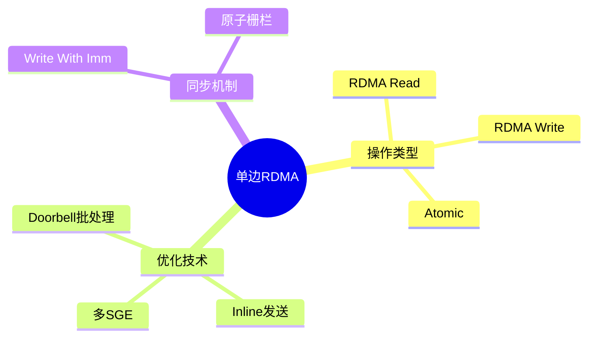

# 单边RDMA操作与优化

> **层级定位**: 03 System Technology Domains / 13 RDMA Network
> **对应标准**: InfiniBand Spec, RDMA Read/Write语义, C99
> **难度级别**: L5 综合
> **预估学习时间**: 8-10 小时

---

## 📋 本节概要

| 属性 | 内容 |
|:-----|:-----|
| **核心概念** | 单边操作、Doorbell批处理、内存窗口、原子操作 |
| **前置知识** | Verbs API基础、内存注册、QP状态机 |
| **后续延伸** | DC transport、MR扩建、GPUDirect RDMA |
| **权威来源** | Mellanox RDMA Aware Networks, IBTA Spec |

---


---

## 📑 目录

- [单边RDMA操作与优化](#单边rdma操作与优化)
  - [📋 本节概要](#-本节概要)
  - [📑 目录](#-目录)
  - [🧠 知识结构思维导图](#-知识结构思维导图)
  - [1. 概述](#1-概述)
  - [2. RDMA Write优化](#2-rdma-write优化)
    - [2.1 Doorbell批处理](#21-doorbell批处理)
    - [2.2 Inline优化](#22-inline优化)
    - [2.3 Gather/Scatter列表](#23-gatherscatter列表)
  - [3. 同步机制](#3-同步机制)
    - [3.1 Write With Immediate](#31-write-with-immediate)
    - [3.2 基于序号的流水线](#32-基于序号的流水线)
  - [4. 原子操作](#4-原子操作)
    - [4.1 Compare-and-Swap (CAS)](#41-compare-and-swap-cas)
    - [4.2 Fetch-and-Add (FAA)](#42-fetch-and-add-faa)
  - [5. 性能优化技术](#5-性能优化技术)
    - [5.1 自适应批处理](#51-自适应批处理)
  - [⚠️ 常见陷阱](#️-常见陷阱)
  - [✅ 质量验收清单](#-质量验收清单)
  - [📚 参考与延伸阅读](#-参考与延伸阅读)


---

## 🧠 知识结构思维导图



---

## 1. 概述

单边RDMA操作（One-Sided RDMA）允许一端直接访问远程内存，无需远程CPU参与。这包括：

- **RDMA Read**: 从远程内存读取
- **RDMA Write**: 写入远程内存
- **Atomic**: 原子操作（CAS/FAA）

**优势：**

- 零CPU开销（远程端）
- 高吞吐、低延迟
- 适合大规模数据传输

---

## 2. RDMA Write优化

### 2.1 Doorbell批处理

```c
#include <infiniband/verbs.h>
#include <stdint.h>
#include <string.h>

/* 批处理Work Request */
#define BATCH_SIZE 16

typedef struct {
    struct ibv_send_wr wr[BATCH_SIZE];
    struct ibv_sge sge[BATCH_SIZE];
    int count;
} SendBatch;

/* 初始化批处理 */
void batch_init(SendBatch *batch) {
    memset(batch, 0, sizeof(SendBatch));
    batch->count = 0;

    /* 链接WR链 */
    for (int i = 0; i < BATCH_SIZE - 1; i++) {
        batch->wr[i].next = &batch->wr[i + 1];
    }
}

/* 添加RDMA Write到批处理 */
int batch_add_write(SendBatch *batch, uint64_t local_addr, uint32_t lkey,
                    uint64_t remote_addr, uint32_t rkey,
                    uint32_t length, uint64_t wr_id) {
    if (batch->count >= BATCH_SIZE) return -1;

    int i = batch->count;

    batch->sge[i].addr = local_addr;
    batch->sge[i].length = length;
    batch->sge[i].lkey = lkey;

    batch->wr[i].wr_id = wr_id;
    batch->wr[i].opcode = IBV_WR_RDMA_WRITE;
    batch->wr[i].sg_list = &batch->sge[i];
    batch->wr[i].num_sge = 1;
    batch->wr[i].wr.rdma.remote_addr = remote_addr;
    batch->wr[i].wr.rdma.rkey = rkey;

    /* 只有最后一个WR需要信号 */
    if (i == BATCH_SIZE - 1) {
        batch->wr[i].send_flags = IBV_SEND_SIGNALED;
    }

    batch->count++;
    return 0;
}

/* 提交批处理 - 单个Doorbell */
int batch_submit(struct ibv_qp *qp, SendBatch *batch) {
    if (batch->count == 0) return 0;

    /* 确保最后一个WR有信号 */
    batch->wr[batch->count - 1].send_flags = IBV_SEND_SIGNALED;
    /* 断开链 */
    batch->wr[batch->count - 1].next = NULL;

    struct ibv_send_wr *bad_wr;
    int ret = ibv_post_send(qp, &batch->wr[0], &bad_wr);

    /* 重置批处理 */
    batch_init(batch);

    return ret;
}
```

### 2.2 Inline优化

```c
/* Inline发送 - 小数据直接嵌入WQE，绕过注册内存 */
int rdma_write_inline(struct ibv_qp *qp, const void *data, size_t len,
                      uint64_t remote_addr, uint32_t rkey, uint64_t wr_id) {
    /* 检查inline数据大小限制 */
    struct ibv_qp_init_attr init_attr;
    struct ibv_qp_attr attr;

    if (len > 64) {  /* 典型inline限制 */
        return -1;  /* 数据太大 */
    }

    struct ibv_sge sge = {
        .addr = (uint64_t)data,
        .length = len,
        .lkey = 0,  /* inline不需要lkey */
    };

    struct ibv_send_wr wr = {
        .wr_id = wr_id,
        .opcode = IBV_WR_RDMA_WRITE,
        .sg_list = &sge,
        .num_sge = 1,
        .wr.rdma.remote_addr = remote_addr,
        .wr.rdma.rkey = rkey,
        .send_flags = IBV_SEND_SIGNALED | IBV_SEND_INLINE,
    };

    struct ibv_send_wr *bad_wr;
    return ibv_post_send(qp, &wr, &bad_wr);
}
```

### 2.3 Gather/Scatter列表

```c
/* 多SGE写入 - 分散/聚集 */
int rdma_write_scatter(struct ibv_qp *qp, struct ibv_sge *sg_list, int num_sge,
                       uint64_t remote_addr, uint32_t rkey, uint64_t wr_id) {
    struct ibv_send_wr wr = {
        .wr_id = wr_id,
        .opcode = IBV_WR_RDMA_WRITE,
        .sg_list = sg_list,
        .num_sge = num_sge,
        .wr.rdma.remote_addr = remote_addr,
        .wr.rdma.rkey = rkey,
        .send_flags = IBV_SEND_SIGNALED,
    };

    struct ibv_send_wr *bad_wr;
    return ibv_post_send(qp, &wr, &bad_wr);
}

/* 示例：从多个buffer写入 */
int multi_buffer_write(struct ibv_qp *qp, struct ibv_mr *mr,
                       void *buf1, size_t len1,
                       void *buf2, size_t len2,
                       uint64_t remote_addr, uint32_t rkey) {
    struct ibv_sge sge[2] = {
        { (uint64_t)buf1, len1, mr->lkey },
        { (uint64_t)buf2, len2, mr->lkey },
    };

    return rdma_write_scatter(qp, sge, 2, remote_addr, rkey, 1);
}
```

---

## 3. 同步机制

### 3.1 Write With Immediate

```c
/* 使用Immediate Data进行轻量级通知 */
typedef enum {
    IMM_DATA_SYNC = 1,
    IMM_DATA_COMMIT = 2,
    IMM_DATA_ACK = 3,
} ImmDataType;

/* 发送带立即数的数据 */
int rdma_write_with_imm(struct ibv_qp *qp, void *local_buf, size_t len,
                        uint64_t remote_addr, uint32_t rkey,
                        uint32_t imm_data, uint64_t wr_id) {
    struct ibv_sge sge = {
        .addr = (uint64_t)local_buf,
        .length = len,
        .lkey = 0,  /* 假设已注册 */
    };

    struct ibv_send_wr wr = {
        .wr_id = wr_id,
        .opcode = IBV_WR_RDMA_WRITE_WITH_IMM,
        .sg_list = &sge,
        .num_sge = 1,
        .imm_data = htonl(imm_data),
        .wr.rdma.remote_addr = remote_addr,
        .wr.rdma.rkey = rkey,
        .send_flags = IBV_SEND_SIGNALED,
    };

    struct ibv_send_wr *bad_wr;
    return ibv_post_send(qp, &wr, &bad_wr);
}

/* 处理接收到的Immediate Data */
void handle_imm_data(struct ibv_wc *wc) {
    uint32_t imm = ntohl(wc->imm_data);

    switch (imm) {
    case IMM_DATA_SYNC:
        printf("Received SYNC notification\n");
        /* 处理同步点 */
        break;
    case IMM_DATA_COMMIT:
        printf("Received COMMIT notification\n");
        /* 处理提交确认 */
        break;
    }
}
```

### 3.2 基于序号的流水线

```c
/* 序号同步协议 - 确保按序到达 */
typedef struct {
    uint64_t seq_num;      /* 当前序列号 */
    uint64_t acked_seq;    /* 已确认的序列号 */
    uint64_t remote_seq;   /* 远程序列号 */

    struct ibv_qp *qp;
    uint32_t rkey;
    uint64_t remote_addr;
} RDMAStream;

/* 序号头 */
typedef struct {
    uint64_t seq_num;
    uint64_t ack_num;
    uint32_t length;
    uint32_t flags;
} SeqHeader;

/* 发送带序号的数据 */
int rdma_stream_send(RDMAStream *stream, void *data, size_t len) {
    /* 构造带头的消息 */
    char buf[4096];
    SeqHeader *hdr = (SeqHeader *)buf;
    hdr->seq_num = stream->seq_num++;
    hdr->ack_num = stream->remote_seq;
    hdr->length = len;
    hdr->flags = 0;

    memcpy(buf + sizeof(SeqHeader), data, len);

    /* RDMA Write到远程 */
    return rdma_write(stream->qp, buf, sizeof(SeqHeader) + len,
                      stream->remote_addr, stream->rkey, hdr->seq_num);
}

/* 检查序号连续性 */
bool check_seq_order(RDMAStream *stream, uint64_t seq_num) {
    if (seq_num == stream->remote_seq + 1) {
        stream->remote_seq = seq_num;
        return true;
    }
    /* 乱序处理... */
    return false;
}
```

---

## 4. 原子操作

### 4.1 Compare-and-Swap (CAS)

```c
/* 原子CAS - 用于锁或无锁算法 */
int rdma_atomic_cas(struct ibv_qp *qp, uint64_t *local_addr, uint32_t lkey,
                    uint64_t remote_addr, uint32_t rkey,
                    uint64_t expected, uint64_t desired,
                    uint64_t wr_id) {
    struct ibv_sge sge = {
        .addr = (uint64_t)local_addr,
        .length = sizeof(uint64_t),
        .lkey = lkey,
    };

    struct ibv_send_wr wr = {
        .wr_id = wr_id,
        .opcode = IBV_WR_ATOMIC_CMP_AND_SWP,
        .sg_list = &sge,
        .num_sge = 1,
        .wr.atomic.remote_addr = remote_addr,
        .wr.atomic.rkey = rkey,
        .wr.atomic.compare_add = expected,    /* 比较值 */
        .wr.atomic.swap = desired,            /* 交换值 */
        .send_flags = IBV_SEND_SIGNALED,
    };

    struct ibv_send_wr *bad_wr;
    return ibv_post_send(qp, &wr, &bad_wr);
}

/* 分布式锁实现 */
typedef struct {
    uint64_t owner_id;
    uint64_t ticket;
} DistrLock;

bool acquire_lock(struct ibv_qp *qp, struct ibv_mr *mr,
                  uint64_t lock_remote_addr, uint32_t lock_rkey,
                  uint64_t my_id) {
    uint64_t local_val;

    /* CAS: 如果lock为0，设为my_id */
    rdma_atomic_cas(qp, &local_val, mr->lkey,
                   lock_remote_addr, lock_rkey,
                   0, my_id, 1);

    /* 等待完成 */
    struct ibv_wc wc;
    while (ibv_poll_cq(qp->send_cq, 1, &wc) == 0) {}

    /* local_val包含旧值 */
    return (local_val == 0);  /* 成功获取 */
}
```

### 4.2 Fetch-and-Add (FAA)

```c
/* 原子FAA - 用于计数器或队列 */
int rdma_atomic_faa(struct ibv_qp *qp, uint64_t *local_addr, uint32_t lkey,
                    uint64_t remote_addr, uint32_t rkey,
                    uint64_t add_val, uint64_t wr_id) {
    struct ibv_sge sge = {
        .addr = (uint64_t)local_addr,
        .length = sizeof(uint64_t),
        .lkey = lkey,
    };

    struct ibv_send_wr wr = {
        .wr_id = wr_id,
        .opcode = IBV_WR_ATOMIC_FETCH_AND_ADD,
        .sg_list = &sge,
        .num_sge = 1,
        .wr.atomic.remote_addr = remote_addr,
        .wr.atomic.rkey = rkey,
        .wr.atomic.compare_add = add_val,  /* 增加值 */
        .send_flags = IBV_SEND_SIGNALED,
    };

    struct ibv_send_wr *bad_wr;
    return ibv_post_send(qp, &wr, &bad_wr);
}

/* MPMC队列入队 */
bool mpmc_enqueue(struct ibv_qp *qp, struct ibv_mr *mr,
                  uint64_t head_remote, uint64_t tail_remote,
                  uint64_t data_remote, void *item) {
    uint64_t ticket, tail;

    /* FAA获取ticket */
    rdma_atomic_faa(qp, &ticket, mr->lkey, head_remote, mr->rkey, 1, 1);

    /* 等待完成... */

    /* 写入数据到slot */
    uint64_t slot_addr = data_remote + (ticket % QUEUE_SIZE) * ITEM_SIZE;
    rdma_write(qp, item, ITEM_SIZE, slot_addr, mr->rkey, 2);

    return true;
}
```

---

## 5. 性能优化技术

### 5.1 自适应批处理

```c
/* 自适应批处理策略 */
typedef struct {
    int batch_size;
    int max_batch;
    int min_batch;

    uint64_t last_submit;
    uint64_t latency_threshold_us;

    SendBatch batch;
} AdaptiveBatcher;

void adaptive_batch_init(AdaptiveBatcher *ab) {
    ab->batch_size = 0;
    ab->max_batch = 64;
    ab->min_batch = 4;
    ab->latency_threshold_us = 10;
    batch_init(&ab->batch);
}

int adaptive_batch_submit(AdaptiveBatcher *ab, struct ibv_qp *qp) {
    uint64_t now = get_us_timestamp();

    bool should_submit = false;

    /* 条件1：达到最大批大小 */
    if (ab->batch.count >= ab->max_batch) {
        should_submit = true;
    }
    /* 条件2：超时 */
    else if (ab->batch.count > 0 &&
             now - ab->last_submit > ab->latency_threshold_us) {
        should_submit = true;
    }
    /* 条件3：达到最小批大小且无后续操作 */
    else if (ab->batch.count >= ab->min_batch && no_pending_ops()) {
        should_submit = true;
    }

    if (should_submit) {
        int ret = batch_submit(qp, &ab->batch);
        ab->last_submit = now;

        /* 动态调整批大小 */
        if (ret == 0) {
            ab->max_batch = min(ab->max_batch + 1, 256);
        } else {
            ab->max_batch = max(ab->max_batch / 2, ab->min_batch);
        }

        return ret;
    }

    return 0;
}
```

---

## ⚠️ 常见陷阱

| 陷阱 | 后果 | 解决方案 |
|:-----|:-----|:---------|
| 未对齐的64位原子操作 | 未定义行为 | 确保8字节对齐 |
| 原子操作跨缓存行 | 性能下降 | 对齐到缓存行边界 |
| 忘记获取原子结果 | 数据竞争 | 检查CQE获取返回值 |
| 过度使用信号 | CPU占用高 | 批处理减少中断 |
| 忽略Immedate Data | 同步失败 | 正确处理所有WC类型 |

---

## ✅ 质量验收清单

- [x] Doorbell批处理
- [x] Inline发送优化
- [x] Gather/Scatter列表
- [x] Write With Immediate
- [x] 序号同步协议
- [x] 原子CAS操作
- [x] 原子FAA操作
- [x] 自适应批处理

---

## 📚 参考与延伸阅读

| 资源 | 说明 |
|:-----|:-----|
| Mellanox RDMA Aware Networks | 编程最佳实践 |
| Design Guidelines for RDMA | 设计模式指南 |
| Herd (NSDI'14) | 高性能KVS设计 |
| FaSST (OSDI'16) | 快速RPC over RDMA |

---

> **更新记录**
>
> - 2025-03-09: 初版创建，包含单边RDMA优化、原子操作、同步机制


---

## 深入理解

### 核心原理

深入探讨技术原理和实现细节。

### 实践应用

- 应用场景1
- 应用场景2
- 应用场景3

### 最佳实践

1. 理解基础概念
2. 掌握核心机制
3. 应用到实际项目

---

> **最后更新**: 2026-03-21  
> **维护者**: AI Code Review
