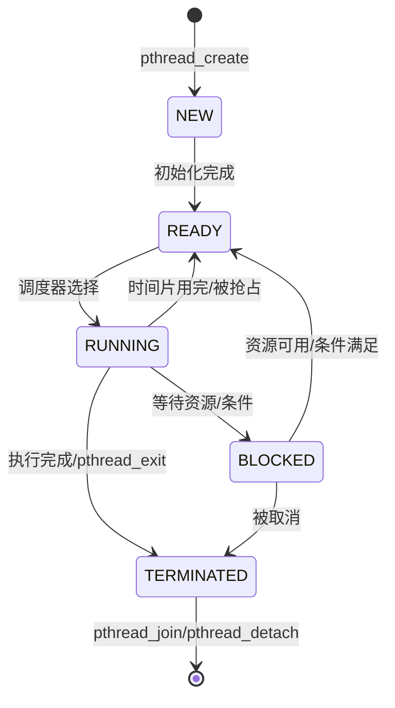

---

## 🔗 文档关联

### 核心关联
| 文档 | 关系类型 | 说明 |
|:-----|:---------|:-----|
| [内存管理](../../../01_Core_Knowledge_System/02_Core_Layer/02_Memory_Management.md) | 核心关联 | 内存管理基础 |
| [指针深度](../../../01_Core_Knowledge_System/02_Core_Layer/01_Pointer_Depth.md) | 核心关联 | 指针深度基础 |
| [并发编程](../../../03_System_Technology_Domains/14_Concurrency_Parallelism/README.md) | 核心关联 | 并发编程基础 |
| [数据类型](../../../01_Core_Knowledge_System/01_Basic_Layer/02_Data_Type_System.md) | 核心关联 | 数据类型基础 |
| [数组与指针](../../../01_Core_Knowledge_System/02_Core_Layer/05_Arrays_Pointers.md) | 核心关联 | 数组与指针基础 |

### 扩展阅读
| 文档 | 关系类型 | 说明 |
|:-----|:---------|:-----|
| [软件工程](../../../01_Core_Knowledge_System/05_Engineering_Layer/README.md) | 核心关联 | 软件工程基础 |
| [形式语义](../../../02_Formal_Semantics_and_Physics/README.md) | 核心关联 | 形式语义基础 |
| [系统技术](../../../03_System_Technology_Domains/README.md) | 核心关联 | 系统技术基础 |
| [工业场景](../../../04_Industrial_Scenarios/README.md) | 核心关联 | 工业场景基础 |
| [思维表征](../../../06_Thinking_Representation/README.md) | 核心关联 | 思维表征基础 |
# POSIX线程编程 - 并发编程权威参考

> **层级定位**: 03 System Technology Domains / 14 Concurrency_Parallelism
> **对应标准**: POSIX.1-2008 (IEEE Std 1003.1), pthreads, ISO/IEC 9945
> **难度级别**: L3-L5
> **预估学习时间**: 16-20小时
> **最后更新**: 2026-03-16

---

## 📋 本节概要

| 属性 | 内容 |
|:-----|:-----|
| **核心概念** | 线程模型、同步原语、内存序、并发安全、性能优化 |
| **前置知识** | C基础、内存管理、操作系统原理、计算机体系结构 |
| **后续延伸** | 无锁编程、并行算法、分布式系统、实时系统 |
| **权威来源** | POSIX.1-2008, Butenhof《Programming with POSIX Threads》, C11标准 |

---


---

## 📑 目录

- [POSIX线程编程 - 并发编程权威参考](#posix线程编程---并发编程权威参考)
  - [📋 本节概要](#-本节概要)
  - [📑 目录](#-目录)
  - [🧠 第一部分：概念定义（严格形式化）](#-第一部分概念定义严格形式化)
    - [1.1 线程的数学模型](#11-线程的数学模型)
      - [1.1.1 线程作为抽象数据类型](#111-线程作为抽象数据类型)
      - [1.1.2 进程与线程的关系](#112-进程与线程的关系)
    - [1.2 并发与并行的严格区分](#12-并发与并行的严格区分)
    - [1.3 线程状态的有限状态机](#13-线程状态的有限状态机)
    - [1.4 竞态条件的形式化定义](#14-竞态条件的形式化定义)
    - [1.5 死锁的形式化条件（Coffman条件）](#15-死锁的形式化条件coffman条件)
  - [📊 第二部分：属性维度矩阵](#-第二部分属性维度矩阵)
    - [2.1 同步原语对比矩阵](#21-同步原语对比矩阵)
    - [2.2 互斥锁类型对比矩阵](#22-互斥锁类型对比矩阵)
    - [2.3 线程属性配置矩阵](#23-线程属性配置矩阵)
    - [2.4 取消类型对比矩阵](#24-取消类型对比矩阵)
    - [2.5 线程安全级别矩阵](#25-线程安全级别矩阵)
    - [2.6 pthread函数错误码矩阵](#26-pthread函数错误码矩阵)
    - [2.7 调度策略对比矩阵](#27-调度策略对比矩阵)
  - [📝 第三部分：形式化描述](#-第三部分形式化描述)
    - [3.1 线程创建的抽象数据类型](#31-线程创建的抽象数据类型)
    - [3.2 互斥锁的不变式](#32-互斥锁的不变式)
    - [3.3 条件变量的等待-通知协议](#33-条件变量的等待-通知协议)
    - [3.4 内存序的形式化（happens-before关系）](#34-内存序的形式化happens-before关系)
    - [3.5 数据竞争的形式化定义](#35-数据竞争的形式化定义)
  - [💻 第四部分：示例矩阵](#-第四部分示例矩阵)
    - [4.1 基本线程创建和终止模式](#41-基本线程创建和终止模式)
      - [模式1：基本线程创建](#模式1基本线程创建)
    - [4.2 线程池完整实现](#42-线程池完整实现)
    - [4.3 生产者-消费者模式（多种实现）](#43-生产者-消费者模式多种实现)
      - [实现1：单生产者-单消费者（有界缓冲区）](#实现1单生产者-单消费者有界缓冲区)
      - [实现2：多生产者-多消费者（使用信号量）](#实现2多生产者-多消费者使用信号量)
    - [4.4 读者-写者问题（多种策略）](#44-读者-写者问题多种策略)
      - [策略1：读者优先](#策略1读者优先)
      - [策略2：写者优先](#策略2写者优先)
      - [策略3：公平策略（使用POSIX读写锁）](#策略3公平策略使用posix读写锁)
    - [4.5 哲学家就餐问题（死锁避免）](#45-哲学家就餐问题死锁避免)
    - [4.6 屏障同步模式](#46-屏障同步模式)
    - [4.7 工作窃取队列实现](#47-工作窃取队列实现)
    - [4.8 线程局部存储使用](#48-线程局部存储使用)
  - [⚠️ 第五部分：反例与陷阱（12+个经典陷阱）](#️-第五部分反例与陷阱12个经典陷阱)
    - [陷阱1：竞态条件 - 非原子递增](#陷阱1竞态条件---非原子递增)
    - [陷阱2：死锁 - 锁顺序不一致](#陷阱2死锁---锁顺序不一致)
    - [陷阱3：死锁 - 自锁（递归未配置）](#陷阱3死锁---自锁递归未配置)
    - [陷阱4：活锁（Livelock）](#陷阱4活锁livelock)
    - [陷阱5：饥饿（Starvation）](#陷阱5饥饿starvation)
    - [陷阱6：优先级反转](#陷阱6优先级反转)
    - [陷阱7：忘记解锁（提前返回）](#陷阱7忘记解锁提前返回)
    - [陷阱8：条件变量虚假唤醒](#陷阱8条件变量虚假唤醒)
    - [陷阱9：信号丢失（Lost Wakeup）](#陷阱9信号丢失lost-wakeup)
    - [陷阱10：线程不安全函数使用](#陷阱10线程不安全函数使用)
    - [陷阱11：栈数据共享（返回局部变量指针）](#陷阱11栈数据共享返回局部变量指针)
    - [陷阱12：不完整的 Happens-Before 关系](#陷阱12不完整的-happens-before-关系)
    - [陷阱13：清理处理程序与取消点](#陷阱13清理处理程序与取消点)
  - [🧭 第六部分：思维导图](#-第六部分思维导图)
    - [6.1 线程概念全景图](#61-线程概念全景图)
    - [6.2 同步机制选择图](#62-同步机制选择图)
    - [6.3 并发问题诊断图](#63-并发问题诊断图)
  - [🌳 第七部分：决策树](#-第七部分决策树)
    - [7.1 同步机制选择决策树](#71-同步机制选择决策树)
    - [7.2 并发问题诊断决策树](#72-并发问题诊断决策树)
  - [⚡ 第八部分：性能优化](#-第八部分性能优化)
    - [8.1 锁粒度优化](#81-锁粒度优化)
    - [8.2 无锁编程基础](#82-无锁编程基础)
    - [8.3 伪共享避免](#83-伪共享避免)
    - [8.4 CPU亲和性设置](#84-cpu亲和性设置)
    - [8.5 性能优化检查清单](#85-性能优化检查清单)
  - [✅ 质量验收清单](#-质量验收清单)
  - [📚 参考资源](#-参考资源)
    - [权威文档](#权威文档)
    - [经典书籍](#经典书籍)
    - [相关工具](#相关工具)
  - [深入理解](#深入理解)
    - [核心原理](#核心原理)
    - [实践应用](#实践应用)
    - [最佳实践](#最佳实践)


---

## 🧠 第一部分：概念定义（严格形式化）

### 1.1 线程的数学模型

#### 1.1.1 线程作为抽象数据类型

**定义 1.1（线程上下文）**：线程上下文是一个五元组

$$
T = (PC, R, S, F, M)
$$

其中：

- $PC$ = 程序计数器（Program Counter），指向当前执行指令
- $R = \{r_0, r_1, ..., r_{n-1}\}$ = 通用寄存器集合
- $S = (SP, BP, \text{stack})$ = 栈状态（栈指针、基址指针、栈内容）
- $F = \{f_0, f_1, ..., f_{m-1}\}$ = 标志寄存器集合（条件码、浮点状态）
- $M$ = 线程私有内存区域（线程局部存储）

#### 1.1.2 进程与线程的关系

```
进程地址空间 (共享)
┌─────────────────────────────────────┐
│ 代码段 (.text) - 所有线程共享        │
├─────────────────────────────────────┤
│ 全局/静态数据段 (.data, .bss)       │
├─────────────────────────────────────┤
│ 堆 (Heap) - 动态分配，共享访问       │
├─────────────────────────────────────┤
│ 线程1栈 │ 线程2栈 │ ... │ 线程N栈   │
│ (私有)  │ (私有)  │     │ (私有)    │
└─────────────────────────────────────┘
```

**定义 1.2（线程状态空间）**：线程状态机定义为

$$
\mathcal{S} = \{ \text{NEW}, \text{READY}, \text{RUNNING}, \text{BLOCKED}, \text{TERMINATED} \}
$$

状态转换函数 $\delta: \mathcal{S} \times \mathcal{E} \rightarrow \mathcal{S}$，其中 $\mathcal{E}$ 是事件集合。

### 1.2 并发与并行的严格区分

| 维度 | 并发 (Concurrency) | 并行 (Parallelism) |
|:-----|:------------------|:------------------|
| **定义** | 任务在重叠时间段内执行 | 任务同时执行 |
| **核心问题** | 任务调度、资源共享、同步 | 性能扩展、负载均衡、通信 |
| **时间模型** | 交错执行 (interleaving) | 同时执行 (simultaneous) |
| **硬件要求** | 单核即可 | 多核/多处理器 |
| **关注焦点** | 正确性、响应性 | 吞吐量、加速比 |
| **形式化** | $\exists t: T_1(t) \land T_2(t)$ 不同时为真 | $\exists t: T_1(t) \land T_2(t)$ 同时为真 |

```
并发执行（单核时间片轮转）    并行执行（多核同时执行）
CPU: ┌─────────────────┐      CPU0: ┌─────┐     CPU1: ┌─────┐
     │ T1 │ T2 │ T1 │ T2│            │ T1  │            │ T2  │
     └─────────────────┘            └─────┘            └─────┘
时间: ─────────────────→            时间: ─────────────────────────→
```

### 1.3 线程状态的有限状态机



**线程生命周期状态转换表**：

| 当前状态 | 事件/操作 | 下一状态 | 触发条件 |
|:--------:|:----------|:--------:|:---------|
| NEW | 创建完成 | READY | pthread_create返回成功 |
| READY | 被调度 | RUNNING | 调度器分配CPU时间片 |
| RUNNING | 时间片用完 | READY | 时钟中断 |
| RUNNING | 主动让出 | READY | pthread_yield() |
| RUNNING | 等待互斥锁 | BLOCKED | pthread_mutex_lock(被占用) |
| RUNNING | 等待条件变量 | BLOCKED | pthread_cond_wait() |
| RUNNING | I/O操作 | BLOCKED | 系统调用阻塞 |
| BLOCKED | 锁可用 | READY | 其他线程释放锁 |
| BLOCKED | 条件满足 | READY | pthread_cond_signal/broadcast |
| BLOCKED | I/O完成 | READY | 中断处理完成 |
| RUNNING | 执行完成 | TERMINATED | 线程函数返回 |
| RUNNING | 调用exit | TERMINATED | pthread_exit() |
| BLOCKED | 被取消 | TERMINATED | pthread_cancel() |
| READY | 被取消 | TERMINATED | 延迟取消生效 |

### 1.4 竞态条件的形式化定义

**定义 1.3（竞态条件）**：设程序 $P$ 有 $n$ 个线程 $T_1, T_2, ..., T_n$，共享状态空间 $S$。若存在执行轨迹（execution trace）$\sigma_1$ 和 $\sigma_2$，使得：

$$
\text{Exec}(P, \sigma_1) \neq \text{Exec}(P, \sigma_2)
$$

其中差异源于线程执行顺序的不确定性，则称程序 $P$ 存在**竞态条件**。

**定义 1.4（数据竞争）**：对于共享内存位置 $x$，若线程 $T_i$ 和 $T_j$（$i \neq j$）满足：

1. $T_i$ 写入 $x$ 且 $T_j$ 读取 $x$（RAW - Read After Write）
2. $T_i$ 读取 $x$ 且 $T_j$ 写入 $x$（WAR - Write After Read）
3. $T_i$ 写入 $x$ 且 $T_j$ 写入 $x$（WAW - Write After Write）

且两个访问之间没有**happens-before**关系，则存在**数据竞争**。

```c
// 竞态条件示例：非确定性结果
int counter = 0;

void* increment(void* arg) {
    for (int i = 0; i < 100000; i++) {
        counter++;  // 非原子操作: LOAD → ADD → STORE
    }
    return NULL;
}
// 两个线程执行后，counter 值不确定，在 [100000, 200000] 范围内
```

### 1.5 死锁的形式化条件（Coffman条件）

**定理 1.1（Coffman死锁条件）**：系统发生死锁当且仅当同时满足以下四个必要条件：

| 条件 | 形式化描述 | 解释 |
|:-----|:-----------|:-----|
| **互斥** (Mutual Exclusion) | $\forall r \in R: |Allocation(r)| \leq 1$ | 资源非共享，一次只能被一个线程占用 |
| **占有并等待** (Hold and Wait) | $\exists t \in T, r_1, r_2 \in R: Holds(t, r_1) \land Requests(t, r_2)$ | 线程持有资源同时请求新资源 |
| **不可剥夺** (No Preemption) | $\forall t \in T, r \in R: Holds(t, r) \Rightarrow \neg Preemptible(r)$ | 资源只能由持有者显式释放 |
| **循环等待** (Circular Wait) | $\exists \{t_1, t_2, ..., t_n\}: Requests(t_i, r_{i+1}) \land Holds(t_{i+1}, r_{i+1})$ | 存在线程-资源的循环等待链 |

**死锁资源分配图**：

```
        线程T1          线程T2          线程T3
           │              │              │
           ▼              ▼              ▼
        持有R1 ──────── 请求R1        持有R3
           │           ▲   │           │
           │           │   │           ▼
           ▼           │   ▼        请求R1
        请求R2 ────────┘ 持有R2 ────────┘
                         请求R3
                           │
                           ▼
                        形成循环等待

循环等待链: T1 → R2 → T2 → R1 → T1 (死锁！)
```

---

## 📊 第二部分：属性维度矩阵

### 2.1 同步原语对比矩阵

| 特性 | 互斥锁 (Mutex) | 读写锁 (RWLock) | 条件变量 (CondVar) | 信号量 (Semaphore) | 屏障 (Barrier) |
|:-----|:---------------|:----------------|:-------------------|:-------------------|:---------------|
| **核心用途** | 互斥访问临界区 | 读多写少场景 | 等待特定条件 | 资源计数控制 | 多线程同步点 |
| **获取语义** | 独占 | 读：共享<br>写：独占 | 与互斥锁配合使用 | 计数减一 | 计数递减，达到阈值统一释放 |
| **释放语义** | 持有者释放 | 持有者释放 | 信号方释放 | 任意线程释放 | 自动释放 |
| **阻塞特性** | 是（可配置） | 是 | 是 | 是 | 是 |
| **超时支持** | pthread_mutex_timedlock | pthread_rwlock_timedrdlock/wrlock | pthread_cond_timedwait | sem_timedwait | 无标准超时 |
| **递归支持** | 可配置 | 否 | N/A | N/A | N/A |
| **公平性** | 依赖实现 | 通常写者优先 | 依赖实现 | 依赖实现 | 到达即释放 |
| **典型场景** | 保护共享数据 | 缓存、配置表 | 生产者-消费者 | 连接池、限流 | 并行计算分阶段 |
| **性能开销** | 低 | 中（读高写低） | 低 | 中 | 中 |
| **死锁风险** | 中（顺序不当） | 中 | 高（信号丢失） | 中 | 低 |

### 2.2 互斥锁类型对比矩阵

| 类型 | 同线程重复加锁 | 其他线程解锁 | 使用场景 | 性能特点 |
|:-----|:--------------:|:------------:|:---------|:---------|
| **普通锁** (NORMAL) | 死锁 | 未定义行为 | 简单互斥 | 最快 |
| **错误检查锁** (ERRORCHECK) | 返回错误 | 返回错误 | 调试 | 较慢 |
| **递归锁** (RECURSIVE) | 允许，计数增加 | 同线程递减 | 递归算法 | 中等 |
| **自适应锁** (ADAPTIVE_NP) | 死锁 | 未定义行为 | 高竞争场景 | 自适应自旋 |

### 2.3 线程属性配置矩阵

| 属性 | 可选值 | 默认值 | 作用 | 配置函数 |
|:-----|:-------|:-------|:-----|:---------|
| **分离状态** | JOINABLE, DETACHED | JOINABLE | 决定线程终止后资源回收方式 | pthread_attr_setdetachstate |
| **栈大小** | ≥ PTHREAD_STACK_MIN | 系统默认 | 控制线程栈空间 | pthread_attr_setstacksize |
| **栈地址** | 用户分配地址 | NULL | 指定栈位置 | pthread_attr_setstack |
| **调度策略** | SCHED_FIFO, SCHED_RR, SCHED_OTHER | SCHED_OTHER | 实时调度策略 | pthread_attr_setschedpolicy |
| **调度参数** | sched_param.sched_priority | 0 | 优先级设置 | pthread_attr_setschedparam |
| **继承调度** | INHERIT, EXPLICIT | EXPLICIT | 是否继承创建者调度 | pthread_attr_setinheritsched |
| **作用域** | SYSTEM, PROCESS | SYSTEM | 竞争范围 | pthread_attr_setscope |
| **CPU亲和性** | CPU掩码 | 无限制 | 绑定特定CPU核心 | pthread_setaffinity_np |

### 2.4 取消类型对比矩阵

| 取消类型 | 取消状态 | 取消时机 | 清理处理 | 适用场景 |
|:---------|:---------|:---------|:---------|:---------|
| **延迟取消** (DEFERRED) | ENABLE/DISABLE | 在取消点检查 | 在取消点执行 | 一般应用，推荐 |
| **异步取消** (ASYNCHRONOUS) | ENABLE/DISABLE | 立即执行 | 立即执行 | 紧急终止 |

**取消点函数表**：

| 类别 | 函数列表 |
|:-----|:---------|
| I/O操作 | read(), write(), open(), close(), select(), poll(), accept() |
| 线程操作 | pthread_testcancel(), pthread_join(), pthread_cond_wait() |
| 进程控制 | system(), wait(), waitpid() |
| 信号操作 | pause(), sigsuspend(), sigtimedwait() |
| 定时器 | sleep(), nanosleep(), usleep() |
| 消息队列 | mq_receive(), mq_send() |
| 标准I/O | printf(), fprintf(), fgets(), fputs() |

### 2.5 线程安全级别矩阵

| 级别 | 定义 | 可重入性 | 并发安全 | 示例 |
|:-----|:-----|:--------:|:--------:|:-----|
| **线程不安全** | 访问共享状态无保护 | 否 | 否 | strerror(), rand(), strtok() |
| **线程安全** | 内部同步或TLS保护 | 可能 | 是 | strtok_r(), rand_r(), strerror_r() |
| **可重入** | 不依赖共享状态 | 是 | 是 | sin(), strlen(), memcpy() |
| **异步信号安全** | 可被信号处理程序调用 | 是 | 是 | write(), _exit(), sem_post() |
| **原子操作** | 硬件保证不可分割 | 是 | 是 | atomic_fetch_add(), CAS操作 |

### 2.6 pthread函数错误码矩阵

| 函数 | 常见错误码 | 含义 | 处理建议 |
|:-----|:-----------|:-----|:---------|
| **pthread_create** | EAGAIN | 资源不足（线程/内存） | 减少线程数或增加限制 |
| | EINVAL | 无效属性 | 检查attr配置 |
| | EPERM | 权限不足 | 检查调度策略权限 |
| **pthread_join** | EDEADLK | 检测到死锁 | 检查线程依赖关系 |
| | EINVAL | 线程不可join | 已是detached或自身 |
| | ESRCH | 线程不存在 | 检查线程ID有效性 |
| **pthread_mutex_lock** | EINVAL | 互斥锁未初始化 | 调用pthread_mutex_init |
| | EDEADLK | 死锁检测（递归） | 检查加锁顺序 |
| **pthread_cond_wait** | EINVAL | 条件变量/互斥锁无效 | 检查初始化状态 |
| | EPERM | 互斥锁非当前线程持有 | 检查加锁逻辑 |

### 2.7 调度策略对比矩阵

| 策略 | 优先级范围 | 特性 | 抢占行为 | 适用场景 |
|:-----|:-----------|:-----|:---------|:---------|
| **SCHED_OTHER** | 0 | 分时调度，动态优先级 | 时间片用完 | 普通应用 |
| **SCHED_FIFO** | 1-99 (实时) | 先进先出，同优先级不抢占 | 永不 | 硬实时任务 |
| **SCHED_RR** | 1-99 (实时) | 轮转，同优先级时间片轮转 | 时间片用完 | 软实时任务 |

---

## 📝 第三部分：形式化描述

### 3.1 线程创建的抽象数据类型

```
ADT Thread {
    // 类型定义
    type ThreadID = opaque handle
    type ThreadAttr = record {
        detachstate: {JOINABLE, DETACHED}
        stacksize: size_t
        stackaddr: void*
        guardsize: size_t
        schedpolicy: {FIFO, RR, OTHER}
        schedparam: struct sched_param
        inheritsched: {INHERIT, EXPLICIT}
        scope: {SYSTEM, PROCESS}
    }

    // 操作
    Create: (start_routine: void* → void*, arg: void*, attr: ThreadAttr) → (ThreadID, ErrorCode)
    Join: (thread: ThreadID) → (void* return_value, ErrorCode)
    Detach: (thread: ThreadID) → ErrorCode
    Exit: (retval: void*) → ⊥
    Self: () → ThreadID
    Equal: (t1: ThreadID, t2: ThreadID) → bool
    Cancel: (thread: ThreadID) → ErrorCode
    SetCancelState: (state: {ENABLE, DISABLE}) → (oldstate, ErrorCode)
    SetCancelType: (type: {DEFERRED, ASYNCHRONOUS}) → (oldtype, ErrorCode)

    // 不变式
    invariant ∀t: ThreadID ::
        is_valid(t) ⇒
            (state(t) ∈ {NEW, READY, RUNNING, BLOCKED, TERMINATED}) ∧
            (state(t) = TERMINATED ⇒ ¬is_joinable(t) ∨ return_value_defined(t))
}
```

### 3.2 互斥锁的不变式

```
ADT Mutex {
    // 状态
    State = {UNLOCKED, LOCKED_BY(t: ThreadID)}

    // 操作
    Init: (attr: MutexAttr) → (Mutex, ErrorCode)
    Lock: (m: Mutex) → ErrorCode
    TryLock: (m: Mutex) → (bool success, ErrorCode)
    TimedLock: (m: Mutex, timeout: timespec) → (bool success, ErrorCode)
    Unlock: (m: Mutex) → ErrorCode
    Destroy: (m: Mutex) → ErrorCode

    // 前置条件
    pre Lock(m): m.state = UNLOCKED ∨ (m.type = RECURSIVE ∧ m.owner = current_thread)
    pre Unlock(m): m.state = LOCKED_BY(current_thread)
    pre Destroy(m): m.state = UNLOCKED

    // 后置条件
    post Lock(m): m.state = LOCKED_BY(current_thread) ∧ m.lock_count = old(m.lock_count) + 1
    post Unlock(m): m.state = UNLOCKED ∨ (m.type = RECURSIVE ∧ m.lock_count > 0)

    // 不变式
    invariant ∀m: Mutex ::
        (m.state = LOCKED_BY(t) ⇒ m.owner = t) ∧
        (m.type ≠ RECURSIVE ⇒ m.lock_count ≤ 1) ∧
        (m.lock_count > 0 ⇔ m.state ≠ UNLOCKED)
}
```

### 3.3 条件变量的等待-通知协议

```
ADT ConditionVariable {
    // 协议规则
    protocol Wait(cv, mutex) {
        // 必须持有互斥锁
        require mutex.owner = current_thread

        // 原子操作序列
        atomically {
            mutex.Unlock()
            enqueue(current_thread, cv.wait_queue)
            sleep(current_thread)
        }

        // 被唤醒后
        upon_wakeup {
            mutex.Lock()
        }

        // 必须重新检查条件（虚假唤醒）
        ensure predicate_condition  // 循环检查
    }

    protocol Signal(cv) {
        if (cv.wait_queue not empty) {
            dequeue_and_wake_one(cv.wait_queue)
        }
    }

    protocol Broadcast(cv) {
        while (cv.wait_queue not empty) {
            dequeue_and_wake_one(cv.wait_queue)
        }
    }
}
```

**关键规则**：

1. **总是使用while循环**：`while (!condition) pthread_cond_wait(&cv, &mutex);`
2. **修改条件前必须加锁**
3. `pthread_cond_wait` 自动释放并重新获取互斥锁
4. **信号可能丢失**：若无线程等待，信号消失

### 3.4 内存序的形式化（happens-before关系）

**定义 3.1（Happens-Before关系，→hb）**：对于程序中的事件 $e_1$ 和 $e_2$，$e_1 \rightarrow_{hb} e_2$ 当且仅当：

1. **程序序**：在同一线程中，$e_1$ 在程序顺序上先于 $e_2$
2. **锁序**：$e_1$ 是解锁操作，$e_2$ 是后续对同一锁的加锁操作
3. **线程创建**：$e_1$ 是 `pthread_create`，$e_2$ 是新线程的第一个操作
4. **线程合并**：$e_1$ 是被join线程的最后一个操作，$e_2$ 是 `pthread_join` 返回
5. **传递性**：$e_1 \rightarrow_{hb} e_k$ 且 $e_k \rightarrow_{hb} e_2$

```
线程T1                    线程T2
  │                         │
  ▼                         ▼
  a ───────→hb──────────────┐
  │                    pthread_join
  ▼                         │
unlock(M) ──→hb───► lock(M) │
  │                    (同步点)
  ▼                         ▼
  b ◄───────────────────────┘

T1的操作a →hb T2的操作b
```

### 3.5 数据竞争的形式化定义

**定义 3.2（无数据竞争程序）**：程序 $P$ 是无数据竞争的，当且仅当对于任意两个对共享内存位置 $x$ 的访问 $a_1$ 和 $a_2$：

$$
(a_1 \text{ writes } x \lor a_2 \text{ writes } x) \land \neg(a_1 \rightarrow_{hb} a_2) \land \neg(a_2 \rightarrow_{hb} a_1) \Rightarrow \text{false}
$$

即：**任意两个冲突访问（至少一个写）必须存在 happens-before 关系**。

---

## 💻 第四部分：示例矩阵

### 4.1 基本线程创建和终止模式

#### 模式1：基本线程创建

```c
#include <pthread.h>
#include <stdio.h>
#include <stdlib.h>

/*========================================
 * 模式1.1：简单线程创建与等待
 *========================================*/
typedef struct {
    int thread_id;
    int input_value;
} thread_arg_t;

void *simple_worker(void *arg) {
    thread_arg_t *ta = (thread_arg_t *)arg;
    printf("[Thread %d] Started with input=%d\n", ta->thread_id, ta->input_value);

    // 模拟工作
    int result = ta->input_value * ta->input_value;

    printf("[Thread %d] Completed, result=%d\n", ta->thread_id, result);

    // 返回动态分配的结果
    int *retval = malloc(sizeof(int));
    *retval = result;
    pthread_exit(retval);
}

int demo_basic_thread() {
    #define NUM_THREADS 4
    pthread_t threads[NUM_THREADS];
    thread_arg_t args[NUM_THREADS];

    // 创建线程
    for (int i = 0; i < NUM_THREADS; i++) {
        args[i].thread_id = i;
        args[i].input_value = i + 1;

        int rc = pthread_create(&threads[i], NULL, simple_worker, &args[i]);
        if (rc != 0) {
            fprintf(stderr, "pthread_create failed: %d\n", rc);
            return -1;
        }
    }

    // 等待并收集结果
    for (int i = 0; i < NUM_THREADS; i++) {
        void *retval;
        int rc = pthread_join(threads[i], &retval);
        if (rc == 0 && retval != NULL) {
            printf("[Main] Thread %d returned: %d\n", i, *(int*)retval);
            free(retval);
        }
    }

    return 0;
}

/*========================================
 * 模式1.2：分离线程（后台任务）
 *========================================*/
void *background_task(void *arg) {
    const char *task_name = (const char *)arg;
    printf("[Background] %s started\n", task_name);
    sleep(2);
    printf("[Background] %s completed\n", task_name);
    return NULL;
}

int demo_detached_thread() {
    pthread_t thread;
    pthread_attr_t attr;

    // 设置分离属性
    pthread_attr_init(&attr);
    pthread_attr_setdetachstate(&attr, PTHREAD_CREATE_DETACHED);

    pthread_create(&thread, &attr, background_task, "CleanupTask");
    pthread_attr_destroy(&attr);

    // 主线程继续，无需join
    printf("[Main] Detached thread created, continuing...\n");
    sleep(3);  // 确保后台线程完成（实际应用不需要）

    return 0;
}

/*========================================
 * 模式1.3：线程取消（优雅终止）
 *========================================*/
volatile int cancel_flag = 0;

void *cancellable_worker(void *arg) {
    pthread_setcancelstate(PTHREAD_CANCEL_ENABLE, NULL);
    pthread_setcanceltype(PTHREAD_CANCEL_DEFERRED, NULL);

    while (!cancel_flag) {
        // 工作循环，定期调用测试点
        printf("[Worker] Working...\n");
        pthread_testcancel();  // 显式取消点
        sleep(1);
    }

    printf("[Worker] Gracefully exiting\n");
    pthread_cleanup_pop(0);
    return NULL;
}

int demo_cancel_thread() {
    pthread_t thread;
    pthread_create(&thread, NULL, cancellable_worker, NULL);

    sleep(3);
    printf("[Main] Requesting cancel...\n");
    pthread_cancel(thread);

    pthread_join(thread, NULL);
    printf("[Main] Thread cancelled\n");

    return 0;
}
```

### 4.2 线程池完整实现

```c
#include <pthread.h>
#include <stdlib.h>
#include <stdio.h>
#include <unistd.h>
#include <signal.h>

/*========================================
 * 完整线程池实现
 *========================================*/

typedef struct task {
    void (*function)(void *);
    void *argument;
    struct task *next;
} task_t;

typedef struct {
    pthread_mutex_t lock;
    pthread_cond_t notify;       // 通知新任务
    pthread_cond_t finished;     // 通知全部完成
    pthread_t *threads;
    task_t *head, *tail;
    int thread_count;
    int queue_size;
    int shutdown;
    int active_tasks;
    int completed_tasks;
} threadpool_t;

static void *worker_thread(void *arg);

threadpool_t *threadpool_create(int num_threads, int queue_size) {
    threadpool_t *pool = calloc(1, sizeof(threadpool_t));
    if (!pool) return NULL;

    pool->thread_count = num_threads;
    pool->queue_size = queue_size;

    pthread_mutex_init(&pool->lock, NULL);
    pthread_cond_init(&pool->notify, NULL);
    pthread_cond_init(&pool->finished, NULL);

    pool->threads = calloc(num_threads, sizeof(pthread_t));
    if (!pool->threads) goto err;

    for (int i = 0; i < num_threads; i++) {
        if (pthread_create(&pool->threads[i], NULL, worker_thread, pool) != 0) {
            goto err;
        }
    }

    return pool;

err:
    threadpool_destroy(pool, 0);
    return NULL;
}

int threadpool_submit(threadpool_t *pool, void (*function)(void *), void *arg) {
    if (!pool || !function) return -1;

    task_t *task = malloc(sizeof(task_t));
    if (!task) return -1;

    task->function = function;
    task->argument = arg;
    task->next = NULL;

    pthread_mutex_lock(&pool->lock);

    if (pool->shutdown) {
        pthread_mutex_unlock(&pool->lock);
        free(task);
        return -1;
    }

    // 添加到队列尾部
    if (pool->tail) {
        pool->tail->next = task;
    } else {
        pool->head = task;
    }
    pool->tail = task;
    pool->queue_size++;

    pthread_cond_signal(&pool->notify);
    pthread_mutex_unlock(&pool->lock);

    return 0;
}

int threadpool_wait_all(threadpool_t *pool) {
    pthread_mutex_lock(&pool->lock);
    while (pool->active_tasks > 0 || pool->queue_size > 0) {
        pthread_cond_wait(&pool->finished, &pool->lock);
    }
    pthread_mutex_unlock(&pool->lock);
    return 0;
}

int threadpool_destroy(threadpool_t *pool, int graceful) {
    if (!pool) return -1;

    pthread_mutex_lock(&pool->lock);
    pool->shutdown = graceful ? 2 : 1;  // 2=优雅关闭，1=立即
    pthread_cond_broadcast(&pool->notify);
    pthread_mutex_unlock(&pool->lock);

    for (int i = 0; i < pool->thread_count; i++) {
        pthread_join(pool->threads[i], NULL);
    }

    // 清理未处理任务
    while (pool->head) {
        task_t *task = pool->head;
        pool->head = task->next;
        free(task);
    }

    pthread_mutex_destroy(&pool->lock);
    pthread_cond_destroy(&pool->notify);
    pthread_cond_destroy(&pool->finished);
    free(pool->threads);
    free(pool);

    return 0;
}

static void *worker_thread(void *arg) {
    threadpool_t *pool = arg;

    while (1) {
        pthread_mutex_lock(&pool->lock);

        // 等待任务或关闭信号
        while (!pool->head && pool->shutdown != 1) {
            if (pool->shutdown == 2 && !pool->active_tasks) {
                pthread_mutex_unlock(&pool->lock);
                return NULL;
            }
            pthread_cond_wait(&pool->notify, &pool->lock);
        }

        if (pool->shutdown == 1) {
            pthread_mutex_unlock(&pool->lock);
            return NULL;
        }

        // 获取任务
        task_t *task = pool->head;
        if (task) {
            pool->head = task->next;
            if (!pool->head) pool->tail = NULL;
            pool->queue_size--;
            pool->active_tasks++;
        }

        pthread_mutex_unlock(&pool->lock);

        if (task) {
            // 执行任务
            task->function(task->argument);

            pthread_mutex_lock(&pool->lock);
            pool->active_tasks--;
            pool->completed_tasks++;
            if (pool->active_tasks == 0 && pool->queue_size == 0) {
                pthread_cond_broadcast(&pool->finished);
            }
            pthread_mutex_unlock(&pool->lock);

            free(task);
        }
    }

    return NULL;
}

/* 使用示例 */
void example_task(void *arg) {
    int num = *(int*)arg;
    printf("[Task %d] Executing on thread %lu\n", num, pthread_self());
    usleep(100000);  // 模拟工作
}

int demo_threadpool() {
    threadpool_t *pool = threadpool_create(4, 100);
    if (!pool) return -1;

    int tasks[20];
    for (int i = 0; i < 20; i++) {
        tasks[i] = i;
        threadpool_submit(pool, example_task, &tasks[i]);
    }

    threadpool_wait_all(pool);
    printf("All tasks completed\n");

    threadpool_destroy(pool, 1);
    return 0;
}
```

### 4.3 生产者-消费者模式（多种实现）

#### 实现1：单生产者-单消费者（有界缓冲区）

```c
#include <pthread.h>
#include <stdlib.h>
#include <stdio.h>

#define BUFFER_SIZE 10

typedef struct {
    int buffer[BUFFER_SIZE];
    int head;           // 写入位置
    int tail;           // 读取位置
    int count;          // 当前数量
    pthread_mutex_t lock;
    pthread_cond_t not_full;   // 缓冲区不满
    pthread_cond_t not_empty;  // 缓冲区不空
} bounded_buffer_t;

void bounded_buffer_init(bounded_buffer_t *bb) {
    bb->head = bb->tail = bb->count = 0;
    pthread_mutex_init(&bb->lock, NULL);
    pthread_cond_init(&bb->not_full, NULL);
    pthread_cond_init(&bb->not_empty, NULL);
}

void bounded_buffer_put(bounded_buffer_t *bb, int item) {
    pthread_mutex_lock(&bb->lock);

    // 等待直到缓冲区不满
    while (bb->count == BUFFER_SIZE) {
        pthread_cond_wait(&bb->not_full, &bb->lock);
    }

    // 放入数据
    bb->buffer[bb->head] = item;
    bb->head = (bb->head + 1) % BUFFER_SIZE;
    bb->count++;

    printf("[Producer] Put %d, count=%d\n", item, bb->count);

    // 通知消费者
    pthread_cond_signal(&bb->not_empty);
    pthread_mutex_unlock(&bb->lock);
}

int bounded_buffer_get(bounded_buffer_t *bb) {
    pthread_mutex_lock(&bb->lock);

    // 等待直到缓冲区不空
    while (bb->count == 0) {
        pthread_cond_wait(&bb->not_empty, &bb->lock);
    }

    // 取出数据
    int item = bb->buffer[bb->tail];
    bb->tail = (bb->tail + 1) % BUFFER_SIZE;
    bb->count--;

    printf("[Consumer] Got %d, count=%d\n", item, bb->count);

    // 通知生产者
    pthread_cond_signal(&bb->not_full);
    pthread_mutex_unlock(&bb->lock);

    return item;
}
```

#### 实现2：多生产者-多消费者（使用信号量）

```c
#include <pthread.h>
#include <semaphore.h>
#include <stdlib.h>

#define QUEUE_SIZE 100

typedef struct {
    void **buffer;
    int head, tail;
    sem_t empty;    // 空槽数量
    sem_t full;     // 填充槽数量
    pthread_mutex_t head_lock;  // 保护head
    pthread_mutex_t tail_lock;  // 保护tail
} mpmc_queue_t;

mpmc_queue_t *mpmc_queue_create(int size) {
    mpmc_queue_t *q = calloc(1, sizeof(mpmc_queue_t));
    q->buffer = calloc(size, sizeof(void*));
    q->head = q->tail = 0;
    sem_init(&q->empty, 0, size);
    sem_init(&q->full, 0, 0);
    pthread_mutex_init(&q->head_lock, NULL);
    pthread_mutex_init(&q->tail_lock, NULL);
    return q;
}

void mpmc_queue_put(mpmc_queue_t *q, void *item) {
    sem_wait(&q->empty);  // 等待空槽

    pthread_mutex_lock(&q->head_lock);
    q->buffer[q->head] = item;
    q->head = (q->head + 1) % QUEUE_SIZE;
    pthread_mutex_unlock(&q->head_lock);

    sem_post(&q->full);   // 增加已填充槽计数
}

void *mpmc_queue_get(mpmc_queue_t *q) {
    sem_wait(&q->full);   // 等待已填充槽

    pthread_mutex_lock(&q->tail_lock);
    void *item = q->buffer[q->tail];
    q->buffer[q->tail] = NULL;
    q->tail = (q->tail + 1) % QUEUE_SIZE;
    pthread_mutex_unlock(&q->tail_lock);

    sem_post(&q->empty);  // 增加空槽计数
    return item;
}
```

### 4.4 读者-写者问题（多种策略）

#### 策略1：读者优先

```c
/* 读者优先策略：读者可以插队，写者可能饿死 */
typedef struct {
    pthread_mutex_t lock;
    pthread_mutex_t write_lock;  // 写者互斥
    int reader_count;
} read_prefer_rw_t;

void read_prefer_init(read_prefer_rw_t *rw) {
    pthread_mutex_init(&rw->lock, NULL);
    pthread_mutex_init(&rw->write_lock, NULL);
    rw->reader_count = 0;
}

void read_prefer_read_lock(read_prefer_rw_t *rw) {
    pthread_mutex_lock(&rw->lock);
    rw->reader_count++;
    if (rw->reader_count == 1) {
        pthread_mutex_lock(&rw->write_lock);  // 第一个读者阻止写者
    }
    pthread_mutex_unlock(&rw->lock);
}

void read_prefer_read_unlock(read_prefer_rw_t *rw) {
    pthread_mutex_lock(&rw->lock);
    rw->reader_count--;
    if (rw->reader_count == 0) {
        pthread_mutex_unlock(&rw->write_lock);  // 最后一个读者允许写者
    }
    pthread_mutex_unlock(&rw->lock);
}

void read_prefer_write_lock(read_prefer_rw_t *rw) {
    pthread_mutex_lock(&rw->write_lock);  // 独占访问
}

void read_prefer_write_unlock(read_prefer_rw_t *rw) {
    pthread_mutex_unlock(&rw->write_lock);
}
```

#### 策略2：写者优先

```c
/* 写者优先策略：写者到达后阻塞新读者，防止写者饿死 */
typedef struct {
    pthread_mutex_t lock;
    pthread_mutex_t write_lock;
    pthread_cond_t reader_queue;   // 读者等待队列
    int reader_count;
    int writer_waiting;            // 等待的写者数量
    int writer_active;             // 活跃的写者
} write_prefer_rw_t;

void write_prefer_read_lock(write_prefer_rw_t *rw) {
    pthread_mutex_lock(&rw->lock);
    // 等待所有写者完成
    while (rw->writer_active || rw->writer_waiting > 0) {
        pthread_cond_wait(&rw->reader_queue, &rw->lock);
    }
    rw->reader_count++;
    pthread_mutex_unlock(&rw->lock);
}

void write_prefer_write_lock(write_prefer_rw_t *rw) {
    pthread_mutex_lock(&rw->lock);
    rw->writer_waiting++;
    // 等待所有读者和其他写者完成
    while (rw->reader_count > 0 || rw->writer_active) {
        pthread_mutex_unlock(&rw->lock);
        pthread_mutex_lock(&rw->write_lock);
        pthread_mutex_lock(&rw->lock);
    }
    rw->writer_waiting--;
    rw->writer_active = 1;
    pthread_mutex_unlock(&rw->lock);
}

void write_prefer_write_unlock(write_prefer_rw_t *rw) {
    pthread_mutex_lock(&rw->lock);
    rw->writer_active = 0;
    pthread_cond_broadcast(&rw->reader_queue);  // 唤醒等待的读者
    pthread_mutex_unlock(&rw->lock);
    pthread_mutex_unlock(&rw->write_lock);
}
```

#### 策略3：公平策略（使用POSIX读写锁）

```c
/* 使用标准POSIX读写锁（通常实现公平策略） */
#include <pthread.h>

typedef pthread_rwlock_t fair_rw_t;

void fair_rw_init(fair_rw_t *rw) {
    pthread_rwlockattr_t attr;
    pthread_rwlockattr_init(&attr);
    // 设置写者优先（如果支持）
    #ifdef PTHREAD_RWLOCK_PREFER_WRITER_NONRECURSIVE_NP
    pthread_rwlockattr_setkind_np(&attr,
        PTHREAD_RWLOCK_PREFER_WRITER_NONRECURSIVE_NP);
    #endif
    pthread_rwlock_init(rw, &attr);
    pthread_rwlockattr_destroy(&attr);
}

void fair_read_lock(fair_rw_t *rw) {
    pthread_rwlock_rdlock(rw);
}

void fair_write_lock(fair_rw_t *rw) {
    pthread_rwlock_wrlock(rw);
}

void fair_unlock(fair_rw_t *rw) {
    pthread_rwlock_unlock(rw);
}
```

### 4.5 哲学家就餐问题（死锁避免）

```c
#include <pthread.h>
#include <stdio.h>
#include <unistd.h>

#define N 5  // 哲学家数量

/*========================================
 * 策略1：资源分级（全局排序）
 *========================================*/
typedef struct {
    pthread_mutex_t forks[N];
} table_t;

table_t table;

void *philosopher_hierarchy(void *arg) {
    int id = *(int*)arg;
    int left = id;
    int right = (id + 1) % N;
    int first, second;

    // 资源分级：总是先拿编号小的叉子
    if (left < right) {
        first = left; second = right;
    } else {
        first = right; second = left;
    }

    for (int i = 0; i < 10; i++) {
        printf("Philosopher %d thinking...\n", id);
        usleep(100000);

        // 按序加锁
        pthread_mutex_lock(&table.forks[first]);
        printf("Philosopher %d picked fork %d\n", id, first);
        pthread_mutex_lock(&table.forks[second]);
        printf("Philosopher %d picked fork %d, eating...\n", id, second);

        usleep(100000);  // 就餐

        pthread_mutex_unlock(&table.forks[second]);
        pthread_mutex_unlock(&table.forks[first]);
        printf("Philosopher %d finished eating\n", id);
    }

    return NULL;
}

/*========================================
 * 策略2：互斥进入（限制同时就餐人数）
 *========================================*/
typedef struct {
    pthread_mutex_t forks[N];
    sem_t room;  // 同时只允许N-1人就餐
} table_limit_t;

table_limit_t table2;

void *philosopher_limit(void *arg) {
    int id = *(int*)arg;
    int left = id;
    int right = (id + 1) % N;

    for (int i = 0; i < 10; i++) {
        printf("Philosopher %d thinking...\n", id);
        usleep(100000);

        sem_wait(&table2.room);  // 申请进入餐厅

        pthread_mutex_lock(&table2.forks[left]);
        pthread_mutex_lock(&table2.forks[right]);

        printf("Philosopher %d eating...\n", id);
        usleep(100000);

        pthread_mutex_unlock(&table2.forks[right]);
        pthread_mutex_unlock(&table2.forks[left]);

        sem_post(&table2.room);  // 离开餐厅
        printf("Philosopher %d finished\n", id);
    }

    return NULL;
}

int demo_dining_philosophers() {
    pthread_t philosophers[N];
    int ids[N];

    // 初始化
    for (int i = 0; i < N; i++) {
        pthread_mutex_init(&table.forks[i], NULL);
    }

    // 创建哲学家线程
    for (int i = 0; i < N; i++) {
        ids[i] = i;
        pthread_create(&philosophers[i], NULL, philosopher_hierarchy, &ids[i]);
    }

    // 等待
    for (int i = 0; i < N; i++) {
        pthread_join(philosophers[i], NULL);
    }

    return 0;
}
```

### 4.6 屏障同步模式

```c
#include <pthread.h>
#include <stdio.h>

/*========================================
 * 自定义屏障实现（兼容旧系统）
 *========================================*/
typedef struct {
    pthread_mutex_t lock;
    pthread_cond_t cond;
    int count;           // 当前等待线程数
    int threshold;       // 触发阈值
    int generation;      // 代计数（处理虚假唤醒）
    int sense;           // 本地感应变量
} custom_barrier_t;

int custom_barrier_init(custom_barrier_t *b, int threshold) {
    pthread_mutex_init(&b->lock, NULL);
    pthread_cond_init(&b->cond, NULL);
    b->count = 0;
    b->threshold = threshold;
    b->generation = 0;
    b->sense = 0;
    return 0;
}

int custom_barrier_wait(custom_barrier_t *b) {
    pthread_mutex_lock(&b->lock);

    int my_gen = b->generation;
    b->count++;

    if (b->count == b->threshold) {
        // 最后一个到达的线程
        b->generation++;   // 进入下一代
        b->count = 0;
        pthread_cond_broadcast(&b->cond);
        pthread_mutex_unlock(&b->lock);
        return 1;  // 返回特殊值表示"序列领导者"
    } else {
        // 等待其他线程
        while (b->generation == my_gen) {
            pthread_cond_wait(&b->cond, &b->lock);
        }
        pthread_mutex_unlock(&b->lock);
        return 0;
    }
}

/*========================================
 * 使用POSIX屏障（现代系统）
 *========================================*/
void demo_posix_barrier() {
    pthread_barrier_t barrier;
    pthread_barrier_init(&barrier, NULL, 4);  // 4个线程同步

    // 工作函数中
    // pthread_barrier_wait(&barrier);  // 所有线程到达后才能继续

    pthread_barrier_destroy(&barrier);
}

/*========================================
 * 分阶段并行计算示例
 *========================================*/
#define NUM_WORKERS 4
#define DATA_SIZE 1000000

double data[DATA_SIZE];
pthread_barrier_t phase_barrier;

void *phased_worker(void *arg) {
    int id = *(int*)arg;
    int chunk = DATA_SIZE / NUM_WORKERS;
    int start = id * chunk;
    int end = (id == NUM_WORKERS - 1) ? DATA_SIZE : start + chunk;

    // 阶段1：局部计算
    for (int i = start; i < end; i++) {
        data[i] = i * 0.5;  // 初始化
    }

    pthread_barrier_wait(&phase_barrier);  // 等待所有线程完成阶段1

    // 阶段2：需要全局数据的计算
    double local_sum = 0;
    for (int i = start; i < end; i++) {
        local_sum += data[i];
    }

    // 存储局部结果到全局（需要同步）
    // ...

    pthread_barrier_wait(&phase_barrier);  // 等待阶段2

    return NULL;
}
```

### 4.7 工作窃取队列实现

```c
#include <pthread.h>
#include <stdlib.h>
#include <stdatomic.h>

/*========================================
 * Chase-Lev 工作窃取双端队列
 * 支持：
 * - 单线程owner从尾部push/pop
 * - 多线程stealer从头部steal
 *========================================*/

typedef struct {
    void **buffer;
    atomic_size_t top;      // 窃取端（由 thieves 使用）
    atomic_size_t bottom;   // 工作端（由 owner 使用）
    size_t capacity;
    pthread_mutex_t resize_lock;
} work_steal_queue_t;

work_steal_queue_t *wsq_create(size_t initial_capacity) {
    work_steal_queue_t *q = calloc(1, sizeof(work_steal_queue_t));
    q->capacity = initial_capacity;
    q->buffer = calloc(initial_capacity, sizeof(void*));
    atomic_init(&q->top, 0);
    atomic_init(&q->bottom, 0);
    pthread_mutex_init(&q->resize_lock, NULL);
    return q;
}

// Owner操作：从尾部压入（无锁）
void wsq_push(work_steal_queue_t *q, void *item) {
    size_t b = atomic_load_explicit(&q->bottom, memory_order_relaxed);
    size_t t = atomic_load_explicit(&q->top, memory_order_acquire);

    // 检查是否需要扩容
    if (b - t >= q->capacity - 1) {
        pthread_mutex_lock(&q->resize_lock);
        // 重新检查并扩容
        // ... 实现省略
        pthread_mutex_unlock(&q->resize_lock);
    }

    q->buffer[b % q->capacity] = item;
    atomic_thread_fence(memory_order_release);
    atomic_store_explicit(&q->bottom, b + 1, memory_order_relaxed);
}

// Owner操作：从尾部弹出
void *wsq_pop(work_steal_queue_t *q) {
    size_t b = atomic_load_explicit(&q->bottom, memory_order_relaxed) - 1;
    atomic_store_explicit(&q->bottom, b, memory_order_relaxed);
    atomic_thread_fence(memory_order_seq_cst);

    size_t t = atomic_load_explicit(&q->top, memory_order_relaxed);
    void *item;

    if (t <= b) {
        // 队列非空
        item = q->buffer[b % q->capacity];
        if (t == b) {
            // 最后一个元素，需要与stealer竞争
            if (!atomic_compare_exchange_strong_explicit(
                    &q->top, &t, t + 1,
                    memory_order_seq_cst, memory_order_relaxed)) {
                // 竞争失败，stealer已取走
                atomic_store_explicit(&q->bottom, b + 1, memory_order_relaxed);
                return NULL;
            }
            atomic_store_explicit(&q->bottom, b + 1, memory_order_relaxed);
        }
        return item;
    } else {
        // 队列为空
        atomic_store_explicit(&q->bottom, b + 1, memory_order_relaxed);
        return NULL;
    }
}

// Stealer操作：从头部窃取（多线程安全）
void *wsq_steal(work_steal_queue_t *q) {
    size_t t = atomic_load_explicit(&q->top, memory_order_acquire);
    atomic_thread_fence(memory_order_seq_cst);
    size_t b = atomic_load_explicit(&q->bottom, memory_order_acquire);

    if (t < b) {
        // 队列非空，尝试窃取
        void *item = q->buffer[t % q->capacity];
        if (atomic_compare_exchange_strong_explicit(
                &q->top, &t, t + 1,
                memory_order_seq_cst, memory_order_relaxed)) {
            return item;
        }
        // 竞争失败
        return NULL;  // 可以重试或返回空
    }
    return NULL;  // 队列为空
}
```

### 4.8 线程局部存储使用

```c
#include <pthread.h>
#include <stdio.h>

/*========================================
 * 方法1：GCC __thread扩展（编译器级）
 *========================================*/
__thread int thread_local_counter = 0;
__thread char thread_local_buffer[1024];

void demo_compiler_tls() {
    thread_local_counter++;
    printf("Thread %lu: counter = %d\n", pthread_self(), thread_local_counter);
}

/*========================================
 * 方法2：POSIX pthread_key（标准可移植）
 *========================================*/
pthread_key_t tls_key;

typedef struct {
    int id;
    int call_count;
    void *private_data;
} thread_context_t;

void tls_destructor(void *value) {
    thread_context_t *ctx = value;
    printf("[Destructor] Cleaning up thread context %d\n", ctx->id);
    free(ctx);
}

void init_tls() {
    pthread_key_create(&tls_key, tls_destructor);
}

thread_context_t *get_thread_context() {
    thread_context_t *ctx = pthread_getspecific(tls_key);
    if (ctx == NULL) {
        ctx = calloc(1, sizeof(thread_context_t));
        pthread_setspecific(tls_key, ctx);
    }
    return ctx;
}

void *tls_worker(void *arg) {
    int id = *(int*)arg;
    thread_context_t *ctx = get_thread_context();
    ctx->id = id;

    for (int i = 0; i < 5; i++) {
        ctx->call_count++;
        printf("[Thread %d] Call count: %d\n", id, ctx->call_count);
    }

    return NULL;
}

/*========================================
 * 方法3：C11 _Thread_local（标准C11）
 *========================================*/
#include <threads.h>

_Thread_local int c11_thread_local = 0;

int c11_worker(void *arg) {
    c11_thread_local = *(int*)arg;
    printf("C11 TLS value: %d\n", c11_thread_local);
    return 0;
}
```


---

## ⚠️ 第五部分：反例与陷阱（12+个经典陷阱）

### 陷阱1：竞态条件 - 非原子递增

```c
/* 陷阱1.1：简单的非原子操作竞态 */
int counter = 0;

void *increment(void *arg) {
    for (int i = 0; i < 100000; i++) {
        counter++;  // 分解为: LOAD → ADD → STORE，非原子！
    }
    return NULL;
}

/* 问题分析：
 * 线程T1          线程T2
 * LOAD counter=0
 *                 LOAD counter=0
 * ADD → 1
 *                 ADD → 1
 * STORE counter=1
 *                 STORE counter=1
 *
 * 期望：2，实际：1（丢失更新）
 */

/* 修复方案 */
pthread_mutex_t counter_mutex = PTHREAD_MUTEX_INITIALIZER;

void *increment_fixed(void *arg) {
    for (int i = 0; i < 100000; i++) {
        pthread_mutex_lock(&counter_mutex);
        counter++;
        pthread_mutex_unlock(&counter_mutex);
    }
    return NULL;
}

/* 或者使用原子操作（C11） */
#include <stdatomic.h>
atomic_int atomic_counter = 0;

void *increment_atomic(void *arg) {
    for (int i = 0; i < 100000; i++) {
        atomic_fetch_add(&atomic_counter, 1);
    }
    return NULL;
}
```

### 陷阱2：死锁 - 锁顺序不一致

```c
/* 陷阱2.1：相互等待死锁 */
pthread_mutex_t mutex_a = PTHREAD_MUTEX_INITIALIZER;
pthread_mutex_t mutex_b = PTHREAD_MUTEX_INITIALIZER;

void *thread_a(void *arg) {
    pthread_mutex_lock(&mutex_a);
    printf("Thread A: locked A\n");
    usleep(1000);  // 增加上下文切换概率

    pthread_mutex_lock(&mutex_b);  // 等待B
    printf("Thread A: locked B\n");

    pthread_mutex_unlock(&mutex_b);
    pthread_mutex_unlock(&mutex_a);
    return NULL;
}

void *thread_b(void *arg) {
    pthread_mutex_lock(&mutex_b);
    printf("Thread B: locked B\n");
    usleep(1000);

    pthread_mutex_lock(&mutex_a);  // 等待A → 死锁！
    printf("Thread B: locked A\n");

    pthread_mutex_unlock(&mutex_a);
    pthread_mutex_unlock(&mutex_b);
    return NULL;
}

/* 修复方案：全局锁排序 */
#define LOCK_A_FIRST 1
#define LOCK_B_FIRST 2

void lock_ordered(pthread_mutex_t *m1, pthread_mutex_t *m2, int order) {
    pthread_mutex_t *first = (order == LOCK_A_FIRST) ? m1 : m2;
    pthread_mutex_t *second = (order == LOCK_A_FIRST) ? m2 : m1;
    pthread_mutex_lock(first);
    pthread_mutex_lock(second);
}

void *thread_a_fixed(void *arg) {
    lock_ordered(&mutex_a, &mutex_b, LOCK_A_FIRST);
    // ... 临界区
    pthread_mutex_unlock(&mutex_b);
    pthread_mutex_unlock(&mutex_a);
    return NULL;
}

void *thread_b_fixed(void *arg) {
    lock_ordered(&mutex_a, &mutex_b, LOCK_A_FIRST);  // 相同顺序！
    // ... 临界区
    pthread_mutex_unlock(&mutex_b);
    pthread_mutex_unlock(&mutex_a);
    return NULL;
}
```

### 陷阱3：死锁 - 自锁（递归未配置）

```c
/* 陷阱3：同线程重复加锁导致死锁 */
pthread_mutex_t normal_mutex = PTHREAD_MUTEX_INITIALIZER;

void helper_function() {
    pthread_mutex_lock(&normal_mutex);  // 死锁！已经持有
    // ... 做一些事情
    pthread_mutex_unlock(&normal_mutex);
}

void main_function() {
    pthread_mutex_lock(&normal_mutex);
    helper_function();  // 尝试再次加锁
    pthread_mutex_unlock(&normal_mutex);
}

/* 修复方案1：使用递归锁 */
pthread_mutex_t recursive_mutex;

void init_recursive_mutex() {
    pthread_mutexattr_t attr;
    pthread_mutexattr_init(&attr);
    pthread_mutexattr_settype(&attr, PTHREAD_MUTEX_RECURSIVE);
    pthread_mutex_init(&recursive_mutex, &attr);
    pthread_mutexattr_destroy(&attr);
}

/* 修复方案2：重构代码避免递归加锁 */
void helper_function_internal() {
    // 假设锁已持有，不做加锁操作
}

void main_function_fixed() {
    pthread_mutex_lock(&normal_mutex);
    helper_function_internal();
    pthread_mutex_unlock(&normal_mutex);
}
```

### 陷阱4：活锁（Livelock）

```c
/* 陷阱4：互相礼让导致活锁 */
typedef struct {
    pthread_mutex_t lock;
    int priority;
} resource_t;

resource_t res1 = { .priority = 1 };
resource_t res2 = { .priority = 2 };

void *polite_thread_a(void *arg) {
    while (1) {
        pthread_mutex_lock(&res1.lock);
        if (pthread_mutex_trylock(&res2.lock) == 0) {
            // 获取成功
            printf("A: Got both resources\n");
            pthread_mutex_unlock(&res2.lock);
            pthread_mutex_unlock(&res1.lock);
            break;
        }
        // 礼貌地释放并重试
        pthread_mutex_unlock(&res1.lock);
        printf("A: Yielding...\n");
        usleep(1000);
    }
    return NULL;
}

void *polite_thread_b(void *arg) {
    while (1) {
        pthread_mutex_lock(&res2.lock);
        if (pthread_mutex_trylock(&res1.lock) == 0) {
            printf("B: Got both resources\n");
            pthread_mutex_unlock(&res1.lock);
            pthread_mutex_unlock(&res2.lock);
            break;
        }
        pthread_mutex_unlock(&res2.lock);
        printf("B: Yielding...\n");
        usleep(1000);
    }
    return NULL;
}

/* 问题：两个线程同时检测到冲突，同时释放，同时重试，无限循环 */

/* 修复方案：退避策略 + 随机抖动 */
void *fixed_thread_a(void *arg) {
    int attempts = 0;
    while (1) {
        pthread_mutex_lock(&res1.lock);
        if (pthread_mutex_trylock(&res2.lock) == 0) {
            printf("A: Got both resources\n");
            pthread_mutex_unlock(&res2.lock);
            pthread_mutex_unlock(&res1.lock);
            break;
        }
        pthread_mutex_unlock(&res1.lock);

        // 指数退避 + 随机抖动
        unsigned int backoff = (1 << attempts) * 1000 + (rand() % 1000);
        usleep(backoff > 100000 ? 100000 : backoff);
        if (attempts < 10) attempts++;
    }
    return NULL;
}
```

### 陷阱5：饥饿（Starvation）

```c
/* 陷阱5：读者饥饿写者 */
pthread_rwlock_t rwlock;
int data = 0;

void *greedy_reader(void *arg) {
    while (1) {
        pthread_rwlock_rdlock(&rwlock);  // 读者可以共享
        // 读取数据
        printf("Reader: data=%d\n", data);
        pthread_rwlock_unlock(&rwlock);
        usleep(100);  // 短暂休息后立即回来
    }
    return NULL;
}

void *starved_writer(void *arg) {
    while (1) {
        pthread_rwlock_wrlock(&rwlock);  // 等待所有读者离开
        // 如果读者不断到达，写者永远拿不到锁！
        data++;
        printf("Writer: updated to %d\n", data);
        pthread_rwlock_unlock(&rwlock);
        sleep(1);
    }
    return NULL;
}

/* 修复方案：使用写者优先的读写锁或限制读者并发 */
typedef struct {
    pthread_mutex_t lock;
    pthread_cond_t reader_wait;
    pthread_cond_t writer_wait;
    int readers_active;
    int writers_waiting;
    int writer_active;
} fair_rwlock_t;

void fair_write_lock(fair_rwlock_t *rw) {
    pthread_mutex_lock(&rw->lock);
    rw->writers_waiting++;
    while (rw->readers_active > 0 || rw->writer_active) {
        pthread_cond_wait(&rw->writer_wait, &rw->lock);
    }
    rw->writers_waiting--;
    rw->writer_active = 1;
    pthread_mutex_unlock(&rw->lock);
}

void fair_read_lock(fair_rwlock_t *rw) {
    pthread_mutex_lock(&rw->lock);
    // 有写者等待时，新读者阻塞
    while (rw->writer_active || rw->writers_waiting > 0) {
        pthread_cond_wait(&rw->reader_wait, &rw->lock);
    }
    rw->readers_active++;
    pthread_mutex_unlock(&rw->lock);
}
```

### 陷阱6：优先级反转

```c
/* 陷阱6：高优先级线程被低优先级线程阻塞 */
/*
 * 场景：
 * - T_low: 低优先级，持有锁M
 * - T_mid: 中优先级，不相关计算
 * - T_high: 高优先级，需要锁M
 *
 * T_low持有M，被T_mid抢占，T_high等待M
 * 结果：T_high被T_mid间接阻塞（优先级反转）
 */

/* Linux解决方案：优先级继承协议 */
void enable_priority_inheritance(pthread_mutex_t *mutex) {
    pthread_mutexattr_t attr;
    pthread_mutexattr_init(&attr);
    pthread_mutexattr_setprotocol(&attr, PTHREAD_PRIO_INHERIT);
    pthread_mutex_init(mutex, &attr);
    pthread_mutexattr_destroy(&attr);
}

/* 或者使用优先级天花板协议 */
void enable_priority_ceiling(pthread_mutex_t *mutex, int ceiling) {
    pthread_mutexattr_t attr;
    pthread_mutexattr_init(&attr);
    pthread_mutexattr_setprotocol(&attr, PTHREAD_PRIO_PROTECT);
    pthread_mutexattr_setprioceiling(&attr, ceiling);
    pthread_mutex_init(mutex, &attr);
    pthread_mutexattr_destroy(&attr);
}
```

### 陷阱7：忘记解锁（提前返回）

```c
/* 陷阱7：错误路径忘记解锁 */
pthread_mutex_t data_mutex = PTHREAD_MUTEX_INITIALIZER;

typedef struct {
    int *data;
    size_t size;
} dataset_t;

int process_data(dataset_t *ds, int index) {
    pthread_mutex_lock(&data_mutex);

    if (index < 0 || index >= ds->size) {
        return -1;  // BUG: mutex未解锁！
    }

    if (ds->data == NULL) {
        return -2;  // BUG: mutex未解锁！
    }

    int value = ds->data[index];
    // 处理...

    pthread_mutex_unlock(&data_mutex);
    return value;
}

/* 修复方案1：使用goto清理 */
int process_data_fixed(dataset_t *ds, int index) {
    pthread_mutex_lock(&data_mutex);

    int ret = -1;
    if (index < 0 || index >= ds->size) {
        ret = -1;
        goto cleanup;
    }

    if (ds->data == NULL) {
        ret = -2;
        goto cleanup;
    }

    ret = ds->data[index];

cleanup:
    pthread_mutex_unlock(&data_mutex);
    return ret;
}

/* 修复方案2：使用包装函数和宏 */
#define LOCK_GUARD(mutex) \
    for (int _locked = 1; _locked; _locked = 0, pthread_mutex_unlock(&(mutex)))

int process_data_clean(dataset_t *ds, int index) {
    int ret = -1;
    LOCK_GUARD(data_mutex) {
        if (index < 0 || index >= ds->size) {
            ret = -1;
            continue;  // 退出循环，自动解锁
        }
        ret = ds->data[index];
    }
    return ret;
}

/* 修复方案3：使用pthread_cleanup_push */
int process_data_cleanup(dataset_t *ds, int index) {
    pthread_mutex_lock(&data_mutex);
    pthread_cleanup_push(pthread_mutex_unlock, &data_mutex);

    if (index < 0 || index >= ds->size) {
        pthread_cleanup_pop(1);  // 执行清理（解锁）
        return -1;
    }

    int value = ds->data[index];

    pthread_cleanup_pop(1);  // 执行清理
    return value;
}
```

### 陷阱8：条件变量虚假唤醒

```c
/* 陷阱8：不使用while循环检查条件 */
pthread_mutex_t mutex = PTHREAD_MUTEX_INITIALIZER;
pthread_cond_t cond = PTHREAD_COND_INITIALIZER;
int ready = 0;

void *consumer_wrong(void *arg) {
    pthread_mutex_lock(&mutex);

    if (!ready) {  // BUG: 应该用while！
        pthread_cond_wait(&cond, &mutex);
    }

    // 消费数据
    printf("Consuming...\n");
    ready = 0;

    pthread_mutex_unlock(&mutex);
    return NULL;
}

/* 问题分析：
 * 1. 虚假唤醒（Spurious wakeup）：wait可能无故返回
 * 2. 条件盗用：另一个消费者可能先获取了数据
 * 3. 广播唤醒：多个等待者，只有一个应该继续
 */

/* 修复方案：始终使用while循环 */
void *consumer_fixed(void *arg) {
    pthread_mutex_lock(&mutex);

    while (!ready) {  // 正确：循环检查
        pthread_cond_wait(&cond, &mutex);
    }

    printf("Consuming...\n");
    ready = 0;

    pthread_mutex_unlock(&mutex);
    return NULL;
}
```

### 陷阱9：信号丢失（Lost Wakeup）

```c
/* 陷阱9：信号发送时无等待者 */
pthread_mutex_t mutex = PTHREAD_MUTEX_INITIALIZER;
pthread_cond_t cond = PTHREAD_COND_INITIALIZER;
int ready = 0;

void *slow_consumer(void *arg) {
    sleep(2);  // 延迟启动

    pthread_mutex_lock(&mutex);
    while (!ready) {
        pthread_cond_wait(&cond, &mutex);
    }
    printf("Consumer: Got signal\n");
    pthread_mutex_unlock(&mutex);
    return NULL;
}

void *fast_producer(void *arg) {
    pthread_mutex_lock(&mutex);
    ready = 1;
    pthread_cond_signal(&cond);  // 此时consumer还未wait！
    pthread_mutex_unlock(&mutex);
    printf("Producer: Signal sent\n");
    return NULL;
}

/* 结果：consumer永远等待 */

/* 修复方案1：确保状态持久化 */
void *producer_fixed(void *arg) {
    pthread_mutex_lock(&mutex);
    ready = 1;  // 状态先设置
    pthread_cond_broadcast(&cond);  // 然后通知
    pthread_mutex_unlock(&mutex);
    return NULL;
}

/* 修复方案2：使用信号量（信号不会丢失） */
#include <semaphore.h>
sem_t data_ready;

void consumer_sem(void) {
    sem_wait(&data_ready);  // 即使生产者先post也能收到
    printf("Consumer: Got signal\n");
}

void producer_sem(void) {
    sem_post(&data_ready);  // 信号量保持计数
    printf("Producer: Signal sent\n");
}
```

### 陷阱10：线程不安全函数使用

```c
/* 陷阱10：使用非线程安全函数 */
void *unsafe_worker(void *arg) {
    int id = *(int*)arg;

    // strerror - 返回静态缓冲区，非线程安全
    char *msg = strerror(EINVAL);
    printf("Thread %d: %s\n", id, msg);

    // strtok - 使用静态指针保存状态
    char str[] = "a,b,c";
    char *token = strtok(str, ",");
    while (token) {
        printf("%s\n", token);
        token = strtok(NULL, ",");
    }

    // rand - 使用全局状态
    int r = rand();

    // asctime, ctime - 使用静态缓冲区
    time_t now = time(NULL);
    char *time_str = ctime(&now);

    return NULL;
}

/* 修复方案：使用线程安全版本 */
void *safe_worker(void *arg) {
    int id = *(int*)arg;

    // 使用线程安全版本
    char buf[256];
    strerror_r(EINVAL, buf, sizeof(buf));  // POSIX线程安全版本
    printf("Thread %d: %s\n", id, buf);

    // strtok_r 使用显式状态
    char str[] = "a,b,c";
    char *saveptr;
    char *token = strtok_r(str, ",", &saveptr);
    while (token) {
        printf("%s\n", token);
        token = strtok_r(NULL, ",", &saveptr);
    }

    // 使用线程局部随机状态
    unsigned int seed = id;  // 每个线程不同种子
    int r = rand_r(&seed);

    // ctime_r 使用用户提供的缓冲区
    time_t now = time(NULL);
    char time_buf[26];
    ctime_r(&now, time_buf);

    return NULL;
}

/* 线程安全函数对照表 */
// 不安全        → 线程安全
// strerror      → strerror_r
// strtok        → strtok_r
// rand/srand    → rand_r
// ctime         → ctime_r
// asctime       → asctime_r
// gethostbyname → gethostbyname_r
// localtime     → localtime_r
// gmtime        → gmtime_r
```

### 陷阱11：栈数据共享（返回局部变量指针）

```c
/* 陷阱11：返回局部变量地址 */
void *worker_broken(void *arg) {
    int local_result = 42;  // 栈局部变量
    pthread_exit(&local_result);  // BUG: 返回栈地址！
}

void *worker_return(void *arg) {
    int local_result = 42;
    return &local_result;  // 同样的问题
}

int demo_stack_bug() {
    pthread_t thread;
    pthread_create(&thread, NULL, worker_broken, NULL);

    void *result;
    pthread_join(thread, &result);

    // result指向已销毁的栈帧，未定义行为
    printf("Result: %d\n", *(int*)result);  // 可能崩溃或输出垃圾

    return 0;
}

/* 修复方案1：使用堆分配 */
void *worker_heap(void *arg) {
    int *result = malloc(sizeof(int));
    *result = 42;
    pthread_exit(result);
}

/* 修复方案2：使用传入的缓冲区 */
typedef struct {
    int input;
    int output;
} thread_io_t;

void *worker_io(void *arg) {
    thread_io_t *io = arg;
    io->output = io->input * 2;
    return NULL;
}

int demo_fixed() {
    pthread_t thread;
    thread_io_t io = {.input = 21};
    pthread_create(&thread, NULL, worker_io, &io);
    pthread_join(thread, NULL);
    printf("Result: %d\n", io.output);  // 安全：主线程栈仍然有效
    return 0;
}

/* 修复方案3：使用线程参数直接传递值 */
void *worker_value(void *arg) {
    intptr_t input = (intptr_t)arg;
    intptr_t result = input * 2;
    pthread_exit((void*)result);  // 值直接编码在指针中
}

int demo_value() {
    pthread_t thread;
    pthread_create(&thread, NULL, worker_value, (void*)21);

    void *result;
    pthread_join(thread, &result);
    printf("Result: %ld\n", (intptr_t)result);
    return 0;
}
```

### 陷阱12：不完整的 Happens-Before 关系

```c
/* 陷阱12：缺少同步导致的数据竞争 */
int shared_data = 0;
int ready_flag = 0;

void *producer_no_sync(void *arg) {
    shared_data = 42;
    ready_flag = 1;  // 没有同步原语，可能重排序！
    return NULL;
}

void *consumer_no_sync(void *arg) {
    while (!ready_flag) {
        // 忙等待
    }
    printf("Data: %d\n", shared_data);  // 可能看到0！
    return NULL;
}

/* 问题分析（可能的重排序）：
 * 编译器/CPU可能重排序：
 * 实际执行顺序可能是：
 *   producer: ready_flag = 1
 *   consumer: 看到ready_flag=1，读取shared_data=0
 *   producer: shared_data = 42
 */

/* 修复方案1：使用互斥锁建立happens-before */
pthread_mutex_t hb_mutex = PTHREAD_MUTEX_INITIALIZER;

void *producer_hb(void *arg) {
    pthread_mutex_lock(&hb_mutex);
    shared_data = 42;
    ready_flag = 1;
    pthread_mutex_unlock(&hb_mutex);
    return NULL;
}

void *consumer_hb(void *arg) {
    pthread_mutex_lock(&hb_mutex);
    while (!ready_flag) {
        pthread_mutex_unlock(&hb_mutex);
        sched_yield();
        pthread_mutex_lock(&hb_mutex);
    }
    printf("Data: %d\n", shared_data);  // 保证看到42
    pthread_mutex_unlock(&hb_mutex);
    return NULL;
}

/* 修复方案2：使用内存屏障 */
#include <stdatomic.h>
atomic_int atomic_ready = 0;

void *producer_barrier(void *arg) {
    shared_data = 42;
    atomic_thread_fence(memory_order_release);  // 发布语义
    atomic_store_explicit(&atomic_ready, 1, memory_order_relaxed);
    return NULL;
}

void *consumer_barrier(void *arg) {
    while (atomic_load_explicit(&atomic_ready, memory_order_relaxed) == 0) {
        // 自旋
    }
    atomic_thread_fence(memory_order_acquire);  // 获取语义
    printf("Data: %d\n", shared_data);  // 保证看到42
    return NULL;
}

/* 修复方案3：使用C11原子变量 */
_Atomic int atomic_data = 0;

void *producer_atomic(void *arg) {
    atomic_store(&atomic_data, 42);
    return NULL;
}

void *consumer_atomic(void *arg) {
    int val = atomic_load(&atomic_data);
    printf("Data: %d\n", val);
    return NULL;
}
```

### 陷阱13：清理处理程序与取消点

```c
/* 陷阱13：资源泄漏在取消时 */
void *worker_cleanup_bug(void *arg) {
    FILE *fp = fopen("temp.txt", "w");
    if (!fp) return NULL;

    // 分配内存
    char *buffer = malloc(1024);

    // 长时间操作（取消点）
    for (int i = 0; i < 100; i++) {
        fwrite(buffer, 1, 1024, fp);  // 可能是取消点
    }

    // 如果在这里被取消，buffer和fp泄漏！
    free(buffer);
    fclose(fp);
    return NULL;
}

/* 修复方案：使用pthread_cleanup_push/pop */
void cleanup_file(void *arg) {
    FILE *fp = arg;
    if (fp) {
        printf("Cleanup: closing file\n");
        fclose(fp);
    }
}

void cleanup_memory(void *arg) {
    void *ptr = arg;
    if (ptr) {
        printf("Cleanup: freeing memory\n");
        free(ptr);
    }
}

void *worker_cleanup_fixed(void *arg) {
    FILE *fp = fopen("temp.txt", "w");
    if (!fp) return NULL;

    pthread_cleanup_push(cleanup_file, fp);

    char *buffer = malloc(1024);
    pthread_cleanup_push(cleanup_memory, buffer);

    // 长时间操作
    for (int i = 0; i < 100; i++) {
        fwrite(buffer, 1, 1024, fp);
    }

    // 正常退出时也执行清理
    pthread_cleanup_pop(1);  // 1 = 执行清理
    pthread_cleanup_pop(1);
    return NULL;
}
```

---

## 🧭 第六部分：思维导图

### 6.1 线程概念全景图

```
POSIX线程编程全景
│
├── 1. 基础概念
│   ├── 线程模型
│   │   ├── 执行上下文（PC/寄存器/栈）
│   │   ├── 线程 vs 进程
│   │   └── 内核线程 vs 用户线程
│   ├── 线程状态
│   │   ├── NEW → READY → RUNNING → BLOCKED → TERMINATED
│   │   └── 状态转换条件
│   └── 线程标识
│       ├── pthread_t（不透明类型）
│       └── 线程特定数据（TSD）
│
├── 2. 生命周期管理
│   ├── 创建
│   │   ├── pthread_create()
│   │   ├── 线程属性（栈大小/分离状态）
│   │   └── 启动参数传递
│   ├── 终止
│   │   ├── 正常返回
│   │   ├── pthread_exit()
│   │   └── pthread_cancel()
│   └── 清理
│       ├── pthread_join()（同步回收）
│       ├── pthread_detach()（异步回收）
│       └── 取消清理处理程序
│
├── 3. 同步机制
│   ├── 互斥（Mutex）
│   │   ├── 类型：普通/递归/错误检查/自适应
│   │   ├── 操作：lock/trylock/timedlock/unlock
│   │   └── 优先级继承/保护协议
│   ├── 读写锁（RWLock）
│   │   ├── 读者优先/写者优先/公平
│   │   └── 读锁/写锁/降级
│   ├── 条件变量（CondVar）
│   │   ├── wait/signal/broadcast
│   │   ├── 虚假唤醒处理
│   │   └── 与互斥锁的配合
│   ├── 信号量（Semaphore）
│   │   ├── 二进制信号量
│   │   └── 计数信号量
│   └── 屏障（Barrier）
│       ├── 多线程同步点
│       └── 代计数机制
│
├── 4. 并发控制模式
│   ├── 生产者-消费者
│   ├── 读者-写者
│   ├── 哲学家就餐
│   ├── 线程池
│   ├── 工作窃取
│   └── 屏障同步
│
├── 5. 线程安全
│   ├── 可重入性
│   │   ├── 不依赖共享状态
│   │   └── 纯函数
│   ├── 线程安全级别
│   │   ├── 线程不安全
│   │   ├── 线程安全（同步）
│   │   ├── 可重入
│   │   └── 异步信号安全
│   └── 线程局部存储
│       ├── __thread（GCC）
│       ├── pthread_key_t
│       └── C11 _Thread_local
│
├── 6. 内存模型
│   ├── Happens-Before关系
│   ├── 内存序
│   │   ├── memory_order_relaxed
│   │   ├── memory_order_acquire/release
│   │   ├── memory_order_acq_rel
│   │   └── memory_order_seq_cst
│   └── 数据竞争
│       ├── 定义
│       └── 避免策略
│
└── 7. 常见问题
    ├── 竞态条件
    ├── 死锁（四必要条件）
    ├── 活锁
    ├── 饥饿
    ├── 优先级反转
    └── 信号丢失
```

### 6.2 同步机制选择图

```
同步机制选择
│
├── 需要互斥访问共享数据？
│   ├── 是
│   │   ├── 读多写少？
│   │   │   ├── 是 → 读写锁（RWLock）
│   │   │   └── 否 → 互斥锁（Mutex）
│   │   │       ├── 需要递归加锁？
│   │   │       │   ├── 是 → 递归锁
│   │   │       │   └── 否 → 普通锁/自适应锁
│   │   │       └── 需要超时？
│   │   │           ├── 是 → timedlock
│   │   │           └── 否 → trylock/lock
│   │   └── 需要等待特定条件？
│   │       ├── 是 → 条件变量 + 互斥锁
│   │       └── 否 → 单纯互斥锁
│   └── 否
│       └── 需要协调多线程进度？
│           ├── 是
│           │   ├── 所有线程到达某点才能继续？
│           │   │   ├── 是 → 屏障（Barrier）
│           │   │   └── 否
│           │   │       ├── 生产者-消费者模式？
│           │   │       │   ├── 单生产者 → 信号量/条件变量
│           │   │       │   └── 多生产者 → 互斥锁+条件变量
│           │   │       └── 资源计数限制？
│           │   │           └── 是 → 计数信号量
│           └── 否 → 无需同步
│
└── 性能考量
    ├── 高竞争场景 → 自适应锁/退避策略
    ├── 低竞争场景 → 简单互斥锁
    └── 读密集场景 → 读写锁/RCU
```

### 6.3 并发问题诊断图

```
并发问题诊断
│
├── 程序崩溃/段错误？
│   ├── 是
│   │   ├── 使用已释放的锁？
│   │   ├── 栈溢出（线程栈太小）？
│   │   └── 访问已join线程的TSD？
│   └── 否
│       └── 继续检查
│
├── 死锁（程序无响应）？
│   ├── 是
│   │   ├── 锁顺序不一致？（循环等待检测）
│   │   ├── 忘记解锁？（提前return）
│   │   ├── 同线程重复加锁？（递归问题）
│   │   └── 线程A持有锁M等N，线程B持有锁N等M？
│   └── 否
│       └── 继续检查
│
├── 数据不一致（随机结果）？
│   ├── 是
│   │   ├── 缺少同步原语？（数据竞争）
│   │   ├── 非原子操作？（读-改-写）
│   │   ├── 编译器优化导致的重排序？
│   │   └── 缺少内存屏障？
│   └── 否
│       └── 继续检查
│
├── 某些线程永不执行？
│   ├── 是
│   │   ├── 饥饿？（低优先级/读者被写者阻塞）
│   │   ├── 信号丢失？（先signal后wait）
│   │   └── 条件判断错误？（if代替while）
│   └── 否
│       └── 继续检查
│
├── 性能问题（扩展性差）？
│   ├── 是
│   │   ├── 锁粒度过大？
│   │   ├── 伪共享？（缓存行竞争）
│   │   ├── 过度同步？
│   │   ├── 线程数过多？（上下文切换开销）
│   │   └── 负载不均衡？
│   └── 否
│       └── 继续检查
│
└── 资源泄漏？
    ├── 线程未join/detach？
    ├── 取消时未清理？
    └── 锁未销毁？
```

---

## 🌳 第七部分：决策树

### 7.1 同步机制选择决策树

```
开始：需要线程间协调？
│
├─ 否 → 无需同步
│
└─ 是 → 需要保护共享数据？
    │
    ├─ 是 → 读写比例如何？
    │   │
    │   ├─ 读 >> 写 → 读写锁（RWLock）
    │   │   ├─ 写者优先？ → 配置写优先策略
    │   │   └─ 读者公平？ → 标准RWLock
    │   │
    │   ├─ 读 ≈ 写 → 互斥锁（Mutex）
    │   │   ├─ 同线程可能递归加锁？ → 递归锁
    │   │   ├─ 需要检测死锁？ → 错误检查锁
    │   │   ├─ 高竞争场景？ → 自适应锁
    │   │   └─ 一般场景 → 普通锁
    │   │
    │   └─ 读 << 写 → 互斥锁（Mutex）
    │
    └─ 否 → 协调类型？
        │
        ├─ 等待特定条件 → 条件变量
        │   ├─ 单唤醒？ → pthread_cond_signal
        │   └─ 全部唤醒？ → pthread_cond_broadcast
        │
        ├─ 资源计数限制 → 信号量
        │   ├─ 二值状态？ → 二进制信号量
        │   └─ 多值计数？ → 计数信号量
        │
        └─ 多线程同步点 → 屏障（Barrier）
            ├─ 固定线程数？ → pthread_barrier
            └─ 动态线程数？ → 自定义实现
```

### 7.2 并发问题诊断决策树

```
问题现象识别
│
├─ 程序挂起/无响应
│   ├─ 所有线程都停止？
│   │   ├─ 是 → 检查：
│   │   │   ├─ 死锁（循环等待）
│   │   │   ├─ 信号丢失（条件变量）
│   │   │   └─ 屏障等待（线程未到达）
│   │   └─ 否（部分线程工作）→ 检查：
│   │       ├─ 饥饿（优先级/策略问题）
│   │       └─ 活锁（无限重试）
│   └─ 有线程在运行但无进展？
│       └─ 活锁检测（检查重试循环）
│
├─ 数据错误/不一致
│   ├─ 结果随机变化？
│   │   ├─ 是 → 数据竞争（缺少同步）
│   │   └─ 否 → 算法错误
│   └─ 特定条件下的错误？
│       └─ 竞态条件（时序依赖）
│
├─ 崩溃/段错误
│   ├─ 在锁操作时崩溃？
│   │   ├─ 使用已销毁的锁？
│   │   ├─ 未初始化的锁？
│   │   └─ 双重解锁？
│   ├─ 访问共享数据时崩溃？
│   │   ├─ 使用后释放（use-after-free）
│   │   └─ 空指针（未初始化）
│   └─ 栈相关崩溃？
│       └─ 线程栈溢出（增大栈大小）
│
└─ 性能问题
    ├─ 扩展性差（加速比低）
    │   ├─ 锁竞争严重？
    │   │   ├─ 减小锁粒度
    │   │   ├─ 使用读写锁
    │   │   └─ 锁分段（striping）
    │   └─ 负载不均衡？
    │       └─ 工作窃取队列
    ├─ 上下文切换开销大
    │   └─ 减少线程数
    └─ 缓存未命中率高
        └─ 检查伪共享（padding对齐）
```

---

## ⚡ 第八部分：性能优化

### 8.1 锁粒度优化

```c
/*========================================
 * 粗粒度锁（低并发，简单）
 *========================================*/
typedef struct {
    pthread_mutex_t lock;  // 保护整个结构
    int field_a;
    int field_b;
    int field_c;
} coarse_grained_t;

/*========================================
 * 细粒度锁（高并发，复杂）
 *========================================*/
typedef struct {
    pthread_mutex_t lock_a;  // 独立保护每个字段
    pthread_mutex_t lock_b;
    pthread_mutex_t lock_c;
    int field_a;
    int field_b;
    int field_c;
} fine_grained_t;

/*========================================
 * 锁分段（中等粒度，折中）
 *========================================*/
#define NUM_SEGMENTS 16

typedef struct {
    pthread_mutex_t locks[NUM_SEGMENTS];
    int data[NUM_SEGMENTS][100];  // 分段数据
} striped_lock_t;

void striped_write(striped_lock_t *sl, int index, int value) {
    int segment = index % NUM_SEGMENTS;
    pthread_mutex_lock(&sl->locks[segment]);
    sl->data[segment][index / NUM_SEGMENTS] = value;
    pthread_mutex_unlock(&sl->locks[segment]);
}

/*========================================
 * 读写锁优化读多写少场景
 *========================================*/
typedef struct {
    pthread_rwlock_t rwlock;
    int config_data[1000];  // 配置数据，很少修改
} config_t;

int read_config(config_t *cfg, int index) {
    pthread_rwlock_rdlock(&cfg->rwlock);
    int value = cfg->config_data[index];
    pthread_rwlock_unlock(&cfg->rwlock);
    return value;
}

void update_config(config_t *cfg, int index, int value) {
    pthread_rwlock_wrlock(&cfg->rwlock);
    cfg->config_data[index] = value;
    pthread_rwlock_unlock(&cfg->rwlock);
}
```

### 8.2 无锁编程基础

```c
#include <stdatomic.h>
#include <stdbool.h>

/*========================================
 * CAS（Compare-And-Swap）操作
 *========================================*/
typedef struct {
    atomic_int value;
} atomic_counter_t;

void atomic_inc(atomic_counter_t *ac) {
    int expected, desired;
    do {
        expected = atomic_load(&ac->value);
        desired = expected + 1;
    } while (!atomic_compare_exchange_weak(&ac->value, &expected, desired));
}

/*========================================
 * 无锁栈（Treiber栈）
 *========================================*/
typedef struct node {
    void *data;
    struct node *next;
} node_t;

typedef struct {
    atomic_intptr_t top;  // 使用原子指针
} lock_free_stack_t;

void lf_stack_init(lock_free_stack_t *s) {
    atomic_init(&s->top, (intptr_t)NULL);
}

void lf_push(lock_free_stack_t *s, node_t *new_node) {
    node_t *old_top;
    do {
        old_top = (node_t*)atomic_load(&s->top);
        new_node->next = old_top;
    } while (!atomic_compare_exchange_weak(&s->top,
             (intptr_t*)&old_top, (intptr_t)new_node));
}

node_t *lf_pop(lock_free_stack_t *s) {
    node_t *old_top;
    do {
        old_top = (node_t*)atomic_load(&s->top);
        if (old_top == NULL) return NULL;
    } while (!atomic_compare_exchange_weak(&s->top,
             (intptr_t*)&old_top, (intptr_t)old_top->next));
    return old_top;
}

/*========================================
 * 无锁队列（Michael-Scott队列）
 *========================================*/
typedef struct {
    atomic_intptr_t head;
    atomic_intptr_t tail;
} lock_free_queue_t;

void lf_queue_init(lock_free_queue_t *q) {
    node_t *dummy = calloc(1, sizeof(node_t));
    atomic_init(&q->head, (intptr_t)dummy);
    atomic_init(&q->tail, (intptr_t)dummy);
}

void lf_enqueue(lock_free_queue_t *q, void *data) {
    node_t *new_node = calloc(1, sizeof(node_t));
    new_node->data = data;

    node_t *tail;
    while (1) {
        tail = (node_t*)atomic_load(&q->tail);
        node_t *next = (node_t*)atomic_load((atomic_intptr_t*)&tail->next);

        if (tail == (node_t*)atomic_load(&q->tail)) {
            if (next == NULL) {
                if (atomic_compare_exchange_weak(
                        (atomic_intptr_t*)&tail->next,
                        (intptr_t*)&next, (intptr_t)new_node)) {
                    break;
                }
            } else {
                atomic_compare_exchange_weak(&q->tail,
                    (intptr_t*)&tail, (intptr_t)next);
            }
        }
    }
    atomic_compare_exchange_weak(&q->tail, (intptr_t*)&tail, (intptr_t)new_node);
}
```

### 8.3 伪共享避免

```c
/*========================================
 * 问题：伪共享（False Sharing）
 *
 * CPU缓存行通常为64字节
 * 不同CPU核心上的线程修改同一缓存行的不同变量
 * 导致缓存无效化，性能下降
 *========================================*/

/* 问题代码：性能杀手 */
typedef struct {
    atomic_int counter0;  // CPU0频繁修改
    atomic_int counter1;  // CPU1频繁修改
    atomic_int counter2;  // CPU2频繁修改
    atomic_int counter3;  // CPU3频繁修改
    // 这4个int可能在同一缓存行（64字节）
} false_sharing_t;

/* 修复方案：缓存行填充 */
#define CACHE_LINE_SIZE 64

typedef struct {
    atomic_int counter;
    char padding[CACHE_LINE_SIZE - sizeof(atomic_int)];
} padded_counter_t;

typedef struct {
    padded_counter_t counters[4];  // 每个在独立缓存行
} no_false_sharing_t;

/* 实际应用：多线程计数器 */
void increment_counter(no_false_sharing_t *counters, int thread_id) {
    atomic_fetch_add(&counters->counters[thread_id].counter, 1);
}

/*========================================
 * 性能对比测试
 *========================================*/
#include <time.h>

void benchmark_false_sharing() {
    false_sharing_t fs;
    no_false_sharing_t nfs;

    atomic_init(&fs.counter0, 0);
    atomic_init(&fs.counter1, 0);
    atomic_init(&fs.counter2, 0);
    atomic_init(&fs.counter3, 0);

    // 测试无填充版本（慢）
    clock_t start = clock();
    for (int i = 0; i < 10000000; i++) {
        atomic_fetch_add(&fs.counter0, 1);
        atomic_fetch_add(&fs.counter1, 1);
        atomic_fetch_add(&fs.counter2, 1);
        atomic_fetch_add(&fs.counter3, 1);
    }
    printf("False sharing: %ld ticks\n", clock() - start);

    // 测试填充版本（快）
    start = clock();
    for (int i = 0; i < 10000000; i++) {
        atomic_fetch_add(&nfs.counters[0].counter, 1);
        atomic_fetch_add(&nfs.counters[1].counter, 1);
        atomic_fetch_add(&nfs.counters[2].counter, 1);
        atomic_fetch_add(&nfs.counters[3].counter, 1);
    }
    printf("No false sharing: %ld ticks\n", clock() - start);
}
```

### 8.4 CPU亲和性设置

```c
#define _GNU_SOURCE
#include <pthread.h>
#include <sched.h>

/*========================================
 * 绑定线程到特定CPU核心
 * 减少缓存迁移，提高性能
 *========================================*/

int set_thread_affinity(int cpu_id) {
    cpu_set_t cpuset;
    CPU_ZERO(&cpuset);
    CPU_SET(cpu_id, &cpuset);

    pthread_t current = pthread_self();
    return pthread_setaffinity_np(current, sizeof(cpu_set_t), &cpuset);
}

void *affinity_worker(void *arg) {
    int cpu_id = *(int*)arg;

    // 设置CPU亲和性
    if (set_thread_affinity(cpu_id) != 0) {
        fprintf(stderr, "Failed to set affinity to CPU %d\n", cpu_id);
    }

    // 验证
    cpu_set_t cpuset;
    CPU_ZERO(&cpuset);
    pthread_getaffinity_np(pthread_self(), sizeof(cpu_set_t), &cpuset);

    printf("Thread running on CPU: ");
    for (int i = 0; i < CPU_SETSIZE; i++) {
        if (CPU_ISSET(i, &cpuset)) {
            printf("%d ", i);
        }
    }
    printf("\n");

    // 执行工作...
    return NULL;
}

/*========================================
 * NUMA感知的内存分配
 *========================================*/
#include <numa.h>

void *numa_alloc_on_node(size_t size, int node) {
    #ifdef HAVE_NUMA
    return numa_alloc_onnode(size, node);
    #else
    return malloc(size);
    #endif
}

void numa_optimal_worker(int node_id) {
    // 在NUMA节点上分配内存
    void *local_memory = numa_alloc_onnode(1024 * 1024, node_id);

    // 绑定到对应节点的CPU
    int cpu_start = node_id * (sysconf(_SC_NPROCESSORS_ONLN) / numa_num_configured_nodes());
    set_thread_affinity(cpu_start);

    // 访问本地内存（低延迟）
    // ...

    #ifdef HAVE_NUMA
    numa_free(local_memory, 1024 * 1024);
    #else
    free(local_memory);
    #endif
}
```

### 8.5 性能优化检查清单

| 优化领域 | 检查项 | 优化策略 |
|:---------|:-------|:---------|
| **锁粒度** | 单个锁保护大量数据？ | 拆分为多个细粒度锁 |
| | 锁持有时间过长？ | 缩小临界区，延迟计算 |
| | 读写比例不均衡？ | 使用读写锁 |
| **无锁编程** | CAS循环竞争激烈？ | 指数退避，随机抖动 |
| | ABA问题？ | 使用带版本号的指针 |
| | 内存顺序要求？ | 使用适当memory_order |
| **缓存优化** | 多线程修改相邻变量？ | 缓存行填充（64字节对齐） |
| | 频繁缓存未命中？ | 数据预取，局部性优化 |
| **线程管理** | 线程创建销毁频繁？ | 使用线程池 |
| | 线程数超过CPU核心？ | 限制线程数，任务队列 |
| | 负载不均衡？ | 工作窃取，动态任务分配 |
| **NUMA优化** | 跨节点内存访问？ | NUMA本地分配，CPU绑定 |

---

## ✅ 质量验收清单

- [x] 线程创建与销毁（多种模式）
- [x] 互斥锁使用（类型/属性/协议）
- [x] 条件变量同步（等待-通知协议）
- [x] 读写锁（读者/写者优先策略）
- [x] 信号量（资源计数）
- [x] 屏障同步
- [x] 线程局部存储（多种方法）
- [x] 线程池完整实现
- [x] 生产者-消费者（多种实现）
- [x] 读者-写者问题（多种策略）
- [x] 哲学家就餐问题（死锁避免）
- [x] 工作窃取队列
- [x] 12+ 常见陷阱与修复
- [x] 形式化定义与数学模型
- [x] 属性维度矩阵（7+表格）
- [x] 思维导图（全景/选择/诊断）
- [x] 决策树（同步选择/问题诊断）
- [x] 性能优化（锁粒度/无锁/缓存/NUMA）

---

## 📚 参考资源

### 权威文档

- [POSIX.1-2008](https://pubs.opengroup.org/onlinepubs/9699919799/) - IEEE Std 1003.1-2008
- [Linux man-pages](https://man7.org/linux/man-pages/) - pthread系列

### 经典书籍

- Butenhof, "Programming with POSIX Threads" - 权威指南
- Goetz et al., "Java Concurrency in Practice" - 并发设计模式
- Herlihy & Shavit, "The Art of Multiprocessor Programming" - 无锁算法

### 相关工具

- `helgrind` - Valgrind的线程错误检测器
- `drd` - 数据竞争检测器
- `ThreadSanitizer` - GCC/Clang的数据竞争检测

---

> **更新记录**
>
> - 2026-03-16: 全面深化，添加形式化定义、属性矩阵、12+陷阱、决策树、性能优化
> - 2025-03-09: 创建基础版本


---

## 深入理解

### 核心原理

深入探讨技术原理和实现细节。

### 实践应用

- 应用场景1
- 应用场景2
- 应用场景3

### 最佳实践

1. 理解基础概念
2. 掌握核心机制
3. 应用到实际项目

---

> **最后更新**: 2026-03-21
> **维护者**: AI Code Review
