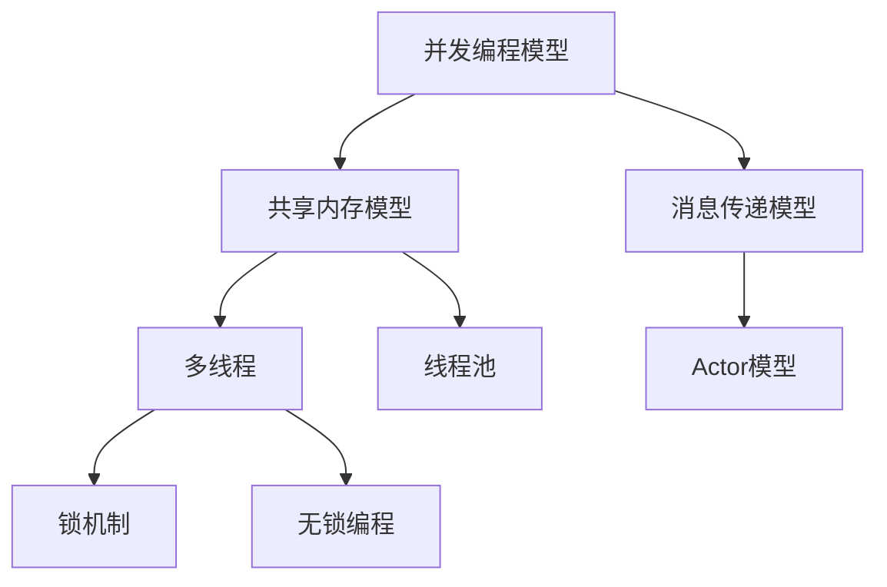
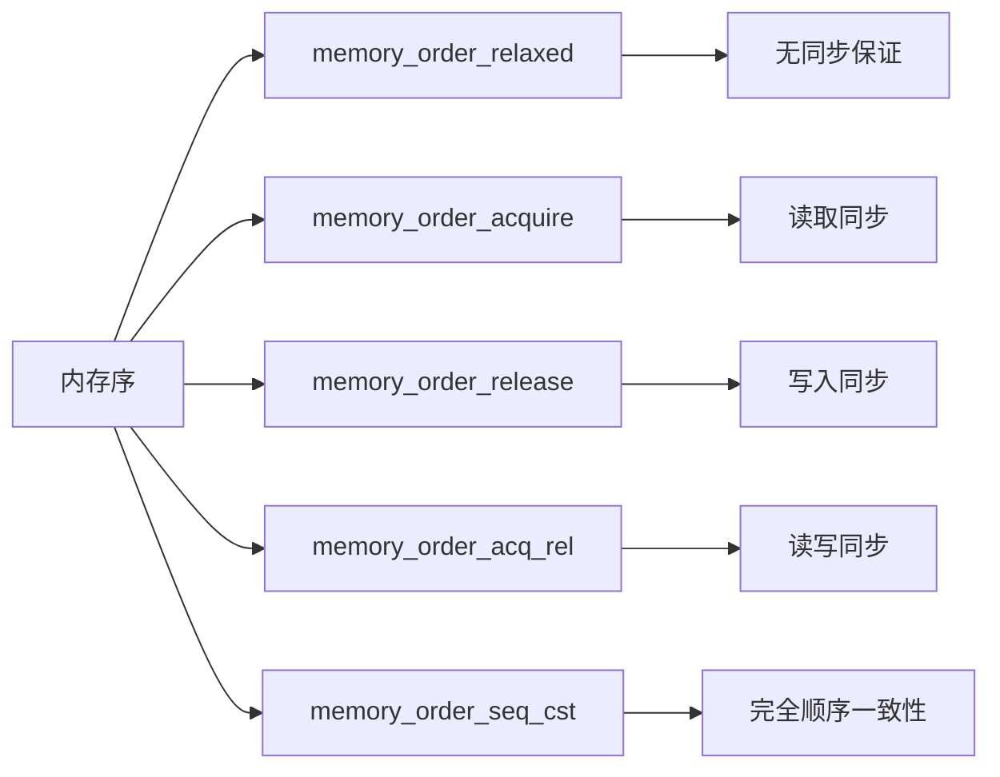
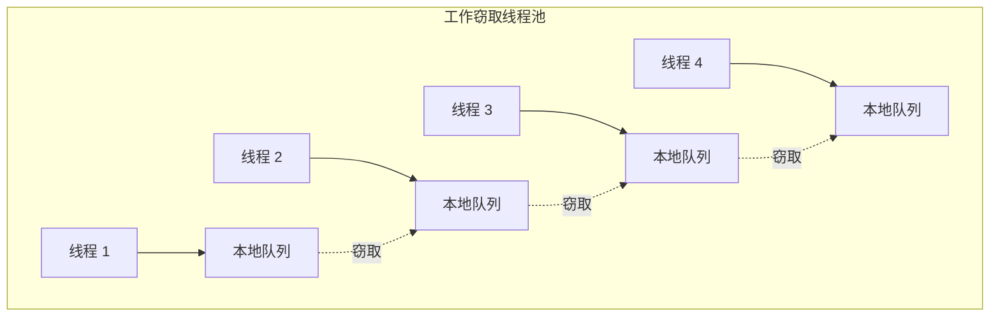
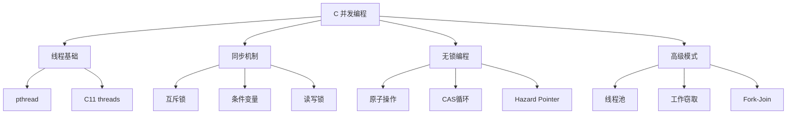

---

## 🔗 文档关联

### 核心关联
| 文档 | 关系类型 | 说明 |
|:-----|:---------|:-----|
| [内存管理](../../../01_Core_Knowledge_System/02_Core_Layer/02_Memory_Management.md) | 核心关联 | 内存管理基础 |
| [指针深度](../../../01_Core_Knowledge_System/02_Core_Layer/01_Pointer_Depth.md) | 核心关联 | 指针深度基础 |
| [并发编程](../../../03_System_Technology_Domains/14_Concurrency_Parallelism/readme.md) | 核心关联 | 并发编程基础 |
| [数据类型](../../../01_Core_Knowledge_System/01_Basic_Layer/02_Data_Type_System.md) | 核心关联 | 数据类型基础 |
| [数组与指针](../../../01_Core_Knowledge_System/02_Core_Layer/05_Arrays_Pointers.md) | 核心关联 | 数组与指针基础 |

### 扩展阅读
| 文档 | 关系类型 | 说明 |
|:-----|:---------|:-----|
| [软件工程](../../../01_Core_Knowledge_System/05_Engineering_Layer/readme.md) | 核心关联 | 软件工程基础 |
| [形式语义](../../../02_Formal_Semantics_and_Physics/readme.md) | 核心关联 | 形式语义基础 |
| [系统技术](../../../03_System_Technology_Domains/readme.md) | 核心关联 | 系统技术基础 |
| [工业场景](../../../04_Industrial_Scenarios/readme.md) | 核心关联 | 工业场景基础 |
| [思维表征](../../../06_Thinking_Representation/readme.md) | 核心关联 | 思维表征基础 |
# C 语言并发与并行编程

## 目录

- [C 语言并发与并行编程](#c-语言并发与并行编程)
  - [目录](#目录)
  - [概述](#概述)
  - [POSIX 线程 (pthread) 深入](#posix-线程-pthread-深入)
    - [线程生命周期管理](#线程生命周期管理)
    - [线程同步原语](#线程同步原语)
    - [线程取消与清理](#线程取消与清理)
  - [C11 `<threads.h>` 标准](#c11-threadsh-标准)
    - [C11 互斥锁与条件变量](#c11-互斥锁与条件变量)
  - [原子操作和内存序](#原子操作和内存序)
    - [内存序详解](#内存序详解)
  - [锁实现](#锁实现)
    - [互斥锁的多种实现](#互斥锁的多种实现)
    - [读写锁实现](#读写锁实现)
  - [无锁编程](#无锁编程)
    - [Hazard Pointer](#hazard-pointer)
    - [无锁栈实现](#无锁栈实现)
  - [线程池实现](#线程池实现)
    - [高性能线程池](#高性能线程池)
    - [工作窃取线程池](#工作窃取线程池)
  - [并行算法模式](#并行算法模式)
    - [Fork-Join 并行](#fork-join-并行)
    - [并行 Map-Reduce](#并行-map-reduce)
    - [屏障同步](#屏障同步)
  - [总结](#总结)
  - [深入理解](#深入理解)
    - [核心原理](#核心原理)
    - [实践应用](#实践应用)
    - [最佳实践](#最佳实践)

---

## 概述

并发与并行编程是现代高性能系统开发的核心技术。
C 语言作为系统级编程语言，提供了多种并发编程机制：

| 机制 | 标准 | 适用场景 |
|------|------|----------|
| POSIX Threads | POSIX | Unix/Linux 系统级编程 |
| C11 Threads | ISO C11 | 跨平台标准化 |
| OpenMP | 编译器扩展 | 科学计算并行化 |
| 无锁编程 | 硬件支持 | 极致性能场景 |



---

## POSIX 线程 (pthread) 深入

### 线程生命周期管理

POSIX 线程（pthread）是 Unix/Linux 系统上最成熟的线程实现。

```c
#define _GNU_SOURCE
#include <pthread.h>
#include <stdio.h>
#include <stdlib.h>
#include <unistd.h>

/* 线程属性配置示例 */
pthread_attr_t configure_thread_attributes(void) {
    pthread_attr_t attr;
    pthread_attr_init(&attr);

    /* 设置分离状态 */
    pthread_attr_setdetachstate(&attr, PTHREAD_CREATE_JOINABLE);

    /* 设置栈大小 */
    size_t stack_size = 1024 * 1024; /* 1MB */
    pthread_attr_setstacksize(&attr, stack_size);

    /* 设置调度策略 */
    pthread_attr_setschedpolicy(&attr, SCHED_FIFO);

    struct sched_param param;
    param.sched_priority = 50;
    pthread_attr_setschedparam(&attr, &param);

    return attr;
}

/* 线程特定数据 (TLS) */
pthread_key_t tls_key;

void destructor(void *value) {
    free(value);
}

void init_tls(void) {
    pthread_key_create(&tls_key, destructor);
}

void set_thread_data(int value) {
    int *data = malloc(sizeof(int));
    *data = value;
    pthread_setspecific(tls_key, data);
}
```

### 线程同步原语

```c
#include <pthread.h>
#include <time.h>

/* 条件变量与互斥锁协同 */
typedef struct {
    pthread_mutex_t mutex;
    pthread_cond_t cond;
    int ready;
} sync_barrier_t;

void barrier_init(sync_barrier_t *barrier) {
    pthread_mutex_init(&barrier->mutex, NULL);
    pthread_cond_init(&barrier->cond, NULL);
    barrier->ready = 0;
}

void barrier_wait(sync_barrier_t *barrier) {
    pthread_mutex_lock(&barrier->mutex);
    while (!barrier->ready) {
        pthread_cond_wait(&barrier->cond, &barrier->mutex);
    }
    pthread_mutex_unlock(&barrier->mutex);
}

void barrier_signal(sync_barrier_t *barrier) {
    pthread_mutex_lock(&barrier->mutex);
    barrier->ready = 1;
    pthread_cond_broadcast(&barrier->cond);
    pthread_mutex_unlock(&barrier->mutex);
}

/* 读写锁实现多读单写 */
typedef struct {
    pthread_rwlock_t rwlock;
    int data;
} rw_protected_data_t;

void read_data(rw_protected_data_t *protected) {
    pthread_rwlock_rdlock(&protected->rwlock);
    /* 读取数据 */
    int value = protected->data;
    (void)value;
    pthread_rwlock_unlock(&protected->rwlock);
}

void write_data(rw_protected_data_t *protected, int value) {
    pthread_rwlock_wrlock(&protected->rwlock);
    protected->data = value;
    pthread_rwlock_unlock(&protected->rwlock);
}
```

### 线程取消与清理

```c
#include <pthread.h>

void cleanup_handler(void *arg) {
    printf("清理资源: %s\n", (char *)arg);
}

void *cancelable_thread(void *arg) {
    /* 注册清理处理器 */
    pthread_cleanup_push(cleanup_handler, "mutex");
    pthread_cleanup_push(cleanup_handler, "file descriptor");

    /* 设置取消类型 */
    pthread_setcanceltype(PTHREAD_CANCEL_DEFERRED, NULL);
    pthread_setcancelstate(PTHREAD_CANCEL_ENABLE, NULL);

    /* 取消点 */
    pthread_testcancel();

    /* 线程工作 */
    for (int i = 0; i < 100; i++) {
        /* 定期检测取消请求 */
        pthread_testcancel();
        /* 执行工作 */
    }

    pthread_cleanup_pop(0);
    pthread_cleanup_pop(0);
    return NULL;
}
```

---

## C11 `<threads.h>` 标准

C11 标准引入了标准化的线程支持，提供了跨平台的线程 API。

```c
#include <threads.h>
#include <stdio.h>
#include <stdlib.h>

/* C11 线程函数 */
int thread_function(void *arg) {
    int *value = (int *)arg;
    printf("线程参数: %d\n", *value);
    return *value * 2;
}

int main(void) {
    thrd_t thread;
    int arg = 42;

    /* 创建线程 */
    if (thrd_create(&thread, thread_function, &arg) != thrd_success) {
        fprintf(stderr, "线程创建失败\n");
        return 1;
    }

    /* 等待线程完成并获取返回值 */
    int result;
    thrd_join(thread, &result);
    printf("线程返回值: %d\n", result);

    return 0;
}
```

### C11 互斥锁与条件变量

```c
#include <threads.h>

/* 线程安全队列 */
typedef struct {
    int *buffer;
    size_t capacity;
    size_t head;
    size_t tail;
    size_t count;
    mtx_t mutex;
    cnd_t not_full;
    cnd_t not_empty;
} bounded_queue_t;

int queue_init(bounded_queue_t *q, size_t capacity) {
    q->buffer = malloc(capacity * sizeof(int));
    if (!q->buffer) return -1;

    q->capacity = capacity;
    q->head = q->tail = q->count = 0;

    mtx_init(&q->mutex, mtx_plain);
    cnd_init(&q->not_full);
    cnd_init(&q->not_empty);

    return 0;
}

void queue_enqueue(bounded_queue_t *q, int value) {
    mtx_lock(&q->mutex);

    while (q->count == q->capacity) {
        cnd_wait(&q->not_full, &q->mutex);
    }

    q->buffer[q->tail] = value;
    q->tail = (q->tail + 1) % q->capacity;
    q->count++;

    cnd_signal(&q->not_empty);
    mtx_unlock(&q->mutex);
}

int queue_dequeue(bounded_queue_t *q, int *value) {
    mtx_lock(&q->mutex);

    while (q->count == 0) {
        cnd_wait(&q->not_empty, &q->mutex);
    }

    *value = q->buffer[q->head];
    q->head = (q->head + 1) % q->capacity;
    q->count--;

    cnd_signal(&q->not_full);
    mtx_unlock(&q->mutex);

    return 0;
}

void queue_destroy(bounded_queue_t *q) {
    free(q->buffer);
    mtx_destroy(&q->mutex);
    cnd_destroy(&q->not_full);
    cnd_destroy(&q->not_empty);
}
```

---

## 原子操作和内存序

C11 引入了 `<stdatomic.h>` 头文件，提供了标准化的原子操作和内存序控制。

```c
#include <stdatomic.h>
#include <stdbool.h>
#include <stdio.h>

/* 基本原子操作 */
atomic_int counter = ATOMIC_VAR_INIT(0);
atomic_flag lock = ATOMIC_FLAG_INIT;

void atomic_increment(void) {
    /* 原子自增，默认内存序 memory_order_seq_cst */
    atomic_fetch_add(&counter, 1);
}

/* 自旋锁实现 */
void spinlock_acquire(atomic_flag *lock) {
    while (atomic_flag_test_and_set_explicit(lock, memory_order_acquire)) {
        /* 忙等待，可添加 CPU 暂停指令 */
        #ifdef __x86_64__
        __asm__ volatile ("pause" ::: "memory");
        #endif
    }
}

void spinlock_release(atomic_flag *lock) {
    atomic_flag_clear_explicit(lock, memory_order_release);
}

/* 内存序示例 */
void memory_ordering_example(void) {
    atomic_int x = ATOMIC_VAR_INIT(0);
    atomic_int y = ATOMIC_VAR_INIT(0);

    /* 线程 1 */
    atomic_store_explicit(&x, 1, memory_order_relaxed);
    atomic_thread_fence(memory_order_release);
    atomic_store_explicit(&y, 1, memory_order_relaxed);

    /* 线程 2 */
    while (atomic_load_explicit(&y, memory_order_relaxed) == 0);
    atomic_thread_fence(memory_order_acquire);
    /* 此时保证能看到 x = 1 */
    int r = atomic_load_explicit(&x, memory_order_relaxed);
    (void)r;
}
```

### 内存序详解



```c
/* 无锁队列节点 */
typedef struct node {
    atomic_int value;
    _Atomic(struct node *)next;
} node_t;

typedef struct {
    _Atomic(node_t *)head;
    _Atomic(node_t *)tail;
} lockfree_queue_t;

void lfqueue_init(lockfree_queue_t *q) {
    node_t *dummy = malloc(sizeof(node_t));
    atomic_store(&dummy->next, NULL);
    atomic_store(&q->head, dummy);
    atomic_store(&q->tail, dummy);
}

void lfqueue_enqueue(lockfree_queue_t *q, int value) {
    node_t *new_node = malloc(sizeof(node_t));
    atomic_store(&new_node->value, value);
    atomic_store(&new_node->next, NULL);

    node_t *tail;
    while (1) {
        tail = atomic_load(&q->tail);
        node_t *next = atomic_load(&tail->next);

        if (tail == atomic_load(&q->tail)) {
            if (next == NULL) {
                if (atomic_compare_exchange_weak(&tail->next, &next, new_node)) {
                    break;
                }
            } else {
                atomic_compare_exchange_weak(&q->tail, &tail, next);
            }
        }
    }
    atomic_compare_exchange_weak(&q->tail, &tail, new_node);
}
```

---

## 锁实现

### 互斥锁的多种实现

```c
#include <stdatomic.h>
#include <stdbool.h>

/* 1. 测试-测试-设置锁 (TTAS) */
typedef struct {
    atomic_bool locked;
} ttas_lock_t;

void ttas_init(ttas_lock_t *lock) {
    atomic_init(&lock->locked, false);
}

void ttas_acquire(ttas_lock_t *lock) {
    while (1) {
        /* 先读取，避免不必要的缓存一致性流量 */
        while (atomic_load_explicit(&lock->locked, memory_order_relaxed));

        /* 尝试获取锁 */
        if (!atomic_exchange_explicit(&lock->locked, true, memory_order_acquire)) {
            return;
        }
    }
}

void ttas_release(ttas_lock_t *lock) {
    atomic_store_explicit(&lock->locked, false, memory_order_release);
}

/* 2. 退避策略锁 */
typedef struct {
    atomic_bool locked;
    unsigned int min_delay;
    unsigned int max_delay;
} backoff_lock_t;

void backoff_acquire(backoff_lock_t *lock) {
    unsigned int delay = lock->min_delay;

    while (1) {
        while (atomic_load_explicit(&lock->locked, memory_order_relaxed));

        if (!atomic_exchange_explicit(&lock->locked, true, memory_order_acquire)) {
            return;
        }

        /* 指数退避 */
        for (unsigned int i = 0; i < delay; i++) {
            #ifdef __x86_64__
            __asm__ volatile ("pause");
            #endif
        }

        delay = (delay * 2) > lock->max_delay ? lock->max_delay : delay * 2;
    }
}

/* 3. MCS 队列锁 - 保证公平性 */
typedef struct mcs_node {
    atomic_bool locked;
    _Atomic(struct mcs_node *)next;
} mcs_node_t;

typedef struct {
    _Atomic(mcs_node_t *)tail;
} mcs_lock_t;

void mcs_acquire(mcs_lock_t *lock, mcs_node_t *node) {
    atomic_store_explicit(&node->locked, true, memory_order_relaxed);
    atomic_store_explicit(&node->next, NULL, memory_order_relaxed);

    mcs_node_t *prev = atomic_exchange_explicit(&lock->tail, node, memory_order_acq_rel);

    if (prev != NULL) {
        atomic_store_explicit(&prev->next, node, memory_order_release);
        while (atomic_load_explicit(&node->locked, memory_order_acquire));
    }
}

void mcs_release(mcs_lock_t *lock, mcs_node_t *node) {
    mcs_node_t *next = atomic_load_explicit(&node->next, memory_order_acquire);

    if (next == NULL) {
        mcs_node_t *expected = node;
        if (atomic_compare_exchange_strong_explicit(
                &lock->tail, &expected, NULL,
                memory_order_release, memory_order_relaxed)) {
            return;
        }

        /* 等待后继节点设置 */
        do {
            next = atomic_load_explicit(&node->next, memory_order_acquire);
        } while (next == NULL);
    }

    atomic_store_explicit(&next->locked, false, memory_order_release);
}
```

### 读写锁实现

```c
#include <stdatomic.h>
#include <stdint.h>

/* 读写锁 - 使用 64 位整数 */
/* 高 32 位: 等待的写者 | 低 32 位: 读者计数 */
typedef atomic_uint_least64_t rwlock_t;

#define READER_MASK 0xFFFFFFFFULL
#define WRITER_FLAG 0x100000000ULL

void rwlock_init(rwlock_t *lock) {
    atomic_init(lock, 0);
}

void rwlock_read_lock(rwlock_t *lock) {
    while (1) {
        uint64_t value = atomic_load_explicit(lock, memory_order_relaxed);

        /* 检查是否有写者 */
        if ((value & WRITER_FLAG) != 0) {
            #ifdef __x86_64__
            __asm__ volatile ("pause");
            #endif
            continue;
        }

        /* 尝试增加读者计数 */
        uint64_t new_value = value + 1;
        if (atomic_compare_exchange_weak_explicit(
                lock, &value, new_value,
                memory_order_acquire, memory_order_relaxed)) {
            return;
        }
    }
}

void rwlock_read_unlock(rwlock_t *lock) {
    atomic_fetch_sub_explicit(lock, 1, memory_order_release);
}

void rwlock_write_lock(rwlock_t *lock) {
    /* 设置写者标志 */
    while (1) {
        uint64_t value = atomic_load_explicit(lock, memory_order_relaxed);

        if ((value & WRITER_FLAG) != 0 || (value & READER_MASK) != 0) {
            #ifdef __x86_64__
            __asm__ volatile ("pause");
            #endif
            continue;
        }

        uint64_t new_value = value | WRITER_FLAG;
        if (atomic_compare_exchange_weak_explicit(
                lock, &value, new_value,
                memory_order_acquire, memory_order_relaxed)) {
            return;
        }
    }
}

void rwlock_write_unlock(rwlock_t *lock) {
    atomic_fetch_and_explicit(lock, READER_MASK, memory_order_release);
}
```

---

## 无锁编程

### Hazard Pointer

Hazard Pointer 是一种安全的内存回收机制，用于无锁数据结构。

```c
#include <stdatomic.h>
#include <stdbool.h>
#include <stdlib.h>

#define HP_THREADS 64
#define HP_K 2  /* 每个线程的 hazard pointer 数量 */
#define HP_THRESHOLD (HP_THREADS * HP_K * 2)

typedef struct hp_record {
    _Atomic(void *)hp[HP_K];
    atomic_bool active;
    struct hp_record *next;
} hp_record_t;

static _Atomic(hp_record_t *) g_hp_head = NULL;
static _Thread_local hp_record_t *tl_hp_record = NULL;

/*  retired list */
typedef struct retired_node {
    void *ptr;
    void (*deleter)(void *);
    struct retired_node *next;
} retired_node_t;

static _Thread_local retired_node_t *tl_retired_list = NULL;
static _Thread_local size_t tl_retired_count = 0;

hp_record_t *hp_get_record(void) {
    if (tl_hp_record != NULL) {
        return tl_hp_record;
    }

    /* 查找或创建 hazard pointer 记录 */
    hp_record_t *record = malloc(sizeof(hp_record_t));
    for (int i = 0; i < HP_K; i++) {
        atomic_init(&record->hp[i], NULL);
    }
    atomic_init(&record->active, true);

    /* 插入全局链表 */
    hp_record_t *head;
    do {
        head = atomic_load(&g_hp_head);
        record->next = head;
    } while (!atomic_compare_exchange_weak(&g_hp_head, &head, record));

    tl_hp_record = record;
    return record;
}

void hp_set(int index, void *ptr) {
    hp_record_t *record = hp_get_record();
    atomic_store_explicit(&record->hp[index], ptr, memory_order_release);
}

void hp_clear(int index) {
    hp_record_t *record = hp_get_record();
    atomic_store_explicit(&record->hp[index], NULL, memory_order_release);
}

bool hp_scan(void *ptr) {
    hp_record_t *record = atomic_load(&g_hp_head);
    while (record != NULL) {
        if (atomic_load_explicit(&record->active, memory_order_acquire)) {
            for (int i = 0; i < HP_K; i++) {
                if (atomic_load_explicit(&record->hp[i], memory_order_acquire) == ptr) {
                    return true;
                }
            }
        }
        record = record->next;
    }
    return false;
}

void hp_retire(void *ptr, void (*deleter)(void *)) {
    retired_node_t *node = malloc(sizeof(retired_node_t));
    node->ptr = ptr;
    node->deleter = deleter;
    node->next = tl_retired_list;
    tl_retired_list = node;
    tl_retired_count++;

    if (tl_retired_count >= HP_THRESHOLD) {
        hp_scan_and_free();
    }
}

void hp_scan_and_free(void) {
    retired_node_t **current = &tl_retired_list;
    while (*current != NULL) {
        retired_node_t *node = *current;
        if (!hp_scan(node->ptr)) {
            /* 安全删除 */
            *current = node->next;
            node->deleter(node->ptr);
            free(node);
            tl_retired_count--;
        } else {
            current = &(*current)->next;
        }
    }
}
```

### 无锁栈实现

```c
#include <stdatomic.h>
#include <stdlib.h>

typedef struct stack_node {
    void *data;
    _Atomic(struct stack_node *)next;
} stack_node_t;

typedef struct {
    _Atomic(stack_node_t *)top;
} lockfree_stack_t;

void stack_init(lockfree_stack_t *stack) {
    atomic_init(&stack->top, NULL);
}

void stack_push(lockfree_stack_t *stack, void *data) {
    stack_node_t *new_node = malloc(sizeof(stack_node_t));
    new_node->data = data;

    stack_node_t *old_top;
    do {
        old_top = atomic_load_explicit(&stack->top, memory_order_relaxed);
        atomic_store_explicit(&new_node->next, old_top, memory_order_relaxed);
    } while (!atomic_compare_exchange_weak_explicit(
        &stack->top, &old_top, new_node,
        memory_order_release, memory_order_relaxed));
}

void *stack_pop(lockfree_stack_t *stack) {
    stack_node_t *old_top;
    stack_node_t *next;

    do {
        old_top = atomic_load_explicit(&stack->top, memory_order_acquire);
        if (old_top == NULL) {
            return NULL;
        }
        next = atomic_load_explicit(&old_top->next, memory_order_relaxed);
    } while (!atomic_compare_exchange_weak_explicit(
        &stack->top, &old_top, next,
        memory_order_release, memory_order_acquire));

    void *data = old_top->data;
    /* 使用 hazard pointer 安全释放 */
    hp_retire(old_top, free);
    return data;
}
```

---

## 线程池实现

### 高性能线程池

```c
#include <pthread.h>
#include <stdatomic.h>
#include <stdbool.h>
#include <stdlib.h>
#include <stdio.h>

/* 任务定义 */
typedef struct task {
    void (*function)(void *);
    void *argument;
    struct task *next;
} task_t;

/* 线程池 */
typedef struct {
    /* 任务队列 */
    task_t *task_head;
    task_t *task_tail;
    pthread_mutex_t task_mutex;
    pthread_cond_t task_cond;
    atomic_bool shutdown;

    /* 工作线程 */
    pthread_t *threads;
    size_t num_threads;
    atomic_size_t active_tasks;

    /* 统计 */
    atomic_size_t tasks_completed;
    atomic_size_t tasks_submitted;
} threadpool_t;

/* 工作线程函数 */
static void *worker_thread(void *arg) {
    threadpool_t *pool = (threadpool_t *)arg;

    while (1) {
        pthread_mutex_lock(&pool->task_mutex);

        /* 等待任务 */
        while (pool->task_head == NULL && !atomic_load(&pool->shutdown)) {
            pthread_cond_wait(&pool->task_cond, &pool->task_mutex);
        }

        if (atomic_load(&pool->shutdown)) {
            pthread_mutex_unlock(&pool->task_mutex);
            break;
        }

        /* 获取任务 */
        task_t *task = pool->task_head;
        if (task) {
            pool->task_head = task->next;
            if (pool->task_head == NULL) {
                pool->task_tail = NULL;
            }
        }

        pthread_mutex_unlock(&pool->task_mutex);

        if (task) {
            atomic_fetch_add(&pool->active_tasks, 1);
            task->function(task->argument);
            free(task);
            atomic_fetch_sub(&pool->active_tasks, 1);
            atomic_fetch_add(&pool->tasks_completed, 1);
        }
    }

    return NULL;
}

threadpool_t *threadpool_create(size_t num_threads) {
    threadpool_t *pool = calloc(1, sizeof(threadpool_t));
    if (!pool) return NULL;

    pool->num_threads = num_threads;
    pool->threads = malloc(num_threads * sizeof(pthread_t));
    if (!pool->threads) {
        free(pool);
        return NULL;
    }

    pthread_mutex_init(&pool->task_mutex, NULL);
    pthread_cond_init(&pool->task_cond, NULL);
    atomic_init(&pool->shutdown, false);
    atomic_init(&pool->active_tasks, 0);
    atomic_init(&pool->tasks_completed, 0);
    atomic_init(&pool->tasks_submitted, 0);

    for (size_t i = 0; i < num_threads; i++) {
        pthread_create(&pool->threads[i], NULL, worker_thread, pool);
    }

    return pool;
}

int threadpool_submit(threadpool_t *pool, void (*function)(void *), void *argument) {
    if (atomic_load(&pool->shutdown)) {
        return -1;
    }

    task_t *task = malloc(sizeof(task_t));
    if (!task) return -1;

    task->function = function;
    task->argument = argument;
    task->next = NULL;

    pthread_mutex_lock(&pool->task_mutex);

    if (pool->task_tail) {
        pool->task_tail->next = task;
    } else {
        pool->task_head = task;
    }
    pool->task_tail = task;

    pthread_cond_signal(&pool->task_cond);
    pthread_mutex_unlock(&pool->task_mutex);

    atomic_fetch_add(&pool->tasks_submitted, 1);
    return 0;
}

void threadpool_destroy(threadpool_t *pool) {
    if (!pool) return;

    atomic_store(&pool->shutdown, true);
    pthread_cond_broadcast(&pool->task_cond);

    for (size_t i = 0; i < pool->num_threads; i++) {
        pthread_join(pool->threads[i], NULL);
    }

    /* 清理剩余任务 */
    task_t *task;
    while ((task = pool->task_head) != NULL) {
        pool->task_head = task->next;
        free(task);
    }

    pthread_mutex_destroy(&pool->task_mutex);
    pthread_cond_destroy(&pool->task_cond);
    free(pool->threads);
    free(pool);
}
```

### 工作窃取线程池



```c
/* 双端队列用于工作窃取 */
typedef struct {
    atomic_size_t top;
    atomic_size_t bottom;
    size_t mask;
    task_t **buffer;
    pthread_mutex_t lock;
} deque_t;

task_t *deque_pop_bottom(deque_t *deque) {
    size_t bottom = atomic_load_explicit(&deque->bottom, memory_order_relaxed) - 1;
    atomic_thread_fence(memory_order_seq_cst);

    size_t top = atomic_load_explicit(&deque->top, memory_order_relaxed);

    if (top <= bottom) {
        task_t *task = deque->buffer[bottom & deque->mask];
        if (top == bottom) {
            /* 最后一个元素 */
            if (!atomic_compare_exchange_strong_explicit(
                    &deque->top, &top, top + 1,
                    memory_order_seq_cst, memory_order_relaxed)) {
                atomic_store_explicit(&deque->bottom, bottom + 1, memory_order_relaxed);
                return NULL;
            }
            atomic_store_explicit(&deque->top, top + 1, memory_order_relaxed);
        }
        atomic_store_explicit(&deque->bottom, bottom, memory_order_relaxed);
        return task;
    }

    atomic_store_explicit(&deque->bottom, bottom + 1, memory_order_relaxed);
    return NULL;
}

task_t *deque_steal(deque_t *deque) {
    size_t top = atomic_load_explicit(&deque->top, memory_order_acquire);
    atomic_thread_fence(memory_order_seq_cst);
    size_t bottom = atomic_load_explicit(&deque->bottom, memory_order_acquire);

    if (top < bottom) {
        task_t *task = deque->buffer[top & deque->mask];
        if (atomic_compare_exchange_strong_explicit(
                &deque->top, &top, top + 1,
                memory_order_seq_cst, memory_order_relaxed)) {
            return task;
        }
    }
    return NULL;
}
```

---

## 并行算法模式

### Fork-Join 并行

```c
#include <pthread.h>
#include <stdlib.h>
#include <math.h>

/* 并行归并排序 */
typedef struct {
    int *array;
    int *temp;
    size_t left;
    size_t right;
    size_t threshold;
} msort_args_t;

static void sequential_merge(int *array, int *temp, size_t left, size_t mid, size_t right) {
    size_t i = left, j = mid, k = left;

    while (i < mid && j < right) {
        if (array[i] <= array[j]) {
            temp[k++] = array[i++];
        } else {
            temp[k++] = array[j++];
        }
    }

    while (i < mid) temp[k++] = array[i++];
    while (j < right) temp[k++] = array[j++];

    for (i = left; i < right; i++) {
        array[i] = temp[i];
    }
}

static void *parallel_msort(void *arg);

static void parallel_merge_sort(int *array, int *temp, size_t left, size_t right, size_t threshold) {
    if (right - left <= 1) return;

    size_t mid = left + (right - left) / 2;

    if (right - left <= threshold) {
        /* 切换到串行排序 */
        parallel_merge_sort(array, temp, left, mid, threshold);
        parallel_merge_sort(array, temp, mid, right, threshold);
    } else {
        /* 并行递归 */
        msort_args_t args = {array, temp, left, mid, threshold};
        pthread_t thread;
        pthread_create(&thread, NULL, parallel_msort, &args);

        parallel_merge_sort(array, temp, mid, right, threshold);

        pthread_join(thread, NULL);
    }

    sequential_merge(array, temp, left, mid, right);
}

static void *parallel_msort(void *arg) {
    msort_args_t *args = (msort_args_t *)arg;
    parallel_merge_sort(args->array, args->temp, args->left, args->right, args->threshold);
    return NULL;
}
```

### 并行 Map-Reduce

```c
#include <pthread.h>
#include <stdlib.h>

/* Map 函数类型 */
typedef void *(*map_func_t)(void *input);
typedef void *(*reduce_func_t)(void *acc, void *value);

typedef struct {
    void **inputs;
    size_t start;
    size_t end;
    map_func_t map_fn;
    void **outputs;
    pthread_mutex_t *lock;
} map_task_t;

static void *map_worker(void *arg) {
    map_task_t *task = (map_task_t *)arg;

    for (size_t i = task->start; i < task->end; i++) {
        task->outputs[i] = task->map_fn(task->inputs[i]);
    }

    return NULL;
}

void **parallel_map(void **inputs, size_t n, map_func_t map_fn, size_t num_threads) {
    void **outputs = malloc(n * sizeof(void *));
    if (!outputs) return NULL;

    if (num_threads > n) num_threads = n;

    pthread_t *threads = malloc(num_threads * sizeof(pthread_t));
    map_task_t *tasks = malloc(num_threads * sizeof(map_task_t));

    size_t chunk_size = n / num_threads;

    for (size_t i = 0; i < num_threads; i++) {
        tasks[i].inputs = inputs;
        tasks[i].start = i * chunk_size;
        tasks[i].end = (i == num_threads - 1) ? n : (i + 1) * chunk_size;
        tasks[i].map_fn = map_fn;
        tasks[i].outputs = outputs;

        pthread_create(&threads[i], NULL, map_worker, &tasks[i]);
    }

    for (size_t i = 0; i < num_threads; i++) {
        pthread_join(threads[i], NULL);
    }

    free(threads);
    free(tasks);
    return outputs;
}

/* 并行 Reduce - 使用二叉树归约 */
void *parallel_reduce(void **values, size_t n, reduce_func_t reduce_fn, void *identity) {
    if (n == 0) return identity;

    /* 本地归约 */
    while (n > 1) {
        size_t new_n = (n + 1) / 2;

        #pragma omp parallel for
        for (size_t i = 0; i < new_n; i++) {
            size_t j = i + new_n;
            if (j < n) {
                values[i] = reduce_fn(values[i], values[j]);
            }
        }

        n = new_n;
    }

    return values[0];
}
```

### 屏障同步

```c
#include <pthread.h>
#include <stdbool.h>

/* 中央计数器屏障 */
typedef struct {
    pthread_mutex_t mutex;
    pthread_cond_t cond;
    size_t count;
    size_t capacity;
    size_t generation;
} barrier_t;

void barrier_init(barrier_t *barrier, size_t capacity) {
    pthread_mutex_init(&barrier->mutex, NULL);
    pthread_cond_init(&barrier->cond, NULL);
    barrier->count = 0;
    barrier->capacity = capacity;
    barrier->generation = 0;
}

void barrier_wait(barrier_t *barrier) {
    pthread_mutex_lock(&barrier->mutex);

    size_t gen = barrier->generation;
    barrier->count++;

    if (barrier->count == barrier->capacity) {
        /* 最后到达的线程 */
        barrier->count = 0;
        barrier->generation++;
        pthread_cond_broadcast(&barrier->cond);
    } else {
        /* 等待其他线程 */
        while (gen == barrier->generation) {
            pthread_cond_wait(&barrier->cond, &barrier->mutex);
        }
    }

    pthread_mutex_unlock(&barrier->mutex);
}

/* 组合树屏障 - 减少争用 */
typedef struct tree_node {
    atomic_int count;
    int capacity;
    struct tree_node *parent;
    atomic_int sense;
} tree_node_t;

typedef struct {
    tree_node_t *nodes;
    size_t num_nodes;
    atomic_int global_sense;
} tree_barrier_t;

void tree_barrier_wait(tree_barrier_t *barrier, tree_node_t *node) {
    int my_sense = !atomic_load(&barrier->global_sense);

    int arrived = atomic_fetch_add(&node->count, 1);
    if (arrived == node->capacity - 1) {
        /* 最后一个到达 */
        atomic_store(&node->count, 0);
        if (node->parent) {
            tree_barrier_wait(barrier, node->parent);
        }
        atomic_store(&node->sense, my_sense);
    } else {
        /* 等待 */
        while (atomic_load(&node->sense) != my_sense) {
            #ifdef __x86_64__
            __asm__ volatile ("pause");
            #endif
        }
    }
}
```

---

## 总结

C 语言并发编程涉及以下核心概念：

1. **线程管理**: POSIX 线程和 C11 线程提供了创建、同步和管理线程的基础机制
2. **内存模型**: 理解原子操作和内存序对于编写正确的并发程序至关重要
3. **锁机制**: 从简单的互斥锁到复杂的 MCS 锁，选择合适的锁策略对性能影响巨大
4. **无锁编程**: 通过 CAS 操作和 Hazard Pointer 实现无锁数据结构
5. **线程池**: 有效管理线程资源，避免频繁创建销毁线程的开销
6. **并行模式**: Fork-Join、Map-Reduce 等模式提供了结构化的并行编程方法




---

## 深入理解

### 核心原理

深入探讨技术原理和实现细节。

### 实践应用

- 应用场景1
- 应用场景2
- 应用场景3

### 最佳实践

1. 理解基础概念
2. 掌握核心机制
3. 应用到实际项目

---

> **最后更新**: 2026-03-21
> **维护者**: AI Code Review
