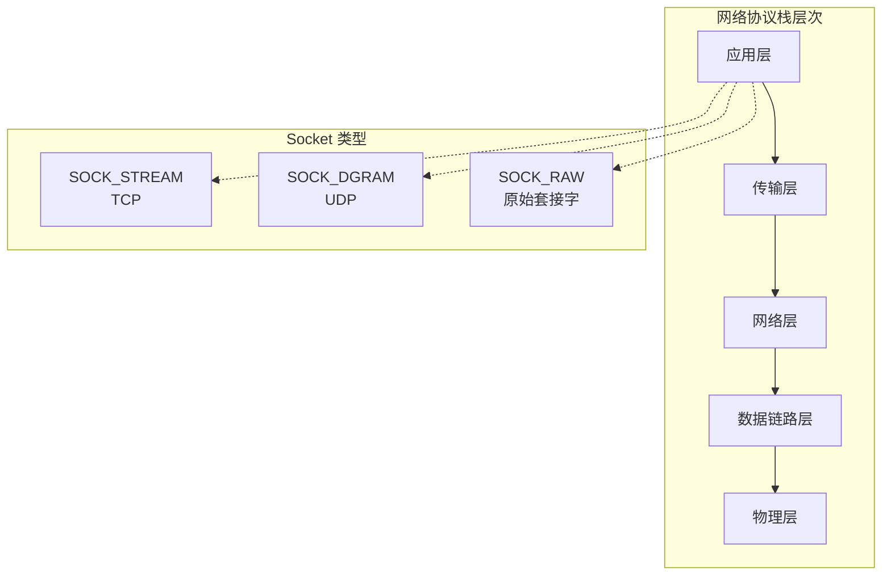
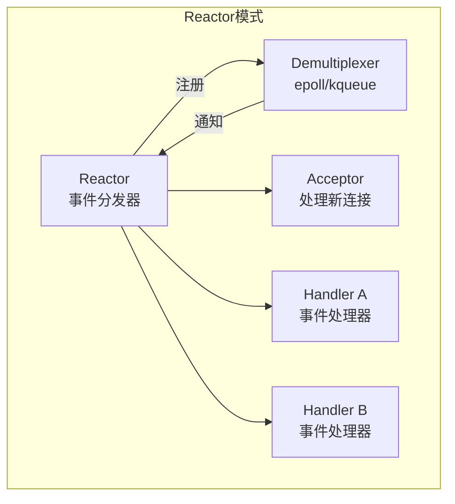
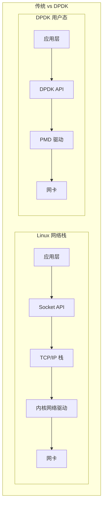
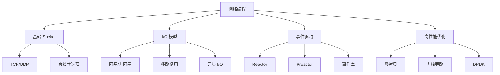

# C 语言网络编程

> **层级定位**: 03_System_Technology_Domains > 15_Network_Programming
> **难度级别**: L3 应用 → L4 分析
> **预估学习时间**: 20-25 小时

---

## 🔗 文档关联

### 前置知识

| 文档 | 关系类型 | 说明 |
|:-----|:---------|:-----|
| [并发编程](../14_Concurrency_Parallelism/README.md) | 核心基础 | 多线程服务器模型 |
| [系统编程](../01_System_Programming/README.md) | 系统基础 | 文件描述符、I/O |
| [内存管理](../../01_Core_Knowledge_System/02_Core_Layer/02_Memory_Management.md) | 核心基础 | 缓冲区管理 |

### 服务器设计模式

| 模式 | 适用场景 | 关联文档 |
|:-----|:---------|:---------|
| 多进程 | 隔离性要求高 | 并发编程、进程管理 |
| 多线程 | 共享内存场景 | 线程同步、锁机制 |
| 事件驱动 | 高并发C10K | epoll/kqueue/Reactor |

### 后续延伸

| 文档 | 关系类型 | 说明 |
|:-----|:---------|:-----|
| [RDMA网络](../13_RDMA_Network/README.md) | 高性能网络 | 零拷贝、内核旁路 |
| [分布式共识](../08_Distributed_Consensus/README.md) | 分布式系统 | 网络分区容错 |
| [DPDK](../01_System_Programming/07_High_Performance_Networking.md) | 高性能 | 数据平面开发 |

## 目录

- [C 语言网络编程](#c-语言网络编程)
  - [🔗 文档关联](#-文档关联)
    - [前置知识](#前置知识)
    - [服务器设计模式](#服务器设计模式)
    - [后续延伸](#后续延伸)
  - [目录](#目录)
  - [概述](#概述)
    - [核心概念对比](#核心概念对比)
  - [Socket API 深入](#socket-api-深入)
    - [基本 Socket 操作](#基本-socket-操作)
    - [完整的 TCP 客户端](#完整的-tcp-客户端)
    - [UDP 编程](#udp-编程)
  - [TCP/UDP 服务器设计模式](#tcpudp-服务器设计模式)
    - [多进程服务器](#多进程服务器)
    - [多线程服务器](#多线程服务器)
    - [预派生进程池](#预派生进程池)
  - [非阻塞 I/O 和 I/O 多路复用](#非阻塞-io-和-io-多路复用)
    - [Select](#select)
    - [Poll](#poll)
    - [Epoll (Linux)](#epoll-linux)
    - [Kqueue (BSD/macOS)](#kqueue-bsdmacos)
  - [事件驱动架构](#事件驱动架构)
    - [Reactor 模式](#reactor-模式)
    - [Proactor 模式](#proactor-模式)
  - [高性能网络库模式](#高性能网络库模式)
    - [基于 libevent 的高性能服务器](#基于-libevent-的高性能服务器)
    - [基于 libuv 的服务器](#基于-libuv-的服务器)
  - [DPDK 简介](#dpdk-简介)
    - [DPDK 基础架构](#dpdk-基础架构)
    - [DPDK 性能优化要点](#dpdk-性能优化要点)
  - [总结](#总结)
  - [深入理解](#深入理解)
    - [核心原理](#核心原理)
    - [实践应用](#实践应用)
    - [最佳实践](#最佳实践)

---

## 概述

网络编程是构建分布式系统的基础。
C 语言通过 BSD Socket API 提供了跨平台的网络编程接口。



### 核心概念对比

| 特性 | TCP | UDP |
|------|-----|-----|
| 连接方式 | 面向连接 | 无连接 |
| 可靠性 | 可靠传输 | 尽力而为 |
| 顺序保证 | 有序 | 无序 |
| 流量控制 | 有 | 无 |
| 拥塞控制 | 有 | 无 |
| 头部开销 | 20 字节 | 8 字节 |
| 适用场景 | 文件传输、HTTP | 视频流、DNS、游戏 |

---

## Socket API 深入

### 基本 Socket 操作

```c
#include <sys/socket.h>
#include <netinet/in.h>
#include <netinet/tcp.h>
#include <arpa/inet.h>
#include <unistd.h>
#include <fcntl.h>
#include <stdio.h>
#include <string.h>
#include <errno.h>

/* 创建监听 Socket */
int create_listen_socket(const char *bind_addr, int port, int backlog) {
    int sockfd = socket(AF_INET, SOCK_STREAM, 0);
    if (sockfd < 0) {
        perror("socket");
        return -1;
    }

    /* 设置地址重用 */
    int reuse = 1;
    if (setsockopt(sockfd, SOL_SOCKET, SO_REUSEADDR,
                   &reuse, sizeof(reuse)) < 0) {
        perror("setsockopt SO_REUSEADDR");
        close(sockfd);
        return -1;
    }

    /* 设置 TCP_NODELAY 禁用 Nagle 算法 */
    int nodelay = 1;
    setsockopt(sockfd, IPPROTO_TCP, TCP_NODELAY, &nodelay, sizeof(nodelay));

    /* 绑定地址 */
    struct sockaddr_in addr;
    memset(&addr, 0, sizeof(addr));
    addr.sin_family = AF_INET;
    addr.sin_port = htons(port);
    inet_pton(AF_INET, bind_addr, &addr.sin_addr);

    if (bind(sockfd, (struct sockaddr *)&addr, sizeof(addr)) < 0) {
        perror("bind");
        close(sockfd);
        return -1;
    }

    if (listen(sockfd, backlog) < 0) {
        perror("listen");
        close(sockfd);
        return -1;
    }

    return sockfd;
}

/* 设置非阻塞模式 */
int set_nonblocking(int fd) {
    int flags = fcntl(fd, F_GETFL, 0);
    if (flags < 0) return -1;
    return fcntl(fd, F_SETFL, flags | O_NONBLOCK);
}

/* 设置 Socket 选项优化 */
void optimize_socket(int sockfd) {
    /* 发送缓冲区 */
    int sndbuf = 256 * 1024;
    setsockopt(sockfd, SOL_SOCKET, SO_SNDBUF, &sndbuf, sizeof(sndbuf));

    /* 接收缓冲区 */
    int rcvbuf = 256 * 1024;
    setsockopt(sockfd, SOL_SOCKET, SO_RCVBUF, &rcvbuf, sizeof(rcvbuf));

    /* 禁用 Nagle 算法，降低延迟 */
    int nodelay = 1;
    setsockopt(sockfd, IPPROTO_TCP, TCP_NODELAY, &nodelay, sizeof(nodelay));

    /* 启用 Keepalive */
    int keepalive = 1;
    setsockopt(sockfd, SOL_SOCKET, SO_KEEPALIVE, &keepalive, sizeof(keepalive));

    #ifdef __linux__
    /* Linux 特有: TCP Keepalive 参数 */
    int keepidle = 60;
    int keepintvl = 10;
    int keepcnt = 3;
    setsockopt(sockfd, IPPROTO_TCP, TCP_KEEPIDLE, &keepidle, sizeof(keepidle));
    setsockopt(sockfd, IPPROTO_TCP, TCP_KEEPINTVL, &keepintvl, sizeof(keepintvl));
    setsockopt(sockfd, IPPROTO_TCP, TCP_KEEPCNT, &keepcnt, sizeof(keepcnt));
    #endif
}
```

### 完整的 TCP 客户端

```c
#include <sys/socket.h>
#include <netinet/in.h>
#include <arpa/inet.h>
#include <unistd.h>
#include <stdio.h>
#include <string.h>

/* 带超时的连接 */
int connect_with_timeout(const char *server_ip, int port, int timeout_sec) {
    int sockfd = socket(AF_INET, SOCK_STREAM, 0);
    if (sockfd < 0) {
        perror("socket");
        return -1;
    }

    /* 设置为非阻塞 */
    set_nonblocking(sockfd);

    struct sockaddr_in addr;
    memset(&addr, 0, sizeof(addr));
    addr.sin_family = AF_INET;
    addr.sin_port = htons(port);
    inet_pton(AF_INET, server_ip, &addr.sin_addr);

    int ret = connect(sockfd, (struct sockaddr *)&addr, sizeof(addr));
    if (ret < 0 && errno == EINPROGRESS) {
        /* 使用 select 等待连接完成 */
        fd_set fdset;
        FD_ZERO(&fdset);
        FD_SET(sockfd, &fdset);

        struct timeval tv;
        tv.tv_sec = timeout_sec;
        tv.tv_usec = 0;

        ret = select(sockfd + 1, NULL, &fdset, NULL, &tv);
        if (ret <= 0) {
            close(sockfd);
            return -1;
        }

        /* 检查连接是否成功 */
        int so_error;
        socklen_t len = sizeof(so_error);
        getsockopt(sockfd, SOL_SOCKET, SO_ERROR, &so_error, &len);
        if (so_error != 0) {
            close(sockfd);
            return -1;
        }
    } else if (ret < 0) {
        close(sockfd);
        return -1;
    }

    return sockfd;
}

/* 可靠的写入 - 处理短写 */
ssize_t write_all(int fd, const void *buf, size_t count) {
    const char *ptr = buf;
    size_t remaining = count;

    while (remaining > 0) {
        ssize_t n = write(fd, ptr, remaining);
        if (n < 0) {
            if (errno == EINTR) continue;
            if (errno == EAGAIN || errno == EWOULDBLOCK) {
                /* 非阻塞模式，等待可写 */
                fd_set fdset;
                FD_ZERO(&fdset);
                FD_SET(fd, &fdset);
                select(fd + 1, NULL, &fdset, NULL, NULL);
                continue;
            }
            return -1;
        }
        ptr += n;
        remaining -= n;
    }

    return count;
}

/* 带长度前缀的消息发送 */
int send_message(int fd, const void *data, uint32_t len) {
    uint32_t net_len = htonl(len);
    if (write_all(fd, &net_len, sizeof(net_len)) < 0) {
        return -1;
    }
    if (write_all(fd, data, len) < 0) {
        return -1;
    }
    return 0;
}

/* 带长度前缀的消息接收 */
void *recv_message(int fd, uint32_t *out_len) {
    uint32_t net_len;
    ssize_t n = recv(fd, &net_len, sizeof(net_len), MSG_WAITALL);
    if (n != sizeof(net_len)) {
        return NULL;
    }

    uint32_t len = ntohl(net_len);
    void *data = malloc(len);
    if (!data) return NULL;

    n = recv(fd, data, len, MSG_WAITALL);
    if (n != (ssize_t)len) {
        free(data);
        return NULL;
    }

    *out_len = len;
    return data;
}
```

### UDP 编程

```c
#include <sys/socket.h>
#include <netinet/in.h>
#include <arpa/inet.h>
#include <unistd.h>
#include <stdio.h>

/* UDP 服务器 */
void udp_server(int port) {
    int sockfd = socket(AF_INET, SOCK_DGRAM, 0);

    struct sockaddr_in addr;
    memset(&addr, 0, sizeof(addr));
    addr.sin_family = AF_INET;
    addr.sin_port = htons(port);
    addr.sin_addr.s_addr = INADDR_ANY;

    bind(sockfd, (struct sockaddr *)&addr, sizeof(addr));

    char buffer[65535];
    struct sockaddr_in client_addr;
    socklen_t addr_len = sizeof(client_addr);

    while (1) {
        ssize_t n = recvfrom(sockfd, buffer, sizeof(buffer), 0,
                            (struct sockaddr *)&client_addr, &addr_len);
        if (n > 0) {
            /* 处理数据 */
            printf("Received %zd bytes from %s:%d\n", n,
                   inet_ntoa(client_addr.sin_addr), ntohs(client_addr.sin_port));

            /* 回复客户端 */
            sendto(sockfd, buffer, n, 0,
                   (struct sockaddr *)&client_addr, addr_len);
        }
    }
}

/* UDP 客户端 - 支持连接 */
void udp_client_connected(const char *server_ip, int port) {
    int sockfd = socket(AF_INET, SOCK_DGRAM, 0);

    struct sockaddr_in server_addr;
    memset(&server_addr, 0, sizeof(server_addr));
    server_addr.sin_family = AF_INET;
    server_addr.sin_port = htons(port);
    inet_pton(AF_INET, server_ip, &server_addr.sin_addr);

    /* 连接到服务器 - 后续使用 send/recv 而非 sendto/recvfrom */
    connect(sockfd, (struct sockaddr *)&server_addr, sizeof(server_addr));

    /* 现在可以使用 read/write */
    write(sockfd, "Hello", 5);

    char buffer[1024];
    ssize_t n = read(sockfd, buffer, sizeof(buffer));
    (void)n;
}
```

---

## TCP/UDP 服务器设计模式

### 多进程服务器

```c
#include <sys/socket.h>
#include <netinet/in.h>
#include <signal.h>
#include <unistd.h>
#include <stdio.h>
#include <sys/wait.h>

/* 处理僵尸进程 */
void sigchld_handler(int sig) {
    (void)sig;
    while (waitpid(-1, NULL, WNOHANG) > 0);
}

/* 多进程服务器 */
void fork_server(int listen_fd) {
    signal(SIGCHLD, sigchld_handler);

    while (1) {
        struct sockaddr_in client_addr;
        socklen_t addr_len = sizeof(client_addr);

        int conn_fd = accept(listen_fd, (struct sockaddr *)&client_addr, &addr_len);
        if (conn_fd < 0) {
            if (errno == EINTR) continue;
            perror("accept");
            continue;
        }

        pid_t pid = fork();
        if (pid == 0) {
            /* 子进程 */
            close(listen_fd);

            /* 处理客户端请求 */
            handle_client(conn_fd);

            close(conn_fd);
            exit(0);
        } else if (pid > 0) {
            /* 父进程 */
            close(conn_fd);
        } else {
            perror("fork");
            close(conn_fd);
        }
    }
}
```

### 多线程服务器

```c
#include <pthread.h>
#include <sys/socket.h>
#include <netinet/in.h>
#include <unistd.h>
#include <stdio.h>

/* 线程参数 */
typedef struct {
    int conn_fd;
    struct sockaddr_in client_addr;
} thread_arg_t;

void *client_thread(void *arg) {
    thread_arg_t *targ = (thread_arg_t *)arg;
    int conn_fd = targ->conn_fd;

    /* 分离线程，自动回收资源 */
    pthread_detach(pthread_self());

    /* 处理客户端 */
    handle_client(conn_fd);

    close(conn_fd);
    free(targ);
    return NULL;
}

void thread_server(int listen_fd) {
    while (1) {
        struct sockaddr_in client_addr;
        socklen_t addr_len = sizeof(client_addr);

        int conn_fd = accept(listen_fd, (struct sockaddr *)&client_addr, &addr_len);
        if (conn_fd < 0) {
            if (errno == EINTR) continue;
            continue;
        }

        thread_arg_t *arg = malloc(sizeof(thread_arg_t));
        arg->conn_fd = conn_fd;
        arg->client_addr = client_addr;

        pthread_t tid;
        if (pthread_create(&tid, NULL, client_thread, arg) != 0) {
            perror("pthread_create");
            free(arg);
            close(conn_fd);
        }
    }
}
```

### 预派生进程池

```c
#include <sys/socket.h>
#include <netinet/in.h>
#include <semaphore.h>
#include <unistd.h>
#include <stdio.h>
#include <sys/mman.h>

/* 共享内存中的计数器 */
typedef struct {
    pthread_mutex_t mutex;
    int count;
} shared_counter_t;

void prefork_server(int listen_fd, int nworkers) {
    /* 创建共享内存 */
    shared_counter_t *counter = mmap(NULL, sizeof(*counter),
                                     PROT_READ | PROT_WRITE,
                                     MAP_SHARED | MAP_ANONYMOUS, -1, 0);

    pthread_mutexattr_t attr;
    pthread_mutexattr_init(&attr);
    pthread_mutexattr_setpshared(&attr, PTHREAD_PROCESS_SHARED);
    pthread_mutex_init(&counter->mutex, &attr);
    counter->count = 0;

    /* 预派生工作进程 */
    for (int i = 0; i < nworkers; i++) {
        pid_t pid = fork();
        if (pid == 0) {
            /* 工作进程 */
            worker_process(listen_fd, counter);
            exit(0);
        }
    }

    /* 父进程等待 */
    while (1) {
        sleep(1);
    }
}

void worker_process(int listen_fd, shared_counter_t *counter) {
    while (1) {
        struct sockaddr_in client_addr;
        socklen_t addr_len = sizeof(client_addr);

        /* 多个进程竞争 accept */
        int conn_fd = accept(listen_fd, (struct sockaddr *)&client_addr, &addr_len);
        if (conn_fd < 0) {
            if (errno == EINTR) continue;
            continue;
        }

        pthread_mutex_lock(&counter->mutex);
        counter->count++;
        printf("Process %d handling connection #%d\n", getpid(), counter->count);
        pthread_mutex_unlock(&counter->mutex);

        handle_client(conn_fd);
        close(conn_fd);
    }
}
```

---

## 非阻塞 I/O 和 I/O 多路复用

### Select

```c
#include <sys/select.h>
#include <sys/socket.h>
#include <unistd.h>
#include <stdio.h>

#define MAX_FD 1024

typedef struct {
    int fd;
    char buffer[4096];
    size_t buffer_len;
} conn_state_t;

void select_server(int listen_fd) {
    conn_state_t connections[MAX_FD] = {0};
    fd_set read_fds, write_fds;
    int max_fd = listen_fd;

    /* 设置非阻塞 */
    set_nonblocking(listen_fd);

    while (1) {
        FD_ZERO(&read_fds);
        FD_ZERO(&write_fds);
        FD_SET(listen_fd, &read_fds);

        /* 添加已连接的文件描述符 */
        for (int i = 0; i <= max_fd; i++) {
            if (connections[i].fd > 0) {
                FD_SET(i, &read_fds);
                if (connections[i].buffer_len > 0) {
                    FD_SET(i, &write_fds);
                }
            }
        }

        struct timeval tv = {1, 0};
        int ret = select(max_fd + 1, &read_fds, &write_fds, NULL, &tv);

        if (ret < 0) {
            perror("select");
            continue;
        }

        /* 新连接 */
        if (FD_ISSET(listen_fd, &read_fds)) {
            struct sockaddr_in client_addr;
            socklen_t addr_len = sizeof(client_addr);
            int conn_fd = accept(listen_fd, (struct sockaddr *)&client_addr, &addr_len);

            if (conn_fd > 0) {
                set_nonblocking(conn_fd);
                connections[conn_fd].fd = conn_fd;
                if (conn_fd > max_fd) max_fd = conn_fd;
                printf("New connection: %d\n", conn_fd);
            }
        }

        /* 处理现有连接 */
        for (int i = 0; i <= max_fd; i++) {
            if (connections[i].fd <= 0) continue;

            /* 可读 */
            if (FD_ISSET(i, &read_fds)) {
                char temp[4096];
                ssize_t n = read(i, temp, sizeof(temp));

                if (n > 0) {
                    /* 存储到缓冲区 */
                    memcpy(connections[i].buffer + connections[i].buffer_len, temp, n);
                    connections[i].buffer_len += n;
                } else if (n == 0 || (n < 0 && errno != EAGAIN)) {
                    /* 连接关闭或错误 */
                    close(i);
                    connections[i].fd = 0;
                    connections[i].buffer_len = 0;
                }
            }

            /* 可写 */
            if (FD_ISSET(i, &write_fds) && connections[i].buffer_len > 0) {
                /* 处理输出 */
                /* ... */
            }
        }
    }
}
```

### Poll

```c
#include <poll.h>
#include <sys/socket.h>
#include <unistd.h>
#include <stdio.h>

#define MAX_CONNECTIONS 10000

typedef struct {
    struct pollfd fds[MAX_CONNECTIONS];
    int nfds;
} poll_server_t;

void poll_server(int listen_fd) {
    poll_server_t server = {0};

    /* 添加监听套接字 */
    server.fds[0].fd = listen_fd;
    server.fds[0].events = POLLIN;
    server.nfds = 1;

    set_nonblocking(listen_fd);

    while (1) {
        int ret = poll(server.fds, server.nfds, -1);
        if (ret < 0) {
            perror("poll");
            continue;
        }

        /* 检查监听套接字 */
        if (server.fds[0].revents & POLLIN) {
            struct sockaddr_in client_addr;
            socklen_t addr_len = sizeof(client_addr);
            int conn_fd = accept(listen_fd, (struct sockaddr *)&client_addr, &addr_len);

            if (conn_fd > 0 && server.nfds < MAX_CONNECTIONS) {
                set_nonblocking(conn_fd);
                server.fds[server.nfds].fd = conn_fd;
                server.fds[server.nfds].events = POLLIN | POLLOUT;
                server.nfds++;
            }
        }

        /* 检查客户端连接 */
        for (int i = 1; i < server.nfds; i++) {
            if (server.fds[i].revents & (POLLERR | POLLHUP | POLLNVAL)) {
                close(server.fds[i].fd);
                /* 移除该 fd */
                server.fds[i] = server.fds[server.nfds - 1];
                server.nfds--;
                i--;
                continue;
            }

            if (server.fds[i].revents & POLLIN) {
                char buffer[4096];
                ssize_t n = read(server.fds[i].fd, buffer, sizeof(buffer));

                if (n <= 0) {
                    close(server.fds[i].fd);
                    server.fds[i] = server.fds[server.nfds - 1];
                    server.nfds--;
                    i--;
                } else {
                    /* 处理数据 */
                }
            }
        }
    }
}
```

### Epoll (Linux)

```c
#include <sys/epoll.h>
#include <sys/socket.h>
#include <fcntl.h>
#include <unistd.h>
#include <stdio.h>
#include <stdlib.h>
#include <errno.h>

#define MAX_EVENTS 1024
#define READ_BUFFER_SIZE 4096

typedef enum {
    CONN_STATE_READING,
    CONN_STATE_WRITING,
    CONN_STATE_CLOSING
} conn_state_enum;

typedef struct connection {
    int fd;
    conn_state_enum state;
    char read_buffer[READ_BUFFER_SIZE];
    size_t read_len;
    char *write_buffer;
    size_t write_len;
    size_t write_pos;
    struct connection *next;
} connection_t;

/* 使用 EPOLLONESHOT 实现线程安全 */
int epoll_server(int listen_fd, int nworkers) {
    int epoll_fd = epoll_create1(EPOLL_CLOEXEC);
    if (epoll_fd < 0) {
        perror("epoll_create1");
        return -1;
    }

    /* 添加监听套接字 */
    struct epoll_event ev;
    ev.events = EPOLLIN;
    ev.data.ptr = NULL;  /* NULL 表示监听套接字 */
    epoll_ctl(epoll_fd, EPOLL_CTL_ADD, listen_fd, &ev);

    struct epoll_event events[MAX_EVENTS];

    while (1) {
        int nfds = epoll_wait(epoll_fd, events, MAX_EVENTS, -1);

        for (int i = 0; i < nfds; i++) {
            if (events[i].data.ptr == NULL) {
                /* 新连接 */
                struct sockaddr_in client_addr;
                socklen_t addr_len = sizeof(client_addr);
                int conn_fd = accept4(listen_fd, (struct sockaddr *)&client_addr,
                                     &addr_len, SOCK_NONBLOCK | SOCK_CLOEXEC);

                if (conn_fd < 0) {
                    if (errno == EAGAIN || errno == EWOULDBLOCK) {
                        break;
                    }
                    continue;
                }

                connection_t *conn = calloc(1, sizeof(connection_t));
                conn->fd = conn_fd;
                conn->state = CONN_STATE_READING;

                ev.events = EPOLLIN | EPOLLET;  /* 边缘触发 */
                ev.data.ptr = conn;
                epoll_ctl(epoll_fd, EPOLL_CTL_ADD, conn_fd, &ev);

            } else {
                connection_t *conn = (connection_t *)events[i].data.ptr;

                if (events[i].events & (EPOLLERR | EPOLLHUP)) {
                    /* 错误或断开 */
                    epoll_ctl(epoll_fd, EPOLL_CTL_DEL, conn->fd, NULL);
                    close(conn->fd);
                    free(conn);
                    continue;
                }

                if (events[i].events & EPOLLIN) {
                    /* 读取数据 - ET 模式需要循环读取 */
                    while (1) {
                        ssize_t n = read(conn->fd,
                                       conn->read_buffer + conn->read_len,
                                       READ_BUFFER_SIZE - conn->read_len);

                        if (n > 0) {
                            conn->read_len += n;
                            /* 处理请求 */
                            if (conn->read_len >= READ_BUFFER_SIZE) {
                                /* 缓冲区满，处理数据 */
                                process_request(conn);
                            }
                        } else if (n < 0) {
                            if (errno == EAGAIN || errno == EWOULDBLOCK) {
                                break;  /* 数据读取完毕 */
                            }
                            /* 错误处理 */
                            conn->state = CONN_STATE_CLOSING;
                            break;
                        } else {
                            /* 连接关闭 */
                            conn->state = CONN_STATE_CLOSING;
                            break;
                        }
                    }
                }

                if (events[i].events & EPOLLOUT) {
                    /* 写入数据 */
                    if (conn->write_buffer && conn->write_pos < conn->write_len) {
                        ssize_t n = write(conn->fd,
                                        conn->write_buffer + conn->write_pos,
                                        conn->write_len - conn->write_pos);

                        if (n > 0) {
                            conn->write_pos += n;
                            if (conn->write_pos >= conn->write_len) {
                                /* 写入完成 */
                                free(conn->write_buffer);
                                conn->write_buffer = NULL;
                                conn->write_len = 0;
                                conn->write_pos = 0;

                                /* 切换回读模式 */
                                ev.events = EPOLLIN | EPOLLET;
                                ev.data.ptr = conn;
                                epoll_ctl(epoll_fd, EPOLL_CTL_MOD, conn->fd, &ev);
                            }
                        }
                    }
                }

                if (conn->state == CONN_STATE_CLOSING) {
                    epoll_ctl(epoll_fd, EPOLL_CTL_DEL, conn->fd, NULL);
                    close(conn->fd);
                    free(conn);
                }
            }
        }
    }

    close(epoll_fd);
    return 0;
}
```

### Kqueue (BSD/macOS)

```c
#include <sys/event.h>
#include <sys/socket.h>
#include <sys/time.h>
#include <unistd.h>
#include <stdio.h>
#include <stdlib.h>
#include <errno.h>

#define MAX_EVENTS 1024

int kqueue_server(int listen_fd) {
    int kq = kqueue();
    if (kq < 0) {
        perror("kqueue");
        return -1;
    }

    /* 添加监听套接字到 kqueue */
    struct kevent change;
    EV_SET(&change, listen_fd, EVFILT_READ, EV_ADD, 0, 0, NULL);

    if (kevent(kq, &change, 1, NULL, 0, NULL) < 0) {
        perror("kevent");
        close(kq);
        return -1;
    }

    struct kevent events[MAX_EVENTS];

    while (1) {
        int nev = kevent(kq, NULL, 0, events, MAX_EVENTS, NULL);

        for (int i = 0; i < nev; i++) {
            if (events[i].flags & EV_ERROR) {
                fprintf(stderr, "EV_ERROR: %s\n", strerror(events[i].data));
                continue;
            }

            if ((int)events[i].ident == listen_fd) {
                /* 新连接 */
                struct sockaddr_in client_addr;
                socklen_t addr_len = sizeof(client_addr);
                int conn_fd = accept(listen_fd, (struct sockaddr *)&client_addr, &addr_len);

                if (conn_fd > 0) {
                    set_nonblocking(conn_fd);

                    connection_t *conn = calloc(1, sizeof(connection_t));
                    conn->fd = conn_fd;

                    EV_SET(&change, conn_fd, EVFILT_READ, EV_ADD, 0, 0, conn);
                    kevent(kq, &change, 1, NULL, 0, NULL);
                }

            } else if (events[i].filter == EVFILT_READ) {
                connection_t *conn = (connection_t *)events[i].udata;

                if (events[i].flags & EV_EOF) {
                    /* 连接关闭 */
                    EV_SET(&change, conn->fd, EVFILT_READ, EV_DELETE, 0, 0, NULL);
                    kevent(kq, &change, 1, NULL, 0, NULL);
                    close(conn->fd);
                    free(conn);
                    continue;
                }

                /* 读取数据 */
                char buffer[4096];
                ssize_t n = read(conn->fd, buffer, sizeof(buffer));

                if (n > 0) {
                    /* 准备响应 - 启用写事件 */
                    EV_SET(&change, conn->fd, EVFILT_WRITE, EV_ADD, 0, 0, conn);
                    kevent(kq, &change, 1, NULL, 0, NULL);
                } else {
                    /* 关闭连接 */
                    EV_SET(&change, conn->fd, EVFILT_READ, EV_DELETE, 0, 0, NULL);
                    kevent(kq, &change, 1, NULL, 0, NULL);
                    close(conn->fd);
                    free(conn);
                }

            } else if (events[i].filter == EVFILT_WRITE) {
                connection_t *conn = (connection_t *)events[i].udata;

                /* 写入响应 */
                const char *response = "HTTP/1.1 200 OK\r\n\r\nHello";
                write(conn->fd, response, strlen(response));

                /* 禁用写事件 */
                EV_SET(&change, conn->fd, EVFILT_WRITE, EV_DELETE, 0, 0, NULL);
                kevent(kq, &change, 1, NULL, 0, NULL);
            }
        }
    }

    close(kq);
    return 0;
}
```

---

## 事件驱动架构

### Reactor 模式



```c
#include <sys/epoll.h>
#include <stdlib.h>
#include <stdio.h>

/* 事件处理器接口 */
typedef struct event_handler event_handler_t;

struct event_handler {
    int fd;
    void (*handle_read)(event_handler_t *self);
    void (*handle_write)(event_handler_t *self);
    void (*handle_error)(event_handler_t *self);
    void *context;
};

/* Reactor */
typedef struct {
    int epoll_fd;
    int running;
} reactor_t;

reactor_t *reactor_create(void) {
    reactor_t *reactor = malloc(sizeof(reactor_t));
    reactor->epoll_fd = epoll_create1(EPOLL_CLOEXEC);
    reactor->running = 0;
    return reactor;
}

void reactor_register(reactor_t *reactor, event_handler_t *handler, uint32_t events) {
    struct epoll_event ev;
    ev.events = events;
    ev.data.ptr = handler;
    epoll_ctl(reactor->epoll_fd, EPOLL_CTL_ADD, handler->fd, &ev);
}

void reactor_modify(reactor_t *reactor, event_handler_t *handler, uint32_t events) {
    struct epoll_event ev;
    ev.events = events;
    ev.data.ptr = handler;
    epoll_ctl(reactor->epoll_fd, EPOLL_CTL_MOD, handler->fd, &ev);
}

void reactor_unregister(reactor_t *reactor, event_handler_t *handler) {
    epoll_ctl(reactor->epoll_fd, EPOLL_CTL_DEL, handler->fd, NULL);
}

void reactor_run(reactor_t *reactor) {
    reactor->running = 1;
    struct epoll_event events[1024];

    while (reactor->running) {
        int nfds = epoll_wait(reactor->epoll_fd, events, 1024, -1);

        for (int i = 0; i < nfds; i++) {
            event_handler_t *handler = (event_handler_t *)events[i].data.ptr;

            if (events[i].events & EPOLLIN && handler->handle_read) {
                handler->handle_read(handler);
            }
            if (events[i].events & EPOLLOUT && handler->handle_write) {
                handler->handle_write(handler);
            }
            if ((events[i].events & EPOLLERR) && handler->handle_error) {
                handler->handle_error(handler);
            }
        }
    }
}

/* Acceptor 处理器 */
typedef struct {
    event_handler_t base;
    reactor_t *reactor;
    void (*new_connection_cb)(reactor_t *, int fd);
} acceptor_t;

void acceptor_handle_read(event_handler_t *self) {
    acceptor_t *acceptor = (acceptor_t *)self;

    struct sockaddr_in client_addr;
    socklen_t addr_len = sizeof(client_addr);
    int conn_fd = accept4(self->fd, (struct sockaddr *)&client_addr,
                         &addr_len, SOCK_NONBLOCK | SOCK_CLOEXEC);

    if (conn_fd > 0 && acceptor->new_connection_cb) {
        acceptor->new_connection_cb(acceptor->reactor, conn_fd);
    }
}

acceptor_t *acceptor_create(reactor_t *reactor, int listen_fd,
                           void (*new_conn_cb)(reactor_t *, int)) {
    acceptor_t *acceptor = malloc(sizeof(acceptor_t));
    acceptor->base.fd = listen_fd;
    acceptor->base.handle_read = acceptor_handle_read;
    acceptor->base.handle_write = NULL;
    acceptor->base.handle_error = NULL;
    acceptor->reactor = reactor;
    acceptor->new_connection_cb = new_conn_cb;

    reactor_register(reactor, &acceptor->base, EPOLLIN);
    return acceptor;
}
```

### Proactor 模式

```c
#include <libaio.h>
#include <sys/socket.h>
#include <stdlib.h>
#include <stdio.h>

/* Linux AIO Proactor 实现 */
typedef struct {
    io_context_t aio_ctx;
    int epoll_fd;
} proactor_t;

typedef struct {
    struct iocb iocb;
    void (*completion_cb)(struct iocb *iocb, long res, long res2);
    void *buffer;
    size_t size;
} aio_operation_t;

proactor_t *proactor_create(int max_events) {
    proactor_t *proactor = malloc(sizeof(proactor_t));

    memset(&proactor->aio_ctx, 0, sizeof(proactor->aio_ctx));
    io_setup(max_events, &proactor->aio_ctx);

    proactor->epoll_fd = epoll_create1(EPOLL_CLOEXEC);

    return proactor;
}

void proactor_submit_read(proactor_t *proactor, int fd, void *buffer, size_t size,
                         off_t offset, void (*cb)(struct iocb *, long, long)) {
    aio_operation_t *op = malloc(sizeof(aio_operation_t));
    op->completion_cb = cb;
    op->buffer = buffer;
    op->size = size;

    io_prep_pread(&op->iocb, fd, buffer, size, offset);
    op->iocb.data = op;

    struct iocb *iocbs[] = {&op->iocb};
    io_submit(proactor->aio_ctx, 1, iocbs);
}

void proactor_run(proactor_t *proactor) {
    struct io_event events[128];

    while (1) {
        struct timespec timeout = {0, 100000000};  /* 100ms */
        int n = io_getevents(proactor->aio_ctx, 1, 128, events, &timeout);

        for (int i = 0; i < n; i++) {
            aio_operation_t *op = (aio_operation_t *)events[i].data;
            if (op->completion_cb) {
                op->completion_cb(&op->iocb, events[i].res, events[i].res2);
            }
            free(op);
        }
    }
}
```

---

## 高性能网络库模式

### 基于 libevent 的高性能服务器

```c
#include <event2/event.h>
#include <event2/bufferevent.h>
#include <event2/listener.h>
#include <sys/socket.h>
#include <string.h>
#include <stdio.h>

/* 连接上下文 */
typedef struct {
    struct bufferevent *bev;
    char read_buffer[4096];
    size_t read_len;
} client_ctx_t;

/* 读取回调 */
void read_cb(struct bufferevent *bev, void *ctx) {
    client_ctx_t *client = (client_ctx_t *)ctx;

    /* 读取数据 */
    size_t n = bufferevent_read(bev, client->read_buffer + client->read_len,
                                sizeof(client->read_buffer) - client->read_len);
    client->read_len += n;

    /* 处理请求 (简单 echo) */
    bufferevent_write(bev, client->read_buffer, client->read_len);
    client->read_len = 0;
}

/* 事件回调 */
void event_cb(struct bufferevent *bev, short events, void *ctx) {
    client_ctx_t *client = (client_ctx_t *)ctx;

    if (events & BEV_EVENT_ERROR) {
        perror("Error from bufferevent");
    }
    if (events & (BEV_EVENT_EOF | BEV_EVENT_ERROR)) {
        bufferevent_free(bev);
        free(client);
    }
}

/* 新连接回调 */
void accept_conn_cb(struct evconnlistener *listener, evutil_socket_t fd,
                   struct sockaddr *address, int socklen, void *ctx) {
    struct event_base *base = evconnlistener_get_base(listener);

    /* 创建 bufferevent */
    struct bufferevent *bev = bufferevent_socket_new(base, fd,
                                                     BEV_OPT_CLOSE_ON_FREE |
                                                     BEV_OPT_THREADSAFE);

    client_ctx_t *client = calloc(1, sizeof(client_ctx_t));
    client->bev = bev;

    bufferevent_setcb(bev, read_cb, NULL, event_cb, client);
    bufferevent_enable(bev, EV_READ | EV_WRITE);
}

/* 创建 libevent 服务器 */
void libevent_server(const char *bind_addr, int port) {
    struct event_base *base = event_base_new();

    struct sockaddr_in addr;
    memset(&addr, 0, sizeof(addr));
    addr.sin_family = AF_INET;
    addr.sin_port = htons(port);
    inet_pton(AF_INET, bind_addr, &addr.sin_addr);

    struct evconnlistener *listener = evconnlistener_new_bind(
        base, accept_conn_cb, NULL,
        LEV_OPT_CLOSE_ON_FREE | LEV_OPT_REUSEABLE | LEV_OPT_THREADSAFE,
        -1,  /* 自动选择 backlog */
        (struct sockaddr *)&addr, sizeof(addr));

    printf("Server started on %s:%d\n", bind_addr, port);
    event_base_dispatch(base);

    evconnlistener_free(listener);
    event_base_free(base);
}
```

### 基于 libuv 的服务器

```c
#include <uv.h>
#include <stdlib.h>
#include <stdio.h>

#define DEFAULT_BACKLOG 128

typedef struct {
    uv_tcp_t handle;
    uv_write_t write_req;
    char buffer[4096];
    size_t buffer_len;
} client_t;

static void alloc_buffer(uv_handle_t *handle, size_t suggested_size, uv_buf_t *buf) {
    client_t *client = (client_t *)handle->data;
    buf->base = client->buffer + client->buffer_len;
    buf->len = sizeof(client->buffer) - client->buffer_len;
}

static void on_write(uv_write_t *req, int status) {
    if (status < 0) {
        fprintf(stderr, "Write error: %s\n", uv_strerror(status));
    }
}

static void on_read(uv_stream_t *client_handle, ssize_t nread, const uv_buf_t *buf) {
    client_t *client = (client_t *)client_handle->data;

    if (nread > 0) {
        client->buffer_len += nread;

        /* 简单 echo */
        uv_buf_t write_buf = uv_buf_init(client->buffer, client->buffer_len);
        uv_write(&client->write_req, client_handle, &write_buf, 1, on_write);
        client->buffer_len = 0;

    } else if (nread < 0) {
        if (nread != UV_EOF) {
            fprintf(stderr, "Read error: %s\n", uv_strerror(nread));
        }
        uv_close((uv_handle_t *)client_handle, NULL);
        free(client);
    }
}

static void on_new_connection(uv_stream_t *server, int status) {
    if (status < 0) {
        fprintf(stderr, "New connection error: %s\n", uv_strerror(status));
        return;
    }

    client_t *client = malloc(sizeof(client_t));
    uv_tcp_init(server->loop, &client->handle);
    client->handle.data = client;
    client->buffer_len = 0;

    if (uv_accept(server, (uv_stream_t *)&client->handle) == 0) {
        uv_read_start((uv_stream_t *)&client->handle, alloc_buffer, on_read);
    } else {
        uv_close((uv_handle_t *)&client->handle, NULL);
        free(client);
    }
}

int libuv_server(const char *bind_addr, int port) {
    uv_loop_t *loop = uv_default_loop();

    uv_tcp_t server;
    uv_tcp_init(loop, &server);

    struct sockaddr_in addr;
    uv_ip4_addr(bind_addr, port, &addr);

    uv_tcp_bind(&server, (const struct sockaddr *)&addr, 0);

    int r = uv_listen((uv_stream_t *)&server, DEFAULT_BACKLOG, on_new_connection);
    if (r) {
        fprintf(stderr, "Listen error: %s\n", uv_strerror(r));
        return 1;
    }

    printf("Server listening on %s:%d\n", bind_addr, port);
    uv_run(loop, UV_RUN_DEFAULT);

    uv_loop_close(loop);
    return 0;
}
```

---

## DPDK 简介

DPDK (Data Plane Development Kit) 是一组用于快速数据包处理的库和驱动程序。



### DPDK 基础架构

```c
#include <rte_eal.h>
#include <rte_ethdev.h>
#include <rte_mbuf.h>
#include <rte_ring.h>
#include <stdio.h>

#define RX_RING_SIZE 1024
#define TX_RING_SIZE 1024
#define NUM_MBUFS 8191
#define MBUF_CACHE_SIZE 250
#define BURST_SIZE 32

/* DPDK 初始化 */
int dpdk_init(int argc, char **argv) {
    /* 初始化 EAL (Environment Abstraction Layer) */
    int ret = rte_eal_init(argc, argv);
    if (ret < 0) {
        rte_exit(EXIT_FAILURE, "Error with EAL initialization\n");
    }

    /* 检查可用端口 */
    uint16_t nb_ports = rte_eth_dev_count_avail();
    printf("Number of available ports: %u\n", nb_ports);

    if (nb_ports == 0) {
        rte_exit(EXIT_FAILURE, "No Ethernet ports available\n");
    }

    return ret;
}

/* 端口初始化 */
int port_init(uint16_t port, struct rte_mempool *mbuf_pool) {
    const uint16_t rx_rings = 1, tx_rings = 1;
    int retval;

    /* 获取端口配置 */
    struct rte_eth_conf port_conf = {0};
    uint16_t nb_rxd = RX_RING_SIZE;
    uint16_t nb_txd = TX_RING_SIZE;

    /* 配置设备 */
    retval = rte_eth_dev_configure(port, rx_rings, tx_rings, &port_conf);
    if (retval != 0) {
        return retval;
    }

    /* 调整 RX/TX 描述符数量 */
    retval = rte_eth_dev_adjust_nb_rx_tx_desc(port, &nb_rxd, &nb_txd);
    if (retval != 0) {
        return retval;
    }

    /* 设置 RX 队列 */
    for (uint16_t q = 0; q < rx_rings; q++) {
        retval = rte_eth_rx_queue_setup(port, q, nb_rxd,
                                       rte_eth_dev_socket_id(port), NULL, mbuf_pool);
        if (retval < 0) {
            return retval;
        }
    }

    /* 设置 TX 队列 */
    for (uint16_t q = 0; q < tx_rings; q++) {
        retval = rte_eth_tx_queue_setup(port, q, nb_txd,
                                       rte_eth_dev_socket_id(port), NULL);
        if (retval < 0) {
            return retval;
        }
    }

    /* 启动设备 */
    retval = rte_eth_dev_start(port);
    if (retval < 0) {
        return retval;
    }

    /* 启用混杂模式 */
    rte_eth_promiscuous_enable(port);

    return 0;
}

/* 数据包处理主循环 */
int lcore_main(void *arg) {
    uint16_t port_id = *(uint16_t *)arg;

    printf("Core %u processing packets on port %u\n",
           rte_lcore_id(), port_id);

    struct rte_mbuf *bufs[BURST_SIZE];

    while (1) {
        /* 批量接收 */
        const uint16_t nb_rx = rte_eth_rx_burst(port_id, 0, bufs, BURST_SIZE);

        if (nb_rx == 0) {
            continue;
        }

        /* 处理数据包 */
        for (uint16_t i = 0; i < nb_rx; i++) {
            struct rte_mbuf *mbuf = bufs[i];

            /* 获取以太网头 */
            struct rte_ether_hdr *eth_hdr = rte_pktmbuf_mtod(mbuf, struct rte_ether_hdr *);

            /* 简单的包处理逻辑 */
            uint16_t ether_type = rte_be_to_cpu_16(eth_hdr->ether_type);

            if (ether_type == RTE_ETHER_TYPE_IPV4) {
                /* 处理 IPv4 包 */
                process_ipv4_packet(mbuf);
            }
        }

        /* 批量发送 (这里简单 echo) */
        const uint16_t nb_tx = rte_eth_tx_burst(port_id, 0, bufs, nb_rx);

        /* 释放未发送的 mbuf */
        if (nb_tx < nb_rx) {
            for (uint16_t i = nb_tx; i < nb_rx; i++) {
                rte_pktmbuf_free(bufs[i]);
            }
        }
    }

    return 0;
}

/* 完整示例 */
int main(int argc, char **argv) {
    /* 初始化 EAL */
    int ret = rte_eal_init(argc, argv);
    if (ret < 0) {
        rte_exit(EXIT_FAILURE, "EAL init failed\n");
    }

    argc -= ret;
    argv += ret;

    /* 创建 mbuf 池 */
    struct rte_mempool *mbuf_pool = rte_pktmbuf_pool_create("MBUF_POOL",
                                                           NUM_MBUFS * 2,
                                                           MBUF_CACHE_SIZE, 0,
                                                           RTE_MBUF_DEFAULT_BUF_SIZE,
                                                           rte_socket_id());
    if (!mbuf_pool) {
        rte_exit(EXIT_FAILURE, "Cannot create mbuf pool\n");
    }

    /* 初始化端口 */
    uint16_t port_id = 0;
    if (port_init(port_id, mbuf_pool) != 0) {
        rte_exit(EXIT_FAILURE, "Cannot init port %u\n", port_id);
    }

    /* 启动 lcore */
    uint16_t port_arg = port_id;
    rte_eal_remote_launch(lcore_main, &port_arg, rte_get_next_lcore(-1, 1, 0));

    rte_eal_mp_wait_lcore();

    return 0;
}
```

### DPDK 性能优化要点

| 优化技术 | 描述 | 效果 |
|----------|------|------|
| 大页内存 | 使用 1GB/2MB 大页减少 TLB miss | 减少内存访问延迟 |
| 轮询模式 | 轮询而非中断接收数据包 | 降低中断开销 |
| 批量处理 | 批量收发数据包 | 提高缓存利用率 |
| NUMA 亲和 | 将内存和线程绑定到同一 NUMA 节点 | 减少跨节点访问 |
| 无锁队列 | 使用 rte_ring 进行核心间通信 | 避免锁竞争 |

```c
/* NUMA 亲和配置 */
void setup_numa_affinity(uint16_t port_id, unsigned lcore_id) {
    int socket_id = rte_eth_dev_socket_id(port_id);

    /* 将线程绑定到 NUMA 节点 */
    cpu_set_t cpuset;
    CPU_ZERO(&cpuset);
    CPU_SET(lcore_id, &cpuset);
    pthread_setaffinity_np(pthread_self(), sizeof(cpuset), &cpuset);

    printf("Port %u on socket %d, lcore %u\n", port_id, socket_id, lcore_id);
}
```

---

## 总结

C 语言网络编程涵盖了从基础 Socket API 到高性能数据包处理的完整技术栈：



**关键选择指南：**

- **简单应用**: 阻塞 I/O + 多线程/多进程
- **高并发**: epoll/kqueue + Reactor 模式
- **跨平台**: libuv / libevent
- **极致性能**: DPDK 用户态网络栈


---

## 深入理解

### 核心原理

深入探讨技术原理和实现细节。

### 实践应用

- 应用场景1
- 应用场景2
- 应用场景3

### 最佳实践

1. 理解基础概念
2. 掌握核心机制
3. 应用到实际项目

---

> **最后更新**: 2026-03-21
> **维护者**: AI Code Review
