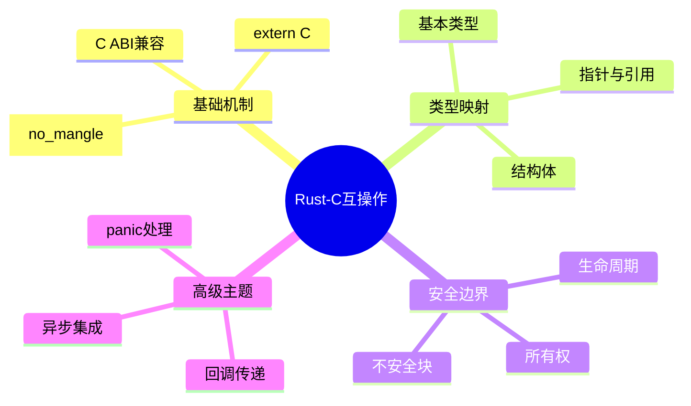

# Rust与C互操作基础

> **层级定位**: 03 System Technology Domains / 10 Rust Interop
> **对应标准**: C ABI, Rust FFI
> **难度级别**: L4 分析
> **预估学习时间**: 6-8 小时

---

## 📋 本节概要

| 属性 | 内容 |
|:-----|:-----|
| **核心概念** | C ABI, FFI边界, 内存安全, 不透明指针 |
| **前置知识** | C结构布局, Rust基础 |
| **后续延伸** | 复杂类型传递, 回调函数, 异步互操作 |
| **权威来源** | Rust FFI指南, The Rustonomicon |

---

## 🧠 知识结构思维导图



---

## 📖 核心实现

### 1. C暴露给Rust

```c
// === mathlib.h ===
#ifndef MATHLIB_H
#define MATHLIB_H

#include <stdint.h>
#include <stdbool.h>

#ifdef __cplusplus
extern "C" {
#endif

// 基本类型映射测试
typedef struct {
    int32_t x;
    int32_t y;
} Point;

// 暴露函数
double compute_distance(const Point *p1, const Point *p2);

// 迭代器模式（不透明指针）
typedef struct Iterator Iterator;
Iterator* iterator_create(const int32_t *data, size_t len);
bool iterator_next(Iterator *it, int32_t *out_val);
void iterator_destroy(Iterator *it);

// 回调注册
typedef void (*DataCallback)(int32_t data, void *user_data);
void register_callback(DataCallback cb, void *user_data);

#ifdef __cplusplus
}
#endif

#endif
```

```rust
// === src/lib.rs ===
// 绑定声明
#[repr(C)]
#[derive(Debug, Copy, Clone)]
pub struct Point {
    pub x: i32,
    pub y: i32,
}

extern "C" {
    fn compute_distance(p1: *const Point, p2: *const Point) -> f64;
}

// 安全包装
pub fn distance(p1: &Point, p2: &Point) -> f64 {
    unsafe { compute_distance(p1, p2) }
}
```

### 2. 不透明指针模式

```c
// === opaque.c ===
#include <stdlib.h>
#include <string.h>

// 隐藏实现细节
typedef struct {
    int *data;
    size_t len;
    size_t pos;
} InternalIterator;

// 构造函数
void* iterator_create(const int *data, size_t len) {
    InternalIterator *it = malloc(sizeof(InternalIterator));
    if (!it) return NULL;

    it->data = malloc(len * sizeof(int));
    if (!it->data) {
        free(it);
        return NULL;
    }
    memcpy(it->data, data, len * sizeof(int));
    it->len = len;
    it->pos = 0;

    return it;
}

bool iterator_next(void *handle, int *out) {
    InternalIterator *it = handle;
    if (it->pos >= it->len) return false;
    *out = it->data[it->pos++];
    return true;
}

void iterator_destroy(void *handle) {
    InternalIterator *it = handle;
    free(it->data);
    free(it);
}
```

```rust
// Rust绑定
pub struct Iterator {
    ptr: *mut c_void,
}

unsafe impl Send for Iterator {}
unsafe impl Sync for Iterator {}

impl Iterator {
    pub fn new(data: &[i32]) -> Option<Self> {
        let ptr = unsafe {
            iterator_create(data.as_ptr(), data.len())
        };
        if ptr.is_null() {
            None
        } else {
            Some(Self { ptr })
        }
    }
}

impl Drop for Iterator {
    fn drop(&mut self) {
        unsafe { iterator_destroy(self.ptr) }
    }
}

impl std::iter::Iterator for Iterator {
    type Item = i32;

    fn next(&mut self) -> Option<Self::Item> {
        let mut val: i32 = 0;
        if unsafe { iterator_next(self.ptr, &mut val) } {
            Some(val)
        } else {
            None
        }
    }
}

extern "C" {
    fn iterator_create(data: *const i32, len: usize) -> *mut c_void;
    fn iterator_next(it: *mut c_void, out: *mut i32) -> bool;
    fn iterator_destroy(it: *mut c_void);
}
```

### 3. Rust暴露给C

```rust
// === rust_export.rs ===
use std::ffi::{CStr, CString};
use std::os::raw::{c_char, c_int};

// 必须no_mangle以保持C可见的符号名
#[no_mangle]
pub extern "C" fn rust_process_data(input: *const c_char) -> *mut c_char {
    // C字符串转Rust
    let c_str = unsafe {
        if input.is_null() {
            return std::ptr::null_mut();
        }
        CStr::from_ptr(input)
    };

    let input_str = match c_str.to_str() {
        Ok(s) => s,
        Err(_) => return std::ptr::null_mut(),
    };

    // Rust处理
    let result = input_str.to_uppercase();

    // 转回C字符串（调用方负责释放）
    match CString::new(result) {
        Ok(cstring) => cstring.into_raw(),
        Err(_) => std::ptr::null_mut(),
    }
}

// 释放Rust分配的字符串
#[no_mangle]
pub extern "C" fn rust_string_free(s: *mut c_char) {
    if !s.is_null() {
        unsafe {
            let _ = CString::from_raw(s);  // 回收所有权
        }
    }
}

// 安全的数据处理结构
pub struct DataProcessor {
    buffer: Vec<u8>,
    processed: usize,
}

#[no_mangle]
pub extern "C" fn processor_create() -> *mut DataProcessor {
    let processor = Box::new(DataProcessor {
        buffer: Vec::with_capacity(1024),
        processed: 0,
    });
    Box::into_raw(processor)
}

#[no_mangle]
pub extern "C" fn processor_feed(
    handle: *mut DataProcessor,
    data: *const u8,
    len: usize
) -> c_int {
    if handle.is_null() || data.is_null() {
        return -1;
    }

    let processor = unsafe { &mut *handle };
    let slice = unsafe { std::slice::from_raw_parts(data, len) };

    processor.buffer.extend_from_slice(slice);
    processor.processed += len;

    0  // 成功
}

#[no_mangle]
pub extern "C" fn processor_destroy(handle: *mut DataProcessor) {
    if !handle.is_null() {
        unsafe {
            let _ = Box::from_raw(handle);
        }
    }
}
```

```c
// === rust_client.c ===
#include <stdio.h>
#include <stdlib.h>

// Rust暴露的函数
extern char* rust_process_data(const char* input);
extern void rust_string_free(char* s);

extern void* processor_create(void);
extern int processor_feed(void* handle, const uint8_t* data, size_t len);
extern void processor_destroy(void* handle);

int main() {
    // 测试字符串处理
    const char* input = "hello, rust!";
    char* result = rust_process_data(input);
    printf("Result: %s\n", result);
    rust_string_free(result);  // 必须释放！

    // 测试处理器
    void* proc = processor_create();
    uint8_t data[] = {1, 2, 3, 4, 5};
    processor_feed(proc, data, sizeof(data));
    processor_destroy(proc);

    return 0;
}
```

### 4. 回调处理

```rust
// === callback.rs ===
use std::ffi::c_void;
use std::sync::Mutex;

// 回调类型定义
pub type CCallback = unsafe extern "C" fn(data: i32, user_data: *mut c_void);

// 线程安全的回调注册
lazy_static::lazy_static! {
    static ref CALLBACKS: Mutex<Vec<(CCallback, *mut c_void)>> =
        Mutex::new(Vec::new());
}

#[no_mangle]
pub extern "C" fn register_callback(cb: CCallback, user_data: *mut c_void) {
    let mut callbacks = CALLBACKS.lock().unwrap();
    callbacks.push((cb, user_data));
}

// 触发回调（从Rust侧调用C回调）
pub fn trigger_callbacks(data: i32) {
    let callbacks = CALLBACKS.lock().unwrap();
    for (cb, user_data) in callbacks.iter() {
        unsafe {
            cb(data, *user_data);
        }
    }
}

// 闭包包装为C回调（使用trampoline）
pub struct CallbackTrampoline {
    closure: Box<dyn FnMut(i32)>,
}

impl CallbackTrampoline {
    pub fn new<F: FnMut(i32) + 'static>(f: F) -> Self {
        Self {
            closure: Box::new(f),
        }
    }

    extern "C" fn call(&mut self, data: i32) {
        (self.closure)(data);
    }
}
```

---

## ⚠️ 常见陷阱

### 陷阱 FFI01: 生命周期不匹配

```rust
// ❌ 危险：返回悬垂引用
pub extern "C" fn get_slice() -> *const u8 {
    let data = vec![1, 2, 3];
    data.as_ptr()  // data在这里被释放！
}

// ✅ 使用Box或静态存储
static STATIC_DATA: [u8; 3] = [1, 2, 3];
pub extern "C" fn get_static() -> *const u8 {
    STATIC_DATA.as_ptr()
}
```

### 陷阱 FFI02: 未定义行为

```rust
// ❌ panic跨越FFI边界会导致UB
pub extern "C" fn may_panic() {
    panic!("oops");  // 不要这样做！
}

// ✅ 使用catch_unwind
pub extern "C" fn safe_export() -> i32 {
    std::panic::catch_unwind(|| {
        // 可能panic的代码
        risky_operation()
    }).unwrap_or(-1)
}
```

---

## ✅ 质量验收清单

- [x] C ABI基础
- [x] 不透明指针模式
- [x] Rust暴露给C
- [x] 回调处理
- [x] 安全边界

---

> **更新记录**
>
> - 2025-03-09: 初版创建


---

## 深入理解

### 核心原理

深入探讨技术原理和实现细节。

### 实践应用

- 应用场景1
- 应用场景2
- 应用场景3

### 最佳实践

1. 理解基础概念
2. 掌握核心机制
3. 应用到实际项目

---

> **最后更新**: 2026-03-21
> **维护者**: AI Code Review
