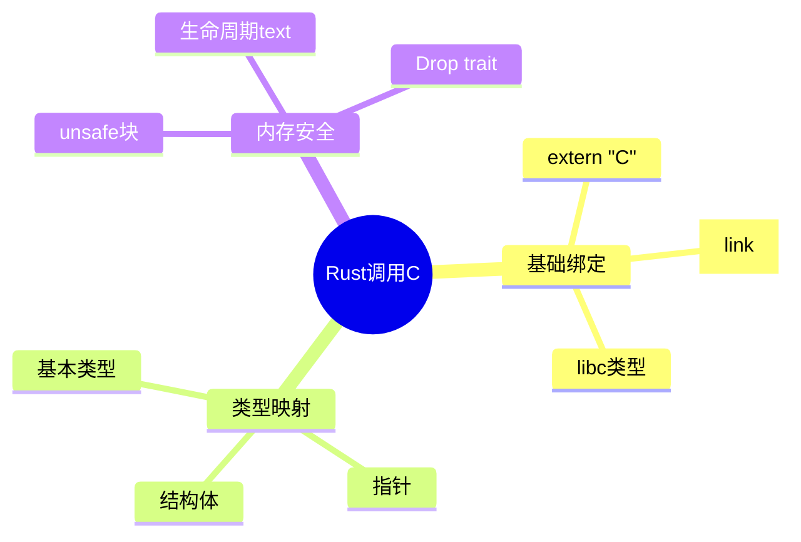

# Rust调用C代码（FFI基础）

> **层级定位**: 03 System Technology Domains / 11 Rust Interoperability
> **对应标准**: C99, Rust FFI, libc crate
> **难度级别**: L3 熟练
> **预估学习时间**: 4-6 小时

---

## 📋 本节概要

| 属性 | 内容 |
|:-----|:-----|
| **核心概念** | FFI、ABI兼容、内存安全、指针转换 |
| **前置知识** | C语言基础、Rust所有权、 unsafe Rust |
| **后续延伸** | bindgen、cbindgen、复杂类型传递 |
| **权威来源** | Rust FFI Nomicon, libc crate docs |

---


---

## 📑 目录

- [Rust调用C代码（FFI基础）](#rust调用c代码ffi基础)
  - [📋 本节概要](#-本节概要)
  - [📑 目录](#-目录)
  - [🧠 知识结构思维导图](#-知识结构思维导图)
  - [1. 概述](#1-概述)
  - [2. C库准备](#2-c库准备)
    - [2.1 示例C库](#21-示例c库)
    - [2.2 C库实现](#22-c库实现)
  - [3. Rust FFI绑定](#3-rust-ffi绑定)
    - [3.1 Cargo配置](#31-cargo配置)
    - [3.2 build.rs编译C代码](#32-buildrs编译c代码)
    - [3.3 基础FFI声明](#33-基础ffi声明)
  - [4. 结构体与指针](#4-结构体与指针)
    - [4.1 repr(C)结构体](#41-reprc结构体)
    - [4.2 不透明指针模式](#42-不透明指针模式)
  - [5. 回调函数](#5-回调函数)
    - [5.1 将Rust函数传递给C](#51-将rust函数传递给c)
  - [⚠️ 常见陷阱](#️-常见陷阱)
  - [✅ 质量验收清单](#-质量验收清单)
  - [📚 参考与延伸阅读](#-参考与延伸阅读)


---

## 🧠 知识结构思维导图



---

## 1. 概述

Rust通过FFI（Foreign Function Interface）支持与C代码互操作。由于C没有所有权和生命周期概念，Rust调用C代码需要使用`unsafe`块，并手动保证内存安全。

**核心原则：**

- 使用`extern "C"`声明C函数
- 类型必须ABI兼容
- C分配的内存必须由C释放
- 指针操作需包裹在`unsafe`块中

---

## 2. C库准备

### 2.1 示例C库

```c
/* mathlib.h - C库头文件 */
#ifndef MATHLIB_H
#define MATHLIB_H

#include <stdint.h>
#include <stdbool.h>

#ifdef __cplusplus
extern "C" {
#endif

/* 基本数学运算 */
int32_t add(int32_t a, int32_t b);
int32_t subtract(int32_t a, int32_t b);

/* 内存分配与释放 */
typedef struct {
    double x;
    double y;
} Point;

Point* point_new(double x, double y);
void point_free(Point *p);
double point_distance(const Point *a, const Point *b);

/* 回调函数类型 */
typedef int32_t (*OperationFunc)(int32_t, int32_t);
int32_t apply_operation(int32_t a, int32_t b, OperationFunc op);

/* 字符串处理 */
const char* get_version(void);
char* reverse_string(const char *input);
void free_string(char *s);

/* 数组操作 */
typedef struct {
    int32_t *data;
    size_t len;
    size_t capacity;
} IntArray;

IntArray* array_new(size_t capacity);
void array_push(IntArray *arr, int32_t value);
int32_t array_get(const IntArray *arr, size_t index);
void array_free(IntArray *arr);

#ifdef __cplusplus
}
#endif

#endif /* MATHLIB_H */
```

### 2.2 C库实现

```c
/* mathlib.c */
#include "mathlib.h"
#include <stdlib.h>
#include <string.h>
#include <math.h>

int32_t add(int32_t a, int32_t b) {
    return a + b;
}

int32_t subtract(int32_t a, int32_t b) {
    return a - b;
}

Point* point_new(double x, double y) {
    Point *p = malloc(sizeof(Point));
    p->x = x;
    p->y = y;
    return p;
}

void point_free(Point *p) {
    free(p);
}

double point_distance(const Point *a, const Point *b) {
    double dx = a->x - b->x;
    double dy = a->y - b->y;
    return sqrt(dx * dx + dy * dy);
}

const char* get_version(void) {
    return "mathlib v1.0.0";
}

char* reverse_string(const char *input) {
    size_t len = strlen(input);
    char *result = malloc(len + 1);
    for (size_t i = 0; i < len; i++) {
        result[i] = input[len - 1 - i];
    }
    result[len] = '\0';
    return result;
}

void free_string(char *s) {
    free(s);
}

IntArray* array_new(size_t capacity) {
    IntArray *arr = malloc(sizeof(IntArray));
    arr->data = malloc(capacity * sizeof(int32_t));
    arr->len = 0;
    arr->capacity = capacity;
    return arr;
}

void array_push(IntArray *arr, int32_t value) {
    if (arr->len < arr->capacity) {
        arr->data[arr->len++] = value;
    }
}

int32_t array_get(const IntArray *arr, size_t index) {
    return arr->data[index];
}

void array_free(IntArray *arr) {
    free(arr->data);
    free(arr);
}
```

---

## 3. Rust FFI绑定

### 3.1 Cargo配置

```toml
# Cargo.toml
[package]
name = "mathlib-rs"
version = "0.1.0"
edition = "2021"

[dependencies]
libc = "0.2"

[build-dependencies]
cc = "1.0"
```

### 3.2 build.rs编译C代码

```rust
// build.rs
fn main() {
    // 编译C库
    cc::Build::new()
        .file("src/mathlib.c")
        .include("src")
        .compile("mathlib");

    // 链接库
    println!("cargo:rustc-link-lib=static=mathlib");
}
```

### 3.3 基础FFI声明

```rust
// src/lib.rs
use std::ffi::{CStr, CString, c_char, c_double, c_int};
use std::os::raw::{c_void, c_long};

// 链接C库
#[link(name = "mathlib")]
extern "C" {
    // 基本函数
    fn add(a: c_int, b: c_int) -> c_int;
    fn subtract(a: c_int, b: c_int) -> c_int;

    // 字符串
    fn get_version() -> *const c_char;
    fn reverse_string(input: *const c_char) -> *mut c_char;
    fn free_string(s: *mut c_char);
}

// 安全的Rust包装函数
pub fn safe_add(a: i32, b: i32) -> i32 {
    unsafe { add(a, b) }
}

pub fn safe_subtract(a: i32, b: i32) -> i32 {
    unsafe { subtract(a, b) }
}

pub fn get_library_version() -> String {
    unsafe {
        let ptr = get_version();
        // CStr::from_ptr安全地将C字符串转换为Rust &str
        CStr::from_ptr(ptr)
            .to_string_lossy()
            .into_owned()
    }
}

pub fn reverse(s: &str) -> Result<String, std::ffi::NulError> {
    // 转换为C字符串
    let c_str = CString::new(s)?;

    unsafe {
        // 调用C函数
        let result_ptr = reverse_string(c_str.as_ptr());

        // 转换为Rust字符串
        let result = CStr::from_ptr(result_ptr)
            .to_string_lossy()
            .into_owned();

        // 释放C分配的内存！
        free_string(result_ptr);

        Ok(result)
    }
}
```

---

## 4. 结构体与指针

### 4.1 repr(C)结构体

```rust
use std::ops::Drop;

// 必须与C结构体布局一致
#[repr(C)]
pub struct Point {
    pub x: f64,
    pub y: f64,
}

// C函数声明
#[link(name = "mathlib")]
extern "C" {
    fn point_new(x: c_double, y: c_double) -> *mut Point;
    fn point_free(p: *mut Point);
    fn point_distance(a: *const Point, b: *const Point) -> c_double;
}

// RAII包装器
pub struct PointHandle {
    ptr: *mut Point,
}

impl PointHandle {
    pub fn new(x: f64, y: f64) -> Option<Self> {
        let ptr = unsafe { point_new(x, y) };
        if ptr.is_null() {
            None
        } else {
            Some(PointHandle { ptr })
        }
    }

    pub fn as_ref(&self) -> &Point {
        // 安全：我们知道ptr有效
        unsafe { &*self.ptr }
    }

    pub fn distance_to(&self, other: &PointHandle) -> f64 {
        unsafe { point_distance(self.ptr, other.ptr) }
    }
}

// 确保C内存正确释放
impl Drop for PointHandle {
    fn drop(&mut self) {
        if !self.ptr.is_null() {
            unsafe { point_free(self.ptr) };
        }
    }
}

// 实现Clone需要深拷贝
impl Clone for PointHandle {
    fn clone(&self) -> Self {
        let p = self.as_ref();
        PointHandle::new(p.x, p.y).expect("Failed to clone Point")
    }
}
```

### 4.2 不透明指针模式

```rust
// 当C结构体对Rust不可见时使用
pub enum IntArray {}  // 不透明类型

#[link(name = "mathlib")]
extern "C" {
    fn array_new(capacity: usize) -> *mut IntArray;
    fn array_push(arr: *mut IntArray, value: c_int);
    fn array_get(arr: *const IntArray, index: usize) -> c_int;
    fn array_free(arr: *mut IntArray);
}

pub struct IntArrayHandle {
    ptr: *mut IntArray,
}

impl IntArrayHandle {
    pub fn with_capacity(capacity: usize) -> Option<Self> {
        let ptr = unsafe { array_new(capacity) };
        if ptr.is_null() {
            None
        } else {
            Some(IntArrayHandle { ptr })
        }
    }

    pub fn push(&mut self, value: i32) {
        unsafe { array_push(self.ptr, value) }
    }

    pub fn get(&self, index: usize) -> i32 {
        unsafe { array_get(self.ptr, index) }
    }
}

impl Drop for IntArrayHandle {
    fn drop(&mut self) {
        if !self.ptr.is_null() {
            unsafe { array_free(self.ptr) };
        }
    }
}
```

---

## 5. 回调函数

### 5.1 将Rust函数传递给C

```rust
use libc::c_int;

// C回调类型
type OperationFunc = extern "C" fn(c_int, c_int) -> c_int;

#[link(name = "mathlib")]
extern "C" {
    fn apply_operation(a: c_int, b: c_int, op: OperationFunc) -> c_int;
}

// Rust回调函数 - 必须使用extern "C"调用约定
extern "C" fn rust_multiply(a: c_int, b: c_int) -> c_int {
    a * b
}

extern "C" fn rust_max(a: c_int, b: c_int) -> c_int {
    if a > b { a } else { b }
}

pub fn apply_math_operation(a: i32, b: i32, op: &str) -> i32 {
    let op_fn: OperationFunc = match op {
        "multiply" => rust_multiply,
        "max" => rust_max,
        _ => return 0,
    };

    unsafe { apply_operation(a, b, op_fn) }
}
```

---

## ⚠️ 常见陷阱

| 陷阱 | 后果 | 解决方案 |
|:-----|:-----|:---------|
| 忘记#[repr(C)] | 内存布局不匹配 | 所有跨FFI结构体使用repr(C) |
| 释放C内存用Rust | 未定义行为 | C分配的内存必须由C释放 |
| 忽略C字符串null结尾 | 缓冲区溢出 | 使用CStr/CString处理 |
| 忘记unsafe块 | 编译错误 | 所有FFI调用包裹在unsafe中 |
| 裸指针生命周期 | 悬垂指针 | 使用RAII包装器管理 |
| panic跨越FFI边界 | 未定义行为 | 使用catch_unwind包裹 |

---

## ✅ 质量验收清单

- [x] extern "C"函数声明
- [x] #[link]库链接
- [x] 基本类型映射
- [x] #[repr(C)]结构体
- [x] 内存安全包装器（RAII）
- [x] 字符串转换（CString/CStr）
- [x] 回调函数传递
- [x] build.rs自动编译

---

## 📚 参考与延伸阅读

| 资源 | 说明 |
|:-----|:-----|
| [Rust FFI Nomicon](https://doc.rust-lang.org/nomicon/ffi.html) | 官方FFI指南 |
| [libc crate](https://docs.rs/libc/) | C类型定义库 |
| [bindgen](https://github.com/rust-lang/rust-bindgen) | 自动生成FFI绑定 |
| [cbindgen](https://github.com/mozilla/cbindgen) | C头文件生成器 |

---

> **更新记录**
>
> - 2025-03-09: 初版创建，包含基本FFI、结构体、回调函数
