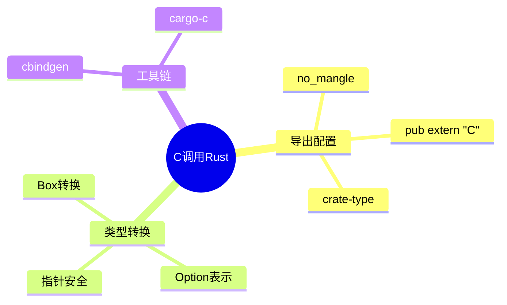

# C调用Rust代码（导出C ABI兼容接口）

> **层级定位**: 03 System Technology Domains / 11 Rust Interoperability
> **对应标准**: C99, Rust FFI, cbindgen
> **难度级别**: L3 熟练
> **预估学习时间**: 4-6 小时

---

## 📋 本节概要

| 属性 | 内容 |
|:-----|:-----|
| **核心概念** | no_mangle, panic处理, cbindgen, C ABI导出 |
| **前置知识** | Rust FFI, C头文件, 动态/静态库 |
| **后续延伸** | 异步导出、复杂生命周期管理、COM接口 |
| **权威来源** | Rust FFI Nomicon, cbindgen文档 |

---


---

## 📑 目录

- [C调用Rust代码（导出C ABI兼容接口）](#c调用rust代码导出c-abi兼容接口)
  - [📋 本节概要](#-本节概要)
  - [📑 目录](#-目录)
  - [🧠 知识结构思维导图](#-知识结构思维导图)
  - [1. 概述](#1-概述)
  - [2. Cargo项目配置](#2-cargo项目配置)
    - [2.1 Cargo.toml配置](#21-cargotoml配置)
    - [2.2 cbindgen配置](#22-cbindgen配置)
  - [3. 基础导出](#3-基础导出)
    - [3.1 简单函数导出](#31-简单函数导出)
    - [3.2 结构体导出](#32-结构体导出)
  - [4. 堆分配与所有权](#4-堆分配与所有权)
    - [4.1 Box转换](#41-box转换)
    - [4.2 Vec与C数组交互](#42-vec与c数组交互)
  - [5. C头文件生成](#5-c头文件生成)
    - [5.1 使用cbindgen生成头文件](#51-使用cbindgen生成头文件)
    - [5.2 生成的C头文件示例](#52-生成的c头文件示例)
  - [6. C使用示例](#6-c使用示例)
    - [6.1 使用Rust库的C程序](#61-使用rust库的c程序)
    - [6.2 编译与链接](#62-编译与链接)
  - [⚠️ 常见陷阱](#️-常见陷阱)
  - [✅ 质量验收清单](#-质量验收清单)
  - [📚 参考与延伸阅读](#-参考与延伸阅读)


---

## 🧠 知识结构思维导图



---

## 1. 概述

将Rust代码导出供C使用需要：

1. 使用C ABI调用约定（`extern "C"`）
2. 禁用名称修饰（`#[no_mangle]`）
3. 处理panic（防止跨越FFI边界）
4. 管理内存所有权边界

---

## 2. Cargo项目配置

### 2.1 Cargo.toml配置

```toml
# Cargo.toml
[package]
name = "rust_math"
version = "0.1.0"
edition = "2021"

[lib]
# 生成静态库和动态库
crate-type = ["staticlib", "cdylib"]

[dependencies]
libc = "0.2"

[profile.release]
# 优化库大小
opt-level = "z"
lto = true
panic = "abort"
```

### 2.2 cbindgen配置

```toml
# cbindgen.toml
language = "C"
include_guard = "RUST_MATH_H"
sys_includes = ["stdint.h", "stdbool.h"]

[export]
# 导出所有pub extern "C"函数
prefix = "rust_"

[fn]
# 函数命名风格
rename_types = "PascalCase"

[parse]
parse_deps = false
```

---

## 3. 基础导出

### 3.1 简单函数导出

```rust
// src/lib.rs
use std::ffi::{CStr, CString, c_char, c_double, c_int, c_void};
use std::panic;

// 初始化panic处理
#[no_mangle]
pub extern "C" fn rust_math_init() {
    // 设置panic hook防止跨越FFI边界
    panic::set_hook(Box::new(|info| {
        eprintln!("Rust panic: {}", info);
        std::process::abort();  // 安全地终止程序
    }));
}

// 基本数学函数
#[no_mangle]
pub extern "C" fn rust_add(a: c_int, b: c_int) -> c_int {
    // catch_unwind防止panic传播到C
    panic::catch_unwind(|| {
        a + b
    }).unwrap_or(0)
}

#[no_mangle]
pub extern "C" fn rust_factorial(n: c_int) -> c_int {
    panic::catch_unwind(|| {
        (1..=n).fold(1, |acc, x| acc * x)
    }).unwrap_or(0)
}

// 返回字符串（静态生命周期）
#[no_mangle]
pub extern "C" fn rust_version() -> *const c_char {
    static VERSION: &[u8] = b"rust_math v1.0.0\0";
    VERSION.as_ptr() as *const c_char
}
```

### 3.2 结构体导出

```rust
// Rust结构体必须repr(C)才能被C使用
#[repr(C)]
pub struct RustPoint {
    pub x: c_double,
    pub y: c_double,
}

#[repr(C)]
pub struct RustCircle {
    pub center: RustPoint,
    pub radius: c_double,
}

// 构造函数
#[no_mangle]
pub extern "C" fn rust_point_new(x: c_double, y: c_double) -> RustPoint {
    RustPoint { x, y }
}

// 方法 - 传递指针
#[no_mangle]
pub extern "C" fn rust_point_distance(a: *const RustPoint, b: *const RustPoint) -> c_double {
    if a.is_null() || b.is_null() {
        return 0.0;
    }

    panic::catch_unwind(|| {
        let a = unsafe { &*a };
        let b = unsafe { &*b };
        let dx = a.x - b.x;
        let dy = a.y - b.y;
        (dx * dx + dy * dy).sqrt()
    }).unwrap_or(0.0)
}

// 圆面积计算
#[no_mangle]
pub extern "C" fn rust_circle_area(c: *const RustCircle) -> c_double {
    if c.is_null() {
        return 0.0;
    }

    panic::catch_unwind(|| {
        let c = unsafe { &*c };
        std::f64::consts::PI * c.radius * c.radius
    }).unwrap_or(0.0)
}
```

---

## 4. 堆分配与所有权

### 4.1 Box转换

```rust
// 不透明指针类型 - C看不到内部结构
pub enum RustStringBuilder {}

// 实际实现
struct StringBuilder {
    buffer: String,
}

// 创建（Box转换为裸指针）
#[no_mangle]
pub extern "C" fn rust_string_builder_new() -> *mut RustStringBuilder {
    let builder = Box::new(StringBuilder {
        buffer: String::new(),
    });
    Box::into_raw(builder) as *mut RustStringBuilder
}

// 追加
#[no_mangle]
pub extern "C" fn rust_string_builder_append(
    builder: *mut RustStringBuilder,
    s: *const c_char
) {
    if builder.is_null() || s.is_null() {
        return;
    }

    let _ = panic::catch_unwind(|| {
        let builder = unsafe { &mut *(builder as *mut StringBuilder) };
        let c_str = unsafe { CStr::from_ptr(s) };
        if let Ok(s) = c_str.to_str() {
            builder.buffer.push_str(s);
        }
    });
}

// 获取结果（C需要释放返回的字符串）
#[no_mangle]
pub extern "C" fn rust_string_builder_get(builder: *const RustStringBuilder) -> *mut c_char {
    if builder.is_null() {
        return std::ptr::null_mut();
    }

    panic::catch_unwind(|| {
        let builder = unsafe { &*(builder as *const StringBuilder) };
        match CString::new(builder.buffer.clone()) {
            Ok(c_str) => c_str.into_raw(),
            Err(_) => std::ptr::null_mut(),
        }
    }).unwrap_or(std::ptr::null_mut())
}

// 释放StringBuilder
#[no_mangle]
pub extern "C" fn rust_string_builder_free(builder: *mut RustStringBuilder) {
    if !builder.is_null() {
        let _ = panic::catch_unwind(|| {
            let _ = unsafe {
                Box::from_raw(builder as *mut StringBuilder)
            };
        });
    }
}

// 辅助函数：释放Rust分配的字符串
#[no_mangle]
pub extern "C" fn rust_string_free(s: *mut c_char) {
    if !s.is_null() {
        let _ = panic::catch_unwind(|| {
            unsafe { CString::from_raw(s) };
        });
    }
}
```

### 4.2 Vec与C数组交互

```rust
// 整数向量包装
pub enum RustIntVector {}

struct IntVector {
    data: Vec<i32>,
}

#[no_mangle]
pub extern "C" fn rust_int_vector_new() -> *mut RustIntVector {
    let vec = Box::new(IntVector { data: Vec::new() });
    Box::into_raw(vec) as *mut RustIntVector
}

#[no_mangle]
pub extern "C" fn rust_int_vector_push(vec: *mut RustIntVector, value: c_int) {
    if vec.is_null() { return; }

    let _ = panic::catch_unwind(|| {
        let vec = unsafe { &mut *(vec as *mut IntVector) };
        vec.data.push(value);
    });
}

// 返回数组指针和长度（C只能读，不能写/释放）
#[no_mangle]
pub extern "C" fn rust_int_vector_as_slice(
    vec: *const RustIntVector,
    len: *mut usize
) -> *const c_int {
    if vec.is_null() || len.is_null() {
        return std::ptr::null();
    }

    panic::catch_unwind(|| {
        let vec = unsafe { &*(vec as *const IntVector) };
        unsafe { *len = vec.data.len() };
        vec.data.as_ptr() as *const c_int
    }).unwrap_or(std::ptr::null())
}

// 复制数据到C分配的缓冲区
#[no_mangle]
pub extern "C" fn rust_int_vector_copy(
    vec: *const RustIntVector,
    out_buffer: *mut c_int,
    max_len: usize
) -> usize {
    if vec.is_null() || out_buffer.is_null() {
        return 0;
    }

    panic::catch_unwind(|| {
        let vec = unsafe { &*(vec as *const IntVector) };
        let to_copy = vec.data.len().min(max_len);

        unsafe {
            std::ptr::copy_nonoverlapping(
                vec.data.as_ptr(),
                out_buffer as *mut i32,
                to_copy
            );
        }
        to_copy
    }).unwrap_or(0)
}

#[no_mangle]
pub extern "C" fn rust_int_vector_free(vec: *mut RustIntVector) {
    if !vec.is_null() {
        let _ = panic::catch_unwind(|| {
            let _ = unsafe {
                Box::from_raw(vec as *mut IntVector)
            };
        });
    }
}
```

---

## 5. C头文件生成

### 5.1 使用cbindgen生成头文件

```bash
# 安装cbindgen
cargo install cbindgen

# 生成头文件
cbindgen --config cbindgen.toml --crate rust_math --output rust_math.h
```

### 5.2 生成的C头文件示例

```c
/* rust_math.h - 由cbindgen自动生成 */
#ifndef RUST_MATH_H
#define RUST_MATH_H

#include <stdint.h>
#include <stdbool.h>

#ifdef __cplusplus
extern "C" {
#endif

/* 初始化 */
void rust_math_init(void);

/* 基本数学 */
int32_t rust_add(int32_t a, int32_t b);
int32_t rust_factorial(int32_t n);
const char* rust_version(void);

/* 几何类型 */
typedef struct {
    double x;
    double y;
} RustPoint;

typedef struct {
    RustPoint center;
    double radius;
} RustCircle;

RustPoint rust_point_new(double x, double y);
double rust_point_distance(const RustPoint *a, const RustPoint *b);
double rust_circle_area(const RustCircle *c);

/* 不透明类型 */
typedef struct RustStringBuilder RustStringBuilder;
typedef struct RustIntVector RustIntVector;

/* StringBuilder */
RustStringBuilder* rust_string_builder_new(void);
void rust_string_builder_append(RustStringBuilder *builder, const char *s);
char* rust_string_builder_get(const RustStringBuilder *builder);
void rust_string_builder_free(RustStringBuilder *builder);
void rust_string_free(char *s);

/* IntVector */
RustIntVector* rust_int_vector_new(void);
void rust_int_vector_push(RustIntVector *vec, int32_t value);
const int32_t* rust_int_vector_as_slice(const RustIntVector *vec, size_t *len);
size_t rust_int_vector_copy(const RustIntVector *vec, int32_t *out, size_t max);
void rust_int_vector_free(RustIntVector *vec);

#ifdef __cplusplus
}
#endif

#endif /* RUST_MATH_H */
```

---

## 6. C使用示例

### 6.1 使用Rust库的C程序

```c
/* main.c - 使用Rust库的C程序 */
#include <stdio.h>
#include "rust_math.h"

int main() {
    /* 初始化 */
    rust_math_init();

    /* 基本数学 */
    printf("2 + 3 = %d\n", rust_add(2, 3));
    printf("5! = %d\n", rust_factorial(5));
    printf("Version: %s\n", rust_version());

    /* 几何计算 */
    RustPoint a = rust_point_new(0.0, 0.0);
    RustPoint b = rust_point_new(3.0, 4.0);
    printf("Distance: %.2f\n", rust_point_distance(&a, &b));

    /* 使用StringBuilder */
    RustStringBuilder *sb = rust_string_builder_new();
    rust_string_builder_append(sb, "Hello");
    rust_string_builder_append(sb, " ");
    rust_string_builder_append(sb, "World!");

    char *result = rust_string_builder_get(sb);
    printf("Result: %s\n", result);
    rust_string_free(result);  /* 重要：释放Rust分配的内存 */
    rust_string_builder_free(sb);

    /* 使用IntVector */
    RustIntVector *vec = rust_int_vector_new();
    for (int i = 0; i < 10; i++) {
        rust_int_vector_push(vec, i * i);
    }

    size_t len;
    const int32_t *data = rust_int_vector_as_slice(vec, &len);
    printf("Vector (%zu elements): ", len);
    for (size_t i = 0; i < len; i++) {
        printf("%d ", data[i]);
    }
    printf("\n");

    rust_int_vector_free(vec);

    return 0;
}
```

### 6.2 编译与链接

```bash
# 编译Rust库
cargo build --release

# 编译并链接C程序（静态库）
gcc -o main main.c target/release/librust_math.a -lpthread -ldl -lm

# 或使用动态库
gcc -o main main.c -L target/release -lrust_math -Wl,-rpath,target/release
```

---

## ⚠️ 常见陷阱

| 陷阱 | 后果 | 解决方案 |
|:-----|:-----|:---------|
| 忘记no_mangle | 链接失败（符号找不到） | 所有导出函数加#[no_mangle] |
| panic跨越边界 | 未定义行为 | 使用catch_unwind包裹 |
| 返回局部变量指针 | 悬垂指针 | 返回Box::into_raw或静态变量 |
| C释放Rust内存 | 未定义行为 | 提供专门的释放函数 |
| 未处理null指针 | 段错误 | 检查所有输入指针 |
| &T和&mut T别名 | 未定义行为 | 不允许多个可变引用 |

---

## ✅ 质量验收清单

- [x] extern "C"函数导出
- [x] #[no_mangle]属性
- [x] #[repr(C)]结构体
- [x] panic边界处理
- [x] Box内存管理
- [x] 不透明指针类型
- [x] cbindgen头文件生成
- [x] C示例程序

---

## 📚 参考与延伸阅读

| 资源 | 说明 |
|:-----|:-----|
| [Rust FFI Nomicon](https://doc.rust-lang.org/nomicon/ffi.html) | 官方FFI指南 |
| [cbindgen](https://github.com/mozilla/cbindgen) | C头文件生成器 |
| [cargo-c](https://github.com/lu-zero/cargo-c) | 构建C兼容库 |
| [safer_ffi](https://github.com/getditto/safer_ffi) | 安全FFI框架 |

---

> **更新记录**
>
> - 2025-03-09: 初版创建，包含基本导出、结构体、Box转换、cbindgen


---

## 深入理解

### 核心原理

深入探讨技术原理和实现细节。

### 实践应用

- 应用场景1
- 应用场景2
- 应用场景3

### 最佳实践

1. 理解基础概念
2. 掌握核心机制
3. 应用到实际项目

---

> **最后更新**: 2026-03-21  
> **维护者**: AI Code Review
