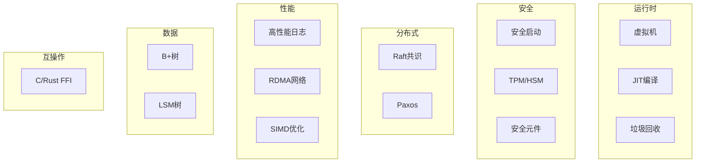

---

## 🔗 全面知识关联体系

### 【全局层】知识库导航

| 维度 | 目标文档 | 导航作用 |
|:-----|:---------|:---------|
| **总索引** | [../00_GLOBAL_INDEX.md](../00_GLOBAL_INDEX.md) | 完整知识图谱入口，全局视角 |
| **本模块** | [../README.md](../README.md) | 模块总览与目录导航 |
| **学习路径** | [../06_Thinking_Representation/06_Learning_Paths/README.md](../06_Thinking_Representation/06_Learning_Paths/README.md) | 阶段化学习路线规划 |
| **概念映射** | [../06_Thinking_Representation/05_Concept_Mappings/README.md](../06_Thinking_Representation/05_Concept_Mappings/README.md) | 核心概念等价关系图 |

### 【阶段层】学习定位

**当前模块**: 系统技术领域
**难度等级**: L3-L5
**前置依赖**: 核心知识体系
**后续延伸**: 工业场景应用

```
学习阶段金字塔:
    L6 专家层 [形式验证、编译器]
    L5 高级层 [并发、系统编程] ⬅️ 可能在此
    L4 进阶层 [指针、内存管理]
    L3 基础层 [函数、结构体]
    L2 入门层 [语法、数据类型]
    L1 零基础 [环境搭建]
```

### 【层次层】纵向知识链

| 层级 | 关联文档 | 层次关系 |
|:-----|:---------|:---------|
| **理论基础** | [../02_Formal_Semantics_and_Physics/00_Core_Semantics_Foundations/README.md](../02_Formal_Semantics_and_Physics/00_Core_Semantics_Foundations/README.md) | 语义学理论基础 |
| **核心机制** | [../01_Core_Knowledge_System/02_Core_Layer/README.md](../01_Core_Knowledge_System/02_Core_Layer/README.md) | C语言核心机制 |
| **标准接口** | [../01_Core_Knowledge_System/04_Standard_Library_Layer/README.md](../01_Core_Knowledge_System/04_Standard_Library_Layer/README.md) | 标准库API |
| **系统实现** | [../03_System_Technology_Domains/README.md](../03_System_Technology_Domains/README.md) | 系统级实现 |

### 【局部层】横向关联网

| 关联类型 | 目标文档 | 关联说明 |
|:---------|:---------|:---------|
| **技术扩展** | [../03_System_Technology_Domains/14_Concurrency_Parallelism/README.md](../03_System_Technology_Domains/14_Concurrency_Parallelism/README.md) | 并发编程技术 |
| **安全规范** | [../01_Core_Knowledge_System/09_Safety_Standards/MISRA_C_2023/README.md](../01_Core_Knowledge_System/09_Safety_Standards/MISRA_C_2023/README.md) | 安全编码标准 |
| **工具支持** | [../07_Modern_Toolchain/README.md](../07_Modern_Toolchain/README.md) | 现代开发工具链 |
| **实践案例** | [../04_Industrial_Scenarios/README.md](../04_Industrial_Scenarios/README.md) | 工业实践场景 |

### 【总体层】知识体系架构

```
┌─────────────────────────────────────────────────────────────┐
│                     总体知识体系架构                          │
├─────────────────────────────────────────────────────────────┤
│  01 Core Knowledge          → 核心概念与机制                  │
│  02 Formal Semantics        → 理论与物理基础                  │
│  03 System Technology       → 系统级技术领域                  │
│  04 Industrial Scenarios    → 工业应用场景                    │
│  05 Deep Structure          → 深层结构与元物理                │
│  06 Thinking Representation → 思维表征与学习                  │
│  07 Modern Toolchain        → 现代工具链                      │
└─────────────────────────────────────────────────────────────┘
```

### 【决策层】学习路径选择

| 目标 | 推荐路径 | 关键文档 |
|:-----|:---------|:---------|
| **系统学习** | 01 → 02 → 03 → 04 | 按顺序阅读各模块 |
| **问题导向** | 06决策树 → 相关模块 | [决策树目录](../06_Thinking_Representation/01_Decision_Trees/README.md) |
| **项目驱动** | 04案例 → 所需知识 | [工业场景](../04_Industrial_Scenarios/README.md) |
| **深入研究** | 02形式语义 → 11CompCert | [形式语义](../02_Formal_Semantics_and_Physics/README.md) |

---

# 03 System Technology Domains - 系统技术领域

> **对应标准**: DPDK, SPDK, Linux Kernel, Rust FFI
> **完成度**: 80% | **预估学习时间**: 100-120小时

---

## 目录结构

### 01_Virtual_Machine_Interpreter - 虚拟机解释器

运行时系统实现技术。

| 文件 | 主题 | 难度 | 参考来源 |
|:-----|:-----|:----:|:---------|
| [01_Bytecode_VM.md](./01_Virtual_Machine_Interpreter/01_Bytecode_VM.md) | 字节码VM | L4 | Lua VM, Python VM |
| [02_Register_VM.md](./01_Virtual_Machine_Interpreter/02_Register_VM.md) | 寄存器VM | L4 | Dalvik VM, BEAM |
| [03_JIT_Compilation.md](./01_Virtual_Machine_Interpreter/03_JIT_Compilation.md) | JIT编译 | L5 | V8, Java HotSpot ✅ |
| [04_Garbage_Collection.md](04_Garbage_Collection.md) | 垃圾回收 | L5 | Go GC, .NET GC ✅ |

**前置知识**: [01_Core_Knowledge_System](../01_Core_Knowledge_System/README.md)
**关联**: [05_Deep_Structure_MetaPhysics/04_Self_Modifying_Code](../05_Deep_Structure_MetaPhysics/12_Self_Modifying_Code/README.md)

---

### 02_Regex_Engine - 正则表达式引擎

模式匹配算法实现。

| 文件 | 主题 | 难度 | 参考来源 |
|:-----|:-----|:----:|:---------|
| [01_Thompson_NFA.md](./02_Regex_Engine/01_Thompson_NFA.md) | Thompson NFA | L4 | Thompson's Construction |
| [02_Pike_VM.md](./02_Regex_Engine/02_Pike_VM.md) | Pike VM | L4 | Russ Cox Articles |
| [03_JIT_Regex.md](03_JIT_Regex.md) | JIT正则 | L5 | PCRE, RE2 ✅ |

---

### 03_Computer_Vision - 计算机视觉

嵌入式视觉处理。

| 文件 | 主题 | 难度 | 参考来源 |
|:-----|:-----|:----:|:---------|
| [01_V4L2_Capture.md](./03_Computer_Vision/01_V4L2_Capture.md) | V4L2采集 | L4 | Linux V4L2 API |
| [02_Optical_Flow.md](./03_Computer_Vision/02_Optical_Flow.md) | 光流算法 | L5 | OpenCV Implementation |
| [03_Edge_Detection.md](03_Edge_Detection.md) | 边缘检测 | L4 | Canny, Sobel ✅ |

---

### 04_Video_Codec - 视频编解码

多媒体处理技术。

| 文件 | 主题 | 难度 | 参考来源 |
|:-----|:-----|:----:|:---------|
| [01_H264_Decoding.md](./04_Video_Codec/01_H264_Decoding.md) | H.264解码 | L5 | ITU-T H.264 |
| [02_Custom_IO.md](./04_Video_Codec/02_Custom_IO.md) | 自定义IO | L4 | FFmpeg API |
| [03_Hardware_Acceleration.md](03_Hardware_Acceleration.md) | 硬件加速 | L5 | VA-API, VDPAU ✅ |

---

### 05_Wireless_Protocol - 无线协议

物联网通信协议。

| 文件 | 主题 | 难度 | 参考来源 |
|:-----|:-----|:----:|:---------|
| [01_BLE_GATT.md](./05_Wireless_Protocol/01_BLE_GATT.md) | BLE GATT | L4 | Bluetooth Core Spec |
| [02_LoRa_SX1276.md](./05_Wireless_Protocol/02_LoRa_SX1276.md) | LoRa驱动 | L4 | Semtech SX1276 |
| [03_Zigbee_Stack.md](03_Zigbee_Stack.md) | Zigbee协议 | L5 | Zigbee Alliance ✅ |

---

### 06_Security_Boot - 安全启动

可信启动链实现。

| 文件 | 主题 | 难度 | 参考来源 |
|:-----|:-----|:----:|:---------|
| [01_ARM_Trusted_Firmware.md](./06_Security_Boot/01_ARM_Trusted_Firmware.md) | ARM Trusted Firmware | L5 | ARM TF-A |
| [02_Secure_Boot_Chain.md](./06_Security_Boot/02_Secure_Boot_Chain.md) | 安全启动链 | L5 | U-Boot, UEFI |
| [03_Measured_Boot.md](03_Measured_Boot.md) | 度量启动 | L5 | TPM 2.0 Spec ✅ |

---

### 07_Hardware_Security - 硬件安全

可信平台模块应用。

| 文件 | 主题 | 难度 | 参考来源 |
|:-----|:-----|:----:|:---------|
| [01_TPM2_TSS.md](./07_Hardware_Security/01_TPM2_TSS.md) | TPM2 TSS | L5 | TCG TPM2 Spec |
| [02_Key_Sealing.md](./07_Hardware_Security/02_Key_Sealing.md) | 密钥密封 | L5 | TPM 2.0 Key Sealing |
| [03_HSM_Integration.md](03_HSM_Integration.md) | HSM集成 | L5 | PKCS#11 ✅ |

---

### 08_Distributed_Consensus - 分布式共识

一致性算法实现。

| 文件 | 主题 | 难度 | 参考来源 |
|:-----|:-----|:----:|:---------|
| [01_Raft_Core.md](./08_Distributed_Consensus/01_Raft_Core.md) | Raft核心 | L4 | Raft Paper, etcd |
| [02_Leader_Election.md](./08_Distributed_Consensus/02_Leader_Election.md) | Leader选举 | L5 | Raft Leader Election |
| [03_Multi_Raft.md](03_Multi_Raft.md) | Multi-Raft | L5 | TiKV Paper ✅ |

---

### 09_High_Performance_Log - 高性能日志

无锁日志系统。

| 文件 | 主题 | 难度 | 参考来源 |
|:-----|:-----|:----:|:---------|
| [01_LockFree_Ring_Log.md](./09_High_Performance_Log/01_LockFree_Ring_Log.md) | 无锁环形日志 | L4 | DPDK Ring, LMAX |
| [02_Structured_Binary_Log.md](./09_High_Performance_Log/02_Structured_Binary_Log.md) | 结构化二进制日志 | L4 | protobuf |
| [03_Lockless_Ring_Buffer_SPSC_MPMC.md](./09_High_Performance_Log/03_Lockless_Ring_Buffer_SPSC_MPMC.md) | 无锁环形缓冲(SPSC/MPMC) | L4 | DPDK Ring, LMAX |

---

### 16_Rust_Interoperability - Rust互操作

跨语言FFI。

| 文件 | 主题 | 难度 | 参考来源 |
|:-----|:-----|:----:|:---------|
| [01_C_ABI_Basics.md](./16_Rust_Interoperability/01_C_ABI_Basics.md) | C ABI基础 | L4 | Rust FFI Guide |
| [02_Cbindgen_Usage.md](02_Cbindgen_Usage.md) | cbindgen | L4 | cbindgen Docs ✅ |
| [03_Unsafe_Rust_Patterns.md](03_Unsafe_Rust_Patterns.md) | Unsafe模式 | L5 | The Rustonomicon ✅ |

---

### 11_In_Memory_Database - 内存数据库

高性能数据结构。

| 文件 | 主题 | 难度 | 参考来源 |
|:-----|:-----|:----:|:---------|
| [01_B_Tree_Index.md](./11_In_Memory_Database/01_B_Tree_Index.md) | B+树索引 | L4 | SQLite, LMDB |
| [02_LSM_Tree.md](./11_In_Memory_Database/02_LSM_Tree.md) | LSM树 | L5 | LevelDB, RocksDB |
| [03_Hash_Index.md](./11_In_Memory_Database/03_Hash_Index.md) | 哈希索引 | L4 | Fast Path Cache ✅ |

---

### 13_RDMA_Network - RDMA网络

高性能网络编程。

| 文件 | 主题 | 难度 | 参考来源 |
|:-----|:-----|:----:|:---------|
| [01_Verbs_API.md](./13_RDMA_Network/01_Verbs_API.md) | Verbs API | L5 | IBTA Spec |
| [01_Verbs_API_Detailed.md](./13_RDMA_Network/01_Verbs_API_Detailed.md) | Verbs API 详细版 | L5 | IBTA Spec |
| [02_One_Sided_RDMA.md](./13_RDMA_Network/02_One_Sided_RDMA.md) | 单边RDMA | L5 | Mellanox Docs |
| [03_RDMA_Connection.md](03_RDMA_Connection.md) | 连接管理 | L5 | RDMA CM ✅ |

---

### 14_Concurrency_Parallelism - 并发与并行

POSIX线程与同步机制。

| 文件 | 主题 | 难度 | 参考来源 |
|:-----|:-----|:----:|:---------|
| [01_POSIX_Threads.md](./14_Concurrency_Parallelism/01_POSIX_Threads.md) | POSIX线程 | L3-L5 | POSIX.1-2008 |

---

### 15_Network_Programming - 网络编程

Socket编程与网络I/O。

| 文件 | 主题 | 难度 | 参考来源 |
|:-----|:-----|:----:|:---------|
| [01_Socket_Programming.md](./15_Network_Programming/01_Socket_Programming.md) | Socket编程 | L3-L5 | BSD Socket API |

---

## 技术关联图



---

## 关联知识库

| 目标 | 路径 |
|:-----|:-----|
| 核心基础 | [01_Core_Knowledge_System](../01_Core_Knowledge_System/README.md) |
| 形式语义 | [02_Formal_Semantics_and_Physics](../02_Formal_Semantics_and_Physics/README.md) |
| 工业应用 | [04_Industrial_Scenarios](../04_Industrial_Scenarios/README.md) |
| 理论基础 | [05_Deep_Structure_MetaPhysics](../05_Deep_Structure_MetaPhysics/README.md) |

---

## 参考资源

### 开源项目

- **DPDK** - Data Plane Development Kit
- **SPDK** - Storage Performance Development Kit
- **Linux Kernel** - 内核源码
- **etcd** - Raft实现参考
- **SQLite** - 嵌入式数据库
- **LevelDB/RocksDB** - LSM树实现

### 标准规范

- **InfiniBand Architecture Spec** - RDMA标准
- **TCG TPM2 Spec** - 可信计算
- **Bluetooth Core Specification** - BLE
- **IEEE 802.15.4** - Zigbee底层

---

> **最后更新**: 2025-03-09
>
> **新增内容**:
>
> - 14_Concurrency_Parallelism: POSIX线程编程
> - 15_Network_Programming: Socket网络编程

---

> **返回导航**: [知识库总览](../README.md) | [上层目录](..)


---

## 深入理解

### 核心原理

深入探讨技术原理和实现细节。

### 实践应用

- 应用场景1
- 应用场景2
- 应用场景3

### 最佳实践

1. 理解基础概念
2. 掌握核心机制
3. 应用到实际项目

---

> **最后更新**: 2026-03-21
> **维护者**: AI Code Review
