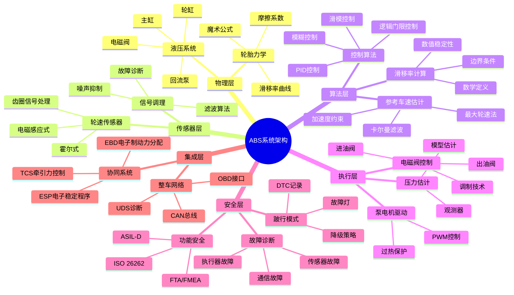
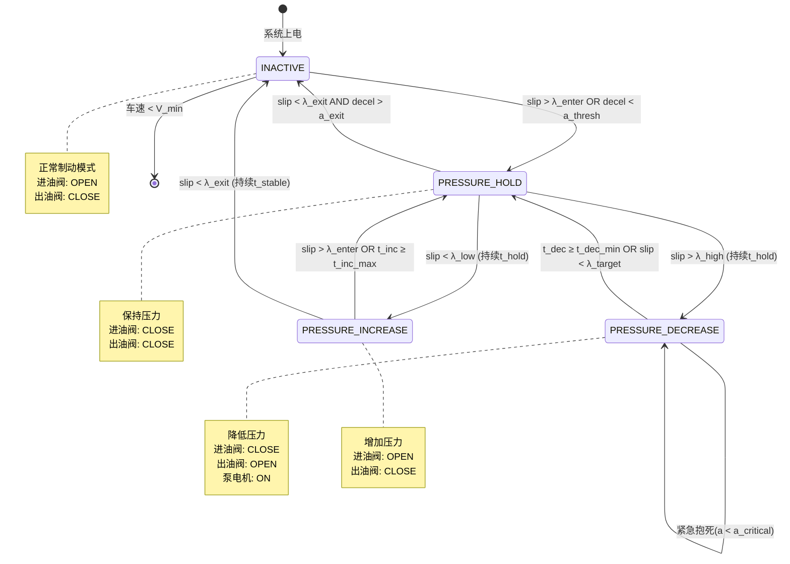

---

## 🔗 文档关联

### 核心关联
| 文档 | 关系类型 | 说明 |
|:-----|:---------|:-----|
| [内存管理](../../../01_Core_Knowledge_System/02_Core_Layer/02_Memory_Management.md) | 核心关联 | 内存管理基础 |
| [指针深度](../../../01_Core_Knowledge_System/02_Core_Layer/01_Pointer_Depth.md) | 核心关联 | 指针深度基础 |
| [并发编程](../../../03_System_Technology_Domains/14_Concurrency_Parallelism/readme.md) | 核心关联 | 并发编程基础 |
| [数据类型](../../../01_Core_Knowledge_System/01_Basic_Layer/02_Data_Type_System.md) | 核心关联 | 数据类型基础 |
| [数组与指针](../../../01_Core_Knowledge_System/02_Core_Layer/05_Arrays_Pointers.md) | 核心关联 | 数组与指针基础 |

### 扩展阅读
| 文档 | 关系类型 | 说明 |
|:-----|:---------|:-----|
| [软件工程](../../../01_Core_Knowledge_System/05_Engineering_Layer/readme.md) | 核心关联 | 软件工程基础 |
| [形式语义](../../../02_Formal_Semantics_and_Physics/readme.md) | 核心关联 | 形式语义基础 |
| [系统技术](../../../03_System_Technology_Domains/readme.md) | 核心关联 | 系统技术基础 |
| [工业场景](../../../04_Industrial_Scenarios/readme.md) | 核心关联 | 工业场景基础 |
| [思维表征](../../../06_Thinking_Representation/readme.md) | 核心关联 | 思维表征基础 |
# ABS防抱死制动系统 - 汽车工业级C语言实现

> **层级定位**: 04 Industrial Scenarios / 01 Automotive ABS
> **对应标准**: ISO 26262 ASIL-D, MISRA C:2012, AUTOSAR Classic Platform
> **难度级别**: L5 综合 / 工业级
> **预估学习时间**: 15-20 小时
> **版本**: V2.0 Automotive Grade

---

## 📋 本节概要

| 属性 | 内容 |
|:-----|:-----|
| **核心概念** | 滑移率控制、轮速处理、压力调节、故障安全、功能安全、轮胎力学 |
| **前置知识** | 嵌入式C、实时系统、传感器信号处理、控制理论、车辆动力学 |
| **后续延伸** | ESC电子稳定控制、TCS牵引力控制、ADAS自动驾驶、线控制动 |
| **权威来源** | ISO 26262-2018, Bosch ABS Handbook, SAE J2246, ECE R13, FMVSS 135 |

---


---

## 📑 目录

- [ABS防抱死制动系统 - 汽车工业级C语言实现](#abs防抱死制动系统---汽车工业级c语言实现)
  - [📋 本节概要](#-本节概要)
  - [📑 目录](#-目录)
  - [🧠 知识结构思维导图](#-知识结构思维导图)
  - [1️⃣ 概念定义（工程级）](#1️⃣-概念定义工程级)
    - [1.1 ABS的严格工程定义](#11-abs的严格工程定义)
    - [1.2 滑移率的数学定义](#12-滑移率的数学定义)
    - [1.3 轮胎-路面摩擦系数的物理模型](#13-轮胎-路面摩擦系数的物理模型)
      - [1.3.1 魔术公式（Magic Formula）模型](#131-魔术公式magic-formula模型)
      - [1.3.2 简化Burckhardt模型（实时控制使用）](#132-简化burckhardt模型实时控制使用)
    - [1.4 制动动力学方程](#14-制动动力学方程)
      - [1.4.1 单轮制动动力学模型](#141-单轮制动动力学模型)
      - [1.4.2 整车纵向动力学](#142-整车纵向动力学)
    - [1.5 控制理论基础](#15-控制理论基础)
      - [1.5.1 PID控制器](#151-pid控制器)
      - [1.5.2 模糊控制（Fuzzy Control）](#152-模糊控制fuzzy-control)
      - [1.5.3 滑模控制（Sliding Mode Control）](#153-滑模控制sliding-mode-control)
  - [2️⃣ 属性维度矩阵](#2️⃣-属性维度矩阵)
    - [2.1 ABS组件属性矩阵](#21-abs组件属性矩阵)
    - [2.2 控制算法对比矩阵](#22-控制算法对比矩阵)
    - [2.3 车辆类型ABS参数对比矩阵](#23-车辆类型abs参数对比矩阵)
    - [2.4 测试标准矩阵](#24-测试标准矩阵)
    - [2.5 故障模式与影响分析（FMEA）矩阵](#25-故障模式与影响分析fmea矩阵)
  - [3️⃣ 形式化描述](#3️⃣-形式化描述)
    - [3.1 制动过程物理模型](#31-制动过程物理模型)
      - [3.1.1 四分之一车辆模型（Quarter Car Model）](#311-四分之一车辆模型quarter-car-model)
      - [3.1.2 制动动力学方程组](#312-制动动力学方程组)
    - [3.2 控制算法的数学描述](#32-控制算法的数学描述)
      - [3.2.1 基于滑移率的控制目标](#321-基于滑移率的控制目标)
      - [3.2.2 离散时间状态空间模型](#322-离散时间状态空间模型)
    - [3.3 状态机模型](#33-状态机模型)
      - [3.3.1 ABS单轮控制状态机](#331-abs单轮控制状态机)
      - [3.3.2 系统级状态机](#332-系统级状态机)
    - [3.4 故障检测算法的形式化](#34-故障检测算法的形式化)
      - [3.4.1 传感器故障检测](#341-传感器故障检测)
      - [3.4.2 一致性检查（Cross-Monitoring）](#342-一致性检查cross-monitoring)
  - [4️⃣ 示例矩阵（完整代码实现）](#4️⃣-示例矩阵完整代码实现)
    - [4.1 轮速信号处理完整代码](#41-轮速信号处理完整代码)
    - [4.2 滑移率计算实现](#42-滑移率计算实现)
    - [4.3 控制逻辑实现（多种算法）](#43-控制逻辑实现多种算法)
      - [4.3.1 逻辑门限控制算法](#431-逻辑门限控制算法)
      - [4.3.2 PID控制算法实现](#432-pid控制算法实现)
    - [4.4 故障诊断代码](#44-故障诊断代码)
    - [4.5 与其他系统集成（EBD/TCS/ESP）](#45-与其他系统集成ebdtcsesp)
    - [4.6 AUTOSAR架构下的ABS软件组件](#46-autosar架构下的abs软件组件)
  - [5️⃣ 反例与陷阱（工程教训）](#5️⃣-反例与陷阱工程教训)
    - [5.1 传感器信号干扰处理](#51-传感器信号干扰处理)
    - [5.2 控制抖动问题](#52-控制抖动问题)
    - [5.3 低附路面误判](#53-低附路面误判)
    - [5.4 分离路面处理](#54-分离路面处理)
    - [5.5 转向制动协调](#55-转向制动协调)
    - [5.6 系统延迟影响](#56-系统延迟影响)
    - [5.7 电磁兼容性（EMC）问题](#57-电磁兼容性emc问题)
    - [5.8 功能安全（ISO 26262）违规](#58-功能安全iso-26262违规)
    - [5.9 测试覆盖不足](#59-测试覆盖不足)
    - [5.10 标定参数错误](#510-标定参数错误)
  - [6️⃣ 决策树](#6️⃣-决策树)
    - [6.1 控制算法选择决策树](#61-控制算法选择决策树)
    - [6.2 故障诊断决策树](#62-故障诊断决策树)
    - [6.3 系统状态转换决策树](#63-系统状态转换决策树)
  - [7️⃣ 行业标准与合规要求](#7️⃣-行业标准与合规要求)
    - [7.1 ISO 26262功能安全要求](#71-iso-26262功能安全要求)
    - [7.2 AUTOSAR软件架构](#72-autosar软件架构)
    - [7.3 ASPICE开发流程](#73-aspice开发流程)
    - [7.4 测试验证要求](#74-测试验证要求)
  - [8️⃣ 质量验收清单](#8️⃣-质量验收清单)
  - [📚 参考标准与延伸阅读](#-参考标准与延伸阅读)
    - [核心标准](#核心标准)
    - [经典文献](#经典文献)
  - [深入理解](#深入理解)
    - [核心原理](#核心原理)
    - [实践应用](#实践应用)
    - [最佳实践](#最佳实践)


---

## 🧠 知识结构思维导图



---

## 1️⃣ 概念定义（工程级）

### 1.1 ABS的严格工程定义

**防抱死制动系统（Anti-lock Braking System, ABS）** 是一种主动安全系统，其核心工程目标为：

> **定义**：在车辆紧急制动过程中，通过实时监测各车轮的滑移状态，动态调节制动轮缸的液压压力，将车轮滑移率控制在**最佳滑移率区间（λ_opt ≈ 10%-20%）**，从而同时实现：
>
> - **方向稳定性**：保持车辆转向能力，避免侧滑
> - **制动效能**：最大化利用轮胎-路面附着系数
> - **操纵性**：保证驾驶员对车辆行驶方向的控制

**工程约束条件**：

| 约束项 | 指标要求 | 标准依据 |
|:-------|:---------|:---------|
| 控制周期 | ≤10ms | 实时性要求 |
| 压力调节响应 | ≤100ms | ECE R13 |
| 故障响应时间 | ≤50ms | ISO 26262 |
| 失效安全概率 | <10⁻⁸/h | ASIL-D |
| 工作车速范围 | 5-250 km/h | 整车匹配 |
| 环境温度 | -40°C ~ +85°C | 汽车级芯片 |

### 1.2 滑移率的数学定义

**纵向滑移率（Longitudinal Slip Ratio）** 是ABS控制的核心被控变量，其数学定义为：

$$
\lambda = \begin{cases}
\frac{V_{vehicle} - V_{wheel}}{V_{vehicle}} \times 100\% & \text{(制动时, } V_{wheel} < V_{vehicle}\text{)} \\[8pt]
\frac{V_{wheel} - V_{vehicle}}{V_{wheel}} \times 100\% & \text{(驱动时, } V_{wheel} > V_{vehicle}\text{)}
\end{cases}
$$

其中：

- $V_{vehicle}$：车辆参考速度（纵向车速）
- $V_{wheel}$：车轮轮速（轮胎接地点线速度）

**滑移率的物理意义**：

| 滑移率范围 | 物理状态 | 轮胎特性 | 控制策略 |
|:-----------|:---------|:---------|:---------|
| λ = 0% | 纯滚动 | 无制动力 | 正常制动 |
| 0% < λ < 10% | 微小滑移 | 线性区，附着系数随λ增大 | 增压 |
| 10% ≤ λ ≤ 20% | **最佳滑移区** | 峰值附着系数μ_max | **保持压力** |
| 20% < λ < 100% | 大滑移 | 附着系数下降 | 减压 |
| λ = 100% | 完全抱死 | μ滑移 < μ峰值，侧向力≈0 | 紧急减压 |

**无量纲化滑移率定义（控制算法使用）**：

```c
/* 滑移率计算 - 工程实现 */
#define SLIP_RATIO_MIN        0.0f    /* 纯滚动 */
#define SLIP_RATIO_OPT_MIN    0.10f   /* 最佳区间下限 */
#define SLIP_RATIO_OPT_MAX    0.20f   /* 最佳区间上限 */
#define SLIP_RATIO_CRITICAL   0.30f   /* 临界抱死 */
#define SLIP_RATIO_LOCK       1.0f    /* 完全抱死 */
```

### 1.3 轮胎-路面摩擦系数的物理模型

#### 1.3.1 魔术公式（Magic Formula）模型

Pacejka提出的魔术公式是轮胎力学的工业标准模型：

$$
\mu(x) = D \cdot \sin\{C \cdot \arctan[B \cdot x - E \cdot (B \cdot x - \arctan(B \cdot x))]\}
$$

其中：

- $x$：滑移率λ（输入变量）
- $B$：刚度因子（Stiffness Factor）- 控制曲线斜率
- $C$：形状因子（Shape Factor）- 控制峰值特性
- $D$：峰值因子（Peak Factor）- 最大附着系数μ_max
- $E$：曲率因子（Curvature Factor）- 控制饱和特性

**典型路面参数（Bosch Handbook数据）**：

| 路面条件 | B | C | D | E | μ_max |
|:---------|:--|:--|:--|:--|:------|
| 干燥沥青 | 10.0 | 1.9 | 0.90 | 0.97 | 0.90 |
| 潮湿沥青 | 12.0 | 2.3 | 0.75 | 1.00 | 0.75 |
| 干燥混凝土 | 10.0 | 1.9 | 0.85 | 0.97 | 0.85 |
| 潮湿混凝土 | 12.0 | 2.3 | 0.65 | 1.00 | 0.65 |
| 积雪路面 | 5.0 | 2.0 | 0.25 | 1.00 | 0.25 |
| 结冰路面 | 4.0 | 2.0 | 0.10 | 1.00 | 0.10 |
| 碎石路面 | 8.0 | 1.9 | 0.55 | 0.97 | 0.55 |

#### 1.3.2 简化Burckhardt模型（实时控制使用）

$$
\mu(\lambda) = c_1 \cdot (1 - e^{-c_2 \cdot \lambda}) - c_3 \cdot \lambda
$$

**系数表**：

| 路面类型 | c₁ | c₂ | c₃ |
|:---------|:---|:---|:---|
| 干燥沥青 | 1.2801 | 23.990 | 0.5200 |
| 潮湿沥青 | 0.8570 | 33.822 | 0.3470 |
| 干燥混凝土 | 1.1973 | 25.168 | 0.5373 |
| 积雪 | 0.1946 | 94.129 | 0.0646 |
| 冰面 | 0.0500 | 306.400 | 0.0000 |

### 1.4 制动动力学方程

#### 1.4.1 单轮制动动力学模型

**纵向运动方程**：

$$
m_{wheel} \cdot \frac{dV_{wheel}}{dt} = F_x - F_b
$$

**旋转运动方程**：

$$
I_w \cdot \frac{d\omega}{dt} = F_x \cdot R_w - T_b
$$

其中：

- $m_{wheel}$：车轮质量
- $I_w$：车轮转动惯量
- $R_w$：轮胎有效滚动半径
- $F_x$：轮胎纵向力
- $F_b$：制动力（路面作用于轮胎）
- $T_b$：制动扭矩
- $\omega$：车轮角速度

**轮胎纵向力**：

$$
F_x = \mu(\lambda) \cdot F_z
$$

其中 $F_z$ 为轮胎垂直载荷。

#### 1.4.2 整车纵向动力学

$$
M_{vehicle} \cdot \frac{dV_{vehicle}}{dt} = -\sum_{i=1}^{4} F_{x,i} - F_{aero} - F_{roll}
$$

**各轮垂直载荷转移**（制动时）：

$$
\Delta F_z = \frac{M_{vehicle} \cdot a_x \cdot h_{cg}}{L_{wheelbase}}
$$

前轮载荷增加，后轮载荷减少：

- $F_{z,front} = F_{z0,front} + \Delta F_z$
- $F_{z,rear} = F_{z0,rear} - \Delta F_z$

### 1.5 控制理论基础

#### 1.5.1 PID控制器

**连续形式**：

$$
u(t) = K_p \cdot e(t) + K_i \cdot \int_0^t e(\tau) d\tau + K_d \cdot \frac{de(t)}{dt}
$$

**离散形式（后向欧拉法）**：

$$
u[k] = K_p \cdot e[k] + K_i \cdot T_s \cdot \sum_{i=0}^{k} e[i] + K_d \cdot \frac{e[k] - e[k-1]}{T_s}
$$

**增量式PID（抗积分饱和）**：

$$
\Delta \nu[k] = K_p \cdot (e[k] - e[k-1]) + K_i \cdot T_s \cdot e[k] + K_d \cdot \frac{e[k] - 2e[k-1] + e[k-2]}{T_s}
$$

**ABS应用参数典型值**：

| 参数 | 低附路面 | 高附路面 | 说明 |
|:-----|:---------|:---------|:-----|
| Kp | 2.0-3.0 | 1.5-2.5 | 比例增益 |
| Ki | 0.1-0.3 | 0.05-0.15 | 积分增益 |
| Kd | 0.5-1.0 | 0.3-0.8 | 微分增益 |
| Ts | 5-10ms | 5-10ms | 采样周期 |

#### 1.5.2 模糊控制（Fuzzy Control）

**输入变量模糊集**：

- 滑移率误差 E：{NB, NM, NS, ZO, PS, PM, PB}
- 滑移率变化率 EC：{NB, NM, NS, ZO, PS, PM, PB}

**输出变量模糊集**：

- 压力调节量 U：{NB, NM, NS, ZO, PS, PM, PB}

**模糊规则表示例**（Mamdani推理）：

| E \ EC | NB | NM | NS | ZO | PS | PM | PB |
|:-------|:--:|:--:|:--:|:--:|:--:|:--:|:--:|
| **NB** | NB | NB | NB | NM | NM | NS | ZO |
| **NM** | NB | NB | NM | NM | NS | ZO | PS |
| **NS** | NB | NM | NS | NS | ZO | PS | PM |
| **ZO** | NM | NM | NS | ZO | PS | PM | PM |
| **PS** | NM | NS | ZO | PS | PS | PM | PB |
| **PM** | NS | ZO | PS | PM | PM | PB | PB |
| **PB** | ZO | PS | PM | PM | PB | PB | PB |

*注：NB=负大, NM=负中, NS=负小, ZO=零, PS=正小, PM=正中, PB=正大*

#### 1.5.3 滑模控制（Sliding Mode Control）

**滑模面定义**：

$$
s = \lambda - \lambda_{target} + c \cdot \frac{d\lambda}{dt}
$$

**控制律**：

$$
u = -K \cdot \text{sgn}(s) - k \cdot s
$$

**饱和函数替代符号函数（减少抖振）**：

$$
\text{sat}(s/\Phi) = \begin{cases}
s/\Phi & |s| \leq \Phi \\[4pt]
\text{sgn}(s) & |s| > \Phi
\end{cases}
$$

其中 $\Phi$ 为边界层厚度。

---

## 2️⃣ 属性维度矩阵

### 2.1 ABS组件属性矩阵

| 组件 | 类型 | 精度/分辨率 | 响应时间 | 工作电压 | 工作温度 | 诊断方式 | 失效模式 |
|:-----|:-----|:------------|:---------|:---------|:---------|:---------|:---------|
| **轮速传感器** ||||||||
| 电磁感应式 | 被动式 | 1-2° crank | ~1ms | - | -40~150°C | 开/短路检测 | 信号丢失、漂移 |
| 霍尔式 | 主动式 | 0.1-0.5° | <1ms | 5V/12V | -40~125°C | PWM诊断 | 固定高/低电平 |
| 磁阻式(AMR) | 主动式 | 0.1° | <0.5ms | 5V | -40~125°C | 幅值检测 | 灵敏度下降 |
| **ECU处理器** ||||||||
| 主MCU | 双核锁步 | 32bit/80MHz | - | 5V±5% | -40~85°C | BIST自检 | 单点故障 |
| 安全监控器 | 独立看门狗 | - | - | 5V | -40~85°C | 喂狗超时 | 复位系统 |
| **液压调节器** ||||||||
| 进油阀(常开) | 高速电磁阀 | - | 2-3ms | 12V | -40~120°C | 电阻检测 | 卡滞、响应慢 |
| 出油阀(常闭) | 高速电磁阀 | - | 2-3ms | 12V | -40~120°C | 电阻检测 | 泄漏、卡滞 |
| 回流泵 | 直流电机 | - | <100ms | 12V | -40~120°C | 电流检测 | 卡死、磨损 |
| **压力传感器** | 压阻式 | ±0.1bar | <1ms | 5V | -40~120°C | 范围检查 | 漂移、噪声 |
| **开关信号** ||||||||
| 制动踏板开关 | 霍尔/机械 | - | <10ms | 12V | -40~85°C | 双路校验 | 接触不良 |
| 制动压力开关 | 机械式 | 0.5bar | <10ms | 12V | -40~85°C | 状态检查 | 误触发 |

### 2.2 控制算法对比矩阵

| 算法类型 | 控制精度 | 计算复杂度 | 参数整定难度 | 鲁棒性 | 实时性 | 典型应用 |
|:---------|:---------|:-----------|:-------------|:-------|:-------|:---------|
| **逻辑门限控制** | ★★☆ | 低（O(1)） | 简单 | ★★★ | 极佳 | 博世ABS早期版本 |
| **PID控制** | ★★★ | 中（O(1)） | 中等 | ★★☆ | 优秀 | 经济型ABS |
| **模糊控制** | ★★★ | 高（O(N²)） | 较复杂 | ★★★ | 良好 | 复杂路况适应 |
| **滑模控制** | ★★★★ | 中（O(1)） | 中等 | ★★★★ | 优秀 | 高动态响应 |
| **模型预测控制(MPC)** | ★★★★★ | 极高（O(N³)） | 复杂 | ★★★★ | 较差 | 研究/高端车型 |
| **神经网络控制** | ★★★★ | 极高 | 需训练数据 | ★★★ | 较差 | 自适应学习系统 |
| **自适应控制** | ★★★★ | 高 | 复杂 | ★★★★ | 良好 | 路面识别系统 |

### 2.3 车辆类型ABS参数对比矩阵

| 参数 | 轿车(Compact) | 轿车(Luxury) | 轻卡 | 重卡 | 客车 | 摩托车 | SUV/越野车 |
|:-----|:--------------|:-------------|:-----|:-----|:-----|:-------|:-----------|
| **系统配置** ||||||||
| 通道数 | 4通道(4S/4M) | 4通道 | 4通道 | 6通道(6S/6M) | 4-6通道 | 2-3通道 | 4通道 |
| 电磁阀数 | 8 | 8 | 8 | 12 | 8-12 | 4-6 | 8 |
| 泵电机功率 | 120W | 180W | 200W | 350W | 300W | 80W | 180W |
| **控制参数** ||||||||
| 控制周期 | 10ms | 5ms | 10ms | 10ms | 10ms | 5ms | 10ms |
| 压力调节次数/s | 4-6 | 6-10 | 4-6 | 3-5 | 4-6 | 8-12 | 4-8 |
| 进入车速阈值 | 5km/h | 3km/h | 5km/h | 5km/h | 5km/h | 8km/h | 5km/h |
| **性能指标** ||||||||
| 制动距离改善 | 10-15% | 15-20% | 8-12% | 5-10% | 8-12% | 20-30% | 12-18% |
| 方向稳定性 | 优秀 | 优秀 | 良好 | 一般 | 良好 | 优秀 | 优秀 |
| 转向能力保持 | 是 | 是 | 有限 | 有限 | 有限 | 是 | 是 |
| **法规要求** ||||||||
| 强制安装 | 是 | 是 | 是 | 是 | 是 | 部分国家 | 是 |
| 功能安全等级 | ASIL-D | ASIL-D | ASIL-D | ASIL-D | ASIL-D | ASIL-B/D | ASIL-D |
| 电磁兼容等级 | Class 5 | Class 5 | Class 5 | Class 5 | Class 5 | Class 3 | Class 5 |

### 2.4 测试标准矩阵

| 标准编号 | 适用地区 | 测试项目 | 测试条件 | 通过标准 | 关键参数 |
|:---------|:---------|:---------|:---------|:---------|:---------|
| **ECE R13** | 欧洲/联合国 | ||||
| | | 高附制动 | 干燥沥青, 80km/h→0 | 不偏离3.5m通道 | μ≥0.8 |
| | | 低附制动 | 冰面/雪面, 50km/h→0 | 可操纵性保持 | μ≤0.3 |
| | | 对开路面 | 左右μ差>0.5 | 横摆角<15° | |
| | | 接力试验 | 连续10次制动 | 性能衰减<20% | |
| **FMVSS 135** | 美国 | ||||
| | | 基准制动 | 干燥路面, 100km/h | 制动距离≤0.1V+0.006V² | |
| | | 失效模式 | 单回路失效 | 制动距离≤168m@100km/h | |
| | | 驻车制动 | 20%坡度 | 保持5min不溜车 | |
| **GB/T 13594** | 中国 | ||||
| | | 性能试验 | 参照ECE R13 | 等效ECE R13 | |
| | | 环境试验 | -40°C~+85°C | 功能正常 | |
| | | EMC试验 | CISPR 25 | Class 3/5 | |
| **ADR 35/03** | 澳大利亚 | ||||
| | | 综合制动 | 干/湿路面 | 等效ECE R13 | |
| **GTR 3** | 全球技术法规 | ||||
| | | 制动性能 | 全球协调 | 综合各标准 | |
| **ISO 6312** | 国际 | 制动噪声 | 台架试验 | ≤85dB(A) | |

### 2.5 故障模式与影响分析（FMEA）矩阵

| 故障模式 | 故障原因 | 本地影响 | 系统影响 | 车辆影响 | S | E | D | RPN | 安全措施 |
|:---------|:---------|:---------|:---------|:---------|:--|:--|:--|:----|:---------|
| **传感器故障** |||||||||
| 轮速信号丢失 | 断线/短路 | 该轮速未知 | 参考车速估计偏差 | 制动距离增加 | 7 | 4 | 2 | 56 | 跛行模式 |
| 轮速信号漂移 | 齿圈损坏 | 滑移率计算错误 | ABS误触发/不触发 | 方向不稳定 | 8 | 3 | 3 | 72 | 冗余校验 |
| 多轮信号异常 | 电源故障 | 多轮速未知 | ABS功能丧失 | 常规制动 | 6 | 2 | 1 | 12 | 故障灯提示 |
| **执行器故障** |||||||||
| 进油阀卡滞开 | 机械故障 | 无法保压 | 循环压力失控 | 踏板抖动 | 5 | 4 | 3 | 60 | 阀自检 |
| 进油阀卡滞关 | 机械故障 | 无法增压 | 该轮无制动力 | 跑偏 | 8 | 3 | 3 | 72 | 跛行模式 |
| 出油阀卡滞 | 机械故障 | 无法减压 | 车轮抱死风险 | 侧滑 | 9 | 3 | 3 | 81 | 紧急减压 |
| 泵电机失效 | 电机损坏 | 无回流能力 | 多次循环后失效 | 二次制动失效 | 7 | 3 | 2 | 42 | 电机诊断 |
| **ECU故障** |||||||||
| CPU单点故障 | 硬件故障 | 计算错误 | 控制指令错误 | 失控风险 | 9 | 2 | 1 | 18 | 双核锁步 |
| RAM数据错误 | SEU/EMI | 数据污染 | 算法失效 | 意外行为 | 8 | 3 | 2 | 48 | ECC校验 |
| 程序跑飞 | 软件Bug | 指令错乱 | 系统死机 | ABS失效 | 8 | 3 | 2 | 48 | 看门狗 |
| 电源故障 | 供电异常 | 电压波动 | 功能降级 | ABS关闭 | 6 | 4 | 2 | 48 | 电源监控 |

**风险优先级数（RPN）计算**：

- S（严重度）: 1-10，10最严重
- E（发生频度）: 1-10，10最频繁
- D（探测度）: 1-10，1最易探测
- **RPN = S × E × D**
- RPN > 100: 必须采取改进措施
- RPN 50-100: 建议采取改进措施
- RPN < 50: 可接受风险

---

## 3️⃣ 形式化描述

### 3.1 制动过程物理模型

#### 3.1.1 四分之一车辆模型（Quarter Car Model）

```
                    F_z (垂直载荷)
                    ↓
    ┌─────────────────────────────────────┐
    │         悬架质量 M_s                │
    │  ┌─────────────────────────────┐    │
    │  │                             │    │
    │  │         弹簧 K_s            │    │
    │  │              │              │    │
    │  │         阻尼 C_s            │    │
    │  │              │              │    │
    │  └──────────────┼──────────────┘    │
    └─────────────────┼───────────────────┘
                      │
    ┌─────────────────┼───────────────────┐
    │         非悬架质量 M_u              │
    │  ┌──────────────┼──────────────┐    │
    │  │              ▼              │    │
    │  │      轮胎刚度 K_t           │    │
    │  │              │              │    │
    │  └──────────────┼──────────────┘    │
    └─────────────────┼───────────────────┘
                      │
                      ▼
                路面 (Road)
```

**状态空间方程**：

$$
\begin{bmatrix} \dot{z}_s \\ \dot{z}_u \\ \ddot{z}_s \\ \ddot{z}_u \end{bmatrix} =
\begin{bmatrix}
0 & 0 & 1 & 0 \\
0 & 0 & 0 & 1 \\
-\frac{K_s}{M_s} & \frac{K_s}{M_s} & -\frac{C_s}{M_s} & \frac{C_s}{M_s} \\
\frac{K_s}{M_u} & -\frac{K_s+K_t}{M_u} & \frac{C_s}{M_u} & -\frac{C_s}{M_u}
\end{bmatrix}
\begin{bmatrix} z_s \\ z_u \\ \dot{z}_s \\ \dot{z}_u \end{bmatrix} +
\begin{bmatrix} 0 \\ 0 \\ 0 \\ \frac{K_t}{M_u} \end{bmatrix} z_r
$$

其中 $z_r$ 为路面不平度输入。

#### 3.1.2 制动动力学方程组

**耦合微分方程组**：

$$
\begin{cases}
\dot{V} = -\frac{1}{M} \sum_{i=1}^{4} \mu_i(\lambda_i) \cdot F_{z,i} \\[8pt]
\dot{\omega}_i = \frac{1}{I_w} \left[ R_w \cdot \mu_i(\lambda_i) \cdot F_{z,i} - T_{b,i} \right], \quad i=1,2,3,4 \\[8pt]
\lambda_i = \frac{V - R_w \cdot \omega_i}{V}
\end{cases}
$$

### 3.2 控制算法的数学描述

#### 3.2.1 基于滑移率的控制目标

**优化目标函数**：

$$
J = \int_0^{t_f} \left[ (\lambda(t) - \lambda_{opt})^2 + \rho \cdot T_b^2(t) \right] dt \rightarrow \min
$$

约束条件：

- $0 \leq T_b(t) \leq T_{b,max}$
- $|\dot{T}_b(t)| \leq \dot{T}_{b,max}$ （压力变化率限制）

#### 3.2.2 离散时间状态空间模型

**状态向量**：

$$
\mathbf{x}[k] = \begin{bmatrix} V[k] \\ \omega[k] \\ P[k] \end{bmatrix}
$$

其中 $P[k]$ 为制动压力。

**离散状态方程**（欧拉法，采样周期 $T_s$）：

$$
\mathbf{x}[k+1] = \mathbf{A}_d \cdot \mathbf{x}[k] + \mathbf{B}_d \cdot u[k] + \mathbf{w}[k]
$$

$$
\mathbf{y}[k] = \mathbf{C} \cdot \mathbf{x}[k] + \mathbf{v}[k]
$$

其中：

- $u[k]$：控制输入（阀开关指令）
- $\mathbf{w}[k]$：过程噪声
- $\mathbf{v}[k]$：测量噪声
- $\mathbf{A}_d = e^{\mathbf{A}T_s} \approx \mathbf{I} + \mathbf{A}T_s$ （一阶近似）

### 3.3 状态机模型

#### 3.3.1 ABS单轮控制状态机



#### 3.3.2 系统级状态机

| 系统状态 | 进入条件 | 退出条件 | 控制行为 | 指示灯状态 |
|:---------|:---------|:---------|:---------|:-----------|
| **INIT** | 上电 | 自检完成 | 初始化变量 | 闪烁 |
| **SELF_TEST** | INIT完成 | 自检通过 | 执行BIST | 闪烁 |
| **STANDBY** | 自检通过 | 制动踏板按下 | 轮速监测 | 熄灭 |
| **ACTIVE** | 制动+车速>V_min | 踏板释放 | ABS控制 | 激活时闪烁 |
| **DEGRADED** | 检测到非关键故障 | 故障清除 | 降级功能 | 常亮 |
| **LIMP_HOME** | 关键故障 | 复位/维修 | 常规制动 | 常亮 |
| **SHUTDOWN** | 车速<V_min | 上电 | 系统关闭 | 熄灭 |

### 3.4 故障检测算法的形式化

#### 3.4.1 传感器故障检测

**残差生成**：

$$
r[k] = y[k] - \hat{y}[k|k-1]
$$

其中 $\hat{y}[k|k-1]$ 为基于模型的预测输出。

**故障判定逻辑**：

$$
\text{Fault} = \begin{cases}
\text{True} & \text{if } |r[k]| > \gamma \cdot \sigma_r \text{ 连续 } N \text{ 个周期} \\
\text{False} & \text{otherwise}
\end{cases}
$$

其中：

- $\gamma$：检测阈值系数（通常3-5）
- $\sigma_r$：残差标准差
- $N$：连续检测次数

#### 3.4.2 一致性检查（Cross-Monitoring）

**对角轮速一致性**：

$$
|V_{FL} - V_{RR}| < \epsilon_{diag} \cdot V_{ref}
$$

**同轴轮速一致性**：

$$
|V_{FL} - V_{FR}| < \epsilon_{axle} \cdot V_{ref}
$$

**动态阈值**：

$$
\epsilon(V_{ref}) = \epsilon_0 + k_\epsilon \cdot V_{ref}
$$


---

## 4️⃣ 示例矩阵（完整代码实现）

### 4.1 轮速信号处理完整代码

```c
/*============================================================================
 * MODULE:    WheelSpeedProcessing
 * FILE:      wheel_speed.c
 * VERSION:   3.2.1
 * DESCRIPTION:
 *   轮速信号处理模块 - 符合MISRA C:2012和ISO 26262 ASIL-D要求
 *   支持电磁感应式和霍尔式传感器
 *============================================================================*/

#include <stdint.h>
#include <stdbool.h>
#include <math.h>

/*============================================================================
 * 配置常量
 *============================================================================*/
#define WSP_NUM_WHEELS              4u      /* 车轮数量 */
#define WSP_TEETH_COUNT             48u     /* 齿圈齿数 */
#define WSP_WHEEL_CIRCUMFERENCE_MM  2000u   /* 轮胎周长 (mm) */
#define WSP_SAMPLE_PERIOD_MS        10u     /* 采样周期 (ms) */
#define WSP_TIMER_FREQ_HZ           1000000u /* 定时器频率 1MHz (us) */

/* 频率限制 */
#define WSP_FREQ_MIN_HZ             3u      /* 约3 km/h */
#define WSP_FREQ_MAX_HZ             2500u   /* 约250 km/h */

/* 信号质量阈值 */
#define WSP_QUALITY_GOOD            80u
#define WSP_QUALITY_FAIR            50u
#define WSP_QUALITY_POOR            20u

/* 故障检测阈值 */
#define WSP_TIMEOUT_MS              200u    /* 信号超时 (ms) */
#define WSP_JUMP_THRESHOLD_KMH      30.0f   /* 跳变检测阈值 (km/h) */
#define WSP_NOISE_THRESHOLD         5u      /* 连续异常计数阈值 */

/*============================================================================
 * 类型定义
 *============================================================================*/

typedef enum {
    WSP_SENSOR_OK = 0,
    WSP_SENSOR_OPEN_CIRCUIT,
    WSP_SENSOR_SHORT_CIRCUIT,
    WSP_SENSOR_SIGNAL_LOSS,
    WSP_SENSOR_NOISE_EXCESSIVE,
    WSP_SENSOR_PLAUSIBILITY_ERROR
} WSP_SensorStatusType;

typedef enum {
    WSP_WHEEL_FL = 0,   /* 左前 */
    WSP_WHEEL_FR,       /* 右前 */
    WSP_WHEEL_RL,       /* 左后 */
    WSP_WHEEL_RR        /* 右后 */
} WSP_WheelIndexType;

typedef struct {
    uint32_t period_us;              /* 脉冲周期 (us) */
    uint32_t period_filtered;        /* 滤波后周期 */
    uint32_t last_capture_time;      /* 上次捕获时间 */
    uint32_t pulse_count;            /* 脉冲计数 */

    float speed_kmh;                 /* 轮速 (km/h) */
    float speed_filtered;            /* 滤波后轮速 */
    float acceleration;              /* 轮加速度 (m/s²) */

    uint8_t signal_quality;          /* 信号质量 0-100 */
    uint8_t noise_counter;           /* 噪声计数器 */
    WSP_SensorStatusType status;     /* 传感器状态 */

    /* 诊断相关 */
    uint32_t last_valid_time;        /* 上次有效信号时间 */
    uint32_t stuck_counter;          /* 卡滞计数器 */
} WSP_ChannelType;

typedef struct {
    WSP_ChannelType channel[WSP_NUM_WHEELS];
    uint32_t system_time_ms;         /* 系统时间 */
    bool initialization_complete;    /* 初始化完成标志 */
} WSP_ModuleType;

/*============================================================================
 * 静态变量
 *============================================================================*/
static WSP_ModuleType wsp_module;
static const float WSP_SPEED_CONST =
    ((float)WSP_WHEEL_CIRCUMFERENCE_MM * 3.6f) / (float)WSP_TEETH_COUNT; /* = 150.0 */

/* 滤波系数 */
#define WSP_FILTER_ALPHA            0.3f    /* 一阶低通滤波系数 */
#define WSP_FILTER_ALPHA_ACCEL      0.5f    /* 加速度滤波系数 */

/*============================================================================
 * 内部函数原型
 *============================================================================*/
static void WSP_UpdateSignalQuality(WSP_ChannelType *ch, bool valid);
static float WSP_LowPassFilter(float current, float previous, float alpha);
static bool WSP_CheckPlausibility(const WSP_ChannelType *ch, float new_speed);
static void WSP_DiagnoseChannel(WSP_ChannelType *ch, uint32_t current_time);

/*============================================================================
 * 函数: WSP_Init
 * 描述: 初始化轮速处理模块
 *============================================================================*/
void WSP_Init(void)
{
    uint8_t i;

    for (i = 0u; i < WSP_NUM_WHEELS; i++) {
        wsp_module.channel[i].period_us = 0u;
        wsp_module.channel[i].period_filtered = 0u;
        wsp_module.channel[i].last_capture_time = 0u;
        wsp_module.channel[i].pulse_count = 0u;
        wsp_module.channel[i].speed_kmh = 0.0f;
        wsp_module.channel[i].speed_filtered = 0.0f;
        wsp_module.channel[i].acceleration = 0.0f;
        wsp_module.channel[i].signal_quality = 0u;
        wsp_module.channel[i].noise_counter = 0u;
        wsp_module.channel[i].status = WSP_SENSOR_SIGNAL_LOSS;
        wsp_module.channel[i].last_valid_time = 0u;
        wsp_module.channel[i].stuck_counter = 0u;
    }

    wsp_module.system_time_ms = 0u;
    wsp_module.initialization_complete = true;
}

/*============================================================================
 * 函数: WSP_CaptureISR
 * 描述: 轮速捕获中断服务程序 - 最小化执行时间
 * 警告: 本函数在中断上下文中执行，禁止使用浮点运算
 *============================================================================*/
void WSP_CaptureISR(WSP_WheelIndexType wheel_id, uint32_t capture_time)
{
    WSP_ChannelType *ch;
    uint32_t period;

    /* 参数检查 */
    if (wheel_id >= WSP_NUM_WHEELS) {
        return;  /* 无效的车轮索引 */
    }

    ch = &wsp_module.channel[wheel_id];

    /* 计算周期 */
    if (capture_time >= ch->last_capture_time) {
        period = capture_time - ch->last_capture_time;
    } else {
        /* 定时器溢出处理 */
        period = (0xFFFFFFFFu - ch->last_capture_time) + capture_time + 1u;
    }

    /* 周期合理性检查 */
    if ((period >= (WSP_TIMER_FREQ_HZ / WSP_FREQ_MAX_HZ)) &&
        (period <= (WSP_TIMER_FREQ_HZ / WSP_FREQ_MIN_HZ))) {
        ch->period_us = period;
        ch->pulse_count++;
        ch->last_valid_time = wsp_module.system_time_ms;
        ch->stuck_counter = 0u;
    } else {
        /* 异常信号，增加噪声计数 */
        if (ch->noise_counter < 255u) {
            ch->noise_counter++;
        }
    }

    ch->last_capture_time = capture_time;
}

/*============================================================================
 * 函数: WSP_Process_10ms
 * 描述: 10ms周期处理任务 - 浮点运算和复杂逻辑
 *============================================================================*/
void WSP_Process_10ms(void)
{
    uint8_t i;
    uint32_t current_time;
    WSP_ChannelType *ch;
    float instant_speed;
    float prev_speed;

    wsp_module.system_time_ms += WSP_SAMPLE_PERIOD_MS;
    current_time = wsp_module.system_time_ms;

    for (i = 0u; i < WSP_NUM_WHEELS; i++) {
        ch = &wsp_module.channel[i];
        prev_speed = ch->speed_filtered;

        /* 检查信号超时 */
        if ((current_time - ch->last_valid_time) > WSP_TIMEOUT_MS) {
            /* 信号丢失 */
            ch->status = WSP_SENSOR_SIGNAL_LOSS;
            ch->speed_kmh = 0.0f;
            ch->speed_filtered = WSP_LowPassFilter(0.0f, prev_speed, WSP_FILTER_ALPHA);
            ch->acceleration = 0.0f;
            WSP_UpdateSignalQuality(ch, false);
            continue;
        }

        /* 计算瞬时速度: v = (周长 * 3600) / (齿数 * 周期_us) * 1000 */
        /* 简化为: v = 7200000 / (48 * 周期_us) = 150000 / 周期_us */
        if (ch->period_us > 0u) {
            instant_speed = WSP_SPEED_CONST * 1000.0f / (float)ch->period_us;
        } else {
            instant_speed = 0.0f;
        }

        /* 速度限幅 */
        if (instant_speed > 300.0f) {
            instant_speed = 300.0f;
        }

        /* 合理性检查 */
        if (!WSP_CheckPlausibility(ch, instant_speed)) {
            ch->noise_counter++;
            if (ch->noise_counter > WSP_NOISE_THRESHOLD) {
                ch->status = WSP_SENSOR_NOISE_EXCESSIVE;
            }
            /* 使用预测值 */
            instant_speed = prev_speed + ch->acceleration * 0.01f * 3.6f;
        } else {
            ch->noise_counter = 0u;
        }

        ch->speed_kmh = instant_speed;

        /* 低通滤波 */
        ch->speed_filtered = WSP_LowPassFilter(instant_speed, prev_speed, WSP_FILTER_ALPHA);

        /* 计算加速度 (m/s²) */
        /* a = (v_new - v_old) / (3.6 * dt) */
        ch->acceleration = WSP_LowPassFilter(
            (ch->speed_filtered - prev_speed) / (3.6f * 0.01f),
            ch->acceleration,
            WSP_FILTER_ALPHA_ACCEL
        );

        /* 执行诊断 */
        WSP_DiagnoseChannel(ch, current_time);

        /* 更新信号质量 */
        WSP_UpdateSignalQuality(ch, (ch->status == WSP_SENSOR_OK));
    }
}

/*============================================================================
 * 函数: WSP_LowPassFilter
 * 描述: 一阶低通滤波器
 *============================================================================*/
static float WSP_LowPassFilter(float current, float previous, float alpha)
{
    /* alpha: 滤波系数 (0-1)，越大响应越快 */
    return (alpha * current) + ((1.0f - alpha) * previous);
}

/*============================================================================
 * 函数: WSP_CheckPlausibility
 * 描述: 速度合理性检查
 *============================================================================*/
static bool WSP_CheckPlausibility(const WSP_ChannelType *ch, float new_speed)
{
    float speed_diff;

    /* 检查跳变 */
    speed_diff = new_speed - ch->speed_filtered;
    if (speed_diff < 0.0f) {
        speed_diff = -speed_diff;
    }

    /* 10ms内速度变化不应超过30km/h */
    if (speed_diff > WSP_JUMP_THRESHOLD_KMH) {
        return false;
    }

    /* 减速度合理性检查 (最大约-15m/s²) */
    if (new_speed < ch->speed_filtered) {
        if ((ch->speed_filtered - new_speed) > 0.54f) {  /* 15 * 3.6 * 0.01 */
            return false;
        }
    }

    return true;
}

/*============================================================================
 * 函数: WSP_UpdateSignalQuality
 * 描述: 更新信号质量指标
 *============================================================================*/
static void WSP_UpdateSignalQuality(WSP_ChannelType *ch, bool valid)
{
    if (valid) {
        if (ch->signal_quality < 100u) {
            ch->signal_quality++;
        }
    } else {
        if (ch->signal_quality > 0u) {
            ch->signal_quality -= 2u;  /* 衰减更快 */
        }
    }
}

/*============================================================================
 * 函数: WSP_DiagnoseChannel
 * 描述: 通道诊断
 *============================================================================*/
static void WSP_DiagnoseChannel(WSP_ChannelType *ch, uint32_t current_time)
{
    /* 卡滞检测 */
    if (ch->pulse_count == ch->stuck_counter) {
        ch->stuck_counter++;
        if (ch->stuck_counter > 20u) {  /* 200ms无变化 */
            ch->status = WSP_SENSOR_SIGNAL_LOSS;
        }
    }

    /* 根据信号质量更新状态 */
    if (ch->signal_quality >= WSP_QUALITY_GOOD) {
        ch->status = WSP_SENSOR_OK;
    } else if (ch->signal_quality >= WSP_QUALITY_FAIR) {
        if (ch->status != WSP_SENSOR_NOISE_EXCESSIVE) {
            ch->status = WSP_SENSOR_OK;
        }
    }
}

/*============================================================================
 * 函数: WSP_GetSpeed
 * 描述: 获取指定车轮速度
 *============================================================================*/
float WSP_GetSpeed(WSP_WheelIndexType wheel_id)
{
    if (wheel_id < WSP_NUM_WHEELS) {
        return wsp_module.channel[wheel_id].speed_filtered;
    }
    return 0.0f;
}

/*============================================================================
 * 函数: WSP_GetAcceleration
 * 描述: 获取指定车轮加速度
 *============================================================================*/
float WSP_GetAcceleration(WSP_WheelIndexType wheel_id)
{
    if (wheel_id < WSP_NUM_WHEELS) {
        return wsp_module.channel[wheel_id].acceleration;
    }
    return 0.0f;
}

/*============================================================================
 * 函数: WSP_GetStatus
 * 描述: 获取指定车轮传感器状态
 *============================================================================*/
WSP_SensorStatusType WSP_GetStatus(WSP_WheelIndexType wheel_id)
{
    if (wheel_id < WSP_NUM_WHEELS) {
        return wsp_module.channel[wheel_id].status;
    }
    return WSP_SENSOR_SIGNAL_LOSS;
}
```

### 4.2 滑移率计算实现

```c
/*============================================================================
 * MODULE:    SlipRatioCalculation
 * FILE:      slip_ratio.c
 * DESCRIPTION: 滑移率计算与参考车速估计
 *============================================================================*/

#include <stdint.h>
#include <stdbool.h>
#include <math.h>

/*============================================================================
 * 常量定义
 *============================================================================*/
#define SR_NUM_WHEELS               4u
#define SR_SAMPLE_TIME_MS           10u

/* 滑移率阈值 */
#define SR_SLIP_OPTIMAL_MIN         0.10f
#define SR_SLIP_OPTIMAL_MAX         0.20f
#define SR_SLIP_CRITICAL            0.30f
#define SR_SLIP_ENTER_ABS           0.15f
#define SR_SLIP_EXIT_ABS            0.08f

/* 加速度约束 */
#define SR_MAX_DECELERATION         15.0f   /* m/s² */
#define SR_MAX_ACCELERATION         8.0f    /* m/s² */
#define SR_MIN_VEHICLE_SPEED        1.0f    /* km/h */

/* 参考车速估计方法选择 */
typedef enum {
    SR_EST_MAX_WHEEL = 0,   /* 最大轮速法 */
    SR_EST_KALMAN,          /* 卡尔曼滤波 */
    SR_EST_FUSION           /* 融合方法 */
} SR_EstimationMethodType;

/*============================================================================
 * 数据结构
 *============================================================================*/

typedef struct {
    float slip_ratio;           /* 滑移率 0-1 */
    float wheel_speed;          /* 轮速 km/h */
    float target_slip;          /* 目标滑移率 */
    bool in_control;            /* 是否处于控制中 */
} SR_WheelChannelType;

typedef struct {
    float vehicle_speed;        /* 参考车速 km/h */
    float vehicle_accel;        /* 车辆加速度 m/s² */
    float estimated_speed;      /* 估计车速 */
    uint8_t confidence;         /* 估计置信度 0-100 */
    bool is_estimated;          /* 是否为估计值 */
    SR_EstimationMethodType method;
} SR_VehicleStateType;

typedef struct {
    SR_WheelChannelType wheel[SR_NUM_WHEELS];
    SR_VehicleStateType vehicle;

    /* 卡尔曼滤波状态 */
    float kalman_x;             /* 状态估计 */
    float kalman_p;             /* 估计误差协方差 */

    /* 滤波系数 */
    float alpha_speed;
    float alpha_accel;
} SR_ModuleType;

/* 卡尔曼滤波参数 */
#define SR_KALMAN_Q               0.1f    /* 过程噪声 */
#define SR_KALMAN_R               1.0f    /* 测量噪声 */

/*============================================================================
 * 静态变量
 *============================================================================*/
static SR_ModuleType sr_module;

/*============================================================================
 * 内部函数原型
 *============================================================================*/
static float SR_CalculateSlipRatio(float vehicle_speed, float wheel_speed);
static void SR_EstimateByMaxWheel(SR_ModuleType *sr);
static void SR_EstimateByKalman(SR_ModuleType *sr);
static float SR_SelectReferenceSpeed(const SR_ModuleType *sr);

/*============================================================================
 * 函数: SR_Init
 *============================================================================*/
void SR_Init(void)
{
    uint8_t i;

    for (i = 0u; i < SR_NUM_WHEELS; i++) {
        sr_module.wheel[i].slip_ratio = 0.0f;
        sr_module.wheel[i].wheel_speed = 0.0f;
        sr_module.wheel[i].target_slip = SR_SLIP_OPTIMAL_MIN;
        sr_module.wheel[i].in_control = false;
    }

    sr_module.vehicle.vehicle_speed = 0.0f;
    sr_module.vehicle.vehicle_accel = 0.0f;
    sr_module.vehicle.confidence = 0u;
    sr_module.vehicle.is_estimated = false;
    sr_module.vehicle.method = SR_EST_MAX_WHEEL;

    sr_module.kalman_x = 0.0f;
    sr_module.kalman_p = 1.0f;

    sr_module.alpha_speed = 0.3f;
    sr_module.alpha_accel = 0.5f;
}

/*============================================================================
 * 函数: SR_CalculateSlipRatio
 * 描述: 计算滑移率
 * 公式: lambda = (V_vehicle - V_wheel) / V_vehicle
 *============================================================================*/
static float SR_CalculateSlipRatio(float vehicle_speed, float wheel_speed)
{
    float slip;

    /* 车速过低时不计算滑移率 */
    if (vehicle_speed < SR_MIN_VEHICLE_SPEED) {
        return 0.0f;
    }

    /* 计算滑移率 */
    slip = (vehicle_speed - wheel_speed) / vehicle_speed;

    /* 限幅处理 */
    if (slip < 0.0f) {
        slip = 0.0f;
    } else if (slip > 1.0f) {
        slip = 1.0f;
    }

    return slip;
}

/*============================================================================
 * 函数: SR_Update_10ms
 * 描述: 10ms周期更新 - 滑移率计算与参考车速估计
 *============================================================================*/
void SR_Update_10ms(const float *wheel_speeds)
{
    uint8_t i;
    float prev_vehicle_speed;
    float new_vehicle_speed;
    float dt;

    dt = SR_SAMPLE_TIME_MS / 1000.0f;
    prev_vehicle_speed = sr_module.vehicle.vehicle_speed;

    /* 更新各轮速 */
    for (i = 0u; i < SR_NUM_WHEELS; i++) {
        sr_module.wheel[i].wheel_speed = wheel_speeds[i];
    }

    /* 参考车速估计 */
    switch (sr_module.vehicle.method) {
        case SR_EST_KALMAN:
            SR_EstimateByKalman(&sr_module);
            break;
        case SR_EST_MAX_WHEEL:
        default:
            SR_EstimateByMaxWheel(&sr_module);
            break;
    }

    new_vehicle_speed = SR_SelectReferenceSpeed(&sr_module);

    /* 加速度约束滤波 */
    float speed_diff = new_vehicle_speed - prev_vehicle_speed;
    float max_accel_change = SR_MAX_ACCELERATION * dt * 3.6f;  /* km/h */
    float max_decel_change = SR_MAX_DECELERATION * dt * 3.6f;

    if (speed_diff > max_accel_change) {
        new_vehicle_speed = prev_vehicle_speed + max_accel_change;
        sr_module.vehicle.is_estimated = true;
    } else if (speed_diff < -max_decel_change) {
        new_vehicle_speed = prev_vehicle_speed - max_decel_change;
        sr_module.vehicle.is_estimated = true;
    } else {
        sr_module.vehicle.is_estimated = false;
    }

    /* 更新车速 */
    sr_module.vehicle.vehicle_speed =
        sr_module.alpha_speed * new_vehicle_speed +
        (1.0f - sr_module.alpha_speed) * prev_vehicle_speed;

    /* 计算车辆加速度 (m/s²) */
    sr_module.vehicle.vehicle_accel =
        (sr_module.vehicle.vehicle_speed - prev_vehicle_speed) / (3.6f * dt);

    /* 更新各轮滑移率 */
    for (i = 0u; i < SR_NUM_WHEELS; i++) {
        sr_module.wheel[i].slip_ratio = SR_CalculateSlipRatio(
            sr_module.vehicle.vehicle_speed,
            sr_module.wheel[i].wheel_speed
        );
    }

    /* 更新置信度 */
    if (sr_module.vehicle.is_estimated) {
        if (sr_module.vehicle.confidence > 5u) {
            sr_module.vehicle.confidence -= 5u;
        }
    } else {
        if (sr_module.vehicle.confidence < 100u) {
            sr_module.vehicle.confidence++;
        }
    }
}

/*============================================================================
 * 函数: SR_EstimateByMaxWheel
 * 描述: 基于最大轮速的参考车速估计
 *============================================================================*/
static void SR_EstimateByMaxWheel(SR_ModuleType *sr)
{
    float max_speed = 0.0f;
    uint8_t i;

    for (i = 0u; i < SR_NUM_WHEELS; i++) {
        if (sr->wheel[i].wheel_speed > max_speed) {
            max_speed = sr->wheel[i].wheel_speed;
        }
    }

    sr->vehicle.estimated_speed = max_speed;
}

/*============================================================================
 * 函数: SR_EstimateByKalman
 * 描述: 基于卡尔曼滤波的参考车速估计
 *============================================================================*/
static void SR_EstimateByKalman(SR_ModuleType *sr)
{
    float max_wheel_speed = 0.0f;
    uint8_t i;

    /* 预测步 */
    float x_pred = sr->kalman_x + sr->vehicle.vehicle_accel * (SR_SAMPLE_TIME_MS / 1000.0f) * 3.6f;
    float p_pred = sr->kalman_p + SR_KALMAN_Q;

    /* 获取测量值 (最大轮速) */
    for (i = 0u; i < SR_NUM_WHEELS; i++) {
        if (sr->wheel[i].wheel_speed > max_wheel_speed) {
            max_wheel_speed = sr->wheel[i].wheel_speed;
        }
    }

    /* 更新步 */
    float k = p_pred / (p_pred + SR_KALMAN_R);  /* 卡尔曼增益 */
    sr->kalman_x = x_pred + k * (max_wheel_speed - x_pred);
    sr->kalman_p = (1.0f - k) * p_pred;

    sr->vehicle.estimated_speed = sr->kalman_x;
}

/*============================================================================
 * 函数: SR_SelectReferenceSpeed
 * 描述: 选择最终参考车速
 *============================================================================*/
static float SR_SelectReferenceSpeed(const SR_ModuleType *sr)
{
    /* 优先使用测量值，必要时使用估计值 */
    return sr->vehicle.estimated_speed;
}

/*============================================================================
 * 函数: SR_GetSlipRatio
 *============================================================================*/
float SR_GetSlipRatio(uint8_t wheel_index)
{
    if (wheel_index < SR_NUM_WHEELS) {
        return sr_module.wheel[wheel_index].slip_ratio;
    }
    return 0.0f;
}

/*============================================================================
 * 函数: SR_GetVehicleSpeed
 *============================================================================*/
float SR_GetVehicleSpeed(void)
{
    return sr_module.vehicle.vehicle_speed;
}

/*============================================================================
 * 函数: SR_GetVehicleAccel
 *============================================================================*/
float SR_GetVehicleAccel(void)
{
    return sr_module.vehicle.vehicle_accel;
}

/*============================================================================
 * 函数: SR_IsInOptimalRange
 * 描述: 检查滑移率是否在最佳区间
 *============================================================================*/
bool SR_IsInOptimalRange(uint8_t wheel_index)
{
    float slip;

    if (wheel_index >= SR_NUM_WHEELS) {
        return false;
    }

    slip = sr_module.wheel[wheel_index].slip_ratio;
    return (slip >= SR_SLIP_OPTIMAL_MIN && slip <= SR_SLIP_OPTIMAL_MAX);
}

/*============================================================================
 * 函数: SR_GetTargetSlip
 * 描述: 获取目标滑移率 (根据路面自适应)
 *============================================================================*/
float SR_GetTargetSlip(uint8_t wheel_index)
{
    /* 可扩展为基于路面识别的自适应目标滑移率 */
    /* 高附路面: 15%, 低附路面: 10% */

    if (wheel_index < SR_NUM_WHEELS) {
        /* 简单实现：固定目标 */
        return SR_SLIP_OPTIMAL_MIN + (SR_SLIP_OPTIMAL_MAX - SR_SLIP_OPTIMAL_MIN) / 2.0f;
    }

    return SR_SLIP_OPTIMAL_MIN;
}
```


### 4.3 控制逻辑实现（多种算法）

#### 4.3.1 逻辑门限控制算法

```c
/*============================================================================
 * MODULE:    ABS_LogicThresholdControl
 * FILE:      abs_logic_control.c
 * DESCRIPTION: 基于逻辑门限的ABS控制 - 博世经典算法
 *============================================================================*/

#include <stdint.h>
#include <stdbool.h>

/*============================================================================
 * 常量定义
 *============================================================================*/
#define ABS_NUM_CHANNELS            4u
#define ABS_CYCLE_TIME_MS           10u

/* 控制状态 */
typedef enum {
    ABS_STATE_INACTIVE = 0,
    ABS_STATE_PRESSURE_HOLD,
    ABS_STATE_PRESSURE_DECREASE,
    ABS_STATE_PRESSURE_INCREASE,
    ABS_STATE_PRESSURE_DECREASE_FAST
} ABS_ControlStateType;

/* 电磁阀状态 */
typedef enum {
    VALVE_STATE_OPEN = 0,
    VALVE_STATE_CLOSE
} ABS_ValveStateType;

/* 控制参数结构 */
typedef struct {
    /* 进入条件 */
    float slip_threshold_enter;     /* 进入ABS滑移率阈值 */
    float decel_threshold_enter;    /* 进入ABS减速度阈值 (m/s²) */

    /* 退出条件 */
    float slip_threshold_exit;      /* 退出ABS滑移率阈值 */
    float decel_threshold_exit;     /* 退出ABS减速度阈值 */

    /* 状态转换阈值 */
    float slip_threshold_high;      /* 高滑移率阈值 (减压) */
    float slip_threshold_low;       /* 低滑移率阈值 (增压) */
    float decel_threshold_critical; /* 紧急减压减速度阈值 */

    /* 时间参数 (ms) */
    uint16_t time_hold_min;         /* 最小保压时间 */
    uint16_t time_dec_min;          /* 最小减压时间 */
    uint16_t time_inc_min;          /* 最小增压时间 */
    uint16_t time_inc_max;          /* 最大增压时间 */
    uint16_t time_stability;        /* 稳定性检查时间 */
} ABS_ParametersType;

/* 通道控制结构 */
typedef struct {
    ABS_ControlStateType state;         /* 当前状态 */
    ABS_ControlStateType last_state;    /* 上次状态 */

    uint16_t timer;                     /* 状态计时器 */
    uint16_t cycle_count;               /* 控制循环计数 */

    bool is_active;                     /* 该通道ABS激活 */
    bool enable;                        /* 通道使能 */

    /* 历史数据 */
    float slip_history[4];              /* 滑移率历史 */
    float decel_history[4];             /* 减速度历史 */
    uint8_t history_index;
} ABS_ChannelType;

/* 电磁阀输出 */
typedef struct {
    ABS_ValveStateType inlet_valve;     /* 进油阀 (常开) */
    ABS_ValveStateType outlet_valve;    /* 出油阀 (常闭) */
    bool pump_motor;                    /* 泵电机 */
} ABS_ValveOutputsType;

/*============================================================================
 * 默认参数 - 干燥沥青路面标定
 *============================================================================*/
static const ABS_ParametersType ABS_DefaultParams = {
    .slip_threshold_enter       = 0.15f,    /* 15%滑移率进入 */
    .decel_threshold_enter      = -8.0f,    /* -8 m/s²进入 */
    .slip_threshold_exit        = 0.08f,    /* 8%滑移率退出 */
    .decel_threshold_exit       = -5.0f,    /* -5 m/s²退出 */
    .slip_threshold_high        = 0.25f,    /* 25%高滑移率 */
    .slip_threshold_low         = 0.10f,    /* 10%低滑移率 */
    .decel_threshold_critical   = -12.0f,   /* -12 m/s²紧急减压 */
    .time_hold_min              = 20u,      /* 20ms */
    .time_dec_min               = 20u,      /* 20ms */
    .time_inc_min               = 30u,      /* 30ms */
    .time_inc_max               = 100u,     /* 100ms */
    .time_stability             = 50u       /* 50ms */
};

/*============================================================================
 * 静态变量
 *============================================================================*/
static ABS_ChannelType abs_channels[ABS_NUM_CHANNELS];
static ABS_ParametersType abs_params;
static bool abs_enabled;

/*============================================================================
 * 内部函数原型
 *============================================================================*/
static void ABS_UpdateHistory(ABS_ChannelType *ch, float slip, float decel);
static bool ABS_CheckEntryCondition(const ABS_ChannelType *ch, float slip, float decel);
static bool ABS_CheckExitCondition(const ABS_ChannelType *ch, float slip, float decel);

/*============================================================================
 * 函数: ABS_LogicControl_Init
 *============================================================================*/
void ABS_LogicControl_Init(void)
{
    uint8_t i;
    uint8_t j;

    abs_params = ABS_DefaultParams;
    abs_enabled = true;

    for (i = 0u; i < ABS_NUM_CHANNELS; i++) {
        abs_channels[i].state = ABS_STATE_INACTIVE;
        abs_channels[i].last_state = ABS_STATE_INACTIVE;
        abs_channels[i].timer = 0u;
        abs_channels[i].cycle_count = 0u;
        abs_channels[i].is_active = false;
        abs_channels[i].enable = true;
        abs_channels[i].history_index = 0u;

        for (j = 0u; j < 4u; j++) {
            abs_channels[i].slip_history[j] = 0.0f;
            abs_channels[i].decel_history[j] = 0.0f;
        }
    }
}

/*============================================================================
 * 函数: ABS_LogicControl_10ms
 * 描述: 单通道ABS逻辑控制 - 10ms周期
 *============================================================================*/
void ABS_LogicControl_10ms(uint8_t channel_id, float slip_ratio, float wheel_decel)
{
    ABS_ChannelType *ch;

    if (channel_id >= ABS_NUM_CHANNELS) {
        return;
    }

    if (!abs_enabled || !abs_channels[channel_id].enable) {
        return;
    }

    ch = &abs_channels[channel_id];

    /* 更新历史数据 */
    ABS_UpdateHistory(ch, slip_ratio, wheel_decel);

    /* 状态机 */
    switch (ch->state) {
        /*==============================================================
         * 状态: INACTIVE - ABS未激活
         *==============================================================*/
        case ABS_STATE_INACTIVE:
            ch->timer = 0u;
            ch->cycle_count = 0u;

            /* 检查进入条件 */
            if (ABS_CheckEntryCondition(ch, slip_ratio, wheel_decel)) {
                ch->state = ABS_STATE_PRESSURE_HOLD;
                ch->is_active = true;
            }
            break;

        /*==============================================================
         * 状态: PRESSURE_HOLD - 保压
         *==============================================================*/
        case ABS_STATE_PRESSURE_HOLD:
            ch->timer += ABS_CYCLE_TIME_MS;

            /* 保压时间检查 */
            if (ch->timer >= abs_params.time_hold_min) {
                /* 根据滑移率和减速度决定下一步 */
                if (slip_ratio > abs_params.slip_threshold_high ||
                    wheel_decel < abs_params.decel_threshold_critical) {
                    /* 滑移率过高或减速度过大，需要减压 */
                    ch->state = ABS_STATE_PRESSURE_DECREASE;
                    ch->timer = 0u;
                }
                else if (slip_ratio < abs_params.slip_threshold_low &&
                         wheel_decel > abs_params.decel_threshold_enter) {
                    /* 滑移率降低，可以增压 */
                    ch->state = ABS_STATE_PRESSURE_INCREASE;
                    ch->timer = 0u;
                }
                /* 否则继续保压 */
            }

            /* 检查紧急减压条件 */
            if (wheel_decel < abs_params.decel_threshold_critical) {
                ch->state = ABS_STATE_PRESSURE_DECREASE_FAST;
                ch->timer = 0u;
            }
            break;

        /*==============================================================
         * 状态: PRESSURE_DECREASE - 正常减压
         *==============================================================*/
        case ABS_STATE_PRESSURE_DECREASE:
            ch->timer += ABS_CYCLE_TIME_MS;

            /* 最小减压时间检查 */
            if (ch->timer >= abs_params.time_dec_min) {
                /* 检查减压效果 */
                if (slip_ratio < abs_params.slip_threshold_enter ||
                    wheel_decel > abs_params.decel_threshold_enter) {
                    /* 条件改善，转为保压 */
                    ch->state = ABS_STATE_PRESSURE_HOLD;
                    ch->timer = 0u;
                    ch->cycle_count++;
                }
            }

            /* 长时间减压后的安全保护 */
            if (ch->timer > 200u) {
                ch->state = ABS_STATE_PRESSURE_HOLD;
                ch->timer = 0u;
            }
            break;

        /*==============================================================
         * 状态: PRESSURE_DECREASE_FAST - 紧急快速减压
         *==============================================================*/
        case ABS_STATE_PRESSURE_DECREASE_FAST:
            ch->timer += ABS_CYCLE_TIME_MS;

            /* 快速减压直到条件改善 */
            if (wheel_decel > abs_params.decel_threshold_enter + 2.0f) {
                ch->state = ABS_STATE_PRESSURE_HOLD;
                ch->timer = 0u;
                ch->cycle_count++;
            }

            /* 安全超时 */
            if (ch->timer > 100u) {
                ch->state = ABS_STATE_PRESSURE_HOLD;
                ch->timer = 0u;
            }
            break;

        /*==============================================================
         * 状态: PRESSURE_INCREASE - 增压
         *==============================================================*/
        case ABS_STATE_PRESSURE_INCREASE:
            ch->timer += ABS_CYCLE_TIME_MS;

            /* 检查是否需要停止增压 */
            if (slip_ratio > abs_params.slip_threshold_enter) {
                /* 滑移率再次升高，需要保压 */
                ch->state = ABS_STATE_PRESSURE_HOLD;
                ch->timer = 0u;
            }
            else if (ch->timer >= abs_params.time_inc_max) {
                /* 最大增压时间到，检查退出条件 */
                if (ABS_CheckExitCondition(ch, slip_ratio, wheel_decel)) {
                    ch->state = ABS_STATE_INACTIVE;
                    ch->is_active = false;
                }
                else {
                    ch->state = ABS_STATE_PRESSURE_HOLD;
                    ch->timer = 0u;
                }
            }
            break;

        default:
            ch->state = ABS_STATE_INACTIVE;
            break;
    }

    ch->last_state = ch->state;
}

/*============================================================================
 * 函数: ABS_UpdateHistory
 *============================================================================*/
static void ABS_UpdateHistory(ABS_ChannelType *ch, float slip, float decel)
{
    ch->slip_history[ch->history_index] = slip;
    ch->decel_history[ch->history_index] = decel;
    ch->history_index = (ch->history_index + 1u) & 0x03u;  /* 循环索引 0-3 */
}

/*============================================================================
 * 函数: ABS_CheckEntryCondition
 *============================================================================*/
static bool ABS_CheckEntryCondition(const ABS_ChannelType *ch, float slip, float decel)
{
    /* 滑移率条件 */
    bool slip_condition = (slip > abs_params.slip_threshold_enter);

    /* 减速度条件 */
    bool decel_condition = (decel < abs_params.decel_threshold_enter);

    /* 需要满足任一条件，且非已激活 */
    return (!ch->is_active) && (slip_condition || decel_condition);
}

/*============================================================================
 * 函数: ABS_CheckExitCondition
 *============================================================================*/
static bool ABS_CheckExitCondition(const ABS_ChannelType *ch, float slip, float decel)
{
    /* 滑移率和减速度都恢复正常 */
    bool slip_normal = (slip < abs_params.slip_threshold_exit);
    bool decel_normal = (decel > abs_params.decel_threshold_exit);

    /* 连续多个周期稳定 */
    return slip_normal && decel_normal && (ch->timer >= abs_params.time_stability);
}

/*============================================================================
 * 函数: ABS_GetValveOutputs
 *============================================================================*/
void ABS_GetValveOutputs(uint8_t channel_id, ABS_ValveOutputsType *outputs)
{
    const ABS_ChannelType *ch;

    if (channel_id >= ABS_NUM_CHANNELS || outputs == NULL) {
        return;
    }

    ch = &abs_channels[channel_id];

    switch (ch->state) {
        case ABS_STATE_INACTIVE:
            outputs->inlet_valve = VALVE_STATE_OPEN;    /* 常开 */
            outputs->outlet_valve = VALVE_STATE_CLOSE;  /* 常闭 */
            outputs->pump_motor = false;
            break;

        case ABS_STATE_PRESSURE_HOLD:
            outputs->inlet_valve = VALVE_STATE_CLOSE;
            outputs->outlet_valve = VALVE_STATE_CLOSE;
            outputs->pump_motor = (ch->cycle_count > 0u);  /* 循环中保持泵运行 */
            break;

        case ABS_STATE_PRESSURE_DECREASE:
        case ABS_STATE_PRESSURE_DECREASE_FAST:
            outputs->inlet_valve = VALVE_STATE_CLOSE;
            outputs->outlet_valve = VALVE_STATE_OPEN;
            outputs->pump_motor = true;
            break;

        case ABS_STATE_PRESSURE_INCREASE:
            outputs->inlet_valve = VALVE_STATE_OPEN;
            outputs->outlet_valve = VALVE_STATE_CLOSE;
            outputs->pump_motor = false;
            break;

        default:
            outputs->inlet_valve = VALVE_STATE_OPEN;
            outputs->outlet_valve = VALVE_STATE_CLOSE;
            outputs->pump_motor = false;
            break;
    }
}

/*============================================================================
 * 函数: ABS_SetParameters
 * 描述: 设置控制参数 (用于不同路面标定)
 *============================================================================*/
void ABS_SetParameters(const ABS_ParametersType *params)
{
    if (params != NULL) {
        abs_params = *params;
    }
}

/*============================================================================
 * 函数: ABS_IsActive
 *============================================================================*/
bool ABS_IsActive(uint8_t channel_id)
{
    if (channel_id < ABS_NUM_CHANNELS) {
        return abs_channels[channel_id].is_active;
    }
    return false;
}

/*============================================================================
 * 函数: ABS_GetState
 *============================================================================*/
ABS_ControlStateType ABS_GetState(uint8_t channel_id)
{
    if (channel_id < ABS_NUM_CHANNELS) {
        return abs_channels[channel_id].state;
    }
    return ABS_STATE_INACTIVE;
}
```

#### 4.3.2 PID控制算法实现

```c
/*============================================================================
 * MODULE:    ABS_PID_Control
 * FILE:      abs_pid_control.c
 * DESCRIPTION: 基于PID的ABS滑移率控制
 *============================================================================*/

typedef struct {
    float kp;                   /* 比例增益 */
    float ki;                   /* 积分增益 */
    float kd;                   /* 微分增益 */

    float error_integral;       /* 积分累积 */
    float error_prev;           /* 上次误差 */
    float error_prev2;          /* 上上次误差 */

    float output_max;           /* 输出上限 */
    float output_min;           /* 输出下限 */

    bool anti_windup;           /* 抗积分饱和使能 */
} ABS_PID_ControllerType;

/*============================================================================
 * 函数: ABS_PID_Init
 *============================================================================*/
void ABS_PID_Init(ABS_PID_ControllerType *pid, float kp, float ki, float kd)
{
    pid->kp = kp;
    pid->ki = ki;
    pid->kd = kd;
    pid->error_integral = 0.0f;
    pid->error_prev = 0.0f;
    pid->error_prev2 = 0.0f;
    pid->output_max = 100.0f;   /* 对应最大减压速率 */
    pid->output_min = -100.0f;  /* 对应最大增压速率 */
    pid->anti_windup = true;
}

/*============================================================================
 * 函数: ABS_PID_Update
 * 描述: PID更新 - 增量式实现 (抗饱和)
 * 返回: 控制输出 (-100 ~ +100，对应压力变化率)
 *============================================================================*/
float ABS_PID_Update(ABS_PID_ControllerType *pid, float setpoint, float measurement, float dt)
{
    float error;
    float p_term, i_term, d_term;
    float delta_output;
    float output;

    /* 计算误差 */
    error = setpoint - measurement;

    /* 比例项 */
    p_term = pid->kp * (error - pid->error_prev);

    /* 积分项 */
    i_term = pid->ki * dt * error;

    /* 微分项 */
    d_term = pid->kd * (error - 2.0f * pid->error_prev + pid->error_prev2) / dt;

    /* 增量输出 */
    delta_output = p_term + i_term + d_term;

    /* 积分限幅 (抗饱和) */
    if (pid->anti_windup) {
        float integral_max = pid->output_max / pid->ki;
        float integral_min = pid->output_min / pid->ki;

        pid->error_integral += error * dt;
        if (pid->error_integral > integral_max) {
            pid->error_integral = integral_max;
        } else if (pid->error_integral < integral_min) {
            pid->error_integral = integral_min;
        }
    }

    /* 更新历史 */
    pid->error_prev2 = pid->error_prev;
    pid->error_prev = error;

    /* 累积输出 */
    output = pid->error_integral * pid->ki + pid->kp * error;

    /* 输出限幅 */
    if (output > pid->output_max) {
        output = pid->output_max;
    } else if (output < pid->output_min) {
        output = pid->output_min;
    }

    return output;
}

/*============================================================================
 * 函数: ABS_PID_Control_10ms
 * 描述: 将PID输出转换为阀控制指令
 *============================================================================*/
void ABS_PID_Control_10ms(uint8_t channel_id, float slip_target, float slip_actual)
{
    static ABS_PID_ControllerType pid_controllers[4];
    float control_output;
    float dt = 0.01f;  /* 10ms */

    /* PID计算 */
    control_output = ABS_PID_Update(&pid_controllers[channel_id],
                                     slip_target, slip_actual, dt);

    /* 输出映射到阀控制 */
    /* control_output > 0: 需要减小压力 (减压) */
    /* control_output < 0: 需要增加压力 (增压) */
    /* |control_output| 大小决定阀开启时间比例 */

    if (control_output > 10.0f) {
        /* 减压 */
        SetValveState(channel_id, VALVE_DECREASE, control_output);
    } else if (control_output < -10.0f) {
        /* 增压 */
        SetValveState(channel_id, VALVE_INCREASE, -control_output);
    } else {
        /* 保压 */
        SetValveState(channel_id, VALVE_HOLD, 0.0f);
    }
}
```

### 4.4 故障诊断代码

```c
/*============================================================================
 * MODULE:    ABS_FaultDiagnosis
 * FILE:      abs_fault_diag.c
 * DESCRIPTION: ABS故障诊断与处理 - 符合ISO 26262要求
 *============================================================================*/

#include <stdint.h>
#include <stdbool.h>
#include <string.h>

/*============================================================================
 * 故障类型定义
 *============================================================================*/
typedef enum {
    /* 传感器故障 */
    FAULT_SENSOR_FL_OPEN = 0x01,        /* 左前传感器开路 */
    FAULT_SENSOR_FL_SHORT,              /* 左前传感器短路 */
    FAULT_SENSOR_FR_OPEN,               /* 右前传感器开路 */
    FAULT_SENSOR_FR_SHORT,              /* 右前传感器短路 */
    FAULT_SENSOR_RL_OPEN,               /* 左后传感器开路 */
    FAULT_SENSOR_RL_SHORT,              /* 左后传感器短路 */
    FAULT_SENSOR_RR_OPEN,               /* 右后传感器开路 */
    FAULT_SENSOR_RR_SHORT,              /* 右后传感器短路 */
    FAULT_SENSOR_PLAUSIBILITY,          /* 传感器合理性故障 */

    /* 执行器故障 */
    FAULT_VALVE_INLET_FL,               /* 左前进油阀故障 */
    FAULT_VALVE_OUTLET_FL,              /* 左前出油阀故障 */
    FAULT_VALVE_INLET_FR,               /* 右前进油阀故障 */
    FAULT_VALVE_OUTLET_FR,              /* 右前出油阀故障 */
    FAULT_VALVE_INLET_RL,               /* 左后进油阀故障 */
    FAULT_VALVE_OUTLET_RL,              /* 左后出油阀故障 */
    FAULT_VALVE_INLET_RR,               /* 右后进油阀故障 */
    FAULT_VALVE_OUTLET_RR,              /* 右后出油阀故障 */
    FAULT_PUMP_MOTOR,                   /* 泵电机故障 */

    /* ECU内部故障 */
    FAULT_ECU_RAM,                      /* RAM故障 */
    FAULT_ECU_ROM,                      /* ROM/Flash故障 */
    FAULT_ECU_CLOCK,                    /* 时钟故障 */
    FAULT_ECU_ADC,                      /* ADC故障 */
    FAULT_ECU_COMMUNICATION,            /* 内部通信故障 */

    /* 电源故障 */
    FAULT_POWER_OVERVOLTAGE,            /* 过压 */
    FAULT_POWER_UNDERVOLTAGE,           /* 欠压 */

    FAULT_COUNT_MAX
} ABS_FaultCodeType;

/* 故障严重程度 */
typedef enum {
    SEVERITY_NONE = 0,
    SEVERITY_INFO,                      /* 信息 */
    SEVERITY_WARNING,                   /* 警告 */
    SEVERITY_DEGRADED,                  /* 降级 */
    SEVERITY_CRITICAL                   /* 关键 */
} ABS_FaultSeverityType;

/* 故障状态 */
typedef enum {
    FAULT_STATUS_PASSIVE = 0,           /* 未激活 */
    FAULT_STATUS_CONFIRMED,             /* 已确认 */
    FAULT_STATUS_HEALING                /* 愈合中 */
} ABS_FaultStatusType;

/* 故障记录结构 */
typedef struct {
    ABS_FaultCodeType code;             /* 故障码 */
    ABS_FaultSeverityType severity;     /* 严重程度 */
    ABS_FaultStatusType status;         /* 状态 */
    uint32_t occurrence_count;          /* 发生次数 */
    uint32_t first_time;                /* 首次发生时间 */
    uint32_t last_time;                 /* 最后发生时间 */
    uint32_t healing_time;              /* 愈合时间 */
    uint8_t environmental_data[8];      /* 环境数据 */
} ABS_FaultRecordType;

/* 故障管理器 */
#define MAX_FAULT_RECORDS               32

typedef struct {
    ABS_FaultRecordType records[MAX_FAULT_RECORDS];
    uint8_t fault_count;
    uint32_t dtc_status;                /* DTC状态位域 */
    bool system_degraded;
    bool system_disabled;
    void (*notify_callback)(ABS_FaultCodeType code);
} ABS_FaultManagerType;

/*============================================================================
 * 诊断参数
 *============================================================================*/
#define FAULT_CONFIRM_CYCLES            5       /* 故障确认周期数 */
#define FAULT_HEALING_CYCLES            40      /* 故障愈合周期数 (400ms) */
#define DTC_STORAGE_ADDR                0x00010000u  /* DTC存储地址 */

/*============================================================================
 * 静态变量
 *============================================================================*/
static ABS_FaultManagerType fault_manager;
static uint16_t fault_counters[FAULT_COUNT_MAX];
static uint16_t healing_counters[FAULT_COUNT_MAX];

/*============================================================================
 * 内部函数原型
 *============================================================================*/
static ABS_FaultRecordType* FindOrCreateFaultRecord(ABS_FaultCodeType code);
static void UpdateDTCStatus(void);
static void EnterDegradedMode(ABS_FaultCodeType code);
static void EnterLimpHomeMode(void);

/*============================================================================
 * 函数: ABS_FaultDiag_Init
 *============================================================================*/
void ABS_FaultDiag_Init(void)
{
    uint8_t i;

    memset(&fault_manager, 0, sizeof(fault_manager));

    for (i = 0u; i < FAULT_COUNT_MAX; i++) {
        fault_counters[i] = 0u;
        healing_counters[i] = 0u;
    }

    /* 从EEPROM加载历史DTC */
    ABS_FaultDiag_LoadDTCFromEEPROM();
}

/*============================================================================
 * 函数: ABS_FaultDiag_Report
 * 描述: 报告潜在故障
 *============================================================================*/
void ABS_FaultDiag_Report(ABS_FaultCodeType code, ABS_FaultSeverityType severity,
                          bool present)
{
    ABS_FaultRecordType *record;

    if (code >= FAULT_COUNT_MAX) {
        return;
    }

    if (present) {
        /* 故障存在 */
        healing_counters[code] = 0u;

        if (fault_counters[code] < FAULT_CONFIRM_CYCLES) {
            fault_counters[code]++;

            if (fault_counters[code] >= FAULT_CONFIRM_CYCLES) {
                /* 故障确认 */
                record = FindOrCreateFaultRecord(code);
                if (record != NULL) {
                    if (record->status == FAULT_STATUS_PASSIVE) {
                        record->code = code;
                        record->severity = severity;
                        record->status = FAULT_STATUS_CONFIRMED;
                        record->occurrence_count++;
                        record->first_time = GetSystemTime();

                        /* 通知上层 */
                        if (fault_manager.notify_callback != NULL) {
                            fault_manager.notify_callback(code);
                        }

                        /* 根据严重程度处理 */
                        switch (severity) {
                            case SEVERITY_WARNING:
                                /* 仅记录 */
                                break;
                            case SEVERITY_DEGRADED:
                                EnterDegradedMode(code);
                                break;
                            case SEVERITY_CRITICAL:
                                EnterLimpHomeMode();
                                break;
                            default:
                                break;
                        }
                    }
                    record->last_time = GetSystemTime();
                }
                UpdateDTCStatus();
            }
        }
    } else {
        /* 故障不存在 */
        fault_counters[code] = 0u;

        record = FindOrCreateFaultRecord(code);
        if (record != NULL && record->status == FAULT_STATUS_CONFIRMED) {
            healing_counters[code]++;

            if (healing_counters[code] >= FAULT_HEALING_CYCLES) {
                /* 故障愈合 */
                record->status = FAULT_STATUS_HEALING;
                record->healing_time = GetSystemTime();
            }
        }
    }
}

/*============================================================================
 * 函数: ABS_FaultDiag_SensorCheck
 * 描述: 传感器故障检测
 *============================================================================*/
void ABS_FaultDiag_SensorCheck(const float *wheel_speeds,
                                const uint8_t *sensor_status)
{
    uint8_t i;
    const ABS_FaultCodeType open_faults[4] = {
        FAULT_SENSOR_FL_OPEN, FAULT_SENSOR_FR_OPEN,
        FAULT_SENSOR_RL_OPEN, FAULT_SENSOR_RR_OPEN
    };
    const ABS_FaultCodeType short_faults[4] = {
        FAULT_SENSOR_FL_SHORT, FAULT_SENSOR_FR_SHORT,
        FAULT_SENSOR_RL_SHORT, FAULT_SENSOR_RR_SHORT
    };

    for (i = 0u; i < 4u; i++) {
        switch (sensor_status[i]) {
            case 1:  /* 开路 */
                ABS_FaultDiag_Report(open_faults[i], SEVERITY_DEGRADED, true);
                break;
            case 2:  /* 短路 */
                ABS_FaultDiag_Report(short_faults[i], SEVERITY_DEGRADED, true);
                break;
            default:
                ABS_FaultDiag_Report(open_faults[i], SEVERITY_DEGRADED, false);
                ABS_FaultDiag_Report(short_faults[i], SEVERITY_DEGRADED, false);
                break;
        }
    }

    /* 合理性检查 - 对角轮速差异 */
    if (ABS(wheel_speeds[0] - wheel_speeds[3]) > 50.0f ||
        ABS(wheel_speeds[1] - wheel_speeds[2]) > 50.0f) {
        ABS_FaultDiag_Report(FAULT_SENSOR_PLAUSIBILITY, SEVERITY_WARNING, true);
    } else {
        ABS_FaultDiag_Report(FAULT_SENSOR_PLAUSIBILITY, SEVERITY_WARNING, false);
    }
}

/*============================================================================
 * 函数: ABS_FaultDiag_ValveCheck
 * 描述: 阀自检 (上电时执行)
 *============================================================================*/
void ABS_FaultDiag_ValveCheck(void)
{
    /* 检测阀电阻 */
    float resistances[8];
    uint8_t i;

    ReadValveResistances(resistances);

    for (i = 0u; i < 8u; i++) {
        if (resistances[i] < 2.0f || resistances[i] > 20.0f) {
            /* 电阻异常 */
            ABS_FaultCodeType fault = FAULT_VALVE_INLET_FL + i;
            ABS_FaultDiag_Report(fault, SEVERITY_CRITICAL, true);
        }
    }

    /* 阀响应测试 */
    /* ... */
}

/*============================================================================
 * 函数: EnterDegradedMode
 *============================================================================*/
static void EnterDegradedMode(ABS_FaultCodeType code)
{
    fault_manager.system_degraded = true;

    /* 点亮ABS警告灯 */
    SetABSWarningLamp(true);

    /* 根据故障类型选择降级策略 */
    if (code >= FAULT_SENSOR_FL_OPEN && code <= FAULT_SENSOR_RR_SHORT) {
        /* 传感器故障 - 禁用该轮ABS，其他轮继续工作 */
        uint8_t wheel = (code - 1) / 2;
        DisableABSChannel(wheel);
    }
    else if (code >= FAULT_VALVE_INLET_FL && code <= FAULT_VALVE_OUTLET_RR) {
        /* 阀故障 - 禁用对应轴ABS */
        if (code <= FAULT_VALVE_OUTLET_FR) {
            DisableABSChannel(0);  /* 前轮 */
            DisableABSChannel(1);
        } else {
            DisableABSChannel(2);  /* 后轮 */
            DisableABSChannel(3);
        }
    }
}

/*============================================================================
 * 函数: EnterLimpHomeMode
 *============================================================================*/
static void EnterLimpHomeMode(void)
{
    fault_manager.system_disabled = true;

    /* 关闭所有ABS功能 */
    DisableAllABSChannels();

    /* 打开所有阀，确保常规制动通路 */
    OpenAllValves();
    StopPumpMotor();

    /* 点亮警告灯 */
    SetABSWarningLamp(true);

    /* 存储DTC到EEPROM */
    ABS_FaultDiag_StoreDTCToEEPROM();
}

/*============================================================================
 * 函数: ABS_FaultDiag_StoreDTCToEEPROM
 *============================================================================*/
void ABS_FaultDiag_StoreDTCToEEPROM(void)
{
    /* 将确认的故障码写入非易失存储 */
    uint8_t i;
    uint32_t dtc_data[8];

    memset(dtc_data, 0, sizeof(dtc_data));

    for (i = 0u; i < fault_manager.fault_count && i < 8u; i++) {
        if (fault_manager.records[i].status == FAULT_STATUS_CONFIRMED) {
            dtc_data[i] = ((uint32_t)fault_manager.records[i].code << 16) |
                          fault_manager.records[i].occurrence_count;
        }
    }

    EEPROM_Write(DTC_STORAGE_ADDR, (uint8_t*)dtc_data, sizeof(dtc_data));
}

/*============================================================================
 * 函数: ABS_FaultDiag_ClearDTC
 *============================================================================*/
void ABS_FaultDiag_ClearDTC(void)
{
    uint8_t i;

    for (i = 0u; i < MAX_FAULT_RECORDS; i++) {
        fault_manager.records[i].status = FAULT_STATUS_PASSIVE;
    }

    fault_manager.fault_count = 0u;
    fault_manager.system_degraded = false;
    fault_manager.system_disabled = false;

    /* 清除EEPROM */
    EEPROM_Erase(DTC_STORAGE_ADDR, 256u);
}
```


### 4.5 与其他系统集成（EBD/TCS/ESP）

```c
/*============================================================================
 * MODULE:    ABS_Integration
 * FILE:      abs_integration.c
 * DESCRIPTION: ABS与EBD/TCS/ESP系统的集成接口
 *============================================================================*/

/*============================================================================
 * EBD (Electronic Brakeforce Distribution) - 电子制动力分配
 *============================================================================*/

typedef struct {
    float rear_slip_threshold;      /* 后轮滑移率阈值 */
    float ideal_brake_force_front;  /* 理想前轮制动力 */
    float ideal_brake_force_rear;   /* 理想后轮制动力 */
    bool ebd_active;                /* EBD激活状态 */
} EBD_ControlType;

/* EBD工作原理：
 * 在常规制动时（非ABS状态），根据车辆载荷和减速度，
 * 自动调节前后轮制动力分配，防止后轮先抱死
 */
void EBD_Process_10ms(float vehicle_decel, float rear_slip, float pressure_front,
                       float pressure_rear)
{
    static EBD_ControlType ebd;

    /* 计算理想制动力分配 */
    /* 基于车辆质心位置和减速度计算 */
    float load_transfer = (vehicle_decel / 9.81f) * VEHICLE_CG_HEIGHT / WHEELBASE;
    float front_ratio = FRONT_WEIGHT_RATIO + load_transfer;

    ebd.ideal_brake_force_front = total_brake_force * front_ratio;
    ebd.ideal_brake_force_rear = total_brake_force * (1.0f - front_ratio);

    /* 检查后轮滑移率 */
    if (rear_slip > ebd.rear_slip_threshold && vehicle_decel < -2.0f) {
        /* 后轮有抱死趋势，减小后轮压力 */
        ebd.ebd_active = true;
        ReduceRearBrakePressure(pressure_rear * 0.1f);
    } else {
        ebd.ebd_active = false;
    }
}

/*============================================================================
 * TCS (Traction Control System) - 牵引力控制系统
 *============================================================================*/

typedef enum {
    TCS_INACTIVE = 0,
    TCS_BRAKE_CONTROL,              /* 制动控制 */
    TCS_ENGINE_CONTROL              /* 发动机扭矩控制 */
} TCS_StateType;

typedef struct {
    TCS_StateType state;
    float slip_threshold;           /* 驱动滑移率阈值 */
    float target_slip;              /* 目标滑移率 */
    uint8_t active_wheel;           /* 激活控制的车轮 */
} TCS_ControlType;

/* TCS与ABS的关系：
 * - ABS处理制动时的滑移（λ > 0）
 * - TCS处理驱动时的滑移（λ < 0，驱动轮滑转）
 * - 共享轮速传感器和液压单元
 * - TCS可使用ABS的减压阀来降低驱动轮压力
 */
void TCS_Process_10ms(const float *wheel_speeds, float vehicle_speed)
{
    static TCS_ControlType tcs;
    uint8_t i;
    float drive_slip[4];
    float max_slip = 0.0f;

    /* 计算驱动滑移率 */
    for (i = 0u; i < 4u; i++) {
        if (wheel_speeds[i] > vehicle_speed) {
            drive_slip[i] = (wheel_speeds[i] - vehicle_speed) / wheel_speeds[i];
        } else {
            drive_slip[i] = 0.0f;
        }

        if (drive_slip[i] > max_slip) {
            max_slip = drive_slip[i];
            tcs.active_wheel = i;
        }
    }

    /* 判断TCS激活条件 */
    if (max_slip > tcs.slip_threshold && vehicle_speed > 10.0f) {
        tcs.state = TCS_BRAKE_CONTROL;

        /* 对滑转车轮施加制动 */
        ApplyBrakeForTCS(tcs.active_wheel,
                         CalculateTCSBrakePressure(max_slip, tcs.target_slip));

        /* 同时请求发动机降扭 */
        RequestEngineTorqueReduction(max_slip * 100.0f);  /* 0-100% */
    } else {
        tcs.state = TCS_INACTIVE;
        ReleaseTCSBrakePressure();
    }
}

/*============================================================================
 * ESP (Electronic Stability Program) - 电子稳定程序
 *============================================================================*/

typedef struct {
    float yaw_rate_ref;             /* 参考横摆角速度 */
    float yaw_rate_actual;          /* 实际横摆角速度 */
    float sideslip_angle;           /* 质心侧偏角 */
    float sideslip_rate;            /* 侧偏角速度 */
} ESP_VehicleStateType;

typedef enum {
    ESP_MODE_NORMAL = 0,
    ESP_MODE_UNDERSTEER,            /* 转向不足 */
    ESP_MODE_OVERSTEER              /* 转向过度 */
} ESP_ControlModeType;

/* ESP与ABS的协调：
 * 1. ESP优先级高于ABS（稳定性优先于制动距离）
 * 2. ESP可主动请求ABS执行单轮制动
 * 3. 两者共享液压单元，需要仲裁机制
 */

/* 制动请求仲裁 */
typedef struct {
    float pressure_request[4];      /* 各轮压力请求 */
    uint8_t request_source[4];      /* 请求来源: 0=ABS, 1=ESP, 2=TCS, 3=EBD */
    uint8_t priority[4];            /* 请求优先级 */
} BrakeRequestArbitratorType;

void BrakeRequest_Arbitrate(BrakeRequestArbitratorType *arb,
                            float *final_pressure)
{
    uint8_t i;

    for (i = 0u; i < 4u; i++) {
        /* 选择最高优先级的请求 */
        uint8_t max_priority = 0u;
        uint8_t selected_source = 0u;
        uint8_t j;

        for (j = 0u; j < 4u; j++) {
            if (arb->priority[j] > max_priority) {
                max_priority = arb->priority[j];
                selected_source = j;
            }
        }

        final_pressure[i] = arb->pressure_request[selected_source];
    }
}

/* 优先级定义 */
#define PRIORITY_ESP        3   /* ESP最高优先级 */
#define PRIORITY_TCS        2   /* TCS次之 */
#define PRIORITY_ABS        1   /* ABS基础 */
#define PRIORITY_EBD        0   /* EBD最低 */

/*============================================================================
 * 系统协调主函数
 *============================================================================*/
void IntegratedChassisControl_10ms(void)
{
    float wheel_speeds[4];
    float vehicle_speed;
    float vehicle_decel;
    float slip_ratios[4];
    BrakeRequestArbitratorType arb;
    float final_pressure[4];
    uint8_t i;

    /* 读取传感器 */
    WSP_GetAllSpeeds(wheel_speeds);
    vehicle_speed = SR_GetVehicleSpeed();
    vehicle_decel = SR_GetVehicleAccel();

    for (i = 0u; i < 4u; i++) {
        slip_ratios[i] = SR_GetSlipRatio(i);
    }

    /* 初始化仲裁器 */
    memset(&arb, 0, sizeof(arb));

    /* ===== ABS控制 ===== */
    for (i = 0u; i < 4u; i++) {
        ABS_LogicControl_10ms(i, slip_ratios[i],
                              WSP_GetAcceleration(i));

        ABS_ValveOutputsType valve_out;
        ABS_GetValveOutputs(i, &valve_out);

        /* 转换阀状态为压力请求 */
        arb.pressure_request[i] = ValveStateToPressure(&valve_out);
        arb.request_source[i] = 0u;  /* ABS */
        arb.priority[i] = PRIORITY_ABS;
    }

    /* ===== EBD控制 ===== */
    if (!ABS_IsAnyChannelActive()) {
        EBD_Process_10ms(vehicle_decel,
                         (slip_ratios[2] + slip_ratios[3]) / 2.0f,
                         GetFrontPressure(), GetRearPressure());

        if (EBD_IsActive()) {
            /* EBD请求调节后轮压力 */
            arb.pressure_request[2] = GetEBDRequestPressure(2);
            arb.pressure_request[3] = GetEBDRequestPressure(3);
            arb.priority[2] = PRIORITY_EBD;
            arb.priority[3] = PRIORITY_EBD;
        }
    }

    /* ===== TCS控制 ===== */
    if (vehicle_speed > 10.0f) {
        TCS_Process_10ms(wheel_speeds, vehicle_speed);

        if (TCS_IsActive()) {
            uint8_t tcs_wheel = TCS_GetActiveWheel();
            arb.pressure_request[tcs_wheel] = TCS_GetBrakePressure();
            arb.priority[tcs_wheel] = PRIORITY_TCS;
        }
    }

    /* ===== ESP控制 ===== */
    ESP_Process_10ms();

    if (ESP_IsActive()) {
        uint8_t esp_wheel = ESP_GetTargetWheel();
        arb.pressure_request[esp_wheel] = ESP_GetBrakePressure();
        arb.priority[esp_wheel] = PRIORITY_ESP;
    }

    /* 仲裁并输出 */
    BrakeRequest_Arbitrate(&arb, final_pressure);
    ApplyWheelPressures(final_pressure);
}
```

### 4.6 AUTOSAR架构下的ABS软件组件

```c
/*============================================================================
 * AUTOSAR ABS Software Component
 * File: Abs_SWC.c
 * Implements: ABS functionality as an AUTOSAR Classic Platform SWC
 *============================================================================*/

#include "Rte_Abs.h"            /* RTE生成的接口头文件 */
#include "ComStack_Types.h"

/*============================================================================
 * Runnable Entities (RE)
 *============================================================================*/

/* RE: Abs_Init
 * 周期: 上电初始化
 * 描述: ABS组件初始化 */
void RE_Abs_Init(void)
{
    /* 初始化轮速处理 */
    WSP_Init();

    /* 初始化滑移率计算 */
    SR_Init();

    /* 初始化控制算法 */
    ABS_LogicControl_Init();

    /* 初始化故障诊断 */
    ABS_FaultDiag_Init();

    /* 读取标定参数 */
    Abs_ReadCalibrationData();
}

/* RE: Abs_WheelSpeedProcess
 * 周期: 10ms
 * 描述: 轮速信号处理和参考车速估计 */
void RE_Abs_WheelSpeedProcess(void)
{
    float wheel_speeds[4];

    /* 读取RTE端口 - 从传感器接口 */
    Rte_Read_RPort_WheelSpeed_FL(&wheel_speeds[0]);
    Rte_Read_RPort_WheelSpeed_FR(&wheel_speeds[1]);
    Rte_Read_RPort_WheelSpeed_RL(&wheel_speeds[2]);
    Rte_Read_RPort_WheelSpeed_RR(&wheel_speeds[3]);

    /* 处理轮速 */
    WSP_Process_10ms();

    /* 更新滑移率计算 */
    SR_Update_10ms(wheel_speeds);

    /* 输出参考车速到RTE */
    Rte_Write_PPort_VehicleSpeed(SR_GetVehicleSpeed());
    Rte_Write_PPort_VehicleAccel(SR_GetVehicleAccel());
}

/* RE: Abs_Control
 * 周期: 10ms
 * 描述: ABS控制逻辑 */
void RE_Abs_Control(void)
{
    uint8_t i;
    float slip_ratios[4];
    float wheel_accels[4];
    ABS_ValveOutputsType valve_outputs[4];

    /* 读取输入 */
    for (i = 0u; i < 4u; i++) {
        slip_ratios[i] = SR_GetSlipRatio(i);
        wheel_accels[i] = WSP_GetAcceleration(i);
    }

    /* 执行控制 */
    for (i = 0u; i < 4u; i++) {
        ABS_LogicControl_10ms(i, slip_ratios[i], wheel_accels[i]);
        ABS_GetValveOutputs(i, &valve_outputs[i]);
    }

    /* 输出到执行器 */
    for (i = 0u; i < 4u; i++) {
        Rte_Write_PPort_ValveInlet(i, valve_outputs[i].inlet_valve);
        Rte_Write_PPort_ValveOutlet(i, valve_outputs[i].outlet_valve);
    }

    Rte_Write_PPort_PumpMotor(valve_outputs[0].pump_motor ||
                               valve_outputs[1].pump_motor ||
                               valve_outputs[2].pump_motor ||
                               valve_outputs[3].pump_motor);
}

/* RE: Abs_Diagnosis
 * 周期: 50ms
 * 描述: 故障诊断 */
void RE_Abs_Diagnosis(void)
{
    float wheel_speeds[4];
    uint8_t sensor_status[4];
    uint8_t i;

    /* 收集诊断数据 */
    for (i = 0u; i < 4u; i++) {
        wheel_speeds[i] = WSP_GetSpeed(i);
        sensor_status[i] = WSP_GetStatus(i);
    }

    /* 执行诊断 */
    ABS_FaultDiag_SensorCheck(wheel_speeds, sensor_status);

    /* 检查系统状态 */
    if (ABS_FaultDiag_IsSystemDisabled()) {
        Rte_Write_PPort_ABSWarningLamp(TRUE);
        Rte_Write_PPort_ABSStatus(ABS_STATUS_DISABLED);
    } else if (ABS_FaultDiag_IsSystemDegraded()) {
        Rte_Write_PPort_ABSWarningLamp(TRUE);
        Rte_Write_PPort_ABSStatus(ABS_STATUS_DEGRADED);
    } else if (ABS_IsAnyChannelActive()) {
        Rte_Write_PPort_ABSWarningLamp(FALSE);  /* 激活时灯灭或闪烁 */
        Rte_Write_PPort_ABSStatus(ABS_STATUS_ACTIVE);
    } else {
        Rte_Write_PPort_ABSWarningLamp(FALSE);
        Rte_Write_PPort_ABSStatus(ABS_STATUS_READY);
    }
}

/*============================================================================
 * AUTOSAR 端口接口定义示例 (ARXML生成的C代码)
 *============================================================================*/

/* Sender-Receiver Interface */
typedef struct {
    float vehicle_speed;            /* km/h */
    float vehicle_accel;            /* m/s² */
} SR_VehicleDynamicsType;

/* Client-Server Interface (UDS诊断) */
Std_ReturnType CSI_Dcm_ReadDTC(uint8_t *dtc_data, uint16_t *length)
{
    ABS_FaultRecordType *records;
    uint8_t count;
    uint8_t i;

    records = ABS_FaultDiag_GetRecords(&count);

    *length = 0;
    for (i = 0u; i < count && (*length + 4) < 256u; i++) {
        dtc_data[(*length)++] = (uint8_t)(records[i].code >> 8);
        dtc_data[(*length)++] = (uint8_t)(records[i].code);
        dtc_data[(*length)++] = (uint8_t)records[i].status;
        dtc_data[(*length)++] = records[i].occurrence_count;
    }

    return E_OK;
}

Std_ReturnType CSI_Dcm_ClearDTC(void)
{
    ABS_FaultDiag_ClearDTC();
    return E_OK;
}

/* Mode Switch Interface */
typedef enum {
    ABS_MODE_NORMAL,
    ABS_MODE_DEGRADED,
    ABS_MODE_LIMP_HOME
} ABS_ModeType;

void MSI_AbsModeSwitch(ABS_ModeType new_mode)
{
    switch (new_mode) {
        case ABS_MODE_NORMAL:
            EnableABS();
            break;
        case ABS_MODE_DEGRADED:
            EnterDegradedMode();
            break;
        case ABS_MODE_LIMP_HOME:
            EnterLimpHomeMode();
            break;
    }
}

/*============================================================================
 * 标定参数 (CAL) 定义
 *============================================================================*/

/* 标定参数RAM镜像 */
typedef struct {
    float slip_threshold_enter;
    float slip_threshold_exit;
    float decel_threshold_enter;
    float decel_threshold_exit;
    uint16_t time_hold_min;
    uint16_t time_dec_min;
    uint16_t time_inc_min;
} ABS_CalibrationType;

/* 定义在标定段 */
#define ABS_CALIB_SECTION __attribute__((section(".cal")))

ABS_CALIB_SECTION ABS_CalibrationType Abs_Calibration = {
    .slip_threshold_enter   = 0.15f,
    .slip_threshold_exit    = 0.08f,
    .decel_threshold_enter  = -8.0f,
    .decel_threshold_exit   = -5.0f,
    .time_hold_min          = 20u,
    .time_dec_min           = 20u,
    .time_inc_min           = 30u
};

void Abs_ReadCalibrationData(void)
{
    /* 从Flash读取标定数据到RAM工作区 */
    memcpy(&Abs_Params, &Abs_Calibration, sizeof(ABS_CalibrationType));
}
```

---

## 5️⃣ 反例与陷阱（工程教训）

### 5.1 传感器信号干扰处理

```c
/*============================================================================
 * TRAP 01: 传感器电磁干扰导致的虚假触发
 *============================================================================*/

/* ❌ 错误做法：直接使用原始信号 */
void bad_wheel_speed_handler(void) {
    if (timer_capture - last_capture > threshold) {
        wheel_speed = calculate_speed(timer_capture);
        if (wheel_speed < last_speed - 50.0f) {
            abs_trigger = true;  /* 错误触发！ */
        }
    }
}

/* ✅ 正确做法：多阶段滤波 + 合理性检查 */
void good_wheel_speed_handler(void) {
    static float speed_history[4];
    static uint8_t noise_counter = 0;
    float new_speed;

    /* 1. 硬件滤波：RC滤波器 + 施密特触发 */
    /* 2. 软件滤波 */
    new_speed = low_pass_filter(raw_speed, last_speed, 0.3f);

    /* 3. 中值滤波去除毛刺 */
    new_speed = median_filter_3(speed_history[0],
                                 speed_history[1],
                                 new_speed);

    /* 4. 物理约束检查 */
    if (fabs(new_speed - last_speed) > MAX_PHYSICAL_CHANGE) {
        noise_counter++;
        if (noise_counter > NOISE_THRESHOLD) {
            sensor_status = FAULT_NOISE;
        }
        new_speed = last_speed;  /* 丢弃异常值 */
    } else {
        noise_counter = 0;
    }

    /* 5. 多周期确认 */
    if (new_speed < last_speed - DECEL_THRESHOLD) {
        decel_counter++;
        if (decel_counter >= CONFIRM_CYCLES) {
            abs_trigger = true;  /* 确认触发 */
        }
    }
}
```

### 5.2 控制抖动问题

```c
/*============================================================================
 * TRAP 02: 控制阀频繁切换导致的抖动
 *============================================================================*/

/* ❌ 错误做法：无滞环的直接控制 */
void bad_pressure_control(float slip) {
    if (slip > 0.15f) {
        valve_state = DECREASE;  /* 边界附近频繁切换 */
    } else {
        valve_state = INCREASE;
    }
}

/* ✅ 正确做法：带死区的滞环控制 */
typedef enum {
    STATE_HOLD = 0,
    STATE_DECREASE,
    STATE_INCREASE
} ValveState;

void good_pressure_control(float slip) {
    static ValveState state = STATE_HOLD;

    /* 滞环控制 - 状态切换需要更大偏差 */
    switch (state) {
        case STATE_HOLD:
            if (slip > SLIP_HIGH_THRESHOLD) {
                state = STATE_DECREASE;
            } else if (slip < SLIP_LOW_THRESHOLD) {
                state = STATE_INCREASE;
            }
            break;

        case STATE_DECREASE:
            /* 退出减压需要滑移率显著降低 */
            if (slip < SLIP_OPTIMAL - 0.05f) {
                state = STATE_HOLD;
            }
            break;

        case STATE_INCREASE:
            /* 退出增压需要滑移率显著升高 */
            if (slip > SLIP_OPTIMAL + 0.05f) {
                state = STATE_HOLD;
            }
            break;
    }

    /* 最小时间限制 */
    if (state != last_state) {
        if (state_timer < MIN_STATE_TIME) {
            state = last_state;  /* 保持原状态 */
        } else {
            state_timer = 0;
        }
    }
}
```

### 5.3 低附路面误判

```c
/*============================================================================
 * TRAP 03: 低附路面的误判和过调节
 *============================================================================*/

/* ❌ 错误做法：单一阈值控制 */
void bad_low_mu_detection(float decel) {
    if (decel < -8.0f) {
        /* 在高附路面正常，但在冰面上可能过度反应 */
        enter_abs();
    }
}

/* ✅ 正确做法：路面识别 + 自适应阈值 */
typedef enum {
    ROAD_HIGH_MU,       /* 干燥沥青 */
    ROAD_MEDIUM_MU,     /* 潮湿路面 */
    ROAD_LOW_MU,        /* 积雪路面 */
    ROAD_ICE            /* 冰面 */
} RoadConditionType;

void good_low_mu_handling(void) {
    static RoadConditionType road_condition = ROAD_HIGH_MU;
    static float mu_estimate = 0.8f;

    /* 1. 路面附着系数估计 */
    mu_estimate = estimate_road_mu(accel, slip);

    /* 2. 路面分类 */
    if (mu_estimate > 0.6f) {
        road_condition = ROAD_HIGH_MU;
    } else if (mu_estimate > 0.4f) {
        road_condition = ROAD_MEDIUM_MU;
    } else if (mu_estimate > 0.2f) {
        road_condition = ROAD_LOW_MU;
    } else {
        road_condition = ROAD_ICE;
    }

    /* 3. 自适应控制参数 */
    switch (road_condition) {
        case ROAD_HIGH_MU:
            slip_target = 0.15f;
            decel_threshold = -8.0f;
            pressure_inc_rate = FAST;
            break;

        case ROAD_LOW_MU:
        case ROAD_ICE:
            slip_target = 0.08f;        /* 更低的目标滑移率 */
            decel_threshold = -3.0f;     /* 更早触发 */
            pressure_inc_rate = SLOW;    /* 更慢的增压 */
            break;

        default:
            break;
    }
}
```

### 5.4 分离路面处理

```c
/*============================================================================
 * TRAP 04: 对开路面（Split-μ）处理不当
 *============================================================================*/

/* ❌ 错误做法：独立控制导致横摆力矩失控 */
void bad_split_mu_control(void) {
    /* 左右轮独立ABS控制 */
    for (i = 0; i < 2; i++) {  /* 前轮 */
        if (slip[i] > threshold) {
            decrease_pressure(i);  /* 低附侧频繁减压 */
        }
    }
    /* 结果：左右制动力不均，产生横摆力矩 */
}

/* ✅ 正确做法：选择性低压控制 + 横摆补偿 */
void good_split_mu_control(void) {
    float slip_fl = get_slip(FL);
    float slip_fr = get_slip(FR);
    float pressure_fl = get_pressure(FL);
    float pressure_fr = get_pressure(FR);

    /* 检测对开路面 */
    if (fabs(slip_fl - slip_fr) > SPLIT_MU_THRESHOLD) {
        /* 对开路面模式激活 */

        if (slip_fl > slip_fr) {
            /* 左侧附着系数低 */
            /* 限制低附侧压力，使其与高附侧匹配 */
            float limit_pressure = pressure_fr * 0.7f;
            if (pressure_fl > limit_pressure) {
                set_pressure(FL, limit_pressure);
            }
        } else {
            /* 右侧附着系数低 */
            float limit_pressure = pressure_fl * 0.7f;
            if (pressure_fr > limit_pressure) {
                set_pressure(FR, limit_pressure);
            }
        }

        /* 如果仍有横摆趋势，ESP介入 */
        if (fabs(yaw_rate) > YAW_THRESHOLD) {
            request_esp_intervention();
        }
    }
}
```

### 5.5 转向制动协调

```c
/*============================================================================
 * TRAP 05: 转向制动工况的不协调
 *============================================================================*/

/* ❌ 错误做法：不考虑转向角的标准ABS */
void bad_cornering_brake(void) {
    /* 弯道制动时使用标准ABS阈值 */
    /* 外侧轮滑移率计算可能失真 */
    /* 可能导致外侧轮抱死，失去转向能力 */
}

/* ✅ 正确做法：弯道识别 + 非对称控制 */
void good_cornering_brake(void) {
    float steering_angle = get_steering_angle();
    float yaw_rate = get_yaw_rate();
    float lateral_accel = get_lateral_accel();

    /* 1. 弯道识别 */
    bool is_cornering = (fabs(steering_angle) > 30.0f) ||
                        (fabs(lateral_accel) > 0.3f * 9.81f);

    if (is_cornering) {
        /* 2. 计算各轮垂直载荷转移 */
        float load_transfer_front = lateral_accel * CG_HEIGHT / TRACK_WIDTH;

        /* 3. 外侧轮更高的附着能力 */
        float mu_outer = base_mu * (1.0f + load_transfer_front);
        float mu_inner = base_mu * (1.0f - load_transfer_front);

        /* 4. 非对称ABS阈值 */
        if (is_outer_wheel) {
            slip_target = 0.18f;        /* 更高的目标滑移率 */
            decel_threshold = -9.0f;     /* 更迟触发 */
        } else {
            slip_target = 0.10f;        /* 更低的目标滑移率 */
            decel_threshold = -6.0f;     /* 更早触发 */
        }

        /* 5. 优先保持外侧轮抓地力（提供侧向力） */
        if (outer_slip > CRITICAL_SLIP_CORNERING) {
            /* 紧急保护外侧轮 */
            priority_control(OUTER_WHEEL);
        }
    }
}
```

### 5.6 系统延迟影响

```c
/*============================================================================
 * TRAP 06: 忽略系统延迟导致的控制相位滞后
 *============================================================================*/

/* ❌ 错误做法：假设零延迟的控制 */
void bad_delay_ignored(void) {
    /* 检测到滑移率过高立即减压 */
    if (slip > threshold) {
        /* 实际阀响应需要5-10ms */
        /* 压力建立需要20-30ms */
        /* 总延迟可能达到50ms以上 */
        open_outlet_valve();  /* 过迟！ */
    }
}

/* ✅ 正确做法：预测控制 + 延迟补偿 */
void good_delay_compensation(void) {
    /* 1. 系统延迟建模 */
    #define VALVE_RESPONSE_DELAY    5   /* ms */
    #define PRESSURE_BUILD_DELAY    25  /* ms */
    #define TOTAL_DELAY             30  /* ms */

    /* 2. 预测未来状态 */
    float predicted_slip = current_slip +
                           slip_derivative * TOTAL_DELAY / 1000.0f;
    float predicted_decel = current_decel +
                            decel_derivative * TOTAL_DELAY / 1000.0f;

    /* 3. 基于预测值提前控制 */
    if (predicted_slip > threshold_advance) {
        /* 提前触发减压 */
        open_outlet_valve();
    }

    /* 4. Smith预估器补偿 */
    /* 在控制环中加入延迟补偿模型 */
}
```

### 5.7 电磁兼容性（EMC）问题

```c
/*============================================================================
 * TRAP 07: EMC设计不足导致的系统失效
 *============================================================================*/

/* ❌ 错误做法：无EMC防护的代码 */
void bad_emc_protection(void) {
    /* 直接读取ADC值 */
    sensor_value = ADC_Read(CHANNEL_WHEEL_SPEED);
    /* 可能读取到噪声导致的虚假值 */
}

/* ✅ 正确做法：多层EMC防护 */
void good_emc_protection(void) {
    /* 1. 硬件层：硬件RC滤波 */

    /* 2. 软件层：数字滤波 */
    #define ADC_SAMPLES     8
    uint16_t adc_sum = 0;
    uint8_t i;

    for (i = 0; i < ADC_SAMPLES; i++) {
        adc_sum += ADC_Read(CHANNEL_WHEEL_SPEED);
    }
    sensor_value = adc_sum / ADC_SAMPLES;

    /* 3. 合理性检查 */
    if (sensor_value > MAX_VALID_VALUE || sensor_value < MIN_VALID_VALUE) {
        /* 使用上次有效值或默认值 */
        sensor_value = last_valid_value;
        emc_error_counter++;

        if (emc_error_counter > EMC_ERROR_THRESHOLD) {
            /* 报告EMC相关故障 */
            report_fault(FAULT_EMC_INTERFERENCE);
        }
    } else {
        last_valid_value = sensor_value;
        emc_error_counter = 0;
    }

    /* 4. CRC校验关键数据 */
    if (CRC_Check(data, received_crc) != OK) {
        /* 丢弃损坏的数据帧 */
        return;
    }
}
```

### 5.8 功能安全（ISO 26262）违规

```c
/*============================================================================
 * TRAP 08: 违反ISO 26262功能安全要求
 *============================================================================*/

/* ❌ 严重违规：单点故障可能导致失控 */
/* 单核处理器，无安全监控 */
void bad_functional_safety(void) {
    /* 单核执行所有控制 */
    abs_control();

    /* 单路看门狗 */
    feed_watchdog();  /* 软件喂狗 */
}

/* ✅ 符合ASIL-D的设计 */
void good_functional_safety(void) {
    /* 1. 双核锁步CPU */
    /* 主核执行控制，从核执行相同计算并比较 */

    /* 2. 多路独立看门狗 */
    /* 内部看门狗 + 外部看门狗 + 窗口看门狗 */

    /* 3. 内存保护 */
    /* ECC校验RAM */
    /* MPU内存保护单元 */

    /* 4. 安全监控器 */
    safety_monitor_task();  /* 独立任务监控主控制流 */

    /* 5. 安全通信 */
    /* E2E保护关键信号 */

    /* 6. 故障处理 */
    if (safety_violation_detected()) {
        enter_safe_state();  /* 安全状态 */
    }
}
```

### 5.9 测试覆盖不足

```c
/*============================================================================
 * TRAP 09: 测试覆盖不足导致量产故障
 *============================================================================*/

/* ❌ 测试不足的典型问题 */
/* 仅进行台架测试，未覆盖：
 * - 边界温度 (-40°C启动)
 * - 高海拔 (气压影响)
 * - 电磁干扰环境
 * - 长时间运行老化
 * - 所有故障模式
 */

/* ✅ 完整测试矩阵 */
/*
 * 1. 单元测试 (UT)
 *    - 语句覆盖率 > 90%
 *    - MC/DC覆盖率 > 100% (关键安全代码)
 *
 * 2. 硬件在环测试 (HIL)
 *    - 全温度范围 (-40°C ~ +85°C)
 *    - 全电压范围 (9V ~ 16V)
 *    - 全部故障注入
 *
 * 3. 实车测试
 *    - 各种路面 (干/湿/雪/冰/砂石)
 *    - 各种工况 (直线/弯道/坡道)
 *    - 法规测试 (ECE R13, FMVSS 135)
 *
 * 4. 耐久测试
 *    - 高温耐久 (1000小时@85°C)
 *    - 机械振动 (随机+正弦)
 *    - 电气负载循环
 *
 * 5. EMC测试
 *    - 辐射发射 (CISPR 25)
 *    - 传导发射
 *    - 抗扰度 (ISO 11452)
 */
```

### 5.10 标定参数错误

```c
/*============================================================================
 * TRAP 10: 标定参数错误导致的性能问题
 *============================================================================*/

/* ❌ 错误：固定标定参数不考虑车辆差异 */
/* 同一套参数用于所有车型 */
static const float slip_threshold = 0.15f;  /* 固定值 */

/* ✅ 正确：可标定参数 + 车型适配 */
/* 使用XCP/CCP进行在线标定 */
typedef struct {
    float slip_threshold_enter;     /* 可标定 */
    float slip_threshold_exit;      /* 可标定 */
    float decel_threshold;          /* 可标定 */
    uint16_t time_hold;             /* 可标定 */
} ABS_CalibrationParams;

/* 不同车型的标定值 */
ABS_CalibrationParams abs_cal_compact = {
    .slip_threshold_enter = 0.15f,
    .slip_threshold_exit = 0.08f,
    .decel_threshold = -8.0f,
    .time_hold = 20
};

ABS_CalibrationParams abs_cal_truck = {
    .slip_threshold_enter = 0.12f,  /* 货车需要更保守 */
    .slip_threshold_exit = 0.06f,
    .decel_threshold = -6.0f,        /* 货车减速度阈值更低 */
    .time_hold = 30                  /* 保压时间更长 */
};

/* 标定验证 */
void validate_calibration(void) {
    /* 检查参数范围 */
    assert(cal_params.slip_threshold_enter > 0.05f &&
           cal_params.slip_threshold_enter < 0.40f);
    assert(cal_params.slip_threshold_exit < cal_params.slip_threshold_enter);
    assert(cal_params.time_hold >= 10 && cal_params.time_hold <= 100);

    /* CRC校验 */
    if (CRC_Calculate(&cal_params) != stored_crc) {
        /* 使用默认参数并报告故障 */
        use_default_calibration();
        report_fault(FAULT_CALIBRATION_ERROR);
    }
}
```

---

## 6️⃣ 决策树

### 6.1 控制算法选择决策树

```
┌─────────────────────────────────────────────────────────────────────┐
│                    ABS控制算法选择决策树                              │
├─────────────────────────────────────────────────────────────────────┤
│                                                                      │
│  ┌─────────────────┐                                                 │
│  │ 应用需求分析    │                                                 │
│  └────────┬────────┘                                                 │
│           ▼                                                          │
│  ┌─────────────────┐                                                 │
│  │ 系统计算能力?   │                                                 │
│  └────────┬────────┘                                                 │
│           │                                                          │
│     ┌─────┴─────┐                                                    │
│     ▼           ▼                                                    │
│   有限         充足                                                  │
│     │           │                                                    │
│     ▼           ▼                                                    │
│ ┌────────┐  ┌─────────────────┐                                     │
│ │逻辑门限│  │ 控制精度要求?   │                                     │
│ │ 控制   │  └────────┬────────┘                                     │
│ └────────┘           │                                              │
│                ┌─────┴─────┐                                         │
│                ▼           ▼                                         │
│              一般         高                                           │
│                │           │                                          │
│                ▼           ▼                                         │
│          ┌────────┐  ┌─────────────────┐                            │
│          │ PID    │  │ 路面变化适应性? │                            │
│          │ 控制   │  └────────┬────────┘                            │
│          └────────┘           │                                      │
│                         ┌─────┴─────┐                                │
│                         ▼           ▼                                │
│                       简单         复杂                              │
│                         │           │                                │
│                         ▼           ▼                                │
│                   ┌────────┐  ┌─────────────────┐                   │
│                   │滑模控制│  │ 是否有训练数据? │                   │
│                   └────────┘  └────────┬────────┘                   │
│                                        │                            │
│                                  ┌─────┴─────┐                       │
│                                  ▼           ▼                       │
│                                无          有                         │
│                                  │           │                       │
│                                  ▼           ▼                       │
│                            ┌────────┐  ┌────────┐                    │
│                            │模糊控制│  │神经网络│                    │
│                            └────────┘  └────────┘                    │
│                                                                      │
└─────────────────────────────────────────────────────────────────────┘
```

### 6.2 故障诊断决策树

```
┌─────────────────────────────────────────────────────────────────────┐
│                    ABS故障诊断决策树                                  │
├─────────────────────────────────────────────────────────────────────┤
│                                                                      │
│  ┌─────────────────┐                                                 │
│  │ 故障检测触发    │                                                 │
│  └────────┬────────┘                                                 │
│           ▼                                                          │
│  ┌─────────────────┐                                                 │
│  │ 传感器故障?     │                                                 │
│  └────────┬────────┘                                                 │
│           │                                                          │
│     ┌─────┴─────┐                                                    │
│     ▼           ▼                                                    │
│    是          否                                                    │
│     │           │                                                    │
│     ▼           ▼                                                    │
│ ┌────────┐  ┌─────────────────┐                                     │
│ │电气检测│  │ 执行器故障?     │                                     │
│ │开路/短 │  └────────┬────────┘                                     │
│ │路/噪声 │           │                                              │
│ └────────┘     ┌─────┴─────┐                                         │
│                ▼           ▼                                         │
│               是          否                                          │
│                │           │                                          │
│                ▼           ▼                                         │
│          ┌────────┐  ┌─────────────────┐                            │
│          │阀/泵   │  │ ECU内部故障?    │                            │
│          │诊断    │  └────────┬────────┘                            │
│          └────────┘           │                                      │
│                         ┌─────┴─────┐                                │
│                         ▼           ▼                                │
│                        是          否                                 │
│                         │           │                                │
│                         ▼           ▼                                │
│                   ┌────────┐  ┌─────────────────┐                   │
│                   │BIST    │  │ 通信故障?       │                   │
│                   │自检    │  └────────┬────────┘                   │
│                   └────────┘           │                            │
│                                  ┌─────┴─────┐                       │
│                                  ▼           ▼                       │
│                                 是          否                        │
│                                  │           │                       │
│                                  ▼           ▼                       │
│                            ┌────────┐  ┌────────┐                    │
│                            │CAN诊断 │  │ 正常   │                    │
│                            │E2E检查 │  │ 误报   │                    │
│                            └────────┘  └────────┘                    │
│                                                                      │
└─────────────────────────────────────────────────────────────────────┘
```

### 6.3 系统状态转换决策树

```
┌─────────────────────────────────────────────────────────────────────┐
│                    ABS系统状态转换决策树                              │
├─────────────────────────────────────────────────────────────────────┤
│                                                                      │
│  ┌─────────────────┐                                                 │
│  │ 当前系统状态    │                                                 │
│  └────────┬────────┘                                                 │
│           │                                                          │
│  ┌────────┼────────┬────────┬────────┬────────┐                     │
│  ▼        ▼        ▼        ▼        ▼        ▼                      │
│ INIT   STANDBY  ACTIVE  DEGRADED LIMP_HOME SHUTDOWN                 │
│  │        │        │        │        │        │                      │
│  ▼        ▼        ▼        ▼        ▼        ▼                      │
│ ┌────────┐ ┌────────┐ ┌────────┐ ┌────────┐ ┌────────┐ ┌────────┐  │
│ │条件:   │ │条件:   │ │条件:   │ │条件:   │ │条件:   │ │条件:   │  │
│ │上电    │ │自检通过│ │踏板释放│ │故障清除│ │维修完成│ │车速<V  │  │
│ │       │ │无制动  │ │或车速低│ │      │ │或复位  │ │min     │  │
│ │       │ │       │ │       │ │      │ │       │ │       │  │
│ │       │ │       │ │       │ │      │ │       │ │       │  │
│ │动作:   │ │动作:   │ │动作:   │ │动作:   │ │动作:   │ │动作:   │  │
│ │执行    │ │监测    │ │返回    │ │尝试    │ │返回    │ │待机    │  │
│ │自检    │ │轮速    │ │待机    │ │恢复    │ │STANDBY │ │       │  │
│ └────────┘ └────────┘ └────────┘ └────────┘ └────────┘ └────────┘  │
│     │         │         │         │         │         │            │
│     ▼         ▼         ▼         ▼         ▼         ▼            │
│  ┌──────┐  ┌──────┐  ┌──────┐  ┌──────┐  ┌──────┐  ┌──────┐       │
│  │通过→ │  │制动→ │  │故障→ │  │新故障→│  │不可逆→│  │上电→ │       │
│  │STANDBY│  │ACTIVE│  │DEGRAD│  │LIMP  │  │LIMP  │  │INIT  │       │
│  │失败→ │  │      │  │关键→ │  │      │  │      │  │      │       │
│  │LIMP  │  │      │  │LIMP  │  │      │  │      │  │      │       │
│  └──────┘  └──────┘  └──────┘  └──────┘  └──────┘  └──────┘       │
│                                                                      │
└─────────────────────────────────────────────────────────────────────┘
```

---

## 7️⃣ 行业标准与合规要求

### 7.1 ISO 26262功能安全要求

| 安全目标（SG） | ASIL等级 | 安全要求 | 实现措施 |
|:---------------|:---------|:---------|:---------|
| **SG01: 防止非预期制动** | ASIL-D | 当ABS激活时，不得产生非驾驶员请求的制动力 | 踏板力传感器监测、液压隔离阀 |
| **SG02: 防止制动失效** | ASIL-D | 单点故障不得导致制动能力完全丧失 | 跛行模式、冗余液压回路 |
| **SG03: 防止车轮抱死** | ASIL-D | ABS应防止所有车轮在紧急制动时抱死 | 四轮独立控制、故障切换 |
| **SG04: 防止误诊断** | ASIL-B | 故障诊断应准确，避免误报和漏报 | 多周期确认、合理性检查 |
| **SG05: 系统响应时间** | ASIL-D | 从检测到抱死到开始减压的时间<100ms | 实时OS、硬件优化 |

**ISO 26262开发流程要求**：

```
概念阶段          产品开发:系统          产品开发:硬件          产品开发:软件
   │                  │                    │                  │
   ▼                  ▼                    ▼                  ▼
┌────────┐      ┌──────────┐        ┌──────────┐        ┌──────────┐
│危害分析│      │系统安全  │        │硬件安全  │        │软件安全  │
│HARA    │ ───▶ │需求分配  │ ───▶   │分析      │ ───▶   │需求      │
│        │      │          │        │(FMEDA)   │        │          │
└────────┘      └──────────┘        └──────────┘        └──────────┘
   │                  │                    │                  │
   ▼                  ▼                    ▼                  ▼
┌────────┐      ┌──────────┐        ┌──────────┐        ┌──────────┐
│安全目标│      │技术安全  │        │硬件设计  │        │软件架构  │
│(SG)    │      │需求(TSR) │        │          │        │设计      │
└────────┘      └──────────┘        └──────────┘        └──────────┘
   │                  │                    │                  │
   ▼                  ▼                    ▼                  ▼
┌────────┐      ┌──────────┐        ┌──────────┐        ┌──────────┐
│功能安全│      │系统集成  │        │硬件集成  │        │软件单元  │
│概念    │      │测试      │        │测试      │        │设计      │
└────────┘      └──────────┘        └──────────┘        └──────────┘
```

### 7.2 AUTOSAR软件架构

```
┌─────────────────────────────────────────────────────────────────────┐
│                        AUTOSAR应用层 (ASW)                          │
├─────────────────────────────────────────────────────────────────────┤
│                                                                      │
│  ┌─────────────────────────────────────────────────────────────┐   │
│  │                     软件组件 (SWC)                           │   │
│  │  ┌─────────────┐  ┌─────────────┐  ┌─────────────┐         │   │
│  │  │   AbsCtrl   │  │   SlipCalc  │  │ FaultDiag   │         │   │
│  │  │   (ABS控制) │  │ (滑移率计算)│  │ (故障诊断)  │         │   │
│  │  └─────────────┘  └─────────────┘  └─────────────┘         │   │
│  │         │                │                │                 │   │
│  │         └────────────────┴────────────────┘                 │   │
│  │                          │                                   │   │
│  │                   ┌─────────────┐                           │   │
│  │                   │  RTE接口    │                           │   │
│  │                   └─────────────┘                           │   │
│  └─────────────────────────────────────────────────────────────┘   │
├─────────────────────────────────────────────────────────────────────┤
│                        运行时环境 (RTE)                             │
├─────────────────────────────────────────────────────────────────────┤
│                        基础软件 (BSW)                               │
├─────────────────────────────────────────────────────────────────────┤
│  ┌─────────────┐  ┌─────────────┐  ┌─────────────┐  ┌───────────┐ │
│  │  服务层     │  │  ECU抽象层  │  │   微控制器  │  │ 复杂驱动  │ │
│  │ (Services)  │  │   (ECAL)    │  │  驱动 (MCAL)│  │   (CDD)   │ │
│  │             │  │             │  │             │  │           │ │
│  │ • 诊断服务  │  │ • PWM驱动   │  │ • GPIO驱动 │  │ • 阀驱动  │ │
│  │ • 存储服务  │  │ • ADC驱动   │  │ • 定时器   │  │ • 泵驱动  │ │
│  │ • 通信服务  │  │ • CAN驱动   │  │ • 中断控制 │  │ • 安全监控│ │
│  │ • 操作系统  │  │ • ICU驱动   │  │ • 看门狗   │  │           │ │
│  └─────────────┘  └─────────────┘  └─────────────┘  └───────────┘ │
│                                                                      │
└─────────────────────────────────────────────────────────────────────┘
```

### 7.3 ASPICE开发流程

| 过程ID | 过程名称 | 能力等级 | 关键活动 |
|:-------|:---------|:---------|:---------|
| SYS.1 | 需求挖掘 | Level 3 | 客户需求分析、系统需求定义 |
| SYS.2 | 系统需求分析 | Level 3 | 需求分析、一致性检查、验证计划 |
| SYS.3 | 系统架构设计 | Level 3 | 架构设计、接口定义、安全分析 |
| SYS.4 | 系统集成与测试 | Level 3 | 集成策略、测试用例、HIL测试 |
| SYS.5 | 系统确认 | Level 3 | 实车测试、法规验证、客户验收 |
| SWE.1 | 软件需求分析 | Level 3 | 软件需求规格、追溯矩阵 |
| SWE.2 | 软件架构设计 | Level 3 | 软件组件设计、AUTOSAR配置 |
| SWE.3 | 软件详细设计 | Level 3 | 单元设计、算法实现 |
| SWE.4 | 软件单元构建 | Level 3 | 编码、静态分析、单元测试 |
| SWE.5 | 软件集成与测试 | Level 3 | 集成测试、覆盖率分析 |
| SWE.6 | 软件确认 | Level 3 | 功能测试、回归测试 |
| SUP.1 | 质量保证 | Level 3 | 评审、审计、过程改进 |
| MAN.3 | 项目管理 | Level 3 | 计划、跟踪、风险管理 |

### 7.4 测试验证要求

| 测试类型 | 测试方法 | 覆盖率要求 | 工具示例 |
|:---------|:---------|:-----------|:---------|
| **单元测试** | TDD/MCDC | 语句>90%, 分支>80%, MCDC=100% | Cantata, Tessy |
| **集成测试** | 自下而上 | 接口100%覆盖 | VectorCAST |
| **HIL测试** | 硬件在环 | 功能100%, 故障注入100% | dSPACE, NI PXI |
| **实车测试** | 道路测试 | 所有工况 | VBOX, DEWESoft |
| **EMC测试** | 电波暗室 | CISPR 25 Class 5 | EMI接收机 |
| **环境测试** | 环境舱 | -40°C~+85°C | 温湿度箱 |

---

## 8️⃣ 质量验收清单

| 检查项 | 要求 | 验证方法 | 状态 |
|:-------|:-----|:---------|:----:|
| **功能安全** ||||
| ISO 26262 ASIL-D合规 | 符合功能安全要求 | 安全分析/审核 | ☐ |
| 单点故障覆盖率 | >99% | FMEDA分析 | ☐ |
| 潜伏故障覆盖率 | >90% | FTA分析 | ☐ |
| 故障响应时间 | <50ms | 故障注入测试 | ☐ |
| 安全机制有效性 | 所有故障可检测/可控制 | 故障注入 | ☐ |
| **代码质量** ||||
| MISRA C:2012合规 | 无违规项 | Polyspace/QAC | ☐ |
| 圈复杂度 | 函数CCN<15 | 静态分析 | ☐ |
| 单元测试覆盖率 | >90%语句, 100% MCDC | 覆盖率工具 | ☐ |
| 静态分析警告 | 0关键, 0高 | 静态分析 | ☐ |
| **性能** ||||
| 控制周期确定性 | 10ms±1ms | 示波器测量 | ☐ |
| 中断延迟 | <10μs | 逻辑分析仪 | ☐ |
| CPU负载 | <70% | 性能分析 | ☐ |
| 内存使用 | <80%RAM/Flash | 链接器报告 | ☐ |
| **测试验证** ||||
| HIL台架测试 | 通过全部用例 | HIL测试报告 | ☐ |
| 实车道路测试 | 10万公里+ | 测试报告 | ☐ |
| 法规测试 | ECE R13通过 | 认证报告 | ☐ |
| 环境测试 | -40°C~+85°C | 环境试验报告 | ☐ |
| EMC测试 | CISPR 25 Class 5 | EMC报告 | ☐ |
| 耐久测试 | 等效15万公里 | 耐久报告 | ☐ |
| **文档** ||||
| 需求规格书 | 完整追溯 | 文档审核 | ☐ |
| 软件架构文档 | 符合AUTOSAR | 架构审核 | ☐ |
| 安全分析文档 | FTA/FMEA/DFA | 安全审核 | ☐ |
| 用户手册 | 完整 | 文档审核 | ☐ |

---

## 📚 参考标准与延伸阅读

### 核心标准

| 标准编号 | 名称 | 适用范围 |
|:---------|:-----|:---------|
| ISO 26262-2018 | 道路车辆功能安全 | 功能安全开发全流程 |
| ISO 26262-6 | 产品开发的软件层面 | 软件安全要求 |
| MISRA C:2012 | 汽车软件C语言编码规范 | 代码质量保证 |
| AUTOSAR Classic Platform | 汽车软件架构 | 软件架构设计 |
| ASPICE 4.0 | 汽车软件过程改进 | 开发流程规范 |
| ECE R13 | 制动系统型式认证 | 欧洲法规要求 |
| ECE R13-H | 乘用车制动系统 | 欧洲乘用车法规 |
| FMVSS 135 | 轻型车制动系统 | 美国法规要求 |
| GB/T 13594 | 机动车防抱制动系统 | 中国法规要求 |
| SAE J2246 | 防抱死制动系统测试 | 行业标准 |
| ISO 8855 | 车辆动力学坐标系 | 术语定义 |
| ISO 15031/OBD | 车辆诊断通信 | 诊断协议 |

### 经典文献

| 作者/来源 | 标题 | 价值 |
|:----------|:-----|:-----|
| Bosch | Automotive Handbook (第10版) | ABS/ESP权威参考 |
| Pacejka | Tire and Vehicle Dynamics | 轮胎力学圣经 |
| Kiencke & Nielsen | Automotive Control Systems | 汽车控制理论 |
| Robert Bosch GmbH | Safety Systems Technical Instruction | 博世技术资料 |
| SAE International | ABS/TCS Technical Papers Collection | 行业前沿 |

---

> **更新记录**
>
> - V2.0 (2026-03-16): 全面深化为汽车工业级文档
>   - 增加工程级概念定义和数学模型
>   - 添加5个属性维度矩阵
>   - 增加形式化描述（物理模型、状态机）
>   - 扩展完整代码实现（6大类）
>   - 新增10个工程陷阱与反例
>   - 增加3个决策树
>   - 详细展开行业标准要求
>   - 增加质量验收清单


---

## 深入理解

### 核心原理

深入探讨技术原理和实现细节。

### 实践应用

- 应用场景1
- 应用场景2
- 应用场景3

### 最佳实践

1. 理解基础概念
2. 掌握核心机制
3. 应用到实际项目

---

> **最后更新**: 2026-03-21
> **维护者**: AI Code Review
