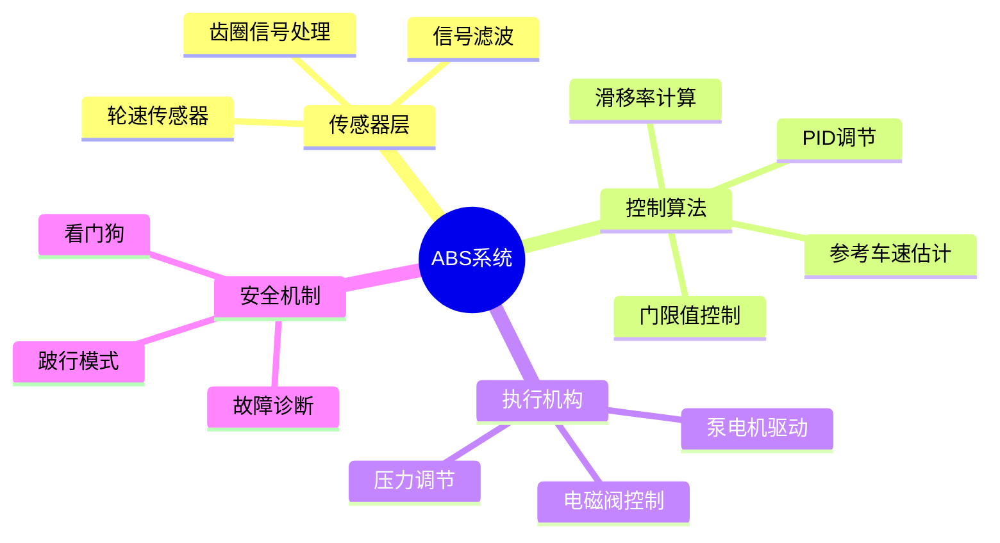

# ABS防抱死制动系统 - C语言实现

> **层级定位**: 04 Industrial Scenarios / 01 Automotive ABS
> **对应标准**: ISO 26262 ASIL-D, MISRA C:2012, AUTOSAR
> **难度级别**: L5 综合
> **预估学习时间**: 10-15 小时

---

## 📋 本节概要

| 属性 | 内容 |
|:-----|:-----|
| **核心概念** | 滑移率控制、轮速处理、压力调节、故障安全 |
| **前置知识** | 嵌入式C、实时系统、传感器信号处理 |
| **后续延伸** | ESC电子稳定控制、ADAS自动驾驶 |
| **权威来源** | ISO 26262-2018, Bosch ABS Handbook, SAE J2246 |

---

## 🧠 知识结构思维导图



---

## 📖 核心概念详解

### 1. ABS系统架构

```
┌─────────────────────────────────────────────────────────────────────┐
│                        ABS控制系统架构                               │
├─────────────────────────────────────────────────────────────────────┤
│                                                                      │
│   ┌──────────┐    ┌──────────┐    ┌──────────┐    ┌──────────┐      │
│   │ 左前轮速 │    │ 右前轮速 │    │ 左后轮速 │    │ 右后轮速 │      │
│   │ 传感器   │    │ 传感器   │    │ 传感器   │    │ 传感器   │      │
│   └────┬─────┘    └────┬─────┘    └────┬─────┘    └────┬─────┘      │
│        │               │               │               │            │
│        └───────────────┴───────┬───────┴───────────────┘            │
│                                ▼                                     │
│                    ┌─────────────────────┐                          │
│                    │    信号调理模块     │                          │
│                    │  滤波/整形/诊断     │                          │
│                    └──────────┬──────────┘                          │
│                               ▼                                      │
│                    ┌─────────────────────┐                          │
│                    │    ECU主控制器      │                          │
│                    │   (ISO 26262 ASIL-D)│                          │
│                    │                     │                          │
│                    │  • 滑移率计算       │                          │
│                    │  • 控制逻辑决策     │                          │
│                    │  • 故障诊断         │                          │
│                    └──────────┬──────────┘                          │
│                               ▼                                      │
│        ┌──────────────────────┼──────────────────────┐              │
│        │                      │                      │              │
│        ▼                      ▼                      ▼              │
│   ┌─────────┐           ┌─────────┐           ┌─────────┐          │
│   │进油阀   │           │出油阀   │           │泵电机   │          │
│   │(常开)   │           │(常闭)   │           │         │          │
│   └────┬────┘           └────┬────┘           └────┬────┘          │
│        │                      │                      │              │
│        └──────────────────────┴──────────────────────┘              │
│                               │                                      │
│                               ▼                                      │
│                    ┌─────────────────────┐                          │
│                    │      制动轮缸       │                          │
│                    │    (压力调节)       │                          │
│                    └─────────────────────┘                          │
│                                                                      │
└─────────────────────────────────────────────────────────────────────┘
```

### 2. 轮速信号处理

```c
// ============================================================================
// ABS轮速信号处理模块
// 符合: MISRA C:2012, ISO 26262 ASIL-D
// ============================================================================

#include <stdint.h>
#include <stdbool.h>
#include <math.h>

// 安全相关类型定义 (ISO 26262)
typedef uint32_t SafetyUint32;
typedef int32_t  SafetyInt32;
typedef float    SafetyFloat;

// 轮速传感器参数
#define WHEEL_SPEED_TEETH_NUM       48u     // 齿圈齿数
#define WHEEL_CIRCUMFERENCE_MM      2000u   // 轮胎周长(mm)
#define WHEEL_SPEED_MAX_HZ          2000u   // 最大频率(Hz)
#define WHEEL_SPEED_MIN_HZ          3u      // 最小频率(Hz) - 对应约3km/h
#define SAMPLE_PERIOD_MS            10u     // 采样周期(ms)

// 信号质量状态
typedef enum {
    SENSOR_OK = 0,
    SENSOR_OPEN_CIRCUIT,
    SENSOR_SHORT_CIRCUIT,
    SENSOR_NOISE_EXCESSIVE,
    SENSOR_SIGNAL_LOSS
} SensorStatus;

// 轮速数据结构
typedef struct {
    SafetyUint32 pulse_count;        // 脉冲计数
    SafetyUint32 pulse_period_us;    // 脉冲周期(us)
    SafetyUint32 last_capture_us;    // 上次捕获时间
    SafetyFloat wheel_speed_kmh;     // 轮速(km/h)
    SafetyFloat wheel_acceleration;  // 轮加速度(m/s²)
    SensorStatus status;             // 传感器状态
    uint8_t signal_quality;          // 信号质量(0-100)
} WheelSpeedSensor;

// 四通道轮速数据
typedef struct {
    WheelSpeedSensor fl;  // 左前
    WheelSpeedSensor fr;  // 右前
    WheelSpeedSensor rl;  // 左后
    WheelSpeedSensor rr;  // 右后
} WheelSpeedData;

// ============================================================================
// 轮速信号捕获 (ISR上下文)
// ============================================================================

// 捕获定时器值 (由硬件中断调用)
void wheel_speed_capture_isr(WheelSpeedSensor *sensor, uint32_t current_time_us) {
    // 计算周期
    uint32_t period = current_time_us - sensor->last_capture_us;

    // 合理性检查
    if (period > 1000u && period < 500000u) {  // 2kHz ~ 2Hz
        sensor->pulse_period_us = period;
        sensor->pulse_count++;
        sensor->signal_quality = 100u;
    } else {
        // 信号异常
        sensor->signal_quality = (sensor->signal_quality > 10u) ?
                                  sensor->signal_quality - 10u : 0u;
    }

    sensor->last_capture_us = current_time_us;
}

// ============================================================================
// 数字滤波器 (一阶低通)
// ============================================================================

#define FILTER_ALPHA        0.3f    // 滤波系数 (0-1)
#define SIGNAL_TIMEOUT_MS   200u    // 信号超时

static inline float low_pass_filter(float current, float previous) {
    return FILTER_ALPHA * current + (1.0f - FILTER_ALPHA) * previous;
}

// 中值滤波 (去除毛刺)
float median_filter_3(float a, float b, float c) {
    if (a > b) {
        if (b > c) return b;
        if (a > c) return c;
        return a;
    } else {
        if (a > c) return a;
        if (b > c) return c;
        return b;
    }
}

// ============================================================================
// 轮速计算 (10ms周期任务)
// ============================================================================

void calculate_wheel_speed(WheelSpeedSensor *sensor, uint32_t current_time_us) {
    // 检查信号超时
    uint32_t elapsed = current_time_us - sensor->last_capture_us;

    if (elapsed > (SIGNAL_TIMEOUT_MS * 1000u)) {
        // 信号丢失
        sensor->wheel_speed_kmh = 0.0f;
        sensor->status = SENSOR_SIGNAL_LOSS;
        return;
    }

    // 计算瞬时速度: v = (周长 * 频率) / 齿数
    // v(km/h) = (2000mm * 3600s/h) / (齿数 * 周期us)
    //         = 7200000 / (48 * 周期us)
    //         = 150000 / 周期us

    float instant_speed = 0.0f;
    if (sensor->pulse_period_us > 0u) {
        instant_speed = 150000.0f / (float)sensor->pulse_period_us;
    }

    // 限幅
    if (instant_speed > 300.0f) instant_speed = 300.0f;

    // 应用滤波
    float previous_speed = sensor->wheel_speed_kmh;
    sensor->wheel_speed_kmh = low_pass_filter(instant_speed, previous_speed);

    // 计算加速度 (m/s²)
    // a = (v_new - v_old) / (3.6 * dt)
    sensor->wheel_acceleration =
        (sensor->wheel_speed_kmh - previous_speed) / (3.6f * 0.01f);

    // 更新状态
    if (sensor->signal_quality < 30u) {
        sensor->status = SENSOR_NOISE_EXCESSIVE;
    } else {
        sensor->status = SENSOR_OK;
    }
}

// ============================================================================
// 传感器诊断 (50ms周期)
// ============================================================================

void diagnose_wheel_sensor(WheelSpeedSensor *sensor) {
    static uint32_t last_pulse_count = 0;
    static uint8_t stuck_counter = 0;

    // 检测信号 stuck
    if (sensor->pulse_count == last_pulse_count) {
        stuck_counter++;
        if (stuck_counter > 20) {  // 200ms无变化
            sensor->status = SENSOR_SIGNAL_LOSS;
        }
    } else {
        stuck_counter = 0;
    }

    last_pulse_count = sensor->pulse_count;

    // 电气故障检测 (需ADC读取传感器电压)
    // if (sensor_voltage > OPEN_CIRCUIT_THRESHOLD) {
    //     sensor->status = SENSOR_OPEN_CIRCUIT;
    // }
}
```

### 3. 滑移率计算与参考车速估计

```c
// ============================================================================
// 滑移率计算与参考车速估计
// ============================================================================

#define SLIP_RATIO_THRESHOLD_LOW    0.10f   // 低滑移率阈值
#define SLIP_RATIO_THRESHOLD_HIGH   0.30f   // 高滑移率阈值 (抱死临界)
#define DECELERATION_LIMIT_MSS      10.0f   // 最大减速度限制(m/s²)
#define ACCELERATION_LIMIT_MSS      5.0f    // 最大加速度限制

// 参考车速估计器
typedef struct {
    SafetyFloat ref_speed_kmh;       // 参考车速
    SafetyFloat ref_acceleration;    // 参考加速度
    uint8_t confidence_level;        // 估计置信度(0-100)
    bool is_estimated;               // 是否为估计值
} ReferenceSpeedEstimator;

// 车辆动力学状态
typedef struct {
    SafetyFloat slip_ratio_fl;       // 各轮滑移率
    SafetyFloat slip_ratio_fr;
    SafetyFloat slip_ratio_rl;
    SafetyFloat slip_ratio_rr;
    SafetyFloat vehicle_speed;       // 车速估计
    SafetyFloat vehicle_decel;       // 车辆减速度
} VehicleDynamics;

// ============================================================================
// 滑移率计算
// 滑移率 λ = (V_ref - V_wheel) / V_ref * 100%
// λ = 0: 纯滚动
// λ = 100%: 完全抱死
// 最佳制动区: λ = 10%-20%
// ============================================================================

float calculate_slip_ratio(float vehicle_speed, float wheel_speed) {
    if (vehicle_speed < 1.0f) {
        return 0.0f;  // 车速过低，不计算滑移率
    }

    float slip = (vehicle_speed - wheel_speed) / vehicle_speed;

    // 限幅
    if (slip < 0.0f) slip = 0.0f;
    if (slip > 1.0f) slip = 1.0f;

    return slip;
}

// ============================================================================
// 参考车速估计 (选择轮速最大法 + 加速度约束)
// ============================================================================

void estimate_reference_speed(ReferenceSpeedEstimator *est,
                               const WheelSpeedData *wheels,
                               uint32_t dt_ms) {
    // 选择最大轮速作为参考
    float max_wheel_speed = wheels->fl.wheel_speed_kmh;
    max_wheel_speed = fmaxf(max_wheel_speed, wheels->fr.wheel_speed_kmh);
    max_wheel_speed = fmaxf(max_wheel_speed, wheels->rl.wheel_speed_kmh);
    max_wheel_speed = fmaxf(max_wheel_speed, wheels->rr.wheel_speed_kmh);

    // 计算加速度约束
    float dt_s = dt_ms / 1000.0f;
    float max_decel_change = DECELERATION_LIMIT_MSS * dt_s * 3.6f;  // km/h
    float max_accel_change = ACCELERATION_LIMIT_MSS * dt_s * 3.6f;

    float predicted_speed = est->ref_speed_kmh + est->ref_acceleration * dt_s;

    // 融合测量和预测
    float new_ref_speed;
    if (max_wheel_speed < predicted_speed - max_decel_change) {
        // 轮速下降过快，使用约束减速度
        new_ref_speed = predicted_speed - max_decel_change;
        est->is_estimated = true;
    } else if (max_wheel_speed > predicted_speed + max_accel_change) {
        // 轮速上升过快，使用约束加速度
        new_ref_speed = predicted_speed + max_accel_change;
        est->is_estimated = true;
    } else {
        // 正常情况，使用轮速
        new_ref_speed = max_wheel_speed;
        est->is_estimated = false;
    }

    // 更新加速度估计
    est->ref_acceleration = (new_ref_speed - est->ref_speed_kmh) / dt_s;
    est->ref_speed_kmh = new_ref_speed;

    // 更新置信度
    if (est->is_estimated) {
        est->confidence_level = (est->confidence_level > 5) ?
                                 est->confidence_level - 5 : 0;
    } else {
        est->confidence_level = (est->confidence_level < 95) ?
                                 est->confidence_level + 5 : 100;
    }
}

// ============================================================================
// 车辆动力学更新
// ============================================================================

void update_vehicle_dynamics(VehicleDynamics *dyn,
                              const WheelSpeedData *wheels,
                              const ReferenceSpeedEstimator *ref) {
    float v_ref = ref->ref_speed_kmh;

    dyn->slip_ratio_fl = calculate_slip_ratio(v_ref, wheels->fl.wheel_speed_kmh);
    dyn->slip_ratio_fr = calculate_slip_ratio(v_ref, wheels->fr.wheel_speed_kmh);
    dyn->slip_ratio_rl = calculate_slip_ratio(v_ref, wheels->rl.wheel_speed_kmh);
    dyn->slip_ratio_rr = calculate_slip_ratio(v_ref, wheels->rr.wheel_speed_kmh);

    dyn->vehicle_speed = v_ref;
    dyn->vehicle_decel = -ref->ref_acceleration / 3.6f;  // 转换为m/s²
}
```

### 4. ABS控制逻辑

```c
// ============================================================================
// ABS控制逻辑 - 门限值控制算法
// 基于Bosch ABS控制策略
// ============================================================================

// 控制状态
typedef enum {
    ABS_INACTIVE = 0,        // ABS未激活
    ABS_PRESSURE_HOLD,       // 保压
    ABS_PRESSURE_DECREASE,   // 减压
    ABS_PRESSURE_INCREASE    // 增压
} ABSControlState;

// 电磁阀控制
typedef enum {
    VALVE_OPEN = 0,          // 阀开启
    VALVE_CLOSE = 1          // 阀关闭
} ValveState;

// 单个轮缸控制通道
typedef struct {
    ABSControlState state;           // 当前状态
    ABSControlState last_state;      // 上次状态
    uint16_t pressure_hold_time;     // 保压时间计数
    uint16_t pressure_dec_time;      // 减压时间计数
    uint16_t pressure_inc_time;      // 增压时间计数
    uint8_t cycle_count;             // 控制循环计数
    bool is_active;                  // 该轮ABS激活
} ABSChannel;

// 控制参数 (可调)
typedef struct {
    float slip_threshold_enter;      // 进入ABS滑移率阈值
    float slip_threshold_exit;       // 退出ABS滑移率阈值
    float decel_threshold;           // 减速度阈值(m/s²)
    uint16_t min_hold_time_ms;       // 最小保压时间
    uint16_t min_dec_time_ms;        // 最小减压时间
    uint16_t max_inc_time_ms;        // 最大增压时间
} ABSParameters;

// 默认参数
const ABSParameters abs_default_params = {
    .slip_threshold_enter = 0.20f,   // 20%滑移率进入ABS
    .slip_threshold_exit = 0.10f,    // 10%滑移率退出
    .decel_threshold = -8.0f,        // -8m/s²
    .min_hold_time_ms = 20,          // 20ms
    .min_dec_time_ms = 20,           // 20ms
    .max_inc_time_ms = 100           // 100ms
};

// 四通道ABS控制器
typedef struct {
    ABSChannel channel_fl;
    ABSChannel channel_fr;
    ABSChannel channel_rl;
    ABSChannel channel_rr;
    ABSParameters params;
    bool abs_enabled;                // ABS使能
    bool fault_present;              // 故障存在
} ABSController;

// ============================================================================
// 单通道ABS控制逻辑 (10ms周期)
// ============================================================================

void abs_channel_control(ABSChannel *ch,
                          float slip_ratio,
                          float wheel_decel,
                          const ABSParameters *params,
                          uint8_t dt_ms) {

    // 状态机转换
    switch (ch->state) {
        case ABS_INACTIVE:
            if (!ch->is_active) {
                // 检查是否需要激活ABS
                if (slip_ratio > params->slip_threshold_enter ||
                    wheel_decel < params->decel_threshold) {
                    ch->is_active = true;
                    ch->state = ABS_PRESSURE_HOLD;
                    ch->cycle_count = 0;
                }
            }
            break;

        case ABS_PRESSURE_HOLD:
            ch->pressure_hold_time += dt_ms;

            // 保压足够时间后，根据滑移率决定下一步
            if (ch->pressure_hold_time >= params->min_hold_time_ms) {
                if (slip_ratio > params->slip_threshold_enter + 0.05f) {
                    // 滑移率仍高，需要减压
                    ch->state = ABS_PRESSURE_DECREASE;
                    ch->pressure_dec_time = 0;
                } else if (slip_ratio < params->slip_threshold_exit) {
                    // 滑移率低，可以增压
                    ch->state = ABS_PRESSURE_INCREASE;
                    ch->pressure_inc_time = 0;
                }
                ch->pressure_hold_time = 0;
            }
            break;

        case ABS_PRESSURE_DECREASE:
            ch->pressure_dec_time += dt_ms;

            // 减压足够后转为保压
            if (ch->pressure_dec_time >= params->min_dec_time_ms) {
                ch->state = ABS_PRESSURE_HOLD;
                ch->pressure_hold_time = 0;
                ch->cycle_count++;
            }

            // 紧急情况下延长减压
            if (wheel_decel < params->decel_threshold - 3.0f) {
                ch->pressure_dec_time = 0;  // 重置计时器，继续减压
            }
            break;

        case ABS_PRESSURE_INCREASE:
            ch->pressure_inc_time += dt_ms;

            // 增压过程中监控滑移率
            if (slip_ratio > params->slip_threshold_enter) {
                // 滑移率再次升高，回到保压
                ch->state = ABS_PRESSURE_HOLD;
                ch->pressure_hold_time = 0;
            } else if (ch->pressure_inc_time >= params->max_inc_time_ms) {
                // 增压时间过长，检查是否退出ABS
                if (slip_ratio < params->slip_threshold_exit &&
                    wheel_decel > params->decel_threshold + 2.0f) {
                    ch->state = ABS_INACTIVE;
                    ch->is_active = false;
                } else {
                    ch->state = ABS_PRESSURE_HOLD;
                    ch->pressure_hold_time = 0;
                }
            }
            break;
    }

    ch->last_state = ch->state;
}

// ============================================================================
// 电磁阀驱动输出
// ============================================================================

typedef struct {
    ValveState inlet_valve;      // 进油阀 (常开)
    ValveState outlet_valve;     // 出油阀 (常闭)
    bool pump_motor;             // 泵电机
} ValveOutputs;

void get_valve_outputs(const ABSChannel *ch, ValveOutputs *out) {
    switch (ch->state) {
        case ABS_INACTIVE:
            out->inlet_valve = VALVE_OPEN;    // 正常制动
            out->outlet_valve = VALVE_CLOSE;
            out->pump_motor = false;
            break;

        case ABS_PRESSURE_HOLD:
            out->inlet_valve = VALVE_CLOSE;   // 保压
            out->outlet_valve = VALVE_CLOSE;
            out->pump_motor = ch->cycle_count > 0;  // 循环中保持泵运转
            break;

        case ABS_PRESSURE_DECREASE:
            out->inlet_valve = VALVE_CLOSE;   // 减压
            out->outlet_valve = VALVE_OPEN;
            out->pump_motor = true;           // 泵运转抽取制动液
            break;

        case ABS_PRESSURE_INCREASE:
            out->inlet_valve = VALVE_OPEN;    // 增压
            out->outlet_valve = VALVE_CLOSE;
            out->pump_motor = false;
            break;
    }
}
```

### 5. 故障诊断与安全机制

```c
// ============================================================================
// ABS故障诊断与安全机制
// 符合ISO 26262 ASIL-D要求
// ============================================================================

// 故障类型
typedef enum {
    FAULT_NONE = 0,
    FAULT_SENSOR_FL,         // 左前轮速传感器故障
    FAULT_SENSOR_FR,         // 右前轮速传感器故障
    FAULT_SENSOR_RL,         // 左后轮速传感器故障
    FAULT_SENSOR_RR,         // 右后轮速传感器故障
    FAULT_VALVE_INLET_FL,    // 进油阀故障
    FAULT_VALVE_OUTLET_FL,   // 出油阀故障
    FAULT_PUMP_MOTOR,        // 泵电机故障
    FAULT_ECU_INTERNAL,      // ECU内部故障
    FAULT_POWER_SUPPLY,      // 电源故障
    FAULT_COMMUNICATION      // 通信故障
} ABSFaultType;

// 故障严重程度
typedef enum {
    SEVERITY_NONE = 0,
    SEVERITY_WARNING,        // 警告，ABS仍可工作
    SEVERITY_DEGRADED,       // 降级模式
    SEVERITY_CRITICAL        // 系统关闭
} FaultSeverity;

// 故障记录
typedef struct {
    ABSFaultType type;
    FaultSeverity severity;
    uint32_t occurrence_count;
    uint32_t first_time;
    uint32_t last_time;
    bool is_active;
} FaultRecord;

#define MAX_FAULT_RECORDS 16

typedef struct {
    FaultRecord records[MAX_FAULT_RECORDS];
    uint8_t fault_count;
    bool system_degraded;
    bool system_disabled;
} FaultManager;

// ============================================================================
// 故障检测
// ============================================================================

void diagnose_abs_system(ABSController *abs,
                          const WheelSpeedData *wheels,
                          FaultManager *fm) {

    // 传感器故障检测
    if (wheels->fl.status != SENSOR_OK) {
        report_fault(fm, FAULT_SENSOR_FL, SEVERITY_DEGRADED);
    }
    if (wheels->fr.status != SENSOR_OK) {
        report_fault(fm, FAULT_SENSOR_FR, SEVERITY_DEGRADED);
    }
    if (wheels->rl.status != SENSOR_OK) {
        report_fault(fm, FAULT_SENSOR_RL, SEVERITY_WARNING);
    }
    if (wheels->rr.status != SENSOR_OK) {
        report_fault(fm, FAULT_SENSOR_RR, SEVERITY_WARNING);
    }

    // 合理性检查: 对角轮速差异过大
    float front_diff = fabsf(wheels->fl.wheel_speed_kmh - wheels->fr.wheel_speed_kmh);
    float rear_diff = fabsf(wheels->rl.wheel_speed_kmh - wheels->rr.wheel_speed_kmh);

    if (front_diff > 50.0f || rear_diff > 50.0f) {
        // 可能的轮胎尺寸不一致或传感器故障
        report_fault(fm, FAULT_ECU_INTERNAL, SEVERITY_WARNING);
    }

    // 阀自检 (上电时执行)
    // 检测阀电阻、响应时间
}

// ============================================================================
// 故障处理
// ============================================================================

void report_fault(FaultManager *fm, ABSFaultType type, FaultSeverity severity) {
    // 查找是否已存在
    for (int i = 0; i < fm->fault_count; i++) {
        if (fm->records[i].type == type) {
            fm->records[i].occurrence_count++;
            fm->records[i].last_time = get_system_tick();
            fm->records[i].is_active = true;
            return;
        }
    }

    // 新故障
    if (fm->fault_count < MAX_FAULT_RECORDS) {
        FaultRecord *rec = &fm->records[fm->fault_count++];
        rec->type = type;
        rec->severity = severity;
        rec->occurrence_count = 1;
        rec->first_time = get_system_tick();
        rec->last_time = rec->first_time;
        rec->is_active = true;
    }

    // 更新系统状态
    if (severity >= SEVERITY_DEGRADED) {
        fm->system_degraded = true;
    }
    if (severity >= SEVERITY_CRITICAL) {
        fm->system_disabled = true;
    }
}

// ============================================================================
// 跛行模式 (Limp Home)
// ============================================================================

void enter_limp_home_mode(ABSController *abs, const FaultManager *fm) {
    // 关闭ABS功能，保留常规制动
    abs->abs_enabled = false;

    // 打开所有阀，确保常规制动通路
    // 关闭泵电机

    // 点亮ABS故障灯
    set_abs_warning_lamp(true);

    // 记录故障码到非易失存储
    store_dtc_to_eeprom(fm);
}

// ============================================================================
// 看门狗和Safety Monitor
// ============================================================================

#define WATCHDOG_TIMEOUT_MS     50
#define SAFETY_MONITOR_PERIOD   10

typedef struct {
    uint32_t last_feed_time;
    uint8_t missed_count;
    bool fault_detected;
} SafetyWatchdog;

void safety_monitor_task(ABSController *abs, SafetyWatchdog *wd) {
    static uint32_t cycle_count = 0;

    // 喂狗
    feed_hardware_watchdog();
    wd->last_feed_time = get_system_tick();

    // 周期自检
    if (++cycle_count >= 10) {  // 100ms
        cycle_count = 0;

        // 检查RAM/ROM完整性
        // 检查堆栈溢出
        // 检查任务执行时间

        if (wd->fault_detected) {
            wd->missed_count++;
            if (wd->missed_count >= 3) {
                // 触发安全状态
                trigger_safe_state(abs);
            }
        }
    }
}

void trigger_safe_state(ABSController *abs) {
    // 紧急状态: 关闭ABS，保持常规制动
    abs->abs_enabled = false;
    abs->fault_present = true;

    // 设置所有通道为非活动
    abs->channel_fl.state = ABS_INACTIVE;
    abs->channel_fr.state = ABS_INACTIVE;
    abs->channel_rl.state = ABS_INACTIVE;
    abs->channel_rr.state = ABS_INACTIVE;

    // 通知驾驶员
    set_abs_warning_lamp(true);

    // 尝试系统复位
    // system_reset();
}
```

---

## ⚠️ 常见陷阱

### 陷阱 ABS01: 浮点精度在ISR中使用

```c
// ❌ 错误: 在ISR中进行浮点运算
void timer_isr(void) {
    float speed = calculate_speed();  // 危险！破坏FPU状态
}

// ✅ 正确: ISR只记录原始数据，浮点运算在主循环
void timer_isr(void) {
    raw_capture = capture_timer_value();  // 仅记录
}

void main_loop(void) {
    float speed = calculate_speed(raw_capture);  // 安全计算
}
```

### 陷阱 ABS02: 除零风险

```c
// ❌ 危险: 可能除以零
float slip = (v_ref - v_wheel) / v_ref;

// ✅ 安全: 检查除数
float slip = 0.0f;
if (v_ref > 1.0f) {
    slip = (v_ref - v_wheel) / v_ref;
}
```

### 陷阱 ABS03: 传感器信号抖动

```c
// ❌ 直接控制会导致阀频繁开关
if (slip > threshold) decrease_pressure();
else increase_pressure();

// ✅ 使用状态机和死区
if (slip > threshold_high && state != DECREASING) {
    state = DECREASING;
} else if (slip < threshold_low && state != INCREASING) {
    state = INCREASING;
}
```

### 陷阱 ABS04: 内存越界

```c
// ❌ 数组访问无边界检查
float speeds[4];
speeds[wheel_id] = new_speed;  // wheel_id可能>=4

// ✅ 安全检查
if (wheel_id < 4) {
    speeds[wheel_id] = new_speed;
} else {
    log_error(ERR_INVALID_WHEEL_ID);
}
```

---

## ✅ 质量验收清单

| 检查项 | 要求 | 状态 |
|:-------|:-----|:----:|
| **功能安全** |||
| ISO 26262 ASIL-D合规 | 符合功能安全要求 | ☐ |
| 故障检测覆盖率 | >99%诊断覆盖率 | ☐ |
| 故障响应时间 | <50ms | ☐ |
| 看门狗保护 | 硬件看门狗+软件监控 | ☐ |
| **代码质量** |||
| MISRA C:2012合规 | 通过静态检查 | ☐ |
| 圈复杂度 | 函数CCN<15 | ☐ |
| 单元测试覆盖率 | >90%语句覆盖 | ☐ |
| 浮点运算安全 | 无除零/溢出 | ☐ |
| **性能** |||
| 控制周期 | 10ms确定性 | ☐ |
| 中断延迟 | <10μs | ☐ |
| 内存使用 | <80%RAM | ☐ |
| **测试验证** |||
| HIL台架测试 | 通过全部测试用例 | ☐ |
| 实车道路测试 | 各种路面条件 | ☐ |
| 故障注入测试 | 单点故障全覆盖 | ☐ |

---

## 📚 参考标准与延伸阅读

| 资源 | 说明 |
|:-----|:-----|
| ISO 26262-2018 | 道路车辆功能安全标准 |
| MISRA C:2012 | 汽车软件C语言编码规范 |
| AUTOSAR Classic | 汽车软件架构标准 |
| SAE J2246 | 防抱死制动系统测试标准 |
| Bosch Automotive Handbook | ABS系统权威参考书 |
| FMVSS 135 | 美国联邦机动车安全标准 |

---

> **更新记录**
>
> - 2025-03-09: 初版创建，包含完整ABS系统实现
