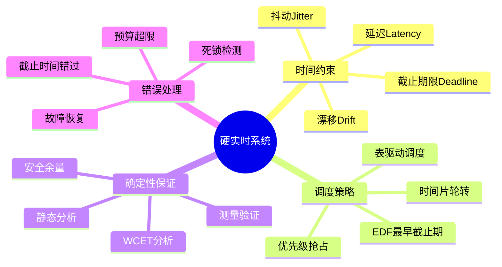

# 汽车硬实时约束与确定性执行

> **层级定位**: 04 Industrial Scenarios / 01 Automotive ABS
> **对应标准**: ISO 26262 ASIL-D, AUTOSAR OS, OSEK/VDX
> **难度级别**: L5 综合
> **预估学习时间**: 8-12 小时

---

## 📋 本节概要

| 属性 | 内容 |
|:-----|:-----|
| **核心概念** | 确定性调度、最坏执行时间分析、时钟同步、时间保护 |
| **前置知识** | 实时操作系统、中断处理、嵌入式C |
| **后续延伸** | 多核实时系统、时间触发架构(TTA) |
| **权威来源** | ISO 26262-2018, AUTOSAR OS spec, OSEK/VDX |

---


---

## 📑 目录

- [汽车硬实时约束与确定性执行](#汽车硬实时约束与确定性执行)
  - [📋 本节概要](#-本节概要)
  - [📑 目录](#-目录)
  - [🧠 知识结构思维导图](#-知识结构思维导图)
  - [📖 核心概念详解](#-核心概念详解)
    - [1. 实时任务模型](#1-实时任务模型)
    - [2. 时间保护机制](#2-时间保护机制)
    - [3. 确定性调度器实现](#3-确定性调度器实现)
    - [4. 中断管理与延迟分析](#4-中断管理与延迟分析)
    - [5. 时钟同步与时间戳](#5-时钟同步与时间戳)
  - [⚠️ 常见陷阱](#️-常见陷阱)
    - [陷阱 RT01: 优先级反转](#陷阱-rt01-优先级反转)
    - [陷阱 RT02: 中断延迟累积](#陷阱-rt02-中断延迟累积)
    - [陷阱 RT03: 浮点运算的非确定性](#陷阱-rt03-浮点运算的非确定性)
    - [陷阱 RT04: 缓存未命中](#陷阱-rt04-缓存未命中)
    - [陷阱 RT05: 调度抖动](#陷阱-rt05-调度抖动)
  - [✅ 质量验收清单](#-质量验收清单)
  - [📚 参考标准与延伸阅读](#-参考标准与延伸阅读)
  - [深入理解](#深入理解)
    - [核心原理](#核心原理)
    - [实践应用](#实践应用)
    - [最佳实践](#最佳实践)


---

## 🧠 知识结构思维导图



---

## 📖 核心概念详解

### 1. 实时任务模型

```c
// ============================================================================
// 汽车ECU实时任务模型
// 符合AUTOSAR OS和OSEK/VDX标准
// ============================================================================

#include <stdint.h>
#include <stdbool.h>

// 任务优先级定义 (OSEK/VDX标准)
// 数值越小优先级越高
typedef enum {
    PRIORITY_IDLE = 63,         // 最低优先级 - 后台任务
    PRIORITY_DIAGNOSTIC = 40,   // 诊断任务
    PRIORITY_LOGGING = 30,      // 日志记录
    PRIORITY_COMMUNICATION = 20,// 通信任务 (CAN/LIN)
    PRIORITY_CONTROL = 10,      // 控制算法
    PRIORITY_SENSORS = 5,       // 传感器采集
    PRIORITY_SAFETY = 1,        // 安全监控
    PRIORITY_ISR = 0            // 中断服务 (最高)
} TaskPriority;

// 任务类型
typedef enum {
    TASK_BASIC,     // 基本任务 - 单次执行完成
    TASK_EXTENDED   // 扩展任务 - 可等待事件
} TaskType;

// 任务调度策略
typedef enum {
    SCHEDULE_FULL,      // 完全抢占
    SCHEDULE_NON        // 非抢占
} TaskSchedule;

// 任务状态
typedef enum {
    TASK_RUNNING,       // 正在运行
    TASK_READY,         // 就绪等待
    TASK_WAITING,       // 等待事件
    TASK_SUSPENDED,     // 挂起
    TASK_TERMINATED     // 终止
} TaskState;

// 任务控制块
typedef struct {
    uint16_t task_id;           // 任务ID
    TaskPriority priority;      // 当前优先级
    TaskPriority base_priority; // 基础优先级
    TaskState state;            // 当前状态
    TaskType type;              // 任务类型

    // 时间参数 (单位: ms)
    uint16_t period;            // 周期 (0=非周期)
    uint16_t offset;            // 相位偏移
    uint16_t deadline;          // 相对截止期限
    uint16_t wcet;              // 最坏执行时间

    // 运行时统计
    uint32_t last_start_time;   // 上次启动时间
    uint32_t last_finish_time;  // 上次完成时间
    uint32_t execution_count;   // 执行次数
    uint32_t deadline_misses;   // 截止时间错过次数

    // 栈信息
    uint8_t *stack_base;
    uint16_t stack_size;

    // 任务入口
    void (*entry_point)(void);
} TaskControlBlock;

// 任务配置表 (设计时静态配置)
typedef struct {
    uint16_t task_id;
    TaskPriority priority;
    TaskType type;
    uint16_t period_ms;
    uint16_t offset_ms;
    uint16_t deadline_ms;
    uint16_t wcet_ms;
    uint16_t stack_size;
    void (*entry)(void);
} TaskConfig;

// ============================================================================
// 汽车ABS典型任务配置
// ============================================================================

const TaskConfig abs_task_configs[] = {
    // 任务ID, 优先级, 类型, 周期, 偏移, 截止期, WCET, 栈大小, 入口
    { 1, PRIORITY_ISR,      TASK_BASIC,   0,   0,   1,   0,   256,  NULL },  // 中断聚合
    { 2, PRIORITY_SAFETY,   TASK_BASIC,   5,   0,   5,   1,   512,  safety_monitor_task },
    { 3, PRIORITY_SENSORS,  TASK_BASIC,  10,   0,  10,   2,   512,  sensor_acquisition_task },
    { 4, PRIORITY_CONTROL,  TASK_BASIC,  10,   2,  10,   3,   1024, abs_control_task },
    { 5, PRIORITY_CONTROL,  TASK_BASIC,  20,   5,  20,   5,   512,  reference_speed_task },
    { 6, PRIORITY_COMMUNICATION, TASK_BASIC, 50, 10, 50, 3, 512,  can_tx_task },
    { 7, PRIORITY_DIAGNOSTIC, TASK_EXTENDED, 100, 0, 100, 10, 512, diagnostic_task },
    { 8, PRIORITY_LOGGING,  TASK_BASIC,  1000, 0, 1000, 5, 512,  data_logging_task },
};
#define NUM_TASKS (sizeof(abs_task_configs) / sizeof(TaskConfig))
```

### 2. 时间保护机制

```c
// ============================================================================
// 时间保护 - 防止任务超时影响系统
// 符合ISO 26262时间保护要求
// ============================================================================

// 时间预算控制
typedef struct {
    uint32_t budget_us;         // 分配的时间预算
    uint32_t consumed_us;       // 已消耗时间
    uint32_t started_at_us;     // 开始时间
    bool budget_exhausted;      // 预算耗尽标志
} TimeBudget;

// 时间保护监控器
typedef struct {
    TimeBudget budgets[NUM_TASKS];
    uint32_t monitoring_period_us;
    void (*budget_violation_handler)(uint16_t task_id);
} TimeProtection;

// 硬件定时器接口 (假设1MHz计时)
#define TIMER_FREQ_HZ       1000000u
#define TIMER_TICK_US       1u

static inline uint32_t get_microseconds(void) {
    return read_hardware_timer() / (TIMER_FREQ_HZ / 1000000u);
}

// 启动任务时初始化预算
void time_budget_start(TimeProtection *tp, uint16_t task_id) {
    TimeBudget *budget = &tp->budgets[task_id];
    budget->started_at_us = get_microseconds();
    budget->consumed_us = 0;
    budget->budget_exhausted = false;
}

// 任务执行期间检查预算
bool time_budget_check(TimeProtection *tp, uint16_t task_id) {
    TimeBudget *budget = &tp->budgets[task_id];
    uint32_t now = get_microseconds();

    budget->consumed_us = now - budget->started_at_us;

    if (budget->consumed_us > budget->budget_us) {
        budget->budget_exhausted = true;
        return false;  // 预算耗尽
    }
    return true;  // 预算充足
}

// 预算违规处理
void handle_budget_violation(uint16_t task_id) {
    // 记录故障
    log_fault(FAULT_TASK_OVERRUN, task_id);

    // 根据任务重要性决定处理方式
    if (task_id <= PRIORITY_SAFETY) {
        // 关键任务超时 - 触发安全状态
        enter_safe_state();
    } else {
        // 非关键任务 - 终止并重启
        terminate_task(task_id);
    }
}

// ============================================================================
// 截止时间监控
// ============================================================================

typedef struct {
    uint32_t absolute_deadline;     // 绝对截止时间点
    uint32_t release_time;          // 释放时间
    bool deadline_monitoring;       // 是否启用监控
} DeadlineMonitor;

// 检查截止时间
bool check_deadline(const TaskControlBlock *tcb, const DeadlineMonitor *dm) {
    uint32_t now = get_microseconds() / 1000;  // 转换为ms

    if (now > dm->absolute_deadline) {
        // 截止时间错过
        ((TaskControlBlock*)tcb)->deadline_misses++;

        // 根据错过次数采取行动
        if (tcb->deadline_misses >= 3) {
            log_fault(FAULT_REPEATED_DEADLINE_MISS, tcb->task_id);
        }

        return false;
    }

    return true;
}

// ============================================================================
// 看门狗定时器管理
// ============================================================================

#define WATCHDOG_PERIOD_MS      50      // 看门狗周期
#define MAX_WDOG_MISSES         3       // 最大错过次数

typedef struct {
    uint32_t last_feed_ms;
    uint8_t miss_count;
    bool enabled;
} WatchdogManager;

void watchdog_init(WatchdogManager *wd) {
    wd->last_feed_ms = get_milliseconds();
    wd->miss_count = 0;
    wd->enabled = true;

    // 配置硬件看门狗
    configure_hardware_watchdog(WATCHDOG_PERIOD_MS);
}

void watchdog_feed(WatchdogManager *wd) {
    if (!wd->enabled) return;

    uint32_t now = get_milliseconds();
    uint32_t elapsed = now - wd->last_feed_ms;

    if (elapsed > WATCHDOG_PERIOD_MS) {
        wd->miss_count++;

        if (wd->miss_count >= MAX_WDOG_MISSES) {
            // 触发复位
            trigger_system_reset();
        }
    } else {
        wd->miss_count = 0;
    }

    wd->last_feed_ms = now;
    feed_hardware_watchdog();
}
```

### 3. 确定性调度器实现

```c
// ============================================================================
// 优先级抢占式调度器
// 固定优先级调度 (Rate Monotonic)
// ============================================================================

#define MAX_TASKS       32
#define IDLE_TASK_ID    0

// 就绪队列
typedef struct {
    TaskControlBlock *tasks[MAX_TASKS];
    uint8_t count;
} ReadyQueue;

// 调度器上下文
typedef struct {
    TaskControlBlock tcbs[MAX_TASKS];
    TaskControlBlock *current_task;
    TaskControlBlock *next_task;
    ReadyQueue ready_queue;
    uint32_t system_tick_ms;
    bool scheduling_locked;
} SchedulerContext;

// 调度锁 - 防止关键区被抢占
void lock_scheduling(SchedulerContext *ctx) {
    disable_interrupts();
    ctx->scheduling_locked = true;
}

void unlock_scheduling(SchedulerContext *ctx) {
    ctx->scheduling_locked = false;
    enable_interrupts();
    // 触发重新调度
    request_reschedule();
}

// ============================================================================
// 就绪队列管理 (按优先级排序)
// ============================================================================

void ready_queue_insert(ReadyQueue *rq, TaskControlBlock *tcb) {
    // 按优先级插入 (数值小的优先级高)
    int i;
    for (i = rq->count; i > 0; i--) {
        if (rq->tasks[i-1]->priority <= tcb->priority) {
            break;
        }
        rq->tasks[i] = rq->tasks[i-1];
    }
    rq->tasks[i] = tcb;
    rq->count++;
}

TaskControlBlock* ready_queue_get_highest(ReadyQueue *rq) {
    if (rq->count == 0) return NULL;
    return rq->tasks[0];
}

void ready_queue_remove(ReadyQueue *rq, TaskControlBlock *tcb) {
    for (int i = 0; i < rq->count; i++) {
        if (rq->tasks[i] == tcb) {
            for (int j = i; j < rq->count - 1; j++) {
                rq->tasks[j] = rq->tasks[j+1];
            }
            rq->count--;
            return;
        }
    }
}

// ============================================================================
// 调度决策
// ============================================================================

void schedule(SchedulerContext *ctx) {
    if (ctx->scheduling_locked) return;

    // 获取最高优先级就绪任务
    TaskControlBlock *highest = ready_queue_get_highest(&ctx->ready_queue);

    if (highest == NULL) {
        // 无就绪任务，运行空闲任务
        highest = &ctx->tcbs[IDLE_TASK_ID];
    }

    // 检查是否需要切换
    if (highest != ctx->current_task) {
        // 优先级比较
        if (ctx->current_task == NULL ||
            highest->priority < ctx->current_task->priority) {
            ctx->next_task = highest;
            context_switch(ctx);
        }
    }
}

// ============================================================================
// 上下文切换 (汇编实现或编译器内置)
// ============================================================================

void context_switch(SchedulerContext *ctx) {
    TaskControlBlock *from = ctx->current_task;
    TaskControlBlock *to = ctx->next_task;

    // 保存当前任务上下文
    if (from != NULL && from->state == TASK_RUNNING) {
        save_cpu_context(&from->stack_pointer);
        from->state = TASK_READY;
        ready_queue_insert(&ctx->ready_queue, from);
    }

    // 恢复新任务上下文
    ctx->current_task = to;
    to->state = TASK_RUNNING;
    ready_queue_remove(&ctx->ready_queue, to);

    // 更新时间统计
    to->last_start_time = ctx->system_tick_ms;

    // 恢复CPU上下文
    restore_cpu_context(&to->stack_pointer);
}

// 汇编实现示例 (概念)
/*
save_cpu_context:
    PUSH    R0-R12, LR
    STR     SP, [R0]        ; 保存栈指针到tcb
    BX      LR

restore_cpu_context:
    LDR     SP, [R0]        ; 恢复栈指针
    POP     R0-R12, LR
    BX      LR
*/
```

### 4. 中断管理与延迟分析

```c
// ============================================================================
// 中断管理 - 确保确定性响应
// ============================================================================

// 中断优先级 (ARM Cortex-M 示例)
// NVIC优先级数值越小优先级越高
typedef enum {
    IRQ_PRIORITY_CRITICAL = 0,      // 故障安全
    IRQ_PRIORITY_HIGH = 2,          // 传感器捕获
    IRQ_PRIORITY_MEDIUM = 5,        // 定时器
    IRQ_PRIORITY_LOW = 10,          // 通信
    IRQ_PRIORITY_LOWEST = 15        // 后台
} IRQPriority;

// 中断处理统计
typedef struct {
    uint32_t entry_time_us;
    uint32_t exit_time_us;
    uint32_t max_duration_us;
    uint32_t total_count;
    uint32_t total_duration_us;
} IRQStatistics;

IRQStatistics irq_stats[32];

// ============================================================================
// 中断入口/出口钩子
// ============================================================================

void irq_entry_hook(uint8_t irq_num) {
    irq_stats[irq_num].entry_time_us = get_microseconds();
    irq_stats[irq_num].total_count++;

    // 记录中断嵌套深度
    increment_irq_nesting();
}

void irq_exit_hook(uint8_t irq_num) {
    uint32_t exit_time = get_microseconds();
    uint32_t duration = exit_time - irq_stats[irq_num].entry_time_us;

    irq_stats[irq_num].exit_time_us = exit_time;
    irq_stats[irq_num].total_duration_us += duration;

    if (duration > irq_stats[irq_num].max_duration_us) {
        irq_stats[irq_num].max_duration_us = duration;
    }

    decrement_irq_nesting();
}

// ============================================================================
// 中断延迟测量
// ============================================================================

// 关键参数
#define MAX_IRQ_LATENCY_US      5       // 最大中断延迟要求
#define MAX_IRQ_DURATION_US     50      // 最大ISR执行时间

void measure_irq_latency(void) {
    // 使用GPIO翻转测试
    // 1. 设置GPIO触发中断
    // 2. 在ISR中翻转另一个GPIO
    // 3. 用示波器测量延迟

    // 软件测量方法
    volatile uint32_t start = get_microseconds();
    trigger_software_irq(15);  // 触发软件中断
    // ISR中会设置标志
    while (!irq_flag_set);     // 等待ISR执行
    volatile uint32_t end = get_microseconds();

    uint32_t latency = end - start;
    if (latency > MAX_IRQ_LATENCY_US) {
        log_warning(WARN_HIGH_IRQ_LATENCY, latency);
    }
}

// ============================================================================
// 任务调度延迟分析
// ============================================================================

void analyze_scheduling_latency(void) {
    // 调度延迟 = 中断响应 + 调度器执行 + 上下文切换

    // 典型值 (Cortex-M4 @ 100MHz)
    // 中断进入: 12 cycles = 0.12us
    // 中断退出: 12 cycles = 0.12us
    // 调度决策: ~50 cycles = 0.5us
    // 上下文保存: ~20 cycles = 0.2us
    // 上下文恢复: ~20 cycles = 0.2us
    // 总计: ~1us (理论最小值)

    // 实际考虑:
    // - 缓存未命中
    // - 总线竞争
    // - 内存访问等待
    // 实际: 5-20us
}
```

### 5. 时钟同步与时间戳

```c
// ============================================================================
// 高精度时间戳 - 用于事件排序和测量
// ============================================================================

// 64位时间戳 (防止32位溢出)
typedef union {
    uint64_t full;
    struct {
        uint32_t low;
        uint32_t high;
    } part;
} Timestamp;

// 全局时钟
typedef struct {
    Timestamp base_time;        // 基准时间
    uint32_t tick_rate_hz;      // 时钟频率
    uint32_t last_tick;         // 上次tick
    uint32_t overflow_count;    // 溢出计数
} GlobalClock;

// 获取当前时间戳 (线程安全)
Timestamp get_timestamp(GlobalClock *clk) {
    Timestamp ts;
    uint32_t tick = read_hardware_timer();

    disable_interrupts();

    ts.part.high = clk->overflow_count;
    ts.part.low = tick;

    // 检查是否刚溢出
    if (tick < clk->last_tick) {
        ts.part.high++;
    }

    enable_interrupts();

    return ts;
}

// 时间戳比较
bool timestamp_before(Timestamp a, Timestamp b) {
    return a.full < b.full;
}

uint64_t timestamp_diff_us(Timestamp a, Timestamp b, uint32_t freq_hz) {
    uint64_t diff_ticks = (a.full > b.full) ? (a.full - b.full) : (b.full - a.full);
    return (diff_ticks * 1000000ULL) / freq_hz;
}

// ============================================================================
// 分布式时钟同步 (用于多ECU系统)
// ============================================================================

#define SYNC_INTERVAL_MS    100
#define MAX_CLOCK_DRIFT_PPM 100     // 最大允许漂移 100ppm

typedef struct {
    uint32_t local_time;
    uint32_t master_time;
    int32_t offset;
    int32_t drift_ppm;
    bool synchronized;
} ClockSync;

void clock_sync_update(ClockSync *sync, uint32_t received_master_time) {
    uint32_t local = get_milliseconds();

    // 计算偏移
    sync->offset = (int32_t)(received_master_time - local);

    // 计算漂移
    if (sync->local_time != 0) {
        uint32_t elapsed_local = local - sync->local_time;
        uint32_t elapsed_master = received_master_time - sync->master_time;

        if (elapsed_local > 0) {
            sync->drift_ppm = (int32_t)((elapsed_master - elapsed_local) * 1000000LL / elapsed_local);
        }
    }

    sync->local_time = local;
    sync->master_time = received_master_time;

    // 检查漂移是否在允许范围
    if (abs(sync->drift_ppm) > MAX_CLOCK_DRIFT_PPM) {
        log_warning(WARN_CLOCK_DRIFT_EXCEEDED, sync->drift_ppm);
    }

    sync->synchronized = true;
}

// 获取同步后的时间
uint32_t get_synchronized_time(const ClockSync *sync) {
    return get_milliseconds() + sync->offset;
}
```

---

## ⚠️ 常见陷阱

### 陷阱 RT01: 优先级反转

```c
// ❌ 问题: 低优先级任务持有高优先级任务需要的资源
// 导致中等优先级任务抢占低优先级任务，高优先级任务被延迟

// ✅ 解决方案1: 优先级继承
void mutex_lock(PriorityMutex *m) {
    disable_interrupts();
    if (m->owner == NULL) {
        m->owner = current_task;
    } else {
        // 将资源持有者的优先级提升
        if (m->owner->priority > current_task->priority) {
            m->owner->priority = current_task->priority;
            m->priority_raised = true;
        }
        // 将当前任务加入等待队列
        add_to_wait_queue(current_task, m);
        block_task();
    }
    enable_interrupts();
}

void mutex_unlock(PriorityMutex *m) {
    disable_interrupts();
    if (m->priority_raised) {
        // 恢复原始优先级
        m->owner->priority = m->owner->base_priority;
        m->priority_raised = false;
    }
    // 唤醒等待队列中的任务
    wake_highest_waiter(m);
    m->owner = NULL;
    enable_interrupts();
}

// ✅ 解决方案2: 优先级天花板
void mutex_lock_ceiling(PriorityMutex *m) {
    disable_interrupts();
    // 直接提升到天花板优先级
    uint8_t old_priority = current_task->priority;
    current_task->priority = m->ceiling_priority;

    // 获取资源
    // ...

    current_task->saved_priority = old_priority;
    enable_interrupts();
}
```

### 陷阱 RT02: 中断延迟累积

```c
// ❌ 在ISR中执行耗时操作
void timer_isr(void) {
    process_sensor_data();      // 50us
    update_control_algorithm(); // 200us - 太长了!
    communicate_with_other_ecu(); // 1ms - 绝对不行!
}

// ✅ ISR只处理最紧急的事，其余交给任务
void timer_isr(void) {
    // 仅读取硬件寄存器并记录时间戳
    capture_sensor_timestamp();
    // 通知任务处理
    set_event_flag(EV_SENSOR_READY);
}

void sensor_task(void) {
    while (1) {
        wait_event(EV_SENSOR_READY);
        process_sensor_data();
        update_control_algorithm();
    }
}
```

### 陷阱 RT03: 浮点运算的非确定性

```c
// ❌ 浮点运算时间不确定 (取决于数值)
float result = sqrtf(x);  // 执行时间变化大

// ✅ 使用查表或定点数
// 预计算sqrt表
const float sqrt_table[256] = { /* ... */ };
float result = sqrt_table[(uint8_t)(x * 255)];

// 或使用Q15/Q31定点数
int32_t fixed_sqrt(int32_t x);  // 确定性的迭代算法
```

### 陷阱 RT04: 缓存未命中

```c
// ❌ 数据访问模式导致频繁缓存未命中
for (int i = 0; i < 1000; i++) {
    process(data[i * 64]);  // 跳跃访问，每次都在不同缓存行
}

// ✅ 顺序访问，充分利用缓存
for (int i = 0; i < 1000; i++) {
    process(data[i]);  // 连续访问
}

// ✅ 关键代码和数据锁定在缓存
void lock_critical_code_in_cache(void) {
    // 将关键函数预取到缓存
    prefetch_code(safety_critical_function, function_size);
    // 锁定缓存行
    lock_cache_lines(cache_set);
}
```

### 陷阱 RT05: 调度抖动

```c
// ❌ 直接OS延迟可能不准确
void task(void) {
    while (1) {
        do_work();
        os_delay(10);  // 实际间隔可能>10ms
    }
}

// ✅ 使用绝对时间调度
void deterministic_task(void) {
    uint32_t next_wakeup = get_tick();
    while (1) {
        do_work();
        next_wakeup += 10;  // 绝对时间
        sleep_until(next_wakeup);  // 等待到指定时间点
    }
}
```

---

## ✅ 质量验收清单

| 检查项 | 要求 | 验证方法 |
|:-------|:-----|:---------|
| **时间确定性** |||
| 任务调度抖动 | <100μs (10ms周期) | 示波器测量 |
| 中断延迟 | <5μs | 逻辑分析仪 |
| 上下文切换时间 | <2μs | 性能计数器 |
| 最坏执行时间(WCET) | 分析+测量验证 | 静态分析工具 |
| **功能安全** |||
| 截止时间监控 | 所有任务 | 运行时检查 |
| 时间预算保护 | 100%任务覆盖 | 故障注入测试 |
| 优先级反转防护 | 所有共享资源 | 代码审查 |
| 死锁检测 | 运行时检测 | 静态分析 |
| **性能** |||
| CPU利用率 | <70%平均负载 | 运行时统计 |
| 内存使用 | <80%分配 | 内存分析器 |
| 中断响应 | 满足所有需求 | 响应时间分析 |
| **测试覆盖** |||
| 任务切换测试 | 所有优先级组合 | 单元测试 |
| 负载测试 | 100%CPU负载 | 压力测试 |
| 故障注入 | 单点故障 | 故障注入测试 |
| 长时间稳定性 | 72小时运行 | 耐久测试 |

---

## 📚 参考标准与延伸阅读

| 资源 | 说明 |
|:-----|:-----|
| ISO 26262-2018 Part 6 | 软件级产品开发 |
| AUTOSAR OS Specification | 汽车操作系统规范 |
| OSEK/VDX OS | 欧洲汽车操作系统标准 |
| RTOS Performance Analysis | 实时系统性能分析 |
| Buttazzo - Hard Real-Time Computing Systems | 经典教材 |
| NASA-GB-8719.13 | NASA实时系统开发指南 |

---

> **更新记录**
>
> - 2025-03-09: 初版创建，包含完整实时系统实现


---

## 深入理解

### 核心原理

深入探讨技术原理和实现细节。

### 实践应用

- 应用场景1
- 应用场景2
- 应用场景3

### 最佳实践

1. 理解基础概念
2. 掌握核心机制
3. 应用到实际项目

---

> **最后更新**: 2026-03-21
> **维护者**: AI Code Review
