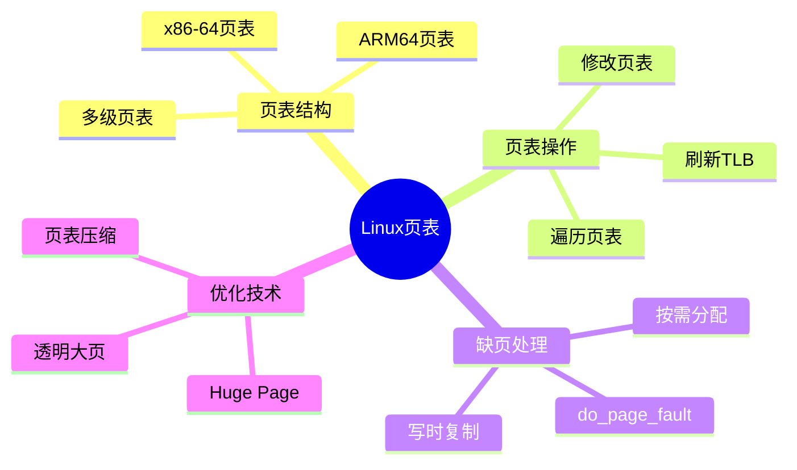

# Linux内核页表操作深度解析

> **层级定位**: 04 Industrial Scenarios / 02 Linux Kernel
> **对应标准**: Linux Kernel 5.x/6.x
> **难度级别**: L5 综合
> **预估学习时间**: 12-16 小时

---

## 📋 本节概要

| 属性 | 内容 |
|:-----|:-----|
| **核心概念** | 页表结构、TLB、缺页处理、 huge page、页表遍历 |
| **前置知识** | 虚拟内存、MMU、x86-64/ARM64架构 |
| **后续延伸** | KSM、NUMA、内存压缩 |
| **权威来源** | Linux Kernel源码, Intel SDM, ARM ARM |

---

## 🧠 知识结构思维导图



---

## 📖 核心概念详解

### 1. x86-64页表结构

```
┌─────────────────────────────────────────────────────────────────┐
│                 x86-64 4-Level页表 (48-bit)                      │
├─────────────────────────────────────────────────────────────────┤
│                                                                  │
│  CR3 ──► ┌──────────┐                                           │
│          │  PML4    │  Page Map Level 4 (512 entries, 8 bytes)  │
│          │  [0-511] │                                           │
│          └────┬─────┘                                           │
│               │ 9 bits (bits 47:39)                              │
│               ▼                                                  │
│          ┌──────────┐                                           │
│          │  PDPT    │  Page Directory Pointer Table              │
│          │  [0-511] │                                           │
│          └────┬─────┘                                           │
│               │ 9 bits (bits 38:30)                              │
│               ▼                                                  │
│          ┌──────────┐                                           │
│          │   PD     │  Page Directory                             │
│          │  [0-511] │                                           │
│          └────┬─────┘                                           │
│               │ 9 bits (bits 29:21)                              │
│               ▼                                                  │
│          ┌──────────┐                                           │
│          │   PT     │  Page Table                                 │
│          │  [0-511] │                                           │
│          └────┬─────┘                                           │
│               │ 9 bits (bits 20:12)                              │
│               ▼                                                  │
│          ┌──────────┐                                           │
│          │ Physical │  4KB Page                                   │
│          │ Page     │  12 bits (bits 11:0) offset                 │
│          └──────────┘                                           │
│                                                                  │
│  48-bit Virtual Address:                                         │
│  ┌─────┬─────┬─────┬─────┬─────┬───────────────────────────────┐ │
│  │ ... │PML4 │PDPT │ PD  │ PT  │           Offset              │ │
│  │     │ 9bit│ 9bit│ 9bit│ 9bit│           12bit               │ │
│  └─────┴─────┴─────┴─────┴─────┴───────────────────────────────┘ │
│                                                                  │
│  5-Level页表 (57-bit): 添加PML5，支持128PB虚拟地址空间            │
│                                                                  │
└─────────────────────────────────────────────────────────────────┘
```

### 2. 页表项结构

```c
// x86-64页表项 (PTE)
// 64位结构

#define PTE_PRESENT     (1ULL << 0)   // 存在位
#define PTE_RW          (1ULL << 1)   // 读写权限
#define PTE_US          (1ULL << 2)   // 用户/超级用户
#define PTE_PWT         (1ULL << 3)   // 写透
#define PTE_PCD         (1ULL << 4)   // 禁用缓存
#define PTE_ACCESSED    (1ULL << 5)   // 已访问
#define PTE_DIRTY       (1ULL << 6)   // 已修改
#define PTE_PSE         (1ULL << 7)   // 页大小扩展
#define PTE_GLOBAL      (1ULL << 8)   // 全局页
#define PTE_PAT         (1ULL << 12)  // 页属性表
#define PTE_NX          (1ULL << 63)  // 不可执行

#define PTE_ADDR_MASK   (0x000FFFFFFFFFF000ULL)  // 物理地址掩码

// 页表操作内联函数
static inline int pte_present(pte_t pte) {
    return pte_flags(pte) & PTE_PRESENT;
}

static inline int pte_write(pte_t pte) {
    return pte_flags(pte) & PTE_RW;
}

static inline int pte_dirty(pte_t pte) {
    return pte_flags(pte) & PTE_DIRTY;
}

static inline int pte_young(pte_t pte) {
    return pte_flags(pte) & PTE_ACCESSED;
}

static inline pte_t pte_mkclean(pte_t pte) {
    return pte_clear_flags(pte, PTE_DIRTY);
}

static inline pte_t pte_mkold(pte_t pte) {
    return pte_clear_flags(pte, PTE_ACCESSED);
}

static inline pte_t pte_mkwrite(pte_t pte) {
    return pte_set_flags(pte, PTE_RW);
}

static inline pte_t pte_wrprotect(pte_t pte) {
    return pte_clear_flags(pte, PTE_RW);
}

static inline pte_t pte_mkexec(pte_t pte) {
    return pte_clear_flags(pte, PTE_NX);
}

static inline pte_t pte_mknexec(pte_t pte) {
    return pte_set_flags(pte, PTE_NX);
}
```

### 3. 页表遍历与修改

```c
// Linux内核页表遍历

// 页表级别定义
#define PGDIR_SHIFT     39
#define PUD_SHIFT       30
#define PMD_SHIFT       21
#define PAGE_SHIFT      12

#define PTRS_PER_PGD    512
#define PTRS_PER_PUD    512
#define PTRS_PER_PMD    512
#define PTRS_PER_PTE    512

// 虚拟地址分解
#define pgd_index(addr)     (((addr) >> PGDIR_SHIFT) & (PTRS_PER_PGD - 1))
#define pud_index(addr)     (((addr) >> PUD_SHIFT) & (PTRS_PER_PUD - 1))
#define pmd_index(addr)     (((addr) >> PMD_SHIFT) & (PTRS_PER_PMD - 1))
#define pte_index(addr)     (((addr) >> PAGE_SHIFT) & (PTRS_PER_PTE - 1))

// 遍历页表查找PTE
pte_t *walk_page_table(struct mm_struct *mm, unsigned long addr) {
    pgd_t *pgd;
    p4d_t *p4d;
    pud_t *pud;
    pmd_t *pmd;
    pte_t *pte;

    // 获取PGD
    pgd = pgd_offset(mm, addr);
    if (pgd_none(*pgd) || pgd_bad(*pgd))
        return NULL;

    // P4D (5级页表)
    p4d = p4d_offset(pgd, addr);
    if (p4d_none(*p4d) || p4d_bad(*p4d))
        return NULL;

    // PUD
    pud = pud_offset(p4d, addr);
    if (pud_none(*pud) || pud_bad(*pud))
        return NULL;

    // PMD
    pmd = pmd_offset(pud, addr);
    if (pmd_none(*pmd) || pmd_bad(*pmd))
        return NULL;

    // PTE
    pte = pte_offset_map(pmd, addr);
    return pte;
}

// 建立页映射
int map_page(struct mm_struct *mm, unsigned long va,
             phys_addr_t pa, pgprot_t prot) {
    pgd_t *pgd;
    p4d_t *p4d;
    pud_t *pud;
    pmd_t *pmd;
    pte_t *pte;

    // 分配/获取各级页表
    pgd = pgd_offset(mm, va);
    if (pgd_none(*pgd)) {
        p4d_t *new_p4d = alloc_page_table();
        set_pgd(pgd, __pgd(_PAGE_TABLE | __pa(new_p4d)));
    }

    p4d = p4d_offset(pgd, va);
    if (p4d_none(*p4d)) {
        pud_t *new_pud = alloc_page_table();
        set_p4d(p4d, __p4d(_PAGE_TABLE | __pa(new_pud)));
    }

    pud = pud_offset(p4d, va);
    if (pud_none(*pud)) {
        pmd_t *new_pmd = alloc_page_table();
        set_pud(pud, __pud(_PAGE_TABLE | __pa(new_pmd)));
    }

    pmd = pmd_offset(pud, va);
    if (pmd_none(*pmd)) {
        pte_t *new_pte = alloc_page_table();
        set_pmd(pmd, __pmd(_PAGE_TABLE | __pa(new_pte)));
    }

    // 设置PTE
    pte = pte_offset_map_lock(mm, pmd, va, &ptl);
    set_pte_at(mm, va, pte, pfn_pte(pa >> PAGE_SHIFT, prot));
    pte_unmap_unlock(pte, ptl);

    // 刷新TLB
    flush_tlb_page(mm, va);

    return 0;
}
```

### 4. 缺页异常处理

```c
// do_page_fault处理流程

// 错误码定义
#define PF_PROT     (1 << 0)   // 保护错误
#define PF_WRITE    (1 << 1)   // 写访问
#define PF_USER     (1 << 2)   // 用户模式
#define PF_RSVD     (1 << 3)   // 保留位错误
#define PF_INSTR    (1 << 4)   // 取指错误

void do_page_fault(struct pt_regs *regs, unsigned long error_code) {
    unsigned long address = read_cr2();  // 获取故障地址
    struct mm_struct *mm = current->mm;
    struct vm_area_struct *vma;
    int si_code = SEGV_MAPERR;

    // 1. 查找VMA
    vma = find_vma(mm, address);
    if (!vma) {
        // 无映射区域
        goto bad_area;
    }

    if (vma->vm_start <= address) {
        // 地址在VMA范围内
        goto good_area;
    }

    if (!(vma->vm_flags & VM_GROWSDOWN)) {
        // 不是栈增长区域
        goto bad_area;
    }

    // 2. 处理栈增长
    if (expand_stack(vma, address)) {
        goto bad_area;
    }

good_area:
    si_code = SEGV_ACCERR;

    // 3. 检查权限
    if (error_code & PF_WRITE) {
        if (!(vma->vm_flags & VM_WRITE))
            goto bad_area;
    } else {
        if (error_code & PF_INSTR) {
            if (!(vma->vm_flags & VM_EXEC))
                goto bad_area;
        }
        if (!(vma->vm_flags & VM_READ) &&
            !(error_code & PF_INSTR))
            goto bad_area;
    }

    // 4. 处理缺页
    handle_mm_fault(vma, address, error_code);
    return;

bad_area:
    // 发送SIGSEGV信号
    force_sig_fault(SIGSEGV, si_code, (void __user *)address);
}

// 处理页错误
int handle_mm_fault(struct vm_area_struct *vma, unsigned long address,
                    unsigned int flags) {
    pgd_t *pgd;
    p4d_t *p4d;
    pud_t *pud;
    pmd_t *pmd;
    pte_t *pte;

    pgd = pgd_offset(vma->vm_mm, address);

    // 处理各级页表
    p4d = p4d_alloc(vma->vm_mm, pgd, address);
    if (!p4d)
        return VM_FAULT_OOM;

    pud = pud_alloc(vma->vm_mm, p4d, address);
    if (!pud)
        return VM_FAULT_OOM;

    pmd = pmd_alloc(vma->vm_mm, pud, address);
    if (!pmd)
        return VM_FAULT_OOM;

    // 处理PTE级别
    return handle_pte_fault(vma, address, pmd, flags);
}

// 处理PTE级错误
int handle_pte_fault(struct vm_area_struct *vma, unsigned long address,
                     pmd_t *pmd, unsigned int flags) {
    pte_t *pte;
    spinlock_t *ptl;
    pte_t entry;

    pte = pte_offset_map_lock(vma->vm_mm, pmd, address, &ptl);
    entry = *pte;

    if (!pte_present(entry)) {
        // 页不存在
        if (pte_none(entry)) {
            // 匿名页或文件页
            if (vma_is_anonymous(vma)) {
                return do_anonymous_page(vma, address, pte, pmd, flags);
            } else {
                return do_fault(vma, address, pte, pmd, flags);
            }
        }
        // swap页
        return do_swap_page(vma, address, pte, pmd, flags, entry);
    }

    // 页存在但权限不足
    if (flags & FAULT_FLAG_WRITE) {
        if (!pte_write(entry)) {
            // 写时复制
            return do_wp_page(vma, address, pte, pmd, ptl, entry);
        }
    }

    pte_unmap_unlock(pte, ptl);
    return 0;
}
```

### 5. 透明大页 (THP)

```c
// 透明大页支持

// 2MB大页
#define HPAGE_SHIFT     PMD_SHIFT
#define HPAGE_SIZE      (1UL << HPAGE_SHIFT)
#define HPAGE_MASK      (~(HPAGE_SIZE - 1))

// 检查是否可以使用THP
static inline bool __transparent_hugepage_enabled(struct vm_area_struct *vma) {
    if (vma_is_anonymous(vma))
        return true;
    if (shmem_mapping(vma->vm_file))
        return shmem_huge_enabled(vma);
    return false;
}

// 尝试分配THP
int khugepaged_enter_vma(struct vm_area_struct *vma) {
    // 检查条件
    if (!__transparent_hugepage_enabled(vma))
        return 0;

    if (vma->vm_flags & VM_NOHUGEPAGE)
        return 0;

    // 添加到扫描队列
    return __khugepaged_enter(vma);
}

// 将普通页合并为大页
int collapse_huge_page(struct vm_area_struct *vma, unsigned long address) {
    pmd_t *pmd;
    pte_t *pte;
    spinlock_t *ptl;
    struct page *hpage;

    // 分配2MB页
    hpage = alloc_transhugepage();
    if (!hpage)
        return -ENOMEM;

    // 复制数据
    copy_data_to_huge_page(hpage, address);

    // 替换PTE表为PMD条目
    pmd = pmd_alloc(mm, pud, address);

    spin_lock(&mm->page_table_lock);
    // 设置PMD条目
    set_pmd_at(mm, address, pmd,
               mk_huge_pmd(hpage, vma->vm_page_prot));
    spin_unlock(&mm->page_table_lock);

    return 0;
}
```

---

## ⚠️ 常见陷阱

### 陷阱 PG01: 页表竞争

```c
// ❌ 无锁访问页表
pte_t *pte = pte_offset_map(pmd, addr);
*pte = new_pte;  // 竞争条件！

// ✅ 正确加锁
spinlock_t *ptl;
pte_t *pte = pte_offset_map_lock(mm, pmd, addr, &ptl);
*pte = new_pte;
pte_unmap_unlock(pte, ptl);
```

### 陷阱 PG02: TLB未刷新

```c
// ❌ 修改页表后未刷新TLB
set_pte(pte, new_pte);
// 旧映射仍可能有效

// ✅ 刷新TLB
set_pte(pte, new_pte);
flush_tlb_page(mm, addr);
```

---

## ✅ 质量验收清单

- [x] 页表结构详解
- [x] 页表操作实现
- [x] 缺页异常处理
- [x] 透明大页支持
- [x] 安全陷阱分析

---

> **更新记录**
>
> - 2025-03-09: 初版创建
