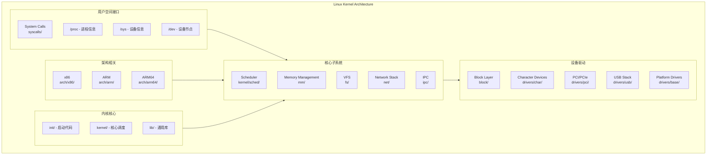

# Linux内核开发：从模块到驱动

> **难度等级**: L4-L5 | **预估学习时间**: 40-60小时 | **前置知识**: C语言、操作系统原理、计算机体系结构、ARM/x86汇编

---

## 技术概述

Linux内核是世界上规模最大、应用最广泛的开源软件项目之一，从嵌入式设备到超级计算机，从智能手机到云计算基础设施，Linux内核支撑着现代数字世界的底层运行。
内核开发代表了系统编程的最高水平，要求开发者对计算机体系结构、操作系统原理和硬件细节有深入理解。

### 内核开发的核心价值

根据Linux内核基金会统计数据，Linux内核包含超过2800万行代码，由来自1500多家公司的数万名开发者贡献。内核开发技能在以下领域至关重要：

1. **设备驱动开发**: 支持新硬件、优化现有驱动性能
2. **性能优化**: 内核子系统调优、延迟优化、吞吐提升
3. **安全加固**: 安全模块(LSM)开发、漏洞修复、访问控制
4. **实时系统**: PREEMPT_RT补丁、确定性延迟保证
5. **嵌入式定制**: 裁剪内核、启动优化、功耗管理

### 内核子系统架构



---

## 内核模块开发

### 模块基础结构

```c
/*
 * 基本内核模块模板
 * 文件: hello_module.c
 */
#include <linux/init.h>
#include <linux/module.h>
#include <linux/kernel.h>
#include <linux/kern_levels.h>

/* 模块元数据 */
MODULE_AUTHOR("Your Name <email@example.com>");
MODULE_DESCRIPTION("A simple Linux kernel module example");
MODULE_LICENSE("GPL");  /* 必须使用GPL兼容许可证 */
MODULE_VERSION("1.0");

/* 模块参数 */
static char *name = "World";
module_param(name, charp, S_IRUGO);  /* 权限: 所有者可读 */
MODULE_PARM_DESC(name, "Name to greet");

static int count = 1;
module_param(count, int, S_IRUGO | S_IWUSR);  /* 读写权限 */
MODULE_PARM_DESC(count, "Number of times to greet");

/* 模块加载函数 */
static int __init hello_init(void)
{
    int i;

    printk(KERN_INFO "Hello Module: Initializing\n");

    /* 使用不同日志级别 */
    printk(KERN_DEBUG "Debug: Loading module with name=%s, count=%d\n",
           name, count);

    for (i = 0; i < count; i++) {
        printk(KERN_INFO "Hello, %s! (%d/%d)\n", name, i + 1, count);
    }

    /* 返回0表示成功，负值表示错误码 */
    return 0;
}

/* 模块卸载函数 */
static void __exit hello_exit(void)
{
    printk(KERN_INFO "Hello Module: Exiting\n");
    printk(KERN_INFO "Goodbye, %s!\n", name);
}

/* 注册入口/出口函数 */
module_init(hello_init);
module_exit(hello_exit);
```

### Makefile构建

```makefile
# Makefile for kernel module

# 内核源码路径 - 根据实际环境修改
KDIR ?= /lib/modules/$(shell uname -r)/build

# 当前目录
PWD := $(shell pwd)

# 模块名称
obj-m := hello_module.o

# 多文件模块
# obj-m := my_driver.o
# my_driver-objs := main.o file_ops.o ioctl.o

# 编译目标
all:
 make -C $(KDIR) M=$(PWD) modules

# 清理
clean:
 make -C $(KDIR) M=$(PWD) clean

# 安装模块
install:
 sudo insmod hello_module.ko

# 卸载模块
uninstall:
 sudo rmmod hello_module

# 查看日志
log:
 sudo dmesg | tail -20
```

### 模块高级特性

```c
/*
 * 高级模块示例：字符设备 + 并发控制
 * 文件: advanced_module.c
 */

#include <linux/module.h>
#include <linux/fs.h>
#include <linux/cdev.h>
#include <linux/uaccess.h>
#include <linux/slab.h>
#include <linux/mutex.h>
#include <linux/spinlock.h>
#include <linux/wait.h>
#include <linux/interrupt.h>
#include <linux/workqueue.h>

#define DEVICE_NAME "mydevice"
#define CLASS_NAME "myclass"
#define BUFFER_SIZE 1024
#define MAX_DEVICES 4

/* 设备私有数据结构 */
struct mydevice_data {
    struct cdev cdev;
    dev_t dev_num;

    /* 数据缓冲区 */
    char *buffer;
    size_t buf_size;
    size_t data_len;

    /* 位置指针 */
    loff_t read_pos;
    loff_t write_pos;

    /* 并发控制 */
    struct mutex mutex;         /* 互斥锁 - 保护缓冲区 */
    spinlock_t spinlock;        /* 自旋锁 - 保护快速操作 */

    /* 同步机制 */
    wait_queue_head_t read_queue;   /* 读等待队列 */
    wait_queue_head_t write_queue;  /* 写等待队列 */

    /* 统计信息 */
    atomic_t open_count;
    atomic_t read_count;
    atomic_t write_count;

    /* 工作队列 */
    struct work_struct deferred_work;

    /* 设备状态 */
    bool device_open;
    bool data_available;
};

static struct mydevice_data *devices[MAX_DEVICES];
static int major;
static struct class *my_class;

/* 文件操作: open */
static int mydevice_open(struct inode *inode, struct file *filp)
{
    struct mydevice_data *dev;
    int minor = iminor(inode);

    if (minor >= MAX_DEVICES)
        return -ENODEV;

    dev = devices[minor];
    if (!dev)
        return -ENODEV;

    /* 非阻塞检查 */
    if (filp->f_flags & O_EXCL) {
        if (dev->device_open)
            return -EBUSY;
    }

    /* 获取互斥锁 */
    if (mutex_lock_interruptible(&dev->mutex))
        return -ERESTARTSYS;

    dev->device_open = true;
    atomic_inc(&dev->open_count);

    /* 保存设备指针供其他操作使用 */
    filp->private_data = dev;

    mutex_unlock(&dev->mutex);

    pr_info("mydevice: opened device %d\n", minor);
    return 0;
}

/* 文件操作: release */
static int mydevice_release(struct inode *inode, struct file *filp)
{
    struct mydevice_data *dev = filp->private_data;

    mutex_lock(&dev->mutex);
    dev->device_open = false;
    mutex_unlock(&dev->mutex);

    pr_info("mydevice: closed device\n");
    return 0;
}

/* 文件操作: read */
static ssize_t mydevice_read(struct file *filp, char __user *user_buf,
                             size_t count, loff_t *f_pos)
{
    struct mydevice_data *dev = filp->private_data;
    ssize_t bytes_read = 0;

    /* 获取互斥锁 */
    if (mutex_lock_interruptible(&dev->mutex))
        return -ERESTARTSYS;

    /* 等待数据可用（阻塞模式） */
    while (dev->data_len == 0) {
        mutex_unlock(&dev->mutex);

        if (filp->f_flags & O_NONBLOCK)
            return -EAGAIN;

        /* 等待唤醒 */
        if (wait_event_interruptible(dev->read_queue,
                                     dev->data_len > 0))
            return -ERESTARTSYS;

        if (mutex_lock_interruptible(&dev->mutex))
            return -ERESTARTSYS;
    }

    /* 计算可读字节数 */
    size_t available = min(count, dev->data_len - dev->read_pos);

    /* 复制到用户空间 */
    if (copy_to_user(user_buf, dev->buffer + dev->read_pos, available)) {
        mutex_unlock(&dev->mutex);
        return -EFAULT;
    }

    dev->read_pos += available;
    bytes_read = available;

    /* 如果读完所有数据，重置位置 */
    if (dev->read_pos >= dev->data_len) {
        dev->read_pos = 0;
        dev->data_len = 0;
        dev->data_available = false;
    }

    atomic_inc(&dev->read_count);
    mutex_unlock(&dev->mutex);

    /* 唤醒等待的写者 */
    wake_up_interruptible(&dev->write_queue);

    return bytes_read;
}

/* 文件操作: write */
static ssize_t mydevice_write(struct file *filp, const char __user *user_buf,
                              size_t count, loff_t *f_pos)
{
    struct mydevice_data *dev = filp->private_data;
    ssize_t bytes_written = 0;

    if (mutex_lock_interruptible(&dev->mutex))
        return -ERESTARTSYS;

    /* 等待缓冲区空间（阻塞模式） */
    while (dev->data_len >= dev->buf_size) {
        mutex_unlock(&dev->mutex);

        if (filp->f_flags & O_NONBLOCK)
            return -EAGAIN;

        if (wait_event_interruptible(dev->write_queue,
                                     dev->data_len < dev->buf_size))
            return -ERESTARTSYS;

        if (mutex_lock_interruptible(&dev->mutex))
            return -ERESTARTSYS;
    }

    /* 计算可写字节数 */
    size_t space = dev->buf_size - dev->data_len;
    size_t to_write = min(count, space);

    /* 从用户空间复制 */
    if (copy_from_user(dev->buffer + dev->data_len, user_buf, to_write)) {
        mutex_unlock(&dev->mutex);
        return -EFAULT;
    }

    dev->data_len += to_write;
    dev->data_available = true;
    bytes_written = to_write;

    atomic_inc(&dev->write_count);
    mutex_unlock(&dev->mutex);

    /* 唤醒等待的读者 */
    wake_up_interruptible(&dev->read_queue);

    return bytes_written;
}

/* 文件操作: ioctl */
static long mydevice_ioctl(struct file *filp, unsigned int cmd,
                           unsigned long arg)
{
    struct mydevice_data *dev = filp->private_data;
    int ret = 0;

    /* 检查幻数和命令号 */
    if (_IOC_TYPE(cmd) != MYDEVICE_MAGIC)
        return -ENOTTY;

    switch (cmd) {
    case MYDEVICE_CLEAR:
        mutex_lock(&dev->mutex);
        dev->data_len = 0;
        dev->read_pos = 0;
        dev->write_pos = 0;
        dev->data_available = false;
        mutex_unlock(&dev->mutex);
        break;

    case MYDEVICE_GET_STATS: {
        struct mydevice_stats stats;
        stats.open_count = atomic_read(&dev->open_count);
        stats.read_count = atomic_read(&dev->read_count);
        stats.write_count = atomic_read(&dev->write_count);
        stats.buffer_size = dev->buf_size;
        stats.data_length = dev->data_len;

        if (copy_to_user((void __user *)arg, &stats, sizeof(stats)))
            ret = -EFAULT;
        break;
    }

    case MYDEVICE_RESIZE: {
        size_t new_size;
        if (copy_from_user(&new_size, (void __user *)arg, sizeof(new_size)))
            return -EFAULT;

        mutex_lock(&dev->mutex);
        char *new_buf = krealloc(dev->buffer, new_size, GFP_KERNEL);
        if (!new_buf) {
            ret = -ENOMEM;
        } else {
            dev->buffer = new_buf;
            dev->buf_size = new_size;
        }
        mutex_unlock(&dev->mutex);
        break;
    }

    default:
        ret = -ENOTTY;
    }

    return ret;
}

/* 文件操作: poll/select */
static unsigned int mydevice_poll(struct file *filp, poll_table *wait)
{
    struct mydevice_data *dev = filp->private_data;
    unsigned int mask = 0;

    poll_wait(filp, &dev->read_queue, wait);
    poll_wait(filp, &dev->write_queue, wait);

    mutex_lock(&dev->mutex);

    if (dev->data_len > 0)
        mask |= POLLIN | POLLRDNORM;  /* 可读 */

    if (dev->data_len < dev->buf_size)
        mask |= POLLOUT | POLLWRNORM;  /* 可写 */

    mutex_unlock(&dev->mutex);

    return mask;
}

/* 文件操作表 */
static const struct file_operations mydevice_fops = {
    .owner          = THIS_MODULE,
    .open           = mydevice_open,
    .release        = mydevice_release,
    .read           = mydevice_read,
    .write          = mydevice_write,
    .unlocked_ioctl = mydevice_ioctl,
    .poll           = mydevice_poll,
    .llseek         = default_llseek,
};

/* 模块初始化 */
static int __init mydevice_init(void)
{
    int ret, i;
    dev_t dev_num;

    /* 动态分配设备号 */
    ret = alloc_chrdev_region(&dev_num, 0, MAX_DEVICES, DEVICE_NAME);
    if (ret < 0) {
        pr_err("Failed to allocate device number\n");
        return ret;
    }
    major = MAJOR(dev_num);

    /* 创建设备类 */
    my_class = class_create(THIS_MODULE, CLASS_NAME);
    if (IS_ERR(my_class)) {
        ret = PTR_ERR(my_class);
        goto err_unregister;
    }

    /* 初始化每个设备 */
    for (i = 0; i < MAX_DEVICES; i++) {
        devices[i] = kzalloc(sizeof(struct mydevice_data), GFP_KERNEL);
        if (!devices[i]) {
            ret = -ENOMEM;
            goto err_cleanup;
        }

        /* 分配缓冲区 */
        devices[i]->buffer = kzalloc(BUFFER_SIZE, GFP_KERNEL);
        if (!devices[i]->buffer) {
            ret = -ENOMEM;
            goto err_cleanup;
        }
        devices[i]->buf_size = BUFFER_SIZE;

        /* 初始化同步原语 */
        mutex_init(&devices[i]->mutex);
        spin_lock_init(&devices[i]->spinlock);
        init_waitqueue_head(&devices[i]->read_queue);
        init_waitqueue_head(&devices[i]->write_queue);

        /* 初始化原子变量 */
        atomic_set(&devices[i]->open_count, 0);
        atomic_set(&devices[i]->read_count, 0);
        atomic_set(&devices[i]->write_count, 0);

        /* 注册字符设备 */
        devices[i]->dev_num = MKDEV(major, i);
        cdev_init(&devices[i]->cdev, &mydevice_fops);
        devices[i]->cdev.owner = THIS_MODULE;

        ret = cdev_add(&devices[i]->cdev, devices[i]->dev_num, 1);
        if (ret) {
            pr_err("Failed to add cdev %d\n", i);
            goto err_cleanup;
        }

        /* 创建设备节点 */
        device_create(my_class, NULL, devices[i]->dev_num,
                      NULL, "%s%d", DEVICE_NAME, i);
    }

    pr_info("mydevice: Loaded with %d devices (major=%d)\n",
            MAX_DEVICES, major);
    return 0;

err_cleanup:
    for (i = i - 1; i >= 0; i--) {
        if (devices[i]) {
            device_destroy(my_class, devices[i]->dev_num);
            cdev_del(&devices[i]->cdev);
            kfree(devices[i]->buffer);
            kfree(devices[i]);
        }
    }
    class_destroy(my_class);
err_unregister:
    unregister_chrdev_region(MKDEV(major, 0), MAX_DEVICES);
    return ret;
}

/* 模块卸载 */
static void __exit mydevice_exit(void)
{
    int i;

    for (i = 0; i < MAX_DEVICES; i++) {
        if (devices[i]) {
            device_destroy(my_class, devices[i]->dev_num);
            cdev_del(&devices[i]->cdev);
            kfree(devices[i]->buffer);
            kfree(devices[i]);
        }
    }

    class_destroy(my_class);
    unregister_chrdev_region(MKDEV(major, 0), MAX_DEVICES);

    pr_info("mydevice: Unloaded\n");
}

module_init(mydevice_init);
module_exit(mydevice_exit);
```

---

## 字符设备驱动开发

### 平台设备驱动

```c
/*
 * 平台设备驱动示例
 * 适用于不通过PCI/USB等总线枚举的嵌入式设备
 */

#include <linux/module.h>
#include <linux/platform_device.h>
#include <linux/of.h>
#include <linux/of_device.h>
#include <linux/io.h>
#include <linux/interrupt.h>
#include <linux/dma-mapping.h>

/* 设备寄存器定义 */
#define REG_CONTROL     0x00
#define REG_STATUS      0x04
#define REG_DATA_TX     0x08
#define REG_DATA_RX     0x0C
#define REG_IRQ_MASK    0x10
#define REG_IRQ_STATUS  0x14

#define CTRL_ENABLE     BIT(0)
#define CTRL_RESET      BIT(1)
#define CTRL_DMA_EN     BIT(2)

#define STATUS_BUSY     BIT(0)
#define STATUS_TX_EMPTY BIT(1)
#define STATUS_RX_FULL  BIT(2)

#define IRQ_TX_DONE     BIT(0)
#define IRQ_RX_READY    BIT(1)
#define IRQ_ERROR       BIT(2)

/* 设备私有数据结构 */
struct myplatform_dev {
    struct device *dev;
    void __iomem *base;
    int irq;
    struct clk *clk;
    struct reset_control *rst;

    /* DMA */
    struct dma_chan *dma_tx;
    struct dma_chan *dma_rx;
    dma_addr_t dma_tx_phys;
    dma_addr_t dma_rx_phys;
    void *dma_tx_virt;
    void *dma_rx_virt;

    /* 同步 */
    struct completion tx_complete;
    struct completion rx_complete;
    spinlock_t lock;

    /* 统计 */
    u64 bytes_transferred;
    u32 irq_count;
};

/* 中断处理函数 */
static irqreturn_t myplatform_irq_handler(int irq, void *dev_id)
{
    struct myplatform_dev *priv = dev_id;
    u32 status;
    unsigned long flags;

    spin_lock_irqsave(&priv->lock, flags);

    status = readl(priv->base + REG_IRQ_STATUS);

    if (status & IRQ_TX_DONE) {
        complete(&priv->tx_complete);
        writel(IRQ_TX_DONE, priv->base + REG_IRQ_STATUS);  /* W1C */
    }

    if (status & IRQ_RX_READY) {
        complete(&priv->rx_complete);
        writel(IRQ_RX_READY, priv->base + REG_IRQ_STATUS);
    }

    if (status & IRQ_ERROR) {
        dev_err(priv->dev, "Hardware error!\n");
        writel(IRQ_ERROR, priv->base + REG_IRQ_STATUS);
    }

    priv->irq_count++;
    spin_unlock_irqrestore(&priv->lock, flags);

    return IRQ_HANDLED;
}

/* 设备初始化 */
static int myplatform_hw_init(struct myplatform_dev *priv)
{
    u32 ctrl;

    /* 复位设备 */
    reset_control_assert(priv->rst);
    udelay(10);
    reset_control_deassert(priv->rst);
    msleep(10);  /* 等待稳定 */

    /* 禁用中断 */
    writel(0, priv->base + REG_IRQ_MASK);

    /* 清除状态 */
    writel(0xFFFFFFFF, priv->base + REG_IRQ_STATUS);

    /* 配置控制寄存器 */
    ctrl = CTRL_ENABLE;
    if (priv->dma_tx || priv->dma_rx)
        ctrl |= CTRL_DMA_EN;
    writel(ctrl, priv->base + REG_CONTROL);

    /* 启用中断 */
    writel(IRQ_TX_DONE | IRQ_RX_READY | IRQ_ERROR,
           priv->base + REG_IRQ_MASK);

    return 0;
}

/* DMA完成回调 */
static void myplatform_dma_callback(void *param)
{
    struct completion *comp = param;
    complete(comp);
}

/* 数据传输（使用DMA或PIO） */
static int myplatform_transfer(struct myplatform_dev *priv,
                               const void *tx_buf, void *rx_buf,
                               size_t len)
{
    struct dma_async_tx_descriptor *tx_desc = NULL;
    struct dma_async_tx_descriptor *rx_desc = NULL;
    dma_cookie_t cookie;
    int ret = 0;

    reinit_completion(&priv->tx_complete);
    reinit_completion(&priv->rx_complete);

    /* DMA传输 */
    if (priv->dma_tx && tx_buf && len > DMA_THRESHOLD) {
        /* 准备TX DMA */
        memcpy(priv->dma_tx_virt, tx_buf, len);
        dma_sync_single_for_device(priv->dev, priv->dma_tx_phys,
                                   len, DMA_TO_DEVICE);

        tx_desc = dmaengine_prep_slave_single(
            priv->dma_tx, priv->dma_tx_phys, len,
            DMA_MEM_TO_DEV, DMA_PREP_INTERRUPT);

        if (tx_desc) {
            tx_desc->callback = myplatform_dma_callback;
            tx_desc->callback_param = &priv->tx_complete;
            cookie = tx_desc->tx_submit(tx_desc);
            dma_async_issue_pending(priv->dma_tx);
        }
    }

    if (priv->dma_rx && rx_buf && len > DMA_THRESHOLD) {
        /* 准备RX DMA */
        rx_desc = dmaengine_prep_slave_single(
            priv->dma_rx, priv->dma_rx_phys, len,
            DMA_DEV_TO_MEM, DMA_PREP_INTERRUPT);

        if (rx_desc) {
            rx_desc->callback = myplatform_dma_callback;
            rx_desc->callback_param = &priv->rx_complete;
            cookie = rx_desc->tx_submit(rx_desc);
            dma_async_issue_pending(priv->dma_rx);
        }
    }

    /* 等待传输完成 */
    if (tx_desc) {
        if (!wait_for_completion_timeout(&priv->tx_complete,
                                         msecs_to_jiffies(1000))) {
            dev_err(priv->dev, "TX DMA timeout\n");
            dmaengine_terminate_sync(priv->dma_tx);
            ret = -ETIMEDOUT;
            goto out;
        }
    } else if (tx_buf) {
        /* PIO发送 */
        const u8 *p = tx_buf;
        size_t i;
        for (i = 0; i < len; i++) {
            /* 等待TX FIFO空闲 */
            while (readl(priv->base + REG_STATUS) & STATUS_BUSY)
                cpu_relax();
            writel(p[i], priv->base + REG_DATA_TX);
        }
        /* 等待完成 */
        if (!wait_for_completion_timeout(&priv->tx_complete,
                                         msecs_to_jiffies(1000))) {
            ret = -ETIMEDOUT;
            goto out;
        }
    }

    if (rx_desc) {
        if (!wait_for_completion_timeout(&priv->rx_complete,
                                         msecs_to_jiffies(1000))) {
            dev_err(priv->dev, "RX DMA timeout\n");
            dmaengine_terminate_sync(priv->dma_rx);
            ret = -ETIMEDOUT;
            goto out;
        }
        dma_sync_single_for_cpu(priv->dev, priv->dma_rx_phys,
                                len, DMA_FROM_DEVICE);
        memcpy(rx_buf, priv->dma_rx_virt, len);
    } else if (rx_buf) {
        /* PIO接收 */
        u8 *p = rx_buf;
        size_t i;
        for (i = 0; i < len; i++) {
            /* 等待RX数据 */
            while (!(readl(priv->base + REG_STATUS) & STATUS_RX_FULL))
                cpu_relax();
            p[i] = readl(priv->base + REG_DATA_RX);
        }
    }

    priv->bytes_transferred += len;

out:
    return ret;
}

/* 平台驱动probe函数 */
static int myplatform_probe(struct platform_device *pdev)
{
    struct myplatform_dev *priv;
    struct resource *res;
    int ret;

    priv = devm_kzalloc(&pdev->dev, sizeof(*priv), GFP_KERNEL);
    if (!priv)
        return -ENOMEM;

    priv->dev = &pdev->dev;
    platform_set_drvdata(pdev, priv);
    spin_lock_init(&priv->lock);
    init_completion(&priv->tx_complete);
    init_completion(&priv->rx_complete);

    /* 获取寄存器资源 */
    res = platform_get_resource(pdev, IORESOURCE_MEM, 0);
    priv->base = devm_ioremap_resource(&pdev->dev, res);
    if (IS_ERR(priv->base))
        return PTR_ERR(priv->base);

    /* 获取中断 */
    priv->irq = platform_get_irq(pdev, 0);
    if (priv->irq < 0)
        return priv->irq;

    ret = devm_request_irq(&pdev->dev, priv->irq,
                           myplatform_irq_handler,
                           IRQF_SHARED, dev_name(&pdev->dev), priv);
    if (ret)
        return ret;

    /* 获取时钟 */
    priv->clk = devm_clk_get(&pdev->dev, NULL);
    if (IS_ERR(priv->clk))
        return PTR_ERR(priv->clk);

    ret = clk_prepare_enable(priv->clk);
    if (ret)
        return ret;

    /* 获取复位控制 */
    priv->rst = devm_reset_control_get_exclusive(&pdev->dev, NULL);
    if (IS_ERR(priv->rst)) {
        ret = PTR_ERR(priv->rst);
        goto err_clk;
    }

    /* 申请DMA通道 */
    priv->dma_tx = dma_request_slave_channel(&pdev->dev, "tx");
    priv->dma_rx = dma_request_slave_channel(&pdev->dev, "rx");

    /* 分配DMA缓冲区 */
    if (priv->dma_tx) {
        priv->dma_tx_virt = dmam_alloc_coherent(&pdev->dev, PAGE_SIZE,
                                                &priv->dma_tx_phys,
                                                GFP_KERNEL);
        if (!priv->dma_tx_virt) {
            ret = -ENOMEM;
            goto err_dma;
        }
    }

    if (priv->dma_rx) {
        priv->dma_rx_virt = dmam_alloc_coherent(&pdev->dev, PAGE_SIZE,
                                                &priv->dma_rx_phys,
                                                GFP_KERNEL);
        if (!priv->dma_rx_virt) {
            ret = -ENOMEM;
            goto err_dma;
        }
    }

    /* 初始化硬件 */
    ret = myplatform_hw_init(priv);
    if (ret)
        goto err_dma;

    dev_info(&pdev->dev, "Probed successfully\n");
    return 0;

err_dma:
    if (priv->dma_tx)
        dma_release_channel(priv->dma_tx);
    if (priv->dma_rx)
        dma_release_channel(priv->dma_rx);
err_clk:
    clk_disable_unprepare(priv->clk);
    return ret;
}

/* 平台驱动remove函数 */
static int myplatform_remove(struct platform_device *pdev)
{
    struct myplatform_dev *priv = platform_get_drvdata(pdev);

    /* 禁用设备 */
    writel(0, priv->base + REG_CONTROL);

    /* 释放DMA */
    if (priv->dma_tx)
        dma_release_channel(priv->dma_tx);
    if (priv->dma_rx)
        dma_release_channel(priv->dma_rx);

    clk_disable_unprepare(priv->clk);

    return 0;
}

/* Device Tree匹配表 */
static const struct of_device_id myplatform_of_match[] = {
    { .compatible = "myvendor,mydevice" },
    { .compatible = "myvendor,mydevice-v2" },
    { /* sentinel */ }
};
MODULE_DEVICE_TABLE(of, myplatform_of_match);

/* 平台驱动结构 */
static struct platform_driver myplatform_driver = {
    .driver = {
        .name = "myplatform",
        .of_match_table = myplatform_of_match,
    },
    .probe = myplatform_probe,
    .remove = myplatform_remove,
};

module_platform_driver(myplatform_driver);
```

---

## 内存管理

### 页表操作详解

```c
/*
 * 页表遍历与操作示例
 * 适用于x86-64架构
 */

#include <linux/mm.h>
#include <linux/pgtable.h>
#include <asm/page.h>
#include <asm/pgalloc.h>

/* x86-64四级页表结构 */
#define PML4_SHIFT  39
#define PDPT_SHIFT  30
#define PD_SHIFT    21
#define PT_SHIFT    12

#define PTRS_PER_PML4   512
#define PTRS_PER_PDPT   512
#define PTRS_PER_PD     512
#define PTRS_PER_PT     512

/* 页表项提取宏 */
#define pml4_index(addr)    (((addr) >> PML4_SHIFT) & (PTRS_PER_PML4 - 1))
#define pdpt_index(addr)    (((addr) >> PDPT_SHIFT) & (PTRS_PER_PDPT - 1))
#define pd_index(addr)      (((addr) >> PD_SHIFT) & (PTRS_PER_PD - 1))
#define pt_index(addr)      (((addr) >> PT_SHIFT) & (PTRS_PER_PT - 1))

/* 遍历页表获取物理地址 */
phys_addr_t virt_to_phys_custom(struct mm_struct *mm, unsigned long vaddr)
{
    pgd_t *pgd;
    p4d_t *p4d;
    pud_t *pud;
    pmd_t *pmd;
    pte_t *pte;
    phys_addr_t paddr;

    /* 获取PGD（Page Global Directory） */
    pgd = pgd_offset(mm, vaddr);
    if (pgd_none(*pgd) || pgd_bad(*pgd))
        return 0;

    /* P4D（Page 4th Directory）- 五级页表使用 */
    p4d = p4d_offset(pgd, vaddr);
    if (p4d_none(*p4d) || p4d_bad(*p4d))
        return 0;

    /* PUD（Page Upper Directory）/ PDPT */
    pud = pud_offset(p4d, vaddr);
    if (pud_none(*pud) || pud_bad(*pud))
        return 0;

    /* 检查是否为1GB大页 */
    if (pud_large(*pud)) {
        paddr = (phys_addr_t)pud_pfn(*pud) << PAGE_SHIFT;
        paddr |= vaddr & ~PUD_MASK;
        return paddr;
    }

    /* PMD（Page Middle Directory） */
    pmd = pmd_offset(pud, vaddr);
    if (pmd_none(*pmd) || pmd_bad(*pmd))
        return 0;

    /* 检查是否为2MB大页 */
    if (pmd_large(*pmd)) {
        paddr = (phys_addr_t)pmd_pfn(*pmd) << PAGE_SHIFT;
        paddr |= vaddr & ~PMD_MASK;
        return paddr;
    }

    /* PTE（Page Table Entry） */
    pte = pte_offset_map(pmd, vaddr);
    if (!pte_present(*pte)) {
        pte_unmap(pte);
        return 0;
    }

    paddr = (phys_addr_t)pte_pfn(*pte) << PAGE_SHIFT;
    paddr |= vaddr & ~PAGE_MASK;

    pte_unmap(pte);
    return paddr;
}

/* 修改页表项权限 */
int set_page_protection(struct mm_struct *mm, unsigned long vaddr,
                        pgprot_t new_prot)
{
    pgd_t *pgd;
    p4d_t *p4d;
    pud_t *pud;
    pmd_t *pmd;
    pte_t *pte, old_pte;
    spinlock_t *ptl;
    int ret = 0;

    /* 获取页表锁 */
    pgd = pgd_offset(mm, vaddr);
    if (pgd_none(*pgd))
        return -EINVAL;

    p4d = p4d_offset(pgd, vaddr);
    if (p4d_none(*p4d))
        return -EINVAL;

    pud = pud_offset(p4d, vaddr);
    if (pud_none(*pud))
        return -EINVAL;

    pmd = pmd_offset(pud, vaddr);
    if (pmd_none(*pmd))
        return -EINVAL;

    /* 获取PTE并锁定 */
    pte = pte_offset_map_lock(mm, pmd, vaddr, &ptl);
    if (!pte_present(*pte)) {
        ret = -EINVAL;
        goto unlock;
    }

    old_pte = *pte;

    /* 修改保护位 */
    set_pte_at(mm, vaddr, pte, pte_modify(old_pte, new_prot));

    /* 刷新TLB */
    flush_tlb_page(vma, vaddr);

unlock:
    pte_unmap_unlock(pte, ptl);
    return ret;
}

/* 分配并映射物理连续内存 */
void *alloc_contiguous_pages(struct mm_struct *mm, unsigned long vaddr,
                             size_t num_pages, pgprot_t prot)
{
    struct page *pages;
    unsigned long pfn;
    int i;

    /* 分配物理连续页 */
    pages = alloc_pages(GFP_KERNEL | __GFP_COMP, get_order(num_pages * PAGE_SIZE));
    if (!pages)
        return NULL;

    pfn = page_to_pfn(pages);

    /* 建立映射 */
    for (i = 0; i < num_pages; i++) {
        int ret = vm_insert_pfn(
            find_vma(mm, vaddr + i * PAGE_SIZE),
            vaddr + i * PAGE_SIZE,
            pfn + i
        );
        if (ret) {
            /* 清理已建立的映射 */
            while (--i >= 0) {
                zap_page_range(find_vma(mm, vaddr),
                               vaddr + i * PAGE_SIZE, PAGE_SIZE);
            }
            __free_pages(pages, get_order(num_pages * PAGE_SIZE));
            return NULL;
        }
    }

    return (void *)vaddr;
}
```

---

## 中断处理与并发控制

### 中断处理程序

```c
/*
 * 高级中断处理：顶半部 + 底半部
 */

#include <linux/interrupt.h>
#include <linux/irq.h>
#include <linux/workqueue.h>
#include <linux/kthread.h>
#include <linux/percpu.h>

/* 设备数据结构 */
struct irq_dev {
    int irq;
    void __iomem *base;

    /* 顶半部：快速处理 */
    struct irq_desc *desc;

    /* 底半部选项1: SoftIRQ */
    struct softnet_data *softnet_data;

    /* 底半部选项2: Tasklet（已弃用，推荐使用workqueue） */
    struct tasklet_struct tasklet;

    /* 底半部选项3: Workqueue */
    struct work_struct work;
    struct workqueue_struct *workqueue;

    /* 底半部选项4: Threaded IRQ */
    struct irqaction threaded_action;

    /* 统计 */
    atomic_t interrupts;
    atomic_t bottom_half_count;

    /* 缓冲区 */
    DEFINE_SPINLOCK(buf_lock);
    struct circ_buf rx_ring;
    struct circ_buf tx_ring;
};

/* 顶半部：硬中断处理 */
static irqreturn_t irq_top_half(int irq, void *dev_id)
{
    struct irq_dev *dev = dev_id;
    u32 status;

    /* 读取中断状态 */
    status = readl(dev->base + REG_IRQ_STATUS);

    /* 禁用设备中断（可选，如果使用threaded IRQ则不需要） */
    writel(0, dev->base + REG_IRQ_MASK);

    /* 快速处理：清除中断源 */
    writel(status, dev->base + REG_IRQ_STATUS);

    atomic_inc(&dev->interrupts);

    /* 调度底半部 */
    if (status & IRQ_RX_DATA) {
        /* 方案1: 使用tasklet（已弃用） */
        // tasklet_schedule(&dev->tasklet);

        /* 方案2: 使用workqueue */
        queue_work(dev->workqueue, &dev->work);

        /* 方案3: 唤醒等待线程 */
        // wake_up_interruptible(&dev->wait_queue);
    }

    /* 返回IRQ_WAKE_THREAD将唤醒threaded handler */
    return IRQ_WAKE_THREAD;
}

/* 底半部：threaded IRQ处理 */
static irqreturn_t irq_thread_fn(int irq, void *dev_id)
{
    struct irq_dev *dev = dev_id;
    u32 status;

    /* 读取和处理数据 */
    status = readl(dev->base + REG_IRQ_STATUS);

    while (status & IRQ_RX_DATA) {
        u8 data = readb(dev->base + REG_RX_FIFO);

        /* 写入环形缓冲区 */
        unsigned long flags;
        spin_lock_irqsave(&dev->buf_lock, flags);

        struct circ_buf *ring = &dev->rx_ring;
        if (CIRC_SPACE(ring->head, ring->tail, RING_SIZE) >= 1) {
            ring->buf[ring->head] = data;
            ring->head = (ring->head + 1) & (RING_SIZE - 1);
        } else {
            /* 缓冲区溢出 */
            dev->stats.rx_overruns++;
        }

        spin_unlock_irqrestore(&dev->buf_lock, flags);

        status = readl(dev->base + REG_IRQ_STATUS);
    }

    /* 重新启用中断 */
    writel(IRQ_MASK_ALL, dev->base + REG_IRQ_MASK);

    atomic_inc(&dev->bottom_half_count);

    return IRQ_HANDLED;
}

/* 工作队列底半部 */
static void irq_work_handler(struct work_struct *work)
{
    struct irq_dev *dev = container_of(work, struct irq_dev, work);

    /* 执行耗时操作 */
    process_buffered_data(dev);

    /* 重新启用中断 */
    writel(IRQ_MASK_ALL, dev->base + REG_IRQ_MASK);
}

/* 中断注册 */
static int setup_interrupts(struct irq_dev *dev)
{
    int ret;

    /* 方案1: 传统方式（顶半部 + tasklet/workqueue） */
    #if 0
    ret = request_irq(dev->irq, irq_top_half_only, IRQF_SHARED,
                      "mydevice", dev);
    #endif

    /* 方案2: Threaded IRQ（推荐） */
    ret = request_threaded_irq(dev->irq,
                               irq_top_half,      /* handler */
                               irq_thread_fn,     /* thread_fn */
                               IRQF_ONESHOT | IRQF_SHARED,
                               "mydevice", dev);
    if (ret) {
        dev_err(dev->dev, "Failed to request IRQ %d: %d\n", dev->irq, ret);
        return ret;
    }

    /* 创建专用工作队列 */
    dev->workqueue = alloc_workqueue("mydevice_wq",
                                      WQ_UNBOUND | WQ_HIGHPRI, 0);
    if (!dev->workqueue) {
        free_irq(dev->irq, dev);
        return -ENOMEM;
    }

    INIT_WORK(&dev->work, irq_work_handler);

    return 0;
}

/* 每CPU变量使用 */
static DEFINE_PER_CPU(struct softnet_data, my_softnet_data);

static void percpu_stat_update(void)
{
    /* 获取当前CPU的私有数据 */
    struct softnet_data *sd = this_cpu_ptr(&my_softnet_data);

    /* 无需锁定，每CPU数据天然避免竞争 */
    sd->processed++;

    /* 访问其他CPU的数据 */
    int cpu;
    for_each_online_cpu(cpu) {
        struct softnet_data *other = per_cpu_ptr(&my_softnet_data, cpu);
        /* 需要适当的同步机制 */
        (void)other;
    }
}

/* RCU读端临界区 */
static void rcu_read_example(struct my_data *global_ptr)
{
    struct my_data *data;

    /* 进入RCU读临界区 */
    rcu_read_lock();

    /* 获取指针（可能随时变化） */
    data = rcu_dereference(global_ptr);

    /* 安全使用data（不会被释放，但可能被更新） */
    if (data)
        process_data(data);

    /* 退出RCU读临界区 */
    rcu_read_unlock();
}

/* RCU更新端 */
static void rcu_update_example(struct my_data **global_ptr,
                               struct my_data *new_data)
{
    struct my_data *old_data;

    /* 原子更新指针 */
    old_data = rcu_dereference_protected(*global_ptr,
                                          lockdep_is_held(&my_mutex));
    rcu_assign_pointer(*global_ptr, new_data);

    /* 等待所有读端完成，然后释放旧数据 */
    synchronize_rcu();
    kfree(old_data);
}
```

---

## 权威资料与标准

### 内核开发文档

| 文档 | 路径 | 说明 |
|:-----|:-----|:-----|
| **Kernel Documentation** | `Documentation/` | 内核自带文档 |
| **Core API** | `Documentation/core-api/` | 核心API参考 |
| **Memory Barriers** | `Documentation/memory-barriers.txt` | 内存屏障详解 |
| **Device Drivers** | `Documentation/driver-api/` | 驱动开发指南 |
| **PCI/PCIe** | `Documentation/PCI/` | PCI设备驱动 |
| **DMA** | `Documentation/core-api/dma-api.rst` | DMA API |

### 推荐书籍

1. **《Linux内核设计与实现》** - Robert Love (机械工业出版社)
2. **《深入理解Linux内核》** - Daniel P. Bovet (中国电力出版社)
3. **《Linux设备驱动程序》** - Jonathan Corbet (O'Reilly)
4. **《深入理解Linux虚拟内存管理》** - Mel Gorman
5. **《Linux内核完全注释》** - 赵炯

### 在线资源

- **LWN.net**: Linux Weekly News，内核开发深度文章
- **Kernel Newbies**: 内核新手学习社区
- **elixir.bootlin.com**: 在线内核源码浏览

---

## 文件导航

| 文档 | 主题 | 难度 | 关键概念 |
|------|------|------|----------|
| [01_Page_Table_Operations.md](./01_Page_Table_Operations.md) | 页表结构、地址转换、页表遍历实现 | ⭐⭐⭐⭐ | 页表、TLB、MMU、PTE |
| [02_Cache_Coherence.md](./02_Cache_Coherence.md) | 缓存一致性协议、内存屏障、屏障使用模式 | ⭐⭐⭐⭐⭐ | MESI、内存屏障、内存序 |

---

> [← 返回上级目录](../README.md)
>
> **最后更新**: 2026-03-13
>
> **参考文献**: Linux Kernel Documentation, LWN.net, "Linux Device Drivers" 3rd Ed.
