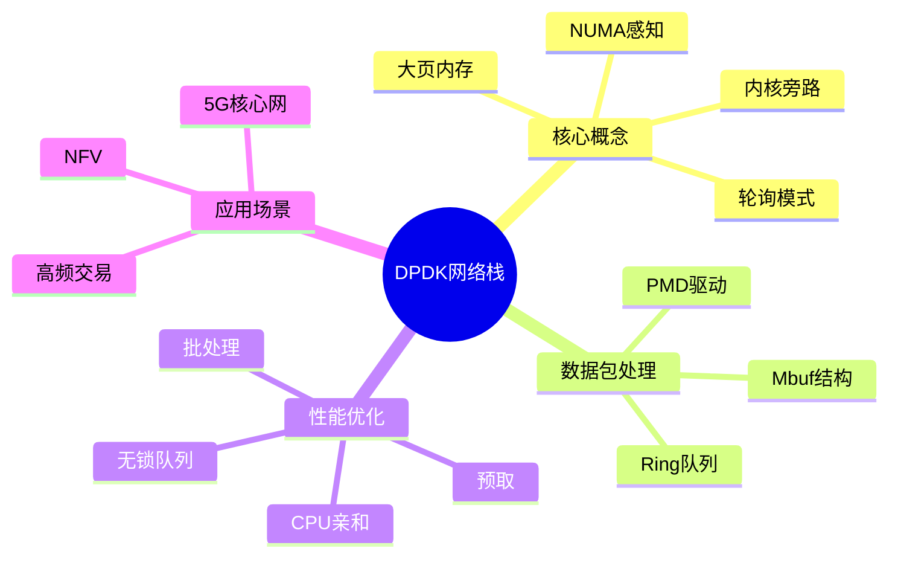

# DPDK高性能网络栈深度解析

> **层级定位**: 04 Industrial Scenarios / 03 High Frequency Trading
> **对应标准**: DPDK 21.x/22.x/23.x
> **难度级别**: L5 综合
> **预估学习时间**: 10-15 小时

---

## 📋 本节概要

| 属性 | 内容 |
|:-----|:-----|
| **核心概念** | 内核旁路、轮询模式、大页内存、零拷贝、CPU亲和性 |
| **前置知识** | 网络协议栈、内存管理、并发编程 |
| **后续延伸** | FPGA加速、RDMA、智能网卡 |
| **权威来源** | DPDK文档, Intel DPDK Programmer's Guide |

---

## 🧠 知识结构思维导图



---

## 📖 核心概念详解

### 1. DPDK架构

```
┌─────────────────────────────────────────────────────────────────┐
│                     DPDK 架构                                   │
├─────────────────────────────────────────────────────────────────┤
│                                                                  │
│  ┌─────────────────────────────────────────────────────────┐   │
│  │                      应用程序                            │   │
│  │         (L2/L3 Forwarding / Firewall / Load Balancer)   │   │
│  └─────────────────────────────────────────────────────────┘   │
│                              │                                   │
│  ┌───────────────────────────┼───────────────────────────────┐   │
│  │                           ▼                               │   │
│  │  ┌─────────────────────────────────────────────────────┐  │   │
│  │  │            DPDK Libraries                          │  │   │
│  │  │  ┌─────────┐ ┌─────────┐ ┌─────────┐ ┌──────────┐ │  │   │
│  │  │  │  Mempool │ │  Ring   │ │  Mbuf   │ │   EAL    │ │  │   │
│  │  │  └─────────┘ └─────────┘ └─────────┘ └──────────┘ │  │   │
│  │  │  ┌─────────┐ ┌─────────┐ ┌─────────┐ ┌──────────┐ │  │   │
│  │  │  │   PMD   │ │  Timer  │ │  Hash   │ │   ACL    │ │  │   │
│  │  │  └─────────┘ └─────────┘ └─────────┘ └──────────┘ │  │   │
│  │  └─────────────────────────────────────────────────────┘  │   │
│  │                           │                               │   │
│  │                      EAL (Environment Abstraction Layer)   │   │
│  └───────────────────────────┼───────────────────────────────┘   │
│                              │                                   │
│  ┌───────────────────────────┼───────────────────────────────┐   │
│  │                           ▼                               │   │
│  │  ┌─────────────────────────────────────────────────────┐  │   │
│  │  │                 Linux Kernel                         │  │   │
│  │  │  ┌─────────┐ ┌─────────┐ ┌───────────────────────┐  │  │   │
│  │  │  │ Hugepage │ │   UIO   │ │    VFIO (IOMMU)      │  │  │   │
│  │  │  │  Driver  │ │ Driver  │ │      Driver          │  │  │   │
│  │  │  └─────────┘ └─────────┘ └───────────────────────┘  │  │   │
│  │  └─────────────────────────────────────────────────────┘  │   │
│  │                           │                               │   │
│  └───────────────────────────┼───────────────────────────────┘   │
│                              │                                   │
│                       ┌──────┴──────┐                           │
│                       ▼             ▼                           │
│                  ┌─────────┐   ┌─────────┐                      │
│                  │  NIC    │   │  NIC    │                      │
│                  │Physical │   │Physical │                      │
│                  └─────────┘   └─────────┘                      │
│                                                                  │
└─────────────────────────────────────────────────────────────────┘
```

### 2. EAL初始化

```c
// DPDK EAL (Environment Abstraction Layer) 初始化

#include <rte_eal.h>
#include <rte_ethdev.h>
#include <rte_mempool.h>
#include <rte_mbuf.h>

// 初始化DPDK
int dpdk_init(int argc, char **argv) {
    int ret;

    // 1. EAL初始化
    ret = rte_eal_init(argc, argv);
    if (ret < 0) {
        rte_exit(EXIT_FAILURE, "EAL initialization failed\n");
    }

    // 2. 检查可用端口
    uint16_t nb_ports = rte_eth_dev_count_avail();
    if (nb_ports == 0) {
        rte_exit(EXIT_FAILURE, "No Ethernet ports available\n");
    }

    printf("DPDK initialized. Available ports: %u\n", nb_ports);

    // 3. 创建内存池
    struct rte_mempool *mbuf_pool = rte_pktmbuf_pool_create(
        "MBUF_POOL",                    // 名称
        NUM_MBUFS * nb_ports,           // 元素数量
        MBUF_CACHE_SIZE,                // 缓存大小
        0,                              // 私有数据大小
        RTE_MBUF_DEFAULT_BUF_SIZE,      // 数据缓冲区大小
        rte_socket_id()                 // NUMA节点
    );

    if (mbuf_pool == NULL) {
        rte_exit(EXIT_FAILURE, "Cannot create mbuf pool\n");
    }

    // 4. 初始化每个端口
    for (uint16_t portid = 0; portid < nb_ports; portid++) {
        init_port(portid, mbuf_pool);
    }

    return 0;
}

// 端口初始化
int init_port(uint16_t portid, struct rte_mempool *mbuf_pool) {
    struct rte_eth_conf port_conf = {0};
    struct rte_eth_dev_info dev_info;

    // 获取设备信息
    rte_eth_dev_info_get(portid, &dev_info);

    // 配置接收队列
    port_conf.rxmode.max_rx_pkt_len = RTE_ETHER_MAX_LEN;
    port_conf.rxmode.mq_mode = ETH_MQ_RX_RSS;  // RSS多队列

    // 配置RSS
    port_conf.rx_adv_conf.rss_conf.rss_key = NULL;
    port_conf.rx_adv_conf.rss_conf.rss_hf =
        ETH_RSS_IP | ETH_RSS_TCP | ETH_RSS_UDP;

    // 配置端口
    int ret = rte_eth_dev_configure(portid, RX_RINGS, TX_RINGS, &port_conf);
    if (ret != 0) {
        rte_exit(EXIT_FAILURE, "Port %u configuration failed\n", portid);
    }

    // 设置接收队列
    for (uint16_t q = 0; q < RX_RINGS; q++) {
        ret = rte_eth_rx_queue_setup(
            portid, q, RX_RING_SIZE,
            rte_eth_dev_socket_id(portid),
            NULL, mbuf_pool
        );
        if (ret < 0) {
            rte_exit(EXIT_FAILURE, "RX queue setup failed\n");
        }
    }

    // 设置发送队列
    for (uint16_t q = 0; q < TX_RINGS; q++) {
        ret = rte_eth_tx_queue_setup(
            portid, q, TX_RING_SIZE,
            rte_eth_dev_socket_id(portid),
            NULL
        );
        if (ret < 0) {
            rte_exit(EXIT_FAILURE, "TX queue setup failed\n");
        }
    }

    // 启动端口
    ret = rte_eth_dev_start(portid);
    if (ret < 0) {
        rte_exit(EXIT_FAILURE, "Port start failed\n");
    }

    // 启用混杂模式
    rte_eth_promiscuous_enable(portid);

    return 0;
}
```

### 3. 数据包接收与发送

```c
// 高性能数据包处理

#define BURST_SIZE 32

// 接收数据包
void receive_packets(uint16_t portid, uint16_t queueid) {
    struct rte_mbuf *bufs[BURST_SIZE];

    // 批量接收
    uint16_t nb_rx = rte_eth_rx_burst(portid, queueid, bufs, BURST_SIZE);

    if (nb_rx == 0)
        return;

    // 处理每个数据包
    for (uint16_t i = 0; i < nb_rx; i++) {
        struct rte_mbuf *mbuf = bufs[i];

        // 获取数据包指针
        uint8_t *pkt_data = rte_pktmbuf_mtod(mbuf, uint8_t *);
        uint16_t pkt_len = rte_pktmbuf_data_len(mbuf);

        // 解析以太网头
        struct rte_ether_hdr *eth_hdr = (struct rte_ether_hdr *)pkt_data;

        // 检查IP数据包
        if (eth_hdr->ether_type == rte_cpu_to_be_16(RTE_ETHER_TYPE_IPV4)) {
            process_ipv4_packet(mbuf);
        } else if (eth_hdr->ether_type == rte_cpu_to_be_16(RTE_ETHER_TYPE_IPV6)) {
            process_ipv6_packet(mbuf);
        }

        // 释放mbuf
        rte_pktmbuf_free(mbuf);
    }
}

// L3转发示例
void l3_forward(struct rte_mbuf *mbuf) {
    uint8_t *pkt_data = rte_pktmbuf_mtod(mbuf, uint8_t *);
    struct rte_ether_hdr *eth_hdr = (struct rte_ether_hdr *)pkt_data;
    struct rte_ipv4_hdr *ip_hdr = (struct rte_ipv4_hdr *)(eth_hdr + 1);

    // TTL递减
    if (ip_hdr->time_to_live <= 1) {
        // TTL过期，丢弃
        rte_pktmbuf_free(mbuf);
        return;
    }
    ip_hdr->time_to_live--;

    // 重新计算IP校验和（增量更新）
    ip_hdr->hdr_checksum = rte_ipv4_cksum_update(
        ip_hdr->hdr_checksum,
        rte_cpu_to_be_16(0x0100)  // TTL字段变化
    );

    // 查找路由表
    uint32_t dst_ip = rte_be_to_cpu_32(ip_hdr->dst_addr);
    struct route_entry *route = route_lookup(dst_ip);

    if (route == NULL) {
        rte_pktmbuf_free(mbuf);
        return;
    }

    // 修改MAC地址
    memcpy(eth_hdr->dst_addr.addr_bytes, route->next_hop_mac, RTE_ETHER_ADDR_LEN);
    memcpy(eth_hdr->src_addr.addr_bytes, route->src_mac, RTE_ETHER_ADDR_LEN);

    // 发送
    uint16_t nb_tx = rte_eth_tx_burst(route->portid, 0, &mbuf, 1);
    if (nb_tx == 0) {
        rte_pktmbuf_free(mbuf);
    }
}

// 批处理发送
void send_packets(uint16_t portid, uint16_t queueid,
                  struct rte_mbuf **pkts, uint16_t nb_pkts) {
    uint16_t sent = 0;

    while (sent < nb_pkts) {
        uint16_t nb_tx = rte_eth_tx_burst(portid, queueid,
                                          pkts + sent, nb_pkts - sent);
        sent += nb_tx;
    }
}
```

### 4. 内存池与无锁队列

```c
// 自定义内存池（基于DPDK rte_mempool）

// 创建环形队列（无锁）
struct rte_ring *create_packet_ring(const char *name, unsigned count) {
    struct rte_ring *ring = rte_ring_create(
        name,
        count,
        rte_socket_id(),
        RING_F_SP_ENQ | RING_F_SC_DEQ  // 单生产者单消费者模式
    );

    if (ring == NULL) {
        rte_exit(EXIT_FAILURE, "Ring create failed: %s\n", rte_strerror(rte_errno));
    }

    return ring;
}

// 多生产者单消费者队列
void packet_enqueue(struct rte_ring *ring, struct rte_mbuf *mbuf) {
    // 非阻塞入队
    while (rte_ring_mp_enqueue(ring, mbuf) != 0) {
        // 队列满，自旋等待
        rte_pause();
    }
}

struct rte_mbuf *packet_dequeue(struct rte_ring *ring) {
    struct rte_mbuf *mbuf;

    // 非阻塞出队
    if (rte_ring_sc_dequeue(ring, (void **)&mbuf) == 0) {
        return mbuf;
    }

    return NULL;  // 队列空
}

// 批量出队提高效率
unsigned packet_dequeue_burst(struct rte_ring *ring,
                               struct rte_mbuf **mbufs,
                               unsigned max_count) {
    return rte_ring_sc_dequeue_burst(ring, (void **)mbufs, max_count, NULL);
}
```

### 5. CPU亲和性与优化

```c
// CPU亲和性设置

// 绑定线程到特定CPU核心
int bind_to_core(unsigned int core_id) {
    cpu_set_t cpuset;
    CPU_ZERO(&cpuset);
    CPU_SET(core_id, &cpuset);

    return pthread_setaffinity_np(pthread_self(), sizeof(cpuset), &cpuset);
}

// 启动工作线程
void launch_worker_threads(void) {
    unsigned int lcore_id;

    // DPDK EAL已经设置了主线程亲和性

    // 为每个从核启动线程
    RTE_LCORE_FOREACH_SLAVE(lcore_id) {
        rte_eal_remote_launch(worker_loop, NULL, lcore_id);
    }
}

// 工作线程主循环
int worker_loop(void *arg) {
    uint16_t portid = 0;
    uint16_t queueid = rte_lcore_id() - 1;  // 队列绑定到核心

    printf("Worker on lcore %u, queue %u\n", rte_lcore_id(), queueid);

    while (1) {
        // 轮询接收
        receive_packets(portid, queueid);

        // 可选：每N次循环检查控制信号
        // 或者使用 rte_pause() 降低CPU占用
    }

    return 0;
}

// 预取优化
void process_with_prefetch(struct rte_mbuf **bufs, uint16_t nb_rx) {
    uint16_t i;

    for (i = 0; i < nb_rx && i < PREFETCH_OFFSET; i++) {
        process_packet(bufs[i]);
    }

    for (; i < nb_rx; i++) {
        // 预取下一个数据包的数据
        rte_prefetch0(rte_pktmbuf_mtod(bufs[i], void *));
        process_packet(bufs[i - PREFETCH_OFFSET]);
    }

    // 处理剩余的
    for (i = nb_rx - PREFETCH_OFFSET; i < nb_rx; i++) {
        process_packet(bufs[i]);
    }
}
```

---

## ⚠️ 常见陷阱

### 陷阱 DPDK01: NUMA不当

```c
// ❌ 在NUMA节点0分配内存，在节点1使用
struct rte_mempool *pool = rte_pktmbuf_pool_create("pool",
    NUM_MBUFS, CACHE_SIZE, 0, BUF_SIZE, 0);  // socket 0

// 在socket 1的端口使用
rte_eth_rx_queue_setup(1, 0, RING_SIZE, 1, NULL, pool);  // 性能差！

// ✅ NUMA感知分配
int socket_id = rte_eth_dev_socket_id(portid);
struct rte_mempool *pool = rte_pktmbuf_pool_create("pool",
    NUM_MBUFS, CACHE_SIZE, 0, BUF_SIZE, socket_id);
```

### 陷阱 DPDK02: 内存泄漏

```c
// ❌ 未释放mbuf
void bad_process(struct rte_mbuf *m) {
    if (error_condition) {
        return;  // 内存泄漏！
    }
    // 处理...
    rte_pktmbuf_free(m);
}

// ✅ 正确释放
void good_process(struct rte_mbuf *m) {
    if (error_condition) {
        rte_pktmbuf_free(m);  // 释放
        return;
    }
    // 处理...
    rte_pktmbuf_free(m);
}
```

---

## ✅ 质量验收清单

- [x] DPDK架构详解
- [x] EAL初始化
- [x] 数据包收发
- [x] 内存池与无锁队列
- [x] CPU亲和性优化
- [x] 常见陷阱

---

> **更新记录**
>
> - 2025-03-09: 初版创建
