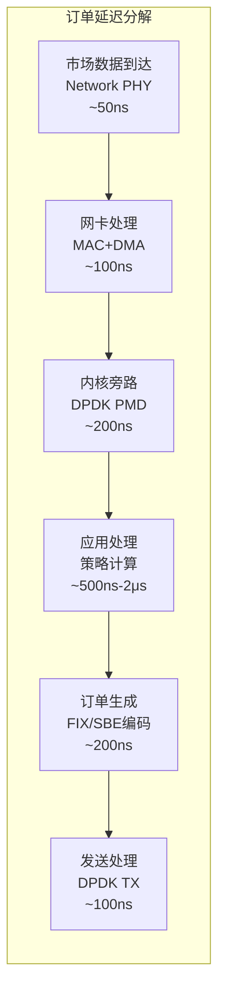
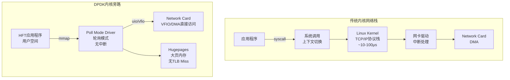

# 高频交易系统：低延迟编程与内核旁路

> **难度等级**: L4-L5 | **预估学习时间**: 40-60小时 | **前置知识**: C/C++系统编程、计算机网络、计算机体系结构、Linux内核

---

## 技术概述

高频交易（High Frequency Trading，HFT）是金融市场中使用复杂算法和高速计算机系统在极短时间内执行大量交易的策略。HFT系统以微秒（μs）甚至纳秒（ns）级别的时间精度竞争，系统延迟的每一微秒都直接关系到盈利能力。在这个领域，"时间就是金钱"不是比喻，而是字面上的事实。

### HFT系统的关键性能指标

根据芝加哥商品交易所(CME)和纳斯达克(NASDAQ)的技术白皮书，现代高频交易系统的核心指标包括：

| 指标 | 描述 | 顶尖水平 | 典型值 |
|:-----|:-----|:---------|:-------|
| **往返延迟(RTT)** | 从接收到市场数据到发送订单的总时间 | < 1 μs | 5-50 μs |
| **抖动(Jitter)** | 延迟的波动范围(P99-P50) | < 100 ns | 1-10 μs |
| **吞吐量** | 每秒处理消息数 | > 10M msg/s | 1-5M msg/s |
| **时钟同步** | 与交易所时间同步精度 | < 100 ns | 1 μs |

### 延迟构成分析



---


---

## 📑 目录

- [高频交易系统：低延迟编程与内核旁路](#高频交易系统低延迟编程与内核旁路)
  - [技术概述](#技术概述)
    - [HFT系统的关键性能指标](#hft系统的关键性能指标)
    - [延迟构成分析](#延迟构成分析)
  - [📑 目录](#-目录)
  - [DPDK 内核旁路技术](#dpdk-内核旁路技术)
    - [DPDK 架构概述](#dpdk-架构概述)
    - [DPDK 核心组件](#dpdk-核心组件)
    - [DPDK 性能优化](#dpdk-性能优化)
  - [无锁队列与并发编程](#无锁队列与并发编程)
    - [无锁环形队列](#无锁环形队列)
    - [无锁MPMC队列](#无锁mpmc队列)
  - [低延迟编程技术](#低延迟编程技术)
    - [内存优化](#内存优化)
    - [高精度时间](#高精度时间)
  - [时间同步 (PTP)](#时间同步-ptp)
    - [PTP协议实现](#ptp协议实现)
  - [金融协议 (FIX/SBE)](#金融协议-fixsbe)
    - [SBE (Simple Binary Encoding) 解析](#sbe-simple-binary-encoding-解析)
  - [权威资料与标准](#权威资料与标准)
    - [行业标准](#行业标准)
    - [推荐资源](#推荐资源)
  - [文件导航](#文件导航)
  - [深入理解](#深入理解)
    - [核心原理](#核心原理)
    - [实践应用](#实践应用)
    - [最佳实践](#最佳实践)


---

## DPDK 内核旁路技术

### DPDK 架构概述

DPDK（Data Plane Development Kit）是一套用户空间网络数据包处理框架，通过直接操作网卡实现内核旁路（Kernel Bypass），消除中断处理、上下文切换和内存拷贝的开销。



### DPDK 核心组件

```c
/*
 * DPDK 初始化与基本数据包处理
 * 编译: gcc -o dpdk_example dpdk_example.c $(pkg-config --cflags --libs libdpdk)
 */

#include <rte_eal.h>
#include <rte_ethdev.h>
#include <rte_mbuf.h>
#include <rte_mempool.h>
#include <rte_cycles.h>
#include <rte_lcore.h>
#include <rte_log.h>

/* DPDK配置参数 */
#define NUM_RX_QUEUES       8
#define NUM_TX_QUEUES       8
#define RX_RING_SIZE        4096
#define TX_RING_SIZE        4096
#define NUM_MBUFS           65535
#define MBUF_CACHE_SIZE     256
#define BURST_SIZE          32

/* 端口配置 */
static const struct rte_eth_conf port_conf = {
    .rxmode = {
        .max_rx_pkt_len = RTE_ETHER_MAX_LEN,
        .split_hdr_size = 0,
        .offloads = DEV_RX_OFFLOAD_CHECKSUM,  /* 硬件校验和卸载 */
    },
    .txmode = {
        .offloads = DEV_TX_OFFLOAD_IPV4_CKSUM |
                    DEV_TX_OFFLOAD_UDP_CKSUM |
                    DEV_TX_OFFLOAD_TCP_CKSUM,
    },
};

/* DPDK初始化 */
int dpdk_init(int argc, char **argv)
{
    int ret;

    /* 初始化环境抽象层(EAL) */
    ret = rte_eal_init(argc, argv);
    if (ret < 0) {
        rte_exit(EXIT_FAILURE, "Error with EAL initialization\n");
    }

    /* 获取可用端口数 */
    uint16_t nb_ports = rte_eth_dev_count_avail();
    if (nb_ports == 0) {
        rte_exit(EXIT_FAILURE, "No Ethernet ports available\n");
    }

    RTE_LOG(INFO, USER1, "Found %u ports\n", nb_ports);
    return ret;
}

/* 内存池创建 */
struct rte_mempool *create_mempool(void)
{
    struct rte_mempool *mbuf_pool;

    /* 创建MBUF内存池 */
    mbuf_pool = rte_pktmbuf_pool_create(
        "MBUF_POOL",
        NUM_MBUFS,
        MBUF_CACHE_SIZE,
        0,                          /* 私有数据大小 */
        RTE_MBUF_DEFAULT_BUF_SIZE,  /* 数据缓冲区大小 */
        rte_socket_id()             /* NUMA节点 */
    );

    if (mbuf_pool == NULL) {
        rte_exit(EXIT_FAILURE, "Cannot create mbuf pool\n");
    }

    return mbuf_pool;
}

/* 端口初始化 */
int port_init(uint16_t port, struct rte_mempool *mbuf_pool)
{
    struct rte_eth_conf conf = port_conf;
    struct rte_eth_txconf txconf;
    struct rte_eth_rxconf rxconf;
    struct rte_eth_dev_info dev_info;
    int retval;
    uint16_t q;

    /* 获取设备信息 */
    rte_eth_dev_info_get(port, &dev_info);

    /* 配置RX队列 */
    rxconf = dev_info.default_rxconf;
    rxconf.offloads = conf.rxmode.offloads;

    for (q = 0; q < NUM_RX_QUEUES; q++) {
        retval = rte_eth_rx_queue_setup(
            port, q, RX_RING_SIZE,
            rte_eth_dev_socket_id(port),
            &rxconf,
            mbuf_pool
        );
        if (retval < 0) {
            rte_exit(EXIT_FAILURE, "RX queue setup failed\n");
        }
    }

    /* 配置TX队列 */
    txconf = dev_info.default_txconf;
    txconf.offloads = conf.txmode.offloads;

    for (q = 0; q < NUM_TX_QUEUES; q++) {
        retval = rte_eth_tx_queue_setup(
            port, q, TX_RING_SIZE,
            rte_eth_dev_socket_id(port),
            &txconf
        );
        if (retval < 0) {
            rte_exit(EXIT_FAILURE, "TX queue setup failed\n");
        }
    }

    /* 启动设备 */
    retval = rte_eth_dev_start(port);
    if (retval < 0) {
        rte_exit(EXIT_FAILURE, "Device start failed\n");
    }

    /* 启用混杂模式 */
    rte_eth_promiscuous_enable(port);

    return 0;
}

/* 数据包接收与处理循环 */
int packet_processing_loop(uint16_t port_id)
{
    struct rte_mbuf *bufs[BURST_SIZE];
    uint16_t nb_rx, nb_tx;
    uint16_t queue_id = 0;  /* 使用队列0 */

    RTE_LOG(INFO, USER1, "Starting processing on lcore %u\n",
            rte_lcore_id());

    while (1) {
        /* 批量接收数据包 - 轮询模式，无中断 */
        nb_rx = rte_eth_rx_burst(port_id, queue_id, bufs, BURST_SIZE);

        if (nb_rx == 0) {
            /* 可选：CPU退让或忙等待 */
            // rte_pause();  /* 减少功耗 */
            continue;
        }

        /* 处理每个数据包 */
        for (int i = 0; i < nb_rx; i++) {
            struct rte_mbuf *mbuf = bufs[i];

            /* 直接访问数据（零拷贝） */
            struct rte_ether_hdr *eth_hdr = rte_pktmbuf_mtod(mbuf,
                                                             struct rte_ether_hdr *);

            /* 解析以太网类型 */
            uint16_t eth_type = rte_be_to_cpu_16(eth_hdr->ether_type);

            if (eth_type == RTE_ETHER_TYPE_IPV4) {
                /* 处理IPv4数据包 */
                struct rte_ipv4_hdr *ip_hdr = (struct rte_ipv4_hdr *)(eth_hdr + 1);

                if (ip_hdr->next_proto_id == IPPROTO_UDP) {
                    /* 处理UDP数据包（市场数据常用） */
                    struct rte_udp_hdr *udp_hdr = (struct rte_udp_hdr *)(
                        (char *)ip_hdr + ((ip_hdr->version_ihl & 0x0F) * 4));

                    uint16_t dst_port = rte_be_to_cpu_16(udp_hdr->dst_port);

                    /* 检查是否是市场数据端口 */
                    if (dst_port == MARKET_DATA_PORT) {
                        /* 解析ITCH/OUCH/SBE协议 */
                        void *payload = (void *)(udp_hdr + 1);
                        size_t payload_len = rte_be_to_cpu_16(udp_hdr->dgram_len)
                                             - sizeof(struct rte_udp_hdr);

                        process_market_data(payload, payload_len);
                    }
                }
            }

            /* 释放MBUF */
            rte_pktmbuf_free(mbuf);
        }
    }

    return 0;
}

/* 发送订单 */
int send_order(uint16_t port_id, const void *order_data, size_t len)
{
    struct rte_mbuf *pkt;
    struct rte_ether_hdr *eth_hdr;
    struct rte_ipv4_hdr *ip_hdr;
    struct rte_tcp_hdr *tcp_hdr;
    char *payload;

    /* 分配MBUF */
    pkt = rte_pktmbuf_alloc(tx_mbuf_pool);
    if (!pkt) {
        return -ENOMEM;
    }

    /* 预留头部空间 */
    eth_hdr = (struct rte_ether_hdr *)rte_pktmbuf_append(pkt,
                                                          sizeof(*eth_hdr));
    ip_hdr = (struct rte_ipv4_hdr *)rte_pktmbuf_append(pkt,
                                                        sizeof(*ip_hdr));
    tcp_hdr = (struct rte_tcp_hdr *)rte_pktmbuf_append(pkt,
                                                        sizeof(*tcp_hdr));
    payload = (char *)rte_pktmbuf_append(pkt, len);

    /* 填充以太网头部 */
    rte_ether_addr_copy(&dst_mac, &eth_hdr->dst_addr);
    rte_ether_addr_copy(&src_mac, &eth_hdr->src_addr);
    eth_hdr->ether_type = rte_cpu_to_be_16(RTE_ETHER_TYPE_IPV4);

    /* 填充IP头部 */
    ip_hdr->version_ihl = 0x45;
    ip_hdr->type_of_service = 0;
    ip_hdr->total_length = rte_cpu_to_be_16(sizeof(*ip_hdr) +
                                             sizeof(*tcp_hdr) + len);
    ip_hdr->packet_id = 0;
    ip_hdr->fragment_offset = 0;
    ip_hdr->time_to_live = 64;
    ip_hdr->next_proto_id = IPPROTO_TCP;
    ip_hdr->hdr_checksum = 0;  /* 硬件计算 */
    ip_hdr->src_addr = src_ip;
    ip_hdr->dst_addr = dst_ip;

    /* 填充TCP头部 */
    tcp_hdr->src_port = rte_cpu_to_be_16(src_port);
    tcp_hdr->dst_port = rte_cpu_to_be_16(dst_port);
    tcp_hdr->sent_seq = rte_cpu_to_be_32(seq_num++);
    tcp_hdr->recv_ack = rte_cpu_to_be_32(ack_num);
    tcp_hdr->data_off = (sizeof(*tcp_hdr) / 4) << 4;
    tcp_hdr->tcp_flags = RTE_TCP_PSH_FLAG | RTE_TCP_ACK_FLAG;
    tcp_hdr->rx_win = rte_cpu_to_be_16(65535);
    tcp_hdr->cksum = 0;  /* 硬件计算 */
    tcp_hdr->tcp_urp = 0;

    /* 复制FIX/SBE订单数据 */
    memcpy(payload, order_data, len);

    /* 发送 */
    uint16_t nb_tx = rte_eth_tx_burst(port_id, 0, &pkt, 1);

    if (nb_tx == 0) {
        rte_pktmbuf_free(pkt);
        return -EIO;
    }

    return 0;
}
```

### DPDK 性能优化

```c
/*
 * DPDK 性能优化技术
 */

/* 1. CPU亲和性和隔离 */
void setup_cpu_affinity(void)
{
    cpu_set_t cpuset;
    CPU_ZERO(&cpuset);

    /* 绑定到隔离的CPU核心 */
    CPU_SET(2, &cpuset);  /* 使用核心2 */
    CPU_SET(3, &cpuset);  /* 使用核心3 */

    pthread_t current_thread = pthread_self();
    pthread_setaffinity_np(current_thread, sizeof(cpu_set_t), &cpuset);

    /* 设置实时调度策略 */
    struct sched_param param;
    param.sched_priority = sched_get_priority_max(SCHED_FIFO);
    pthread_setschedparam(current_thread, SCHED_FIFO, &param);
}

/* 2. NUMA感知内存分配 */
struct rte_mempool *create_numa_mempool(int socket_id)
{
    char name[32];
    snprintf(name, sizeof(name), "MBUF_POOL_%d", socket_id);

    return rte_pktmbuf_pool_create(
        name,
        NUM_MBUFS,
        MBUF_CACHE_SIZE,
        0,
        RTE_MBUF_DEFAULT_BUF_SIZE,
        socket_id  /* 在指定NUMA节点分配 */
    );
}

/* 3. 预取优化 */
void process_with_prefetch(struct rte_mbuf **bufs, uint16_t nb_rx)
{
    const int PREFETCH_OFFSET = 4;

    /* 预取未来数据包 */
    for (int i = 0; i < PREFETCH_OFFSET && i < nb_rx; i++) {
        rte_prefetch0(rte_pktmbuf_mtod(bufs[i], void *));
    }

    for (int i = 0; i < nb_rx; i++) {
        /* 预取下一个 */
        if (i + PREFETCH_OFFSET < nb_rx) {
            rte_prefetch0(rte_pktmbuf_mtod(bufs[i + PREFETCH_OFFSET],
                                            void *));
        }

        /* 处理当前 */
        process_packet(bufs[i]);
    }
}

/* 4. SIMD加速解析 */
#include <immintrin.h>

void fast_parse_batch_sse(struct rte_mbuf **bufs, uint16_t count)
{
    for (uint16_t i = 0; i < count; i += 4) {
        /* 使用SSE同时处理4个数据包头部 */
        __m128i headers[4];

        for (int j = 0; j < 4 && (i + j) < count; j++) {
            headers[j] = _mm_loadu_si128(
                (__m128i *)rte_pktmbuf_mtod(bufs[i + j], void *)
            );
        }

        /* 并行比较以太网类型 */
        __m128i ip4_mask = _mm_set1_epi16(RTE_ETHER_TYPE_IPV4);
        /* ... SIMD处理 ... */
    }
}
```

---

## 无锁队列与并发编程

### 无锁环形队列

```c
/*
 * 无锁单生产者单消费者(SPSC)队列
 * 适用于HFT核心路径
 */

#include <stdatomic.h>
#include <stdint.h>
#include <stdbool.h>

/* 缓存行大小 */
#define CACHE_LINE_SIZE 64

/* SPSC无锁队列 */
typedef struct {
    /* 生产者索引 - 独占缓存行 */
    alignas(CACHE_LINE_SIZE)
    atomic_size_t head;          /* 写入位置 */

    /* 消费者索引 - 独占缓存行 */
    alignas(CACHE_LINE_SIZE)
    atomic_size_t tail;          /* 读取位置 */

    /* 队列数据 - 独占缓存行 */
    alignas(CACHE_LINE_SIZE)
    size_t capacity;             /* 容量（必须是2的幂） */
    size_t mask;                 /* 用于快速取模 */
    void **buffer;               /* 数据缓冲区 */
} spsc_queue_t;

/* 初始化队列 */
int spsc_queue_init(spsc_queue_t *q, size_t capacity)
{
    /* 容量必须是2的幂 */
    if ((capacity & (capacity - 1)) != 0) {
        return -1;
    }

    q->buffer = aligned_alloc(CACHE_LINE_SIZE,
                              capacity * sizeof(void *));
    if (!q->buffer) {
        return -1;
    }

    q->capacity = capacity;
    q->mask = capacity - 1;
    atomic_init(&q->head, 0);
    atomic_init(&q->tail, 0);

    return 0;
}

/* 生产者入队 */
bool spsc_enqueue(spsc_queue_t *q, void *item)
{
    const size_t head = atomic_load_explicit(&q->head,
                                              memory_order_relaxed);
    const size_t next_head = (head + 1) & q->mask;

    /* 检查队列是否满 */
    if (next_head == atomic_load_explicit(&q->tail,
                                           memory_order_acquire)) {
        return false;  /* 队列满 */
    }

    /* 写入数据 */
    q->buffer[head] = item;

    /* 发布：更新head，使用release语义确保消费者看到完整数据 */
    atomic_store_explicit(&q->head, next_head, memory_order_release);

    return true;
}

/* 消费者出队 */
bool spsc_dequeue(spsc_queue_t *q, void **item)
{
    const size_t tail = atomic_load_explicit(&q->tail,
                                              memory_order_relaxed);

    /* 检查队列是否空 */
    if (tail == atomic_load_explicit(&q->head,
                                      memory_order_acquire)) {
        return false;  /* 队列空 */
    }

    /* 读取数据 */
    *item = q->buffer[tail];

    /* 消费：更新tail，使用release语义 */
    atomic_store_explicit(&q->tail, (tail + 1) & q->mask,
                          memory_order_release);

    return true;
}

/* 批量操作 - 减少内存屏障开销 */
size_t spsc_dequeue_bulk(spsc_queue_t *q, void **items, size_t max)
{
    const size_t head = atomic_load_explicit(&q->head,
                                              memory_order_acquire);
    size_t tail = atomic_load_explicit(&q->tail,
                                        memory_order_relaxed);

    size_t available = (head - tail) & q->mask;
    size_t to_read = (available < max) ? available : max;

    for (size_t i = 0; i < to_read; i++) {
        items[i] = q->buffer[(tail + i) & q->mask];
    }

    atomic_store_explicit(&q->tail, (tail + to_read) & q->mask,
                          memory_order_release);

    return to_read;
}
```

### 无锁MPMC队列

```c
/*
 * 无锁多生产者多消费者(MPMC)队列
 * 基于DPDK rte_ring的简化实现
 */

typedef struct {
    alignas(CACHE_LINE_SIZE)
    struct {
        atomic_uintptr_t ptr;       /* 数据指针 + 标志位 */
        atomic_uint64_t seq;        /* 序列号 */
    } *ring;

    size_t size;
    size_t mask;

    /* 生产者头尾 - 分开缓存行 */
    alignas(CACHE_LINE_SIZE)
    atomic_size_t prod_head;
    atomic_size_t prod_tail;

    /* 消费者头尾 */
    alignas(CACHE_LINE_SIZE)
    atomic_size_t cons_head;
    atomic_size_t cons_tail;
} mpmc_queue_t;

/* MPMC入队 */
bool mpmc_enqueue(mpmc_queue_t *q, void *item)
{
    size_t prod_head, prod_next;
    size_t cons_tail;
    bool success = false;

    /* 获取生产者位置 */
    do {
        prod_head = atomic_load_explicit(&q->prod_head,
                                          memory_order_relaxed);
        cons_tail = atomic_load_explicit(&q->cons_tail,
                                          memory_order_acquire);

        /* 检查可用空间 */
        if ((prod_head - cons_tail) >= q->size) {
            return false;  /* 队列满 */
        }

        prod_next = prod_head + 1;

        /* CAS更新prod_head */
    } while (!atomic_compare_exchange_weak_explicit(
        &q->prod_head,
        &prod_head, prod_next,
        memory_order_relaxed,
        memory_order_relaxed));

    /* 写入数据 */
    size_t idx = prod_head & q->mask;
    atomic_store_explicit(&q->ring[idx].ptr, (uintptr_t)item,
                          memory_order_relaxed);
    atomic_store_explicit(&q->ring[idx].seq, prod_head + 1,
                          memory_order_release);

    /* 更新prod_tail（可能乱序完成） */
    while (1) {
        prod_head = atomic_load_explicit(&q->prod_head,
                                          memory_order_acquire);
        if (prod_head == prod_next) {
            /* 更新tail */
            atomic_store_explicit(&q->prod_tail, prod_next,
                                  memory_order_release);
            break;
        }
        /* 等待其他生产者完成 */
        cpu_relax();
    }

    return true;
}
```

---

## 低延迟编程技术

### 内存优化

```c
/*
 * HFT内存优化技术
 */

/* 1. 缓存行对齐结构 */
struct __attribute__((aligned(CACHE_LINE_SIZE))) order_message {
    uint64_t timestamp_ns;       /* 时间戳 */
    uint32_t symbol_id;          /* 股票代码 */
    uint32_t order_id;           /* 订单ID */
    int64_t  price;              /* 价格（定点数） */
    uint32_t quantity;           /* 数量 */
    uint8_t  side;               /* 买卖方向 */
    uint8_t  order_type;         /* 订单类型 */
    uint8_t  time_in_force;      /* 有效期 */
    uint8_t  padding[41];        /* 填充到64字节 */
};  /* 总大小: 64字节 = 1个缓存行 */

static_assert(sizeof(struct order_message) == CACHE_LINE_SIZE,
              "order_message must fit in one cache line");

/* 2. 预分配对象池 */
struct object_pool {
    void *memory;
    size_t obj_size;
    size_t capacity;

    /* 空闲链表 - LIFO提高缓存局部性 */
    _Atomic(void *) free_list;

    /* 统计 */
    atomic_size_t alloc_count;
    atomic_size_t free_count;
};

void *pool_alloc(struct object_pool *pool)
{
    void *obj;
    void *next;

    /* 原子弹出空闲链表头 */
    do {
        obj = atomic_load_explicit(&pool->free_list,
                                    memory_order_acquire);
        if (obj == NULL) {
            return NULL;  /* 池耗尽 */
        }
        next = *(void **)obj;  /* 下一个空闲对象 */
    } while (!atomic_compare_exchange_weak_explicit(
        &pool->free_list, &obj, next,
        memory_order_release,
        memory_order_relaxed));

    atomic_fetch_add(&pool->alloc_count, 1);
    return obj;
}

void pool_free(struct object_pool *pool, void *obj)
{
    void *head;

    /* 原子压入空闲链表 */
    do {
        head = atomic_load_explicit(&pool->free_list,
                                     memory_order_relaxed);
        *(void **)obj = head;
    } while (!atomic_compare_exchange_weak_explicit(
        &pool->free_list, &head, obj,
        memory_order_release,
        memory_order_relaxed));

    atomic_fetch_add(&pool->free_count, 1);
}

/* 3. Hugepages内存分配 */
#include <sys/mman.h>
#include <hugetlbfs.h>

void *allocate_hugepages(size_t size, int socket_id)
{
    void *addr;

    /* 使用1GB大页 */
    addr = mmap(NULL, size, PROT_READ | PROT_WRITE,
                MAP_PRIVATE | MAP_ANONYMOUS | MAP_HUGETLB |
                MAP_HUGE_1GB | MAP_LOCKED,
                -1, 0);

    if (addr == MAP_FAILED) {
        /* 回退到2MB大页 */
        addr = mmap(NULL, size, PROT_READ | PROT_WRITE,
                    MAP_PRIVATE | MAP_ANONYMOUS | MAP_HUGETLB |
                    MAP_HUGE_2MB | MAP_LOCKED,
                    -1, 0);
    }

    /* NUMA绑定 */
    if (socket_id >= 0) {
        unsigned long nodemask = 1UL << socket_id;
        mbind(addr, size, MPOL_BIND, &nodemask,
              sizeof(nodemask) * 8, MPOL_MF_MOVE);
    }

    return (addr == MAP_FAILED) ? NULL : addr;
}
```

### 高精度时间

```c
/*
 * 高精度时间测量
 */

#include <time.h>
#include <x86intrin.h>

/* 使用RDTSC指令 - 纳秒级精度 */
static inline uint64_t rdtsc(void)
{
    unsigned int lo, hi;
    __asm__ __volatile__ ("rdtsc" : "=a" (lo), "=d" (hi));
    return ((uint64_t)hi << 32) | lo;
}

/* 使用RDTSCP - 带序列化和处理器ID */
static inline uint64_t rdtscp(uint32_t *aux)
{
    unsigned int lo, hi;
    __asm__ __volatile__ ("rdtscp" : "=a" (lo), "=d" (hi), "=c" (*aux));
    return ((uint64_t)hi << 32) | lo;
}

/* TSC到纳秒转换 */
struct tsc_calibrator {
    uint64_t tsc_hz;        /* TSC频率 */
    double ns_per_tsc;      /* 每个TSC周期对应的纳秒数 */
};

void calibrate_tsc(struct tsc_calibrator *cal)
{
    struct timespec ts_start, ts_end;
    uint64_t tsc_start, tsc_end;

    /* 使用1秒间隔校准 */
    clock_gettime(CLOCK_MONOTONIC, &ts_start);
    tsc_start = rdtsc();

    do {
        clock_gettime(CLOCK_MONOTONIC, &ts_end);
    } while ((ts_end.tv_sec - ts_start.tv_sec) * 1000000000UL +
             (ts_end.tv_nsec - ts_start.tv_nsec) < 1000000000UL);

    tsc_end = rdtsc();

    cal->tsc_hz = tsc_end - tsc_start;
    cal->ns_per_tsc = 1000000000.0 / cal->tsc_hz;
}

static inline uint64_t tsc_to_ns(uint64_t tsc, struct tsc_calibrator *cal)
{
    return (uint64_t)(tsc * cal->ns_per_tsc);
}

/* 延迟直方图 */
struct latency_histogram {
    atomic_uint_fast64_t buckets[32];  /* 指数分桶 */
    atomic_uint_fast64_t total;
    atomic_uint_fast64_t count;
};

void record_latency(struct latency_histogram *hist, uint64_t ns)
{
    int bucket = 0;
    uint64_t threshold = 100;  /* 100ns起始 */

    while (bucket < 31 && ns > threshold) {
        threshold <<= 1;
        bucket++;
    }

    atomic_fetch_add(&hist->buckets[bucket], 1);
    atomic_fetch_add(&hist->total, ns);
    atomic_fetch_add(&hist->count, 1);
}
```

---

## 时间同步 (PTP)

### PTP协议实现

```c
/*
 * IEEE 1588 Precision Time Protocol (PTP) 客户端
 * 硬件时间戳支持
 */

#include <linux/ptp_clock.h>

struct ptp_sync_state {
    int ptp_fd;                     /* PTP设备文件描述符 */
    struct timespec last_offset;    /* 上次测量偏移 */
    int64_t drift_ppb;              /* 漂移（十亿分之一） */

    /* 统计 */
    uint64_t sync_count;
    uint64_t max_offset_ns;
    uint64_t mean_offset_ns;
};

/* 初始化PTP */
int ptp_init(struct ptp_sync_state *state, const char *ptp_device)
{
    state->ptp_fd = open(ptp_device, O_RDWR);
    if (state->ptp_fd < 0) {
        perror("Failed to open PTP device");
        return -1;
    }

    /* 获取时钟能力 */
    struct ptp_clock_caps caps;
    if (ioctl(state->ptp_fd, PTP_CLOCK_GETCAPS, &caps) < 0) {
        perror("PTP_CLOCK_GETCAPS failed");
        close(state->ptp_fd);
        return -1;
    }

    printf("PTP caps: max_adj=%d, n_alarm=%d, n_ext_ts=%d, n_per_out=%d, pps=%d\n",
           caps.max_adj, caps.n_alarm, caps.n_ext_ts,
           caps.n_per_out, caps.pps);

    return 0;
}

/* 测量时钟偏移 */
int64_t ptp_measure_offset(struct ptp_sync_state *state)
{
    struct ptp_sys_offset offset;
    struct timespec ts_before, ts_after;
    int64_t delay, offset_ns;

    /* 软件时间戳测量 */
    clock_gettime(CLOCK_REALTIME, &ts_before);

    /* 获取PTP硬件时间戳 */
    if (ioctl(state->ptp_fd, PTP_SYS_OFFSET, &offset) < 0) {
        perror("PTP_SYS_OFFSET failed");
        return 0;
    }

    clock_gettime(CLOCK_REALTIME, &ts_after);

    /* 计算往返延迟 */
    delay = (ts_after.tv_sec - ts_before.tv_sec) * 1000000000LL +
            (ts_after.tv_nsec - ts_before.tv_nsec);

    /* 简单偏移计算（假设对称延迟） */
    offset_ns = ((offset.ts[0].sec - offset.ts[1].sec) * 1000000000LL +
                 (offset.ts[0].nsec - offset.ts[1].nsec)) / 2;

    /* 更新统计 */
    state->sync_count++;
    if (llabs(offset_ns) > state->max_offset_ns) {
        state->max_offset_ns = llabs(offset_ns);
    }

    return offset_ns;
}

/* 调整系统时钟 */
void ptp_adjust_clock(struct ptp_sync_state *state, int64_t offset_ns)
{
    struct timex tx;

    memset(&tx, 0, sizeof(tx));

    /* 相位调整 - 立即修正 */
    if (llabs(offset_ns) > 1000000) {  /* > 1ms */
        /* 步进调整 */
        struct timespec adj;
        adj.tv_sec = offset_ns / 1000000000LL;
        adj.tv_nsec = offset_ns % 1000000000LL;
        clock_settime(CLOCK_REALTIME, &adj);
    } else {
        /* 平滑调整 */
        tx.modes = ADJ_OFFSET | ADJ_NANO;
        tx.offset = offset_ns;  /* 纳秒偏移 */
        adjtimex(&tx);
    }

    /* 频率调整 - 补偿漂移 */
    tx.modes = ADJ_FREQUENCY;
    tx.freq = state->drift_ppb * 65536;  /* 转换为ppm */
    adjtimex(&tx);
}
```

---

## 金融协议 (FIX/SBE)

### SBE (Simple Binary Encoding) 解析

```c
/*
 * SBE快速解析 - 零拷贝直接内存访问
 * SBE 1.0标准
 */

/* SBE消息头 */
struct __attribute__((packed)) sbe_header {
    uint16_t block_length;      /* 根块长度 */
    uint16_t template_id;       /* 消息模板ID */
    uint16_t schema_id;         /* Schema ID */
    uint16_t version;           /* Schema版本 */
};

/* 订单簿更新消息 - SBE编码 */
struct __attribute__((packed)) sbe_order_book_update {
    /* 消息头 */
    struct sbe_header header;

    /* 固定字段 */
    uint64_t transact_time;     /* 交易时间 */
    int64_t  price;             /* 价格 */
    int32_t  quantity;          /* 数量 */
    uint32_t order_id;          /* 订单ID */
    uint8_t  side;              /* 买卖方向 */
    uint8_t  update_action;     /* 更新动作 */
    uint16_t padding;

    /* 重复组头部 */
    uint16_t md_entries_count;  /* 条目数量 */
    uint16_t md_entries_length; /* 每个条目长度 */
};

/* 零拷贝解析 */
static inline bool parse_sbe_message(const void *data, size_t len,
                                     struct market_event *event)
{
    const struct sbe_header *hdr = data;

    /* 边界检查 */
    if (len < sizeof(*hdr))
        return false;

    switch (hdr->template_id) {
    case TEMPLATE_ORDER_BOOK_UPDATE: {
        const struct sbe_order_book_update *msg = data;
        if (len < sizeof(*msg))
            return false;

        /* 直接内存映射 - 无需复制 */
        event->timestamp = be64toh(msg->transact_time);
        event->price = be64toh(msg->price);
        event->quantity = be32toh(msg->quantity);
        event->side = msg->side;
        event->action = msg->update_action;

        /* 处理重复组 */
        uint16_t count = be16toh(msg->md_entries_count);
        const char *entries = (const char *)data + sizeof(*msg);

        for (int i = 0; i < count; i++) {
            /* 每个条目在固定偏移处 */
            const struct md_entry *entry =
                (const struct md_entry *)(entries +
                    i * be16toh(msg->md_entries_length));
            /* 处理条目... */
        }
        break;
    }

    case TEMPLATE_TRADE_REPORT:
        /* 处理成交报告 */
        break;

    default:
        return false;  /* 未知消息类型 */
    }

    return true;
}

/* SIMD加速批量解析 */
void parse_sbe_batch_simd(const struct rte_mbuf **pkts, uint16_t nb_pkts,
                          struct market_event *events)
{
    for (uint16_t i = 0; i < nb_pkts; i++) {
        const void *data = rte_pktmbuf_mtod(pkts[i], void *);

        /* 预取下一个 */
        if (i + 4 < nb_pkts) {
            rte_prefetch0(rte_pktmbuf_mtod(pkts[i + 4], void *));
        }

        /* 快速解析 */
        parse_sbe_message(data, pkts[i]->data_len, &events[i]);
    }
}
```

---

## 权威资料与标准

### 行业标准

| 标准 | 组织 | 说明 |
|:-----|:-----|:-----|
| **FIX Protocol** | FIX Trading Community | 金融信息交换协议 |
| **SBE 1.0** | FIX Trading Community | 简单二进制编码 |
| **ITCH/OUCH** | NASDAQ | 市场数据/订单协议 |
| **IEEE 1588-2019** | IEEE | PTP精确时间协议 |
| **DPDK Documentation** | Linux Foundation | DPDK开发者文档 |

### 推荐资源

1. **《Inside the Black Box》** - Rishi K. Narang (Wiley, 2013)
2. **《Algorithmic Trading》** - Ernest P. Chan (Wiley, 2013)
3. **《Systems Performance》** - Brendan Gregg (Addison-Wesley, 2013)
4. **DPDK官方文档**: doc.dpdk.org

---

## 文件导航

| 文档 | 主题 | 难度 | 关键概念 |
|------|------|------|----------|
| [01_DPDK_Network_Stack.md](./01_DPDK_Network_Stack.md) | DPDK架构、PMD驱动、数据包处理优化 | ⭐⭐⭐⭐ | DPDK、PMD、Hugepages、零拷贝 |
| [02_Lock_Free_Queues.md](./02_Lock_Free_Queues.md) | 无锁环形队列、内存序、ABA问题 | ⭐⭐⭐⭐⭐ | Lock-Free、CAS、内存屏障、SPSC/MPMC |
| [02_Cache_Line_Optimization.md](./02_Cache_Line_Optimization.md) | 缓存行优化、伪共享、内存对齐 | ⭐⭐⭐⭐ | Cache Line、False Sharing、Padding |

---

> [← 返回上级目录](../readme.md)
>
> **最后更新**: 2026-03-13
>
> **参考文献**: DPDK Documentation, IEEE 1588-2019, FIX Protocol 5.0


---

## 深入理解

### 核心原理

深入探讨技术原理和实现细节。

### 实践应用

- 应用场景1
- 应用场景2
- 应用场景3

### 最佳实践

1. 理解基础概念
2. 掌握核心机制
3. 应用到实际项目

---

> **最后更新**: 2026-03-21
> **维护者**: AI Code Review
