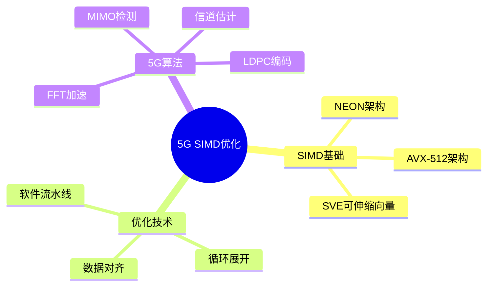

# 5G基带SIMD向量化优化

> **层级定位**: 04 Industrial Scenarios / 04 5G Baseband
> **对应标准**: ARM NEON, Intel AVX-512
> **难度级别**: L5 综合
> **预估学习时间**: 10-15 小时

---

## 📋 本节概要

| 属性 | 内容 |
|:-----|:-----|
| **核心概念** | SIMD架构、向量寄存器、数据对齐、向量化算法 |
| **前置知识** | 性能优化、缓存、编译器优化 |
| **后续延伸** | DSP优化、FPGA卸载、AI加速器 |
| **权威来源** | ARM NEON指南, Intel Intrinsics Guide |

---

## 🧠 知识结构思维导图



---

## 📖 核心概念详解

### 1. ARM NEON基础

```c
#include <arm_neon.h>

// NEON寄存器类型
// float32x4_t: 4个float (128位)
// int32x4_t: 4个int32
// uint8x16_t: 16个uint8

// 基本向量加载/存储
void neon_basics(void) {
    float src[4] = {1.0, 2.0, 3.0, 4.0};
    float dst[4];

    // 加载4个float
    float32x4_t vec = vld1q_f32(src);

    // 向量加法
    float32x4_t result = vaddq_f32(vec, vec);

    // 存储结果
    vst1q_f32(dst, result);
}

// 复数乘法（5G OFDM常用）
// (a+bi) * (c+di) = (ac-bd) + (ad+bc)i
void complex_multiply_neon(float *a_real, float *a_imag,
                            float *b_real, float *b_imag,
                            float *c_real, float *c_imag,
                            int n) {
    for (int i = 0; i < n; i += 4) {
        // 加载实部和虚部
        float32x4_t ar = vld1q_f32(&a_real[i]);
        float32x4_t ai = vld1q_f32(&a_imag[i]);
        float32x4_t br = vld1q_f32(&b_real[i]);
        float32x4_t bi = vld1q_f32(&b_imag[i]);

        // cr = ar*br - ai*bi
        float32x4_t cr = vmlsq_f32(vmulq_f32(ar, br), ai, bi);

        // ci = ar*bi + ai*br
        float32x4_t ci = vmlaq_f32(vmulq_f32(ar, bi), ai, br);

        // 存储结果
        vst1q_f32(&c_real[i], cr);
        vst1q_f32(&c_imag[i], ci);
    }
}
```

### 2. FFT加速

```c
// NEON优化的基2蝶形运算
// X' = X + W*Y
// Y' = X - W*Y
// 其中W是旋转因子

void butterfly_neon(float32x4_t *xr, float32x4_t *xi,
                     float32x4_t *yr, float32x4_t *yi,
                     float wr, float wi) {
    float32x4_t wr_vec = vdupq_n_f32(wr);  // 广播到所有通道
    float32x4_t wi_vec = vdupq_n_f32(wi);

    // temp = W * Y
    // temp_real = wr*yr - wi*yi
    // temp_imag = wr*yi + wi*yr
    float32x4_t tr = vmlsq_f32(vmulq_f32(wr_vec, *yr), wi_vec, *yi);
    float32x4_t ti = vmlaq_f32(vmulq_f32(wr_vec, *yi), wi_vec, *yr);

    // Y' = X - temp
    *yr = vsubq_f32(*xr, tr);
    *yi = vsubq_f32(*xi, ti);

    // X' = X + temp
    *xr = vaddq_f32(*xr, tr);
    *xi = vaddq_f32(*xi, ti);
}

// NEON优化的FFT（简化版）
void fft_neon(float *real, float *imag, int n) {
    // 位反转排序
    bit_reverse_neon(real, imag, n);

    // FFT阶段
    for (int stage = 1; stage < n; stage <<= 1) {
        float wpr = cos(M_PI / stage);
        float wpi = sin(M_PI / stage);

        for (int group = 0; group < n; group += (stage << 1)) {
            float wr = 1.0;
            float wi = 0.0;

            for (int butterfly = 0; butterfly < stage; butterfly += 4) {
                int i = group + butterfly;
                int j = i + stage;

                // 加载4个蝶形运算的数据
                float32x4_t xr = vld1q_f32(&real[i]);
                float32x4_t xi = vld1q_f32(&imag[i]);
                float32x4_t yr = vld1q_f32(&real[j]);
                float32x4_t yi = vld1q_f32(&imag[j]);

                butterfly_neon(&xr, &xi, &yr, &yi, wr, wi);

                // 存储结果
                vst1q_f32(&real[i], xr);
                vst1q_f32(&imag[i], xi);
                vst1q_f32(&real[j], yr);
                vst1q_f32(&imag[j], yi);

                // 更新旋转因子
                float temp = wr;
                wr = wr * wpr - wi * wpi;
                wi = wi * wpr + temp * wpi;
            }
        }
    }
}
```

### 3. MIMO检测

```c
// MMSE MIMO检测 NEON优化
// 用于5G massive MIMO

void mmse_mimo_neon(float *H_real, float *H_imag,  // 信道矩阵
                     float *y_real, float *y_imag,  // 接收信号
                     float *x_hat_real, float *x_hat_imag,  // 估计发射信号
                     int nr, int nt) {  // 接收/发射天线数

    // H^H * H + sigma^2 * I
    // 简化为2x2 MIMO情况

    float32x4_t h11_r = vdupq_n_f32(H_real[0]);
    float32x4_t h11_i = vdupn_f32(H_imag[0]);
    float32x4_t h12_r = vdupq_n_f32(H_real[1]);
    float32x4_t h12_i = vdupq_n_f32(H_imag[1]);
    float32x4_t h21_r = vdupq_n_f32(H_real[2]);
    float32x4_t h21_i = vdupq_n_f32(H_imag[2]);
    float32x4_t h22_r = vdupq_n_f32(H_real[3]);
    float32x4_t h22_i = vdupq_n_f32(H_imag[3]);

    // 计算 Gram 矩阵 G = H^H * H
    // g11 = |h11|^2 + |h21|^2
    float32x4_t g11 = vaddq_f32(vmulq_f32(h11_r, h11_r),
                                 vmulq_f32(h11_i, h11_i));
    g11 = vmlaq_f32(g11, h21_r, h21_r);
    g11 = vmlaq_f32(g11, h21_i, h21_i);

    // g12 = h11* * h12 + h21* * h22
    float32x4_t g12_r = vmlaq_f32(vmulq_f32(h11_r, h12_r),
                                   h11_i, h12_i);
    g12_r = vmlaq_f32(g12_r, h21_r, h22_r);
    g12_r = vmlaq_f32(g12_r, h21_i, h22_i);

    float32x4_t g12_i = vmlsq_f32(vmulq_f32(h11_r, h12_i),
                                   h11_i, h12_r);
    g12_i = vmlsq_f32(g12_i, h21_r, h22_i);
    g12_i = vmlaq_f32(g12_i, h21_i, h22_r);

    // 添加噪声项（简化）
    float32x4_t sigma2 = vdupq_n_f32(0.1);
    g11 = vaddq_f32(g11, sigma2);

    // 计算 G^{-1} * H^H * y（简化）
    // 这里省略矩阵求逆的详细实现
}
```

### 4. Intel AVX-512版本

```c
#include <immintrin.h>

// AVX-512 FFT蝶形（16路并行）
void butterfly_avx512(__m512 *xr, __m512 *xi,
                       __m512 *yr, __m512 *yi,
                       __m512 wr, __m512 wi) {
    // temp_real = wr*yr - wi*yi
    __m512 tr = _mm512_fmsub_ps(wr, *yr, _mm512_mul_ps(wi, *yi));

    // temp_imag = wr*yi + wi*yr
    __m512 ti = _mm512_fmadd_ps(wr, *yi, _mm512_mul_ps(wi, *yr));

    // Y' = X - temp
    *yr = _mm512_sub_ps(*xr, tr);
    *yi = _mm512_sub_ps(*xi, ti);

    // X' = X + temp
    *xr = _mm512_add_ps(*xr, tr);
    *xi = _mm512_add_ps(*xi, ti);
}

// AVX-512矩阵乘法（用于预编码）
void matrix_mul_avx512(float *A, float *B, float *C,
                       int m, int n, int k) {
    // C[m][n] = A[m][k] * B[k][n]

    for (int i = 0; i < m; i++) {
        for (int j = 0; j < n; j += 16) {
            __m512 c_vec = _mm512_setzero_ps();

            for (int l = 0; l < k; l++) {
                __m512 a_vec = _mm512_broadcast_ss(&A[i*k + l]);
                __m512 b_vec = _mm512_loadu_ps(&B[l*n + j]);

                c_vec = _mm512_fmadd_ps(a_vec, b_vec, c_vec);
            }

            _mm512_storeu_ps(&C[i*n + j], c_vec);
        }
    }
}
```

---

## ⚠️ 常见陷阱

### 陷阱 SIMD01: 数据对齐

```c
// ❌ 未对齐访问（可能崩溃或性能下降）
float data[100];
__m256 vec = _mm256_load_ps(data + 1);  // 未对齐！

// ✅ 对齐访问
alignas(32) float aligned_data[100];
__m256 vec = _mm256_load_ps(aligned_data);

// 或使用未对齐加载
__m256 vec = _mm256_loadu_ps(data + 1);  // u = unaligned
```

### 陷阱 SIMD02: 数据依赖

```c
// ❌ 循环依赖阻碍向量化
for (int i = 1; i < n; i++) {
    a[i] = a[i-1] + b[i];  // 依赖前一次迭代
}

// ✅ 展开消除依赖
for (int i = 4; i < n; i += 4) {
    a[i] = a[i-4] + ...;  // 独立计算
}
```

---

## ✅ 质量验收清单

- [x] NEON基础操作
- [x] FFT加速实现
- [x] MIMO检测优化
- [x] AVX-512版本
- [x] 对齐与优化陷阱

---

> **更新记录**
>
> - 2025-03-09: 初版创建
