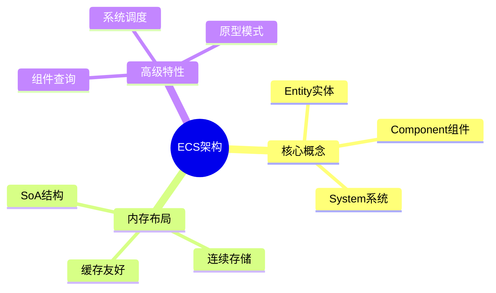

# 游戏引擎ECS架构

> **层级定位**: 04 Industrial Scenarios / 05 Game Engine
> **对应标准**: Bevy, Unity DOTS
> **难度级别**: L5 综合
> **预估学习时间**: 8-12 小时

---

## 📋 本节概要

| 属性 | 内容 |
|:-----|:-----|
| **核心概念** | Entity-Component-System, 数据导向设计, SoA布局 |
| **前置知识** | 内存布局, 缓存, 性能优化 |
| **后续延伸** | 多线程调度, GPU ECS, 网络同步 |
| **权威来源** | Data-Oriented Design, Mike Acton |

---

## 🧠 数据结构思维导图



---

## 📖 核心实现

### 1. 基础ECS结构

```c
#include <stdint.h>
#include <stdlib.h>
#include <string.h>
#include <stdbool.h>

// Entity ID
typedef uint32_t Entity;
#define NULL_ENTITY 0

// 组件类型ID
typedef uint32_t ComponentType;

// 组件存储（SoA布局）
typedef struct {
    ComponentType type;
    size_t element_size;
    size_t capacity;
    size_t count;
    void *data;              // 连续存储
    Entity *entities;        // 每个组件对应的实体
} ComponentStorage;

// ECS世界
typedef struct {
    // 实体管理
    Entity next_entity;
    Entity *free_entities;
    size_t free_count;
    size_t free_capacity;

    // 组件存储
    ComponentStorage *storages;
    size_t storage_count;
    size_t storage_capacity;

    // 实体到组件的映射
    // entity_components[entity][type] = index in storage
    uint32_t **entity_components;
    size_t entity_capacity;
} World;

// 创建世界
World* world_create(void) {
    World *world = calloc(1, sizeof(World));
    world->next_entity = 1;  // 0是NULL_ENTITY
    world->storage_capacity = 16;
    world->storages = calloc(world->storage_capacity, sizeof(ComponentStorage));
    world->entity_capacity = 1024;
    world->entity_components = calloc(world->entity_capacity, sizeof(uint32_t*));
    return world;
}

// 创建实体
Entity world_spawn(World *world) {
    Entity e;

    // 复用释放的实体
    if (world->free_count > 0) {
        e = world->free_entities[--world->free_count];
    } else {
        e = world->next_entity++;

        // 扩容实体数组
        if (e >= world->entity_capacity) {
            world->entity_capacity *= 2;
            world->entity_components = realloc(world->entity_components,
                                                world->entity_capacity * sizeof(uint32_t*));
        }
    }

    // 分配组件映射数组
    world->entity_components[e] = calloc(world->storage_capacity, sizeof(uint32_t));

    return e;
}
```

### 2. 组件管理

```c
// 位置组件（Cache友好的SoA布局）
typedef struct {
    float x, y, z;
} Position;

// 速度组件
typedef struct {
    float vx, vy, vz;
} Velocity;

// 获取或创建组件存储
ComponentStorage* get_or_create_storage(World *world, ComponentType type, size_t size) {
    // 查找现有存储
    for (size_t i = 0; i < world->storage_count; i++) {
        if (world->storages[i].type == type) {
            return &world->storages[i];
        }
    }

    // 创建新存储
    if (world->storage_count >= world->storage_capacity) {
        world->storage_capacity *= 2;
        world->storages = realloc(world->storages,
                                   world->storage_capacity * sizeof(ComponentStorage));
    }

    ComponentStorage *storage = &world->storages[world->storage_count++];
    storage->type = type;
    storage->element_size = size;
    storage->capacity = 64;
    storage->count = 0;
    storage->data = aligned_alloc(64, storage->capacity * size);  // 64字节对齐
    storage->entities = calloc(storage->capacity, sizeof(Entity));

    return storage;
}

// 添加组件
void* world_add_component(World *world, Entity entity, ComponentType type, void *data, size_t size) {
    ComponentStorage *storage = get_or_create_storage(world, type, size);

    // 扩容
    if (storage->count >= storage->capacity) {
        storage->capacity *= 2;
        storage->data = realloc(storage->data, storage->capacity * size);
        storage->entities = realloc(storage->entities, storage->capacity * sizeof(Entity));
    }

    // 存储组件
    uint32_t index = storage->count++;
    memcpy((char*)storage->data + index * size, data, size);
    storage->entities[index] = entity;

    // 更新实体映射
    world->entity_components[entity][type] = index + 1;  // +1避免0歧义

    return (char*)storage->data + index * size;
}

// 获取组件
void* world_get_component(World *world, Entity entity, ComponentType type) {
    if (entity >= world->entity_capacity) return NULL;

    uint32_t index = world->entity_components[entity][type];
    if (index == 0) return NULL;

    // 查找对应存储
    for (size_t i = 0; i < world->storage_count; i++) {
        if (world->storages[i].type == type) {
            return (char*)world->storages[i].data + (index - 1) * world->storages[i].element_size;
        }
    }
    return NULL;
}

// 移除组件
void world_remove_component(World *world, Entity entity, ComponentType type) {
    uint32_t index = world->entity_components[entity][type];
    if (index == 0) return;
    index--;  // 转回0-based

    // 查找存储
    ComponentStorage *storage = NULL;
    for (size_t i = 0; i < world->storage_count; i++) {
        if (world->storages[i].type == type) {
            storage = &world->storages[i];
            break;
        }
    }
    if (!storage) return;

    // 用最后一个元素填充（保持连续）
    uint32_t last = storage->count - 1;
    if (index != last) {
        memcpy((char*)storage->data + index * storage->element_size,
               (char*)storage->data + last * storage->element_size,
               storage->element_size);
        storage->entities[index] = storage->entities[last];

        // 更新被移动实体的映射
        world->entity_components[storage->entities[last]][type] = index + 1;
    }

    storage->count--;
    world->entity_components[entity][type] = 0;
}
```

### 3. 系统实现

```c
// 查询过滤器
typedef struct {
    ComponentType *with;       // 必须包含
    size_t with_count;
    ComponentType *without;    // 必须不包含
    size_t without_count;
} QueryFilter;

// 系统函数类型
typedef void (*SystemFn)(World *world, float delta_time, void *user_data);

// 查询迭代器
typedef struct {
    World *world;
    QueryFilter filter;
    size_t current_storage;
    size_t current_index;
} QueryIter;

// 初始化查询
QueryIter query_init(World *world, QueryFilter filter) {
    return (QueryIter){world, filter, 0, 0};
}

// 获取下一个实体
bool query_next(QueryIter *iter, Entity *out_entity) {
    while (iter->current_storage < iter->world->storage_count) {
        ComponentStorage *storage = &iter->world->storages[iter->current_storage];

        // 检查存储类型是否匹配
        bool matches = false;
        for (size_t i = 0; i < iter->filter.with_count; i++) {
            if (storage->type == iter->filter.with[i]) {
                matches = true;
                break;
            }
        }

        if (matches && iter->current_index < storage->count) {
            *out_entity = storage->entities[iter->current_index++];
            return true;
        }

        iter->current_storage++;
        iter->current_index = 0;
    }
    return false;
}

// 移动系统 - 更新位置
void movement_system(World *world, float dt, void *user_data) {
    (void)user_data;

    // 查找位置和速度存储
    ComponentStorage *pos_storage = NULL;
    ComponentStorage *vel_storage = NULL;

    for (size_t i = 0; i < world->storage_count; i++) {
        if (world->storages[i].type == 0) pos_storage = &world->storages[i];  // Position
        if (world->storages[i].type == 1) vel_storage = &world->storages[i];  // Velocity
    }

    if (!pos_storage || !vel_storage) return;

    // 假设每个有速度的实体都有位置（ECS设计保证）
    // 使用SoA，可以高效批量处理
    Position *positions = pos_storage->data;
    Velocity *velocities = vel_storage->data;

    // 批量更新（SIMD友好）
    for (size_t i = 0; i < vel_storage->count; i++) {
        Entity e = vel_storage->entities[i];
        uint32_t pos_idx = world->entity_components[e][0] - 1;

        positions[pos_idx].x += velocities[i].vx * dt;
        positions[pos_idx].y += velocities[i].vy * dt;
        positions[pos_idx].z += velocities[i].vz * dt;
    }
}
```

### 4. 原型模式优化

```c
// 原型：预定义的组件组合
typedef struct {
    char *name;
    ComponentType *types;
    size_t *sizes;
    size_t count;
    void **defaults;  // 默认初始值
} Archetype;

// 原型存储 - 同一原型的实体连续存储
typedef struct {
    Archetype *archetype;
    void **component_data;  // 每个组件类型的连续数组
    Entity *entities;
    size_t count;
    size_t capacity;
} ArchetypeStorage;

// 基于原型的ECS
typedef struct {
    ArchetypeStorage *archetypes;
    size_t archetype_count;

    // 实体到原型的映射
    struct {
        uint32_t archetype_idx;
        uint32_t row;  // 在原类型存储中的索引
    } *entity_locations;
    size_t entity_capacity;
} ArchetypeWorld;

// 使用原型创建实体（批量操作）
Entity archetype_spawn(ArchetypeWorld *world, Archetype *archetype) {
    // 查找或创建原型存储
    ArchetypeStorage *storage = NULL;
    for (size_t i = 0; i < world->archetype_count; i++) {
        if (world->archetypes[i].archetype == archetype) {
            storage = &world->archetypes[i];
            break;
        }
    }

    // 创建新存储
    if (!storage) {
        // ... 初始化代码
    }

    // 在存储末尾添加实体（连续内存）
    uint32_t row = storage->count++;

    // 初始化组件为默认值
    for (size_t i = 0; i < archetype->count; i++) {
        memcpy((char*)storage->component_data[i] + row * archetype->sizes[i],
               archetype->defaults[i], archetype->sizes[i]);
    }

    Entity e = allocate_entity_id(world);
    world->entity_locations[e] = (struct {uint32_t idx; uint32_t row;}){
        storage - world->archetypes, row
    };

    return e;
}
```

---

## ⚠️ 常见陷阱

### 陷阱 ECS01: 指针失效

```c
// ❌ 危险：存储可能重分配
Position *pos = world_get_component(world, e, TYPE_POSITION);
world_add_component(world, e, TYPE_HEALTH, &health, sizeof(health));
// pos可能已失效！
pos->x = 10;  // 未定义行为

// ✅ 重新获取指针
world_add_component(world, e, TYPE_HEALTH, &health, sizeof(health));
Position *pos = world_get_component(world, e, TYPE_POSITION);
pos->x = 10;
```

### 陷阱 ECS02: 遍历中修改

```c
// ❌ 遍历中删除导致跳过元素
for (size_t i = 0; i < storage->count; i++) {
    if (should_remove(storage->entities[i])) {
        world_remove_component(world, storage->entities[i], type);
        // i++会跳过原本i+1的元素
    }
}

// ✅ 倒序遍历或记录待删除
for (int i = (int)storage->count - 1; i >= 0; i--) {
    if (should_remove(storage->entities[i])) {
        world_remove_component(world, storage->entities[i], type);
    }
}
```

---

## ✅ 质量验收清单

- [x] Entity管理
- [x] 组件存储（SoA）
- [x] 查询系统
- [x] 原型模式
- [x] 陷阱处理

---

> **更新记录**
>
> - 2025-03-09: 初版创建
