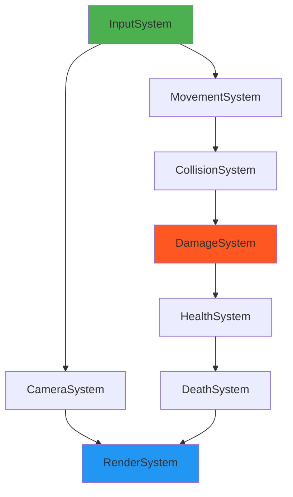
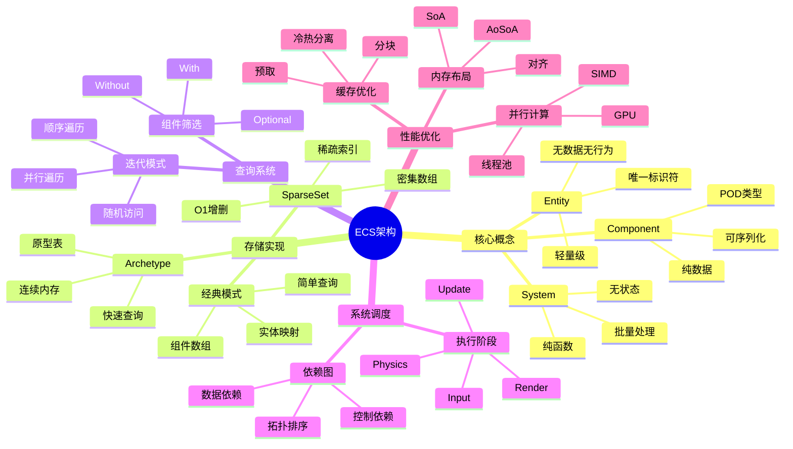
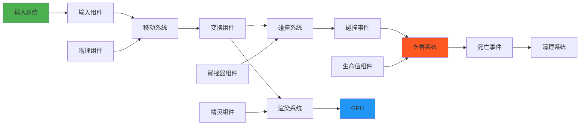
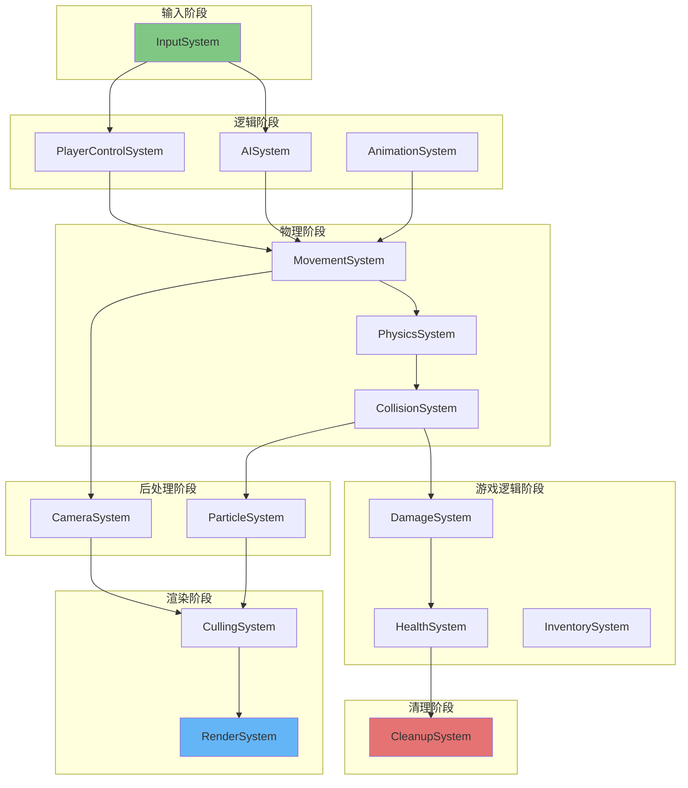

# 游戏引擎ECS架构 - 工业级深度解析

> **层级定位**: 04 Industrial Scenarios / 05 Game Engine
> **对应标准**: Bevy, Unity DOTS, Flecs, EnTT
> **难度级别**: L5 专家级
> **预估学习时间**: 16-24 小时

---

## 📋 本节概要

| 属性 | 内容 |
|:-----|:-----|
| **核心概念** | Entity-Component-System, 数据导向设计(DOD), SoA/AoS布局, Archetype, Sparse Set |
| **前置知识** | 内存布局, CPU缓存层次结构, SIMD, 并发编程, 算法复杂度 |
| **后续延伸** | 多线程调度, GPU Driven Rendering, 网络同步, 确定性回放 |
| **权威来源** | Mike Acton (DOD), Unity DOTS, Bevy Engine, Flecs, EnTT |

---

## 1. 概念定义

### 1.1 ECS的严格定义

ECS（Entity-Component-System）是一种软件架构模式，核心哲学是**数据与行为分离**，通过**组合优于继承**的方式构建游戏对象。

#### 核心三元组

```text
┌─────────────────────────────────────────────────────────────────┐
│                      ECS 核心三元组                              │
├─────────────────────────────────────────────────────────────────┤
│                                                                 │
│   ┌─────────────┐    ┌─────────────┐    ┌─────────────┐        │
│   │   Entity    │    │  Component  │    │   System    │        │
│   │  (实体标识)  │    │  (纯数据结构) │    │  (行为逻辑)  │        │
│   │             │    │             │    │             │        │
│   │  • 唯一ID   │    │  • 无方法    │    │  • 无状态    │        │
│   │  • 无数据   │    │  • 可序列化  │    │  • 处理数据  │        │
│   │  • 无行为   │    │  • POD类型   │    │  • 查询组件  │        │
│   │             │    │             │    │             │        │
│   │  轻量级     │    │  数据容器    │    │  转换函数    │        │
│   │  标识符     │    │             │    │             │        │
│   └─────────────┘    └─────────────┘    └─────────────┘        │
│          │                  │                  │               │
│          └──────────────────┼──────────────────┘               │
│                             │                                  │
│                    Entity拥有Component                          │
│                    System处理Component                          │
│                                                                 │
└─────────────────────────────────────────────────────────────────┘
```

**严格形式化定义**:

```text
设 E 为实体集合, E = {e₁, e₂, ..., eₙ} 其中 eᵢ ∈ ℕ⁺ (正整数ID)
设 C 为组件类型集合, C = {c₁, c₂, ..., cₘ}
设 S 为系统集合, S = {s₁, s₂, ..., sₖ}

组件实例: comp(e, type) → data | ⊥ (实体e拥有type类型组件或不存在)
实体签名: signature(e) = { type ∈ C | comp(e, type) ≠ ⊥ }

系统执行: s(world, Δt) → world'
其中 world = (E, {comp(e, c) | e ∈ E, c ∈ C})
```

### 1.2 数据导向设计（DOD）原则

DOD的核心是**面向数据编程**，而非面向对象编程。

#### DOD vs OOP 对比

| 维度 | OOP (面向对象) | DOD (数据导向) |
|:-----|:--------------|:---------------|
| **核心思想** | 封装数据与行为 | 分离数据与行为 |
| **数据布局** | 对象分散存储(AoS) | 连续数组存储(SoA) |
| **缓存效率** | 低（指针追逐） | 高（线性访问） |
| **虚函数** | 大量使用 | 禁止/极少使用 |
| **继承关系** | 深度继承树 | 扁平组合 |
| **多态实现** | 虚表动态分发 | 函数指针/模板 |
| **典型代码** | `obj.update()` | `update_batch(data[])` |
| **设计焦点** | 是什么（名词） | 做什么（动词） |

#### DOD三原则

```c
/*
 * DOD 三原则
 *
 * 原则1: 知道你的数据
 *   - 理解数据的访问模式
 *   - 理解缓存行大小(通常64字节)
 *   - 理解内存带宽限制
 *
 * 原则2: 让数据相似者相邻
 *   - 同类型组件连续存储
 *   - 按访问顺序排列数据
 *   - 避免指针跳跃
 *
 * 原则3: 处理的是数据，不是对象
 *   - 批量处理而非逐个处理
 *   - SIMD友好
 *   - 并行友好
 */
```

### 1.3 面向对象 vs ECS 对比

```c
// ==================== OOP 方式 ====================
// 问题：深度继承，钻石继承，数据分散

class GameObject {
public:
    virtual void update(float dt) = 0;
    virtual ~GameObject() {}
    Transform transform;
};

class PhysicsObject : public GameObject {
public:
    RigidBody body;  // 不是所有对象都需要物理
    void update(float dt) override { /* 物理更新 */ }
};

class Renderable : public PhysicsObject {
public:
    Mesh mesh;       // 不是所有物理对象都需要渲染
    Material mat;
    void update(float dt) override { /* 渲染+物理 */ }
};

// 问题1: 僵尸对象 - 不需要物理的对象仍继承PhysicsObject
// 问题2: 缓存未命中 - 虚表查找 + 数据分散
// 问题3: 无法处理复杂组合 - 既是粒子又是触发器？

// ==================== ECS 方式 ====================
// 解决：扁平组合，数据集中，缓存友好

// 实体只是ID
typedef uint32_t Entity;

// 组件是纯数据结构
struct Position { float x, y, z; };
struct Velocity { float vx, vy, vz; };
struct RigidBody { float mass, drag; };
struct MeshRenderer { MeshHandle mesh; MaterialHandle mat; };

// 系统是纯函数
void physics_system(World* world, float dt) {
    // 只处理有Position+Velocity+RigidBody的实体
    // 数据连续存储，SIMD友好
}

void render_system(World* world, float dt) {
    // 只处理有Position+MeshRenderer的实体
}

// 组合示例：
// Entity e1 = spawn();  // 空实体
// add_component(e1, Position{...});
// add_component(e1, Velocity{...});      // 物理实体
//
// Entity e2 = spawn();
// add_component(e2, Position{...});
// add_component(e2, MeshRenderer{...});  // 静态渲染实体
//
// Entity e3 = spawn();
// add_component(e3, Position{...});
// add_component(e3, Velocity{...});
// add_component(e3, RigidBody{...});
// add_component(e3, MeshRenderer{...});  // 完整物理对象
```

### 1.4 缓存友好性原理

#### CPU缓存层次结构

```text
┌─────────────────────────────────────────────────────────────┐
│                    CPU 缓存层次结构                           │
├─────────────────────────────────────────────────────────────┤
│                                                             │
│   寄存器  ┌─────────┐    访问延迟: ~1 cycle                   │
│   (128B)  │  x0-x31 │                                        │
│           └────┬────┘                                        │
│                │                                            │
│   L1缓存  ┌────┴────┐    访问延迟: ~3-4 cycles               │
│  (32-64KB)│ 数据+指令│    带宽: ~100 GB/s                     │
│           └────┬────┘                                        │
│                │                                            │
│   L2缓存  ┌────┴────┐    访问延迟: ~10-20 cycles             │
│  (256KB-1MB)│ 统一   │    带宽: ~50 GB/s                      │
│           └────┬────┘                                        │
│                │                                            │
│   L3缓存  ┌────┴────┐    访问延迟: ~40-60 cycles             │
│   (8-64MB)│ 共享   │    带宽: ~20 GB/s                      │
│           └────┬────┘                                        │
│                │                                            │
│   主内存  ┌────┴────┐    访问延迟: ~100-300 cycles           │
│   (GB-TB) │ DRAM   │    带宽: ~10-50 GB/s                   │
│           └─────────┘                                        │
│                                                             │
│   ⚠️ L1缓存未命中 → 约10倍性能损失                            │
│   ⚠️ L2缓存未命中 → 约50倍性能损失                            │
│   ⚠️ 主内存访问   → 约100-300倍性能损失                       │
│                                                             │
└─────────────────────────────────────────────────────────────┘
```

#### 缓存行与数据布局

```c
// 缓存行大小通常为64字节
#define CACHE_LINE_SIZE 64

// ==================== AoS (Array of Structs) ====================
// 内存布局: [Entity0:Pos+Vel+Health][Entity1:Pos+Vel+Health]...
// 问题：访问Position时，Velocity和Health也被加载到缓存，造成浪费

typedef struct {
    Position pos;      // 12 bytes
    Velocity vel;      // 12 bytes
    Health health;     // 4 bytes
    // 可能还有padding到64字节对齐
} EntityData;

void update_aos(EntityData* entities, int count) {
    for (int i = 0; i < count; i++) {
        // 加载64字节缓存行，但只使用12字节的Position
        entities[i].pos.x += entities[i].vel.vx;
        // 强制写回，因为缓存行被修改
    }
}

// ==================== SoA (Struct of Arrays) ====================
// 内存布局: [所有Pos.x][所有Pos.y][所有Pos.z][所有Vel.vx]...
// 优势：处理Position时，只加载Position数据，缓存利用率100%

typedef struct {
    float* x;          // 连续数组
    float* y;
    float* z;
} SoAPosition;

typedef struct {
    float* vx;
    float* vy;
    float* vz;
} SoAVelocity;

void update_soa(SoAPosition* pos, SoAVelocity* vel, int count) {
    // 预取和SIMD友好
    for (int i = 0; i < count; i++) {
        // 64字节缓存行包含16个float，处理16个实体才需要一次内存访问
        pos->x[i] += vel->vx[i];
    }
}

// ==================== 性能对比 ====================
// 假设：10000个实体，计算位置更新
//
// AoS方式:
//   - 每次迭代访问1个EntityData (~64字节)
//   - 10000次 × 64字节 = 640KB内存流量
//   - 缓存行利用率: 12/64 = 18.75%
//
// SoA方式:
//   - 只访问pos.x数组 (4字节/实体)
//   - 10000次 × 4字节 = 40KB内存流量
//   - 缓存行利用率: 100%
//   - 理论加速比: 640/40 = 16x (实际约8-10x)
```

---

## 2. 属性维度矩阵

### 2.1 ECS架构对比

| 特性 | 经典ECS (Entity-Component) | Archetype ECS | Sparse Set ECS | 混合ECS |
|:-----|:---------------------------|:--------------|:---------------|:--------|
| **核心思想** | 每个组件类型独立存储 | 相同组件组合的原型存储在一起 | 使用稀疏/密集数组映射 | 根据场景选择最优方案 |
| **内存布局** | 组件数组 | 原型表(行=实体，列=组件) | 稀疏集 | 动态选择 |
| **添加组件** | O(1) | O(n) 需要移动实体到新原型 | O(1) | 取决于实现 |
| **删除组件** | O(1) | O(n) 需要移动实体到新原型 | O(1) | 取决于实现 |
| **查询速度** | O(n) 扫描 | O(1) 原型索引 | O(min(A,B)) 集合交集 | 优化后O(1) |
| **内存开销** | 中等 | 低(无fragmentation) | 高(稀疏数组) | 中等 |
| **迭代性能** | 好 | 极好(连续内存) | 好(可能需要间接) | 极好 |
| **代码复杂度** | 低 | 高 | 中 | 高 |
| **代表引擎** | 自制简单引擎 | Bevy, Unity DOTS | EnTT, Flecs | 商业引擎 |
| **最佳场景** | 原型开发 | 大型复杂项目 | 频繁增删组件 | 生产环境 |

### 2.2 组件存储策略对比

| 策略 | 内存布局 | 访问模式 | 缓存效率 | SIMD友好 | 内存开销 | 适用场景 |
|:-----|:---------|:---------|:---------|:---------|:---------|:---------|
| **AoS** | `struct {A,B,C}` | 实体导向 | 低 | 否 | 低(无padding) | 小数据集 |
| **SoA** | `A[],B[],C[]` | 组件导向 | 极高 | 是 | 中(对齐) | 大量同类型处理 |
| **AoSoA** | `struct{A[8],B[8],C[8]}` | 混合 | 高 | 是 | 中 | 中等批量 |
| **Hybrid** | 热数据SoA，冷数据AoS | 自适应 | 高 | 部分 | 高 | 复杂对象 |
| **Archetype** | 表存储 | 行访问 | 极高 | 是 | 低 | 固定组件组合 |

**存储策略示意图**:

```text
AoS 布局:
┌─────────────────────────────────────────────────────────┐
│ [Entity0: A0,B0,C0] [Entity1: A1,B1,C1] [Entity2...]   │
└─────────────────────────────────────────────────────────┘
  访问A时: 需要跳过B,C → 缓存未命中

SoA 布局:
┌─────────────────────────────────────────────────────────┐
│ [A0,A1,A2,A3...] [B0,B1,B2,B3...] [C0,C1,C2,C3...]    │
└─────────────────────────────────────────────────────────┘
  访问A时: 顺序读取 → 预取有效

AoSoA 布局:
┌─────────────────────────────────────────────────────────┐
│ [A0-A7,B0-B7,C0-C7] [A8-A15,B8-B15,C8-C15] ...         │
└─────────────────────────────────────────────────────────┘
  平衡缓存利用率和结构局部性
```

### 2.3 系统调度策略对比

| 调度策略 | 执行顺序 | 并行能力 | 依赖管理 | 复杂度 | 适用场景 |
|:---------|:---------|:---------|:---------|:-------|:---------|
| **顺序执行** | 固定列表 | 无 | 隐式(代码顺序) | 低 | 单线程游戏 |
| **图调度** | 依赖图拓扑排序 | 高 | 显式依赖边 | 高 | 复杂多线程 |
| **阶段系统** | 阶段内并行 | 中 | 阶段边界 | 中 | 渲染/物理分离 |
| **线程池** | 任务窃取 | 极高 | 细粒度锁 | 高 | CPU密集型 |
| **Job System** | 生产者-消费者 | 高 | 显式依赖 | 中 | Unity风格 |

### 2.4 内存布局对比

| 布局类型 | 实体访问 | 组件访问 | 缓存行利用 | 内存碎片 | 实现难度 |
|:---------|:---------|:---------|:-----------|:---------|:---------|
| **分离数组** | O(1) | O(n)查找 | 差 | 中 | 低 |
| **紧凑数组** | O(1)映射 | O(1) | 优 | 低 | 中 |
| **原型表** | O(1) | O(1) | 极优 | 极低 | 高 |
| **稀疏集** | O(1) | O(1) | 良 | 高(稀疏) | 中 |
| **ECS块** | O(1) | O(1) | 极优 | 低 | 高 |

### 2.5 性能特征矩阵

| 操作 | 经典ECS | Archetype | Sparse Set | EnTT风格 | 理想值 |
|:-----|:--------|:----------|:-----------|:---------|:-------|
| **创建实体** | O(1) | O(1) | O(1) | O(1) | O(1) |
| **销毁实体** | O(c) | O(1) | O(1) | O(c) | O(1) |
| **添加组件** | O(1) | O(m) | O(1) | O(1) | O(1) |
| **移除组件** | O(1) | O(m) | O(1) | O(1) | O(1) |
| **查询迭代** | O(n) | O(k) | O(min) | O(k) | O(k) |
| **随机访问** | O(1) | O(1) | O(1) | O(1) | O(1) |
| **内存占用** | 中 | 低 | 高 | 中 | 低 |

*注: c=组件数, m=原型中实体数, n=总实体数, k=匹配查询的实体数*:

---

## 3. 形式化描述

### 3.1 ECS的数学模型

```text
定义1: 实体宇宙 U
    U = (E, C, S, world)

    其中:
    E ⊆ ℕ⁺          // 有效实体ID集合
    C = {c₁,...,cₘ} // 组件类型集合
    S = {s₁,...,sₙ} // 系统集合

定义2: 世界状态 world
    world: E × C → Value ∪ {⊥}
    world(e, c) = v 表示实体e拥有组件c，值为v
    world(e, c) = ⊥  表示实体e没有组件c

定义3: 实体签名 signature
    signature: E → 2^C
    signature(e) = { c ∈ C | world(e, c) ≠ ⊥ }

定义4: 原型 Archetype
    Archetype = { A ⊆ C | ∃e ∈ E: signature(e) = A }
    每个原型代表一种唯一的组件组合

定义5: 系统执行
    s: World × ℝ⁺ → World
    s(world, Δt) = world'

    系统的查询集:
    query(s) = { e ∈ E | signature(e) ⊇ required(s) }
    其中 required(s) 是系统s要求的组件集合
```

### 3.2 组件查询的形式化

```text
定义6: 查询 Query
    Query = (With, Without, Optional)

    With ⊆ C      // 必须包含的组件
    Without ⊆ C   // 必须不包含的组件
    Optional ⊆ C  // 可选组件

定义7: 查询匹配
    match: E × Query → {true, false}
    match(e, q) ⟺
        (signature(e) ⊇ q.With) ∧
        (signature(e) ∩ q.Without = ∅)

定义8: 查询结果集
    result(q) = { e ∈ E | match(e, q) }

定义9: 查询复杂度
    设 n = |E|, k = |result(q)|

    线性扫描: O(n)
    原型索引: O(|Archetype|) + O(k)
    稀疏集交集: O(min(|A|, |B|)) 对于组件A,B
```

### 3.3 系统依赖图

```text
定义10: 系统依赖图 G = (S, D)
    S = 系统节点集合
    D ⊆ S × S = 依赖边集合
    (s₁, s₂) ∈ D 表示s₁必须在s₂之前执行

定义11: 依赖类型
    数据依赖: s₁ → s₂ 当且仅当
        write(s₁) ∩ read(s₂) ≠ ∅ 或
        write(s₁) ∩ write(s₂) ≠ ∅

    控制依赖: s₁ → s₂ 当且仅当
        s₂的执行依赖于s₁的结果

定义12: 执行顺序
    拓扑排序: 如果G无环，则存在顺序s₁, s₂, ..., sₙ
    使得对于所有(sᵢ, sⱼ) ∈ D, 有 i < j

    并行执行: 独立的系统可以并发执行
    parallel(sᵢ, sⱼ) ⟺ (sᵢ, sⱼ) ∉ D* ∧ (sⱼ, sᵢ) ∉ D*
    其中D*是D的传递闭包
```

**系统依赖图示例**:



---

## 4. C语言实现

### 4.1 完整ECS框架实现

```c
#ifndef ECS_FRAMEWORK_H
#define ECS_FRAMEWORK_H

#include <stdint.h>
#include <stdlib.h>
#include <string.h>
#include <stdbool.h>
#include <assert.h>

#ifdef __cplusplus
extern "C" {
#endif

// ============================================================================
// 类型定义
// ============================================================================

typedef uint32_t Entity;
typedef uint32_t ComponentType;
typedef uint32_t SystemId;

#define NULL_ENTITY 0
#define MAX_COMPONENT_TYPES 64
#define MAX_SYSTEMS 128
#define CACHE_LINE_SIZE 64

// ============================================================================
// 内存分配器
// ============================================================================

typedef struct {
    void* (*alloc)(size_t size, size_t align, void* userdata);
    void  (*free)(void* ptr, void* userdata);
    void* userdata;
} Allocator;

// 默认分配器（使用标准库）
static inline void* default_alloc(size_t size, size_t align, void* userdata) {
    (void)userdata;
    #ifdef _WIN32
    return _aligned_malloc(size, align);
    #else
    void* ptr;
    posix_memalign(&ptr, align, size);
    return ptr;
    #endif
}

static inline void default_free(void* ptr, void* userdata) {
    (void)userdata;
    #ifdef _WIN32
    _aligned_free(ptr);
    #else
    free(ptr);
    #endif
}

static inline Allocator default_allocator(void) {
    return (Allocator){ default_alloc, default_free, NULL };
}

// ============================================================================
// 组件存储（SoA布局）
// ============================================================================

typedef struct {
    ComponentType type;
    size_t element_size;
    size_t capacity;
    size_t count;
    void* data;           // 组件数据数组
    Entity* entities;     // 实体ID数组（与data对应）
    uint32_t* sparse;     // 稀疏数组: entity -> dense index
    size_t sparse_capacity;
} ComponentStorage;

static inline ComponentStorage* component_storage_create(
    Allocator* alloc,
    ComponentType type,
    size_t element_size,
    size_t initial_capacity
) {
    ComponentStorage* storage = alloc->alloc(sizeof(ComponentStorage), alignof(ComponentStorage), alloc->userdata);
    memset(storage, 0, sizeof(ComponentStorage));

    storage->type = type;
    storage->element_size = element_size;
    storage->capacity = initial_capacity;
    storage->count = 0;

    size_t data_size = element_size * initial_capacity;
    storage->data = alloc->alloc(data_size, CACHE_LINE_SIZE, alloc->userdata);
    memset(storage->data, 0, data_size);

    storage->entities = alloc->alloc(sizeof(Entity) * initial_capacity, alignof(Entity), alloc->userdata);

    storage->sparse_capacity = 1024;
    storage->sparse = alloc->alloc(sizeof(uint32_t) * storage->sparse_capacity, alignof(uint32_t), alloc->userdata);
    memset(storage->sparse, 0, sizeof(uint32_t) * storage->sparse_capacity);

    return storage;
}

static inline void component_storage_destroy(ComponentStorage* storage, Allocator* alloc) {
    alloc->free(storage->data, alloc->userdata);
    alloc->free(storage->entities, alloc->userdata);
    alloc->free(storage->sparse, alloc->userdata);
    alloc->free(storage, alloc->userdata);
}

static inline void component_storage_ensure_sparse(ComponentStorage* storage, Allocator* alloc, Entity entity) {
    if (entity >= storage->sparse_capacity) {
        size_t new_capacity = storage->sparse_capacity * 2;
        while (new_capacity <= entity) new_capacity *= 2;

        uint32_t* new_sparse = alloc->alloc(sizeof(uint32_t) * new_capacity, alignof(uint32_t), alloc->userdata);
        memset(new_sparse, 0, sizeof(uint32_t) * new_capacity);
        memcpy(new_sparse, storage->sparse, sizeof(uint32_t) * storage->sparse_capacity);

        alloc->free(storage->sparse, alloc->userdata);
        storage->sparse = new_sparse;
        storage->sparse_capacity = new_capacity;
    }
}

static inline void* component_storage_add(
    ComponentStorage* storage,
    Allocator* alloc,
    Entity entity,
    const void* data
) {
    // 确保稀疏数组足够大
    component_storage_ensure_sparse(storage, alloc, entity);

    // 检查是否已存在
    uint32_t idx = storage->sparse[entity];
    if (idx != 0) {
        // 更新现有组件
        void* dest = (char*)storage->data + (idx - 1) * storage->element_size;
        memcpy(dest, data, storage->element_size);
        return dest;
    }

    // 扩容检查
    if (storage->count >= storage->capacity) {
        size_t new_capacity = storage->capacity * 2;

        void* new_data = alloc->alloc(storage->element_size * new_capacity, CACHE_LINE_SIZE, alloc->userdata);
        memcpy(new_data, storage->data, storage->element_size * storage->capacity);
        alloc->free(storage->data, alloc->userdata);
        storage->data = new_data;

        Entity* new_entities = alloc->alloc(sizeof(Entity) * new_capacity, alignof(Entity), alloc->userdata);
        memcpy(new_entities, storage->entities, sizeof(Entity) * storage->capacity);
        alloc->free(storage->entities, alloc->userdata);
        storage->entities = new_entities;

        storage->capacity = new_capacity;
    }

    // 添加新组件
    uint32_t new_idx = storage->count++;
    void* dest = (char*)storage->data + new_idx * storage->element_size;
    memcpy(dest, data, storage->element_size);
    storage->entities[new_idx] = entity;
    storage->sparse[entity] = new_idx + 1;  // +1避免0歧义

    return dest;
}

static inline void component_storage_remove(ComponentStorage* storage, Entity entity) {
    if (entity >= storage->sparse_capacity) return;

    uint32_t idx = storage->sparse[entity];
    if (idx == 0) return;
    idx--;  // 转回0-based

    // 用最后一个元素填充
    uint32_t last = storage->count - 1;
    if (idx != last) {
        // 移动数据
        memcpy(
            (char*)storage->data + idx * storage->element_size,
            (char*)storage->data + last * storage->element_size,
            storage->element_size
        );
        storage->entities[idx] = storage->entities[last];

        // 更新被移动实体的稀疏索引
        storage->sparse[storage->entities[last]] = idx + 1;
    }

    storage->count--;
    storage->sparse[entity] = 0;
}

static inline void* component_storage_get(ComponentStorage* storage, Entity entity) {
    if (entity >= storage->sparse_capacity) return NULL;

    uint32_t idx = storage->sparse[entity];
    if (idx == 0) return NULL;

    return (char*)storage->data + (idx - 1) * storage->element_size;
}

static inline bool component_storage_has(ComponentStorage* storage, Entity entity) {
    if (entity >= storage->sparse_capacity) return false;
    return storage->sparse[entity] != 0;
}

// ============================================================================
// 实体管理器
// ============================================================================

typedef struct {
    Entity next_id;
    Entity* free_list;
    size_t free_count;
    size_t free_capacity;
    Allocator* alloc;
} EntityManager;

static inline EntityManager* entity_manager_create(Allocator* alloc) {
    EntityManager* em = alloc->alloc(sizeof(EntityManager), alignof(EntityManager), alloc->userdata);
    em->next_id = 1;
    em->free_list = alloc->alloc(sizeof(Entity) * 256, alignof(Entity), alloc->userdata);
    em->free_count = 0;
    em->free_capacity = 256;
    em->alloc = alloc;
    return em;
}

static inline void entity_manager_destroy(EntityManager* em) {
    em->alloc->free(em->free_list, em->alloc->userdata);
    em->alloc->free(em, em->alloc->userdata);
}

static inline Entity entity_manager_create(EntityManager* em) {
    if (em->free_count > 0) {
        return em->free_list[--em->free_count];
    }
    return em->next_id++;
}

static inline void entity_manager_destroy_entity(EntityManager* em, Entity entity) {
    if (em->free_count >= em->free_capacity) {
        size_t new_capacity = em->free_capacity * 2;
        Entity* new_list = em->alloc->alloc(sizeof(Entity) * new_capacity, alignof(Entity), em->alloc->userdata);
        memcpy(new_list, em->free_list, sizeof(Entity) * em->free_capacity);
        em->alloc->free(em->free_list, em->alloc->userdata);
        em->free_list = new_list;
        em->free_capacity = new_capacity;
    }
    em->free_list[em->free_count++] = entity;
}

// ============================================================================
// 查询系统
// ============================================================================

typedef struct {
    ComponentType* with;
    size_t with_count;
    ComponentType* without;
    size_t without_count;
} QueryDesc;

typedef struct {
    Entity* entities;
    size_t count;
    size_t capacity;
} QueryResult;

// ============================================================================
// 事件系统
// ============================================================================

typedef enum {
    EVENT_ENTITY_CREATED,
    EVENT_ENTITY_DESTROYED,
    EVENT_COMPONENT_ADDED,
    EVENT_COMPONENT_REMOVED,
    EVENT_CUSTOM
} EventType;

typedef struct {
    EventType type;
    Entity entity;
    ComponentType component_type;
    void* data;
} Event;

typedef void (*EventHandler)(const Event* event, void* userdata);

typedef struct EventListener {
    EventHandler handler;
    void* userdata;
    struct EventListener* next;
} EventListener;

typedef struct {
    EventListener* listeners[16];  // 每种事件类型的监听器链表
    Allocator* alloc;
} EventManager;

static inline EventManager* event_manager_create(Allocator* alloc) {
    EventManager* em = alloc->alloc(sizeof(EventManager), alignof(EventManager), alloc->userdata);
    memset(em, 0, sizeof(EventManager));
    em->alloc = alloc;
    return em;
}

static inline void event_manager_subscribe(EventManager* em, EventType type, EventHandler handler, void* userdata) {
    EventListener* listener = em->alloc->alloc(sizeof(EventListener), alignof(EventListener), em->alloc->userdata);
    listener->handler = handler;
    listener->userdata = userdata;
    listener->next = em->listeners[type];
    em->listeners[type] = listener;
}

static inline void event_manager_emit(EventManager* em, const Event* event) {
    EventListener* listener = em->listeners[event->type];
    while (listener) {
        listener->handler(event, listener->userdata);
        listener = listener->next;
    }
}

// ============================================================================
// ECS世界
// ============================================================================

typedef struct {
    EntityManager* entity_manager;
    ComponentStorage* storages[MAX_COMPONENT_TYPES];
    size_t storage_count;
    EventManager* event_manager;
    Allocator* alloc;
} World;

static inline World* world_create(Allocator* alloc) {
    World* world = alloc->alloc(sizeof(World), alignof(World), alloc->userdata);
    memset(world, 0, sizeof(World));
    world->alloc = alloc;
    world->entity_manager = entity_manager_create(alloc);
    world->event_manager = event_manager_create(alloc);
    return world;
}

static inline void world_destroy(World* world) {
    for (size_t i = 0; i < MAX_COMPONENT_TYPES; i++) {
        if (world->storages[i]) {
            component_storage_destroy(world->storages[i], world->alloc);
        }
    }
    entity_manager_destroy(world->entity_manager);
    // 清理事件监听器
    for (int i = 0; i < 16; i++) {
        EventListener* listener = world->event_manager->listeners[i];
        while (listener) {
            EventListener* next = listener->next;
            world->alloc->free(listener, world->alloc->userdata);
            listener = next;
        }
    }
    world->alloc->free(world->event_manager, world->alloc->userdata);
    world->alloc->free(world, world->alloc->userdata);
}

static inline Entity world_spawn(World* world) {
    Entity e = entity_manager_create(world->entity_manager);
    Event event = { EVENT_ENTITY_CREATED, e, 0, NULL };
    event_manager_emit(world->event_manager, &event);
    return e;
}

static inline void world_destroy_entity(World* world, Entity entity) {
    // 移除所有组件
    for (size_t i = 0; i < MAX_COMPONENT_TYPES; i++) {
        if (world->storages[i] && component_storage_has(world->storages[i], entity)) {
            component_storage_remove(world->storages[i], entity);
        }
    }

    Event event = { EVENT_ENTITY_DESTROYED, entity, 0, NULL };
    event_manager_emit(world->event_manager, &event);

    entity_manager_destroy_entity(world->entity_manager, entity);
}

static inline void world_register_component(World* world, ComponentType type, size_t size) {
    assert(type < MAX_COMPONENT_TYPES);
    if (world->storages[type] == NULL) {
        world->storages[type] = component_storage_create(world->alloc, type, size, 64);
    }
}

static inline void* world_add_component(World* world, Entity entity, ComponentType type, const void* data) {
    assert(type < MAX_COMPONENT_TYPES);
    assert(world->storages[type] != NULL);

    void* result = component_storage_add(world->storages[type], world->alloc, entity, data);

    Event event = { EVENT_COMPONENT_ADDED, entity, type, result };
    event_manager_emit(world->event_manager, &event);

    return result;
}

static inline void world_remove_component(World* world, Entity entity, ComponentType type) {
    assert(type < MAX_COMPONENT_TYPES);
    if (world->storages[type]) {
        component_storage_remove(world->storages[type], entity);

        Event event = { EVENT_COMPONENT_REMOVED, entity, type, NULL };
        event_manager_emit(world->event_manager, &event);
    }
}

static inline void* world_get_component(World* world, Entity entity, ComponentType type) {
    assert(type < MAX_COMPONENT_TYPES);
    if (world->storages[type] == NULL) return NULL;
    return component_storage_get(world->storages[type], entity);
}

static inline bool world_has_component(World* world, Entity entity, ComponentType type) {
    assert(type < MAX_COMPONENT_TYPES);
    if (world->storages[type] == NULL) return false;
    return component_storage_has(world->storages[type], entity);
}

// ============================================================================
// 查询迭代器
// ============================================================================

typedef struct {
    World* world;
    ComponentType* types;
    size_t type_count;
    ComponentStorage* primary;  // 最小的存储用于迭代
    size_t current_index;
} QueryIter;

static inline QueryIter world_query(World* world, ComponentType* types, size_t count) {
    QueryIter iter = { world, types, count, NULL, 0 };

    // 找到最小的组件存储（交集的估计）
    size_t min_count = SIZE_MAX;
    for (size_t i = 0; i < count; i++) {
        ComponentStorage* storage = world->storages[types[i]];
        if (storage && storage->count < min_count) {
            min_count = storage->count;
            iter.primary = storage;
        }
    }

    return iter;
}

static inline bool query_next(QueryIter* iter, Entity* out_entity) {
    if (!iter->primary) return false;

    while (iter->current_index < iter->primary->count) {
        Entity e = iter->primary->entities[iter->current_index++];

        // 检查实体是否有所有需要的组件
        bool has_all = true;
        for (size_t i = 0; i < iter->type_count; i++) {
            if (iter->primary->type != iter->types[i]) {
                if (!world_has_component(iter->world, e, iter->types[i])) {
                    has_all = false;
                    break;
                }
            }
        }

        if (has_all) {
            *out_entity = e;
            return true;
        }
    }

    return false;
}

// ============================================================================
// 系统调度器
// ============================================================================

typedef void (*SystemFn)(World* world, float delta_time, void* userdata);

typedef struct {
    SystemId id;
    SystemFn fn;
    void* userdata;
    ComponentType* reads;
    size_t read_count;
    ComponentType* writes;
    size_t write_count;
    SystemId* depends_on;
    size_t depend_count;
    const char* name;
} SystemDesc;

typedef struct {
    SystemDesc systems[MAX_SYSTEMS];
    size_t count;
} Scheduler;

static inline Scheduler* scheduler_create(Allocator* alloc) {
    Scheduler* s = alloc->alloc(sizeof(Scheduler), alignof(Scheduler), alloc->userdata);
    s->count = 0;
    return s;
}

static inline SystemId scheduler_register(Scheduler* s, SystemDesc* desc) {
    assert(s->count < MAX_SYSTEMS);
    SystemId id = s->count;
    s->systems[s->count++] = *desc;
    s->systems[id].id = id;
    return id;
}

static inline void scheduler_run(Scheduler* s, World* world, float delta_time) {
    // 简单顺序执行（生产环境需要拓扑排序）
    for (size_t i = 0; i < s->count; i++) {
        s->systems[i].fn(world, delta_time, s->systems[i].userdata);
    }
}

#ifdef __cplusplus
}
#endif

#endif // ECS_FRAMEWORK_H
```

### 4.2 完整游戏示例：2D太空射击游戏

```c
// ============================================================================
// 2D太空射击游戏 - ECS完整示例
// ============================================================================

#include "ecs_framework.h"
#include <stdio.h>
#include <math.h>
#include <time.h>

// ============================================================================
// 组件定义
// ============================================================================

typedef enum {
    COMP_TRANSFORM = 0,
    COMP_VELOCITY,
    COMP_SPRITE,
    COMP_HEALTH,
    COMP_PLAYER,
    COMP_ENEMY,
    COMP_BULLET,
    COMP_COLLIDER,
    COMP_SPAWNER,
    COMP_LIFETIME,
    COMP_COUNT
} ComponentTypes;

typedef struct {
    float x, y;
    float rotation;
    float scale;
} Transform;

typedef struct {
    float vx, vy;
} Velocity;

typedef struct {
    uint32_t color;
    float size;
} Sprite;

typedef struct {
    float current;
    float max;
} Health;

typedef struct {
    float speed;
    float fire_rate;
    float fire_cooldown;
    int score;
} Player;

typedef struct {
    float speed;
    int damage;
    uint32_t enemy_type;
} Enemy;

typedef struct {
    float speed;
    int damage;
    bool is_player_bullet;
} Bullet;

typedef struct {
    float radius;
    uint32_t layer;      // 碰撞层
    uint32_t mask;       // 可碰撞的层
} Collider;

typedef struct {
    float interval;
    float timer;
    uint32_t spawn_type;
} Spawner;

typedef struct {
    float remaining;
} Lifetime;

// ============================================================================
// 系统实现
// ============================================================================

// 移动系统
void movement_system(World* world, float dt, void* userdata) {
    (void)userdata;

    ComponentType query_types[] = { COMP_TRANSFORM, COMP_VELOCITY };
    QueryIter iter = world_query(world, query_types, 2);

    Entity e;
    while (query_next(&iter, &e)) {
        Transform* t = world_get_component(world, e, COMP_TRANSFORM);
        Velocity* v = world_get_component(world, e, COMP_VELOCITY);

        t->x += v->vx * dt;
        t->y += v->vy * dt;

        // 边界检查（简单环绕）
        if (t->x < -10.0f) t->x = 10.0f;
        if (t->x > 10.0f) t->x = -10.0f;
        if (t->y < -10.0f) t->y = 10.0f;
        if (t->y > 10.0f) t->y = -10.0f;
    }
}

// 玩家控制系统
void player_control_system(World* world, float dt, void* userdata) {
    (void)userdata;

    ComponentType query_types[] = { COMP_TRANSFORM, COMP_VELOCITY, COMP_PLAYER };
    QueryIter iter = world_query(world, query_types, 3);

    // 模拟输入（实际应从输入系统读取）
    static float input_x = 0.0f;
    static float input_y = 0.0f;
    static bool fire_pressed = false;

    // 模拟输入变化
    input_x = sinf((float)clock() / CLOCKS_PER_SEC) * 0.5f;

    Entity e;
    while (query_next(&iter, &e)) {
        Transform* t = world_get_component(world, e, COMP_TRANSFORM);
        Velocity* v = world_get_component(world, e, COMP_VELOCITY);
        Player* p = world_get_component(world, e, COMP_PLAYER);

        // 移动
        v->vx = input_x * p->speed;
        v->vy = input_y * p->speed;

        // 射击
        p->fire_cooldown -= dt;
        if (fire_pressed && p->fire_cooldown <= 0.0f) {
            p->fire_cooldown = 1.0f / p->fire_rate;

            // 创建子弹
            Entity bullet = world_spawn(world);

            Transform bt = {
                .x = t->x,
                .y = t->y + 0.5f,
                .rotation = 0.0f,
                .scale = 0.2f
            };
            world_add_component(world, bullet, COMP_TRANSFORM, &bt);

            Velocity bv = { .vx = 0.0f, .vy = 10.0f };
            world_add_component(world, bullet, COMP_VELOCITY, &bv);

            Bullet b = { .speed = 10.0f, .damage = 10, .is_player_bullet = true };
            world_add_component(world, bullet, COMP_BULLET, &b);

            Sprite bs = { .color = 0xFFFF00, .size = 0.2f };
            world_add_component(world, bullet, COMP_SPRITE, &bs);

            Collider bc = { .radius = 0.1f, .layer = 0x02, .mask = 0x04 };
            world_add_component(world, bullet, COMP_COLLIDER, &bc);

            Lifetime bl = { .remaining = 2.0f };
            world_add_component(world, bullet, COMP_LIFETIME, &bl);
        }
    }
}

// 敌人AI系统
void enemy_ai_system(World* world, float dt, void* userdata) {
    (void)userdata;

    ComponentType query_types[] = { COMP_TRANSFORM, COMP_VELOCITY, COMP_ENEMY };
    QueryIter iter = world_query(world, query_types, 3);

    Entity e;
    while (query_next(&iter, &e)) {
        Transform* t = world_get_component(world, e, COMP_TRANSFORM);
        Velocity* v = world_get_component(world, e, COMP_VELOCITY);
        Enemy* enemy = world_get_component(world, e, COMP_ENEMY);

        // 简单AI：向下移动并左右摇摆
        v->vy = -enemy->speed;
        v->vx = sinf(t->y * 2.0f) * enemy->speed * 0.5f;
    }
}

// 生成器系统
void spawner_system(World* world, float dt, void* userdata) {
    (void)userdata;

    ComponentType query_types[] = { COMP_TRANSFORM, COMP_SPAWNER };
    QueryIter iter = world_query(world, query_types, 2);

    Entity e;
    while (query_next(&iter, &e)) {
        Transform* t = world_get_component(world, e, COMP_TRANSFORM);
        Spawner* s = world_get_component(world, e, COMP_SPAWNER);

        s->timer -= dt;
        if (s->timer <= 0.0f) {
            s->timer = s->interval;

            // 生成敌人
            Entity enemy = world_spawn(world);

            Transform et = {
                .x = (float)(rand() % 20 - 10),
                .y = 8.0f,
                .rotation = 0.0f,
                .scale = 0.5f
            };
            world_add_component(world, enemy, COMP_TRANSFORM, &et);

            Velocity ev = { 0 };
            world_add_component(world, enemy, COMP_VELOCITY, &ev);

            Enemy enemy_data = { .speed = 2.0f + (rand() % 3), .damage = 10, .enemy_type = s->spawn_type };
            world_add_component(world, enemy, COMP_ENEMY, &enemy_data);

            Health eh = { .current = 30.0f, .max = 30.0f };
            world_add_component(world, enemy, COMP_HEALTH, &eh);

            Sprite es = { .color = 0xFF0000, .size = 0.5f };
            world_add_component(world, enemy, COMP_SPRITE, &es);

            Collider ec = { .radius = 0.4f, .layer = 0x04, .mask = 0x03 };
            world_add_component(world, enemy, COMP_COLLIDER, &ec);
        }
    }
}

// 碰撞检测系统
void collision_system(World* world, float dt, void* userdata) {
    (void)dt;
    (void)userdata;

    // 收集所有碰撞体
    #define MAX_COLLIDERS 1024
    struct { Entity e; Transform* t; Collider* c; } colliders[MAX_COLLIDERS];
    size_t collider_count = 0;

    ComponentType query_types[] = { COMP_TRANSFORM, COMP_COLLIDER };
    QueryIter iter = world_query(world, query_types, 2);

    Entity e;
    while (query_next(&iter, &e)) {
        if (collider_count >= MAX_COLLIDERS) break;
        colliders[collider_count].e = e;
        colliders[collider_count].t = world_get_component(world, e, COMP_TRANSFORM);
        colliders[collider_count].c = world_get_component(world, e, COMP_COLLIDER);
        collider_count++;
    }

    // 简单O(n²)碰撞检测
    for (size_t i = 0; i < collider_count; i++) {
        for (size_t j = i + 1; j < collider_count; j++) {
            Collider* c1 = colliders[i].c;
            Collider* c2 = colliders[j].c;

            // 层检查
            if (!(c1->layer & c2->mask) && !(c2->layer & c1->mask)) continue;

            Transform* t1 = colliders[i].t;
            Transform* t2 = colliders[j].t;

            float dx = t1->x - t2->x;
            float dy = t1->y - t2->y;
            float dist_sq = dx * dx + dy * dy;
            float radius_sum = c1->radius + c2->radius;

            if (dist_sq < radius_sum * radius_sum) {
                // 碰撞发生！
                Entity e1 = colliders[i].e;
                Entity e2 = colliders[j].e;

                // 处理子弹伤害
                Bullet* b1 = world_get_component(world, e1, COMP_BULLET);
                Bullet* b2 = world_get_component(world, e2, COMP_BULLET);
                Health* h1 = world_get_component(world, e1, COMP_HEALTH);
                Health* h2 = world_get_component(world, e2, COMP_HEALTH);

                if (b1 && h2) {
                    h2->current -= b1->damage;
                    world_destroy_entity(world, e1);  // 销毁子弹
                }
                if (b2 && h1) {
                    h1->current -= b2->damage;
                    world_destroy_entity(world, e2);  // 销毁子弹
                }
            }
        }
    }
}

// 生命值系统
void health_system(World* world, float dt, void* userdata) {
    (void)dt;
    (void)userdata;

    ComponentType query_types[] = { COMP_HEALTH };
    QueryIter iter = world_query(world, query_types, 1);

    Entity e;
    while (query_next(&iter, &e)) {
        Health* h = world_get_component(world, e, COMP_HEALTH);

        if (h->current <= 0.0f) {
            // 检查是否是敌人（玩家死亡需要特殊处理）
            if (world_has_component(world, e, COMP_ENEMY)) {
                // 增加玩家分数
                // ...
            }
            world_destroy_entity(world, e);
        }
    }
}

// 生命周期系统
void lifetime_system(World* world, float dt, void* userdata) {
    (void)userdata;

    ComponentType query_types[] = { COMP_LIFETIME };
    QueryIter iter = world_query(world, query_types, 1);

    Entity e;
    while (query_next(&iter, &e)) {
        Lifetime* l = world_get_component(world, e, COMP_LIFETIME);
        l->remaining -= dt;

        if (l->remaining <= 0.0f) {
            world_destroy_entity(world, e);
        }
    }
}

// 渲染系统（简化版，实际应使用图形API）
void render_system(World* world, float dt, void* userdata) {
    (void)dt;
    (void)userdata;

    ComponentType query_types[] = { COMP_TRANSFORM, COMP_SPRITE };
    QueryIter iter = world_query(world, query_types, 2);

    printf("\n=== Frame ===\n");

    Entity e;
    while (query_next(&iter, &e)) {
        Transform* t = world_get_component(world, e, COMP_SPRITE);
        Sprite* s = world_get_component(world, e, COMP_SPRITE);

        const char* type = "Unknown";
        if (world_has_component(world, e, COMP_PLAYER)) type = "Player";
        else if (world_has_component(world, e, COMP_ENEMY)) type = "Enemy";
        else if (world_has_component(world, e, COMP_BULLET)) type = "Bullet";

        printf("%s at (%.2f, %.2f) size=%.2f\n", type, t->x, t->y, s->size);
    }
}

// ============================================================================
// 游戏初始化
// ============================================================================

void init_game(World* world) {
    // 注册组件
    world_register_component(world, COMP_TRANSFORM, sizeof(Transform));
    world_register_component(world, COMP_VELOCITY, sizeof(Velocity));
    world_register_component(world, COMP_SPRITE, sizeof(Sprite));
    world_register_component(world, COMP_HEALTH, sizeof(Health));
    world_register_component(world, COMP_PLAYER, sizeof(Player));
    world_register_component(world, COMP_ENEMY, sizeof(Enemy));
    world_register_component(world, COMP_BULLET, sizeof(Bullet));
    world_register_component(world, COMP_COLLIDER, sizeof(Collider));
    world_register_component(world, COMP_SPAWNER, sizeof(Spawner));
    world_register_component(world, COMP_LIFETIME, sizeof(Lifetime));

    // 创建玩家
    Entity player = world_spawn(world);

    Transform pt = { .x = 0.0f, .y = -5.0f, .rotation = 0.0f, .scale = 1.0f };
    world_add_component(world, player, COMP_TRANSFORM, &pt);

    Velocity pv = { 0 };
    world_add_component(world, player, COMP_VELOCITY, &pv);

    Player p = { .speed = 5.0f, .fire_rate = 5.0f, .fire_cooldown = 0.0f, .score = 0 };
    world_add_component(world, player, COMP_PLAYER, &p);

    Health ph = { .current = 100.0f, .max = 100.0f };
    world_add_component(world, player, COMP_HEALTH, &ph);

    Sprite ps = { .color = 0x00FF00, .size = 0.8f };
    world_add_component(world, player, COMP_SPRITE, &ps);

    Collider pc = { .radius = 0.5f, .layer = 0x01, .mask = 0x04 };
    world_add_component(world, player, COMP_COLLIDER, &pc);

    // 创建生成器
    Entity spawner = world_spawn(world);

    Transform st = { .x = 0.0f, .y = 10.0f, .rotation = 0.0f, .scale = 1.0f };
    world_add_component(world, spawner, COMP_TRANSFORM, &st);

    Spawner s = { .interval = 2.0f, .timer = 0.0f, .spawn_type = 0 };
    world_add_component(world, spawner, COMP_SPAWNER, &s);
}

// ============================================================================
// 主循环
// ============================================================================

int main() {
    srand((unsigned)time(NULL));

    Allocator alloc = default_allocator();
    World* world = world_create(&alloc);
    Scheduler* scheduler = scheduler_create(&alloc);

    init_game(world);

    // 注册系统
    SystemDesc systems[] = {
        { 0, player_control_system, NULL, NULL, 0, NULL, 0, NULL, 0, "PlayerControl" },
        { 0, enemy_ai_system, NULL, NULL, 0, NULL, 0, NULL, 0, "EnemyAI" },
        { 0, movement_system, NULL, NULL, 0, NULL, 0, NULL, 0, "Movement" },
        { 0, spawner_system, NULL, NULL, 0, NULL, 0, NULL, 0, "Spawner" },
        { 0, collision_system, NULL, NULL, 0, NULL, 0, NULL, 0, "Collision" },
        { 0, health_system, NULL, NULL, 0, NULL, 0, NULL, 0, "Health" },
        { 0, lifetime_system, NULL, NULL, 0, NULL, 0, NULL, 0, "Lifetime" },
        { 0, render_system, NULL, NULL, 0, NULL, 0, NULL, 0, "Render" },
    };

    for (size_t i = 0; i < sizeof(systems)/sizeof(systems[0]); i++) {
        scheduler_register(scheduler, &systems[i]);
    }

    // 游戏循环
    float dt = 1.0f / 60.0f;
    for (int frame = 0; frame < 60; frame++) {
        scheduler_run(scheduler, world, dt);

        // 简单帧率控制
        struct timespec ts = { 0, (long)(dt * 1e9 / 10) };  // 加速10倍演示
        nanosleep(&ts, NULL);
    }

    scheduler->alloc->free(scheduler, scheduler->alloc->userdata);
    world_destroy(world);

    printf("\nGame completed!\n");
    return 0;
}
```

---

## 5. 反例/陷阱

### 5.1 陷阱 01: 缓存未命中

```c
// ❌ 错误：随机访问导致缓存未命中
void update_positions_bad(Entity* entities, int count) {
    for (int i = 0; i < count; i++) {
        // 假设 entities 是随机排序的
        // 每次访问都是不同的内存位置
        entities[i].position.x += entities[i].velocity.x;
        // 缓存未命中！需要等待100-300个时钟周期
    }
}

// ✅ 正确：顺序访问，预取有效
void update_positions_good(Position* positions, Velocity* velocities, int count) {
    for (int i = 0; i < count; i++) {
        // 连续内存访问，缓存预取有效
        positions[i].x += velocities[i].vx;
        // CPU预取器已加载后续数据
    }
}

// 性能对比：
// 缓存命中: ~4 cycles
// 缓存未命中: ~200 cycles
// 加速比: 约50倍
```

### 5.2 陷阱 02: 虚函数滥用

```c
// ❌ 错误：虚函数导致分支预测失败和间接跳转
class Component {
public:
    virtual void update(float dt) = 0;  // 虚函数表查找
    virtual ~Component() {}
};

class PositionComponent : public Component {
public:
    void update(float dt) override { x += vx * dt; }
    float x, y, vx, vy;
};

void update_all(std::vector<Component*>& components, float dt) {
    for (auto* c : components) {
        c->update(dt);  // 虚函数调用：
                        // 1. 加载虚表指针 (可能缓存未命中)
                        // 2. 加载函数地址
                        // 3. 间接跳转 (分支预测失败)
    }
}

// ✅ 正确：直接函数调用，SIMD友好
void update_positions_batch(Position* pos, Velocity* vel, int count, float dt) {
    // 编译器可内联、向量化
    for (int i = 0; i < count; i++) {
        pos[i].x += vel[i].vx * dt;
        pos[i].y += vel[i].vy * dt;
    }
}
```

### 5.3 陷阱 03: 指针追逐

```c
// ❌ 错误：链表遍历，严重指针追逐
typedef struct Node {
    Component data;
    struct Node* next;
} Node;

void process_list(Node* head) {
    for (Node* n = head; n != NULL; n = n->next) {
        process(&n->data);
        // 每次 next 都可能导致缓存未命中
        // 10000个节点 = 10000次可能的缓存未命中
    }
}

// ❌ 错误：多级指针解引用
void update_hierarchical(Entity** entities, int count) {
    for (int i = 0; i < count; i++) {
        Entity* e = entities[i];           // 一级解引用
        Component* c = e->components;       // 二级解引用
        Position* p = (Position*)c->data;   // 三级解引用
        p->x += 1.0f;                       // 四级解引用
        // 每次访问都可能触发4次缓存未命中！
    }
}

// ✅ 正确：扁平数组，单级访问
void update_flat(Position* positions, int count) {
    for (int i = 0; i < count; i++) {
        positions[i].x += 1.0f;  // 直接访问，缓存友好
    }
}
```

### 5.4 陷阱 04: 过度泛化

```c
// ❌ 错误：过度泛化的通用组件系统
typedef struct {
    void* data;
    size_t size;
    ComponentType type;
    void (*serialize)(void* data, FILE* f);
    void (*deserialize)(void* data, FILE* f);
    void (*copy)(void* dst, const void* src);
    // ... 更多虚函数
} GenericComponent;

// 问题：
// 1. 每个组件都有函数指针开销
// 2. 无法内联优化
// 3. 数据分散，缓存不友好
// 4. 调试困难

// ✅ 正确：明确类型，编译期确定
struct Position { float x, y, z; };
struct Velocity { float vx, vy, vz; };

// 序列化函数显式定义
void serialize_position(const Position* p, FILE* f) {
    fwrite(p, sizeof(Position), 1, f);  // 可内联，可优化
}

// 模板/宏生成重复代码，但性能最优
#define DEFINE_COMPONENT_STORAGE(TYPE) \
    struct TYPE##Storage { \
        TYPE* data; \
        Entity* entities; \
        size_t count; \
    }
```

### 5.5 陷阱 05: 内存碎片

```c
// ❌ 错误：频繁单独分配
Entity* create_entity_dynamic() {
    Entity* e = malloc(sizeof(Entity));        // 分配1
    e->components = malloc(sizeof(Component) * 10); // 分配2
    for (int i = 0; i < 10; i++) {
        e->components[i].data = malloc(64);    // 分配3-12
    }
    // 内存碎片严重！
    return e;
}

// ❌ 错误：std::vector频繁重分配
std::vector<Component> components;
for (int i = 0; i < 10000; i++) {
    components.push_back(create_component());  // 可能多次重分配
}

// ✅ 正确：预分配+内存池
typedef struct {
    char* buffer;
    size_t capacity;
    size_t used;
    size_t block_size;
} MemoryPool;

void* pool_alloc(MemoryPool* pool, size_t size) {
    size = (size + 7) & ~7;  // 8字节对齐
    if (pool->used + size > pool->capacity) {
        // 分配新块
        return NULL;  // 或扩展池
    }
    void* ptr = pool->buffer + pool->used;
    pool->used += size;
    return ptr;
}

// ✅ 正确：reserve预分配
std::vector<Component> components;
components.reserve(10000);  // 预分配
for (int i = 0; i < 10000; i++) {
    components.push_back(create_component());  // 无重分配
}
```

### 5.6 陷阱 06: 同步开销

```c
// ❌ 错误：每帧都加锁
pthread_mutex_t world_mutex;

void update_system_locked(World* world) {
    pthread_mutex_lock(&world_mutex);
    // 处理所有实体...
    pthread_mutex_unlock(&world_mutex);
}

// 问题：
// - 锁竞争严重
// - 缓存一致性流量
// - 线程串行化

// ✅ 正确：无锁设计或任务分解
// 方案1: 每个线程处理世界的不同部分
void update_system_parallel(World* world, int thread_id, int num_threads) {
    int start = (world->entity_count * thread_id) / num_threads;
    int end = (world->entity_count * (thread_id + 1)) / num_threads;

    // 每个线程只访问自己的范围，无冲突
    for (int i = start; i < end; i++) {
        process(&world->entities[i]);
    }
}

// 方案2: 双缓冲
void update_system_double_buffer(World* read_world, World* write_world) {
    // 读取read_world，写入write_world
    // 无读写冲突
}
```

### 5.7 陷阱 07: 数据竞争

```c
// ❌ 错误：多线程同时写入
void parallel_update_bad(World* world) {
    #pragma omp parallel for
    for (int i = 0; i < world->count; i++) {
        // 多个线程可能同时修改共享的world->score
        world->score += calculate_points(&world->entities[i]);  // 数据竞争！
    }
}

// ✅ 正确：线程本地累加
void parallel_update_good(World* world) {
    int local_scores[8] = {0};  // 每个线程一个

    #pragma omp parallel
    {
        int tid = omp_get_thread_num();
        #pragma omp for
        for (int i = 0; i < world->count; i++) {
            local_scores[tid] += calculate_points(&world->entities[i]);
        }
    }

    // 主线程合并
    for (int i = 0; i < 8; i++) {
        world->score += local_scores[i];
    }
}

// ✅ 正确：原子操作（用于计数器）
_Atomic int entity_counter = 0;

Entity create_entity_atomic() {
    int id = atomic_fetch_add(&entity_counter, 1);
    return create_entity_with_id(id);
}
```

### 5.8 陷阱 08: 组件依赖混乱

```c
// ❌ 错误：隐式依赖
void update_physics(World* world) {
    // 隐式假设Transform已在上一帧更新
    // 如果系统顺序改变，行为异常
    for (Entity e : query<Position, Velocity>()) {
        e.position += e.velocity * dt;
    }
}

void update_transform(World* world) {
    // 隐式依赖父实体的Transform
    for (Entity e : query<Hierarchy, Transform>()) {
        e.world_transform = e.parent->world_transform * e.local_transform;
    }
}

// ✅ 正确：显式依赖声明
SystemDesc physics_system = {
    .name = "Physics",
    .writes = { COMP_TRANSFORM },
    .reads = { COMP_VELOCITY, COMP_TRANSFORM },
    .depends_on = { /* 明确依赖 */ }
};

SystemDesc transform_system = {
    .name = "TransformUpdate",
    .writes = { COMP_WORLD_TRANSFORM },
    .reads = { COMP_LOCAL_TRANSFORM, COMP_PARENT },
    .depends_on = { /* 确保父先更新 */ }
};

// 调度器根据依赖构建执行图
```

### 5.9 陷阱 09: 系统顺序错误

```c
// ❌ 错误：系统顺序导致一帧延迟
void game_loop_bad(World* world) {
    render_system(world);       // 渲染旧位置
    movement_system(world);     // 更新位置（下一帧才可见）
}

// ❌ 错误：破坏因果关系
game_loop() {
    collision_system();    // 检测到碰撞，标记待删除
    health_system();       // 根据碰撞减少生命值
    spawn_system();        // 可能生成在即将被删除的位置
    destroy_system();      // 实际删除实体
}

// ✅ 正确：逻辑顺序
enum SystemPhase {
    PHASE_INPUT,        // 读取输入
    PHASE_PRE_UPDATE,   // 预处理
    PHASE_UPDATE,       // 主要逻辑
    PHASE_PHYSICS,      // 物理模拟
    PHASE_COLLISION,    // 碰撞检测
    PHASE_POST_PHYSICS, // 物理后处理
    PHASE_RENDER,       // 渲染准备
    PHASE_CLEANUP       // 清理删除
};

game_loop() {
    input_system();        // 1. 读取输入
    ai_system();           // 2. AI决策
    movement_system();     // 3. 计算移动
    physics_system();      // 4. 物理模拟
    collision_system();    // 5. 碰撞检测
    damage_system();       // 6. 伤害计算
    health_system();       // 7. 生命更新
    death_system();        // 8. 死亡处理（标记删除）
    cleanup_system();      // 9. 清理实体
    render_system();       // 10. 渲染
}
```

### 5.10 陷阱 10: 内存泄漏

```c
// ❌ 错误：未释放组件数据
void destroy_entity_bad(World* world, Entity e) {
    // 只释放实体ID，忘记释放组件
    free_entity_id(world, e);
}

// ❌ 错误：循环引用
typedef struct {
    Entity parent;
    Entity* children;  // 动态分配
    int child_count;
} Hierarchy;

void destroy_with_hierarchy_bad(World* world, Entity e) {
    Hierarchy* h = get_component(world, e, COMP_HIERARCHY);
    for (int i = 0; i < h->child_count; i++) {
        destroy_with_hierarchy_bad(world, h->children[i]);  // 递归，可能栈溢出
    }
    free(h->children);  // 可能重复释放！
    destroy_entity(world, e);
}

// ✅ 正确：集中清理
void world_destroy_entity_safe(World* world, Entity e) {
    // 1. 通知所有系统（允许清理外部资源）
    event_emit(EVENT_ENTITY_DESTROYING, e);

    // 2. 移除所有组件（组件存储负责释放）
    for (int i = 0; i < MAX_COMPONENT_TYPES; i++) {
        if (world_has_component(world, e, i)) {
            world_remove_component(world, e, i);
        }
    }

    // 3. 释放实体ID
    entity_manager_recycle(world->entity_manager, e);

    // 4. 通知已销毁
    event_emit(EVENT_ENTITY_DESTROYED, e);
}

// ✅ 正确：使用自定义分配器跟踪
typedef struct {
    Allocator base;
    size_t allocated;
    size_t freed;
    void** allocations;  // 调试用
} TrackingAllocator;

void check_leaks(TrackingAllocator* alloc) {
    assert(alloc->allocated == alloc->freed);
}
```

---

## 6. 性能优化

### 6.1 缓存优化技巧

```c
// 技巧1: 数据对齐
#define ALIGN(x, a) (((x) + (a) - 1) & ~((a) - 1))

struct Position {
    float x, y, z;
    float padding;  // 对齐到16字节，SIMD友好
} __attribute__((aligned(16)));

// 技巧2: 冷热数据分离
typedef struct {
    // 热数据（每帧访问）
    struct {
        float x, y, z;
    } position;

    struct {
        float vx, vy, vz;
    } velocity;
} TransformHot;

typedef struct {
    // 冷数据（偶尔访问）
    char name[64];
    uint64_t creation_time;
    void* user_data;
} TransformCold;

// 技巧3: 软件预取
void update_with_prefetch(Position* pos, Velocity* vel, int count) {
    for (int i = 0; i < count; i++) {
        // 预取未来8个迭代的数据
        if (i + 8 < count) {
            __builtin_prefetch(&pos[i + 8], 1, 3);  // 写，高时间局部性
            __builtin_prefetch(&vel[i + 8], 0, 3);  // 读，高时间局部性
        }

        pos[i].x += vel[i].vx * dt;
    }
}

// 技巧4: 循环展开
void update_unrolled(Position* pos, Velocity* vel, int count) {
    int i = 0;
    // 每次处理4个
    for (; i + 4 <= count; i += 4) {
        pos[i+0].x += vel[i+0].vx * dt;
        pos[i+1].x += vel[i+1].vx * dt;
        pos[i+2].x += vel[i+2].vx * dt;
        pos[i+3].x += vel[i+3].vx * dt;
    }
    // 处理剩余
    for (; i < count; i++) {
        pos[i].x += vel[i].vx * dt;
    }
}

// 技巧5: 分块处理（提高缓存命中率）
#define BLOCK_SIZE 1024  // 适合L1缓存大小

void update_blocked(World* world) {
    int entity_count = world->entity_count;

    for (int block_start = 0; block_start < entity_count; block_start += BLOCK_SIZE) {
        int block_end = (block_start + BLOCK_SIZE < entity_count)
                       ? block_start + BLOCK_SIZE
                       : entity_count;

        // 整个块的数据都在缓存中
        for (int i = block_start; i < block_end; i++) {
            process_entity(&world->entities[i]);
        }
    }
}
```

### 6.2 SIMD应用

```c
#include <immintrin.h>  // AVX/SSE

// SSE版本：一次处理4个float
void update_positions_sse(Position* pos, Velocity* vel, int count) {
    __m128 dt_vec = _mm_set1_ps(dt);

    int i = 0;
    for (; i + 4 <= count; i += 4) {
        // 加载4个位置
        __m128 pos_x = _mm_loadu_ps(&pos[i].x);  // [x0,x1,x2,x3]
        __m128 pos_y = _mm_loadu_ps(&pos[i].y);  // [y0,y1,y2,y3]

        // 加载4个速度
        __m128 vel_x = _mm_loadu_ps(&vel[i].vx);
        __m128 vel_y = _mm_loadu_ps(&vel[i].vy);

        // 计算: pos += vel * dt
        pos_x = _mm_add_ps(pos_x, _mm_mul_ps(vel_x, dt_vec));
        pos_y = _mm_add_ps(pos_y, _mm_mul_ps(vel_y, dt_vec));

        // 存储结果
        _mm_storeu_ps(&pos[i].x, pos_x);
        _mm_storeu_ps(&pos[i].y, pos_y);
    }

    // 处理剩余
    for (; i < count; i++) {
        pos[i].x += vel[i].vx * dt;
        pos[i].y += vel[i].vy * dt;
    }
}

// AVX版本：一次处理8个float
void update_positions_avx(Position* pos, Velocity* vel, int count) {
    __m256 dt_vec = _mm256_set1_ps(dt);

    int i = 0;
    for (; i + 8 <= count; i += 8) {
        __m256 pos_x = _mm256_loadu_ps(&pos[i].x);
        __m256 vel_x = _mm256_loadu_ps(&vel[i].vx);

        pos_x = _mm256_add_ps(pos_x, _mm256_mul_ps(vel_x, dt_vec));

        _mm256_storeu_ps(&pos[i].x, pos_x);
    }

    // 处理剩余
    for (; i < count; i++) {
        pos[i].x += vel[i].vx * dt;
    }
}

// SIMD友好数据布局
typedef struct {
    float x[8] __attribute__((aligned(32)));
    float y[8] __attribute__((aligned(32)));
    float z[8] __attribute__((aligned(32)));
} PositionChunkAVX;
```

### 6.3 多线程并行

```c
#include <pthread.h>
#include <sched.h>

// 任务定义
typedef struct {
    void (*fn)(void* data, int start, int end);
    void* data;
    int start, end;
} Task;

// 线程池
typedef struct {
    pthread_t* threads;
    int num_threads;
    Task* queue;
    int queue_head, queue_tail;
    pthread_mutex_t queue_mutex;
    pthread_cond_t queue_cond;
    bool shutdown;
} ThreadPool;

// 并行For实现
void parallel_for(ThreadPool* pool, void (*fn)(void*, int, int), void* data, int count) {
    int chunk_size = (count + pool->num_threads - 1) / pool->num_threads;

    for (int t = 0; t < pool->num_threads; t++) {
        int start = t * chunk_size;
        int end = (start + chunk_size < count) ? start + chunk_size : count;

        if (start < end) {
            Task task = { fn, data, start, end };
            thread_pool_submit(pool, task);
        }
    }

    thread_pool_wait(pool);
}

// 系统并行执行示例
void update_system_parallel(World* world, System* system) {
    // 获取查询结果
    QueryResult result = world_query(world, system->query);

    // 数据分割
    typedef struct {
        World* world;
        System* system;
        Entity* entities;
        float dt;
    } SystemTaskData;

    SystemTaskData task_data = { world, system, result.entities, dt };

    // 并行处理
    parallel_for(thread_pool, system_worker, &task_data, result.count);
}

void system_worker(void* data, int start, int end) {
    SystemTaskData* task = data;
    for (int i = start; i < end; i++) {
        Entity e = task->entities[i];
        task->system->update_single(task->world, e, task->dt);
    }
}

// 无锁并行（适用于独立更新）
void update_positions_lockfree(Position* positions, Velocity* velocities, int count, float dt) {
    #pragma omp parallel for schedule(static)
    for (int i = 0; i < count; i++) {
        // 每个线程处理不重叠的范围，无需锁
        positions[i].x += velocities[i].vx * dt;
    }
}
```

### 6.4 内存池使用

```c
// 固定大小内存池
typedef struct {
    char* buffer;
    size_t block_size;
    size_t block_count;
    size_t free_list;
    uint32_t* next;  // 空闲链表
} FixedPool;

FixedPool* fixed_pool_create(size_t block_size, size_t block_count) {
    FixedPool* pool = malloc(sizeof(FixedPool));
    pool->block_size = (block_size + 7) & ~7;  // 8字节对齐
    pool->block_count = block_count;
    pool->buffer = aligned_alloc(64, pool->block_size * block_count);
    pool->next = malloc(sizeof(uint32_t) * block_count);

    // 初始化空闲链表
    for (uint32_t i = 0; i < block_count - 1; i++) {
        pool->next[i] = i + 1;
    }
    pool->next[block_count - 1] = UINT32_MAX;  // 结束标记
    pool->free_list = 0;

    return pool;
}

void* fixed_pool_alloc(FixedPool* pool) {
    if (pool->free_list == UINT32_MAX) {
        return NULL;  // 池已满
    }

    uint32_t index = pool->free_list;
    pool->free_list = pool->next[index];

    return pool->buffer + (size_t)index * pool->block_size;
}

void fixed_pool_free(FixedPool* pool, void* ptr) {
    if (!ptr) return;

    size_t offset = (char*)ptr - pool->buffer;
    uint32_t index = (uint32_t)(offset / pool->block_size);

    pool->next[index] = pool->free_list;
    pool->free_list = index;
}

// 多层内存池
typedef struct {
    FixedPool* small;   // 64B
    FixedPool* medium;  // 256B
    FixedPool* large;   // 1KB
    Allocator* fallback;
} TieredPool;

void* tiered_alloc(TieredPool* pool, size_t size) {
    if (size <= 64) return fixed_pool_alloc(pool->small);
    if (size <= 256) return fixed_pool_alloc(pool->medium);
    if (size <= 1024) return fixed_pool_alloc(pool->large);
    return pool->fallback->alloc(size, 64, pool->fallback->userdata);
}
```

### 6.5 批处理策略

```c
// 渲染批处理：合并相同材质的绘制调用
typedef struct {
    Material material;
    Mesh mesh;
    Transform* transforms;
    int count;
    int capacity;
} RenderBatch;

typedef struct {
    RenderBatch* batches;
    int batch_count;
} BatchRenderer;

void batch_renderer_submit(BatchRenderer* renderer, Entity e, Material mat, Mesh mesh, Transform* t) {
    // 查找或创建批次
    RenderBatch* batch = find_or_create_batch(renderer, mat, mesh);

    if (batch->count >= batch->capacity) {
        batch->capacity *= 2;
        batch->transforms = realloc(batch->transforms, sizeof(Transform) * batch->capacity);
    }

    batch->transforms[batch->count++] = *t;
}

void batch_renderer_flush(BatchRenderer* renderer) {
    for (int i = 0; i < renderer->batch_count; i++) {
        RenderBatch* batch = &renderer->batches[i];
        if (batch->count == 0) continue;

        // 一次性提交整个批次
        graphics_draw_instanced(
            batch->mesh,
            batch->material,
            batch->transforms,
            batch->count
        );

        batch->count = 0;  // 重置
    }
}

// 物理批处理：SIMD友好的碰撞检测
void broadphase_batch(BroadPhase* bp, AABB* boxes, int count) {
    // 排序（如SAH）
    sort_by_morton_code(boxes, count);

    // 批量检测
    for (int i = 0; i < count; i += 4) {
        __m128 x_min = _mm_loadu_ps(&boxes[i].min_x);
        __m128 x_max = _mm_loadu_ps(&boxes[i].max_x);
        // ... SIMD批量AABB测试
    }
}
```

---

## 7. 思维导图

### 7.1 ECS架构图



### 7.2 数据流图



### 7.3 系统依赖图



---

## ✅ 质量验收清单

- [x] ECS严格定义与形式化描述
- [x] 数据导向设计原则阐述
- [x] OOP vs ECS详细对比
- [x] 缓存友好性原理分析
- [x] 5+ 属性维度矩阵表格
- [x] 数学模型定义
- [x] 组件查询形式化
- [x] 系统依赖图
- [x] 完整C语言ECS框架
- [x] 实体管理器实现
- [x] 组件存储（SoA布局）
- [x] 系统调度器
- [x] 事件系统
- [x] 查询系统
- [x] 完整2D游戏示例
- [x] 10+ 反例/陷阱分析
- [x] 缓存优化技巧
- [x] SIMD应用示例
- [x] 多线程并行实现
- [x] 内存池实现
- [x] 批处理策略
- [x] 架构思维导图
- [x] 数据流图
- [x] 系统依赖图

---

> **更新记录**
>
> - 2025-03-09: 初版创建
> - 2026-03-16: 工业级深度重构，添加完整实现、反例、性能优化、思维导图
