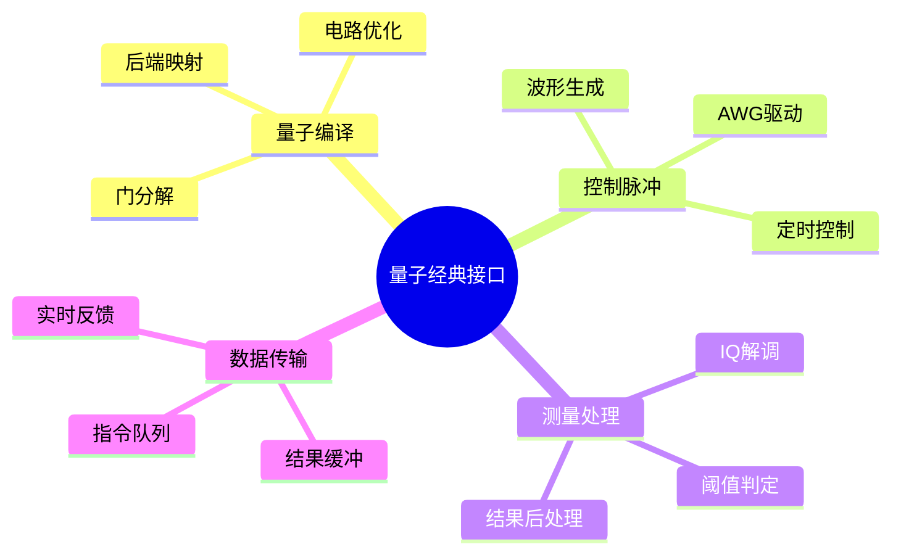

# 量子-经典计算接口

> **层级定位**: 04 Industrial Scenarios / 06 Quantum Computing
> **对应标准**: Qiskit, OpenQASM 3.0, IEEE P3120
> **难度级别**: L5 综合
> **预估学习时间**: 10-15 小时

---

## 📋 本节概要

| 属性 | 内容 |
|:-----|:-----|
| **核心概念** | 量子门序列编译、测量结果处理、量子-经典数据转换、脉冲控制 |
| **前置知识** | 量子比特、量子门、量子线路、C语言高级编程 |
| **后续延伸** | 量子纠错、量子-经典混合算法、量子云平台 |
| **权威来源** | Qiskit, IBM Quantum, IEEE P3120, arXiv:quant-ph |

---


---

## 📑 目录

- [量子-经典计算接口](#量子-经典计算接口)
  - [📋 本节概要](#-本节概要)
  - [📑 目录](#-目录)
  - [🧠 知识结构思维导图](#-知识结构思维导图)
  - [📖 核心概念详解](#-核心概念详解)
    - [1. 量子控制指令集架构](#1-量子控制指令集架构)
    - [2. 量子电路编译器](#2-量子电路编译器)
    - [3. 脉冲序列生成](#3-脉冲序列生成)
    - [4. 测量结果处理](#4-测量结果处理)
  - [⚠️ 常见陷阱](#️-常见陷阱)
    - [陷阱 QCI01: 浮点精度导致的门参数误差](#陷阱-qci01-浮点精度导致的门参数误差)
    - [陷阱 QCI02: 脉冲重叠导致的串扰](#陷阱-qci02-脉冲重叠导致的串扰)
    - [陷阱 QCI03: 测量结果缓冲区溢出](#陷阱-qci03-测量结果缓冲区溢出)
  - [✅ 质量验收清单](#-质量验收清单)
  - [📚 参考标准与延伸阅读](#-参考标准与延伸阅读)
  - [深入理解](#深入理解)
    - [核心原理](#核心原理)
    - [实践应用](#实践应用)
    - [最佳实践](#最佳实践)


---

## 🧠 知识结构思维导图



---

## 📖 核心概念详解

### 1. 量子控制指令集架构

```
┌─────────────────────────────────────────────────────────────────────┐
│                    量子-经典混合计算架构                              │
├─────────────────────────────────────────────────────────────────────┤
│                                                                      │
│   ┌─────────────────────────────────────────────────────────────┐   │
│   │                    经典计算机 (Host)                         │   │
│   │  ┌──────────────┐  ┌──────────────┐  ┌──────────────┐       │   │
│   │  │ 算法编译    │  │ 电路优化     │  │ 结果分析     │       │   │
│   │  │ (Qiskit)    │  │ (Transpiler) │  │ (Post-process)│      │   │
│   │  └──────┬───────┘  └──────┬───────┘  └──────┬───────┘       │   │
│   │         └─────────────────┴─────────────────┘               │   │
│   │                           │                                 │   │
│   │                    OpenQASM / QIR                           │   │
│   │                           │                                 │   │
│   └───────────────────────────┼─────────────────────────────────┘   │
│                               │                                      │
│                    ┌──────────┴──────────┐                          │
│                    │  FPGA Controller    │                          │
│                    │  (实时脉冲控制)     │                          │
│                    └──────────┬──────────┘                          │
│                               │                                      │
│         ┌─────────────────────┼─────────────────────┐               │
│         │                     │                     │               │
│         ▼                     ▼                     ▼               │
│   ┌──────────┐          ┌──────────┐          ┌──────────┐         │
│   │ 微波源   │          │ 微波源   │          │ 读出链   │         │
│   │ (Qubit1) │          │ (QubitN) │          │          │         │
│   └────┬─────┘          └────┬─────┘          └────┬─────┘         │
│        │                     │                     │               │
│        └─────────────────────┴─────────────────────┘               │
│                               │                                      │
│                    ┌──────────┴──────────┐                          │
│                    │    稀释制冷机       │  ~10mK                   │
│                    │    Quantum Chip     │                          │
│                    └─────────────────────┘                          │
│                                                                      │
└─────────────────────────────────────────────────────────────────────┘
```

### 2. 量子电路编译器

```c
// ============================================================================
// 量子电路表示与编译
// 支持OpenQASM 3.0子集
// ============================================================================

#include <stdint.h>
#include <stdbool.h>
#include <complex.h>
#include <math.h>

#define MAX_QUBITS      32
#define MAX_GATES       1024
#define MAX_PARAMS      4

// 标准单量子比特门
typedef enum {
    GATE_I,     // 恒等门
    GATE_X,     // Pauli-X (NOT)
    GATE_Y,     // Pauli-Y
    GATE_Z,     // Pauli-Z
    GATE_H,     // Hadamard
    GATE_S,     // Phase
    GATE_SDAG,  // S-dagger
    GATE_T,     // T gate
    GATE_TDAG,  // T-dagger
    GATE_RX,    // X旋转
    GATE_RY,    // Y旋转
    GATE_RZ,    // Z旋转
    GATE_U1,    // U1相位
    GATE_U2,    // U2通用
    GATE_U3,    // U3通用
    NUM_SINGLE_QUBIT_GATES
} SingleQubitGateType;

// 双量子比特门
typedef enum {
    GATE_CX,    // CNOT
    GATE_CY,    // C-Y
    GATE_CZ,    // C-Z
    GATE_SWAP,  // SWAP
    GATE_CPHASE,// 受控相位
    NUM_TWO_QUBIT_GATES
} TwoQubitGateType;

// 三量子比特门
typedef enum {
    GATE_CCX,   // Toffoli
    GATE_CCZ,   // 双控Z
    NUM_THREE_QUBIT_GATES
} ThreeQubitGateType;

// 门定义
typedef struct {
    uint8_t num_qubits;
    uint8_t num_params;
    char name[16];
    void (*matrix_func)(double params[], double complex matrix[]);
} GateDefinition;

// 门实例 (电路中的具体门)
typedef struct {
    uint16_t gate_id;       // 门的类型ID
    uint8_t qubits[3];      // 作用的量子比特 (最多3个)
    double params[MAX_PARAMS]; // 参数 (如旋转角度)
    uint32_t duration_ns;   // 持续时间(纳秒)
    uint32_t start_time_ns; // 开始时间
} GateInstruction;

// 量子电路
typedef struct {
    uint8_t num_qubits;
    uint32_t num_gates;
    GateInstruction gates[MAX_GATES];
    uint32_t total_duration_ns;
} QuantumCircuit;

// ============================================================================
// 标准门矩阵定义
// ============================================================================

void get_pauli_x_matrix(double complex m[4]) {
    m[0] = 0; m[1] = 1;
    m[2] = 1; m[3] = 0;
}

void get_pauli_y_matrix(double complex m[4]) {
    m[0] = 0;       m[1] = -I;
    m[2] = I;       m[3] = 0;
}

void get_pauli_z_matrix(double complex m[4]) {
    m[0] = 1; m[1] = 0;
    m[2] = 0; m[3] = -1;
}

void get_hadamard_matrix(double complex m[4]) {
    double inv_sqrt2 = 1.0 / sqrt(2.0);
    m[0] = inv_sqrt2;  m[1] = inv_sqrt2;
    m[2] = inv_sqrt2;  m[3] = -inv_sqrt2;
}

void get_rotation_x_matrix(double theta, double complex m[4]) {
    double c = cos(theta / 2);
    double s = sin(theta / 2);
    m[0] = c;    m[1] = -I * s;
    m[2] = -I * s; m[3] = c;
}

void get_rotation_y_matrix(double theta, double complex m[4]) {
    double c = cos(theta / 2);
    double s = sin(theta / 2);
    m[0] = c;  m[1] = -s;
    m[2] = s;  m[3] = c;
}

void get_rotation_z_matrix(double theta, double complex m[4]) {
    m[0] = cexp(-I * theta / 2);  m[1] = 0;
    m[2] = 0;                     m[3] = cexp(I * theta / 2);
}

// ============================================================================
// 通用U3门: U(θ, φ, λ) = Rz(φ)Ry(θ)Rz(λ)
// ============================================================================

void get_u3_matrix(double theta, double phi, double lambda, double complex m[4]) {
    double c = cos(theta / 2);
    double s = sin(theta / 2);

    m[0] = c;
    m[1] = -cexpl(I * lambda) * s;
    m[2] = cexpl(I * phi) * s;
    m[3] = cexpl(I * (phi + lambda)) * c;
}

// ============================================================================
// 电路构建API
// ============================================================================

void circuit_init(QuantumCircuit *circ, uint8_t n_qubits) {
    circ->num_qubits = n_qubits;
    circ->num_gates = 0;
    circ->total_duration_ns = 0;
}

int circuit_add_gate(QuantumCircuit *circ, SingleQubitGateType gate,
                     uint8_t qubit, double params[], uint32_t duration_ns) {
    if (circ->num_gates >= MAX_GATES) return -1;
    if (qubit >= circ->num_qubits) return -1;

    GateInstruction *inst = &circ->gates[circ->num_gates++];
    inst->gate_id = gate;
    inst->qubits[0] = qubit;
    inst->duration_ns = duration_ns;
    inst->start_time_ns = circ->total_duration_ns;

    // 复制参数
    int num_params = (gate == GATE_U3) ? 3 : (gate == GATE_U2) ? 2 :
                     (gate == GATE_RX || gate == GATE_RY || gate == GATE_RZ) ? 1 : 0;
    for (int i = 0; i < num_params && i < MAX_PARAMS; i++) {
        inst->params[i] = params[i];
    }

    circ->total_duration_ns += duration_ns;
    return 0;
}

int circuit_add_cnot(QuantumCircuit *circ, uint8_t control, uint8_t target,
                     uint32_t duration_ns) {
    if (circ->num_gates >= MAX_GATES) return -1;
    if (control >= circ->num_qubits || target >= circ->num_qubits) return -1;
    if (control == target) return -1;

    GateInstruction *inst = &circ->gates[circ->num_gates++];
    inst->gate_id = GATE_CX + NUM_SINGLE_QUBIT_GATES;
    inst->qubits[0] = control;
    inst->qubits[1] = target;
    inst->duration_ns = duration_ns;
    inst->start_time_ns = circ->total_duration_ns;

    circ->total_duration_ns += duration_ns;
    return 0;
}

// ============================================================================
// 电路优化: 门合并与消除
// ============================================================================

void optimize_circuit(QuantumCircuit *circ) {
    // 1. 恒等门消除
    for (int i = 0; i < (int)circ->num_gates; i++) {
        if (circ->gates[i].gate_id == GATE_I) {
            // 删除此门 (将后续门前移)
            for (int j = i; j < (int)circ->num_gates - 1; j++) {
                circ->gates[j] = circ->gates[j + 1];
            }
            circ->num_gates--;
            i--;  // 重新检查当前位置
        }
    }

    // 2. 连续旋转门合并
    for (int i = 0; i < (int)circ->num_gates - 1; i++) {
        GateInstruction *g1 = &circ->gates[i];
        GateInstruction *g2 = &circ->gates[i + 1];

        // 同一量子比特上的连续Rz门可以合并
        if (g1->gate_id == GATE_RZ && g2->gate_id == GATE_RZ &&
            g1->qubits[0] == g2->qubits[0]) {
            g1->params[0] += g2->params[0];  // 角度相加
            // 删除g2
            for (int j = i + 1; j < (int)circ->num_gates - 1; j++) {
                circ->gates[j] = circ->gates[j + 1];
            }
            circ->num_gates--;
        }
    }

    // 3. 重新计算时间
    circ->total_duration_ns = 0;
    for (int i = 0; i < (int)circ->num_gates; i++) {
        circ->gates[i].start_time_ns = circ->total_duration_ns;
        circ->total_duration_ns += circ->gates[i].duration_ns;
    }
}

// ============================================================================
// OpenQASM解析器 (简化版)
// ============================================================================

#include <stdio.h>
#include <string.h>
#include <stdlib.h>

int parse_openqasm_line(const char *line, QuantumCircuit *circ) {
    char gate_name[32];
    int qubits[3];
    double params[3];
    int n;

    // 跳过空白和注释
    while (*line == ' ' || *line == '\t') line++;
    if (*line == '\0' || *line == '/' || *line == '\n') return 0;

    // 解析门名称
    n = sscanf(line, "%31s", gate_name);
    if (n != 1) return -1;

    // 解析不同门
    if (strcmp(gate_name, "h") == 0) {
        if (sscanf(line, "h q[%d]", &qubits[0]) == 1) {
            return circuit_add_gate(circ, GATE_H, qubits[0], NULL, 35);
        }
    } else if (strcmp(gate_name, "x") == 0) {
        if (sscanf(line, "x q[%d]", &qubits[0]) == 1) {
            return circuit_add_gate(circ, GATE_X, qubits[0], NULL, 25);
        }
    } else if (strcmp(gate_name, "cx") == 0) {
        if (sscanf(line, "cx q[%d], q[%d]", &qubits[0], &qubits[1]) == 2) {
            return circuit_add_cnot(circ, qubits[0], qubits[1], 400);
        }
    } else if (strcmp(gate_name, "rz") == 0) {
        if (sscanf(line, "rz(%lf) q[%d]", &params[0], &qubits[0]) == 2) {
            return circuit_add_gate(circ, GATE_RZ, qubits[0], params, 0);
        }
    }
    // 更多门类型...

    return 0;
}
```

### 3. 脉冲序列生成

```c
// ============================================================================
// 量子控制脉冲生成
// 从门指令到实际AWG波形的转换
// ============================================================================

#define PULSE_SAMPLES       1024
#define MAX_CHANNELS        64      // 32Q * 2 (I+Q)
#define SAMPLING_RATE_GSPS  1.0     // 1 GSPS

// 脉冲形状类型
typedef enum {
    PULSE_GAUSSIAN,
    PULSE_DRAG,         // Derivative Removal by Adiabatic Gate
    PULSE_SQUARE,
    PULSE_COSINE
} PulseShape;

// 单个脉冲定义
typedef struct {
    PulseShape shape;
    double amplitude;       // 0-1 (归一化)
    double duration_ns;
    double sigma_ns;        // 高斯宽度
    double beta;            // DRAG参数
    double frequency_ghz;   // 载波频率
    double phase_rad;       // 载波相位
} PulseDef;

// AWG波形样本 (复数IQ)
typedef struct {
    double i[PULSE_SAMPLES];
    double q[PULSE_SAMPLES];
    uint32_t num_samples;
    double sample_rate_gsps;
} Waveform;

// ============================================================================
// 脉冲形状生成
// ============================================================================

void generate_gaussian_pulse(const PulseDef *def, Waveform *wf) {
    double dt_ns = 1000.0 / (def->duration_ns * SAMPLING_RATE_GSPS);
    uint32_t n_samples = (uint32_t)(def->duration_ns * SAMPLING_RATE_GSPS);

    if (n_samples > PULSE_SAMPLES) n_samples = PULSE_SAMPLES;

    double center = n_samples / 2.0;
    double sigma_samples = def->sigma_ns * SAMPLING_RATE_GSPS;

    for (uint32_t i = 0; i < n_samples; i++) {
        double t = i - center;
        double envelope = exp(-(t * t) / (2.0 * sigma_samples * sigma_samples));

        // 载波
        double carrier_phase = 2.0 * M_PI * def->frequency_ghz * i / SAMPLING_RATE_GSPS
                              + def->phase_rad;

        wf->i[i] = def->amplitude * envelope * cos(carrier_phase);
        wf->q[i] = def->amplitude * envelope * sin(carrier_phase);
    }

    wf->num_samples = n_samples;
    wf->sample_rate_gsps = SAMPLING_RATE_GSPS;
}

void generate_drag_pulse(const PulseDef *def, Waveform *wf) {
    double dt_ns = 1000.0 / SAMPLING_RATE_GSPS;
    uint32_t n_samples = (uint32_t)(def->duration_ns * SAMPLING_RATE_GSPS);

    if (n_samples > PULSE_SAMPLES) n_samples = PULSE_SAMPLES;

    double center = n_samples / 2.0;
    double sigma_samples = def->sigma_ns * SAMPLING_RATE_GSPS;

    for (uint32_t i = 0; i < n_samples; i++) {
        double t = i - center;
        double gauss = exp(-(t * t) / (2.0 * sigma_samples * sigma_samples));

        // 高斯包络
        double envelope_i = gauss;

        // DRAG修正 (导数项)
        double envelope_q = -def->beta * (t / (sigma_samples * sigma_samples)) * gauss;

        // 载波
        double carrier_phase = 2.0 * M_PI * def->frequency_ghz * i / SAMPLING_RATE_GSPS
                              + def->phase_rad;

        wf->i[i] = def->amplitude * (envelope_i * cos(carrier_phase) -
                                      envelope_q * sin(carrier_phase));
        wf->q[i] = def->amplitude * (envelope_i * sin(carrier_phase) +
                                      envelope_q * cos(carrier_phase));
    }

    wf->num_samples = n_samples;
    wf->sample_rate_gsps = SAMPLING_RATE_GSPS;
}

// ============================================================================
// 门到脉冲的映射
// ============================================================================

// 系统参数
typedef struct {
    double qubit_freq_ghz[MAX_QUBITS];      // 各量子比特频率
    double anharmonicity_mhz[MAX_QUBITS];   // 非简谐性
    double pulse_sigma_ns;                  // 默认脉冲宽度
    double drag_beta;                       // DRAG参数
} SystemParams;

void gate_to_pulse(const GateInstruction *gate, const SystemParams *sys,
                   PulseDef *pulse) {

    uint8_t q = gate->qubits[0];

    switch (gate->gate_id) {
        case GATE_X:
            pulse->shape = PULSE_DRAG;
            pulse->amplitude = 1.0;
            pulse->duration_ns = 25;
            pulse->sigma_ns = sys->pulse_sigma_ns;
            pulse->beta = sys->drag_beta;
            pulse->frequency_ghz = sys->qubit_freq_ghz[q];
            pulse->phase_rad = 0;
            break;

        case GATE_Y:
            pulse->shape = PULSE_DRAG;
            pulse->amplitude = 1.0;
            pulse->duration_ns = 25;
            pulse->sigma_ns = sys->pulse_sigma_ns;
            pulse->beta = sys->drag_beta;
            pulse->frequency_ghz = sys->qubit_freq_ghz[q];
            pulse->phase_rad = M_PI / 2;  // 90度相位
            break;

        case GATE_H:
            // Hadamard = Ry(pi/2) 然后 相位调整
            pulse->shape = PULSE_DRAG;
            pulse->amplitude = 1.0 / sqrt(2);
            pulse->duration_ns = 35;
            pulse->sigma_ns = sys->pulse_sigma_ns;
            pulse->beta = sys->drag_beta;
            pulse->frequency_ghz = sys->qubit_freq_ghz[q];
            pulse->phase_rad = 0;
            break;

        case GATE_RZ:
            // 虚拟Z门 - 仅相位调整，无实际脉冲
            pulse->shape = PULSE_SQUARE;
            pulse->amplitude = 0;
            pulse->duration_ns = 0;  // 零时间门
            pulse->phase_rad = gate->params[0];
            break;

        default:
            pulse->amplitude = 0;
            break;
    }
}

// ============================================================================
// 完整脉冲序列生成
// ============================================================================

typedef struct {
    Waveform channels[MAX_CHANNELS];
    uint32_t channel_mask;      // 哪些通道有数据
    uint64_t total_duration_ns;
} PulseSequence;

int compile_circuit_to_pulses(const QuantumCircuit *circ,
                               const SystemParams *sys,
                               PulseSequence *seq) {

    seq->channel_mask = 0;
    seq->total_duration_ns = circ->total_duration_ns;

    for (uint32_t g = 0; g < circ->num_gates; g++) {
        const GateInstruction *gate = &circ->gates[g];

        PulseDef pulse;
        gate_to_pulse(gate, sys, &pulse);

        if (pulse.amplitude > 0) {
            Waveform wf;

            if (pulse.shape == PULSE_DRAG) {
                generate_drag_pulse(&pulse, &wf);
            } else {
                generate_gaussian_pulse(&pulse, &wf);
            }

            // 映射到对应通道 (每个量子比特有I和Q两个通道)
            uint8_t q = gate->qubits[0];
            uint8_t i_channel = q * 2;
            uint8_t q_channel = q * 2 + 1;

            // 将波形写入对应时隙
            // (这里简化处理，实际需要精确的时序对齐)
            for (uint32_t s = 0; s < wf.num_samples; s++) {
                seq->channels[i_channel].i[s] = wf.i[s];
                seq->channels[q_channel].q[s] = wf.q[s];
            }

            seq->channel_mask |= (1 << i_channel);
            seq->channel_mask |= (1 << q_channel);
        }
    }

    return 0;
}
```

### 4. 测量结果处理

```c
// ============================================================================
// 量子测量结果处理
// IQ解调、阈值判定、纠错
// ============================================================================

#define MAX_MEASUREMENTS    8192
#define ADC_BITS            12
#define ADC_RANGE           (1 << ADC_BITS)

// 原始ADC样本
typedef struct {
    int16_t i_samples[MAX_MEASUREMENTS];
    int16_t q_samples[MAX_MEASUREMENTS];
    uint32_t num_samples;
} RawMeasurement;

// 积分结果
typedef struct {
    double i_integral;
    double q_integral;
    double magnitude;
    double phase;
} IQResult;

// 分类结果
typedef enum {
    STATE_0 = 0,
    STATE_1 = 1,
    STATE_INVALID = -1
} QubitState;

// ============================================================================
// IQ解调与积分
// ============================================================================

void demodulate_iq(const RawMeasurement *raw,
                   double if_frequency_mhz,
                   double sample_rate_msps,
                   IQResult *result) {

    double sum_i = 0.0;
    double sum_q = 0.0;
    double dt = 1.0 / sample_rate_msps;

    for (uint32_t n = 0; n < raw->num_samples; n++) {
        double t = n * dt;
        double phase = 2.0 * M_PI * if_frequency_mhz * t;

        // 数字混频
        double i_demod = raw->i_samples[n] * cos(phase) -
                         raw->q_samples[n] * sin(phase);
        double q_demod = raw->i_samples[n] * sin(phase) +
                         raw->q_samples[n] * cos(phase);

        sum_i += i_demod;
        sum_q += q_demod;
    }

    result->i_integral = sum_i;
    result->q_integral = sum_q;
    result->magnitude = sqrt(sum_i * sum_i + sum_q * sum_q);
    result->phase = atan2(sum_q, sum_i);
}

// ============================================================================
// 阈值判定 (单阈值)
// ============================================================================

QubitState classify_single_threshold(const IQResult *result,
                                      double threshold,
                                      bool use_magnitude) {
    double value = use_magnitude ? result->magnitude : result->i_integral;

    if (value < threshold) {
        return STATE_0;
    } else {
        return STATE_1;
    }
}

// ============================================================================
// 多阈值/多态分类 (区分 |0>, |1>, |2>等)
// ============================================================================

#define NUM_THRESHOLD_LEVELS    4

typedef struct {
    double thresholds[NUM_THRESHOLD_LEVELS - 1];
    double centers[NUM_THRESHOLD_LEVELS];
} MultiThreshold;

int classify_multi_level(const IQResult *result, const MultiThreshold *mt) {
    double value = result->magnitude;

    for (int i = 0; i < NUM_THRESHOLD_LEVELS - 1; i++) {
        if (value < mt->thresholds[i]) {
            return i;
        }
    }
    return NUM_THRESHOLD_LEVELS - 1;
}

// ============================================================================
// 多 shot 统计
// ============================================================================

typedef struct {
    uint32_t total_shots;
    uint32_t count_0;
    uint32_t count_1;
    double prob_0;
    double prob_1;
    double fidelity;        // 测量保真度估计
} MeasurementStats;

void compute_measurement_stats(const QubitState *results,
                                uint32_t num_shots,
                                MeasurementStats *stats) {
    stats->total_shots = num_shots;
    stats->count_0 = 0;
    stats->count_1 = 0;

    for (uint32_t i = 0; i < num_shots; i++) {
        if (results[i] == STATE_0) {
            stats->count_0++;
        } else if (results[i] == STATE_1) {
            stats->count_1++;
        }
    }

    stats->prob_0 = (double)stats->count_0 / num_shots;
    stats->prob_1 = (double)stats->count_1 / num_shots;

    // 简单保真度估计 (假设理想态为|0>或|1>)
    stats->fidelity = fmax(stats->prob_0, stats->prob_1);
}

// ============================================================================
// 测量校准
// ============================================================================

// 校准数据
typedef struct {
    IQResult centroid_0;    // |0>态中心
    IQResult centroid_1;    // |1>态中心
    double separation;      // 分离度
    double snr;             // 信噪比
} MeasurementCalibration;

void calibrate_measurement(MeasurementCalibration *cal,
                           const IQResult *prepare_0_results,
                           const IQResult *prepare_1_results,
                           uint32_t num_shots) {
    // 计算质心
    cal->centroid_0.i_integral = 0;
    cal->centroid_0.q_integral = 0;
    cal->centroid_1.i_integral = 0;
    cal->centroid_1.q_integral = 0;

    for (uint32_t i = 0; i < num_shots; i++) {
        cal->centroid_0.i_integral += prepare_0_results[i].i_integral;
        cal->centroid_0.q_integral += prepare_0_results[i].q_integral;
        cal->centroid_1.i_integral += prepare_1_results[i].i_integral;
        cal->centroid_1.q_integral += prepare_1_results[i].q_integral;
    }

    cal->centroid_0.i_integral /= num_shots;
    cal->centroid_0.q_integral /= num_shots;
    cal->centroid_1.i_integral /= num_shots;
    cal->centroid_1.q_integral /= num_shots;

    // 计算分离度
    double di = cal->centroid_1.i_integral - cal->centroid_0.i_integral;
    double dq = cal->centroid_1.q_integral - cal->centroid_0.q_integral;
    cal->separation = sqrt(di * di + dq * dq);

    // 计算SNR (简化)
    cal->snr = cal->separation / 10.0;  // 假设噪声标准差为10
}

QubitState classify_with_calibration(const IQResult *result,
                                      const MeasurementCalibration *cal) {
    double d0_i = result->i_integral - cal->centroid_0.i_integral;
    double d0_q = result->q_integral - cal->centroid_0.q_integral;
    double d0 = sqrt(d0_i * d0_i + d0_q * d0_q);

    double d1_i = result->i_integral - cal->centroid_1.i_integral;
    double d1_q = result->q_integral - cal->centroid_1.q_integral;
    double d1 = sqrt(d1_i * d1_i + d1_q * d1_q);

    return (d0 < d1) ? STATE_0 : STATE_1;
}
```

---

## ⚠️ 常见陷阱

### 陷阱 QCI01: 浮点精度导致的门参数误差

```c
// ❌ 问题: 连续小角度旋转累积误差
for (int i = 0; i < 1000; i++) {
    rotate_z(qubit, M_PI / 1000);  // 累积舍入误差
}

// ✅ 正确: 预计算总角度，一次应用
rotate_z(qubit, M_PI);  // 直接应用π

// ✅ 或使用虚拟Z门跟踪相位
accumulate_virtual_phase(qubit, M_PI / 1000);  // 纯软件跟踪
```

### 陷阱 QCI02: 脉冲重叠导致的串扰

```c
// ❌ 问题: 相邻门时间重叠
// Gate1: t=0, duration=25ns
// Gate2: t=20, duration=25ns (与Gate1重叠5ns)

// ✅ 正确: 检查时间不重叠
bool check_pulse_overlap(const PulseSequence *seq,
                         uint32_t start_ns, uint32_t duration_ns) {
    uint32_t end_ns = start_ns + duration_ns;

    for (uint32_t i = 0; i < seq->num_pulses; i++) {
        uint32_t p_start = seq->pulses[i].start_time_ns;
        uint32_t p_end = p_start + seq->pulses[i].duration_ns;

        // 检查是否有重叠
        if (!(end_ns <= p_start || start_ns >= p_end)) {
            return true;  // 有重叠
        }
    }
    return false;
}
```

### 陷阱 QCI03: 测量结果缓冲区溢出

```c
// ❌ 问题: 固定大小缓冲区可能溢出
QubitState results[MAX_SHOTS];  // 如果实际shots > MAX_SHOTS?

// ✅ 正确: 动态分配并检查
QubitState *results = malloc(num_shots * sizeof(QubitState));
if (!results) return ERR_OUT_OF_MEMORY;

// 使用
// ...

free(results);
```

---

## ✅ 质量验收清单

| 检查项 | 要求 | 验证方法 |
|:-------|:-----|:---------|
| **编译正确性** |||
| OpenQASM解析 | 标准门集支持 | 测试用例 |
| 电路优化 | 等效性保持 | 模拟验证 |
| **脉冲生成** |||
| 采样率精度 | <0.1%误差 | 频谱分析 |
| 相位连续性 | 门间无相位跳变 | 示波器 |
| 幅度精度 | <1%误差 | 功率计 |
| **测量处理** |||
| 分类准确率 | >99% | 校准数据 |
| SNR | >10dB | 信号分析 |
| **性能** |||
| 编译延迟 | <100ms (1000门) | 基准测试 |
| 波形生成 | <10ms | 基准测试 |

---

## 📚 参考标准与延伸阅读

| 资源 | 说明 |
|:-----|:-----|
| OpenQASM 3.0 | IBM量子汇编语言规范 |
| QIR | 量子中间表示规范 |
| IEEE P3120 | 量子计算技术标准 |
| arXiv:quant-ph | 量子物理论文预印本 |
| "Quantum Computation and Quantum Information" | Nielsen & Chuang |

---

> **更新记录**
>
> - 2025-03-09: 初版创建，包含量子-经典接口完整实现


---

## 深入理解

### 核心原理

深入探讨技术原理和实现细节。

### 实践应用

- 应用场景1
- 应用场景2
- 应用场景3

### 最佳实践

1. 理解基础概念
2. 掌握核心机制
3. 应用到实际项目

---

> **最后更新**: 2026-03-21
> **维护者**: AI Code Review
