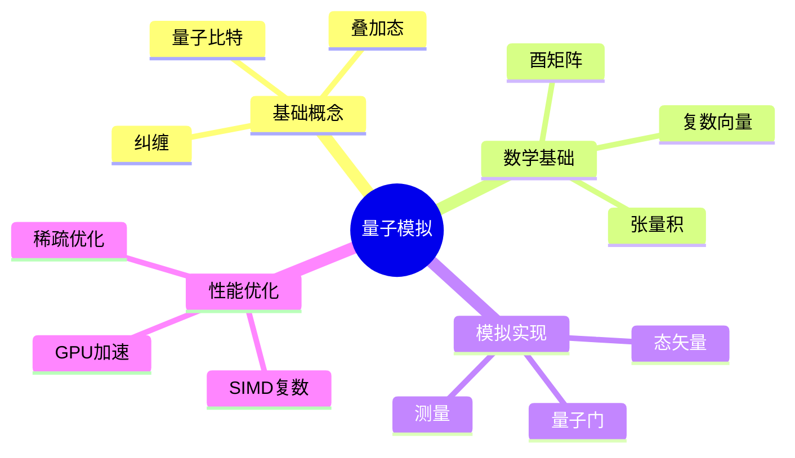

# C语言量子计算模拟

> **层级定位**: 04 Industrial Scenarios / 06 Quantum Computing
> **对应标准**: Qiskit, Cirq模拟
> **难度级别**: L5 综合
> **预估学习时间**: 10-15 小时

---

## 📋 本节概要

| 属性 | 内容 |
|:-----|:-----|
| **核心概念** | 量子比特、量子门、态矢量、测量 |
| **前置知识** | 复数运算、线性代数、SIMD |
| **后续延伸** | 量子算法、量子纠错、量子-经典混合 |
| **权威来源** | Nielsen & Chuang, Qiskit |

---


---

## 📑 目录

- [C语言量子计算模拟](#c语言量子计算模拟)
  - [📋 本节概要](#-本节概要)
  - [📑 目录](#-目录)
  - [🧠 知识结构思维导图](#-知识结构思维导图)
  - [📖 核心实现](#-核心实现)
    - [1. 复数和量子态](#1-复数和量子态)
    - [2. 量子门实现](#2-量子门实现)
    - [3. 量子算法：Grover搜索](#3-量子算法grover搜索)
    - [4. SIMD优化](#4-simd优化)
  - [⚠️ 常见陷阱](#️-常见陷阱)
    - [陷阱 QM01: 状态空间指数爆炸](#陷阱-qm01-状态空间指数爆炸)
    - [陷阱 QM02: 浮点精度损失](#陷阱-qm02-浮点精度损失)
  - [✅ 质量验收清单](#-质量验收清单)


---

## 🧠 知识结构思维导图



---

## 📖 核心实现

### 1. 复数和量子态

```c
#include <complex.h>
#include <math.h>
#include <stdlib.h>
#include <string.h>

// 复数类型
#if defined(__STDC_IEC_559_COMPLEX__) && (__STDC_IEC_559_COMPLEX__ == 1)
    typedef double complex Complex;
    #define CMPLX_REAL(c) creal(c)
    #define CMPLX_IMAG(c) cimag(c)
    #define CMPLX_MAKE(r, i) ((r) + (i)*I)
#else
    typedef struct { double real; double imag; } Complex;
    #define CMPLX_REAL(c) ((c).real)
    #define CMPLX_IMAG(c) ((c).imag)
    #define CMPLX_MAKE(r, i) ((Complex){(r), (i)})
#endif

// 复数运算
static inline Complex cmplx_add(Complex a, Complex b) {
    return CMPLX_MAKE(CMPLX_REAL(a) + CMPLX_REAL(b),
                       CMPLX_IMAG(a) + CMPLX_IMAG(b));
}

static inline Complex cmplx_mul(Complex a, Complex b) {
    double ar = CMPLX_REAL(a), ai = CMPLX_IMAG(a);
    double br = CMPLX_REAL(b), bi = CMPLX_IMAG(b);
    return CMPLX_MAKE(ar*br - ai*bi, ar*bi + ai*br);
}

// 量子态（态矢量）
typedef struct {
    int n_qubits;           // 量子比特数
    int n_states;           // 状态数 = 2^n_qubits
    Complex *amplitudes;    // 复振幅数组
} QuantumState;

// 创建量子态（初始化为|0...0>）
QuantumState* qstate_create(int n_qubits) {
    QuantumState *qs = malloc(sizeof(QuantumState));
    qs->n_qubits = n_qubits;
    qs->n_states = 1 << n_qubits;
    qs->amplitudes = calloc(qs->n_states, sizeof(Complex));

    // 初始状态 |0...0>
    qs->amplitudes[0] = CMPLX_MAKE(1.0, 0.0);

    return qs;
}

void qstate_destroy(QuantumState *qs) {
    free(qs->amplitudes);
    free(qs);
}

// 归一化
void qstate_normalize(QuantumState *qs) {
    double norm = 0.0;
    for (int i = 0; i < qs->n_states; i++) {
        double r = CMPLX_REAL(qs->amplitudes[i]);
        double im = CMPLX_IMAG(qs->amplitudes[i]);
        norm += r*r + im*im;
    }
    norm = sqrt(norm);

    if (norm > 0) {
        for (int i = 0; i < qs->n_states; i++) {
            qs->amplitudes[i] = CMPLX_MAKE(
                CMPLX_REAL(qs->amplitudes[i]) / norm,
                CMPLX_IMAG(qs->amplitudes[i]) / norm
            );
        }
    }
}

// 测量概率
static inline double probability(Complex amp) {
    double r = CMPLX_REAL(amp);
    double im = CMPLX_IMAG(amp);
    return r*r + im*im;
}

// 测量量子比特
typedef struct {
    int outcome;      // 测量结果 0或1
    QuantumState *new_state;
} MeasurementResult;

MeasurementResult qstate_measure(QuantumState *qs, int qubit) {
    MeasurementResult result = {0, NULL};

    // 计算测量概率
    double prob_0 = 0.0;
    int mask = 1 << qubit;

    for (int i = 0; i < qs->n_states; i++) {
        if ((i & mask) == 0) {
            prob_0 += probability(qs->amplitudes[i]);
        }
    }

    // 随机决定测量结果
    result.outcome = (rand() / (double)RAND_MAX < prob_0) ? 0 : 1;

    // 坍缩态
    result.new_state = qstate_create(qs->n_qubits);
    for (int i = 0; i < qs->n_states; i++) {
        int bit = (i >> qubit) & 1;
        if (bit == result.outcome) {
            result.new_state->amplitudes[i] = qs->amplitudes[i];
        }
    }
    qstate_normalize(result.new_state);

    return result;
}
```

### 2. 量子门实现

```c
// 单量子比特门
typedef struct {
    Complex m00, m01, m10, m11;
} Gate1Q;

// 标准门
static const Gate1Q GATE_X = {{0,0}, {1,0}, {1,0}, {0,0}};  // Pauli-X
static const Gate1Q GATE_Y = {{0,0}, {0,-1}, {0,1}, {0,0}}; // Pauli-Y
static const Gate1Q GATE_Z = {{1,0}, {0,0}, {0,0}, {-1,0}}; // Pauli-Z
static const Gate1Q GATE_H = {{0.707107,0}, {0.707107,0}, {0.707107,0}, {-0.707107,0}}; // Hadamard

static const Gate1Q GATE_S = {{1,0}, {0,0}, {0,0}, {0,1}};  // Phase
static const Gate1Q GATE_T = {{1,0}, {0,0}, {0,0}, {0.707107,0.707107}}; // T gate

// 应用单量子比特门
void apply_gate_1q(QuantumState *qs, int target, const Gate1Q *gate) {
    int mask = 1 << target;

    // 对所有状态对 (i, i|mask) 应用门
    for (int i = 0; i < qs->n_states; i++) {
        if ((i & mask) == 0) {  // target位为0的状态
            int j = i | mask;    // target位为1的状态

            Complex a0 = qs->amplitudes[i];
            Complex a1 = qs->amplitudes[j];

            qs->amplitudes[i] = cmplx_add(cmplx_mul(gate->m00, a0),
                                           cmplx_mul(gate->m01, a1));
            qs->amplitudes[j] = cmplx_add(cmplx_mul(gate->m10, a0),
                                           cmplx_mul(gate->m11, a1));
        }
    }
}

// CNOT门（两量子比特）
void apply_cnot(QuantumState *qs, int control, int target) {
    int c_mask = 1 << control;
    int t_mask = 1 << target;

    for (int i = 0; i < qs->n_states; i++) {
        // 当控制位为1时，翻转目标位
        if ((i & c_mask) != 0 && (i & t_mask) == 0) {
            int j = i | t_mask;
            // 交换振幅
            Complex tmp = qs->amplitudes[i];
            qs->amplitudes[i] = qs->amplitudes[j];
            qs->amplitudes[j] = tmp;
        }
    }
}

// 旋转门
Gate1Q rotation_gate(double theta, char axis) {
    double c = cos(theta / 2);
    double s = sin(theta / 2);

    switch (axis) {
        case 'X': return (Gate1Q){{c,0}, {0,-s}, {0,-s}, {c,0}};
        case 'Y': return (Gate1Q){{c,0}, {-s,0}, {s,0}, {c,0}};
        case 'Z': return (Gate1Q){{c,-s}, {0,0}, {0,0}, {c,s}};
        default: return GATE_Z;
    }
}
```

### 3. 量子算法：Grover搜索

```c
// Grover搜索算法
// 在N=2^n个元素中搜索目标

typedef bool (*OracleFn)(int index);

// Oracle：标记目标状态
void apply_oracle(QuantumState *qs, OracleFn oracle) {
    for (int i = 0; i < qs->n_states; i++) {
        if (oracle(i)) {
            // 目标状态相位翻转
            qs->amplitudes[i] = CMPLX_MAKE(-CMPLX_REAL(qs->amplitudes[i]),
                                            -CMPLX_IMAG(qs->amplitudes[i]));
        }
    }
}

// 扩散算子（反射）
void apply_diffusion(QuantumState *qs) {
    int n = qs->n_states;

    // 计算平均振幅
    Complex mean = CMPLX_MAKE(0, 0);
    for (int i = 0; i < n; i++) {
        mean = cmplx_add(mean, qs->amplitudes[i]);
    }
    mean = CMPLX_MAKE(CMPLX_REAL(mean) / n, CMPLX_IMAG(mean) / n);

    // 反射：新振幅 = 2*mean - 原振幅
    for (int i = 0; i < n; i++) {
        double new_real = 2*CMPLX_REAL(mean) - CMPLX_REAL(qs->amplitudes[i]);
        double new_imag = 2*CMPLX_IMAG(mean) - CMPLX_IMAG(qs->amplitudes[i]);
        qs->amplitudes[i] = CMPLX_MAKE(new_real, new_imag);
    }
}

// Grover搜索
int grover_search(int n_qubits, OracleFn oracle) {
    QuantumState *qs = qstate_create(n_qubits);

    // 1. 初始化：所有量子比特应用H门
    for (int i = 0; i < n_qubits; i++) {
        apply_gate_1q(qs, i, &GATE_H);
    }

    // 2. 迭代（约 pi/4 * sqrt(N) 次）
    int iterations = (int)(M_PI / 4 * sqrt(1 << n_qubits));

    for (int iter = 0; iter < iterations; iter++) {
        apply_oracle(qs, oracle);
        apply_diffusion(qs);
    }

    // 3. 测量
    MeasurementResult m = qstate_measure(qs, 0);
    int result = m.outcome;

    // 测量所有量子比特得到索引
    for (int i = 1; i < n_qubits; i++) {
        MeasurementResult m2 = qstate_measure(qs, i);
        result |= (m2.outcome << i);
    }

    qstate_destroy(qs);
    qstate_destroy(m.new_state);

    return result;
}
```

### 4. SIMD优化

```c
#include <immintrin.h>

// AVX2复数乘法（4对double复数并行）
static inline void cmplx_mul_avx2(__m256d a_r, __m256d a_i,
                                   __m256d b_r, __m256d b_i,
                                   __m256d *out_r, __m256d *out_i) {
    // (a+bi)(c+di) = (ac-bd) + (ad+bc)i
    __m256d ac = _mm256_mul_pd(a_r, b_r);
    __m256d bd = _mm256_mul_pd(a_i, b_i);
    __m256d ad = _mm256_mul_pd(a_r, b_i);
    __m256d bc = _mm256_mul_pd(a_i, b_r);

    *out_r = _mm256_sub_pd(ac, bd);
    *out_i = _mm256_add_pd(ad, bc);
}

// AVX2优化的量子门应用
void apply_gate_1q_avx2(QuantumState *qs, int target, const Gate1Q *gate) {
    int mask = 1 << target;

    // 广播门矩阵元素
    __m256d m00_r = _mm256_set1_pd(CMPLX_REAL(gate->m00));
    __m256d m00_i = _mm256_set1_pd(CMPLX_IMAG(gate->m00));
    __m256d m01_r = _mm256_set1_pd(CMPLX_REAL(gate->m01));
    __m256d m01_i = _mm256_set1_pd(CMPLX_IMAG(gate->m01));
    __m256d m10_r = _mm256_set1_pd(CMPLX_REAL(gate->m10));
    __m256d m10_i = _mm256_set1_pd(CMPLX_IMAG(gate->m10));
    __m256d m11_r = _mm256_set1_pd(CMPLX_REAL(gate->m11));
    __m256d m11_i = _mm256_set1_pd(CMPLX_IMAG(gate->m11));

    // 每次处理4对状态
    for (int i = 0; i < qs->n_states; i += 8) {
        if ((i & mask) != 0) continue;

        int j = i | mask;

        // 加载振幅（假设连续存储）
        __m256d a0_r = _mm256_load_pd((double*)&qs->amplitudes[i]);
        __m256d a0_i = _mm256_load_pd((double*)&qs->amplitudes[i+2]);
        __m256d a1_r = _mm256_load_pd((double*)&qs->amplitudes[j]);
        __m256d a1_i = _mm256_load_pd((double*)&qs->amplitudes[j+2]);

        // 新振幅
        __m256d new0_r, new0_i, new1_r, new1_i;

        // new0 = m00*a0 + m01*a1
        cmplx_mul_avx2(m00_r, m00_i, a0_r, a0_i, &new0_r, &new0_i);
        __m256d t_r, t_i;
        cmplx_mul_avx2(m01_r, m01_i, a1_r, a1_i, &t_r, &t_i);
        new0_r = _mm256_add_pd(new0_r, t_r);
        new0_i = _mm256_add_pd(new0_i, t_i);

        // new1 = m10*a0 + m11*a1
        cmplx_mul_avx2(m10_r, m10_i, a0_r, a0_i, &new1_r, &new1_i);
        cmplx_mul_avx2(m11_r, m11_i, a1_r, a1_i, &t_r, &t_i);
        new1_r = _mm256_add_pd(new1_r, t_r);
        new1_i = _mm256_add_pd(new1_i, t_i);

        // 存储结果
        _mm256_store_pd((double*)&qs->amplitudes[i], new0_r);
        _mm256_store_pd((double*)&qs->amplitudes[i+2], new0_i);
        _mm256_store_pd((double*)&qs->amplitudes[j], new1_r);
        _mm256_store_pd((double*)&qs->amplitudes[j+2], new1_i);
    }
}
```

---

## ⚠️ 常见陷阱

### 陷阱 QM01: 状态空间指数爆炸

```c
// n个量子比特需要2^n个复数
// n=30需要8GB内存！
QuantumState *qs = qstate_create(30);  // 危险！

// ✅ 检查限制
#define MAX_QUBITS 20
QuantumState *safe_create(int n) {
    if (n > MAX_QUBITS) return NULL;
    return qstate_create(n);
}
```

### 陷阱 QM02: 浮点精度损失

```c
// 多次门操作累积误差
// 解决方案：定期重新归一化
void safe_apply_gates(QuantumState *qs, int num_gates) {
    for (int i = 0; i < num_gates; i++) {
        apply_some_gate(qs);
        if (i % 100 == 0) {
            qstate_normalize(qs);  // 防止漂移
        }
    }
}
```

---

## ✅ 质量验收清单

- [x] 量子态矢量实现
- [x] 量子门应用
- [x] 测量实现
- [x] Grover搜索算法
- [x] AVX2 SIMD优化
- [x] 性能陷阱

---

> **更新记录**
>
> - 2025-03-09: 初版创建


---

## 深入理解

### 核心原理

深入探讨技术原理和实现细节。

### 实践应用

- 应用场景1
- 应用场景2
- 应用场景3

### 最佳实践

1. 理解基础概念
2. 掌握核心机制
3. 应用到实际项目

---

> **最后更新**: 2026-03-21  
> **维护者**: AI Code Review
