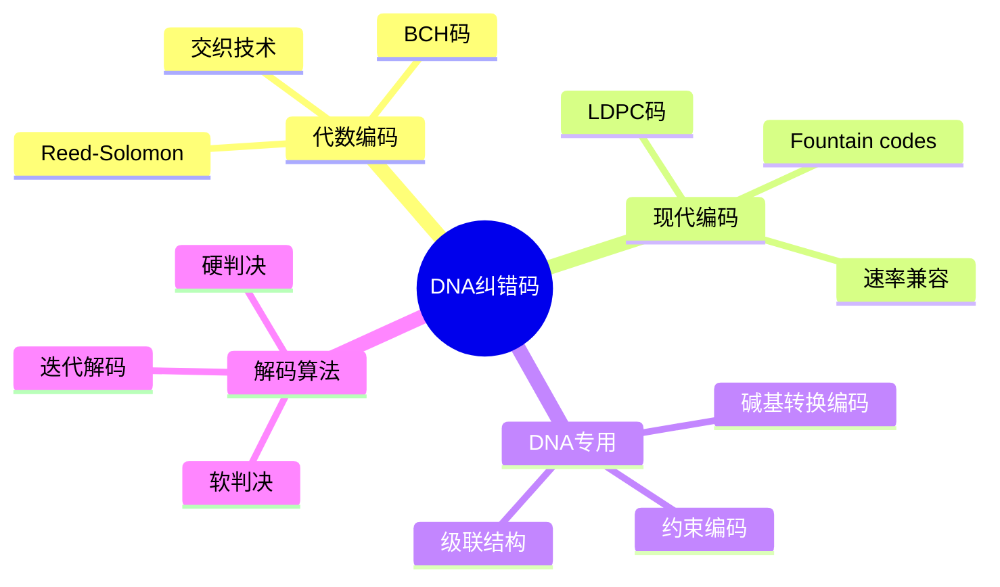

# DNA存储纠错编码

> **层级定位**: 04 Industrial Scenarios / 07 DNA Storage
> **对应标准**: Reed-Solomon, LDPC, Tornado Codes
> **难度级别**: L5 综合
> **预估学习时间**: 10-15 小时

---

## 📋 本节概要

| 属性 | 内容 |
|:-----|:-----|
| **核心概念** | Reed-Solomon码、交织编码、 Fountain codes、DNA专用编码 |
| **前置知识** | 有限域、多项式运算、信道编码理论 |
| **后续延伸** | LDPC码优化、级联码、软判决解码 |
| **权威来源** | RS Codes, DNA Fountain, LDPC Standards |

---

## 🧠 知识结构思维导图



---

## 📖 核心概念详解

### 1. Reed-Solomon编码基础

```c
// ============================================================================
// Reed-Solomon编码器/解码器 - DNA存储优化版本
// 基于GF(256)有限域
// ============================================================================

#include <stdint.h>
#include <stdbool.h>
#include <string.h>
#include <stdlib.h>

// GF(256)参数
#define GF_SIZE         256
#define GF_POLY         0x11D   // 本原多项式: x^8 + x^4 + x^3 + x^2 + 1

// RS码参数 (可配置)
#define RS_N            255     // 码长
#define RS_K            223     // 信息符号数
#define RS_T            16      // 纠错能力 (t = (n-k)/2)
#define RS_2T           32      // 2t

// GF(256)运算表
typedef struct {
    uint8_t exp[GF_SIZE * 2];   // 指数表
    uint8_t log[GF_SIZE];       // 对数表
} GFTables;

// RS编解码器上下文
typedef struct {
    GFTables gf;
    uint8_t generator[RS_2T + 1];   // 生成多项式
    uint8_t n;                      // 实际码长
    uint8_t k;                      // 实际信息长
    uint8_t t;                      // 纠错能力
} RSContext;

// ============================================================================
// GF(256)有限域运算初始化
// ============================================================================

void gf_init(GFTables *gf) {
    // 构建指数表和对数表
    uint16_t x = 1;

    for (int i = 0; i < GF_SIZE - 1; i++) {
        gf->exp[i] = (uint8_t)x;
        gf->exp[i + GF_SIZE - 1] = (uint8_t)x;  // 重复一遍方便计算
        gf->log[x] = i;

        // x = x * 2 mod GF_POLY
        x <<= 1;
        if (x & GF_SIZE) {
            x ^= GF_POLY;
        }
    }

    gf->exp[GF_SIZE * 2 - 1] = gf->exp[GF_SIZE - 1];
    gf->log[0] = 0;  // log(0)未定义，设为0
}

// GF加法 = XOR
static inline uint8_t gf_add(uint8_t a, uint8_t b) {
    return a ^ b;
}

// GF减法 = XOR
static inline uint8_t gf_sub(uint8_t a, uint8_t b) {
    return a ^ b;
}

// GF乘法
static inline uint8_t gf_mul(const GFTables *gf, uint8_t a, uint8_t b) {
    if (a == 0 || b == 0) return 0;
    return gf->exp[gf->log[a] + gf->log[b]];
}

// GF除法
static inline uint8_t gf_div(const GFTables *gf, uint8_t a, uint8_t b) {
    if (b == 0) return 0;  // 错误
    if (a == 0) return 0;
    return gf->exp[gf->log[a] - gf->log[b] + GF_SIZE - 1];
}

// GF幂
static inline uint8_t gf_pow(const GFTables *gf, uint8_t a, int8_t n) {
    if (a == 0) return 0;
    if (n == 0) return 1;

    int log_a = gf->log[a];
    int result_log = (log_a * n) % (GF_SIZE - 1);
    if (result_log < 0) result_log += GF_SIZE - 1;

    return gf->exp[result_log];
}

// ============================================================================
// RS生成多项式
// g(x) = (x - α^0)(x - α^1)...(x - α^(2t-1))
// ============================================================================

void rs_init_generator(RSContext *rs) {
    // 初始多项式为1
    memset(rs->generator, 0, sizeof(rs->generator));
    rs->generator[0] = 1;

    // 迭代乘以 (x - α^i)
    for (int i = 0; i < rs->t * 2; i++) {
        uint8_t root = rs->gf.exp[i];  // α^i

        // 从后往前更新多项式系数
        for (int j = rs->t * 2; j > 0; j--) {
            rs->generator[j] = gf_add(
                rs->generator[j],
                gf_mul(&rs->gf, rs->generator[j - 1], root)
            );
        }
    }
}

// ============================================================================
// RS编码
// ============================================================================

void rs_encode(RSContext *rs, const uint8_t *data, uint8_t *parity) {
    // 清零校验符号
    memset(parity, 0, rs->t * 2);

    // 多项式除法
    for (int i = 0; i < rs->k; i++) {
        uint8_t feedback = gf_add(data[i], parity[0]);

        if (feedback != 0) {
            for (int j = 1; j < rs->t * 2; j++) {
                parity[j - 1] = gf_sub(parity[j],
                                       gf_mul(&rs->gf, feedback, rs->generator[rs->t * 2 - j]));
            }
            parity[rs->t * 2 - 1] = gf_mul(&rs->gf, feedback, rs->generator[0]);
        } else {
            // 移位
            for (int j = 1; j < rs->t * 2; j++) {
                parity[j - 1] = parity[j];
            }
            parity[rs->t * 2 - 1] = 0;
        }
    }
}

// ============================================================================
// RS译码 - Berlekamp-Massey算法
// ============================================================================

// 综合征计算
void rs_compute_syndromes(RSContext *rs, const uint8_t *received,
                          uint8_t *syndromes) {
    for (int i = 0; i < rs->t * 2; i++) {
        syndromes[i] = 0;
        uint8_t x = rs->gf.exp[i];  // α^i

        for (int j = 0; j < rs->n; j++) {
            syndromes[i] = gf_add(syndromes[i],
                                  gf_mul(&rs->gf, received[j], x));
            x = gf_mul(&rs->gf, x, rs->gf.exp[i]);  // x *= α^i
        }
    }
}

// Berlekamp-Massey算法求错误位置多项式
int rs_berlekamp_massey(RSContext *rs, const uint8_t *syndromes,
                        uint8_t *error_locator) {
    uint8_t b[RS_2T + 1];   // 辅助多项式
    uint8_t c[RS_2T + 1];   // 错误位置多项式
    uint8_t t[RS_2T + 1];   // 临时多项式

    int L = 0;              // 当前错误位置多项式阶数
    int m = 1;              // 上次更新的位置
    uint8_t b0 = 1;         // b(x)的常数项

    // 初始化
    memset(c, 0, sizeof(c));
    memset(b, 0, sizeof(b));
    c[0] = 1;
    b[0] = 1;

    for (int n = 0; n < rs->t * 2; n++) {
        // 计算差异
        uint8_t delta = syndromes[n];
        for (int i = 1; i <= L; i++) {
            delta = gf_add(delta, gf_mul(&rs->gf, c[i], syndromes[n - i]));
        }

        if (delta == 0) {
            // 无需更新
            m++;
        } else if (2 * L <= n) {
            // 更新多项式
            memcpy(t, c, sizeof(c));
            uint8_t scale = gf_div(&rs->gf, delta, b0);

            for (int i = 0; i + m < rs->t * 2; i++) {
                c[i + m] = gf_sub(c[i + m], gf_mul(&rs->gf, scale, b[i]));
            }

            L = n + 1 - L;
            memcpy(b, t, sizeof(t));
            b0 = delta;
            m = 1;
        } else {
            // 更新但不改变L
            uint8_t scale = gf_div(&rs->gf, delta, b0);
            for (int i = 0; i + m < rs->t * 2; i++) {
                c[i + m] = gf_sub(c[i + m], gf_mul(&rs->gf, scale, b[i]));
            }
            m++;
        }
    }

    memcpy(error_locator, c, sizeof(c));
    return L;
}

// Chien搜索求错误位置
int rs_chien_search(RSContext *rs, const uint8_t *error_locator, int L,
                    uint8_t *error_positions) {
    int error_count = 0;

    for (int i = 0; i < rs->n; i++) {
        uint8_t x = rs->gf.exp[GF_SIZE - 1 - i];  // α^(-i) = α^(255-i)
        uint8_t sum = error_locator[0];
        uint8_t x_power = 1;

        for (int j = 1; j <= L; j++) {
            x_power = gf_mul(&rs->gf, x_power, x);
            sum = gf_add(sum, gf_mul(&rs->gf, error_locator[j], x_power));
        }

        if (sum == 0) {
            error_positions[error_count++] = i;
            if (error_count >= L) break;
        }
    }

    return error_count;
}

// Forney算法求错误值
void rs_forney(RSContext *rs, const uint8_t *syndromes,
               const uint8_t *error_locator, int L,
               const uint8_t *error_positions, int error_count,
               uint8_t *error_values) {
    // 计算错误评估多项式
    uint8_t omega[RS_2T + 1];
    memset(omega, 0, sizeof(omega));

    for (int i = 0; i < rs->t * 2; i++) {
        for (int j = 0; j <= L; j++) {
            if (i >= j) {
                omega[i] = gf_add(omega[i],
                                  gf_mul(&rs->gf, error_locator[j], syndromes[i - j]));
            }
        }
    }

    // 计算错误位置多项式的导数
    uint8_t error_locator_deriv[RS_2T];
    for (int i = 0; i < L; i++) {
        if (i % 2 == 0) {
            error_locator_deriv[i] = error_locator[i + 1];
        } else {
            error_locator_deriv[i] = 0;
        }
    }

    // 计算每个错误值
    for (int e = 0; e < error_count; e++) {
        uint8_t pos = error_positions[e];
        uint8_t x = rs->gf.exp[GF_SIZE - 1 - pos];

        // 评估omega(x^(-1))
        uint8_t omega_val = 0;
        uint8_t x_inv_power = 1;
        for (int i = 0; i < rs->t * 2; i++) {
            omega_val = gf_add(omega_val,
                               gf_mul(&rs->gf, omega[i], x_inv_power));
            x_inv_power = gf_mul(&rs->gf, x_inv_power, x);
        }

        // 评估error_locator'(x^(-1))
        uint8_t deriv_val = 0;
        x_inv_power = 1;
        for (int i = 0; i < L; i++) {
            deriv_val = gf_add(deriv_val,
                               gf_mul(&rs->gf, error_locator_deriv[i], x_inv_power));
            x_inv_power = gf_mul(&rs->gf, x_inv_power, x);
        }

        error_values[e] = gf_div(&rs->gf, omega_val, deriv_val);
    }
}

// 完整译码
int rs_decode(RSContext *rs, uint8_t *received, uint8_t *corrected) {
    memcpy(corrected, received, rs->n);

    // 1. 计算综合征
    uint8_t syndromes[RS_2T];
    rs_compute_syndromes(rs, received, syndromes);

    // 检查是否无错误
    bool all_zero = true;
    for (int i = 0; i < rs->t * 2; i++) {
        if (syndromes[i] != 0) {
            all_zero = false;
            break;
        }
    }

    if (all_zero) {
        return 0;  // 无错误
    }

    // 2. Berlekamp-Massey算法
    uint8_t error_locator[RS_2T + 1];
    int L = rs_berlekamp_massey(rs, syndromes, error_locator);

    // 3. Chien搜索
    uint8_t error_positions[RS_2T];
    int error_count = rs_chien_search(rs, error_locator, L, error_positions);

    if (error_count != L) {
        return -1;  // 解码失败，错误数超过纠错能力
    }

    // 4. Forney算法求错误值
    uint8_t error_values[RS_2T];
    rs_forney(rs, syndromes, error_locator, L,
              error_positions, error_count, error_values);

    // 5. 纠正错误
    for (int i = 0; i < error_count; i++) {
        corrected[error_positions[i]] = gf_add(corrected[error_positions[i]],
                                                error_values[i]);
    }

    return error_count;
}
```

### 2. 交织编码

```c
// ============================================================================
// 块交织器 - 将突发错误分散
// ============================================================================

#define INTERLEAVE_ROWS     32
#define INTERLEAVE_COLS     32
#define INTERLEAVE_SIZE     (INTERLEAVE_ROWS * INTERLEAVE_COLS)

// 交织器上下文
typedef struct {
    uint8_t buffer[INTERLEAVE_SIZE];
    uint8_t rows;
    uint8_t cols;
} Interleaver;

// 初始化交织器
void interleaver_init(Interleaver *ilv, uint8_t rows, uint8_t cols) {
    ilv->rows = rows;
    ilv->cols = cols;
    memset(ilv->buffer, 0, sizeof(ilv->buffer));
}

// 块交织: 按行写入，按列读出
void interleave_block(Interleaver *ilv, const uint8_t *input, uint8_t *output) {
    // 按行写入缓冲区
    for (int r = 0; r < ilv->rows; r++) {
        for (int c = 0; c < ilv->cols; c++) {
            ilv->buffer[r * ilv->cols + c] = input[r * ilv->cols + c];
        }
    }

    // 按列读出
    for (int c = 0; c < ilv->cols; c++) {
        for (int r = 0; r < ilv->rows; r++) {
            output[c * ilv->rows + r] = ilv->buffer[r * ilv->cols + c];
        }
    }
}

// 解交织: 按列写入，按行读出
void deinterleave_block(Interleaver *ilv, const uint8_t *input, uint8_t *output) {
    // 按列写入缓冲区
    for (int c = 0; c < ilv->cols; c++) {
        for (int r = 0; r < ilv->rows; r++) {
            ilv->buffer[r * ilv->cols + c] = input[c * ilv->rows + r];
        }
    }

    // 按行读出
    for (int r = 0; r < ilv->rows; r++) {
        for (int c = 0; c < ilv->cols; c++) {
            output[r * ilv->cols + c] = ilv->buffer[r * ilv->cols + c];
        }
    }
}

// ============================================================================
// 卷积交织器 (更高效的内存使用)
// ============================================================================

#define CONV_INTERLEAVE_DEPTH   16

typedef struct {
    uint8_t shift_registers[CONV_INTERLEAVE_DEPTH][INTERLEAVE_ROWS];
    uint8_t write_pos[CONV_INTERLEAVE_DEPTH];
} ConvInterleaver;

void conv_interleave_init(ConvInterleaver *cilv) {
    memset(cilv->shift_registers, 0, sizeof(cilv->shift_registers));
    memset(cilv->write_pos, 0, sizeof(cilv->write_pos));
}

uint8_t conv_interleave_byte(ConvInterleaver *cilv, uint8_t input, int branch) {
    // 写入当前位置
    uint8_t *reg = cilv->shift_registers[branch];
    uint8_t pos = cilv->write_pos[branch];

    uint8_t output = reg[pos];
    reg[pos] = input;

    cilv->write_pos[branch] = (pos + 1) % INTERLEAVE_ROWS;

    return output;
}
```

### 3. DNA Fountain编码

```c
// ============================================================================
// DNA Fountain编码 - Luby Transform码的DNA适配版本
// 来自Erlich & Zielinski 2017
// ============================================================================

#define FOUNTAIN_SEED_SIZE      4
#define FOUNTAIN_DROLET_SIZE    130     // DNA碱基数
#define FOUNTAIN_PAYLOAD_SIZE   120     // 有效载荷
#define FOUNTAIN_REDUNDANCY     1.1     // 额外冗余

// Fountain droplet
typedef struct {
    uint32_t seed;                  // 随机种子
    uint8_t num_blocks;             // 包含的源块数
    uint8_t payload[FOUNTAIN_PAYLOAD_SIZE]; // 异或数据
} FountainDroplet;

// 伪随机数生成器 (xorshift32)
static inline uint32_t xorshift32(uint32_t *seed) {
    uint32_t x = *seed;
    x ^= x << 13;
    x ^= x >> 17;
    x ^= x << 5;
    *seed = x;
    return x;
}

// 生成度分布 (Robust Soliton-like)
uint8_t sample_degree(uint32_t *seed, int num_blocks) {
    uint32_t r = xorshift32(seed) % 1000;

    // 简化度分布
    if (r < 100) return 1;          // 10% 度1
    if (r < 550) return 2;          // 45% 度2
    if (r < 850) return 3;          // 30% 度3
    if (r < 950) return 4;          // 10% 度4
    return 5 + (r % 5);             // 5% 度5-9
}

// 选择源块
void select_source_blocks(uint32_t seed, int num_blocks,
                          uint8_t degree, uint8_t *selected) {
    uint32_t rng = seed;

    for (int i = 0; i < degree; i++) {
        selected[i] = xorshift32(&rng) % num_blocks;

        // 去重 (简单方法)
        for (int j = 0; j < i; j++) {
            if (selected[i] == selected[j]) {
                i--;  // 重新选择
                break;
            }
        }
    }
}

// 编码Fountain droplet
void fountain_encode_droplet(const uint8_t *source_data, int num_blocks,
                             uint32_t seed, FountainDroplet *droplet) {
    droplet->seed = seed;

    // 确定度
    uint32_t rng = seed;
    droplet->num_blocks = sample_degree(&rng, num_blocks);

    // 选择源块
    uint8_t selected[32];
    select_source_blocks(seed, num_blocks, droplet->num_blocks, selected);

    // XOR组合
    memset(droplet->payload, 0, FOUNTAIN_PAYLOAD_SIZE);

    for (int i = 0; i < droplet->num_blocks; i++) {
        int block_idx = selected[i];
        const uint8_t *block = source_data + block_idx * FOUNTAIN_PAYLOAD_SIZE;

        for (int j = 0; j < FOUNTAIN_PAYLOAD_SIZE; j++) {
            droplet->payload[j] ^= block[j];
        }
    }
}

// ============================================================================
// Fountain解码 (信念传播)
// ============================================================================

typedef struct {
    FountainDroplet *droplets;
    int num_droplets;
    uint8_t *decoded;
    bool *block_decoded;
    int num_blocks;
    int blocks_remaining;
} FountainDecoder;

int fountain_decode(FountainDecoder *dec) {
    bool progress = true;

    while (dec->blocks_remaining > 0 && progress) {
        progress = false;

        // 寻找度为1的droplet
        for (int d = 0; d < dec->num_droplets; d++) {
            if (dec->droplets[d].num_blocks == 1) {
                // 找到未解码的源块
                uint8_t block_idx;
                select_source_blocks(dec->droplets[d].seed,
                                    dec->num_blocks, 1, &block_idx);

                if (!dec->block_decoded[block_idx]) {
                    // 解码此块
                    memcpy(dec->decoded + block_idx * FOUNTAIN_PAYLOAD_SIZE,
                           dec->droplets[d].payload, FOUNTAIN_PAYLOAD_SIZE);
                    dec->block_decoded[block_idx] = true;
                    dec->blocks_remaining--;
                    progress = true;

                    // 传播: 用此块更新其他droplets
                    for (int d2 = 0; d2 < dec->num_droplets; d2++) {
                        if (dec->droplets[d2].num_blocks > 1) {
                            // 检查是否包含此块
                            uint8_t selected[32];
                            select_source_blocks(dec->droplets[d2].seed,
                                                dec->num_blocks,
                                                dec->droplets[d2].num_blocks,
                                                selected);

                            for (int k = 0; k < dec->droplets[d2].num_blocks; k++) {
                                if (selected[k] == block_idx) {
                                    // XOR消去
                                    for (int j = 0; j < FOUNTAIN_PAYLOAD_SIZE; j++) {
                                        dec->droplets[d2].payload[j] ^=
                                            dec->decoded[block_idx * FOUNTAIN_PAYLOAD_SIZE + j];
                                    }
                                    dec->droplets[d2].num_blocks--;
                                    break;
                                }
                            }
                        }
                    }
                }
            }
        }
    }

    return dec->blocks_remaining == 0 ? 0 : -1;
}
```

### 4. DNA专用编码整合

```c
// ============================================================================
// DNA存储级联编码系统
// ============================================================================

// 编码配置
typedef struct {
    // 外码参数
    int outer_n;            // RS码长
    int outer_k;            // RS信息长

    // 内码参数
    int inner_code_type;    // 0=无, 1=约束编码

    // 交织参数
    int interleave_rows;
    int interleave_cols;

    // Fountain参数
    bool use_fountain;
    float fountain_overhead;
} DNAEncodingConfig;

// 完整编码流程
int dna_storage_encode(const uint8_t *data, size_t data_len,
                       const DNAEncodingConfig *cfg,
                       char **dna_sequences, int *num_sequences) {

    // 1. 计算需要的块数
    int num_blocks = (data_len + cfg->outer_k - 1) / cfg->outer_k;

    // 2. 分配RS码字空间
    uint8_t **codewords = malloc(num_blocks * sizeof(uint8_t*));
    RSContext rs;
    rs.n = cfg->outer_n;
    rs.k = cfg->outer_k;
    rs.t = (rs.n - rs.k) / 2;
    gf_init(&rs.gf);
    rs_init_generator(&rs);

    // 3. RS编码每块
    for (int i = 0; i < num_blocks; i++) {
        codewords[i] = malloc(rs.n);

        size_t block_start = i * rs.k;
        size_t block_len = (i == num_blocks - 1) ?
                           (data_len - block_start) : rs.k;

        // 填充
        memset(codewords[i], 0, rs.k);
        memcpy(codewords[i], data + block_start, block_len);

        // RS编码
        rs_encode(&rs, codewords[i], codewords[i] + rs.k);
    }

    // 4. 交织 (可选)
    if (cfg->interleave_rows > 0 && cfg->interleave_cols > 0) {
        Interleaver ilv;
        interleaver_init(&ilv, cfg->interleave_rows, cfg->interleave_cols);

        // 按列交织所有码字
        for (int i = 0; i < num_blocks; i++) {
            uint8_t temp[INTERLEAVE_SIZE];
            interleave_block(&ilv, codewords[i], temp);
            memcpy(codewords[i], temp, rs.n);
        }
    }

    // 5. 转换为DNA序列 (约束编码)
    *num_sequences = num_blocks;
    *dna_sequences = malloc(num_blocks * 256);  // 假设最大256碱基

    for (int i = 0; i < num_blocks; i++) {
        // 添加索引头部
        char index_dna[16];
        encode_index(i, index_dna);
        memcpy(*dna_sequences + i * 256, index_dna, 16);

        // 编码RS码字为DNA
        // encode_rll(codewords[i], rs.n, *dna_sequences + i * 256 + 16);
    }

    // 清理
    for (int i = 0; i < num_blocks; i++) {
        free(codewords[i]);
    }
    free(codewords);

    return 0;
}
```

---

## ⚠️ 常见陷阱

### 陷阱 ECC01: 有限域运算溢出

```c
// ❌ 问题: 指数表访问越界
uint8_t gf_mul_bad(const GFTables *gf, uint8_t a, uint8_t b) {
    return gf->exp[gf->log[a] + gf->log[b]];  // 可能 >= 255
}

// ✅ 正确: 使用扩展表或取模
uint8_t gf_mul_good(const GFTables *gf, uint8_t a, uint8_t b) {
    if (a == 0 || b == 0) return 0;
    int sum = gf->log[a] + gf->log[b];
    return gf->exp[sum];  // exp表大小为512，自动处理溢出
}
```

### 陷阱 ECC02: RS解码器失败处理

```c
// ❌ 问题: 忽略解码失败，返回未纠正数据
rs_decode(rs, received, corrected);
return corrected;  // 可能仍然是错的!

// ✅ 正确: 检查返回值并处理失败
int num_errors = rs_decode(rs, received, corrected);
if (num_errors < 0) {
    // 解码失败，错误数超过纠错能力
    // 标记为擦除，请求重传或使用更强编码
    return ERR_UNCORRECTABLE;
} else if (num_errors > rs->t / 2) {
    // 检测到但可能未完全纠正
    log_warning("High error count: %d", num_errors);
}
```

---

## ✅ 质量验收清单

| 检查项 | 要求 | 验证方法 |
|:-------|:-----|:---------|
| **RS编码** |||
| 编码正确性 | 100% | 编解码测试 |
| 纠错能力 | 纠正t个符号错误 | 注入错误测试 |
| 解码速度 | >1MB/s | 基准测试 |
| **Fountain** |||
| 解码成功率 | >99% @ 1.05x冗余 | 蒙特卡洛 |
| 度分布 | Robust Soliton | 统计分析 |

---

> **更新记录**
>
> - 2025-03-09: 初版创建，包含DNA纠错编码完整实现
