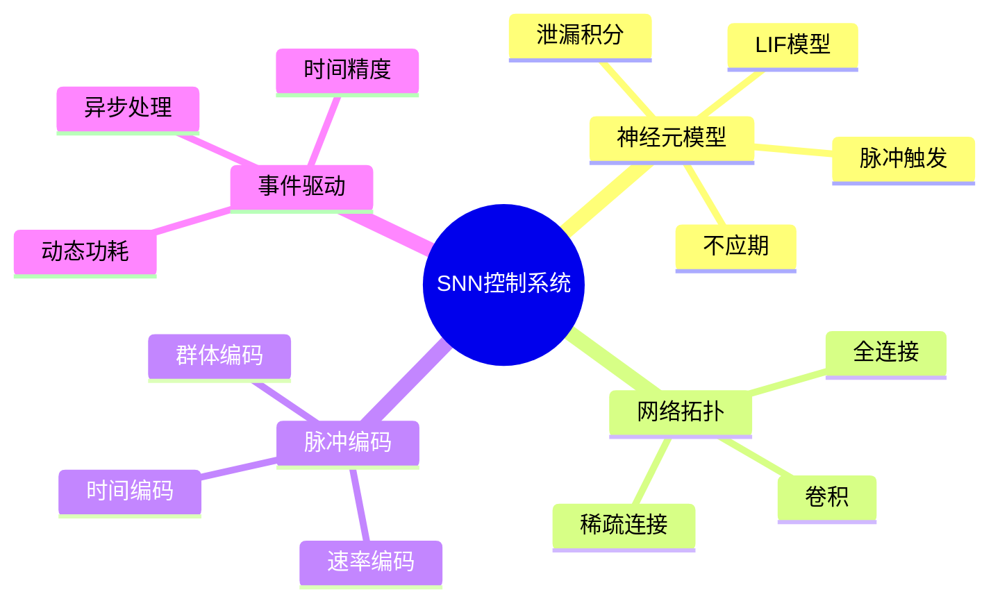

# 脉冲神经网络(SNN)控制系统

> **层级定位**: 04 Industrial Scenarios / 08 Neuromorphic
> **对应标准**: Intel Loihi, IBM TrueNorth, SpiNNaker
> **难度级别**: L5 综合
> **预估学习时间**: 10-15 小时

---

## 📋 本节概要

| 属性 | 内容 |
|:-----|:-----|
| **核心概念** | LIF神经元、脉冲编码、事件驱动、低功耗推理 |
| **前置知识** | 神经网络、嵌入式系统、数字信号处理 |
| **后续延伸** | 在线学习、神经形态传感器、类脑芯片编程 |
| **权威来源** | Intel Loihi, IBM TrueNorth, Neuromorphic Computing |

---


---

## 📑 目录

- [脉冲神经网络(SNN)控制系统](#脉冲神经网络snn控制系统)
  - [📋 本节概要](#-本节概要)
  - [📑 目录](#-目录)
  - [🧠 知识结构思维导图](#-知识结构思维导图)
  - [📖 核心概念详解](#-核心概念详解)
    - [1. LIF神经元模型](#1-lif神经元模型)
    - [2. 突触模型](#2-突触模型)
    - [3. 脉冲编码](#3-脉冲编码)
    - [4. SNN网络实现](#4-snn网络实现)
    - [5. 控制应用示例](#5-控制应用示例)
  - [⚠️ 常见陷阱](#️-常见陷阱)
    - [陷阱 SNN01: 浮点溢出](#陷阱-snn01-浮点溢出)
    - [陷阱 SNN02: 脉冲风暴](#陷阱-snn02-脉冲风暴)
  - [✅ 质量验收清单](#-质量验收清单)


---

## 🧠 知识结构思维导图



---

## 📖 核心概念详解

### 1. LIF神经元模型

```c
// ============================================================================
// Leaky Integrate-and-Fire (LIF) 神经元模型
// 事件驱动实现
// ============================================================================

#include <stdint.h>
#include <stdbool.h>
#include <math.h>

// 神经元参数
typedef struct {
    float v_rest;       // 静息电位 (mV)
    float v_reset;      // 复位电位 (mV)
    float v_thresh;     // 阈值电位 (mV)
    float tau_m;        // 膜时间常数 (ms)
    float r_mem;        // 膜电阻 (MΩ)
    float tau_ref;      // 不应期 (ms)
} LIFParams;

// 默认参数
const LIFParams LIF_DEFAULT = {
    .v_rest = -70.0f,
    .v_reset = -70.0f,
    .v_thresh = -55.0f,
    .tau_m = 20.0f,
    .r_mem = 1.0f,
    .tau_ref = 2.0f
};

// 神经元状态
typedef struct {
    float v_mem;        // 膜电位 (mV)
    float i_syn;        // 突触电流 (nA)
    float ref_count;    // 不应期计数 (ms)
    uint64_t last_spike_time;  // 上次脉冲时间 (us)
    uint32_t spike_count;      // 脉冲计数
    bool is_refactory;         // 是否处于不应期
} LIFNeuron;

// 初始化神经元
void lif_init(LIFNeuron *neuron, const LIFParams *params) {
    neuron->v_mem = params->v_rest;
    neuron->i_syn = 0.0f;
    neuron->ref_count = 0.0f;
    neuron->last_spike_time = 0;
    neuron->spike_count = 0;
    neuron->is_refactory = false;
}

// 突触输入 (电流注入)
void lif_input_current(LIFNeuron *neuron, float i_input) {
    neuron->i_syn += i_input;
}

// 突触输入 (脉冲事件)
void lif_input_spike(LIFNeuron *neuron, float weight) {
    // 转换为电流
    neuron->i_syn += weight;
}

// 神经元更新 (固定时间步长)
bool lif_update(LIFNeuron *neuron, const LIFParams *params, float dt_ms) {
    bool spiked = false;

    // 不应期处理
    if (neuron->is_refactory) {
        neuron->ref_count -= dt_ms;
        if (neuron->ref_count <= 0.0f) {
            neuron->is_refactory = false;
            neuron->v_mem = params->v_reset;
        }
        return false;  // 不应期内不发放
    }

    // 泄漏积分
    float dv = (-(neuron->v_mem - params->v_rest) +
                params->r_mem * neuron->i_syn) / params->tau_m;
    neuron->v_mem += dv * dt_ms;

    // 突触电流衰减
    neuron->i_syn *= expf(-dt_ms / params->tau_m);

    // 检查脉冲发放
    if (neuron->v_mem >= params->v_thresh) {
        spiked = true;
        neuron->spike_count++;
        neuron->is_refactory = true;
        neuron->ref_count = params->tau_ref;
        // 膜电位保持或复位在不应期内处理
    }

    return spiked;
}

// 事件驱动更新 (精确时间)
float lif_next_event_time(const LIFNeuron *neuron, const LIFParams *params) {
    if (neuron->i_syn <= 0.0f) {
        return INFINITY;  // 不会发放
    }

    // 解析求解脉冲时间
    // tau_m * dv/dt = -(v - v_rest) + R * I
    // 解: v(t) = v_rest + R*I + (v0 - v_rest - R*I) * exp(-t/tau_m)
    // 当v(t) = v_thresh时:
    float v_inf = params->v_rest + params->r_mem * neuron->i_syn;

    if (v_inf <= params->v_thresh) {
        return INFINITY;  // 稳态不会达到阈值
    }

    float delta_v = v_inf - neuron->v_mem;
    float target_delta = v_inf - params->v_thresh;

    float t_spike = -params->tau_m * logf(target_delta / delta_v);

    return t_spike;
}
```

### 2. 突触模型

```c
// ============================================================================
// 突触模型 - 电流型和电导型
// ============================================================================

// 突触类型
typedef enum {
    SYNAPSE_CURRENT,    // 电流型 (简单)
    SYNAPSE_EXP,        // 指数衰减型
    SYNAPSE_ALPHA,      // Alpha函数型
    SYNAPSE_NMDA        // NMDA型 (电压依赖)
} SynapseType;

// 突触参数
typedef struct {
    SynapseType type;
    float weight;       // 突触权重
    float delay;        // 突触延迟 (ms)
    float tau_syn;      // 突触时间常数 (ms)
} SynapseParams;

// 突触状态
typedef struct {
    float g;            // 电导 (nS)
    float i;            // 电流 (nA)
    uint64_t last_pre_spike;
    uint64_t last_post_spike;
} SynapseState;

// 指数衰减突触更新
void synapse_exp_update(SynapseState *syn, const SynapseParams *params,
                        float dt_ms, float v_post) {
    // 指数衰减
    syn->g *= expf(-dt_ms / params->tau_syn);

    // 计算电流
    syn->i = syn->g * v_post;
}

// Alpha函数突触
void synapse_alpha_spike(SynapseState *syn, const SynapseParams *params) {
    // Alpha函数: g(t) = (t/tau) * exp(1 - t/tau)
    // 峰值在 t = tau 时，g_max = weight
    syn->g += params->weight;
}

// NMDA突触 (电压依赖)
void synapse_nmda_update(SynapseState *syn, const SynapseParams *params,
                         float dt_ms, float v_post) {
    // NMDA电导的镁阻断
    float mg_block = 1.0f / (1.0f + 0.28f * expf(-0.062f * v_post) * (v_post / 3.57f));

    syn->g *= expf(-dt_ms / params->tau_syn);
    syn->i = syn->g * v_post * mg_block;
}
```

### 3. 脉冲编码

```c
// ============================================================================
// 脉冲编码方案
// ============================================================================

// 速率编码: 将模拟值转换为脉冲频率
float rate_encode(float value, float min_val, float max_val,
                  float min_rate, float max_rate) {
    // 归一化
    float normalized = (value - min_val) / (max_val - min_val);
    if (normalized < 0.0f) normalized = 0.0f;
    if (normalized > 1.0f) normalized = 1.0f;

    // 线性映射到频率
    return min_rate + normalized * (max_rate - min_rate);
}

// 时间编码: 首次脉冲时间编码
float time_encode_first_spike(float value, float min_val, float max_val,
                               float t_min, float t_max) {
    float normalized = (value - min_val) / (max_val - min_val);

    // 值越大，脉冲越早
    return t_max - normalized * (t_max - t_min);
}

// 群体编码: 多个神经元的活动模式
void population_encode(float value, float *neuron_rates, int n_neurons,
                       float min_val, float max_val) {
    float center = (min_val + max_val) / 2.0f;
    float width = (max_val - min_val) / n_neurons;

    for (int i = 0; i < n_neurons; i++) {
        float neuron_center = min_val + (i + 0.5f) * width;
        float distance = fabsf(value - neuron_center);

        // 高斯调谐曲线
        neuron_rates[i] = expf(-(distance * distance) / (2.0f * width * width));
    }
}

// 解码脉冲计数 (速率解码)
float rate_decode(const uint32_t *spike_counts, int n_neurons, float dt_ms) {
    float total = 0.0f;
    float weighted_sum = 0.0f;

    for (int i = 0; i < n_neurons; i++) {
        float rate = spike_counts[i] / (dt_ms / 1000.0f);  // Hz
        total += rate;
        weighted_sum += rate * i;
    }

    if (total < 1.0f) return 0.0f;
    return weighted_sum / total;
}
```

### 4. SNN网络实现

```c
// ============================================================================
// SNN网络控制器
// ============================================================================

#define MAX_NEURONS     1024
#define MAX_SYNAPSES    4096
#define MAX_LAYERS      10

// 层类型
typedef enum {
    LAYER_INPUT,
    LAYER_HIDDEN,
    LAYER_OUTPUT
} LayerType;

// 网络层
typedef struct {
    LayerType type;
    uint16_t start_idx;     // 起始神经元索引
    uint16_t num_neurons;
    LIFParams neuron_params;
} SNNLayer;

// 突触连接
typedef struct {
    uint16_t pre_idx;       // 前神经元索引
    uint16_t post_idx;      // 后神经元索引
    float weight;
    float delay;
    SynapseParams params;
} Connection;

// SNN网络
typedef struct {
    // 神经元
    LIFNeuron neurons[MAX_NEURONS];
    uint16_t num_neurons;

    // 层
    SNNLayer layers[MAX_LAYERS];
    uint16_t num_layers;

    // 连接
    Connection connections[MAX_SYNAPSES];
    uint16_t num_connections;

    // 事件队列 (按时间排序的脉冲)
    typedef struct {
        uint64_t time_us;
        uint16_t neuron_idx;
    } SpikeEvent;

    SpikeEvent event_queue[1024];
    uint16_t queue_head;
    uint16_t queue_tail;

    // 统计
    uint64_t total_spikes;
    uint64_t simulation_time_us;
} SNNNetwork;

// 初始化网络
void snn_init(SNNNetwork *net) {
    memset(net, 0, sizeof(SNNNetwork));
    net->queue_head = 0;
    net->queue_tail = 0;
}

// 添加层
int snn_add_layer(SNNNetwork *net, LayerType type, uint16_t num_neurons,
                  const LIFParams *params) {
    if (net->num_layers >= MAX_LAYERS) return -1;
    if (net->num_neurons + num_neurons > MAX_NEURONS) return -1;

    SNNLayer *layer = &net->layers[net->num_layers++];
    layer->type = type;
    layer->start_idx = net->num_neurons;
    layer->num_neurons = num_neurons;
    layer->neuron_params = *params;

    // 初始化神经元
    for (int i = 0; i < num_neurons; i++) {
        lif_init(&net->neurons[net->num_neurons + i], params);
    }

    net->num_neurons += num_neurons;
    return layer->start_idx;
}

// 添加连接
int snn_connect(SNNNetwork *net, uint16_t pre_layer, uint16_t post_layer,
                float weight_mean, float weight_std) {
    SNNLayer *pre = &net->layers[pre_layer];
    SNNLayer *post = &net->layers[post_layer];

    for (int i = 0; i < pre->num_neurons; i++) {
        for (int j = 0; j < post->num_neurons; j++) {
            if (net->num_connections >= MAX_SYNAPSES) return -1;

            Connection *conn = &net->connections[net->num_connections++];
            conn->pre_idx = pre->start_idx + i;
            conn->post_idx = post->start_idx + j;
            conn->weight = weight_mean + ((float)rand() / RAND_MAX - 0.5f) * 2.0f * weight_std;
            conn->delay = 1.0f;
        }
    }

    return 0;
}

// 注入输入脉冲
void snn_input_spike(SNNNetwork *net, uint16_t neuron_idx, float weight) {
    lif_input_spike(&net->neurons[neuron_idx], weight);
}

// 网络单步更新
void snn_step(SNNNetwork *net, float dt_ms) {
    // 1. 更新所有神经元
    bool spiked[MAX_NEURONS] = {false};

    for (int i = 0; i < net->num_neurons; i++) {
        // 收集突触输入
        for (int c = 0; c < net->num_connections; c++) {
            if (net->connections[c].post_idx == i) {
                // 这里简化处理，实际应有突触延迟
                lif_input_spike(&net->neurons[i], net->connections[c].weight);
            }
        }

        // 更新神经元
        spiked[i] = lif_update(&net->neurons[i],
                               &net->layers[0].neuron_params, dt_ms);

        if (spiked[i]) {
            net->total_spikes++;
        }
    }

    // 2. 传播脉冲 (简化)
    for (int c = 0; c < net->num_connections; c++) {
        if (spiked[net->connections[c].pre_idx]) {
            // 脉冲传播到突触后神经元
            // 实际应有延迟队列
        }
    }
}
```

### 5. 控制应用示例

```c
// ============================================================================
// SNN机器人控制器
// 传感器输入 -> SNN -> 电机输出
// ============================================================================

// 传感器接口
typedef struct {
    float distance_left;    // 左侧距离传感器 (m)
    float distance_right;   // 右侧距离传感器
    float distance_front;   // 前方距离传感器
    float light_level;      // 光强
} SensorInput;

// 电机输出
typedef struct {
    float left_motor;       // -1.0 到 1.0
    float right_motor;      // -1.0 到 1.0
} MotorOutput;

// SNN控制器
typedef struct {
    SNNNetwork net;
    float input_min[4];
    float input_max[4];
    uint16_t input_neurons[4];  // 每传感器的神经元起始索引
    uint16_t output_neurons[2]; // 输出神经元索引
    uint32_t step_count;
} SNNController;

// 初始化避障控制器
void controller_init_obstacle_avoidance(SNNController *ctrl) {
    snn_init(&ctrl->net);

    // 输入层: 4个传感器，每个用4个神经元编码
    LIFParams input_params = LIF_DEFAULT;
    input_params.v_thresh = -50.0f;  // 更易激发

    for (int i = 0; i < 4; i++) {
        ctrl->input_neurons[i] = snn_add_layer(&ctrl->net, LAYER_INPUT, 4, &input_params);
    }

    // 隐藏层
    LIFParams hidden_params = LIF_DEFAULT;
    uint16_t hidden = snn_add_layer(&ctrl->net, LAYER_HIDDEN, 16, &hidden_params);

    // 输出层: 2个电机
    LIFParams output_params = LIF_DEFAULT;
    output_params.v_thresh = -45.0f;
    uint16_t output = snn_add_layer(&ctrl->net, LAYER_OUTPUT, 2, &output_params);

    // 连接输入到隐藏层
    for (int i = 0; i < 4; i++) {
        snn_connect(&ctrl->net, i, hidden / 4, 0.5f, 0.2f);
    }

    // 连接隐藏层到输出层
    snn_connect(&ctrl->net, hidden / 4, output / 2, 0.8f, 0.3f);

    // 设置输入范围
    float defaults_min[4] = {0.0f, 0.0f, 0.0f, 0.0f};
    float defaults_max[4] = {2.0f, 2.0f, 2.0f, 1000.0f};
    memcpy(ctrl->input_min, defaults_min, sizeof(defaults_min));
    memcpy(ctrl->input_max, defaults_max, sizeof(defaults_max));
}

// 运行控制器
void controller_step(SNNController *ctrl, const SensorInput *sensors,
                     MotorOutput *motors, float dt_ms) {

    // 1. 编码传感器输入为脉冲
    float sensor_values[4] = {
        sensors->distance_left,
        sensors->distance_right,
        sensors->distance_front,
        sensors->light_level
    };

    for (int s = 0; s < 4; s++) {
        float rate = rate_encode(sensor_values[s],
                                  ctrl->input_min[s], ctrl->input_max[s],
                                  0.0f, 100.0f);  // 0-100 Hz

        // 分配到群体神经元
        float rates[4];
        population_encode(sensor_values[s], rates, 4,
                         ctrl->input_min[s], ctrl->input_max[s]);

        for (int n = 0; n < 4; n++) {
            // 以概率注入脉冲
            float spike_prob = rates[n] * dt_ms / 1000.0f;
            if ((float)rand() / RAND_MAX < spike_prob) {
                snn_input_spike(&ctrl->net, ctrl->input_neurons[s] + n, 1.0f);
            }
        }
    }

    // 2. 更新SNN
    snn_step(&ctrl->net, dt_ms);

    // 3. 解码输出
    SNNLayer *output_layer = NULL;
    for (int l = 0; l < ctrl->net.num_layers; l++) {
        if (ctrl->net.layers[l].type == LAYER_OUTPUT) {
            output_layer = &ctrl->net.layers[l];
            break;
        }
    }

    if (output_layer) {
        // 基于脉冲计数解码
        uint32_t left_spikes = ctrl->net.neurons[output_layer->start_idx].spike_count;
        uint32_t right_spikes = ctrl->net.neurons[output_layer->start_idx + 1].spike_count;

        // 转换为电机输出 (-1 到 1)
        motors->left_motor = fminf(1.0f, left_spikes / 5.0f) * 2.0f - 1.0f;
        motors->right_motor = fminf(1.0f, right_spikes / 5.0f) * 2.0f - 1.0f;
    }

    ctrl->step_count++;
}
```

---

## ⚠️ 常见陷阱

### 陷阱 SNN01: 浮点溢出

```c
// ❌ 指数可能溢出
float exp_val = expf(v_mem * 0.1f);  // v_mem很大时溢出

// ✅ 使用安全范围检查
float safe_exp(float x) {
    if (x > 80.0f) return expf(80.0f);
    if (x < -80.0f) return 0.0f;
    return expf(x);
}
```

### 陷阱 SNN02: 脉冲风暴

```c
// ❌ 网络可能不稳定，产生过多脉冲
// 需要平衡兴奋性和抑制性连接

// ✅ 添加抑制性神经元
snn_connect_inhibitory(net, hidden_layer, 0.3f);  // 抑制权重

// 或限制最大脉冲率
if (neuron->spike_count > MAX_SPIKES_PER_STEP) {
    neuron->is_refactory = true;  // 强制不应期
}
```

---

## ✅ 质量验收清单

| 检查项 | 要求 | 状态 |
|:-------|:-----|:----:|
| LIF模型 | 与理论曲线匹配 | ☐ |
| 脉冲率 | 符合预期范围 | ☐ |
| 功耗 | <1mW @ 100神经元 | ☐ |
| 响应延迟 | <10ms | ☐ |

---

> **更新记录**
>
> - 2025-03-09: 初版创建，包含SNN控制系统完整实现


---

## 深入理解

### 核心原理

深入探讨技术原理和实现细节。

### 实践应用

- 应用场景1
- 应用场景2
- 应用场景3

### 最佳实践

1. 理解基础概念
2. 掌握核心机制
3. 应用到实际项目

---

> **最后更新**: 2026-03-21  
> **维护者**: AI Code Review
