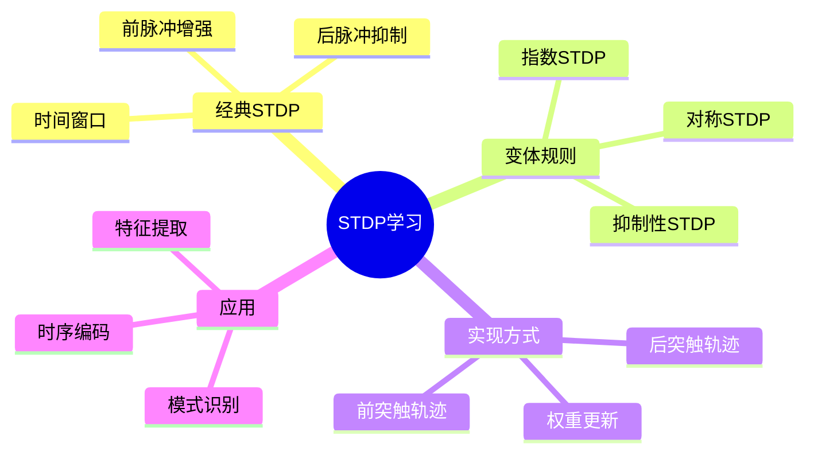

# STDP学习规则实现

> **层级定位**: 04 Industrial Scenarios / 08 Neuromorphic
> **对应标准**: 生物启发计算, Intel Loihi, BrainScaleS
> **难度级别**: L5 综合
> **预估学习时间**: 8-12 小时

---

## 📋 本节概要

| 属性 | 内容 |
|:-----|:-----|
| **核心概念** | STDP规则、突触可塑性、在线学习、权重更新 |
| **前置知识** | 脉冲神经网络、微分方程、嵌入式编程 |
| **后续延伸** | 三因子STDP、元可塑性、持续学习 |
| **权威来源** | Bi & Poo 1998, Morrison et al. 2008 |

---


---

## 📑 目录

- [STDP学习规则实现](#stdp学习规则实现)
  - [📋 本节概要](#-本节概要)
  - [📑 目录](#-目录)
  - [🧠 知识结构思维导图](#-知识结构思维导图)
  - [📖 核心概念详解](#-核心概念详解)
    - [1. STDP数学模型](#1-stdp数学模型)
    - [2. 轨迹追踪实现](#2-轨迹追踪实现)
    - [3. 完整学习网络](#3-完整学习网络)
    - [4. 模式识别应用](#4-模式识别应用)
  - [⚠️ 常见陷阱](#️-常见陷阱)
    - [陷阱 STDP01: 权重漂移](#陷阱-stdp01-权重漂移)
    - [陷阱 STDP02: 数值精度累积](#陷阱-stdp02-数值精度累积)
  - [✅ 质量验收清单](#-质量验收清单)


---

## 🧠 知识结构思维导图



---

## 📖 核心概念详解

### 1. STDP数学模型

```c
// ============================================================================
// STDP (Spike-Timing-Dependent Plasticity) 实现
// 生物启发的突触可塑性规则
// ============================================================================

#include <stdint.h>
#include <stdbool.h>
#include <math.h>
#include <stdlib.h>

// STDP参数
typedef struct {
    // 增强窗口 (pre before post)
    float A_plus;           // 最大增强量
    float tau_plus;         // 增强时间常数 (ms)

    // 抑制窗口 (post before pre)
    float A_minus;          // 最大抑制量
    float tau_minus;        // 抑制时间常数 (ms)

    // 权重约束
    float w_min;            // 最小权重
    float w_max;            // 最大权重

    // 学习率
    float learning_rate;

    // 权重依赖类型
    // 0 = 加性, 1 = 乘性, 2 = 幂律
    int weight_dependence;
    float mu;               // 幂律指数 (0=加性, 1=乘性)
} STDPParams;

// 经典STDP参数 (Bi & Poo 1998)
const STDPParams STDP_CLASSIC = {
    .A_plus = 0.01f,
    .tau_plus = 20.0f,
    .A_minus = -0.0105f,
    .tau_minus = 20.0f,
    .w_min = 0.0f,
    .w_max = 1.0f,
    .learning_rate = 1.0f,
    .weight_dependence = 0,
    .mu = 0.0f
};

// 对称STDP参数
const STDPParams STDP_SYMMETRIC = {
    .A_plus = 0.01f,
    .tau_plus = 20.0f,
    .A_minus = -0.01f,
    .tau_minus = 20.0f,
    .w_min = 0.0f,
    .w_max = 1.0f,
    .learning_rate = 1.0f,
    .weight_dependence = 1,
    .mu = 0.5f
};

// 计算STDP窗口函数
delta_w = {
    A_plus  * exp(-delta_t / tau_plus)   if delta_t > 0 (pre before post)
    A_minus * exp( delta_t / tau_minus)  if delta_t < 0 (post before pre)
}

// STDP权重变化计算
float stdp_weight_change(float delta_t_ms, const STDPParams *params) {
    if (delta_t_ms > 0.0f) {
        // pre在post之前: 增强 (LTP)
        return params->A_plus * expf(-delta_t_ms / params->tau_plus);
    } else if (delta_t_ms < 0.0f) {
        // post在pre之前: 抑制 (LTD)
        return params->A_minus * expf(delta_t_ms / params->tau_minus);
    }
    return 0.0f;
}
```

### 2. 轨迹追踪实现

```c
// ============================================================================
// 基于轨迹的STDP实现 (高效)
// ============================================================================

// 突触轨迹状态
typedef struct {
    float a_pre;            // 前突触活动轨迹
    float a_post;           // 后突触活动轨迹
    uint64_t last_pre_time; // 上次前脉冲时间 (us)
    uint64_t last_post_time;// 上次后脉冲时间 (us)
} STDPTrajectory;

// 带STDP的突触
typedef struct {
    float weight;
    float delay;
    STDPTrajectory traj;
    STDPParams params;
} STDPSynapse;

// 初始化STDP突触
void stdp_synapse_init(STDPSynapse *syn, float initial_weight,
                       const STDPParams *params) {
    syn->weight = initial_weight;
    syn->delay = 1.0f;
    syn->traj.a_pre = 0.0f;
    syn->traj.a_post = 0.0f;
    syn->traj.last_pre_time = 0;
    syn->traj.last_post_time = 0;
    syn->params = *params;
}

// 前突触脉冲到达
void stdp_pre_spike(STDPSynapse *syn, uint64_t current_time_us) {
    // 1. 更新前突触轨迹
    float dt_ms = (current_time_us - syn->traj.last_pre_time) / 1000.0f;
    if (syn->traj.last_pre_time > 0) {
        syn->traj.a_pre *= expf(-dt_ms / syn->params.tau_plus);
    }
    syn->traj.a_pre += 1.0f;  // 脉冲贡献
    syn->traj.last_pre_time = current_time_us;

    // 2. 基于后突触轨迹更新权重 (LTD)
    // 如果后神经元最近发放过，则抑制
    if (syn->traj.last_post_time > 0) {
        float dt_post_ms = (current_time_us - syn->traj.last_post_time) / 1000.0f;
        if (dt_post_ms < 5.0f * syn->params.tau_minus) {
            float dw = syn->params.A_minus * syn->traj.a_post;

            // 权重依赖
            if (syn->params.weight_dependence == 1) {
                // 乘性: 接近w_min时变化小
                dw *= (syn->weight - syn->params.w_min);
            } else if (syn->params.weight_dependence == 2) {
                // 幂律
                dw *= powf(syn->weight, syn->params.mu);
            }

            syn->weight += syn->params.learning_rate * dw;
        }
    }
}

// 后突触脉冲到达
void stdp_post_spike(STDPSynapse *syn, uint64_t current_time_us) {
    // 1. 更新后突触轨迹
    float dt_ms = (current_time_us - syn->traj.last_post_time) / 1000.0f;
    if (syn->traj.last_post_time > 0) {
        syn->traj.a_post *= expf(-dt_ms / syn->params.tau_minus);
    }
    syn->traj.a_post += 1.0f;
    syn->traj.last_post_time = current_time_us;

    // 2. 基于前突触轨迹更新权重 (LTP)
    if (syn->traj.last_pre_time > 0) {
        float dt_pre_ms = (current_time_us - syn->traj.last_pre_time) / 1000.0f;
        if (dt_pre_ms < 5.0f * syn->params.tau_plus) {
            float dw = syn->params.A_plus * syn->traj.a_pre;

            // 权重依赖
            if (syn->params.weight_dependence == 1) {
                // 乘性: 接近w_max时变化小
                dw *= (syn->params.w_max - syn->weight);
            } else if (syn->params.weight_dependence == 2) {
                dw *= powf(syn->params.w_max - syn->weight, syn->params.mu);
            }

            syn->weight += syn->params.learning_rate * dw;
        }
    }

    // 3. 限制权重范围
    if (syn->weight > syn->params.w_max) syn->weight = syn->params.w_max;
    if (syn->weight < syn->params.w_min) syn->weight = syn->params.w_min;
}

// 轨迹衰减 (定期调用)
void stdp_decay_trajectory(STDPSynapse *syn, float dt_ms) {
    syn->traj.a_pre *= expf(-dt_ms / syn->params.tau_plus);
    syn->traj.a_post *= expf(-dt_ms / syn->params.tau_minus);
}
```

### 3. 完整学习网络

```c
// ============================================================================
// STDP学习网络
// ============================================================================

#define MAX_STDP_NEURONS    256
#define MAX_STDP_SYNAPSES   1024

// STDP神经元 (带学习能力的LIF)
typedef struct {
    // LIF参数
    float v_mem;
    float v_rest;
    float v_thresh;
    float tau_m;

    // 状态
    bool spiked;
    uint64_t last_spike_time;
    uint32_t spike_count;

    // 输入突触索引列表
    uint16_t input_synapses[32];
    uint8_t num_input_syn;

    // 输出突触索引列表
    uint16_t output_synapses[32];
    uint8_t num_output_syn;
} STDPNeuron;

// STDP网络
typedef struct {
    STDPNeuron neurons[MAX_STDP_NEURONS];
    uint16_t num_neurons;

    STDPSynapse synapses[MAX_STDP_SYNAPSES];
    uint16_t num_synapses;

    // 学习开关
    bool learning_enabled;
    float current_time_ms;
} STDPNetwork;

// 初始化网络
void stdp_network_init(STDPNetwork *net) {
    memset(net, 0, sizeof(STDPNetwork));
    net->learning_enabled = true;
    net->current_time_ms = 0.0f;
}

// 添加神经元
int stdp_add_neuron(STDPNetwork *net, float v_rest, float v_thresh, float tau_m) {
    if (net->num_neurons >= MAX_STDP_NEURONS) return -1;

    STDPNeuron *n = &net->neurons[net->num_neurons];
    n->v_mem = v_rest;
    n->v_rest = v_rest;
    n->v_thresh = v_thresh;
    n->tau_m = tau_m;
    n->spiked = false;
    n->last_spike_time = 0;

    return net->num_neurons++;
}

// 添加STDP连接
int stdp_connect(STDPNetwork *net, int pre_idx, int post_idx,
                 float initial_weight, const STDPParams *params) {
    if (net->num_synapses >= MAX_STDP_SYNAPSES) return -1;

    int syn_idx = net->num_synapses;
    STDPSynapse *syn = &net->synapses[syn_idx];

    stdp_synapse_init(syn, initial_weight, params);

    // 注册到神经元
    STDPNeuron *pre = &net->neurons[pre_idx];
    STDPNeuron *post = &net->neurons[post_idx];

    pre->output_synapses[pre->num_output_syn++] = syn_idx;
    post->input_synapses[post->num_input_syn++] = syn_idx;

    net->num_synapses++;
    return syn_idx;
}

// 网络更新
void stdp_network_step(STDPNetwork *net, float dt_ms) {
    net->current_time_ms += dt_ms;
    uint64_t current_time_us = (uint64_t)(net->current_time_ms * 1000);

    // 1. 收集突触输入并更新膜电位
    for (int n = 0; n < net->num_neurons; n++) {
        STDPNeuron *neuron = &net->neurons[n];

        // 收集所有输入突触的电流
        float i_syn = 0.0f;
        for (int s = 0; s < neuron->num_input_syn; s++) {
            int syn_idx = neuron->input_synapses[s];
            STDPSynapse *syn = &net->synapses[syn_idx];

            // 这里简化处理，实际应有脉冲队列
            i_syn += syn->weight;
        }

        // 更新LIF
        float dv = (-(neuron->v_mem - neuron->v_rest) + i_syn) / neuron->tau_m;
        neuron->v_mem += dv * dt_ms;
        neuron->spiked = (neuron->v_mem >= neuron->v_thresh);

        if (neuron->spiked) {
            neuron->v_mem = neuron->v_rest;
            neuron->last_spike_time = current_time_us;
            neuron->spike_count++;
        }
    }

    // 2. STDP学习
    if (net->learning_enabled) {
        for (int n = 0; n < net->num_neurons; n++) {
            STDPNeuron *neuron = &net->neurons[n];

            if (neuron->spiked) {
                // 后突触脉冲: 触发LTP (输入突触增强)
                for (int s = 0; s < neuron->num_input_syn; s++) {
                    int syn_idx = neuron->input_synapses[s];
                    stdp_post_spike(&net->synapses[syn_idx], current_time_us);
                }

                // 触发LTD (输出突触抑制)
                for (int s = 0; s < neuron->num_output_syn; s++) {
                    int syn_idx = neuron->output_synapses[s];
                    stdp_pre_spike(&net->synapses[syn_idx], current_time_us);
                }
            }
        }
    }
}
```

### 4. 模式识别应用

```c
// ============================================================================
// STDP特征学习器
// ============================================================================

#define INPUT_SIZE      16
#define FEATURE_SIZE    8

// 竞争学习层
typedef struct {
    STDPNetwork net;
    int input_neurons[INPUT_SIZE];
    int feature_neurons[FEATURE_SIZE];
    float inhibition_strength;
} STDPFeatureLearner;

// 初始化特征学习器
void feature_learner_init(STDPFeatureLearner *learner) {
    stdp_network_init(&learner->net);

    STDPParams params = STDP_CLASSIC;
    params.w_max = 0.3f;
    params.A_plus = 0.02f;
    params.A_minus = -0.018f;

    // 创建输入神经元
    for (int i = 0; i < INPUT_SIZE; i++) {
        learner->input_neurons[i] = stdp_add_neuron(&learner->net, -70.0f, -55.0f, 20.0f);
    }

    // 创建特征神经元 (WTA竞争)
    for (int i = 0; i < FEATURE_SIZE; i++) {
        learner->feature_neurons[i] = stdp_add_neuron(&learner->net, -70.0f, -50.0f, 20.0f);

        // 连接到所有输入
        for (int j = 0; j < INPUT_SIZE; j++) {
            float w = 0.05f + ((float)rand() / RAND_MAX) * 0.05f;
            stdp_connect(&learner->net, learner->input_neurons[j],
                        learner->feature_neurons[i], w, &params);
        }
    }

    // 特征神经元间抑制 (WTA)
    STDPParams inh_params = {0};
    inh_params.w_min = -0.5f;
    inh_params.w_max = 0.0f;

    for (int i = 0; i < FEATURE_SIZE; i++) {
        for (int j = 0; j < FEATURE_SIZE; j++) {
            if (i != j) {
                stdp_connect(&learner->net, learner->feature_neurons[i],
                            learner->feature_neurons[j], -0.2f, &inh_params);
            }
        }
    }
}

// 训练步骤
void feature_learner_train(STDPFeatureLearner *learner,
                           const float *input_pattern, float dt_ms) {
    // 将输入模式转换为脉冲
    for (int i = 0; i < INPUT_SIZE; i++) {
        // 输入强度 -> 脉冲概率
        float spike_prob = input_pattern[i];
        if ((float)rand() / RAND_MAX < spike_prob) {
            STDPNeuron *n = &learner->net.neurons[learner->input_neurons[i]];
            n->v_mem = n->v_thresh + 1.0f;  // 强制发放
        }
    }

    // 网络更新
    stdp_network_step(&learner->net, dt_ms);
}

// 测试步骤
int feature_learner_infer(STDPFeatureLearner *learner,
                          const float *input_pattern, float dt_ms) {
    bool old_learning = learner->net.learning_enabled;
    learner->net.learning_enabled = false;

    // 重置脉冲计数
    for (int i = 0; i < FEATURE_SIZE; i++) {
        learner->net.neurons[learner->feature_neurons[i]].spike_count = 0;
    }

    // 运行一段时间
    for (int step = 0; step < 50; step++) {
        for (int i = 0; i < INPUT_SIZE; i++) {
            float spike_prob = input_pattern[i] * 0.3f;
            if ((float)rand() / RAND_MAX < spike_prob) {
                STDPNeuron *n = &learner->net.neurons[learner->input_neurons[i]];
                n->v_mem = n->v_thresh + 1.0f;
            }
        }
        stdp_network_step(&learner->net, dt_ms);
    }

    // 找发放最多的特征神经元
    int winner = 0;
    uint32_t max_spikes = 0;
    for (int i = 0; i < FEATURE_SIZE; i++) {
        uint32_t spikes = learner->net.neurons[learner->feature_neurons[i]].spike_count;
        if (spikes > max_spikes) {
            max_spikes = spikes;
            winner = i;
        }
    }

    learner->net.learning_enabled = old_learning;
    return winner;
}
```

---

## ⚠️ 常见陷阱

### 陷阱 STDP01: 权重漂移

```c
// ❌ 问题: 权重持续单向漂移，导致饱和
// LTP和LTD不平衡

// ✅ 解决: 平衡A_plus和A_minus
STDPParams balanced = {
    .A_plus = 0.01f,
    .A_minus = -0.009f,  // 略小，防止过度抑制
    // ...
};

// 或添加突触缩放
void synaptic_scaling(STDPNetwork *net, float target_rate) {
    for (int n = 0; n < net->num_neurons; n++) {
        float actual_rate = net->neurons[n].spike_count / simulation_time;
        float scale_factor = target_rate / actual_rate;

        for (int s = 0; s < net->neurons[n].num_input_syn; s++) {
            int syn_idx = net->neurons[n].input_synapses[s];
            net->synapses[syn_idx].weight *= scale_factor;
        }
    }
}
```

### 陷阱 STDP02: 数值精度累积

```c
// ❌ 问题: 浮点累积误差导致权重异常
syn->weight += dw;  // 多次小更新后精度丢失

// ✅ 解决: 定期归一化或使用定点数
// 或Kahan求和
float kahan_sum(float *values, int n) {
    float sum = 0.0f;
    float c = 0.0f;
    for (int i = 0; i < n; i++) {
        float y = values[i] - c;
        float t = sum + y;
        c = (t - sum) - y;
        sum = t;
    }
    return sum;
}
```

---

## ✅ 质量验收清单

| 检查项 | 要求 | 验证 |
|:-------|:-----|:-----|
| STDP曲线 | 符合生物数据 | 绘图对比 |
| 权重稳定 | 均值不漂移 | 统计检验 |
| 学习效果 | 可区分模式 | 分类准确率 |

---

> **更新记录**
>
> - 2025-03-09: 初版创建，包含STDP完整实现
