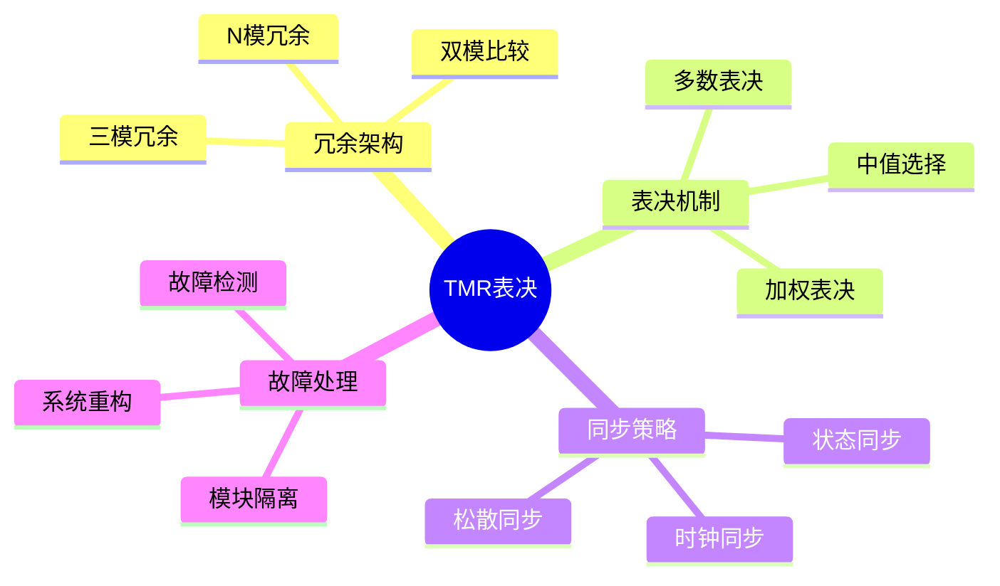

# 三模冗余(TMR)表决系统

> **层级定位**: 04 Industrial Scenarios / 09 Space Computing
> **对应标准**: NASA-STD-8739, ECSS-Q-ST-70-02C
> **难度级别**: L4 高级
> **预估学习时间**: 6-8 小时

---

## 📋 本节概要

| 属性 | 内容 |
|:-----|:-----|
| **核心概念** | 三模冗余、多数表决、同步机制、故障隔离 |
| **前置知识** | 容错系统、数字逻辑、可靠性工程 |
| **后续延伸** | NMR、自清除冗余、动态重构 |
| **权威来源** | NASA, ESA, IEEE Transactions on Reliability |

---

## 🧠 知识结构思维导图



---

## 📖 核心概念详解

### 1. TMR系统架构

```
┌─────────────────────────────────────────────────────────────────────┐
│                        TMR系统架构                                   │
├─────────────────────────────────────────────────────────────────────┤
│                                                                      │
│     输入                                                            │
│      │                                                              │
│      ├───► ┌─────────┐                                             │
│      │     │ Module A│ ─┐                                          │
│      │     └─────────┘  │                                          │
│      │                   │                                          │
│      ├───► ┌─────────┐  ├──► ┌─────────┐  ──► 输出                │
│      │     │ Module B│ ─┤    │ Voter   │                          │
│      │     └─────────┘  │    └─────────┘                          │
│      │                   │                                          │
│      └───► ┌─────────┐ ─┘                                          │
│            │ Module C│                                              │
│            └─────────┘                                              │
│                                                                      │
│   表决器类型:                                                        │
│   1. 多数表决: A=B≠C → 选A/B                                        │
│   2. 中值表决: 选中间值 (模拟信号)                                   │
│   3. 加权表决: 根据历史可靠性加权                                    │
│                                                                      │
└─────────────────────────────────────────────────────────────────────┘
```

### 2. 多数表决实现

```c
// ============================================================================
// TMR表决器实现
// ============================================================================

#include <stdint.h>
#include <stdbool.h>
#include <string.h>

// 表决结果
typedef enum {
    VOTE_AGREE = 0,         // 三模块一致
    VOTE_CORRECTED = 1,     // 两模块一致，第三模块故障
    VOTE_DISAGREE = -1,     // 三模块均不一致
    VOTE_MASKED = -2        // 故障被屏蔽
} VoteResult;

// 模块状态
typedef enum {
    MODULE_HEALTHY = 0,
    MODULE_SUSPECT = 1,
    MODULE_FAILED = 2
} ModuleStatus;

// TMR通道 (单个变量)
typedef struct {
    uint32_t value_a;
    uint32_t value_b;
    uint32_t value_c;
    uint32_t voted_value;
    VoteResult result;
    ModuleStatus status_a;
    ModuleStatus status_b;
    ModuleStatus status_c;
    uint32_t mismatch_count_a;
    uint32_t mismatch_count_b;
    uint32_t mismatch_count_c;
} TMRChannel32;

// 初始化TMR通道
void tmr_channel_init(TMRChannel32 *tmr) {
    tmr->value_a = 0;
    tmr->value_b = 0;
    tmr->value_c = 0;
    tmr->voted_value = 0;
    tmr->result = VOTE_AGREE;
    tmr->status_a = MODULE_HEALTHY;
    tmr->status_b = MODULE_HEALTHY;
    tmr->status_c = MODULE_HEALTHY;
    tmr->mismatch_count_a = 0;
    tmr->mismatch_count_b = 0;
    tmr->mismatch_count_c = 0;
}

// 多数表决 (32位)
VoteResult majority_vote_32(TMRChannel32 *tmr) {
    bool ab_match = (tmr->value_a == tmr->value_b);
    bool bc_match = (tmr->value_b == tmr->value_c);
    bool ac_match = (tmr->value_a == tmr->value_c);

    if (ab_match && bc_match) {
        // A = B = C
        tmr->voted_value = tmr->value_a;
        tmr->result = VOTE_AGREE;

        // 重置不匹配计数
        tmr->mismatch_count_a = 0;
        tmr->mismatch_count_b = 0;
        tmr->mismatch_count_c = 0;

        return VOTE_AGREE;
    }

    if (ab_match) {
        // A = B ≠ C
        tmr->voted_value = tmr->value_a;
        tmr->result = VOTE_CORRECTED;
        tmr->mismatch_count_c++;

        if (tmr->mismatch_count_c >= 3) {
            tmr->status_c = MODULE_FAILED;
        } else {
            tmr->status_c = MODULE_SUSPECT;
        }

        return VOTE_CORRECTED;
    }

    if (bc_match) {
        // B = C ≠ A
        tmr->voted_value = tmr->value_b;
        tmr->result = VOTE_CORRECTED;
        tmr->mismatch_count_a++;

        if (tmr->mismatch_count_a >= 3) {
            tmr->status_a = MODULE_FAILED;
        } else {
            tmr->status_a = MODULE_SUSPECT;
        }

        return VOTE_CORRECTED;
    }

    if (ac_match) {
        // A = C ≠ B
        tmr->voted_value = tmr->value_a;
        tmr->result = VOTE_CORRECTED;
        tmr->mismatch_count_b++;

        if (tmr->mismatch_count_b >= 3) {
            tmr->status_b = MODULE_FAILED;
        } else {
            tmr->status_b = MODULE_SUSPECT;
        }

        return VOTE_CORRECTED;
    }

    // 三者都不匹配
    tmr->result = VOTE_DISAGREE;

    // 选择"最健康"的模块
    if (tmr->status_a == MODULE_HEALTHY) {
        tmr->voted_value = tmr->value_a;
    } else if (tmr->status_b == MODULE_HEALTHY) {
        tmr->voted_value = tmr->value_b;
    } else if (tmr->status_c == MODULE_HEALTHY) {
        tmr->voted_value = tmr->value_c;
    } else {
        // 全部故障，选择历史最可靠的
        // 简化: 选择A
        tmr->voted_value = tmr->value_a;
    }

    return VOTE_DISAGREE;
}

// 写入TMR值 (来自各模块)
void tmr_write_values(TMRChannel32 *tmr, uint32_t val_a,
                      uint32_t val_b, uint32_t val_c) {
    tmr->value_a = val_a;
    tmr->value_b = val_b;
    tmr->value_c = val_c;

    majority_vote_32(tmr);
}

// 获取表决值
uint32_t tmr_read_voted(const TMRChannel32 *tmr) {
    return tmr->voted_value;
}

// 检查是否有模块故障
bool tmr_has_failure(const TMRChannel32 *tmr) {
    return (tmr->status_a == MODULE_FAILED ||
            tmr->status_b == MODULE_FAILED ||
            tmr->status_c == MODULE_FAILED);
}
```

### 3. TMR处理器状态

```c
// ============================================================================
// TMR处理器状态管理
// ============================================================================

#define TMR_STATE_SIZE  256     // 状态字数

// TMR处理器上下文
typedef struct {
    uint32_t state_a[TMR_STATE_SIZE];
    uint32_t state_b[TMR_STATE_SIZE];
    uint32_t state_c[TMR_STATE_SIZE];
    uint32_t voted_state[TMR_STATE_SIZE];

    TMRChannel32 pc;            // 程序计数器TMR
    TMRChannel32 flags;         // 标志寄存器TMR

    ModuleStatus module_status[3];
    uint32_t sync_counter;
    bool synchronized;
} TMRProcessor;

// 同步检查
bool tmr_check_sync(const TMRProcessor *proc) {
    // 检查PC是否一致
    bool pc_match = (proc->pc.value_a == proc->pc.value_b) &&
                    (proc->pc.value_b == proc->pc.value_c);

    // 检查关键状态是否一致
    bool state_match = true;
    for (int i = 0; i < 16; i++) {  // 检查前16个关键寄存器
        if (proc->state_a[i] != proc->state_b[i] ||
            proc->state_b[i] != proc->state_c[i]) {
            state_match = false;
            break;
        }
    }

    return pc_match && state_match;
}

// 表决整个状态
void tmr_vote_state(TMRProcessor *proc) {
    for (int i = 0; i < TMR_STATE_SIZE; i++) {
        TMRChannel32 channel;
        tmr_channel_init(&channel);

        channel.value_a = proc->state_a[i];
        channel.value_b = proc->state_b[i];
        channel.value_c = proc->state_c[i];

        majority_vote_32(&channel);
        proc->voted_state[i] = channel.voted_value;

        // 纠正偏离的模块
        if (channel.status_a == MODULE_FAILED) {
            proc->state_a[i] = channel.voted_value;
        }
        if (channel.status_b == MODULE_FAILED) {
            proc->state_b[i] = channel.voted_value;
        }
        if (channel.status_c == MODULE_FAILED) {
            proc->state_c[i] = channel.voted_value;
        }
    }
}

// 状态同步 (恢复偏离的模块)
void tmr_resynchronize(TMRProcessor *proc) {
    // 选择参考模块 (最健康的)
    int ref = 0;
    if (proc->module_status[0] != MODULE_HEALTHY) {
        ref = (proc->module_status[1] == MODULE_HEALTHY) ? 1 : 2;
    }

    // 将其他模块同步到参考模块
    for (int i = 0; i < 3; i++) {
        if (i != ref && proc->module_status[i] != MODULE_FAILED) {
            memcpy(proc->state_a + i * TMR_STATE_SIZE,
                   proc->state_a + ref * TMR_STATE_SIZE,
                   TMR_STATE_SIZE * sizeof(uint32_t));
            proc->module_status[i] = MODULE_HEALTHY;
        }
    }

    proc->synchronized = true;
}
```

### 4. 故障恢复

```c
// ============================================================================
// TMR故障恢复机制
// ============================================================================

// 故障日志
typedef struct {
    uint32_t timestamp;
    uint8_t failed_module;
    uint8_t error_type;
    uint32_t error_address;
} TMRFaultLog;

#define MAX_FAULT_LOG   16

typedef struct {
    TMRFaultLog logs[MAX_FAULT_LOG];
    uint8_t log_count;
    uint32_t total_faults;
} TMRDiagnostics;

// 记录故障
void tmr_log_fault(TMRDiagnostics *diag, uint8_t module,
                   uint8_t error_type, uint32_t address) {
    if (diag->log_count < MAX_FAULT_LOG) {
        TMRFaultLog *log = &diag->logs[diag->log_count++];
        log->timestamp = get_system_tick();
        log->failed_module = module;
        log->error_type = error_type;
        log->error_address = address;
    }
    diag->total_faults++;
}

// 尝试恢复故障模块
bool tmr_attempt_recovery(TMRProcessor *proc, uint8_t module) {
    if (module > 2) return false;

    // 1. 复位故障模块
    module_reset(module);

    // 2. 从健康模块复制状态
    int healthy = -1;
    for (int i = 0; i < 3; i++) {
        if (proc->module_status[i] == MODULE_HEALTHY) {
            healthy = i;
            break;
        }
    }

    if (healthy < 0) return false;  // 没有健康模块可恢复

    // 复制状态
    memcpy(proc->state_a + module * TMR_STATE_SIZE,
           proc->state_a + healthy * TMR_STATE_SIZE,
           TMR_STATE_SIZE * sizeof(uint32_t));

    // 3. 重新同步
    proc->module_status[module] = MODULE_HEALTHY;
    tmr_resynchronize(proc);

    return true;
}

// 降级到双模运行
void tmr_degrade_to_dual(TMRProcessor *proc) {
    // 找到两个健康模块
    int healthy[2];
    int h = 0;

    for (int i = 0; i < 3; i++) {
        if (proc->module_status[i] != MODULE_FAILED && h < 2) {
            healthy[h++] = i;
        }
    }

    if (h < 2) {
        // 只剩一个模块，进入安全模式
        enter_safe_mode();
        return;
    }

    // 使用双模比较
    // 不再能纠正错误，只能检测
    enable_dual_comparison(healthy[0], healthy[1]);
}
```

---

## ⚠️ 常见陷阱

### 陷阱 TMR01: 共模故障

```c
// ❌ 三模块相同时钟，时钟故障导致共同失效
// 所有模块同时出错，表决器无法检测

// ✅ 使用时钟多样性
// - 不同相位的时钟
// - 不同来源的时钟
// - 异步设计
```

### 陷阱 TMR02: 表决器单点故障

```c
// ❌ 表决器本身无保护
if (a == b || a == c) output = a;
else if (b == c) output = b;
// 表决器故障会导致系统失效

// ✅ 表决器也需要保护
// - 使用硬件表决电路
// - 表决器三模冗余
// - 自检机制
```

---

## ✅ 质量验收清单

| 检查项 | 要求 | 验证 |
|:-------|:-----|:-----|
| 单故障容错 | 100%单故障纠正 | 故障注入 |
| 同步性 | 周期内完成表决 | 时序分析 |
| 恢复时间 | <100ms | 测试 |

---

> **更新记录**
>
> - 2025-03-09: 初版创建，包含TMR表决系统完整实现
