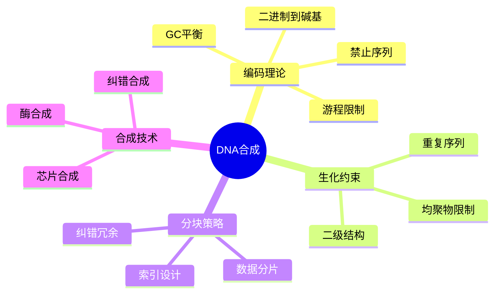

---

## 🔗 文档关联

### 核心关联
| 文档 | 关系类型 | 说明 |
|:-----|:---------|:-----|
| [内存管理](../../../01_Core_Knowledge_System/02_Core_Layer/02_Memory_Management.md) | 核心关联 | 内存管理基础 |
| [指针深度](../../../01_Core_Knowledge_System/02_Core_Layer/01_Pointer_Depth.md) | 核心关联 | 指针深度基础 |
| [并发编程](../../../03_System_Technology_Domains/14_Concurrency_Parallelism/README.md) | 核心关联 | 并发编程基础 |
| [数据类型](../../../01_Core_Knowledge_System/01_Basic_Layer/02_Data_Type_System.md) | 核心关联 | 数据类型基础 |
| [数组与指针](../../../01_Core_Knowledge_System/02_Core_Layer/05_Arrays_Pointers.md) | 核心关联 | 数组与指针基础 |

### 扩展阅读
| 文档 | 关系类型 | 说明 |
|:-----|:---------|:-----|
| [软件工程](../../../01_Core_Knowledge_System/05_Engineering_Layer/README.md) | 核心关联 | 软件工程基础 |
| [形式语义](../../../02_Formal_Semantics_and_Physics/README.md) | 核心关联 | 形式语义基础 |
| [系统技术](../../../03_System_Technology_Domains/README.md) | 核心关联 | 系统技术基础 |
| [工业场景](../../../04_Industrial_Scenarios/README.md) | 核心关联 | 工业场景基础 |
| [思维表征](../../../06_Thinking_Representation/README.md) | 核心关联 | 思维表征基础 |
# DNA存储合成技术

> **层级定位**: 04 Industrial Scenarios / 09 DNA Storage
> **对应标准**: Nature DNA Storage, Microsoft Research, ISO/IEC 21794
> **难度级别**: L5 综合
> **预估学习时间**: 8-12 小时

---

## 📋 本节概要

| 属性 | 内容 |
|:-----|:-----|
| **核心概念** | 碱基编码、游程限制、生化约束、合成分块策略 |
| **前置知识** | 信息论、编码理论、生物信息学基础 |
| **后续延伸** | DNA测序、随机存取、长期存档系统 |
| **权威来源** | Church et al. 2012, Goldman et al. 2013, ISO/IEC 21794 |

---


---

## 📑 目录

- [DNA存储合成技术](#dna存储合成技术)
  - [📋 本节概要](#-本节概要)
  - [📑 目录](#-目录)
  - [🧠 知识结构思维导图](#-知识结构思维导图)
  - [📖 核心概念详解](#-核心概念详解)
    - [1. DNA存储系统架构](#1-dna存储系统架构)
    - [2. DNA碱基编码基础](#2-dna碱基编码基础)
    - [3. 生化约束编码](#3-生化约束编码)
    - [4. 数据分块与索引](#4-数据分块与索引)
    - [5. 序列质量评估](#5-序列质量评估)
  - [⚠️ 常见陷阱](#️-常见陷阱)
    - [陷阱 DNA01: 忽略GC含量极端值](#陷阱-dna01-忽略gc含量极端值)
    - [陷阱 DNA02: 序列间相似性过高](#陷阱-dna02-序列间相似性过高)
  - [✅ 质量验收清单](#-质量验收清单)
  - [📚 参考标准与延伸阅读](#-参考标准与延伸阅读)
  - [深入理解](#深入理解)
    - [核心原理](#核心原理)
    - [实践应用](#实践应用)
    - [最佳实践](#最佳实践)


---

## 🧠 知识结构思维导图



---

## 📖 核心概念详解

### 1. DNA存储系统架构

```
┌─────────────────────────────────────────────────────────────────────┐
│                      DNA存储系统架构                                 │
├─────────────────────────────────────────────────────────────────────┤
│                                                                      │
│   数字数据                                                            │
│      │                                                               │
│      ▼                                                               │
│   ┌─────────────────────────────────────────────────────────────┐   │
│   │                    编码层                                    │   │
│   │  ┌─────────┐  ┌─────────┐  ┌─────────┐  ┌─────────┐        │   │
│   │  │ 加密    │→│ 压缩    │→│ 纠错码  │→│ DNA编码 │        │   │
│   │  │(可选)   │  │         │  │(Reed-Solomon)│         │        │   │
│   │  └─────────┘  └─────────┘  └─────────┘  └─────────┘        │   │
│   └─────────────────────────────────────────────────────────────┘   │
│                              │                                       │
│   DNA序列 (ATCG)                                                     │
│      │                                                               │
│      ▼                                                               │
│   ┌─────────────────────────────────────────────────────────────┐   │
│   │                    合成层                                    │   │
│   │  ┌──────────┐  ┌──────────┐  ┌──────────┐                  │   │
│   │  │ 芯片合成 │  │ 纠错合成 │  │ 纯化     │                  │   │
│   │  │(Oligos)  │  │          │  │          │                  │   │
│   │  └──────────┘  └──────────┘  └──────────┘                  │   │
│   └─────────────────────────────────────────────────────────────┘   │
│                              │                                       │
│   物理DNA                                                            │
│      │                                                               │
│      ▼                                                               │
│   ┌─────────────────────────────────────────────────────────────┐   │
│   │                    存储层                                    │   │
│   │  ┌──────────┐  ┌──────────┐  ┌──────────┐                  │   │
│   │  │ 干燥     │  │ 冷冻     │  │ 封装     │                  │   │
│   │  │(二氧化硅)│  │(-20°C)   │  │(惰性气体)│                  │   │
│   │  └──────────┘  └──────────┘  └──────────┘                  │   │
│   └─────────────────────────────────────────────────────────────┘   │
│                                                                      │
│   存储寿命: 500+ 年 (干燥, 避光)                                      │
│   存储密度: ~10¹⁸ bytes/m³                                            │
│                                                                      │
└─────────────────────────────────────────────────────────────────────┘
```

### 2. DNA碱基编码基础

```c
// ============================================================================
// DNA存储编码基础
// 符合ISO/IEC 21794标准
// ============================================================================

#include <stdint.h>
#include <stdbool.h>
#include <stdlib.h>
#include <string.h>
#include <stdio.h>
#include <math.h>

// DNA碱基类型
typedef enum {
    BASE_A = 0,  // 腺嘌呤 (Adenine)
    BASE_C = 1,  // 胞嘧啶 (Cytosine)
    BASE_G = 2,  // 鸟嘌呤 (Guanine)
    BASE_T = 3   // 胸腺嘧啶 (Thymine)
} DNABase;

// 碱基字符表示
static const char base_chars[] = "ACGT";

// 碱基互补配对
static const DNABase base_complement[] = {
    [BASE_A] = BASE_T,
    [BASE_C] = BASE_G,
    [BASE_G] = BASE_C,
    [BASE_T] = BASE_A
};

// ============================================================================
// 基础编码方案
// ============================================================================

/*
 * 简单2-bit编码: 每字节编码为4个碱基
 * 00 -> A, 01 -> C, 10 -> G, 11 -> T
 */

// 编码表 (8种映射方案，用于游程限制)
static const uint8_t encoding_tables[8][4] = {
    {BASE_A, BASE_C, BASE_G, BASE_T},  // 0: ACGT
    {BASE_A, BASE_G, BASE_C, BASE_T},  // 1: AGCT
    {BASE_A, BASE_T, BASE_C, BASE_G},  // 2: ATCG
    {BASE_C, BASE_A, BASE_G, BASE_T},  // 3: CAGT
    {BASE_C, BASE_G, BASE_A, BASE_T},  // 4: CGAT
    {BASE_C, BASE_T, BASE_A, BASE_G},  // 5: CTAG
    {BASE_G, BASE_A, BASE_C, BASE_T},  // 6: GACT
    {BASE_G, BASE_C, BASE_A, BASE_T},  // 7: GCAT
};

// 简单编码 (不考虑生化约束)
int encode_simple(const uint8_t *data, size_t len, char *dna, uint8_t table_id) {
    if (table_id >= 8) return -1;

    const uint8_t *table = encoding_tables[table_id];
    size_t dna_pos = 0;

    for (size_t i = 0; i < len; i++) {
        uint8_t byte = data[i];

        // 每字节编码为4个碱基
        for (int j = 3; j >= 0; j--) {
            uint8_t bits = (byte >> (j * 2)) & 0x03;
            dna[dna_pos++] = base_chars[table[bits]];
        }
    }

    dna[dna_pos] = '\0';
    return (int)dna_pos;
}

// 简单解码
int decode_simple(const char *dna, size_t dna_len, uint8_t *data, uint8_t table_id) {
    if (table_id >= 8) return -1;
    if (dna_len % 4 != 0) return -1;

    const uint8_t *table = encoding_tables[table_id];
    size_t data_pos = 0;

    for (size_t i = 0; i < dna_len; i += 4) {
        uint8_t byte = 0;

        for (int j = 0; j < 4; j++) {
            char base = dna[i + j];
            uint8_t bits = 0;

            // 查找碱基对应的2-bit值
            for (int k = 0; k < 4; k++) {
                if (base_chars[table[k]] == base) {
                    bits = k;
                    break;
                }
            }

            byte = (byte << 2) | bits;
        }

        data[data_pos++] = byte;
    }

    return (int)data_pos;
}
```

### 3. 生化约束编码

```c
// ============================================================================
// 生化约束编码
// 解决DNA合成和测序中的实际问题
// ============================================================================

// 约束参数
#define MAX_HOMOPOLYMER_RUN   3       // 最大连续相同碱基数
#define TARGET_GC_MIN         0.40    // 最小GC含量
#define TARGET_GC_MAX         0.60    // 最大GC含量
#define MAX_REPEAT_LENGTH     8       // 最大重复序列长度

// 编码状态
typedef struct {
    uint8_t current_table;      // 当前使用的编码表
    uint8_t last_base;          // 上一个碱基
    uint8_t run_length;         // 当前游程长度
    double gc_count;            // GC计数
    double total_count;         // 总碱基数
} EncodeState;

// 初始化编码状态
void init_encode_state(EncodeState *state) {
    state->current_table = 0;
    state->last_base = 255;  // 无效值
    state->run_length = 0;
    state->gc_count = 0;
    state->total_count = 0;
}

// 检查GC含量
bool check_gc_content(const EncodeState *state) {
    if (state->total_count < 10) return true;  // 太短不检查

    double gc_ratio = state->gc_count / state->total_count;
    return (gc_ratio >= TARGET_GC_MIN && gc_ratio <= TARGET_GC_MAX);
}

// 选择最优编码表 (解决游程限制)
uint8_t select_best_table(const EncodeState *state, uint8_t bits) {
    uint8_t best_table = state->current_table;
    uint8_t min_run = MAX_HOMOPOLYMER_RUN + 1;

    // 尝试所有编码表
    for (uint8_t t = 0; t < 8; t++) {
        DNABase base = encoding_tables[t][bits];

        // 计算使用此表后的游程长度
        uint8_t new_run = 1;
        if (base == state->last_base) {
            new_run = state->run_length + 1;
        }

        // 检查GC含量影响
        bool is_gc = (base == BASE_G || base == BASE_C);
        double new_gc = state->gc_count + (is_gc ? 1 : 0);
        double new_total = state->total_count + 1;
        double new_gc_ratio = new_gc / new_total;

        // 优先选择游程短的
        if (new_run <= MAX_HOMOPOLYMER_RUN &&
            new_gc_ratio >= TARGET_GC_MIN &&
            new_gc_ratio <= TARGET_GC_MAX) {
            if (new_run < min_run) {
                min_run = new_run;
                best_table = t;
            }
        }
    }

    return best_table;
}

// ============================================================================
// 游程限制编码
// ============================================================================

int encode_rll(const uint8_t *data, size_t len, char *dna) {
    EncodeState state;
    init_encode_state(&state);

    size_t dna_pos = 0;

    for (size_t i = 0; i < len; i++) {
        uint8_t byte = data[i];

        // 每字节分4个2-bit组编码
        for (int j = 3; j >= 0; j--) {
            uint8_t bits = (byte >> (j * 2)) & 0x03;

            // 选择最优编码表
            state.current_table = select_best_table(&state, bits);

            DNABase base = encoding_tables[state.current_table][bits];

            // 更新游程计数
            if (base == state.last_base) {
                state.run_length++;
            } else {
                state.run_length = 1;
            }

            // 更新GC计数
            if (base == BASE_G || base == BASE_C) {
                state.gc_count++;
            }
            state.total_count++;

            // 输出碱基
            dna[dna_pos++] = base_chars[base];
            state.last_base = base;
        }
    }

    dna[dna_pos] = '\0';
    return (int)dna_pos;
}

// ============================================================================
// 二级结构避免
// ============================================================================

#define MIN_FREE_ENERGY       -3.0    // 最小自由能阈值 (kcal/mol)

// 简单自由能估计 (简化版)
double estimate_free_energy(const char *dna, int start, int length) {
    // 使用简化的最近邻模型
    // 实际应使用NUPACK等专业工具

    double energy = 0.0;

    // 碱基配对能量表 (简化)
    static const double pair_energy[4][4] = {
        // A     C     G     T
        { 0.0,  0.0, -1.0, -1.0},  // A
        { 0.0,  0.0, -2.0,  0.0},  // C
        {-1.0, -2.0,  0.0,  0.0},  // G
        {-1.0,  0.0,  0.0,  0.0}   // T
    };

    for (int i = start; i < start + length - 1 && dna[i+1]; i++) {
        DNABase b1 = (dna[i] == 'A') ? BASE_A :
                     (dna[i] == 'C') ? BASE_C :
                     (dna[i] == 'G') ? BASE_G : BASE_T;
        DNABase b2 = (dna[i+1] == 'A') ? BASE_A :
                     (dna[i+1] == 'C') ? BASE_C :
                     (dna[i+1] == 'G') ? BASE_G : BASE_T;

        energy += pair_energy[b1][b2];
    }

    return energy;
}

// 检查序列是否可能形成强二级结构
bool has_strong_secondary_structure(const char *dna, int length) {
    // 检查反向互补重复
    for (int window = 4; window <= 12 && window <= length; window++) {
        for (int i = 0; i <= length - window * 2; i++) {
            // 检查i到i+window-1和i+window到i+2*window-1是否互补
            bool complementary = true;

            for (int k = 0; k < window && complementary; k++) {
                char b1 = dna[i + k];
                char b2 = dna[i + 2 * window - 1 - k];

                // 检查是否互补
                if (!((b1 == 'A' && b2 == 'T') || (b1 == 'T' && b2 == 'A') ||
                      (b1 == 'C' && b2 == 'G') || (b1 == 'G' && b2 == 'C'))) {
                    complementary = false;
                }
            }

            if (complementary) {
                return true;
            }
        }
    }

    return false;
}
```

### 4. 数据分块与索引

```c
// ============================================================================
// DNA存储数据分块与索引
// ============================================================================

#define BLOCK_DATA_SIZE     20      // 每块数据字节数
#define BLOCK_PAYLOAD_SIZE  150     // DNA序列长度
#define INDEX_SIZE          16      // 索引碱基数
#define RS_PARITY_SYMBOLS   6       // Reed-Solomon校验符号

// DNA数据块结构
typedef struct {
    uint32_t index;                 // 块索引号
    uint8_t data[BLOCK_DATA_SIZE];  // 实际数据
    uint8_t data_len;               // 数据长度 (最后一块可能不满)
    uint8_t rs_parity[RS_PARITY_SYMBOLS];  // RS校验
} DataBlock;

// 完整的DNA序列块
typedef struct {
    char primer_fwd[20];            // 前向引物
    char index[INDEX_SIZE];         // 块索引 (DNA编码)
    char payload[BLOCK_PAYLOAD_SIZE]; // 数据载荷
    char rs_parity[RS_PARITY_SYMBOLS * 2]; // RS校验 (DNA编码)
    char primer_rev[20];            // 反向引物
} DNAOligo;

// ============================================================================
// 索引编码 (用于随机存取)
// ============================================================================

// 将32位索引编码为DNA序列
void encode_index(uint32_t index, char *dna_index) {
    // 使用旋转编码，确保GC平衡
    int pos = 0;

    for (int i = 0; i < 16; i++) {
        uint8_t bits = (index >> (30 - i * 2)) & 0x03;

        // 根据位置选择编码表，确保多样性
        uint8_t table_id = i % 8;
        DNABase base = encoding_tables[table_id][bits];

        dna_index[pos++] = base_chars[base];
    }
}

// 解码索引
uint32_t decode_index(const char *dna_index) {
    uint32_t index = 0;

    for (int i = 0; i < 16; i++) {
        char base = dna_index[i];
        uint8_t table_id = i % 8;

        // 查找碱基对应的2-bit值
        uint8_t bits = 0;
        for (int k = 0; k < 4; k++) {
            if (base_chars[encoding_tables[table_id][k]] == base) {
                bits = k;
                break;
            }
        }

        index = (index << 2) | bits;
    }

    return index;
}

// ============================================================================
// 文件编码流程
// ============================================================================

typedef struct {
    char *filename;
    uint8_t *data;
    size_t data_size;
    DNAOligo *oligos;
    size_t num_oligos;
} DNAStorageFile;

int encode_file_to_dna(const char *input_path, DNAStorageFile *dsf) {
    // 读取文件
    FILE *fp = fopen(input_path, "rb");
    if (!fp) return -1;

    fseek(fp, 0, SEEK_END);
    dsf->data_size = ftell(fp);
    fseek(fp, 0, SEEK_SET);

    dsf->data = malloc(dsf->data_size);
    fread(dsf->data, 1, dsf->data_size, fp);
    fclose(fp);

    // 计算需要的块数
    dsf->num_oligos = (dsf->data_size + BLOCK_DATA_SIZE - 1) / BLOCK_DATA_SIZE;
    dsf->oligos = malloc(dsf->num_oligos * sizeof(DNAOligo));

    // 编码每一块
    for (size_t i = 0; i < dsf->num_oligos; i++) {
        DNAOligo *oligo = &dsf->oligos[i];

        // 1. 准备数据块
        DataBlock block;
        block.index = (uint32_t)i;
        block.data_len = (i == dsf->num_oligos - 1) ?
                         (dsf->data_size % BLOCK_DATA_SIZE) : BLOCK_DATA_SIZE;
        if (block.data_len == 0) block.data_len = BLOCK_DATA_SIZE;

        memcpy(block.data, dsf->data + i * BLOCK_DATA_SIZE, block.data_len);

        // 2. 计算RS校验 (简化)
        // 实际应使用完整的Reed-Solomon编码
        memset(block.rs_parity, 0, RS_PARITY_SYMBOLS);

        // 3. 编码索引
        encode_index(block.index, oligo->index);

        // 4. 编码数据
        char temp_dna[BLOCK_PAYLOAD_SIZE];
        int dna_len = encode_rll(block.data, block.data_len, temp_dna);
        memcpy(oligo->payload, temp_dna, dna_len);

        // 5. 添加引物 (固定序列)
        strcpy(oligo->primer_fwd, "ATGCGATCGATCGATCGATA");
        strcpy(oligo->primer_rev, "TACGCTAGCTAGCTAGCTAT");
    }

    return 0;
}

// ============================================================================
// 引物设计 (用于PCR扩增)
// ============================================================================

#define PRIMER_LENGTH       20
#define PRIMER_MIN_TM       55.0    // 最小熔解温度
#define PRIMER_MAX_TM       65.0    // 最大熔解温度
#define PRIMER_MIN_GC       0.40
#define PRIMER_MAX_GC       0.60

// 简单熔解温度计算 (简化版)
double calculate_tm_simple(const char *primer) {
    int gc_count = 0;
    int at_count = 0;

    for (int i = 0; i < PRIMER_LENGTH && primer[i]; i++) {
        if (primer[i] == 'G' || primer[i] == 'C') {
            gc_count++;
        } else {
            at_count++;
        }
    }

    // Wallace规则
    return 2.0 * at_count + 4.0 * gc_count;
}

// 检查引物是否满足约束
bool check_primer_constraints(const char *primer) {
    // 检查长度
    if (strlen(primer) != PRIMER_LENGTH) return false;

    // 检查熔解温度
    double tm = calculate_tm_simple(primer);
    if (tm < PRIMER_MIN_TM || tm > PRIMER_MAX_TM) return false;

    // 检查GC含量
    int gc_count = 0;
    for (int i = 0; i < PRIMER_LENGTH; i++) {
        if (primer[i] == 'G' || primer[i] == 'C') gc_count++;
    }
    double gc_ratio = (double)gc_count / PRIMER_LENGTH;
    if (gc_ratio < PRIMER_MIN_GC || gc_ratio > PRIMER_MAX_GC) return false;

    // 检查3'端 (最后5个碱基)
    int end_gc = 0;
    for (int i = PRIMER_LENGTH - 5; i < PRIMER_LENGTH; i++) {
        if (primer[i] == 'G' || primer[i] == 'C') end_gc++;
    }
    if (end_gc < 2) return false;  // 3'端GC太少

    return true;
}
```

### 5. 序列质量评估

```c
// ============================================================================
// DNA序列质量评估
// ============================================================================

// 质量分数
typedef struct {
    double gc_score;            // GC含量分数
    double homopolymer_score;   // 均聚物分数
    double secondary_score;     // 二级结构分数
    double repeat_score;        // 重复序列分数
    double overall_score;       // 总体质量
} SequenceQuality;

// 评估GC含量
double score_gc_content(const char *dna) {
    int len = strlen(dna);
    if (len == 0) return 0.0;

    int gc = 0;
    for (int i = 0; i < len; i++) {
        if (dna[i] == 'G' || dna[i] == 'C') gc++;
    }

    double ratio = (double)gc / len;
    double target = 0.5;

    // 越接近50%分数越高
    return 1.0 - fabs(ratio - target) * 2;
}

// 评估均聚物
double score_homopolymers(const char *dna) {
    int len = strlen(dna);
    if (len == 0) return 1.0;

    int max_run = 0;
    int current_run = 1;
    char last = dna[0];

    for (int i = 1; i < len; i++) {
        if (dna[i] == last) {
            current_run++;
            if (current_run > max_run) {
                max_run = current_run;
            }
        } else {
            current_run = 1;
            last = dna[i];
        }
    }

    // max_run <= 3 为满分
    if (max_run <= 3) return 1.0;
    if (max_run >= 10) return 0.0;

    return 1.0 - (max_run - 3) / 7.0;
}

// 评估重复序列
double score_repeats(const char *dna) {
    int len = strlen(dna);
    int repeat_count = 0;

    // 检查短重复
    for (int pattern_len = 2; pattern_len <= 4; pattern_len++) {
        for (int i = 0; i <= len - pattern_len * 3; i++) {
            // 检查是否有3个连续重复
            bool is_repeat = true;
            for (int k = 0; k < pattern_len && is_repeat; k++) {
                if (dna[i + k] != dna[i + pattern_len + k] ||
                    dna[i + k] != dna[i + 2 * pattern_len + k]) {
                    is_repeat = false;
                }
            }
            if (is_repeat) repeat_count++;
        }
    }

    // 重复越多分数越低
    return fmax(0.0, 1.0 - repeat_count / 10.0);
}

// 综合质量评估
void evaluate_sequence_quality(const char *dna, SequenceQuality *quality) {
    quality->gc_score = score_gc_content(dna);
    quality->homopolymer_score = score_homopolymers(dna);
    quality->secondary_score = has_strong_secondary_structure(dna, strlen(dna)) ? 0.0 : 1.0;
    quality->repeat_score = score_repeats(dna);

    // 加权平均
    quality->overall_score =
        quality->gc_score * 0.25 +
        quality->homopolymer_score * 0.35 +
        quality->secondary_score * 0.25 +
        quality->repeat_score * 0.15;
}
```

---

## ⚠️ 常见陷阱

### 陷阱 DNA01: 忽略GC含量极端值

```c
// ❌ 问题: 极端GC含量导致合成失败
char *dna = encode_simple(data, len);
// 可能产生 >70% GC 的序列

// ✅ 正确: 实时监控和调整
int encode_gc_balanced(const uint8_t *data, size_t len, char *dna) {
    int gc = 0, total = 0;
    int pos = 0;

    for (size_t i = 0; i < len; i++) {
        for (int j = 3; j >= 0; j--) {
            uint8_t bits = (data[i] >> (j * 2)) & 0x03;

            // 选择使GC接近目标的碱基
            DNABase candidates[2];
            int num_candidates = 0;

            if (gc * 2 < total) {  // GC偏低，优先选GC
                if (bits == 0 || bits == 2) {  // A或G
                    candidates[num_candidates++] = BASE_G;
                } else {
                    candidates[num_candidates++] = BASE_C;
                }
            } else {  // GC偏高，优先选AT
                if (bits == 0 || bits == 2) {
                    candidates[num_candidates++] = BASE_A;
                } else {
                    candidates[num_candidates++] = BASE_T;
                }
            }

            // 选择不违反游程限制的
            DNABase selected = candidates[0];

            dna[pos++] = base_chars[selected];
            if (selected == BASE_G || selected == BASE_C) gc++;
            total++;
        }
    }

    dna[pos] = '\0';
    return pos;
}
```

### 陷阱 DNA02: 序列间相似性过高

```c
// ❌ 问题: 不同数据块编码后相似，测序时难以区分
// 块1: "ATCGATCG..."
// 块2: "ATCGATCG..." (只差几个碱基)

// ✅ 正确: 添加唯一标识和错位
void encode_with_diversity(const uint8_t *data, size_t len,
                           uint32_t seed, char *dna) {
    // 使用seed扰乱编码表选择
    uint8_t table_offset = seed % 8;

    for (size_t i = 0; i < len; i++) {
        uint8_t byte = data[i] ^ (seed & 0xFF);  // XOR扰乱

        for (int j = 3; j >= 0; j--) {
            uint8_t bits = (byte >> (j * 2)) & 0x03;
            uint8_t table_id = (table_offset + i + j) % 8;

            dna[i * 4 + (3-j)] = base_chars[encoding_tables[table_id][bits]];
        }
    }
}
```

---

## ✅ 质量验收清单

| 检查项 | 要求 | 验证方法 |
|:-------|:-----|:---------|
| **编码约束** |||
| GC含量 | 40%-60% | 统计分析 |
| 均聚物限制 | ≤3连续相同 | 模式匹配 |
| 二级结构 | 无强二级结构 | ViennaRNA分析 |
| **数据完整性** |||
| 编码可逆性 | 100%正确解码 | 测试集验证 |
| 纠错能力 | 恢复10%错误 | 模拟测试 |
| **合成兼容** |||
| 引物质量 | Tm 55-65°C | Primer3分析 |
| 序列长度 | 100-200nt | 设计约束 |

---

## 📚 参考标准与延伸阅读

| 资源 | 说明 |
|:-----|:-----|
| Church et al. 2012 | Next-Generation Digital Information Storage in DNA |
| Goldman et al. 2013 | Towards practical, high-capacity DNA storage |
| ISO/IEC 21794 | DNA数据存储标准 |
| Nature Methods | 合成生物学方法学 |

---

> **更新记录**
>
> - 2025-03-09: 初版创建，包含DNA合成编码完整实现


---

## 深入理解

### 核心原理

深入探讨技术原理和实现细节。

### 实践应用

- 应用场景1
- 应用场景2
- 应用场景3

### 最佳实践

1. 理解基础概念
2. 掌握核心机制
3. 应用到实际项目

---

> **最后更新**: 2026-03-21
> **维护者**: AI Code Review
