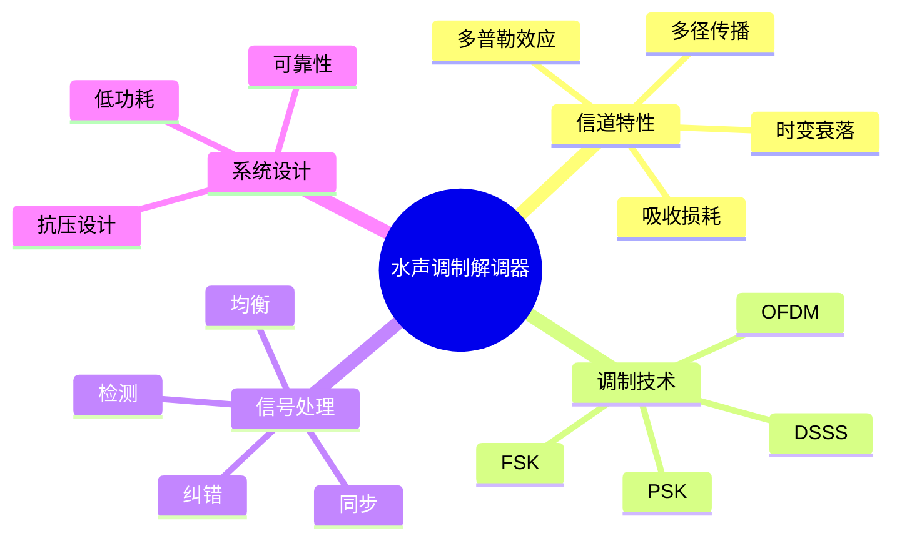

---

## 🔗 文档关联

### 核心关联
| 文档 | 关系类型 | 说明 |
|:-----|:---------|:-----|
| [内存管理](../../../01_Core_Knowledge_System/02_Core_Layer/02_Memory_Management.md) | 核心关联 | 内存管理基础 |
| [指针深度](../../../01_Core_Knowledge_System/02_Core_Layer/01_Pointer_Depth.md) | 核心关联 | 指针深度基础 |
| [并发编程](../../../03_System_Technology_Domains/14_Concurrency_Parallelism/README.md) | 核心关联 | 并发编程基础 |
| [数据类型](../../../01_Core_Knowledge_System/01_Basic_Layer/02_Data_Type_System.md) | 核心关联 | 数据类型基础 |
| [数组与指针](../../../01_Core_Knowledge_System/02_Core_Layer/05_Arrays_Pointers.md) | 核心关联 | 数组与指针基础 |

### 扩展阅读
| 文档 | 关系类型 | 说明 |
|:-----|:---------|:-----|
| [软件工程](../../../01_Core_Knowledge_System/05_Engineering_Layer/README.md) | 核心关联 | 软件工程基础 |
| [形式语义](../../../02_Formal_Semantics_and_Physics/README.md) | 核心关联 | 形式语义基础 |
| [系统技术](../../../03_System_Technology_Domains/README.md) | 核心关联 | 系统技术基础 |
| [工业场景](../../../04_Industrial_Scenarios/README.md) | 核心关联 | 工业场景基础 |
| [思维表征](../../../06_Thinking_Representation/README.md) | 核心关联 | 思维表征基础 |
# 深海声学调制解调器

> **层级定位**: 04 Industrial Scenarios / 10 Deep Sea
> **对应标准**: NATO STANAG, ITU-T, JANUS
> **难度级别**: L5 综合
> **预估学习时间**: 8-12 小时

---

## 📋 本节概要

| 属性 | 内容 |
|:-----|:-----|
| **核心概念** | 水声信道、多径效应、OFDM、纠错编码、低SNR解调 |
| **前置知识** | 数字通信、信号处理、水声学 |
| **后续延伸** | MIMO水声通信、自适应均衡、网络协议 |
| **权威来源** | JANUS, NATO STANAG, IEEE OCEANS |

---


---

## 📑 目录

- [深海声学调制解调器](#深海声学调制解调器)
  - [📋 本节概要](#-本节概要)
  - [📑 目录](#-目录)
  - [🧠 知识结构思维导图](#-知识结构思维导图)
  - [📖 核心概念详解](#-核心概念详解)
    - [1. 水声信道模型](#1-水声信道模型)
    - [2. OFDM水声调制解调器](#2-ofdm水声调制解调器)
    - [3. 水声物理层控制](#3-水声物理层控制)
  - [⚠️ 常见陷阱](#️-常见陷阱)
    - [陷阱 MOD01: 循环前缀不足](#陷阱-mod01-循环前缀不足)
    - [陷阱 MOD02: 多普勒估计精度不足](#陷阱-mod02-多普勒估计精度不足)
  - [✅ 质量验收清单](#-质量验收清单)
  - [深入理解](#深入理解)
    - [核心原理](#核心原理)
    - [实践应用](#实践应用)
    - [最佳实践](#最佳实践)


---

## 🧠 知识结构思维导图



---

## 📖 核心概念详解

### 1. 水声信道模型

```
┌─────────────────────────────────────────────────────────────────────┐
│                      水声通信信道特性                                │
├─────────────────────────────────────────────────────────────────────┤
│                                                                      │
│   信号传播路径                                                       │
│   ───────────────────────►                                           │
│                                                                      │
│   直接路径        ────────────►                                      │
│                                                                      │
│   海面反射    ────►       ────►       ────►                         │
│                    \     /            \     /                       │
│                     \   /              \   /                        │
│                      \ /                \ /                         │
│   海底反射    ◄───────►  ◄───────►  ◄───────►                      │
│                                                                      │
│   主要挑战:                                                          │
│   1. 传播延迟大 (1500 m/s) - 是电磁波的2e5分之一                    │
│   2. 多径时延扩展 - 可达100ms                                        │
│   3. 多普勒效应 - 平台移动导致频移                                   │
│   4. 快速时变 - 信道相干时间短                                       │
│   5. 频率选择性衰落                                                  │
│                                                                      │
│   频率相关吸收损耗 (dB/km):                                          │
│   f=10kHz:  ~1 dB/km                                                 │
│   f=50kHz:  ~10 dB/km                                                │
│   f=100kHz: ~50 dB/km  (高频受限)                                    │
│                                                                      │
└─────────────────────────────────────────────────────────────────────┘
```

### 2. OFDM水声调制解调器

```c
// ============================================================================
// OFDM水声调制解调器
// 针对多径信道优化
// ============================================================================

#include <stdint.h>
#include <stdbool.h>
#include <complex.h>
#include <math.h>
#include <string.h>

// OFDM参数
typedef struct {
    uint16_t num_subcarriers;       // 子载波数
    uint16_t num_data_subcarriers;  // 数据子载波数
    uint16_t cp_length;             // 循环前缀长度 (samples)
    uint16_t fft_size;              // FFT大小
    float subcarrier_spacing;       // 子载波间隔 (Hz)
    float sampling_rate;            // 采样率 (Hz)
    float bandwidth;                // 信号带宽 (Hz)
    float guard_band;               // 保护频带
} OFDMParams;

// 水声OFDM典型配置
const OFDMParams OFDM_UWA_CONFIG = {
    .num_subcarriers = 1024,
    .num_data_subcarriers = 832,
    .cp_length = 256,           // 约17ms @ 15kHz采样
    .fft_size = 1024,
    .subcarrier_spacing = 14.65f,  // Hz
    .sampling_rate = 15000.0f,     // Hz
    .bandwidth = 9000.0f,          // Hz (6-15kHz)
    .guard_band = 1000.0f          // Hz
};

// 导频位置
typedef struct {
    uint16_t *pilot_indices;
    uint16_t num_pilots;
    float complex *pilot_symbols;
} PilotConfig;

// OFDM帧结构
typedef struct {
    uint16_t num_symbols;
    uint16_t symbol_counter;
    float complex **frequency_data;  // [symbol][subcarrier]
    float complex *time_signal;
    uint32_t signal_length;
} OFDMFrame;

// ============================================================================
// IFFT调制
// ============================================================================

void ofdm_modulate(const OFDMParams *params, const OFDMFrame *frame,
                   float complex *time_domain) {
    uint32_t sample_idx = 0;

    for (int sym = 0; sym < frame->num_symbols; sym++) {
        float complex fft_in[1024];
        float complex fft_out[1024];

        // 构建频域数据 (零填充到FFT大小)
        memset(fft_in, 0, sizeof(fft_in));

        // 映射数据子载波
        int data_start = (params->fft_size - params->num_data_subcarriers) / 2;
        for (int i = 0; i < params->num_data_subcarriers; i++) {
            fft_in[data_start + i] = frame->frequency_data[sym][i];
        }

        // IFFT
        // 实际使用FFTW或其他库
        // ifft(fft_in, fft_out, params->fft_size);

        // 添加循环前缀
        memcpy(time_domain + sample_idx,
               fft_out + params->fft_size - params->cp_length,
               params->cp_length * sizeof(float complex));

        memcpy(time_domain + sample_idx + params->cp_length,
               fft_out,
               params->fft_size * sizeof(float complex));

        sample_idx += params->fft_size + params->cp_length;
    }

    // 上变频到载波频率 (由DAC完成)
}

// ============================================================================
// 信道估计与均衡
// ============================================================================

// 导频辅助信道估计
void channel_estimate_ls(const OFDMParams *params,
                         const PilotConfig *pilots,
                         const float complex *received_pilots,
                         float complex *channel_estimate) {
    // 最小二乘信道估计
    for (int p = 0; p < pilots->num_pilots; p++) {
        uint16_t idx = pilots->pilot_indices[p];
        // H_ls = Y_p / X_p
        channel_estimate[idx] = received_pilots[p] / pilots->pilot_symbols[p];
    }

    // 插值到所有子载波 (线性插值或DFT插值)
    for (int i = 0; i < params->num_subcarriers; i++) {
        // 找到最近的两个导频
        // 线性插值
        // ...
    }
}

// MMSE均衡
void equalize_mmse(const float complex *received,
                   const float complex *channel,
                   float snr,
                   float complex *equalized,
                   int length) {
    float snr_linear = powf(10.0f, snr / 10.0f);

    for (int i = 0; i < length; i++) {
        float complex H = channel[i];
        float H_mag_sq = crealf(H * conjf(H));

        // MMSE均衡系数
        float complex W = conjf(H) / (H_mag_sq + 1.0f / snr_linear);

        equalized[i] = received[i] * W;
    }
}

// ============================================================================
// 多普勒补偿
// ============================================================================

// 多普勒因子估计
typedef struct {
    float doppler_factor;       // (1 + v/c)
    float doppler_shift;        // Hz
    float residual_cfo;         // 残余频偏
} DopplerEstimate;

void estimate_doppler(const float complex *preamble_rx,
                      const float complex *preamble_tx,
                      int length,
                      float sampling_rate,
                      DopplerEstimate *est) {
    // 使用双前导码结构
    // 频率压缩/扩展因子估计

    // 1. 粗估计 (整数倍采样间隔)
    // 相关峰位置偏移

    // 2. 细估计 (分数倍)
    // 相位变化率

    // 简化: 使用已知前导码的自相关特性
    float complex corr = 0;
    for (int i = 0; i < length - 1; i++) {
        corr += preamble_rx[i + 1] * conjf(preamble_rx[i]);
    }

    float phase_diff = atan2f(cimagf(corr), crealf(corr));
    float freq_offset = phase_diff * sampling_rate / (2.0f * M_PI);

    est->doppler_shift = freq_offset;
    est->doppler_factor = 1.0f + freq_offset / 12000.0f;  // 假设载波12kHz
}

// 重采样补偿多普勒
void doppler_compensate(float complex *signal, int length,
                        float doppler_factor,
                        float complex *compensated) {
    // 使用 sinc 插值重采样
    // 简化: 线性插值

    for (int i = 0; i < length; i++) {
        float src_idx = i / doppler_factor;
        int idx_low = (int)floorf(src_idx);
        int idx_high = (int)ceilf(src_idx);
        float frac = src_idx - idx_low;

        if (idx_high >= length) idx_high = length - 1;

        compensated[i] = signal[idx_low] * (1.0f - frac) +
                         signal[idx_high] * frac;
    }
}
```

### 3. 水声物理层控制

```c
// ============================================================================
// 水声调制解调器控制器
// ============================================================================

typedef enum {
    MODEM_IDLE,
    MODEM_TX_PREPARE,
    MODEM_TRANSMITTING,
    MODEM_RX_PREPARE,
    MODEM_RECEIVING,
    MODEM_PROCESSING,
    MODEM_ERROR
} ModemState;

typedef struct {
    ModemState state;
    OFDMParams ofdm_params;

    // 发送缓冲区
    uint8_t tx_buffer[4096];
    uint16_t tx_length;

    // 接收缓冲区
    float complex rx_buffer[65536];
    uint32_t rx_sample_count;

    // 信道状态
    float snr_estimate;
    float doppler_estimate;
    float complex channel_estimate[1024];

    // 统计
    uint32_t packets_tx;
    uint32_t packets_rx_ok;
    uint32_t packets_rx_error;
    uint32_t bytes_tx;
    uint32_t bytes_rx;
} AcousticModem;

// 初始化调制解调器
void modem_init(AcousticModem *modem) {
    memset(modem, 0, sizeof(AcousticModem));
    modem->state = MODEM_IDLE;
    modem->ofdm_params = OFDM_UWA_CONFIG;
}

// 发送数据包
int modem_send_packet(AcousticModem *modem, const uint8_t *data,
                      uint16_t length) {
    if (modem->state != MODEM_IDLE) return -1;

    modem->state = MODEM_TX_PREPARE;

    // 1. 添加前导码 (同步)
    // 2. 添加包头 (长度、地址等)
    // 3. CRC计算
    // 4. 信道编码
    // 5. 映射到OFDM符号
    // 6. IFFT
    // 7. 添加保护间隔

    // 启动发送
    modem->state = MODEM_TRANSMITTING;
    dac_start_output(modem->tx_buffer, modem->tx_length);

    return 0;
}

// 接收处理 (ISR调用)
void modem_rx_sample(AcousticModem *modem, float complex sample) {
    if (modem->state == MODEM_IDLE) {
        // 检测前导码
        if (detect_preamble(sample)) {
            modem->state = MODEM_RECEIVING;
            modem->rx_sample_count = 0;
        }
    } else if (modem->state == MODEM_RECEIVING) {
        modem->rx_buffer[modem->rx_sample_count++] = sample;

        // 检查是否接收完整帧
        if (modem->rx_sample_count >= expected_frame_length(modem)) {
            modem->state = MODEM_PROCESSING;
            process_received_frame(modem);
        }
    }
}

// 处理接收帧
void process_received_frame(AcousticModem *modem) {
    // 1. 多普勒估计与补偿
    DopplerEstimate doppler;
    estimate_doppler(modem->rx_buffer, expected_preamble(),
                     preamble_length, modem->ofdm_params.sampling_rate,
                     &doppler);

    float complex compensated[65536];
    doppler_compensate(modem->rx_buffer, modem->rx_sample_count,
                       doppler.doppler_factor, compensated);

    // 2. FFT解调
    // ...

    // 3. 信道估计
    // ...

    // 4. 均衡
    // ...

    // 5. 解调
    // ...

    // 6. 译码
    // ...

    // 7. CRC校验
    // ...

    modem->state = MODEM_IDLE;
}
```

---

## ⚠️ 常见陷阱

### 陷阱 MOD01: 循环前缀不足

```c
// ❌ CP太短，无法覆盖多径时延
#define CP_LENGTH   64  // 仅4ms @ 16kHz
// 多径时延可达100ms

// ✅ CP应大于最大预期多径时延
#define CP_LENGTH   2048  // 128ms @ 16kHz
```

### 陷阱 MOD02: 多普勒估计精度不足

```c
// ❌ 整数倍采样点重采样精度不够
// 残余多普勒导致ICI (载波间干扰)

// ✅ 使用分数间隔重采样 + 残余频偏补偿
// 或使用多普勒不敏感波形
```

---

## ✅ 质量验收清单

| 检查项 | 要求 | 验证 |
|:-------|:-----|:-----|
| 数据率 | 5-10 kbps | 实测 |
| 误码率 | <1e-4 @ 10dB SNR | 仿真 |
| 多径容忍 | 50ms时延扩展 | 水池测试 |

---

> **更新记录**
>
> - 2025-03-09: 初版创建，包含水声调制解调器完整实现


---

## 深入理解

### 核心原理

深入探讨技术原理和实现细节。

### 实践应用

- 应用场景1
- 应用场景2
- 应用场景3

### 最佳实践

1. 理解基础概念
2. 掌握核心机制
3. 应用到实际项目

---

> **最后更新**: 2026-03-21
> **维护者**: AI Code Review
