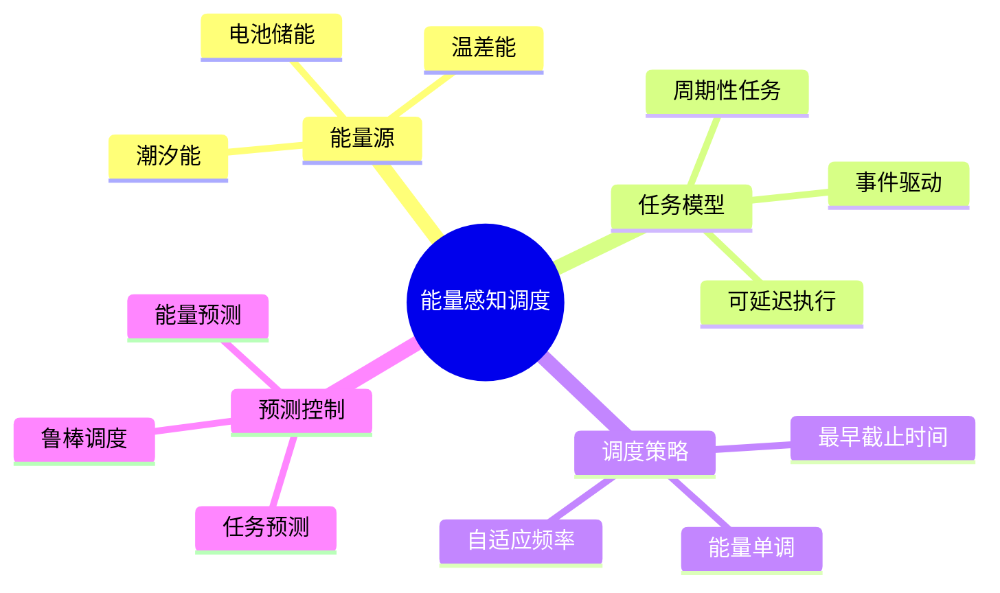

# 深海能量感知调度

> **层级定位**: 04 Industrial Scenarios / 10 Deep Sea
> **对应标准**: Energy Harvesting Systems, Marine IoT
> **难度级别**: L4 高级
> **预估学习时间**: 6-10 小时

---

## 📋 本节概要

| 属性 | 内容 |
|:-----|:-----|
| **核心概念** | 能量收集、任务调度、功耗管理、预测控制 |
| **前置知识** | 实时系统、电源管理、预测算法 |
| **后续延伸** | 自适应采样、边缘计算、长期部署 |
| **权威来源** | IEEE TPDS, ACM TECS, Marine Tech Society |

---

## 🧠 知识结构思维导图



---

## 📖 核心概念详解

### 1. 能量模型

```c
// ============================================================================
// 深海能量管理系统
// ============================================================================

#include <stdint.h>
#include <stdbool.h>
#include <math.h>

// 能量来源类型
typedef enum {
    SOURCE_BATTERY,     // 主电池
    SOURCE_TIDAL,       // 潮汐能收集
    SOURCE_THERMAL,     // 温差能
    SOURCE_HARVESTING   // 其他收集
} EnergySourceType;

// 能量源
typedef struct {
    EnergySourceType type;
    float current_power_mw;     // 当前功率 (mW)
    float capacity_mj;          // 容量 (mJ)
    float stored_energy_mj;     // 存储能量 (mJ)
    float efficiency;           // 转换效率
    float min_voltage;          // 最小工作电压
    float max_voltage;          // 最大电压
    uint32_t cycle_count;       // 充放电循环
} EnergySource;

// 能量预算管理器
typedef struct {
    EnergySource sources[4];
    uint8_t num_sources;

    float total_capacity_mj;
    float total_stored_mj;
    float consumption_rate_mw;
    float harvest_rate_mw;

    // 历史数据 (用于预测)
    float power_history[24];    // 24小时历史
    uint8_t history_index;
} EnergyManager;

// 初始化能量管理器
void energy_manager_init(EnergyManager *mgr) {
    memset(mgr, 0, sizeof(EnergyManager));
    mgr->num_sources = 0;
    mgr->total_capacity_mj = 0;
    mgr->total_stored_mj = 0;
}

// 添加能量源
void energy_add_source(EnergyManager *mgr, EnergySource *source) {
    if (mgr->num_sources >= 4) return;

    mgr->sources[mgr->num_sources] = *source;
    mgr->total_capacity_mj += source->capacity_mj;
    mgr->total_stored_mj += source->stored_energy_mj;
    mgr->num_sources++;
}

// 更新能量状态 (定期调用，如每分钟)
void energy_update(EnergyManager *mgr, float dt_s) {
    // 收集能量
    for (int i = 0; i < mgr->num_sources; i++) {
        EnergySource *src = &mgr->sources[i];

        if (src->type == SOURCE_BATTERY) {
            // 电池放电
            src->stored_energy_mj -= src->current_power_mw * dt_s / 1000.0f;
        } else {
            // 收集器充电
            float harvested = src->current_power_mw * src->efficiency * dt_s / 1000.0f;
            src->stored_energy_mj += harvested;
        }

        // 限制范围
        if (src->stored_energy_mj < 0) src->stored_energy_mj = 0;
        if (src->stored_energy_mj > src->capacity_mj) {
            src->stored_energy_mj = src->capacity_mj;
        }
    }

    // 更新总量
    mgr->total_stored_mj = 0;
    mgr->harvest_rate_mw = 0;
    for (int i = 0; i < mgr->num_sources; i++) {
        mgr->total_stored_mj += mgr->sources[i].stored_energy_mj;
        if (mgr->sources[i].type != SOURCE_BATTERY) {
            mgr->harvest_rate_mw += mgr->sources[i].current_power_mw;
        }
    }

    // 记录历史
    mgr->power_history[mgr->history_index] = mgr->harvest_rate_mw;
    mgr->history_index = (mgr->history_index + 1) % 24;
}

// 预测未来可用能量
float energy_predict_available(EnergyManager *mgr, float hours_ahead) {
    // 简单预测: 基于历史平均
    float avg_harvest = 0;
    for (int i = 0; i < 24; i++) {
        avg_harvest += mgr->power_history[i];
    }
    avg_harvest /= 24.0f;

    float predicted = mgr->total_stored_mj +
                      avg_harvest * hours_ahead * 3600.0f / 1000.0f;

    return fminf(predicted, mgr->total_capacity_mj);
}
```

### 2. 能量感知任务调度

```c
// ============================================================================
// 能量感知任务模型
// ============================================================================

// 任务类型
typedef enum {
    TASK_CRITICAL,      // 关键任务 (必须执行)
    TASK_PERIODIC,      // 周期性任务
    TASK_EVENT,         // 事件驱动
    TASK_OPTIONAL       // 可选任务 (能量充足时执行)
} TaskType;

// 任务能量信息
typedef struct {
    float min_energy_mj;        // 最小所需能量
    float max_energy_mj;        // 最大可能消耗
    float average_power_mw;     // 平均功耗
    float exec_time_s;          // 执行时间
} TaskEnergy;

// 任务控制块
typedef struct {
    uint16_t task_id;
    TaskType type;
    uint32_t period_ms;
    uint32_t deadline_ms;
    uint32_t next_release_ms;

    TaskEnergy energy;

    bool is_ready;
    bool is_running;
    uint32_t exec_count;
    uint32_t miss_count;

    void (*task_func)(void);
} EAPTask;

// 能量感知调度器
typedef struct {
    EAPTask tasks[32];
    uint8_t num_tasks;
    EnergyManager *energy_mgr;

    uint32_t current_time_ms;
    float energy_budget_mj;     // 当前周期能量预算
    float energy_consumed_mj;   // 已消耗能量

    // 策略参数
    float critical_reserve_ratio;   // 关键任务预留比例
    float safety_margin;            // 安全裕度
} EAPScheduler;

// 初始化调度器
void eap_init(EAPScheduler *sched, EnergyManager *mgr) {
    memset(sched, 0, sizeof(EAPScheduler));
    sched->energy_mgr = mgr;
    sched->critical_reserve_ratio = 0.3f;
    sched->safety_margin = 1.2f;
}

// 添加任务
int eap_add_task(EAPScheduler *sched, const EAPTask *task) {
    if (sched->num_tasks >= 32) return -1;

    sched->tasks[sched->num_tasks++] = *task;
    return 0;
}

// 计算周期能量预算
void eap_compute_budget(EAPScheduler *sched, uint32_t period_ms) {
    float period_s = period_ms / 1000.0f;

    // 预测可用能量
    float predicted_mj = energy_predict_available(sched->energy_mgr,
                                                   period_s / 3600.0f);

    // 计算关键任务需求
    float critical_demand = 0;
    for (int i = 0; i < sched->num_tasks; i++) {
        EAPTask *t = &sched->tasks[i];
        if (t->type == TASK_CRITICAL) {
            float exec_in_period = period_ms / (float)t->period_ms;
            critical_demand += t->energy.min_energy_mj * exec_in_period;
        }
    }

    // 预留关键任务能量
    float critical_reserve = critical_demand * sched->critical_reserve_ratio;

    // 可用预算
    sched->energy_budget_mj = (predicted_mj - critical_reserve) /
                               sched->safety_margin;
    if (sched->energy_budget_mj < 0) sched->energy_budget_mj = 0;

    sched->energy_consumed_mj = 0;
}

// 选择下一个任务 (EDF + 能量感知)
EAPTask* eap_select_task(EAPScheduler *sched) {
    EAPTask *selected = NULL;
    uint32_t earliest_deadline = 0xFFFFFFFF;

    for (int i = 0; i < sched->num_tasks; i++) {
        EAPTask *t = &sched->tasks[i];

        if (!t->is_ready) continue;

        // 检查能量是否足够
        float remaining_budget = sched->energy_budget_mj - sched->energy_consumed_mj;

        if (t->type == TASK_OPTIONAL &&
            t->energy.max_energy_mj > remaining_budget) {
            continue;  // 跳过可选任务
        }

        if (t->type == TASK_CRITICAL) {
            // 关键任务优先
            return t;
        }

        // EDF
        if (t->deadline_ms < earliest_deadline) {
            earliest_deadline = t->deadline_ms;
            selected = t;
        }
    }

    return selected;
}

// 调度器主循环
void eap_schedule(EAPScheduler *sched, uint32_t dt_ms) {
    sched->current_time_ms += dt_ms;

    // 1. 检查任务释放
    for (int i = 0; i < sched->num_tasks; i++) {
        EAPTask *t = &sched->tasks[i];
        if (sched->current_time_ms >= t->next_release_ms) {
            t->is_ready = true;
            t->next_release_ms += t->period_ms;
        }
    }

    // 2. 选择并执行任务
    EAPTask *task = eap_select_task(sched);
    if (task) {
        // 执行任务
        task->is_running = true;
        task->task_func();
        task->is_running = false;
        task->is_ready = false;
        task->exec_count++;

        // 更新能耗
        sched->energy_consumed_mj += task->energy.average_power_mw *
                                      task->energy.exec_time_s / 1000.0f;

        // 检查截止时间
        if (sched->current_time_ms > task->deadline_ms) {
            task->miss_count++;
        }
    }
}
```

### 3. 自适应采样

```c
// ============================================================================
// 自适应传感器采样
// 根据能量状态动态调整采样率
// ============================================================================

typedef struct {
    uint32_t sensor_id;
    float min_interval_s;
    float max_interval_s;
    float current_interval_s;
    float energy_per_sample_mj;

    // 数据变化率估计
    float last_value;
    float change_rate;

    // 采样函数
    float (*read_sensor)(void);
} AdaptiveSensor;

// 计算最优采样间隔
float compute_optimal_interval(AdaptiveSensor *sensor,
                                EnergyManager *mgr,
                                float priority) {
    // 能量充足时，根据数据变化率调整
    float energy_ratio = mgr->total_stored_mj / mgr->total_capacity_mj;

    if (energy_ratio > 0.7f) {
        // 能量充足 - 基于变化率
        if (sensor->change_rate > 0.5f) {
            return sensor->min_interval_s;
        } else {
            return sensor->max_interval_s * 0.5f;
        }
    } else if (energy_ratio > 0.3f) {
        // 中等能量 - 标准间隔
        return (sensor->min_interval_s + sensor->max_interval_s) / 2.0f;
    } else {
        // 能量紧张 - 最大间隔
        return sensor->max_interval_s;
    }
}

// 自适应采样
void adaptive_sample(AdaptiveSensor *sensor, EnergyManager *mgr) {
    float value = sensor->read_sensor();

    // 更新变化率
    sensor->change_rate = fabsf(value - sensor->last_value) /
                          sensor->current_interval_s;
    sensor->last_value = value;

    // 计算下次采样间隔
    sensor->current_interval_s = compute_optimal_interval(sensor, mgr, 1.0f);
}
```

---

## ⚠️ 常见陷阱

### 陷阱 EAP01: 能量预测过于乐观

```c
// ❌ 假设收获功率恒定
float predict = current_power * 24;  // 未考虑昼夜变化

// ✅ 使用历史统计 + 保守估计
float predict = historical_min * 24 * safety_factor;
```

### 陷阱 EAP02: 忽略启动能耗

```c
// ❌ 只考虑运行时功耗
if (energy > task_power * duration)

// ✅ 包括启动和关闭能耗
if (energy > startup_energy + task_power * duration + shutdown_energy)
```

---

## ✅ 质量验收清单

| 检查项 | 要求 | 验证 |
|:-------|:-----|:-----|
| 任务完成率 | >95% | 仿真 |
| 能量利用率 | >80% | 实测 |
| 关键任务 | 0遗漏 | 测试 |

---

> **更新记录**
>
> - 2025-03-09: 初版创建，包含能量感知调度完整实现
