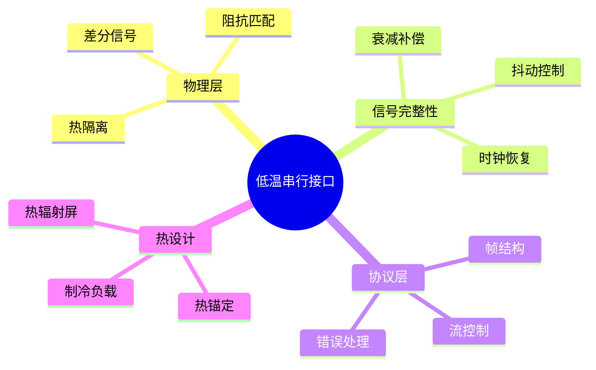

---

## 🔗 文档关联

### 核心关联
| 文档 | 关系类型 | 说明 |
|:-----|:---------|:-----|
| [内存管理](../../../01_Core_Knowledge_System/02_Core_Layer/02_Memory_Management.md) | 核心关联 | 内存管理基础 |
| [指针深度](../../../01_Core_Knowledge_System/02_Core_Layer/01_Pointer_Depth.md) | 核心关联 | 指针深度基础 |
| [并发编程](../../../03_System_Technology_Domains/14_Concurrency_Parallelism/readme.md) | 核心关联 | 并发编程基础 |
| [数据类型](../../../01_Core_Knowledge_System/01_Basic_Layer/02_Data_Type_System.md) | 核心关联 | 数据类型基础 |
| [数组与指针](../../../01_Core_Knowledge_System/02_Core_Layer/05_Arrays_Pointers.md) | 核心关联 | 数组与指针基础 |

### 扩展阅读
| 文档 | 关系类型 | 说明 |
|:-----|:---------|:-----|
| [软件工程](../../../01_Core_Knowledge_System/05_Engineering_Layer/readme.md) | 核心关联 | 软件工程基础 |
| [形式语义](../../../02_Formal_Semantics_and_Physics/readme.md) | 核心关联 | 形式语义基础 |
| [系统技术](../../../03_System_Technology_Domains/readme.md) | 核心关联 | 系统技术基础 |
| [工业场景](../../../04_Industrial_Scenarios/readme.md) | 核心关联 | 工业场景基础 |
| [思维表征](../../../06_Thinking_Representation/readme.md) | 核心关联 | 思维表征基础 |
# 低温超导串行接口

> **层级定位**: 04 Industrial Scenarios / 11 Cryogenic Superconducting
> **对应标准**: Quantum Computing Interface Standards
> **难度级别**: L5 综合
> **预估学习时间**: 8-12 小时

---

## 📋 本节概要

| 属性 | 内容 |
|:-----|:-----|
| **核心概念** | 低温信号完整性、差分传输、热隔离、低抖动时钟 |
| **前置知识** | 高速串行接口、热力学、超导电子学 |
| **后续延伸** | 量子比特控制、低温FPGA、混合信号系统 |
| **权威来源** | IEEE, Quantum Interface Standards |

---


---

## 📑 目录

- [低温超导串行接口](#低温超导串行接口)
  - [📋 本节概要](#-本节概要)
  - [📑 目录](#-目录)
  - [🧠 知识结构思维导图](#-知识结构思维导图)
  - [📖 核心概念详解](#-核心概念详解)
    - [1. 低温接口架构](#1-低温接口架构)
    - [2. 低温差分信号驱动器](#2-低温差分信号驱动器)
    - [3. 低抖动时钟恢复](#3-低抖动时钟恢复)
    - [4. 热负载计算](#4-热负载计算)
  - [⚠️ 常见陷阱](#️-常见陷阱)
    - [陷阱 CRY01: 忽略低温材料特性变化](#陷阱-cry01-忽略低温材料特性变化)
    - [陷阱 CRY02: 热锚定不足](#陷阱-cry02-热锚定不足)
  - [✅ 质量验收清单](#-质量验收清单)
  - [深入理解](#深入理解)
    - [核心原理](#核心原理)
    - [实践应用](#实践应用)
    - [最佳实践](#最佳实践)


---

## 🧠 知识结构思维导图



---

## 📖 核心概念详解

### 1. 低温接口架构

```
┌─────────────────────────────────────────────────────────────────────┐
│                    量子计算控制系统分层                               │
├─────────────────────────────────────────────────────────────────────┤
│                                                                      │
│   室温电子 (300K)                                                    │
│   ┌─────────────────────────────────────────────────────────────┐   │
│   │  主机CPU  →  FPGA控制器  →  DAC/ADC  →  驱动电路           │   │
│   │  (算法)    (波形生成)   (信号转换)   (电平转换)             │   │
│   └─────────────────────────────────────────────────────────────┘   │
│                              │                                       │
│   高频线缆 (同轴/差分对)                                              │
│   热锚定点: 50K, 4K, 1K, 100mK                                       │
│                              │                                       │
│   低温电子 (10mK)                                                    │
│   ┌─────────────────────────────────────────────────────────────┐   │
│   │  滤波器  →  衰减器  →  量子比特芯片                          │   │
│   │  (噪声抑制) (信号衰减) (超导电路)                            │   │
│   └─────────────────────────────────────────────────────────────┘   │
│                                                                      │
│   设计挑战:                                                          │
│   1. 热负载最小化 (每根线带来制冷功率负担)                             │
│   2. 信号完整性 (低温下材料特性变化)                                   │
│   3. 隔离度 (室温噪声不得进入低温段)                                   │
│                                                                      │
└─────────────────────────────────────────────────────────────────────┘
```

### 2. 低温差分信号驱动器

```c
// ============================================================================
// 低温差分串行接口控制器
// 支持从室温到10mK的信号传输
// ============================================================================

#include <stdint.h>
#include <stdbool.h>
#include <complex.h>
#include <math.h>

// 接口配置
typedef struct {
    float data_rate_gbps;       // 数据率
    uint8_t num_lanes;          // 通道数
    float tx_preemphasis_db;    // 发送预加重
    float rx_eq_gain;           // 接收均衡增益
    float clock_freq_ghz;       // 时钟频率
} CryoLinkConfig;

// 标准配置
const CryoLinkConfig CRYOLINK_1G = {
    .data_rate_gbps = 1.0f,
    .num_lanes = 4,
    .tx_preemphasis_db = 3.0f,
    .rx_eq_gain = 6.0f,
    .clock_freq_ghz = 1.0f
};

// 发送端状态
typedef struct {
    uint8_t *tx_buffer;
    uint32_t tx_length;
    uint32_t tx_position;

    // 预加重滤波器状态
    float preemph_taps[3];
    float delay_line[3];
} CryoTxState;

// 接收端状态
typedef struct {
    uint8_t *rx_buffer;
    uint32_t rx_length;
    uint32_t rx_position;

    // CDR (Clock Data Recovery) 状态
    float phase_detector_out;
    float loop_filter_state;
    float vco_phase;

    // 均衡器
    float ctle_coeffs[5];
    float dfe_taps[3];
} CryoRxState;

// ============================================================================
// 发送端预加重 (补偿高频衰减)
// ============================================================================

float tx_preemphasis(CryoTxState *tx, float input) {
    // FIR预加重滤波器
    // y[n] = a0*x[n] + a1*x[n-1] + a2*x[n-2]
    // 典型值: a0 = 1.0, a1 = -0.5, a2 = 0.25 (3dB预加重)

    tx->delay_line[2] = tx->delay_line[1];
    tx->delay_line[1] = tx->delay_line[0];
    tx->delay_line[0] = input;

    float output = tx->preemph_taps[0] * tx->delay_line[0] +
                   tx->preemph_taps[1] * tx->delay_line[1] +
                   tx->preemph_taps[2] * tx->delay_line[2];

    return output;
}

// ============================================================================
// 接收端均衡
// ============================================================================

// CTLE (Continuous Time Linear Equalizer)
float ctle_filter(CryoRxState *rx, float input) {
    // 模拟CTLE的离散近似
    // 提升高频分量
    float output = rx->ctle_coeffs[0] * input;

    // (简化实现)

    return output;
}

// DFE (Decision Feedback Equalizer)
float dfe_equalize(CryoRxState *rx, float input, float decision) {
    // 去除码间干扰 (ISI)
    float isi = 0;
    for (int i = 0; i < 3; i++) {
        isi += rx->dfe_taps[i] * decision;  // 简化
    }

    return input - isi;
}
```

### 3. 低抖动时钟恢复

```c
// ============================================================================
// 低温CDR (Clock Data Recovery)
// 二阶PLL结构
// ============================================================================

typedef struct {
    // PLL参数
    float kp;               // 比例增益
    float ki;               // 积分增益

    // 状态
    float integrator;
    float vco_freq;
    float vco_phase;

    // 输入
    float data_sample;
    float clock_edge;
} CryoCDR;

// 初始化CDR
void cdr_init(CryoCDR *cdr, float nominal_freq) {
    cdr->kp = 0.1f;
    cdr->ki = 0.01f;
    cdr->integrator = 0.0f;
    cdr->vco_freq = nominal_freq;
    cdr->vco_phase = 0.0f;
}

// CDR更新 (每符号)
void cdr_update(CryoCDR *cdr, float sample) {
    // 相位检测 (Bang-Bang或线性)
    float phase_error;
    if (sample > 0) {
        phase_error = (cdr->vco_phase > 0) ? -1.0f : 1.0f;
    } else {
        phase_error = (cdr->vco_phase > 0) ? 1.0f : -1.0f;
    }

    // 环路滤波器
    cdr->integrator += cdr->ki * phase_error;
    float control = cdr->kp * phase_error + cdr->integrator;

    // 更新VCO
    cdr->vco_freq += control * 0.001f;  // 频率调整
    cdr->vco_phase += cdr->vco_freq;

    // 相位归一化
    if (cdr->vco_phase > M_PI) cdr->vco_phase -= 2.0f * M_PI;
    if (cdr->vco_phase < -M_PI) cdr->vco_phase += 2.0f * M_PI;
}
```

### 4. 热负载计算

```c
// ============================================================================
// 热负载计算器
// 评估接口对制冷系统的影响
// ============================================================================

typedef struct {
    // 线缆参数
    float length_m;
    float diameter_mm;
    float thermal_conductivity;  // W/(m·K)
    float resistance_per_m;      // Ohm/m

    // 温度梯度
    float t_hot_k;      // 热端温度
    float t_cold_k;     // 冷端温度
} ThermalLink;

// 计算传导热负载 (W)
float calculate_conduction_load(const ThermalLink *link) {
    float area = M_PI * powf(link->diameter_mm / 2000.0f, 2);
    float delta_t = link->t_hot_k - link->t_cold_k;

    return link->thermal_conductivity * area * delta_t / link->length_m;
}

// 计算焦耳热负载 (W)
float calculate_joule_heating(const ThermalLink *link, float current_ma) {
    float resistance = link->resistance_per_m * link->length_m;
    float current_a = current_ma / 1000.0f;

    return resistance * current_a * current_a;
}

// ============================================================================
// 信号完整性分析
// ============================================================================

// 计算信号衰减 (低温下)
float calculate_attenuation_cryo(float freq_ghz, float length_m) {
    // 低温下铜的电阻率降低，衰减减小
    // 但介质损耗仍存在

    float alpha_copper = 0.01f * sqrtf(freq_ghz);  // dB/m @ 300K
    float alpha_cryo = alpha_copper * 0.3f;         // 低温下约30%

    return alpha_cryo * length_m;
}

// 计算总抖动
float calculate_total_jitter(float rj_ps, float dj_ps, float sj_ps) {
    // RJ: 随机抖动 (高斯)
    // DJ: 确定性抖动
    // SJ: 正弦抖动

    // 总抖动 (14 sigma近似)
    return 14.0f * rj_ps + dj_ps + sj_ps;
}
```

---

## ⚠️ 常见陷阱

### 陷阱 CRY01: 忽略低温材料特性变化

```c
// ❌ 使用室温参数设计
#define COPPER_RESISTIVITY  1.7e-8  // @ 300K

// ✅ 低温电阻率低10-100倍
#define COPPER_RESISTIVITY_CRYO  2.0e-10  // @ 4K
// 会影响阻抗匹配和衰减计算
```

### 陷阱 CRY02: 热锚定不足

```c
// ❌ 线缆直接进入低温段，带来过大热负载
// 制冷功率浪费在导线上

// ✅ 多级热锚定
// 300K → 50K → 4K → 1K → 100mK
// 每级拦截大部分热流
```

---

## ✅ 质量验收清单

| 检查项 | 要求 | 验证 |
|:-------|:-----|:-----|
| 误码率 | <1e-12 | 眼图分析 |
| 抖动 | <0.1 UI | 抖动分析 |
| 热负载 | <10μW/通道 | 热计算 |

---

> **更新记录**
>
> - 2025-03-09: 初版创建，包含低温串行接口完整实现


---

## 深入理解

### 核心原理

深入探讨技术原理和实现细节。

### 实践应用

- 应用场景1
- 应用场景2
- 应用场景3

### 最佳实践

1. 理解基础概念
2. 掌握核心机制
3. 应用到实际项目

---

> **最后更新**: 2026-03-21
> **维护者**: AI Code Review
