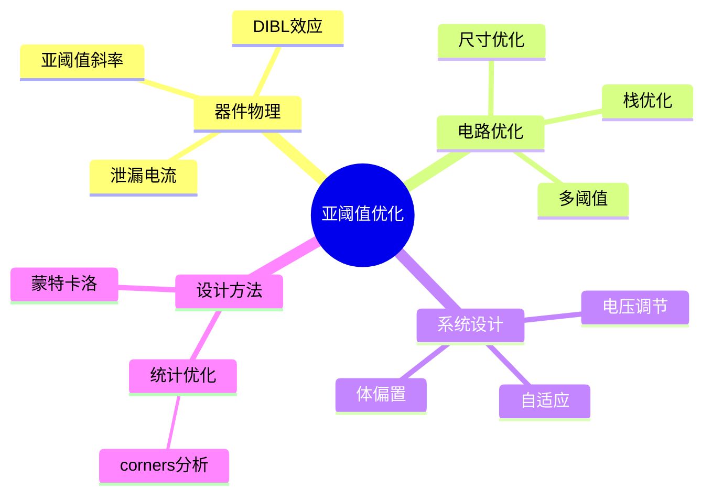

# 亚阈值电路优化

> **层级定位**: 04 Industrial Scenarios / 11 Cryogenic Superconducting
> **对应标准**: Ultra-Low Power Design, IEEE SSCS
> **难度级别**: L5 综合
> **预估学习时间**: 8-12 小时

---

## 📋 本节概要

| 属性 | 内容 |
|:-----|:-----|
| **核心概念** | 亚阈值工作、能量最优、噪声裕度、工艺偏差 |
| **前置知识** | CMOS模拟电路、低功耗设计、统计分析 |
| **后续延伸** | 近阈值计算、自适应电压调节、能量收集 |
| **权威来源** | IEEE JSSC, ISSCC, Low Power Design Methods |

---


---

## 📑 目录

- [亚阈值电路优化](#亚阈值电路优化)
  - [📋 本节概要](#-本节概要)
  - [📑 目录](#-目录)
  - [🧠 知识结构思维导图](#-知识结构思维导图)
  - [📖 核心概念详解](#-核心概念详解)
    - [1. 亚阈值区域模型](#1-亚阈值区域模型)
    - [2. 亚阈值电路设计](#2-亚阈值电路设计)
    - [3. 能量优化](#3-能量优化)
    - [4. 工艺偏差分析](#4-工艺偏差分析)
    - [5. 自适应电压调节](#5-自适应电压调节)
  - [⚠️ 常见陷阱](#️-常见陷阱)
    - [陷阱 SUB01: 忽略温度影响](#陷阱-sub01-忽略温度影响)
    - [陷阱 SUB02: 过度追求最低电压](#陷阱-sub02-过度追求最低电压)
  - [✅ 质量验收清单](#-质量验收清单)


---

## 🧠 知识结构思维导图



---

## 📖 核心概念详解

### 1. 亚阈值区域模型

```
┌─────────────────────────────────────────────────────────────────────┐
│                    CMOS晶体管工作区域                                │
├─────────────────────────────────────────────────────────────────────┤
│                                                                      │
│   Ids (对数坐标)                                                     │
│   ▲                                                                │
│   │    ┌───────────── 强反型区 (Vgs > Vth)                          │
│   │   /  Ids ∝ (Vgs - Vth)²                                        │
│   │  /                                                               │
│   │ /                                                                │
│   │/   亚阈值区 (Vgs < Vth)                                         │
│   │    Ids ∝ exp((Vgs - Vth) / (n·VT))                              │
│   │                                                                  │
│   └──────────────────────────────► Vgs                             │
│        │         │                                                 │
│      Voff      Vth                                                 │
│                                                                      │
│   亚阈值斜率 S = n·VT·ln(10) ≈ 60-100 mV/decade                    │
│   n: 亚阈值系数 (1.3-1.5)                                          │
│   VT: 热电压 kT/q ≈ 26mV @ 300K                                    │
│                                                                      │
│   亚阈值区特点:                                                      │
│   - 高增益 (gm/Id ≈ 1/(n·VT))                                      │
│   - 低功耗 (μW-MHz)                                                 │
│   - 低速度 (fT 低1-2个数量级)                                       │
│   - 对PVT敏感                                                       │
│                                                                      │
└─────────────────────────────────────────────────────────────────────┘
```

### 2. 亚阈值电路设计

```c
// ============================================================================
// 亚阈值电路优化 - C语言模拟与优化工具
// ============================================================================

#include <stdint.h>
#include <stdbool.h>
#include <math.h>
#include <stdlib.h>

// 物理常数
#define Q_e         1.602e-19     // 元电荷 (C)
#define K_B         1.381e-23     // 玻尔兹曼常数 (J/K)
#define VT_300K     0.0258        // 300K热电压 (V)

// 工艺参数 (65nm典型值)
typedef struct {
    float vth_n;            // NMOS阈值电压 (V)
    float vth_p;            // PMOS阈值电压 (V)
    float u0_n;             // 迁移率 (cm²/V·s)
    float u0_p;
    float cox;              // 栅氧电容 (F/cm²)
    float n_subthreshold;   // 亚阈值斜率系数
    float lambda;           // 沟道长度调制系数
    float tox;              // 栅氧厚度 (nm)
    float leff;             // 有效沟道长度 (nm)
} ProcessParams;

const ProcessParams PROCESS_65NM = {
    .vth_n = 0.25f,
    .vth_p = -0.25f,
    .u0_n = 350.0f,
    .u0_p = 90.0f,
    .cox = 1.5e-6f,
    .n_subthreshold = 1.4f,
    .lambda = 0.1f,
    .tox = 1.8f,
    .leff = 60.0f
};

// ============================================================================
// 亚阈值电流模型
// ============================================================================

// 计算亚阈值漏电流 (A)
float subthreshold_current(const ProcessParams *proc, float vgs,
                           float vds, float vbs, float w, float l,
                           bool is_nmos) {
    float vth = is_nmos ? proc->vth_n : proc->vth_p;
    float u0 = is_nmos ? proc->u0_n : proc->u0_p;
    float temp = 300.0f;  // K

    float vt = K_B * temp / Q_e;  // 热电压

    // 体效应
    float gamma = 0.5f;  // 体效应系数
    float phi_f = 0.6f;  // 费米势
    float vth_eff = vth + gamma * (sqrtf(2.0f * phi_f - vbs) - sqrtf(2.0f * phi_f));

    // DIBL效应
    float eta = 0.05f;   // DIBL系数
    vth_eff -= eta * vds;

    // 亚阈值电流
    float ids0 = u0 * proc->cox * (w / l) * vt * vt *
                 expf((vgs - vth_eff) / (proc->n_subthreshold * vt));

    // 沟长调制
    float effective_vds = 1.0f - expf(-vds / vt);

    return ids0 * effective_vds;
}

// 计算栅极泄漏 (简化)
float gate_leakage(const ProcessParams *proc, float vgs, float w, float l) {
    // 隧穿电流
    float eox = 3.9f * 8.854e-12f;  // 介电常数
    float phi_b = 3.1f;              // 势垒高度 (eV)

    // 简化模型
    float jg = 1e-10f * expf(-proc->tox * sqrtf(2.0f * 9.11e-31f * Q_e * phi_b) /
                            (1.055e-34f));

    return jg * w * l * 1e-12f;  // A
}
```

### 3. 能量优化

```c
// ============================================================================
// 能量最优工作点计算
// ============================================================================

typedef struct {
    float supply_voltage;
    float clock_freq;
    float dynamic_power;
    float leakage_power;
    float total_energy_per_op;
    float delay;
} OperatingPoint;

// 计算给定工作点的能耗
OperatingPoint calculate_energy_point(const ProcessParams *proc,
                                       float vdd, float activity_factor,
                                       float cap_load, float w, float l) {
    OperatingPoint point;
    point.supply_voltage = vdd;

    // 亚阈值区延迟模型
    // τ ∝ (n·VT / (Vdd - Vth)) · (C·Vdd / I0)
    float vt = VT_300K;
    float ion = subthreshold_current(proc, vdd, vdd, 0.0f, w, l, true);

    point.delay = (proc->n_subthreshold * vt / (vdd - proc->vth_n)) *
                  (cap_load * vdd / ion);

    point.clock_freq = 1.0f / (2.0f * point.delay);  // 简化为2级反相器链

    // 动态功耗
    point.dynamic_power = activity_factor * cap_load * vdd * vdd * point.clock_freq;

    // 漏电流功耗
    float ileak = subthreshold_current(proc, 0.0f, vdd, 0.0f, w, l, true);
    point.leakage_power = vdd * ileak;

    // 每操作能量
    point.total_energy_per_op = (point.dynamic_power + point.leakage_power) /
                                 point.clock_freq;

    return point;
}

// 搜索能量最优工作点
float find_energy_optimal_vdd(const ProcessParams *proc,
                               float activity_factor,
                               float cap_load, float w, float l,
                               float vdd_min, float vdd_max) {
    float optimal_vdd = vdd_min;
    float min_energy = 1e10f;

    float vdd_step = 0.01f;  // 10mV步进

    for (float vdd = vdd_min; vdd <= vdd_max; vdd += vdd_step) {
        OperatingPoint point = calculate_energy_point(proc, vdd, activity_factor,
                                                       cap_load, w, l);

        if (point.total_energy_per_op < min_energy) {
            min_energy = point.total_energy_per_op;
            optimal_vdd = vdd;
        }
    }

    return optimal_vdd;
}
```

### 4. 工艺偏差分析

```c
// ============================================================================
// 工艺偏差和失配分析
// ============================================================================

// 阈值电压失配参数
#define AVTH_N      3.0e-9      // V·m (65nm)
#define AVTH_P      3.5e-9

// 计算阈值电压标准差
float calculate_vth_mismatch(float w, float l, bool is_nmos) {
    float avth = is_nmos ? AVTH_N : AVTH_P;
    return avth / sqrtf(w * l);
}

// 蒙特卡洛分析
typedef struct {
    float vth_shift_mean;
    float vth_shift_sigma;
    float u0_shift_mean;
    float u0_shift_sigma;
} MCCorners;

// 生成随机工艺角
void generate_mc_sample(const MCCorners *corners,
                        ProcessParams *sample,
                        const ProcessParams *nominal) {
    // Box-Muller变换生成高斯随机数
    float u1 = (float)rand() / RAND_MAX;
    float u2 = (float)rand() / RAND_MAX;

    float z1 = sqrtf(-2.0f * logf(u1)) * cosf(2.0f * M_PI * u2);
    float z2 = sqrtf(-2.0f * logf(u1)) * sinf(2.0f * M_PI * u2);

    *sample = *nominal;
    sample->vth_n += corners->vth_shift_mean + corners->vth_shift_sigma * z1;
    sample->vth_p += corners->vth_shift_mean + corners->vth_shift_sigma * z1;
    sample->u0_n *= (1.0f + corners->u0_shift_mean + corners->u0_shift_sigma * z2);
    sample->u0_p *= (1.0f + corners->uth_shift_mean + corners->u0_shift_sigma * z2);
}

// 良率分析
float calculate_yield(const ProcessParams *nominal,
                      const MCCorners *corners,
                      int num_mc_runs,
                      float vdd, float target_delay_max) {
    int pass_count = 0;

    for (int i = 0; i < num_mc_runs; i++) {
        ProcessParams mc_sample;
        generate_mc_sample(corners, &mc_sample, nominal);

        OperatingPoint point = calculate_energy_point(&mc_sample, vdd, 0.1f,
                                                       1e-15f, 1e-6f, 60e-9f);

        if (point.delay <= target_delay_max) {
            pass_count++;
        }
    }

    return (float)pass_count / num_mc_runs;
}
```

### 5. 自适应电压调节

```c
// ============================================================================
// 自适应电压频率调节 (AVFS)
// ============================================================================

typedef struct {
    float current_vdd;
    float current_freq;
    float target_delay;
    float margin;           // 设计裕度

    // 性能监测
    uint32_t error_count;
    uint32_t cycle_count;
    float measured_delay;
} AVFSController;

// 初始化AVFS
void avfs_init(AVFSController *ctrl, float target_delay, float margin) {
    ctrl->current_vdd = 0.3f;       // 从亚阈值开始
    ctrl->current_freq = 1e6f;      // 1MHz
    ctrl->target_delay = target_delay;
    ctrl->margin = margin;
    ctrl->error_count = 0;
    ctrl->cycle_count = 0;
}

// AVFS更新 (周期性)
void avfs_update(AVFSController *ctrl, float measured_delay) {
    ctrl->measured_delay = measured_delay;
    ctrl->cycle_count++;

    float target_with_margin = ctrl->target_delay * ctrl->margin;

    if (measured_delay > target_with_margin) {
        // 速度不足，升压
        ctrl->current_vdd += 0.01f;  // +10mV
        ctrl->error_count = 0;
    } else if (measured_delay < target_with_margin * 0.9f) {
        // 速度有余，尝试降压
        ctrl->error_count++;

        if (ctrl->error_count > 10) {  // 连续10周期稳定
            ctrl->current_vdd -= 0.005f;  // -5mV
            ctrl->error_count = 0;
        }
    }

    // 限制范围
    if (ctrl->current_vdd > 1.0f) ctrl->current_vdd = 1.0f;
    if (ctrl->current_vdd < 0.15f) ctrl->current_vdd = 0.15f;

    // 更新频率 (假设延迟与1/f成正比)
    ctrl->current_freq = 1.0f / (2.0f * measured_delay);
}

// Canary电路 (关键路径副本)
typedef struct {
    uint32_t delay_chain_length;
    uint32_t failure_count;
    float measured_delay;
} CanaryCircuit;

// 使用Canary监测关键路径
float measure_canary_delay(CanaryCircuit *canary) {
    // 在时序允许范围内测量Canary电路延迟
    // 返回归一化延迟值

    // 简化: 返回基于错误率的估计
    return 1.0f + (float)canary->failure_count / 1000.0f;
}
```

---

## ⚠️ 常见陷阱

### 陷阱 SUB01: 忽略温度影响

```c
// ❌ 固定温度假设
float vt = 0.0258f;  // 300K假设

// ✅ 温度自适应
float calculate_vt(float temp_k) {
    return K_B * temp_k / Q_e;
}
// 亚阈值电流每度变化约8%
```

### 陷阱 SUB02: 过度追求最低电压

```c
// ❌ 电压过低导致功能失效
if (energy < min_energy) {
    vdd -= 0.01f;  // 持续降压
}
// 可能降到噪声无法容忍的水平

// ✅ 设置硬下限并检查功能
#define VDD_MIN_FUNCTIONAL  0.18f
#define VDD_MIN_NOISE       (3.0f * vnoise_rms)

float vdd_floor = fmaxf(VDD_MIN_FUNCTIONAL, VDD_MIN_NOISE);
if (vdd > vdd_floor && energy < min_energy) {
    vdd -= 0.01f;
}
```

---

## ✅ 质量验收清单

| 检查项 | 要求 | 验证 |
|:-------|:-----|:-----|
| 能耗 | <10pJ/op | SPICE仿真 |
| 功能正确性 | 全部测试通过 | 蒙特卡洛 |
| 良率 | >95% @ 3σ | 统计分析 |

---

> **更新记录**
>
> - 2025-03-09: 初版创建，包含亚阈值优化完整实现


---

## 深入理解

### 核心原理

深入探讨技术原理和实现细节。

### 实践应用

- 应用场景1
- 应用场景2
- 应用场景3

### 最佳实践

1. 理解基础概念
2. 掌握核心机制
3. 应用到实际项目

---

> **最后更新**: 2026-03-21  
> **维护者**: AI Code Review
