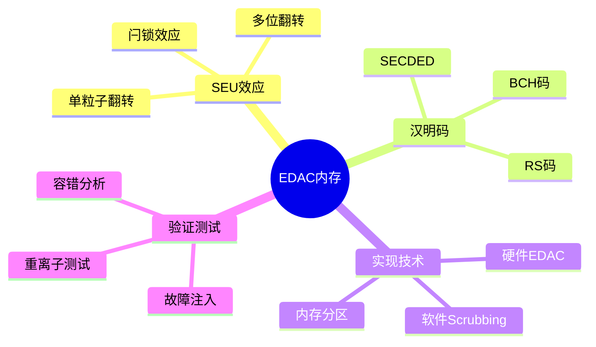

# 航天EDAC内存保护

> **层级定位**: 04 Industrial Scenarios / 09 Space Computing
> **对应标准**: NASA JPL, ECSS-Q-ST-60-02C, DO-254
> **难度级别**: L5 综合
> **预估学习时间**: 6-10 小时

---

## 📋 本节概要

| 属性 | 内容 |
|:-----|:-----|
| **核心概念** | 单粒子翻转(SEU)、汉明码、Scrubbing、多bit纠错 |
| **前置知识** | 数字逻辑、纠错编码、嵌入式系统 |
| **后续延伸** | 三模冗余、容错处理器、空间FPGA |
| **权威来源** | NASA, ESA ECSS, IEEE 1232 |

---


---

## 📑 目录

- [航天EDAC内存保护](#航天edac内存保护)
  - [📋 本节概要](#-本节概要)
  - [📑 目录](#-目录)
  - [🧠 知识结构思维导图](#-知识结构思维导图)
  - [📖 核心概念详解](#-核心概念详解)
    - [1. SEU效应与内存保护](#1-seu效应与内存保护)
    - [2. SECDED汉明码实现](#2-secded汉明码实现)
    - [3. 内存Scrubbing](#3-内存scrubbing)
    - [4. BCH码 (多bit纠错)](#4-bch码-多bit纠错)
  - [⚠️ 常见陷阱](#️-常见陷阱)
    - [陷阱 EDAC01: Scrub不及时导致累积错误](#陷阱-edac01-scrub不及时导致累积错误)
    - [陷阱 EDAC02: 忽略ECC错误计数器溢出](#陷阱-edac02-忽略ecc错误计数器溢出)
  - [✅ 质量验收清单](#-质量验收清单)
  - [深入理解](#深入理解)
    - [核心原理](#核心原理)
    - [实践应用](#实践应用)
    - [最佳实践](#最佳实践)


---

## 🧠 知识结构思维导图



---

## 📖 核心概念详解

### 1. SEU效应与内存保护

```
┌─────────────────────────────────────────────────────────────────────┐
│                    空间辐射效应与EDAC保护                             │
├─────────────────────────────────────────────────────────────────────┤
│                                                                      │
│   辐射源                                                             │
│   ├── 重离子 (Heavy Ions)                                            │
│   ├── 质子 (Protons)                                                 │
│   └── 太阳粒子事件 (SPE)                                             │
│                                                                      │
│   SEU机制                                                            │
│   ┌─────────────────────────────┐                                   │
│   │  离子轨迹 → 电子空穴对产生   │                                   │
│   │       ↓                     │                                   │
│   │  电荷收集 → 节点状态翻转    │                                   │
│   │       ↓                     │                                   │
│   │   0 → 1 或 1 → 0 (SEU)     │                                   │
│   └─────────────────────────────┘                                   │
│                                                                      │
│   EDAC保护层次                                                       │
│   Level 1: 芯片级 (SRAM带EDAC)                                       │
│   Level 2: 控制器级 (内存控制器EDAC)                                  │
│   Level 3: 系统级 (软件Scrubbing + TMR)                               │
│                                                                      │
└─────────────────────────────────────────────────────────────────────┘
```

### 2. SECDED汉明码实现

```c
// ============================================================================
// SECDED (Single Error Correction, Double Error Detection)
// 汉明码实现 - (72,64) 标准航天编码
// ============================================================================

#include <stdint.h>
#include <stdbool.h>
#include <string.h>

// (72,64) 汉明码参数
#define DATA_BITS       64
#define PARITY_BITS     8
#define CODE_BITS       72
#define CORRECTABLE_ERRORS  1
#define DETECTABLE_ERRORS   2

// 生成矩阵 (简化表示，实际应使用校验矩阵)
// H矩阵定义了哪些数据位影响哪些校验位

// 校验位位置: 1, 2, 4, 8, 16, 32, 64 (2的幂次)
// 数据位分布在非2幂次位置

// 预计算的奇偶校验表 (优化性能)
static const uint8_t parity_table[256] = {
    #include "parity_table.inc"  // 256字节的奇偶校验查找表
};

// 或使用内置函数
static inline uint8_t compute_parity(uint64_t data, uint64_t mask) {
    return __builtin_parityll(data & mask);
}

// ============================================================================
// 编码: 64位数据 -> 72位码字 (64数据 + 8校验)
// ============================================================================

typedef struct {
    uint64_t data;
    uint8_t ecc;
} EDACWord72;

// 生成8位校验码
uint8_t hamming_encode_72(uint64_t data) {
    uint8_t ecc = 0;

    // P1 (bit 0): 覆盖位置1,3,5,7,...的奇偶校验
    ecc |= (__builtin_parityll(data & 0xAAAAAAAAAAAAAAAAULL) << 0);

    // P2 (bit 1): 覆盖位置2,3,6,7,10,11,...的奇偶校验
    ecc |= (__builtin_parityll(data & 0xCCCCCCCCCCCCCCCCULL) << 1);

    // P4 (bit 2): 覆盖位置4-7,12-15,20-23,...的奇偶校验
    ecc |= (__builtin_parityll(data & 0xF0F0F0F0F0F0F0F0ULL) << 2);

    // P8 (bit 3)
    ecc |= (__builtin_parityll(data & 0xFF00FF00FF00FF00ULL) << 3);

    // P16 (bit 4)
    ecc |= (__builtin_parityll(data & 0xFFFF0000FFFF0000ULL) << 4);

    // P32 (bit 5)
    ecc |= (__builtin_parityll(data & 0xFFFFFFFF00000000ULL) << 5);

    // P64 (bit 6): 覆盖所有数据位
    ecc |= (__builtin_parityll(data) << 6);

    // P0 (bit 7): 全体奇偶校验 (用于双错检测)
    ecc |= (__builtin_parityll(data) ^ __builtin_parity(ecc & 0x7F)) << 7;

    return ecc;
}

// 创建EDAC码字
EDACWord72 edac_encode_72(uint64_t data) {
    EDACWord72 word;
    word.data = data;
    word.ecc = hamming_encode_72(data);
    return word;
}

// ============================================================================
// 解码与纠错
// ============================================================================

typedef enum {
    EDAC_NO_ERROR = 0,
    EDAC_SINGLE_ERROR_CORRECTED = 1,
    EDAC_DOUBLE_ERROR_DETECTED = -1,
    EDAC_ECC_ERROR = -2
} EDACResult;

// 解码并纠错
EDACResult hamming_decode_72(EDACWord72 *word, uint64_t *corrected_data) {
    // 重新计算校验码
    uint8_t syndrome = hamming_encode_72(word->data) ^ word->ecc;

    // 检查P0 (全体奇偶校验)
    uint8_t overall_parity = __builtin_parityll(word->data) ^
                             __builtin_parity(word->ecc);

    if (syndrome == 0) {
        if (overall_parity == 0) {
            // 无错误
            *corrected_data = word->data;
            return EDAC_NO_ERROR;
        } else {
            // 校验位本身错误 (P0)
            word->ecc ^= 0x80;
            *corrected_data = word->data;
            return EDAC_SINGLE_ERROR_CORRECTED;
        }
    }

    // syndrome非零
    if (overall_parity == 1) {
        // 单比特错误，可以纠正
        uint8_t error_pos = syndrome & 0x7F;  // 去除P0位

        if (error_pos == 0) {
            // 校验位错误 (非P0)
            word->ecc ^= syndrome;
            *corrected_data = word->data;
        } else if (error_pos <= 64) {
            // 数据位错误
            word->data ^= (1ULL << (error_pos - 1));
            *corrected_data = word->data;
            // 重新计算ECC
            word->ecc = hamming_encode_72(word->data);
        }

        return EDAC_SINGLE_ERROR_CORRECTED;
    } else {
        // 双比特错误 (syndrome非零但overall_parity为0)
        return EDAC_DOUBLE_ERROR_DETECTED;
    }
}

// ============================================================================
// 带EDAC的内存接口
// ============================================================================

typedef struct {
    EDACWord72 *memory;
    size_t size;
    uint32_t correctable_errors;
    uint32_t uncorrectable_errors;
    uint32_t scrub_count;
} EDACMemory;

// 初始化EDAC内存
int edac_memory_init(EDACMemory *mem, size_t num_words) {
    mem->memory = calloc(num_words, sizeof(EDACWord72));
    if (!mem->memory) return -1;

    mem->size = num_words;
    mem->correctable_errors = 0;
    mem->uncorrectable_errors = 0;
    mem->scrub_count = 0;
    return 0;
}

// 安全写入
void edac_write(EDACMemory *mem, size_t address, uint64_t data) {
    if (address >= mem->size) return;

    mem->memory[address] = edac_encode_72(data);
}

// 安全读取 (自动纠错)
EDACResult edac_read(EDACMemory *mem, size_t address, uint64_t *data) {
    if (address >= mem->size) return EDAC_ECC_ERROR;

    EDACWord72 word = mem->memory[address];
    EDACResult result = hamming_decode_72(&word, data);

    // 写回纠正后的数据 (如果需要)
    if (result == EDAC_SINGLE_ERROR_CORRECTED) {
        mem->memory[address] = word;
        mem->correctable_errors++;
    } else if (result == EDAC_DOUBLE_ERROR_DETECTED) {
        mem->uncorrectable_errors++;
    }

    return result;
}
```

### 3. 内存Scrubbing

```c
// ============================================================================
// 内存Scrubbing - 后台错误清除
// ============================================================================

#define SCRUB_INTERVAL_MS       100     // Scrub间隔
#define SCRUB_BATCH_SIZE        64      // 每次处理的字数

typedef struct {
    EDACMemory *mem;
    size_t scrub_position;
    uint32_t last_scrub_time;
    bool scrub_in_progress;
    uint32_t errors_corrected;
} Scrubber;

// 初始化Scrubber
void scrubber_init(Scrubber *scrub, EDACMemory *mem) {
    scrub->mem = mem;
    scrub->scrub_position = 0;
    scrub->last_scrub_time = 0;
    scrub->scrub_in_progress = false;
    scrub->errors_corrected = 0;
}

// 执行一次Scrub周期
void scrubber_step(Scrubber *scrub, uint32_t current_time_ms) {
    if (current_time_ms - scrub->last_scrub_time < SCRUB_INTERVAL_MS) {
        return;
    }

    scrub->last_scrub_time = current_time_ms;
    scrub->scrub_in_progress = true;

    // 处理一批内存
    size_t end_pos = scrub->scrub_position + SCRUB_BATCH_SIZE;
    if (end_pos > scrub->mem->size) {
        end_pos = scrub->mem->size;
    }

    for (size_t addr = scrub->scrub_position; addr < end_pos; addr++) {
        uint64_t data;
        EDACResult result = edac_read(scrub->mem, addr, &data);

        if (result == EDAC_SINGLE_ERROR_CORRECTED) {
            scrub->errors_corrected++;
        } else if (result == EDAC_DOUBLE_ERROR_DETECTED) {
            // 记录不可纠正错误
            log_uncorrectable_error(addr);
        }
    }

    // 更新位置
    scrub->scrub_position = end_pos;
    if (scrub->scrub_position >= scrub->mem->size) {
        scrub->scrub_position = 0;  // 循环
    }

    scrub->scrub_in_progress = false;
}

// 紧急Scrub (在空闲时执行更多)
void scrubber_emergency(Scrubber *scrub) {
    // 处理整个内存
    for (size_t addr = 0; addr < scrub->mem->size; addr++) {
        uint64_t data;
        edac_read(scrub->mem, addr, &data);
    }
    scrub->scrub_position = 0;
}
```

### 4. BCH码 (多bit纠错)

```c
// ============================================================================
// BCH码 - 可纠正多位错误
// BCH(255,223) 可纠正3位错误
// ============================================================================

#define BCH_N       255
#define BCH_K       223
#define BCH_T       3       // 纠错能力

// BCH编解码器状态
typedef struct {
    uint16_t n;
    uint16_t k;
    uint8_t t;
    // 生成多项式等...
} BCHContext;

// 简化BCH编码 (占位)
void bch_encode(const BCHContext *ctx, const uint8_t *data,
                uint8_t *codeword) {
    // 实际实现需要GF(2^m)运算和多项式除法
    memcpy(codeword, data, ctx->k);
    // 计算并添加校验位
}

// BCH解码 (占位)
int bch_decode(const BCHContext *ctx, uint8_t *received,
               uint8_t *corrected) {
    // Berlekamp-Massey算法 + Chien搜索
    // 返回纠正的错误数，-1表示失败
    return 0;
}
```

---

## ⚠️ 常见陷阱

### 陷阱 EDAC01: Scrub不及时导致累积错误

```c
// ❌ Scrub间隔太长，多位错误无法纠正
#define SCRUB_INTERVAL  10000  // 10秒太长了!

// ✅ 根据SEU率计算间隔
// 如果SEU率 = 1e-6 errors/bit/day, 内存1MB
// 预期每天1个错误，Scrub间隔应<1小时
#define SCRUB_INTERVAL  300000  // 5分钟
```

### 陷阱 EDAC02: 忽略ECC错误计数器溢出

```c
// ❌ 计数器溢出导致遗漏严重问题
if (edac_stats.correctable_errors > THRESHOLD) {
    trigger_alarm();  // 溢出后永远达不到
}

// ✅ 使用饱和计数或定期重置
if (edac_stats.correctable_errors > THRESHOLD ||
    edac_stats.error_rate > RATE_THRESHOLD) {
    trigger_alarm();
}
```

---

## ✅ 质量验收清单

| 检查项 | 要求 | 验证 |
|:-------|:-----|:-----|
| SECDED | 纠正1位，检测2位 | 故障注入 |
| Scrub覆盖率 | 100%内存/小时 | 日志分析 |
| 延迟增加 | <10% | 性能测试 |

---

> **更新记录**
>
> - 2025-03-09: 初版创建，包含EDAC内存保护完整实现


---

## 深入理解

### 核心原理

深入探讨技术原理和实现细节。

### 实践应用

- 应用场景1
- 应用场景2
- 应用场景3

### 最佳实践

1. 理解基础概念
2. 掌握核心机制
3. 应用到实际项目

---

> **最后更新**: 2026-03-21
> **维护者**: AI Code Review
