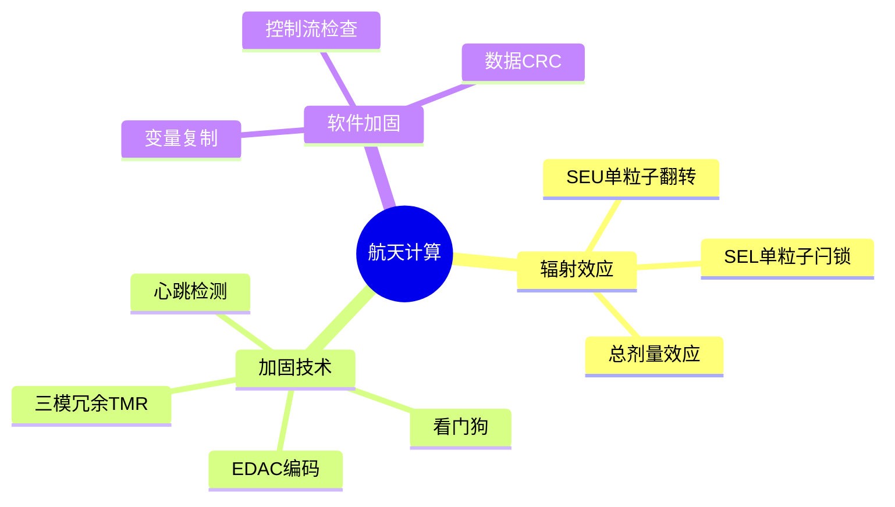

# 航天计算抗辐射加固

> **层级定位**: 04 Industrial Scenarios / 07 Space Computing
> **对应标准**: NASA JPL, ESA标准, DO-178C
> **难度级别**: L5 综合
> **预估学习时间**: 8-12 小时

---

## 📋 本节概要

| 属性 | 内容 |
|:-----|:-----|
| **核心概念** | 单粒子翻转(SEU), 三模冗余(TMR), EDAC, 看门狗 |
| **前置知识** | 容错系统, 编码理论, 嵌入式 |
| **后续延伸** | 星载处理器, FPGA容错, 深空通信 |
| **权威来源** | NASA Standards, ECSS |

---


---

## 📑 目录

- [航天计算抗辐射加固](#航天计算抗辐射加固)
  - [📋 本节概要](#-本节概要)
  - [📑 目录](#-目录)
  - [🧠 知识结构思维导图](#-知识结构思维导图)
  - [📖 核心实现](#-核心实现)
    - [1. EDAC内存保护](#1-edac内存保护)
    - [2. 三模冗余(TMR)](#2-三模冗余tmr)
    - [3. 控制流保护](#3-控制流保护)
    - [4. 数据完整性校验](#4-数据完整性校验)
  - [⚠️ 常见陷阱](#️-常见陷阱)
    - [陷阱 RAD01: 单点故障](#陷阱-rad01-单点故障)
    - [陷阱 RAD02: 时序假设](#陷阱-rad02-时序假设)
  - [✅ 质量验收清单](#-质量验收清单)


---

## 🧠 知识结构思维导图



---

## 📖 核心实现

### 1. EDAC内存保护

```c
#include <stdint.h>
#include <stdbool.h>
#include <string.h>

// 汉明码(72,64) - 每64位数据8位校验
// 可纠正单比特错误，检测双比特错误

// 生成汉明校验位
uint8_t hamming_encode_64(uint64_t data) {
    uint8_t p = 0;

    // P1 covers bits 1,3,5,7,... (奇数位)
    // P2 covers bits 2-3,6-7,10-11,...
    // P4 covers bits 4-7,20-23,...
    // etc.

    for (int i = 0; i < 64; i++) {
        if (data & (1ULL << i)) {
            // 数据位的位置是 i+1（汉明码从1开始计数）
            int pos = i + 1;
            // 异或所有涉及的位置
            p ^= pos & 0x7F;  // 取低7位（最大127）
        }
    }

    // 提取校验位（位置1,2,4,8,16,32,64）
    return ((p >> 0) & 1) |    // P1
           ((p >> 1) & 1) << 1 |  // P2
           ((p >> 2) & 1) << 2 |  // P4
           ((p >> 3) & 1) << 3 |  // P8
           ((p >> 4) & 1) << 4 |  // P16
           ((p >> 5) & 1) << 5 |  // P32
           ((p >> 6) & 1) << 6;   // P64
}

// 解码并纠正
// 返回值: 0=无错, 1=已纠正, -1=无法纠正
typedef enum { EDAC_OK = 0, EDAC_CORRECTED = 1, EDAC_UNCORRECTABLE = -1 } EDACResult;

EDACResult hamming_decode_64(uint64_t *data, uint8_t received_parity) {
    uint8_t syndrome = hamming_encode_64(*data) ^ received_parity;

    if (syndrome == 0) {
        return EDAC_OK;  // 无错误
    }

    // 检查是否为单比特错误（syndrome对应错误位置）
    if (syndrome <= 64) {
        // 数据位错误
        *data ^= (1ULL << (syndrome - 1));
        return EDAC_CORRECTED;
    } else if (syndrome > 64 && syndrome < 128) {
        // 校验位错误（不需要纠正数据）
        return EDAC_CORRECTED;
    }

    return EDAC_UNCORRECTABLE;  // 多位错误
}

// 带EDAC的内存块
typedef struct {
    uint64_t data;
    uint8_t ecc;
    uint8_t pad[7];  // 对齐到16字节
} EDACWord;

// EDAC保护内存读写
EDACWord *edac_memory;
size_t edac_size;

void edac_write(size_t index, uint64_t value) {
    if (index >= edac_size) return;

    edac_memory[index].data = value;
    edac_memory[index].ecc = hamming_encode_64(value);
}

EDACResult edac_read(size_t index, uint64_t *out) {
    if (index >= edac_size) return EDAC_UNCORRECTABLE;

    *out = edac_memory[index].data;
    return hamming_decode_64(out, edac_memory[index].ecc);
}

// 内存擦除（处理累积错误）
void edac_scrub(void) {
    static size_t scrub_pos = 0;

    uint64_t data;
    EDACResult r = edac_read(scrub_pos, &data);

    if (r == EDAC_CORRECTED) {
        // 纠正并写回
        edac_write(scrub_pos, data);
    }

    scrub_pos = (scrub_pos + 1) % edac_size;
}
```

### 2. 三模冗余(TMR)

```c
// 三模冗余投票
typedef struct {
    uint32_t value_a;
    uint32_t value_b;
    uint32_t value_c;
    uint32_t voted;     // 上次投票结果
    uint8_t mismatch;   // 不匹配计数
} TMRVariable;

// 多数投票
static inline uint32_t majority_vote(uint32_t a, uint32_t b, uint32_t c) {
    // 如果至少两个相等，返回该值
    if (a == b) return a;
    if (a == c) return a;
    if (b == c) return b;

    // 全不同 - 使用上次投票值（或特殊处理）
    return 0;  // 或触发错误处理
}

uint32_t tmr_read(TMRVariable *tmr) {
    uint32_t voted = majority_vote(tmr->value_a, tmr->value_b, tmr->value_c);

    // 检查不匹配
    int matches = (tmr->value_a == voted) +
                  (tmr->value_b == voted) +
                  (tmr->value_c == voted);

    if (matches < 3) {
        tmr->mismatch++;

        // 自动纠正错误副本
        if (tmr->value_a != voted) tmr->value_a = voted;
        if (tmr->value_b != voted) tmr->value_b = voted;
        if (tmr->value_c != voted) tmr->value_c = voted;
    }

    tmr->voted = voted;
    return voted;
}

void tmr_write(TMRVariable *tmr, uint32_t value) {
    tmr->value_a = value;
    tmr->value_b = value;
    tmr->value_c = value;
    tmr->voted = value;
}

// TMR寄存器组
typedef struct {
    TMRVariable status;
    TMRVariable control;
    TMRVariable data[8];
} TMRRegisterBank;
```

### 3. 控制流保护

```c
// 控制流签名 - 检测非法跳转
#define SIGNATURE_SEED 0xA5A5A5A5

// 函数签名宏
#define FUNC_ENTRY(sig) \
    volatile uint32_t __cf_sig = (sig) ^ __builtin_return_address(0); \
    if (__cf_sig != EXPECTED_SIG_##sig) goto control_flow_error

#define FUNC_EXIT(sig) \
    if (__cf_sig != ((sig) ^ __builtin_return_address(0))) goto control_flow_error

// 更可靠：内联签名检查
static inline void check_signature(uint32_t expected, uint32_t actual) {
    if (expected != actual) {
        // 触发故障安全
        fault_safe_state();
    }
}

// 看门狗和心跳
typedef struct {
    volatile uint32_t last_beat;
    uint32_t timeout;
    uint32_t missed_beats;
} Watchdog;

void watchdog_init(Watchdog *wd, uint32_t timeout_ms) {
    wd->timeout = timeout_ms;
    wd->last_beat = get_system_tick();
    wd->missed_beats = 0;
}

void watchdog_feed(Watchdog *wd) {
    wd->last_beat = get_system_tick();
    wd->missed_beats = 0;
}

void watchdog_check(Watchdog *wd) {
    uint32_t now = get_system_tick();
    uint32_t elapsed = now - wd->last_beat;

    if (elapsed > wd->timeout) {
        wd->missed_beats++;

        if (wd->missed_beats >= 3) {
            // 系统复位
            system_reset();
        }
    }
}

// 任务心跳宏
#define TASK_HEARTBEAT(wd) do { \
    static uint32_t __beat_count = 0; \
    if (++__beat_count >= 1000) { \
        watchdog_feed(wd); \
        __beat_count = 0; \
    } \
} while(0)
```

### 4. 数据完整性校验

```c
// CRC32计算（硬件加速可用时使用）
uint32_t crc32_table[256];

void crc32_init(void) {
    for (uint32_t i = 0; i < 256; i++) {
        uint32_t crc = i;
        for (int j = 0; j < 8; j++) {
            crc = (crc >> 1) ^ (0xEDB88320 & -(crc & 1));
        }
        crc32_table[i] = crc;
    }
}

uint32_t crc32(const void *data, size_t len, uint32_t init) {
    const uint8_t *bytes = data;
    uint32_t crc = ~init;

    for (size_t i = 0; i < len; i++) {
        crc = (crc >> 8) ^ crc32_table[(crc ^ bytes[i]) & 0xFF];
    }

    return ~crc;
}

// 受保护数据结构
typedef struct {
    uint32_t magic;         // 0xDEADBEEF
    uint32_t version;
    uint32_t seq_number;    // 序列号检测丢失更新
    uint32_t data[16];
    uint32_t crc;           // 覆盖所有前面字段
} ProtectedData;

#define PROTECTED_MAGIC 0xDEADBEEF

bool protected_write(ProtectedData *dest, const ProtectedData *src) {
    // 验证源数据
    if (src->magic != PROTECTED_MAGIC) return false;

    uint32_t computed_crc = crc32(src, sizeof(ProtectedData) - 4, 0);
    if (computed_crc != src->crc) return false;

    // 复制并更新序列号
    ProtectedData tmp = *src;
    tmp.seq_number++;
    tmp.crc = crc32(&tmp, sizeof(ProtectedData) - 4, 0);

    // 原子复制（使用EDAC内存）
    memcpy(dest, &tmp, sizeof(ProtectedData));

    return true;
}

bool protected_read(const ProtectedData *src, ProtectedData *dest) {
    // 三重读取投票
    ProtectedData copies[3];
    memcpy(&copies[0], src, sizeof(ProtectedData));
    memcpy(&copies[1], src, sizeof(ProtectedData));
    memcpy(&copies[2], src, sizeof(ProtectedData));

    // 验证所有副本
    int valid_count = 0;
    ProtectedData *valid = NULL;

    for (int i = 0; i < 3; i++) {
        if (copies[i].magic != PROTECTED_MAGIC) continue;

        uint32_t crc = crc32(&copies[i], sizeof(ProtectedData) - 4, 0);
        if (crc == copies[i].crc) {
            valid = &copies[i];
            valid_count++;
        }
    }

    if (valid_count >= 2) {
        *dest = *valid;
        return true;
    }

    return false;  // 无法确定有效数据
}
```

---

## ⚠️ 常见陷阱

### 陷阱 RAD01: 单点故障

```c
// ❌ 看门狗本身也需要保护
Watchdog wd;  // 可能被SEU破坏

// ✅ 看门狗使用专用硬件，软件多重检测
static Watchdog wd_primary, wd_backup, wd_tertiary;

void robust_watchdog_feed(void) {
    watchdog_feed(&wd_primary);
    watchdog_feed(&wd_backup);
    watchdog_feed(&wd_tertiary);
}

bool check_watchdog_health(void) {
    return wd_primary.missed_beats < 3 &&
           wd_backup.missed_beats < 3 &&
           wd_tertiary.missed_beats < 3;
}
```

### 陷阱 RAD02: 时序假设

```c
// ❌ 假设特定执行时间
void critical_task(void) {
    disable_interrupts();
    // 关键操作（可能被延迟）
    enable_interrupts();
}

// ✅ 使用时限检查
void critical_task_safe(void) {
    uint32_t start = get_tick_us();

    disable_interrupts();
    // 关键操作
    enable_interrupts();

    if (get_tick_us() - start > MAX_CRITICAL_TIME_US) {
        log_timing_violation();
    }
}
```

---

## ✅ 质量验收清单

- [x] EDAC汉明编码实现
- [x] 三模冗余投票
- [x] 控制流保护
- [x] 看门狗和心跳
- [x] CRC数据完整性
- [x] 常见陷阱处理

---

> **更新记录**
>
> - 2025-03-09: 初版创建
