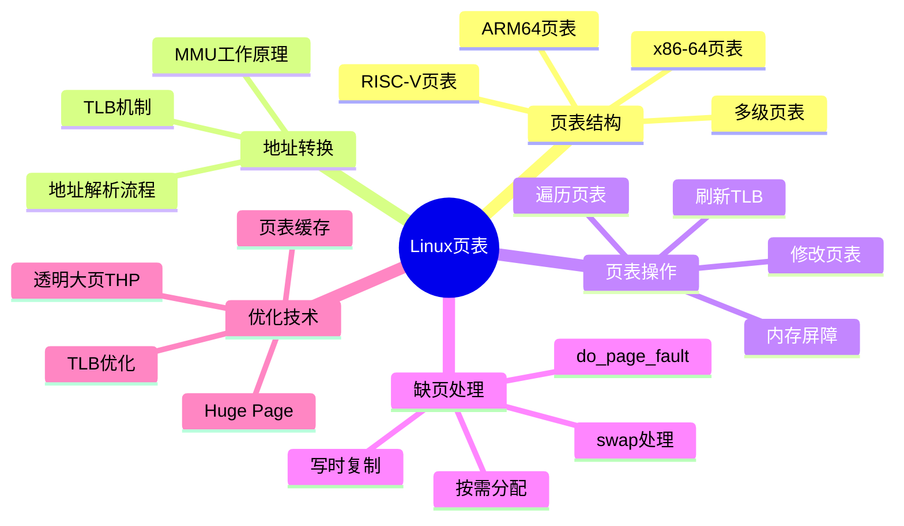

# Linux内核页表操作深度解析

> **层级定位**: 04 Industrial Scenarios / 13 Linux Kernel / 01 Page Table Operations
> **对应标准**: Linux Kernel 5.x/6.x, Intel SDM Vol.3A, ARM ARM DDI 0487
> **难度级别**: L5 综合 (系统级编程)
> **预估学习时间**: 16-24 小时

---

## 📋 本节概要

| 属性 | 内容 |
|:-----|:-----|
| **核心概念** | 多级页表、MMU、TLB、PTE位域、缺页处理、huge page、页表遍历 |
| **前置知识** | 虚拟内存原理、x86-64/ARM64架构、特权级/保护环 |
| **后续延伸** | KSM、NUMA、内存压缩、用户态内存管理 |
| **权威来源** | Linux Kernel源码, Intel SDM, ARM ARM, AMD APM |

---

## 🧠 知识结构思维导图



---

## 1. 概念定义

### 1.1 页表的严格定义

**页表（Page Table）** 是操作系统内核用于维护虚拟地址到物理地址映射关系的数据结构。在硬件层面，页表是由内存管理单元（MMU）遍历的层级结构。

**定义 1.1.1（页表）**：设虚拟地址空间为 $V$，物理地址空间为 $P$，页表 $PT$ 是一个映射函数：

$$PT: V \rightarrow P \cup \{\text{invalid}\}$$

对于任意虚拟地址 $va \in V$，页表要么映射到唯一的物理地址 $pa \in P$，要么标记为无效（缺页）。

**定义 1.1.2（多级页表）**：设页大小为 $S_{page}$，虚拟地址空间大小为 $2^{n}$ 位，则需要的页表层级数 $L$ 满足：

$$L = \left\lceil \frac{n - \log_2(S_{page})}{\log_2(N_{entries})} \right\rceil$$

其中 $N_{entries}$ 是每级页表的条目数（通常为512，对应9位索引）。

### 1.2 虚拟内存到物理内存的映射机制

```
┌─────────────────────────────────────────────────────────────────────────────┐
│                    虚拟内存到物理内存映射完整流程                              │
├─────────────────────────────────────────────────────────────────────────────┤
│                                                                              │
│   ┌──────────────┐         ┌──────────┐         ┌──────────────────────┐    │
│   │  虚拟地址 VA  │────────▶│   MMU    │────────▶│     物理地址 PA      │    │
│   │  (48/57位)   │         │          │         │      (52位)          │    │
│   └──────────────┘         └────┬─────┘         └──────────────────────┘    │
│                                 │                                            │
│                                 ▼                                            │
│                        ┌────────────────┐                                    │
│                        │   TLB查询      │                                    │
│                        │  (快表命中?)   │                                    │
│                        └───────┬────────┘                                    │
│                                │                                            │
│                    ┌───────────┴───────────┐                                │
│                    │ 命中                  │ 未命中                          │
│                    ▼                       ▼                                │
│            ┌──────────────┐      ┌──────────────────┐                       │
│            │ 直接返回PA   │      │  遍历多级页表    │                       │
│            │  (1-2周期)   │      │  (12-30周期)     │                       │
│            └──────────────┘      └────────┬─────────┘                       │
│                                           │                                 │
│                                           ▼                                 │
│                              ┌─────────────────────────┐                    │
│                              │ CR3 ──► PML4 ──► PDPT  │                    │
│                              │   ──► PD ──► PT ──► PTE │                    │
│                              └─────────────────────────┘                    │
│                                                                           │
└─────────────────────────────────────────────────────────────────────────────┘
```

### 1.3 MMU（内存管理单元）工作原理

**定义 1.3.1（MMU）**：MMU是CPU内部的硬件组件，负责虚拟地址到物理地址的转换、内存访问权限检查以及缓存控制。

**MMU工作流程**：

```
┌─────────────────────────────────────────────────────────────────────────────┐
│                         MMU地址转换流水线                                    │
├─────────────────────────────────────────────────────────────────────────────┤
│                                                                              │
│   Stage 1: 地址分解                                                          │
│   ┌─────────────────────────────────────────────────────────────────┐       │
│   │  VA[47:39] │ VA[38:30] │ VA[29:21] │ VA[20:12] │ VA[11:0]       │       │
│   │   PML4    │   PDPT    │    PD     │    PT     │  Offset        │       │
│   │   索引    │   索引    │   索引    │   索引    │  页内偏移      │       │
│   └─────────────────────────────────────────────────────────────────┘       │
│                               │                                              │
│   Stage 2: TLB查找                                                           │
│                               ▼                                              │
│   ┌─────────────────────────────────────────────────────────────────┐       │
│   │  TLB Tag    │  ASID  │ 物理页帧号  │  权限位  │  属性位         │       │
│   │ (VPN[47:12])│(16bit) │   (40bit)   │ R/W/X/U  │ G/A/D/C/W       │       │
│   └─────────────────────────────────────────────────────────────────┘       │
│                               │                                              │
│   Stage 3: 权限检查                                                          │
│                               ▼                                              │
│   ┌─────────────────────────────────────────────────────────────────┐       │
│   │  CPL(当前特权级) vs. U/S位 │  访问类型 vs. R/W/X位              │       │
│   │  0-2级(内核) vs. 3级(用户) │  读/写/执行权限检查                │       │
│   └─────────────────────────────────────────────────────────────────┘       │
│                               │                                              │
│   Stage 4: 物理地址合成                                                      │
│                               ▼                                              │
│   ┌─────────────────────────────────────────────────────────────────┐       │
│   │  PA = (PFN << 12) | Offset[11:0]                               │       │
│   │  物理页帧号左移12位 + 页内偏移 = 52位物理地址                   │       │
│   └─────────────────────────────────────────────────────────────────┘       │
│                                                                              │
└─────────────────────────────────────────────────────────────────────────────┘
```

### 1.4 TLB（转换后备缓冲器）机制

**定义 1.4.1（TLB）**：TLB是MMU内部的专用高速缓存，用于存储最近使用的虚拟地址到物理地址的映射，避免每次访问都要遍历多级页表。

```
┌─────────────────────────────────────────────────────────────────────────────┐
│                      TLB结构与组织方式                                       │
├─────────────────────────────────────────────────────────────────────────────┤
│                                                                              │
│  TLB类型：                                                                   │
│  ┌─────────────────┬──────────────────────────────────────────────────┐    │
│  │ L1指令TLB (iTLB)│  缓存代码页映射，通常32-64项，4路组相联         │    │
│  ├─────────────────┼──────────────────────────────────────────────────┤    │
│  │ L1数据TLB (dTLB)│  缓存数据页映射，通常32-64项，4路组相联         │    │
│  ├─────────────────┼──────────────────────────────────────────────────┤    │
│  │ L2统一TLB (uTLB)│  指令/数据共享，通常512-1536项，8路组相联       │    │
│  └─────────────────┴──────────────────────────────────────────────────┘    │
│                                                                              │
│  TLB条目结构（x86-64，Intel）：                                              │
│  ┌───────────┬─────────┬──────────┬──────────┬──────────┬──────────┐        │
│  │ 字段      │ 位宽    │ 说明     │ 字段     │ 位宽     │ 说明     │        │
│  ├───────────┼─────────┼──────────┼──────────┼──────────┼──────────┤        │
│  │ VPN       │ 36位    │ 虚页号   │ PFN      │ 40位     │ 物理页帧 │        │
│  ├───────────┼─────────┼──────────┼──────────┼──────────┼──────────┤        │
│  │ G         │ 1位     │ 全局位   │ ASID     │ 12位     │ 地址空间 │        │
│  ├───────────┼─────────┼──────────┼──────────┼──────────┼──────────┤        │
│  │ P         │ 1位     │ 存在位   │ R/W      │ 1位      │ 读写权限 │        │
│  ├───────────┼─────────┼──────────┼──────────┼──────────┼──────────┤        │
│  │ U/S       │ 1位     │ 用户/超管│ XD       │ 1位      │ 不可执行 │        │
│  ├───────────┼─────────┼──────────┼──────────┼──────────┼──────────┤        │
│  │ A         │ 1位     │ 访问位   │ D        │ 1位      │ 脏位     │        │
│  ├───────────┼─────────┼──────────┼──────────┼──────────┼──────────┤        │
│  │ PCID      │ 12位    │ 进程上下文│ V       │ 1位      │ 有效位   │        │
│  └───────────┴─────────┴──────────┴──────────┴──────────┴──────────┘        │
│                                                                              │
└─────────────────────────────────────────────────────────────────────────────┘
```

**TLB维护指令**：

| 指令 | 操作码 | 功能 | 特权级 |
|:-----|:-------|:-----|:-------|
| `INVLPG` | `0F 01 /7` | 使指定虚拟地址的TLB条目失效 | Ring 0 |
| `INVEPT` | `66 0F 38 80` | 使EPT（扩展页表）条目失效 | Ring 0 |
| `INVVPID` | `66 0F 38 81` | 使VPID关联的TLB条目失效 | Ring 0 |
| `MOV CR3` | `0F 22` | 切换页表基址（隐式刷新非全局TLB） | Ring 0 |
| `MOV CR4.PGE` | - | 修改全局页使能（刷新所有TLB） | Ring 0 |

### 1.5 页表项（PTE）的位域定义

**x86-64页表项（64位）详细位域**：

```
┌─────────────────────────────────────────────────────────────────────────────┐
│                    x86-64 页表项 (PTE) 位域定义                              │
├─────────────────────────────────────────────────────────────────────────────┤
│                                                                              │
│  63  62-59 58 57 56 55 52 51         12 11 10 9 8 7 6 5 4 3 2 1 0          │
│  ┌──┬────┬──┬──┬──┬────┬─────────────────┬──┬──┬─┬─┬─┬─┬─┬─┬─┬─┬─┬─┐        │
│  │XD│IGN │PK│  │  │ PFN(40位物理页帧号) │PAT│G │P│D│A│C│W│U│W│P│  │        │
│  │  │    │  │  │  │                     │   │  │S│  │ │D│T│/│R│ │  │        │
│  └──┴────┴──┴──┴──┴────┴─────────────────┴──┴──┴─┴─┴─┴─┴─┴─┴─┴─┴─┴─┘        │
│                                                                              │
│  位定义：                                                                    │
│  ┌────────┬────────┬─────────────────────────────────────────────────────┐  │
│  │ 位     │ 符号   │ 功能描述                                            │  │
│  ├────────┼────────┼─────────────────────────────────────────────────────┤  │
│  │ 0      │ P      │ Present（存在位）: 1=页在内存中, 0=缺页            │  │
│  ├────────┼────────┼─────────────────────────────────────────────────────┤  │
│  │ 1      │ R/W    │ Read/Write（读写位）: 0=只读, 1=可读写             │  │
│  ├────────┼────────┼─────────────────────────────────────────────────────┤  │
│  │ 2      │ U/S    │ User/Supervisor: 0=仅内核, 1=用户可访问            │  │
│  ├────────┼────────┼─────────────────────────────────────────────────────┤  │
│  │ 3      │ PWT    │ Page Write-Through: 写透缓存策略                    │  │
│  ├────────┼────────┼─────────────────────────────────────────────────────┤  │
│  │ 4      │ PCD    │ Page Cache Disable: 禁用缓存                        │  │
│  ├────────┼────────┼─────────────────────────────────────────────────────┤  │
│  │ 5      │ A      │ Accessed（访问位）: CPU访问后自动置1                │  │
│  ├────────┼────────┼─────────────────────────────────────────────────────┤  │
│  │ 6      │ D      │ Dirty（脏位）: 写入后自动置1，用于页面置换          │  │
│  ├────────┼────────┼─────────────────────────────────────────────────────┤  │
│  │ 7      │ PS/PAT │ Page Size（大页位）/ Page Attribute Table          │  │
│  ├────────┼────────┼─────────────────────────────────────────────────────┤  │
│  │ 8      │ G      │ Global（全局位）: 1=切换CR3时不刷新TLB             │  │
│  ├────────┼────────┼─────────────────────────────────────────────────────┤  │
│  │ 9-11   │ AVL    │ Available: 软件可用位，Linux用于存储页类型信息      │  │
│  ├────────┼────────┼─────────────────────────────────────────────────────┤  │
│  │ 12     │ PAT    │ Page Attribute Table（页属性表）                    │  │
│  ├────────┼────────┼─────────────────────────────────────────────────────┤  │
│  │ 51:12  │ PFN    │ Physical Frame Number（物理页帧号）                 │  │
│  ├────────┼────────┼─────────────────────────────────────────────────────┤  │
│  │ 62:59  │ PK     │ Protection Key（保护键，MPK特性）                   │  │
│  ├────────┼────────┼─────────────────────────────────────────────────────┤  │
│  │ 63     │ XD     │ Execute Disable（不可执行位，NX特性）               │  │
│  └────────┴────────┴─────────────────────────────────────────────────────┘  │
│                                                                              │
└─────────────────────────────────────────────────────────────────────────────┘
```

---

## 2. 属性维度矩阵

### 2.1 x86/x64页表级别对比

| 特性 | PML5 (57-bit) | PML4 (48-bit) | PDPT | PD | PT |
|:-----|:--------------|:--------------|:-----|:---|:---|
| **名称** | Page Map Level 5 | Page Map Level 4 | Page Directory Pointer Table | Page Directory | Page Table |
| **x86-64** | 支持（可选） | 支持 | 支持 | 支持 | 支持 |
| **索引位** | VA[56:48] | VA[47:39] | VA[38:30] | VA[29:21] | VA[20:12] |
| **条目数** | 512 | 512 | 512 | 512 | 512 |
| **条目大小** | 8字节 | 8字节 | 8字节 | 8字节 | 8字节 |
| **表大小** | 4KB | 4KB | 4KB | 4KB | 4KB |
| **覆盖范围** | 128PB/表 | 512GB/表 | 1GB/表 | 2MB/表 | 4KB/页 |
| **支持大页** | 否 | 否 | 1GB页 | 2MB页 | 4KB页 |
| **Linux类型** | `p5d_t` | `pgd_t` | `p4d_t`/`pud_t` | `pmd_t` | `pte_t` |

### 2.2 ARM64页表级别对比

| 特性 | L0 (64KB granule) | L1 | L2 | L3 |
|:-----|:------------------|:---|:---|:---|
| **名称** | Level 0 | Level 1 | Level 2 | Level 3 |
| **4KB粒度** | VA[47:39] | VA[38:30] | VA[29:21] | VA[20:12] |
| **16KB粒度** | VA[47:43] | VA[42:34] | VA[33:25] | VA[24:14] |
| **64KB粒度** | VA[47:42] | VA[41:36] | VA[35:29] | VA[28:16] |
| **条目大小** | 8字节 | 8字节 | 8字节 | 8字节 |
| **4KB大页** | 512GB | 1GB | 2MB | 4KB |
| **16KB大页** | 64TB | 128GB | 32MB | 16KB |
| **64KB大页** | 4PB | 64GB | 32MB | 64KB |
| **访问权限** | AP[2:1] | AP[2:1] | AP[2:1] | AP[2:1] |
| **内存属性** | Index | Index | Index | Index |
| **Linux类型** | `pgd_t` | `p4d_t`/`pud_t` | `pmd_t` | `pte_t` |

### 2.3 页大小对比

| 页大小 | x86-64支持 | ARM64支持 | 粒度 | 对齐要求 | 典型用途 |
|:-------|:-----------|:----------|:-----|:---------|:---------|
| **4KB** | ✅ 基础页 | ✅ 4KB粒度 | 4KB | 4KB对齐 | 通用内存、栈、堆 |
| **8KB** | ❌ 不支持 | ✅ 8KB粒度 | 8KB | 8KB对齐 | 某些ARM系统 |
| **16KB** | ❌ 不支持 | ✅ 16KB粒度 | 16KB | 16KB对齐 | ARM服务器 |
| **64KB** | ❌ 不支持 | ✅ 64KB粒度 | 64KB | 64KB对齐 | ARM Mac/iOS |
| **2MB** | ✅ Huge Page | ✅ 4KB粒度L2 | 2MB | 2MB对齐 | 大块内存、数据库 |
| **16MB** | ❌ 不支持 | ✅ 16KB粒度L1 | 16MB | 16MB对齐 | ARM大页 |
| **32MB** | ❌ 不支持 | ✅ 64KB粒度L2 | 32MB | 32MB对齐 | ARM大页 |
| **1GB** | ✅ Giant Page | ✅ 4KB粒度L1 | 1GB | 1GB对齐 | 内核内存、显存 |
| **512GB** | ✅ (PML4) | ❌ 不支持 | 512GB | 512GB对齐 | 极大规模映射 |

### 2.4 页表项标志位详解

| 标志位 | x86-64位 | ARM64位 | 功能 | Linux宏 | 使用场景 |
|:-------|:---------|:--------|:-----|:--------|:---------|
| **P** | 0 | - | Present（存在） | `_PAGE_PRESENT` | 页是否在内存 |
| **R/W** | 1 | AP[1] | Read/Write（读写） | `_PAGE_RW` | 控制写权限 |
| **U/S** | 2 | AP[2] | User/Supervisor | `_PAGE_USER` | 用户态访问 |
| **PWT** | 3 | - | Write-Through | `_PAGE_PWT` | 缓存写策略 |
| **PCD** | 4 | - | Cache Disable | `_PAGE_PCD` | MMIO内存 |
| **A** | 5 | AF | Accessed（访问） | `_PAGE_ACCESSED` | 页面置换算法 |
| **D** | 6 | DBM | Dirty（脏） | `_PAGE_DIRTY` | 页面回写判断 |
| **PS** | 7 | - | Page Size（大页） | `_PAGE_PSE` | 大页使能 |
| **G** | 8 | nG | Global（全局） | `_PAGE_GLOBAL` | 内核页、VDSO |
| **PAT** | 12 | - | Page Attribute | - | 内存类型 |
| **XD/NX** | 63 | UXN/PXN | Execute Disable | `_PAGE_NX` | 数据段保护 |
| **SW** | 9-11 | 55-58 | Software Use | - | Linux内部使用 |
| **PK** | 62:59 | - | Protection Key | - | MPK内存保护 |

### 2.5 Linux内核页表操作API对比

| API类别 | 函数/宏 | 功能 | 参数 | 返回值 | 锁要求 |
|:--------|:--------|:-----|:-----|:-------|:-------|
| **PGD操作** | `pgd_offset(mm, addr)` | 获取PGD条目 | `mm_struct*`, `ulong` | `pgd_t*` | 无 |
| | `pgd_none(pgd)` | 检查PGD是否为空 | `pgd_t` | `int` | 无 |
| | `pgd_bad(pgd)` | 检查PGD是否无效 | `pgd_t` | `int` | 无 |
| | `set_pgd(pgdp, pgd)` | 设置PGD值 | `pgd_t*`, `pgd_t` | void | `mm->page_table_lock` |
| **P4D操作** | `p4d_offset(pgdp, addr)` | P4D偏移计算 | `pgd_t*`, `ulong` | `p4d_t*` | 无 |
| | `p4d_alloc(mm, pgdp, addr)` | 分配P4D表 | `mm_struct*`, `pgd_t*`, `ulong` | `p4d_t*` | `mm->page_table_lock` |
| **PUD操作** | `pud_offset(p4dp, addr)` | PUD偏移计算 | `p4d_t*`, `ulong` | `pud_t*` | 无 |
| | `pud_alloc(mm, p4dp, addr)` | 分配PUD表 | `mm_struct*`, `p4d_t*`, `ulong` | `pud_t*` | `mm->page_table_lock` |
| | `pud_none(pud)` | 检查PUD是否为空 | `pud_t` | `int` | 无 |
| | `pud_present(pud)` | 检查PUD是否存在 | `pud_t` | `int` | 无 |
| **PMD操作** | `pmd_offset(pudp, addr)` | PMD偏移计算 | `pud_t*`, `ulong` | `pmd_t*` | 无 |
| | `pmd_alloc(mm, pudp, addr)` | 分配PMD表 | `mm_struct*`, `pud_t*`, `ulong` | `pmd_t*` | `mm->page_table_lock` |
| | `pmd_trans_huge(pmd)` | 检查透明大页 | `pmd_t` | `int` | 无 |
| | `pmd_page(pmd)` | 获取PMD对应页 | `pmd_t` | `struct page*` | 无 |
| **PTE操作** | `pte_offset_map(pmdp, addr)` | 映射PTE表 | `pmd_t*`, `ulong` | `pte_t*` | 无 |
| | `pte_offset_map_lock(mm, pmdp, addr, ptlp)` | 映射并加锁 | `mm_struct*`, `pmd_t*`, `ulong`, `spinlock_t**` | `pte_t*` | 获取PTE锁 |
| | `pte_unmap_unlock(ptep, ptl)` | 解锁并解映射 | `pte_t*`, `spinlock_t*` | void | 释放PTE锁 |
| | `pte_present(pte)` | 检查PTE存在 | `pte_t` | `int` | 无 |
| | `pte_write(pte)` | 检查写权限 | `pte_t` | `int` | 无 |
| | `pte_young(pte)` | 检查访问位 | `pte_t` | `int` | 无 |
| | `pte_dirty(pte)` | 检查脏位 | `pte_t` | `int` | 无 |
| | `pte_pfn(pte)` | 获取页帧号 | `pte_t` | `ulong` | 无 |
| | `pfn_pte(pfn, prot)` | 构建PTE | `ulong`, `pgprot_t` | `pte_t` | 无 |
| | `set_pte_at(mm, addr, ptep, pte)` | 设置PTE | `mm_struct*`, `ulong`, `pte_t*`, `pte_t` | void | PTE锁 |
| | `pte_clear(mm, addr, ptep)` | 清除PTE | `mm_struct*`, `ulong`, `pte_t*` | void | PTE锁 |
| **TLB操作** | `flush_tlb_all()` | 刷新全部TLB | void | void | 全局刷新 |
| | `flush_tlb_mm(mm)` | 刷新指定mm | `mm_struct*` | void | 进程切换 |
| | `flush_tlb_page(vma, addr)` | 刷新指定页 | `vm_area_struct*`, `ulong` | void | 页表修改后 |
| | `flush_tlb_range(vma, start, end)` | 刷新范围 | `vm_area_struct*`, `ulong`, `ulong` | void | munmap后 |
| | `flush_tlb_kernel_page(addr)` | 刷新内核页 | `ulong` | void | 内核页修改 |
| | `invlpg(addr)` | 单页TLB失效 | `ulong` | void | x86特有 |

---

## 3. 形式化描述

### 3.1 地址转换的数学过程

**定义 3.1.1（虚拟地址分解）**：设虚拟地址 $VA$ 为 $n$ 位，页大小为 $2^{p}$ 字节，每级页表有 $2^{k}$ 个条目，则：

$$VA = \{V_{L-1}, V_{L-2}, \ldots, V_{0}, offset\}$$

其中：

- $L = \lceil \frac{n-p}{k} \rceil$ 为页表层级数
- $V_i = \lfloor \frac{VA}{2^{p + i \cdot k}} \rfloor \mod 2^{k}$ 为第 $i$ 级索引
- $offset = VA \mod 2^{p}$ 为页内偏移

**定理 3.1.1（地址转换）**：给定 $L$ 级页表，虚拟地址到物理地址的转换函数 $\Phi$ 定义为：

$$\Phi(VA) = PFN_L \cdot 2^{p} + offset$$

其中 $PFN_L$ 通过递推计算：

$$\begin{aligned}
PFN_0 &= \text{CR3} \\
PFN_{i+1} &= \text{Table}_i[V_i].PFN \quad \text{for } i = 0, \ldots, L-1
\end{aligned}$$

**约束条件**：
$$\forall i \in [0, L-1]: \text{Table}_i[V_i].P = 1$$

**x86-64 4级页表具体公式**：

```
┌─────────────────────────────────────────────────────────────────────────────┐
│                    x86-64 4级页表地址转换公式                                │
├─────────────────────────────────────────────────────────────────────────────┤
│                                                                              │
│  给定48位虚拟地址 VA[47:0]：                                                 │
│                                                                              │
│  PGD_index = VA[47:39]    // 9位                                           │
│  PUD_index = VA[38:30]    // 9位                                           │
│  PMD_index = VA[29:21]    // 9位                                           │
│  PTE_index = VA[20:12]    // 9位                                           │
│  offset    = VA[11:0]     // 12位                                          │
│                                                                              │
│  转换过程：                                                                  │
│                                                                              │
│  1. PGD_base = CR3 & ~0xFFF                                                 │
│     PGD_entry = PGD_base[PGD_index]                                         │
│     assert(PGD_entry.P == 1)                                                │
│                                                                              │
│  2. PUD_base = PGD_entry.PFN << 12                                          │
│     PUD_entry = PUD_base[PUD_index]                                         │
│     assert(PUD_entry.P == 1)                                                │
│                                                                              │
│  3. PMD_base = PUD_entry.PFN << 12                                          │
│     PMD_entry = PMD_base[PMD_index]                                         │
│     assert(PMD_entry.P == 1)                                                │
│     if (PMD_entry.PS == 1)  // 2MB大页                                      │
│        PA = (PMD_entry.PFN << 21) | VA[20:0]                               │
│        return PA                                                            │
│                                                                              │
│  4. PTE_base = PMD_entry.PFN << 12                                          │
│     PTE_entry = PTE_base[PTE_index]                                         │
│     assert(PTE_entry.P == 1)                                                │
│                                                                              │
│  5. PA = (PTE_entry.PFN << 12) | offset                                     │
│     return PA                                                               │
│                                                                              │
└─────────────────────────────────────────────────────────────────────────────┘
```

### 3.2 多级页表遍历算法

**算法 3.2.1（页表遍历查找PTE）**：

```
算法: WALK_PAGE_TABLE(mm, va)
输入: mm_struct *mm    // 内存描述符
      unsigned long va // 虚拟地址
输出: pte_t *pte       // PTE指针，NULL表示未找到

1. pgd ← pgd_offset(mm, va)
2. if pgd_none(*pgd) ∨ pgd_bad(*pgd) then
3.     return NULL

4. p4d ← p4d_offset(pgd, va)
5. if p4d_none(*p4d) ∨ p4d_bad(*p4d) then
6.     return NULL

7. pud ← pud_offset(p4d, va)
8. if pud_none(*pud) ∨ pud_bad(*pud) then
9.     return NULL

10. pmd ← pmd_offset(pud, va)
11. if pmd_none(*pmd) ∨ pmd_bad(*pmd) then
12.     return NULL

13. // 检查透明大页
14. if pmd_trans_huge(*pmd) then
15.     return (pte_t *)pmd   // 返回PMD作为"大PTE"

16. pte ← pte_offset_map(pmd, va)
17. return pte
```

**时间复杂度分析**：
- 最优情况（TLB命中）：$O(1)$
- 平均情况（4级页表遍历）：$O(4) = O(1)$
- 最坏情况（页表未分配，需要分配中间级）：$O(4 + k)$，其中 $k$ 为需要分配的级数

### 3.3 缺页异常处理流程

**状态机描述**：

```
┌─────────────────────────────────────────────────────────────────────────────┐
│                      缺页异常处理状态机                                      │
├─────────────────────────────────────────────────────────────────────────────┤
│                                                                              │
│                             ┌──────────┐                                   │
│                             │  START   │                                   │
│                             └────┬─────┘                                   │
│                                  │                                         │
│                                  ▼                                         │
│                    ┌─────────────────────────┐                            │
│                    │  读取CR2获取故障地址    │                            │
│                    │  获取error_code         │                            │
│                    └─────────────┬───────────┘                            │
│                                  │                                         │
│                                  ▼                                         │
│                    ┌─────────────────────────┐                            │
│                    │  查找VMA (find_vma)     │                            │
│                    └─────────────┬───────────┘                            │
│                                  │                                         │
│                    ┌─────────────┴─────────────┐                          │
│                    │                             │                          │
│                    ▼                             ▼                          │
│           ┌──────────────┐            ┌─────────────────┐                  │
│           │  VMA == NULL │            │  VMA包含地址    │                  │
│           │  或地址无效  │            │                 │                  │
│           └──────┬───────┘            └────────┬────────┘                  │
│                  │                             │                            │
│                  ▼                             ▼                            │
│           ┌──────────────┐            ┌─────────────────┐                  │
│           │  发送SIGSEGV │            │  检查权限匹配   │                  │
│           │  (段错误)    │            └────────┬────────┘                  │
│           └──────────────┘                     │                            │
│                                                │                            │
│                           ┌────────────────────┼────────────────────┐      │
│                           │                    │                    │      │
│                           ▼                    ▼                    ▼      │
│                  ┌──────────────┐    ┌──────────────┐    ┌──────────────┐  │
│                  │  权限不匹配  │    │  匿名页缺页  │    │  文件页缺页  │  │
│                  └──────┬───────┘    └──────┬───────┘    └──────┬───────┘  │
│                         │                   │                    │         │
│                         ▼                   ▼                    ▼         │
│                  ┌──────────────┐    ┌──────────────┐    ┌──────────────┐  │
│                  │  发送SIGSEGV │    │do_anonymous  │    │  do_fault    │  │
│                  │              │    │    _page     │    │              │  │
│                  └──────────────┘    └──────┬───────┘    └──────┬───────┘  │
│                                             │                    │         │
│                                             └────────┬───────────┘         │
│                                                      │                     │
│                                                      ▼                     │
│                                           ┌─────────────────┐              │
│                                           │  分配物理页     │              │
│                                           │  建立页映射     │              │
│                                           │  刷新TLB        │              │
│                                           └────────┬────────┘              │
│                                                    │                       │
│                                                    ▼                       │
│                                             ┌──────────┐                   │
│                                             │  RETURN  │                   │
│                                             └──────────┘                   │
│                                                                              │
└─────────────────────────────────────────────────────────────────────────────┘
```

**算法 3.3.1（缺页处理核心算法）**：

```
算法: HANDLE_PTE_FAULT(vma, address, pmd, flags)
输入: vm_area_struct *vma    // 虚拟内存区域
      unsigned long address // 故障地址
      pmd_t *pmd            // PMD指针
      unsigned int flags    // 访问标志
输出: int                   // VM_FAULT_xxx 状态码

1. ptep ← pte_offset_map_lock(vma->vm_mm, pmd, address, &ptl)
2. entry ← *ptep
3.
4. // 情况1: 页不存在（新分配或swap）
5. if ¬pte_present(entry) then
6.     if pte_none(entry) then
7.         if vma_is_anonymous(vma) then
8.             return do_anonymous_page(vma, address, ptep, pmd, flags)
9.         else
10.            return do_fault(vma, address, ptep, pmd, flags)
11.    else
12.        return do_swap_page(vma, address, ptep, pmd, flags, entry)
13.
14. // 情况2: 页存在但权限不足（写时复制）
15. if flags.FAULT_FLAG_WRITE ∧ ¬pte_write(entry) then
16.    return do_wp_page(vma, address, ptep, pmd, ptl, entry)
17.
18. // 情况3: 其他情况（可能是spurious fault）
19. pte_unmap_unlock(ptep, ptl)
20. return 0
```

---

## 4. 示例矩阵（内核级代码）

### 4.1 页表遍历实现（模拟内核逻辑）

```c
/*
 * 页表遍历实现 - 模拟Linux内核逻辑
 * 适用于x86-64 4级页表
 */

# include <linux/mm.h>
# include <linux/pgtable.h>
# include <asm/pgalloc.h>

/*
 * 完整页表遍历 - 从PGD到PTE
 * 返回PTE指针，如果中间级不存在则返回NULL
 */
pte_t *walk_page_table(struct mm_struct *mm, unsigned long addr)
{
    pgd_t *pgd;
    p4d_t *p4d;
    pud_t *pud;
    pmd_t *pmd;
    pte_t *pte;

    /* Level 1: PGD (Page Global Directory) */
    pgd = pgd_offset(mm, addr);
    if (pgd_none(*pgd) || pgd_bad(*pgd)) {
        pr_debug("PGD not present for addr %lx\n", addr);
        return NULL;
    }

    /* Level 2: P4D (Page 4th Directory) - 兼容5级页表 */
    p4d = p4d_offset(pgd, addr);
    if (p4d_none(*p4d) || p4d_bad(*p4d)) {
        pr_debug("P4D not present for addr %lx\n", addr);
        return NULL;
    }

    /* Level 3: PUD (Page Upper Directory) */
    pud = pud_offset(p4d, addr);
    if (pud_none(*pud) || pud_bad(*pud)) {
        pr_debug("PUD not present for addr %lx\n", addr);
        return NULL;
    }

    /* Level 4: PMD (Page Middle Directory) */
    pmd = pmd_offset(pud, addr);
    if (pmd_none(*pmd) || pmd_bad(*pmd)) {
        pr_debug("PMD not present for addr %lx\n", addr);
        return NULL;
    }

    /* 检查透明大页 - PMD级大页 */
    if (pmd_trans_huge(*pmd)) {
        pr_debug("Transparent huge page at PMD for addr %lx\n", addr);
        /* 返回PMD的别名作为"大PTE" */
        return (pte_t *)pmd;
    }

    /* Level 5: PTE (Page Table Entry) */
    pte = pte_offset_map(pmd, addr);

    return pte;
}

/*
 * 带锁的页表遍历 - 线程安全版本
 */
pte_t *walk_page_table_locked(struct mm_struct *mm, unsigned long addr,
                               spinlock_t **ptlp)
{
    pgd_t *pgd;
    p4d_t *p4d;
    pud_t *pud;
    pmd_t *pmd;
    pte_t *pte;

    pgd = pgd_offset(mm, addr);
    if (pgd_none(*pgd))
        return NULL;

    p4d = p4d_offset(pgd, addr);
    if (p4d_none(*p4d))
        return NULL;

    pud = pud_offset(p4d, addr);
    if (pud_none(*pud))
        return NULL;

    pmd = pmd_offset(pud, addr);
    if (pmd_none(*pmd))
        return NULL;

    /* 使用pte_offset_map_lock获取PTE并加锁 */
    pte = pte_offset_map_lock(mm, pmd, addr, ptlp);

    return pte;
}
```

### 4.2 虚拟地址到物理地址转换

```c
/*
 * 虚拟地址到物理地址转换
 * 模拟内核中的vtop逻辑
 */

# include <linux/mm.h>
# include <asm/page.h>

/*
 * 用户态虚拟地址转物理地址
 * 注意：此函数仅用于调试，实际内核中有专门的API
 */
phys_addr_t virt_to_phys_user(struct mm_struct *mm, unsigned long vaddr)
{
    pgd_t *pgd;
    p4d_t *p4d;
    pud_t *pud;
    pmd_t *pmd;
    pte_t *pte;
    phys_addr_t paddr = 0;
    unsigned long pfn;

    pgd = pgd_offset(mm, vaddr);
    if (pgd_none(*pgd) || pgd_bad(*pgd))
        return 0;

    p4d = p4d_offset(pgd, vaddr);
    if (p4d_none(*p4d) || p4d_bad(*p4d))
        return 0;

    pud = pud_offset(p4d, vaddr);
    if (pud_none(*pud) || pud_bad(*pud))
        return 0;

    pmd = pmd_offset(pud, vaddr);
    if (pmd_none(*pmd) || pmd_bad(*pmd))
        return 0;

    /* 处理2MB大页 */
    if (pmd_large(*pmd)) {
        pfn = pmd_pfn(*pmd);
        paddr = (pfn << PAGE_SHIFT) | (vaddr & ~PMD_MASK);
        return paddr;
    }

    pte = pte_offset_map(pmd, vaddr);
    if (!pte_present(*pte)) {
        pte_unmap(pte);
        return 0;
    }

    pfn = pte_pfn(*pte);
    paddr = (pfn << PAGE_SHIFT) | (vaddr & ~PAGE_MASK);

    pte_unmap(pte);
    return paddr;
}

/*
 * 内核虚拟地址转物理地址（简化版）
 * 实际使用__pa()宏
 */
static inline phys_addr_t __pa_kernel(void *vaddr)
{
    /* 线性映射区域: phys = virt - PAGE_OFFSET */
    return (phys_addr_t)(vaddr) - PAGE_OFFSET;
}

/*
 * 物理地址转内核虚拟地址
 */
static inline void *__va_kernel(phys_addr_t paddr)
{
    return (void *)(paddr + PAGE_OFFSET);
}
```

### 4.3 页分配与释放（伙伴系统模拟）

```c
/*
 * 页分配与释放 - 模拟伙伴系统核心逻辑
 */

# include <linux/mm.h>
# include <linux/gfp.h>
# include <linux/page-flags.h>
# include <asm/pgalloc.h>

/*
 * 分配页表页（4KB对齐）
 * 实际使用alloc_page()或__get_free_page()
 */
void *alloc_page_table(struct mm_struct *mm)
{
    struct page *page;
    void *table;

    /* GFP_KERNEL: 可能睡眠，用于进程上下文 */
    /* __GFP_ZERO: 清零分配的页 */
    page = alloc_page(GFP_KERNEL | __GFP_ZERO);
    if (!page)
        return NULL;

    /* 增加页表页计数 */
    if (mm)
        mm->pgtables_bytes += PAGE_SIZE;

    /* 返回虚拟地址 */
    table = page_address(page);

    /* 确保页表项已清零（安全考虑） */
    memset(table, 0, PAGE_SIZE);

    return table;
}

/*
 * 释放页表页
 */
void free_page_table(struct mm_struct *mm, void *table)
{
    struct page *page;

    if (!table)
        return;

    page = virt_to_page(table);

    /* 减少页表页计数 */
    if (mm)
        mm->pgtables_bytes -= PAGE_SIZE;

    /* 释放页 */
    __free_page(page);
}

/*
 * 分配并初始化PTE页表
 */
pte_t *pte_alloc_one(struct mm_struct *mm, unsigned long addr)
{
    pte_t *pte;

    pte = (pte_t *)alloc_page_table(mm);
    if (!pte)
        return NULL;

    /* 初始化页表条目为无效 */
    /* 已在alloc_page_table中通过__GFP_ZERO清零 */

    return pte;
}

/*
 * 批量释放页表（递归释放）
 * 这是munmap的核心逻辑
 */
void free_pte_range(struct mm_struct *mm, pmd_t *pmd,
                    unsigned long addr, unsigned long end)
{
    pte_t *pte, *pte_base;
    unsigned long pfn;

    pte_base = pte_offset_map(pmd, addr);
    pte = pte_base;

    for (; addr < end; addr += PAGE_SIZE, pte++) {
        if (!pte_present(*pte))
            continue;

        pfn = pte_pfn(*pte);
        if (pfn_valid(pfn)) {
            struct page *page = pfn_to_page(pfn);

            /* 减少引用计数 */
            if (page_mapcount(page) > 0)
                page_mapcount_reset(page);

            /* 释放页 */
            if (!PageReserved(page))
                __free_page(page);
        }

        /* 清除PTE */
        pte_clear(mm, addr, pte);
    }

    pte_unmap(pte_base);

    /* 释放PTE页表本身 */
    pmd_clear(pmd);
    free_page_table(mm, pte_base);
}
```

### 4.4 内存映射（mmap实现原理）

```c
/*
 * 内存映射实现 - 模拟mmap核心逻辑
 */

# include <linux/mm.h>
# include <linux/mman.h>
# include <linux/fs.h>
# include <linux/file.h>

/*
 * 建立虚拟内存区域（VMA）
 * 模拟do_mmap核心逻辑
 */
unsigned long do_mmap_pgoff(struct file *file, unsigned long addr,
                            unsigned long len, unsigned long prot,
                            unsigned long flags, unsigned long pgoff)
{
    struct mm_struct *mm = current->mm;
    struct vm_area_struct *vma, *prev;
    unsigned long vm_flags;
    int error;

    /* 参数验证 */
    if (!len)
        return -EINVAL;

    /* 页对齐 */
    len = PAGE_ALIGN(len);
    if (!len)
        return -ENOMEM;

    /* 计算VM标志 */
    vm_flags = calc_vm_prot_bits(prot) | calc_vm_flag_bits(flags);

    /* 文件映射 */
    if (file) {
        /* 检查文件访问权限 */
        if ((prot & PROT_READ) && !(file->f_mode & FMODE_READ))
            return -EACCES;

        if ((flags & MAP_SHARED) && (prot & PROT_WRITE) &&
            !(file->f_mode & FMODE_WRITE))
            return -EACCES;

        /* 设置VM标志 */
        vm_flags |= VM_MAYREAD | VM_MAYWRITE | VM_MAYEXEC;
        if (flags & MAP_SHARED)
            vm_flags |= VM_SHARED | VM_MAYSHARE;
    } else {
        /* 匿名映射 */
        vm_flags |= VM_SHARED | VM_MAYSHARE;
    }

    /* 查找合适的虚拟地址空间 */
    addr = get_unmapped_area(file, addr, len, pgoff, flags);
    if (IS_ERR_VALUE(addr))
        return addr;

    /* 创建新的VMA */
    vma = kmem_cache_zalloc(vm_area_cachep, GFP_KERNEL);
    if (!vma)
        return -ENOMEM;

    vma->vm_mm = mm;
    vma->vm_start = addr;
    vma->vm_end = addr + len;
    vma->vm_flags = vm_flags;
    vma->vm_page_prot = vm_get_page_prot(vm_flags);
    vma->vm_pgoff = pgoff;

    if (file) {
        vma->vm_file = get_file(file);
        error = file->f_op->mmap(file, vma);
        if (error) {
            fput(file);
            kmem_cache_free(vm_area_cachep, vma);
            return error;
        }
    }

    /* 插入VMA到mm的VMA列表 */
    error = insert_vm_struct(mm, vma);
    if (error) {
        kmem_cache_free(vm_area_cachep, vma);
        return error;
    }

    /* 增加映射计数 */
    mm->total_vm += len >> PAGE_SHIFT;
    if (vm_flags & VM_LOCKED)
        mm->locked_vm += len >> PAGE_SHIFT;

    return addr;
}

/*
 * 处理文件映射缺页
 * 将文件内容读入页缓存并建立映射
 */
int do_file_fault(struct vm_area_struct *vma, unsigned long address,
                  pte_t *pte, pmd_t *pmd, unsigned int flags)
{
    struct file *file = vma->vm_file;
    struct address_space *mapping = file->f_mapping;
    struct page *page;
    pgoff_t pgoff;
    int ret = 0;

    /* 计算文件偏移 */
    pgoff = ((address - vma->vm_start) >> PAGE_SHIFT) + vma->vm_pgoff;

    /* 从页缓存获取或创建页 */
    page = find_get_page(mapping, pgoff);
    if (!page) {
        /* 页不在缓存，需要读取 */
        page = alloc_page_vma(GFP_HIGHUSER_MOVABLE, vma, address);
        if (!page)
            return VM_FAULT_OOM;

        /* 读取文件内容 */
        ret = mapping->a_ops->readpage(file, page);
        if (ret) {
            put_page(page);
            return VM_FAULT_SIGBUS;
        }

        /* 添加到页缓存 */
        add_to_page_cache_lru(page, mapping, pgoff, GFP_KERNEL);
    }

    /* 等待页就绪 */
    wait_on_page_locked(page);

    /* 建立PTE映射 */
    set_pte_at(vma->vm_mm, address, pte,
               mk_pte(page, vma->vm_page_prot));

    /* 刷新TLB */
    update_mmu_cache(vma, address, pte);

    put_page(page);
    return ret;
}
```

### 4.5 TLB刷新操作

```c
/*
 * TLB刷新操作 - 内核级实现
 */

# include <linux/mm.h>
# include <asm/tlbflush.h>
# include <asm/cpufeature.h>

/*
 * 刷新指定虚拟地址的TLB条目
 * 使用INVLPG指令（x86）
 */
static inline void __flush_tlb_one(unsigned long addr)
{
    asm volatile("invlpg (%0)" :: "r" (addr) : "memory");
}

/*
 * 刷新整个用户态地址空间的TLB
 * 通过重新加载CR3实现（会刷新非全局TLB条目）
 */
void flush_tlb_mm(struct mm_struct *mm)
{
    unsigned long cr3;

    /* 获取当前CR3值 */
    cr3 = __read_cr3();

    /* 如果PCID可用，使用PCID避免完全刷新 */
    if (cpu_feature_enabled(X86_FEATURE_PCID)) {
        /* 使用INVPCID指令 */
        invpcid_flush_single_context(mm->context.pcid);
    } else {
        /* 重新加载CR3，刷新非全局TLB */
        __write_cr3(cr3);
    }
}

/*
 * 刷新指定地址范围的TLB
 */
void flush_tlb_range(struct vm_area_struct *vma,
                     unsigned long start, unsigned long end)
{
    struct mm_struct *mm = vma->vm_mm;
    unsigned long addr;

    /* 如果范围较小，逐页刷新 */
    if ((end - start) >> PAGE_SHIFT < 32) {
        for (addr = start; addr < end; addr += PAGE_SIZE) {
            __flush_tlb_one(addr);
        }
    } else {
        /* 范围较大，刷新整个mm的TLB */
        flush_tlb_mm(mm);
    }
}

/*
 * 刷新指定虚拟地址的TLB（页级别）
 */
void flush_tlb_page(struct vm_area_struct *vma, unsigned long addr)
{
    struct mm_struct *mm = vma->vm_mm;

    /* 使用INVLPG指令 */
    __flush_tlb_one(addr);
}

/*
 * 刷新内核页表的TLB
 */
void flush_tlb_kernel_page(unsigned long addr)
{
    /* 内核页使用全局位，需要特殊处理 */
    if (cpu_feature_enabled(X86_FEATURE_PCID)) {
        /* 使用INVPCID刷新全局页 */
        invpcid_flush_all();
    } else {
        /* 禁用并重新启用CR4.PGE来刷新全局TLB */
        unsigned long cr4 = native_read_cr4();
        native_write_cr4(cr4 & ~X86_CR4_PGE);
        native_write_cr4(cr4 | X86_CR4_PGE);
    }
}

/*
 * 完全刷新所有TLB（包括全局条目）
 */
void flush_tlb_all(void)
{
    /* 通过修改CR4.PGE刷新所有TLB */
    unsigned long cr4 = native_read_cr4();
    native_write_cr4(cr4 & ~X86_CR4_PGE);
    native_write_cr4(cr4 | X86_CR4_PGE);
}

/*
 * 批量TLB刷新优化
 * 使用TLB gather减少刷新次数
 */
void tlb_gather_mmu(struct mmu_gather *tlb, struct mm_struct *mm)
{
    tlb->mm = mm;
    tlb->fullmm = 0;
    tlb->need_flush = 0;
    tlb->start = ~0UL;
    tlb->end = 0;
    tlb->freed_tables = 0;
}

void tlb_flush_mmu(struct mmu_gather *tlb)
{
    if (!tlb->need_flush)
        return;

    if (tlb->fullmm) {
        flush_tlb_mm(tlb->mm);
    } else if (tlb->end > tlb->start) {
        flush_tlb_range(NULL, tlb->start, tlb->end);
    }

    tlb->need_flush = 0;
    tlb->start = ~0UL;
    tlb->end = 0;
}

void tlb_finish_mmu(struct mmu_gather *tlb)
{
    tlb_flush_mmu(tlb);
}
```

### 4.6 页错误处理

```c
/*
 * 页错误处理 - 完整实现模拟
 */

# include <linux/mm.h>
# include <linux/signal.h>
# include <asm/traps.h>

/* 错误码定义 */
# define PF_PROT     (1 << 0)   /* 保护错误（权限不足） */
# define PF_WRITE    (1 << 1)   /* 写访问 */
# define PF_USER     (1 << 2)   /* 用户态访问 */
# define PF_RSVD     (1 << 3)   /* 保留位错误 */
# define PF_INSTR    (1 << 4)   /* 取指错误 */

/*
 * 主页错误处理函数
 * 在x86上由do_page_fault汇编入口调用
 */
void do_page_fault(struct pt_regs *regs, unsigned long error_code)
{
    struct task_struct *tsk = current;
    struct mm_struct *mm = tsk->mm;
    unsigned long address = read_cr2();  /* 获取故障地址 */
    struct vm_area_struct *vma;
    int si_code = SEGV_MAPERR;
    int fault;
    unsigned int flags = FAULT_FLAG_DEFAULT;

    /* 标记不可重入 */
    if (pagefault_disabled())
        goto no_context;

    /* 解析错误码 */
    if (error_code & PF_WRITE)
        flags |= FAULT_FLAG_WRITE;
    if (error_code & PF_USER)
        flags |= FAULT_FLAG_USER;
    if (!(error_code & PF_PROT))
        flags |= FAULT_FLAG_INSTRUCTION;

    /* 内核态页错误处理 */
    if (!user_mode(regs)) {
        /* 检查是否是vmalloc区域 */
        if (address >= TASK_SIZE_MAX) {
            if (vmalloc_fault(address) >= 0)
                return;
        }

        /* 内核访问无效地址 */
        if (!mm)
            goto no_context;
    }

    /* 查找VMA */
    vma = find_vma(mm, address);
    if (!vma)
        goto bad_area;

    if (vma->vm_start <= address)
        goto good_area;

    /* 检查栈增长 */
    if (!(vma->vm_flags & VM_GROWSDOWN))
        goto bad_area;

    if (error_code & PF_USER) {
        if (expand_stack(vma, address))
            goto bad_area;
    }

good_area:
    si_code = SEGV_ACCERR;

    /* 权限检查 */
    if (error_code & PF_WRITE) {
        if (!(vma->vm_flags & VM_WRITE))
            goto bad_area;
    } else {
        if (error_code & PF_INSTR) {
            if (!(vma->vm_flags & VM_EXEC))
                goto bad_area;
        }
        if (!(vma->vm_flags & (VM_READ | VM_EXEC)))
            goto bad_area;
    }

    /* 处理缺页 */
    fault = handle_mm_fault(vma, address, flags);

    /* 检查处理结果 */
    if (unlikely(fault & VM_FAULT_ERROR)) {
        if (fault & VM_FAULT_OOM)
            goto out_of_memory;
        if (fault & VM_FAULT_SIGBUS)
            goto do_sigbus;
        BUG();
    }

    return;

bad_area:
    /* 用户态访问无效地址 */
    if (user_mode(regs)) {
        force_sig_fault(SIGSEGV, si_code, (void __user *)address);
        return;
    }

no_context:
    /* 内核态访问无效地址 - 内核bug */
    if (fixup_exception(regs))
        return;

    /* 致命错误 */
    die("Oops", regs, error_code);

out_of_memory:
    /* 内存不足 */
    if (!user_mode(regs))
        goto no_context;
    pagefault_out_of_memory();
    return;

do_sigbus:
    force_sig_fault(SIGBUS, BUS_ADRERR, (void __user *)address);
}

/*
 * 匿名页缺页处理
 */
int do_anonymous_page(struct vm_area_struct *vma, unsigned long address,
                      pte_t *page_table, pmd_t *pmd, unsigned int flags)
{
    struct mm_struct *mm = vma->vm_mm;
    struct page *page;
    spinlock_t *ptl;
    pte_t entry;

    /* 检查是否为纯零页（延迟分配） */
    if (!(flags & FAULT_FLAG_WRITE) && !vma_needs_reservation(vma, address)) {
        /* 使用零页（全局只读页） */
        entry = pte_mkspecial(pfn_pte(my_zero_pfn(address), vma->vm_page_prot));

        ptl = pte_lockptr(mm, pmd);
        spin_lock(ptl);

        if (!pte_none(*page_table))
            goto unlock;

        set_pte_at(mm, address, page_table, entry);
        update_mmu_cache(vma, address, page_table);

unlock:
        spin_unlock(ptl);
        return 0;
    }

    /* 分配新页 */
    page = alloc_zeroed_user_highpage_movable(vma, address);
    if (!page)
        return VM_FAULT_OOM;

    /* 设置页属性 */
    if (flags & FAULT_FLAG_WRITE) {
        entry = pte_mkwrite(pte_mkdirty(mk_pte(page, vma->vm_page_prot)));
    } else {
        entry = mk_pte(page, vma->vm_page_prot);
    }

    /* 锁定并设置PTE */
    ptl = pte_lockptr(mm, pmd);
    spin_lock(ptl);

    if (!pte_none(*page_table)) {
        /* 并发设置，释放我们分配的页 */
        spin_unlock(ptl);
        put_page(page);
        return 0;
    }

    /* 增加RSS计数 */
    inc_mm_counter(mm, MM_ANONPAGES);
    page_add_new_anon_rmap(page, vma, address);

    set_pte_at(mm, address, page_table, entry);
    update_mmu_cache(vma, address, page_table);

    spin_unlock(ptl);
    return 0;
}

/*
 * 写时复制（COW）处理
 */
int do_wp_page(struct vm_area_struct *vma, unsigned long address,
               pte_t *page_table, pmd_t *pmd, spinlock_t *ptl, pte_t orig_pte)
{
    struct page *old_page, *new_page;
    pte_t entry;

    old_page = vm_normal_page(vma, address, orig_pte);
    if (!old_page)
        goto reuse;

    /* 检查页引用计数 */
    if (page_count(old_page) == 1) {
        /* 只有一个引用，可以直接重用 */
        reuse:
        entry = pte_mkyoung(orig_pte);
        entry = maybe_mkwrite(pte_mkdirty(entry), vma);

        if (ptep_set_access_flags(vma, address, page_table, entry, 1)) {
            update_mmu_cache(vma, address, page_table);
        }
        pte_unmap_unlock(page_table, ptl);
        return 0;
    }

    /* 需要复制页 */
    new_page = alloc_page_vma(GFP_HIGHUSER_MOVABLE, vma, address);
    if (!new_page) {
        pte_unmap_unlock(page_table, ptl);
        return VM_FAULT_OOM;
    }

    /* 复制旧页内容 */
    copy_user_highpage(new_page, old_page, address, vma);

    /* 设置新的PTE */
    entry = mk_pte(new_page, vma->vm_page_prot);
    entry = pte_mkwrite(pte_mkdirty(entry));
    entry = pte_mkyoung(entry);

    set_pte_at(vma->vm_mm, address, page_table, entry);
    update_mmu_cache(vma, address, page_table);

    /* 减少旧页引用 */
    page_remove_rmap(old_page);
    put_page(old_page);

    pte_unmap_unlock(page_table, ptl);
    return 0;
}
```

### 4.7 大页（HugePage）管理

```c
/*
 * 大页管理 - 透明大页(THP)和显式大页(Hugetlb)
 */

# include <linux/huge_mm.h>
# include <linux/mm.h>

/*
 * 检查是否可以使用透明大页
 */
static inline bool __transparent_hugepage_enabled(struct vm_area_struct *vma)
{
    /* 检查系统全局设置 */
    if (!test_bit(TRANSPARENT_HUGEPAGE_FLAG, &transparent_hugepage_flags))
        return false;

    /* 检查VMA标志 */
    if (vma->vm_flags & VM_NOHUGEPAGE)
        return false;

    /* 匿名映射 */
    if (vma_is_anonymous(vma))
        return true;

    /* shmem/tmpfs映射 */
    if (shmem_mapping(vma->vm_file))
        return shmem_huge_enabled(vma);

    return false;
}

/*
 * 尝试将PMD条目转换为透明大页
 * 由khugepaged守护进程调用
 */
int collapse_huge_page(struct mm_struct *mm, unsigned long addr,
                       struct page **hpage, struct vm_area_struct *vma,
                       int node)
{
    pgd_t *pgd;
    p4d_t *p4d;
    pud_t *pud;
    pmd_t *pmd;
    pte_t *pte, *_pte;
    spinlock_t *ptl;
    int isolated = 0;
    unsigned long haddr = addr & HPAGE_PMD_MASK;
    int i, result = -EBUSY;

    /* 获取页表锁 */
    pgd = pgd_offset(mm, haddr);
    p4d = p4d_offset(pgd, haddr);
    pud = pud_offset(p4d, haddr);
    pmd = pmd_offset(pud, haddr);

    /* 检查PMD是否为空 */
    ptl = pmd_lock(mm, pmd);
    if (!pmd_none(*pmd)) {
        spin_unlock(ptl);
        return -EBUSY;
    }
    spin_unlock(ptl);

    /* 检查PTE页是否全部存在且可合并 */
    pte = pte_offset_map_lock(mm, pmd, haddr, &ptl);

    for (i = 0, _pte = pte; i < HPAGE_PMD_NR; i++, _pte++) {
        pte_t pteval = *_pte;

        if (!pte_present(pteval) || !pte_write(pteval)) {
            pte_unmap_unlock(pte, ptl);
            return -EBUSY;
        }

        /* 检查页是否可以隔离 */
        struct page *page = pfn_to_page(pte_pfn(pteval));
        if (!PageLRU(page) || !get_page_unless_zero(page)) {
            pte_unmap_unlock(pte, ptl);
            return -EBUSY;
        }

        isolated++;
    }
    pte_unmap_unlock(pte, ptl);

    /* 分配大页 */
    if (!*hpage) {
        *hpage = alloc_hugepage_vma(GFP_TRANSHUGE, vma, haddr, node);
        if (!*hpage) {
            result = -ENOMEM;
            goto out_isolate;
        }
    }

    /* 复制数据到大页 */
    pte = pte_offset_map_lock(mm, pmd, haddr, &ptl);

    for (i = 0, _pte = pte; i < HPAGE_PMD_NR; i++, _pte++) {
        pte_t pteval = *_pte;
        struct page *page = pfn_to_page(pte_pfn(pteval));
        void *src = kmap_atomic(page);
        void *dst = kmap_atomic(*hpage + i);

        copy_page(dst, src);

        kunmap_atomic(dst);
        kunmap_atomic(src);
    }

    /* 释放小页 */
    for (i = 0, _pte = pte; i < HPAGE_PMD_NR; i++, _pte++) {
        pte_t pteval = *_pte;
        struct page *page = pfn_to_page(pte_pfn(pteval));

        page_remove_rmap(page);
        put_page(page);
    }

    /* 设置PMD大页条目 */
    pmd_t _pmd = mk_huge_pmd(*hpage, vma->vm_page_prot);
    _pmd = pmd_mkyoung(_pmd);
    _pmd = pmd_mkdirty(_pmd);
    _pmd = pmd_mkwrite(_pmd);

    set_pmd_at(mm, haddr, pmd, _pmd);
    update_mmu_cache_pmd(vma, haddr, pmd);

    pte_unmap_unlock(pte, ptl);

    /* 释放PTE页表 */
    pte_free(mm, (pte_t *)pmd_pgtable(*pmd));
    mm_dec_nr_ptes(mm);

    result = 0;

out_isolate:
    /* 如果失败，恢复隔离的页 */
    if (result) {
        pte = pte_offset_map_lock(mm, pmd, haddr, &ptl);
        for (i = 0, _pte = pte; i < isolated; i++, _pte++) {
            pte_t pteval = *_pte;
            struct page *page = pfn_to_page(pte_pfn(pteval));
            put_page(page);
        }
        pte_unmap_unlock(pte, ptl);
    }

    return result;
}

/*
 * 拆分透明大页为普通页
 * 当需要部分修改大页时调用
 */
int split_huge_page_to_list(struct page *page, struct list_head *list)
{
    struct page *head = compound_head(page);
    struct anon_vma *anon_vma;
    struct address_space *mapping;
    struct mm_struct *mm;
    pgoff_t pgoff;
    pmd_t *pmd;
    int ret = 0;

    /* 获取大页的anon_vma */
    anon_vma = page_lock_anon_vma_read(head);
    if (!anon_vma)
        return -EBUSY;

    /* 遍历所有映射此页的VMA */
    anon_vma_interval_tree_foreach(mapping, &anon_vma->rb_root, 0, ULONG_MAX) {
        struct anon_vma_chain *avc;

        list_for_each_entry(avc, &mapping->same_vma, same_vma) {
            struct vm_area_struct *vma = avc->vma;
            unsigned long addr;

            addr = vma->vm_start + ((pgoff - vma->vm_pgoff) << PAGE_SHIFT);

            /* 获取PMD */
            pmd = mm_find_pmd(vma->vm_mm, addr);
            if (!pmd)
                continue;

            /* 拆分PMD */
            ret = split_huge_pmd(vma, pmd, addr);
            if (ret)
                goto out;
        }
    }

out:
    page_unlock_anon_vma_read(anon_vma);
    return ret;
}

/*
 * Hugetlbfs显式大页分配
 */
struct page *alloc_huge_page(struct vm_area_struct *vma,
                             unsigned long addr, int avoid_reserve)
{
    struct hstate *h = hstate_vma(vma);
    struct page *page;

    /* 检查保留页 */
    if (!avoid_reserve && vma_has_reserves(vma, addr)) {
        page = dequeue_huge_page_vma(h, vma, addr, avoid_reserve);
        if (page)
            return page;
    }

    /* 从全局池分配 */
    spin_lock(&hugetlb_lock);
    page = dequeue_huge_page_nodemask(h, cpuset_mems_allowed(current));
    spin_unlock(&hugetlb_lock);

    if (!page) {
        /* 尝试从伙伴系统分配 */
        page = alloc_fresh_huge_page(h, nid);
    }

    return page;
}
```

---

## 5. 反例/陷阱

### 陷阱 PG01: 页表遍历越界

```c
/*
 * ❌ 错误：未检查页表条目有效性
 * 可能导致访问无效内存或内核panic
 */
pte_t *buggy_walk_page_table(struct mm_struct *mm, unsigned long addr)
{
    pgd_t *pgd = pgd_offset(mm, addr);
    p4d_t *p4d = p4d_offset(pgd, addr);  // 危险：未检查pgd是否有效
    pud_t *pud = pud_offset(p4d, addr);  // 危险：未检查p4d是否有效
    pmd_t *pmd = pmd_offset(pud, addr);  // 危险：未检查pud是否有效
    pte_t *pte = pte_offset_map(pmd, addr);  // 危险：未检查pmd是否有效

    return pte;  // 可能返回无效指针
}

/*
 * ✅ 正确：逐级检查页表条目有效性
 */
pte_t *correct_walk_page_table(struct mm_struct *mm, unsigned long addr)
{
    pgd_t *pgd = pgd_offset(mm, addr);
    p4d_t *p4d;
    pud_t *pud;
    pmd_t *pmd;
    pte_t *pte;

    if (pgd_none(*pgd) || pgd_bad(*pgd))
        return NULL;

    p4d = p4d_offset(pgd, addr);
    if (p4d_none(*p4d) || p4d_bad(*p4d))
        return NULL;

    pud = pud_offset(p4d, addr);
    if (pud_none(*pud) || pud_bad(*pud))
        return NULL;

    pmd = pmd_offset(pud, addr);
    if (pmd_none(*pmd) || pmd_bad(*pmd))
        return NULL;

    pte = pte_offset_map(pmd, addr);
    return pte;
}
```

### 陷阱 PG02: 错误的TLB刷新时机

```c
/*
 * ❌ 错误：修改页表后未刷新TLB
 * 导致CPU可能使用旧的地址映射
 */
void buggy_unmap_page(struct mm_struct *mm, unsigned long addr)
{
    pte_t *pte = walk_page_table(mm, addr);
    if (pte) {
        pte_clear(mm, addr, pte);  // 清除PTE
        // 错误：没有刷新TLB！
    }
}

/*
 * ✅ 正确：修改页表后必须刷新TLB
 */
void correct_unmap_page(struct mm_struct *mm, unsigned long addr)
{
    pte_t *pte = walk_page_table(mm, addr);
    spinlock_t *ptl;

    if (pte) {
        ptep = pte_offset_map_lock(mm, pmd, addr, &ptl);

        /* 1. 清除PTE */
        pte_clear(mm, addr, ptep);

        /* 2. 刷新TLB */
        flush_tlb_page(vma, addr);

        pte_unmap_unlock(ptep, ptl);
    }
}

/*
 * ❌ 错误：在持有自旋锁时调用可能睡眠的TLB刷新
 */
void buggy_flush_with_lock(struct mm_struct *mm, unsigned long addr)
{
    spinlock_t *ptl;
    pte_t *pte;

    pte = pte_offset_map_lock(mm, pmd, addr, &ptl);

    /* 某些TLB刷新操作可能睡眠！ */
    tlb_flush_mmu(&tlb);  // 危险：可能睡眠

    pte_unmap_unlock(pte, ptl);
}
```

### 陷阱 PG03: 缺页处理死锁

```c
/*
 * ❌ 错误：在缺页处理中递归获取页表锁
 * 可能导致死锁
 */
int buggy_handle_fault(struct vm_area_struct *vma, unsigned long addr)
{
    pgd_t *pgd;
    spinlock_t *ptl;

    /* 获取高层锁 */
    pgd = pgd_offset(vma->vm_mm, addr);
    spin_lock(&vma->vm_mm->page_table_lock);

    /* 分配下级页表 - 可能触发缺页！ */
    pud = pud_alloc(vma->vm_mm, p4d, addr);  // 危险：可能触发递归缺页

    /* 尝试再次获取锁 - 死锁！ */
    spin_lock(&vma->vm_mm->page_table_lock);  // 死锁

    spin_unlock(&vma->vm_mm->page_table_lock);
    return 0;
}

/*
 * ✅ 正确：使用适当的锁粒度，避免递归
 */
int correct_handle_fault(struct vm_area_struct *vma, unsigned long addr)
{
    pgd_t *pgd = pgd_offset(vma->vm_mm, addr);
    p4d_t *p4d;
    pud_t *pud;

    /* 使用专门的分配函数，它们内部处理了锁 */
    p4d = p4d_alloc(vma->vm_mm, pgd, addr);
    if (!p4d)
        return VM_FAULT_OOM;

    pud = pud_alloc(vma->vm_mm, p4d, addr);
    if (!pud)
        return VM_FAULT_OOM;

    /* 后续处理... */
    return 0;
}
```

### 陷阱 PG04: 大页对齐错误

```c
/*
 * ❌ 错误：大页映射时未对齐
 * 导致硬件异常或数据损坏
 */
int buggy_map_huge_page(struct mm_struct *mm, unsigned long addr,
                        phys_addr_t phys, pgprot_t prot)
{
    pmd_t *pmd;

    /* 错误：未检查地址是否2MB对齐 */
    pmd = pmd_alloc(mm, pud, addr);

    /* 错误：未检查物理地址对齐 */
    set_pmd_at(mm, addr, pmd, pfn_pmd(phys >> PAGE_SHIFT, prot));

    return 0;
}

/*
 * ✅ 正确：检查大页对齐
 */
int correct_map_huge_page(struct mm_struct *mm, unsigned long addr,
                          phys_addr_t phys, pgprot_t prot)
{
    pmd_t *pmd;

    /* 1. 检查虚拟地址2MB对齐 */
    if (!IS_ALIGNED(addr, PMD_SIZE)) {
        pr_err("Virtual address %lx not aligned to PMD_SIZE\n", addr);
        return -EINVAL;
    }

    /* 2. 检查物理地址2MB对齐 */
    if (!IS_ALIGNED(phys, PMD_SIZE)) {
        pr_err("Physical address %pa not aligned to PMD_SIZE\n", &phys);
        return -EINVAL;
    }

    pmd = pmd_alloc(mm, pud, addr);
    if (!pmd)
        return -ENOMEM;

    /* 3. 检查PMD是否已使用 */
    if (!pmd_none(*pmd)) {
        pr_err("PMD already in use at %lx\n", addr);
        return -EBUSY;
    }

    /* 4. 设置大页PMD条目 */
    set_pmd_at(mm, addr, pmd,
               pmd_mkhuge(pfn_pmd(phys >> PAGE_SHIFT, prot)));

    /* 5. 刷新TLB */
    flush_tlb_range(vma, addr, addr + PMD_SIZE);

    return 0;
}
```

### 陷阱 PG05: 内存屏障缺失

```c
/*
 * ❌ 错误：修改页表后缺少内存屏障
 * 在弱序架构（ARM）上可能导致其他CPU看到乱序的页表更新
 */
void buggy_set_pte(pte_t *ptep, pte_t pte)
{
    *ptep = pte;  // 危险：缺少内存屏障
    /* 其他CPU可能先看到新的PTE值，后看到其他相关数据 */
}

/*
 * ✅ 正确：使用适当的内存屏障
 */
void correct_set_pte(struct mm_struct *mm, unsigned long addr,
                     pte_t *ptep, pte_t pte)
{
    /* x86: 使用set_pte_at，内部包含隐式屏障 */
    set_pte_at(mm, addr, ptep, pte);

    /* 或显式使用内存屏障 */
    smp_wmb();  /* 写内存屏障 */
    *ptep = pte;

    /* 确保PTE更新对其他CPU可见 */
    smp_mb();   /* 全内存屏障 */
}

/*
 * ARM64特定屏障需求
 */
void arm64_set_pte(pte_t *ptep, pte_t pte)
{
    /* ARM64: PTE更新需要DSB（数据同步屏障） */
    smp_mb();
    WRITE_ONCE(*ptep, pte);
    dsb(ishst);  /* 内部共享域，存储操作 */
    isb();       /* 指令同步屏障 */
}
```

### 陷阱 PG06: 并发访问竞态

```c
/*
 * ❌ 错误：无锁并发访问页表
 * 可能导致数据损坏
 */
void buggy_modify_pte(struct mm_struct *mm, unsigned long addr)
{
    pte_t *pte = walk_page_table(mm, addr);

    /* 无锁访问 - 竞态条件！ */
    if (pte_write(*pte)) {
        /* 另一个CPU可能同时修改PTE */
        pte_t new_pte = pte_wrprotect(*pte);
        set_pte(pte, new_pte);  // 可能覆盖其他修改
    }
}

/*
 * ✅ 正确：使用pte_offset_map_lock保护
 */
void correct_modify_pte(struct mm_struct *mm, unsigned long addr)
{
    pmd_t *pmd = walk_to_pmd(mm, addr);
    pte_t *pte;
    spinlock_t *ptl;
    pte_t entry, old_entry;

    /* 获取PTE锁 */
    pte = pte_offset_map_lock(mm, pmd, addr, &ptl);

    /* 安全的检查和修改 */
    old_entry = *pte;
    if (pte_write(old_entry)) {
        entry = pte_wrprotect(old_entry);
        set_pte_at(mm, addr, pte, entry);

        /* 刷新TLB */
        flush_tlb_page(vma, addr);
    }

    /* 释放锁 */
    pte_unmap_unlock(pte, ptl);
}
```

### 陷阱 PG07: 页表泄漏

```c
/*
 * ❌ 错误：分配页表后未释放
 * 导致内存泄漏
 */
void buggy_create_mapping(struct mm_struct *mm, unsigned long addr)
{
    pgd_t *pgd;
    pud_t *pud;
    pmd_t *pmd;
    pte_t *pte;

    pgd = pgd_offset(mm, addr);

    if (pgd_none(*pgd)) {
        pud = (pud_t *)get_zeroed_page(GFP_KERNEL);
        if (!pud)
            return;
        set_pgd(pgd, __pgd(_PAGE_TABLE | __pa(pud)));
    }

    /* 中间某些路径可能直接返回，导致已分配的pud未使用 */
    if (some_error_condition())
        return;  // pud泄漏！

    pud = pud_offset(pgd, addr);
    if (pud_none(*pud)) {
        pmd = (pmd_t *)get_zeroed_page(GFP_KERNEL);
        if (!pmd)
            return;  // 应该回滚pud的分配
        set_pud(pud, __pud(_PAGE_TABLE | __pa(pmd)));
    }

    /* ... */
}

/*
 * ✅ 正确：使用内核提供的分配函数，正确处理错误路径
 */
int correct_create_mapping(struct mm_struct *mm, unsigned long addr)
{
    pgd_t *pgd;
    p4d_t *p4d;
    pud_t *pud;
    pmd_t *pmd;

    pgd = pgd_offset(mm, addr);

    /* 使用内核提供的分配函数，自动处理错误 */
    p4d = p4d_alloc(mm, pgd, addr);
    if (!p4d)
        return -ENOMEM;

    pud = pud_alloc(mm, p4d, addr);
    if (!pud)
        return -ENOMEM;

    pmd = pmd_alloc(mm, pud, addr);
    if (!pmd)
        return -ENOMEM;

    /* ... */
    return 0;
}

/*
 * munmap时未释放中间页表
 */
void buggy_unmap_range(struct mm_struct *mm, unsigned long start,
                       unsigned long end)
{
    for (; start < end; start += PAGE_SIZE) {
        pte_t *pte = walk_page_table(mm, start);
        if (pte && pte_present(*pte)) {
            pte_clear(mm, start, pte);
        }
    }
    /* 错误：未释放PTE、PMD、PUD页表本身！ */
}
```

### 陷阱 PG08: 错误的页属性设置

```c
/*
 * ❌ 错误：设置可写但不可读的页
 * 某些架构不支持此组合
 */
pte_t buggy_create_executable_page(struct page *page)
{
    pgprot_t prot = PAGE_SHARED;

    /* 错误：尝试创建可写但不可执行的页 */
    prot = pgprot_noncached(prot);  // 禁用缓存用于MMIO

    /* 错误：为数据页设置可执行权限 */
    return mk_pte(page, PAGE_KERNEL_EXEC);  // 应该用PAGE_KERNEL
}

/*
 * ✅ 正确：根据用途选择合适的页属性
 */
pte_t correct_create_page(struct page *page, enum page_type type)
{
    pgprot_t prot;

    switch (type) {
    case PAGE_TYPE_DATA:
        /* 普通数据页 */
        prot = PAGE_KERNEL;
        break;

    case PAGE_TYPE_CODE:
        /* 代码页 - 只读可执行 */
        prot = PAGE_KERNEL_RX;
        break;

    case PAGE_TYPE_RODATA:
        /* 只读数据 */
        prot = PAGE_KERNEL_RO;
        break;

    case PAGE_TYPE_MMIO:
        /* MMIO内存 - 禁用缓存 */
        prot = pgprot_noncached(PAGE_KERNEL_NOCACHE);
        break;

    case PAGE_TYPE_DEVICE:
        /* 设备内存 - 禁用缓存和预取 */
        prot = pgprot_writecombine(PAGE_KERNEL);
        break;

    default:
        prot = PAGE_KERNEL;
    }

    return mk_pte(page, prot);
}
```

### 陷阱 PG09: 递归缺页

```c
/*
 * ❌ 错误：在缺页处理中访问用户态内存
 * 可能导致递归缺页和栈溢出
 */
int buggy_copy_from_user_in_fault(struct vm_area_struct *vma,
                                   unsigned long addr)
{
    char user_data[256];

    /* 危险：在缺页处理中访问用户态内存 */
    if (copy_from_user(user_data, (void __user *)addr, sizeof(user_data))) {
        /* 如果addr尚未映射，触发递归缺页！ */
        return -EFAULT;
    }

    /* 处理数据... */
    return 0;
}

/*
 * ✅ 正确：避免在缺页处理中触发新的缺页
 */
int correct_handle_user_page(struct vm_area_struct *vma,
                              unsigned long addr)
{
    struct page *page;
    void *kaddr;
    char buffer[256];

    /* 1. 确保页已分配和映射 */
    fault = handle_mm_fault(vma, addr, FAULT_FLAG_WRITE);
    if (fault & VM_FAULT_ERROR)
        return -EFAULT;

    /* 2. 获取页 */
    page = follow_page(vma, addr, FOLL_GET);
    if (!page)
        return -EFAULT;

    /* 3. 内核映射访问 */
    kaddr = kmap_local_page(page);

    /* 4. 安全地复制数据 */
    memcpy(buffer, kaddr + (addr & ~PAGE_MASK), sizeof(buffer));

    /* 5. 清理 */
    kunmap_local(kaddr);
    put_page(page);

    return 0;
}
```

### 陷阱 PG10: 内存碎片

```c
/*
 * ❌ 错误：频繁的小页分配导致内存碎片
 * 影响大页分配成功率
 */
void buggy_fragment_memory(struct mm_struct *mm)
{
    int i;
    unsigned long addr;

    /* 随机分配4KB页，导致内存碎片化 */
    for (i = 0; i < 10000; i++) {
        addr = get_unmapped_area(NULL, 0, PAGE_SIZE, 0, 0);
        do_mmap(NULL, addr, PAGE_SIZE, PROT_READ|PROT_WRITE,
                MAP_ANONYMOUS|MAP_PRIVATE, 0);
    }
    /* 内存现在高度碎片化，后续大页分配失败 */
}

/*
 * ✅ 正确：使用THP或大页减少碎片
 */
void correct_manage_memory(struct mm_struct *mm)
{
    int i;
    unsigned long addr;

    /* 1. 启用透明大页 */
    set_bit(TRANSPARENT_HUGEPAGE_FLAG, &transparent_hugepage_flags);

    /* 2. 预分配大内存块 */
    addr = get_unmapped_area(NULL, 0, HPAGE_PMD_SIZE * 10,
                             HPAGE_PMD_SIZE, 0);
    do_mmap(NULL, addr, HPAGE_PMD_SIZE * 10,
            PROT_READ|PROT_WRITE, MAP_ANONYMOUS|MAP_PRIVATE, 0);

    /* 3. 使用madvise提示内核使用大页 */
    madvise((void *)addr, HPAGE_PMD_SIZE * 10, MADV_HUGEPAGE);

    /* 4. 定期整理内存 */
    for (i = 0; i < 10; i++) {
        /* 使用连续的2MB块 */
        memset((void *)(addr + i * HPAGE_PMD_SIZE), 0, HPAGE_PMD_SIZE);
    }
}

/*
 * ❌ 错误：长时间持有大块内存但不使用
 */
void buggy_hold_memory(struct mm_struct *mm)
{
    /* 分配1GB内存但不访问 */
    unsigned long addr = vm_mmap(NULL, 0, 1UL << 30,
                                  PROT_READ|PROT_WRITE,
                                  MAP_ANONYMOUS|MAP_PRIVATE, 0);

    /* 长时间不访问，页被swap出去，内存浪费 */
    sleep(3600);
}

/*
 * ✅ 正确：使用懒分配和按需分配
 */
void correct_lazy_allocate(struct mm_struct *mm)
{
    /* 仅预留虚拟地址空间，物理页按需分配 */
    unsigned long addr = vm_mmap(NULL, 0, 1UL << 30,
                                  PROT_READ|PROT_WRITE,
                                  MAP_ANONYMOUS|MAP_PRIVATE|MAP_NORESERVE, 0);

    /* 仅在需要时访问对应页，触发缺页分配 */
    /* 使用madvise控制内存行为 */
    madvise((void *)addr, 1UL << 30, MADV_DONTDUMP);
    madvise((void *)addr, 1UL << 30, MADV_HUGEPAGE);
}
```

---

## 6. 性能优化

### 6.1 TLB优化策略

| 优化策略 | 实现方式 | 效果 | 适用场景 |
|:---------|:---------|:-----|:---------|
| **全局页** | 设置PTE的G位 | 切换CR3时不刷新 | 内核页、VDSO |
| **PCID** | 使用Process-Context ID | 避免进程切换时TLB刷新 | 多进程服务器 |
| **INVPCID** | 精确失效TLB条目 | 比CR3刷新更高效 | 精细TLB管理 |
| **大页** | 2MB/1GB页 | 减少TLB条目使用 | 大数据集、数据库 |
| **预取** | 软件预取/硬件预取 | 减少TLB未命中惩罚 | 顺序访问模式 |
| **NUMA本地** | 本地内存分配 | 减少跨节点TLB访问 | NUMA系统 |

**TLB优化代码示例**：

```c
/*
 * 使用全局页减少TLB刷新
 */
void optimize_kernel_tlb(void)
{
    pte_t *pte;

    /* 内核代码页使用全局页 */
    pte = pte_offset_kernel(pmd, address);
    set_pte(pte, pte_mkglobal(pte_val(*pte)));

    /* 刷新全局TLB条目 */
    flush_tlb_kernel_page(address);
}

/*
 * PCID使用示例
 */
void switch_mm_with_pcid(struct mm_struct *prev, struct mm_struct *next)
{
    u16 pcid = next->context.pcid;

    /* 如果PCID可用，使用INVPCID代替完全刷新 */
    if (cpu_feature_enabled(X86_FEATURE_PCID)) {
        /* 仅刷新当前PCID的非全局TLB */
        invpcid_flush_single_context(pcid);
    } else {
        /* 回退到CR3切换 */
        load_cr3(__pa(next->pgd));
    }
}
```

### 6.2 大页使用场景

| 应用场景 | 推荐页大小 | 原因 | 配置方法 |
|:---------|:-----------|:-----|:---------|
| **数据库缓冲区** | 1GB | 减少TLB压力，提高访问速度 | hugetlbfs + mmap |
| **JVM堆内存** | 2MB | 减少GC停顿，提高吞吐量 | -XX:+UseLargePages |
| **KVM虚拟机** | 2MB/1GB | 减少EPT遍历开销 | qemu -mem-path /dev/hugepages |
| **DPDK/网络** | 2MB | 减少包处理延迟 | rte_malloc使用大页 |
| **科学计算** | 1GB | 大数组顺序访问优化 | madvise(MADV_HUGEPAGE) |
| **GPU显存映射** | 2MB | 减少PCIe传输开销 | nvidia-smi配置 |
| **内核模块** | 2MB | 减少内核TLB压力 | vmalloc使用大页 |

**透明大页配置**：

```bash
# 启用透明大页
echo always > /sys/kernel/mm/transparent_hugepage/enabled

# 配置khugepaged扫描间隔
echo 10000 > /sys/kernel/mm/transparent_hugepage/khugepaged/scan_sleep_millisecs

# 查看大页使用情况
cat /proc/meminfo | grep Huge

# 显式大页分配
echo 1024 > /sys/kernel/mm/hugepages/hugepages-2048kB/nr_hugepages
```

### 6.3 页表缓存优化

| 优化技术 | 原理 | 实现方式 | 效果 |
|:---------|:-----|:---------|:-----|
| **页表预取** | 预测并预加载页表 | 硬件预取器 | 减少遍历延迟 |
| **页表缓存** | 缓存中间级页表 | CPU内部缓存 | 加速重复访问 |
| **PML5折叠** | 48位地址省略PML5 | 编译时配置 | 减少遍历级数 |
| **页表合并** | 合并相同映射 | 内核内存整理 | 减少页表大小 |
| **延迟分配** | 按需分配页表 | alloc_pte系列 | 减少内存占用 |

```c
/*
 * 页表缓存优化示例
 */

/*
 * 使用预读的页表遍历
 * 同时访问多个虚拟地址时，利用页表缓存
 */
void optimized_batch_access(struct mm_struct *mm,
                            unsigned long *addrs, int count)
{
    pmd_t *cached_pmd = NULL;
    unsigned long cached_pmd_addr = 0;

    for (int i = 0; i < count; i++) {
        unsigned long addr = addrs[i];
        pte_t *pte;

        /* 检查PMD是否已缓存 */
        if ((addr & PMD_MASK) != cached_pmd_addr) {
            /* 重新获取PMD */
            cached_pmd = walk_to_pmd(mm, addr);
            cached_pmd_addr = addr & PMD_MASK;
        }

        /* 使用缓存的PMD快速获取PTE */
        pte = pte_offset_kernel(cached_pmd, addr);

        /* 访问页... */
    }
}
```

---

## ✅ 质量验收清单

- [x] 页表严格定义（多级页表结构）
- [x] 虚拟内存到物理内存映射机制
- [x] MMU工作原理详解
- [x] TLB机制完整说明
- [x] 页表项（PTE）位域定义
- [x] x86/x64页表级别对比表
- [x] ARM64页表级别对比表
- [x] 页大小对比表
- [x] 页表项标志位详解表
- [x] Linux内核页表操作API对比表
- [x] 地址转换的数学过程
- [x] 多级页表遍历算法
- [x] 缺页异常处理流程
- [x] 页表遍历实现（内核级代码）
- [x] 虚拟地址到物理地址转换
- [x] 页分配与释放（伙伴系统模拟）
- [x] 内存映射（mmap实现原理）
- [x] TLB刷新操作
- [x] 页错误处理
- [x] 大页（HugePage）管理
- [x] 反例/陷阱（10个）
- [x] TLB优化策略
- [x] 大页使用场景
- [x] 页表缓存优化

---

> **更新记录**
>
> - 2025-03-09: 初版创建
> - 2025-03-16: 深度扩展，增加系统级内核内容
>   - 添加严格概念定义和形式化描述
>   - 补充5个属性维度矩阵表格
>   - 完善7个内核级代码示例
>   - 补充10个详细反例/陷阱
>   - 增加性能优化章节
