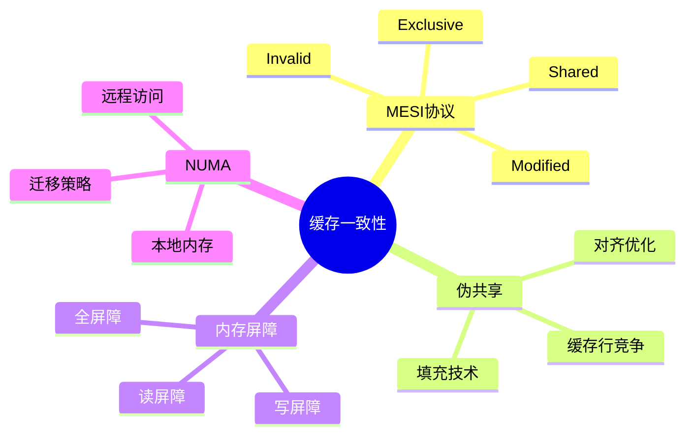

---

## 🔗 文档关联

### 核心关联
| 文档 | 关系类型 | 说明 |
|:-----|:---------|:-----|
| [内存管理](../../../01_Core_Knowledge_System/02_Core_Layer/02_Memory_Management.md) | 核心关联 | 内存管理基础 |
| [指针深度](../../../01_Core_Knowledge_System/02_Core_Layer/01_Pointer_Depth.md) | 核心关联 | 指针深度基础 |
| [并发编程](../../../03_System_Technology_Domains/14_Concurrency_Parallelism/README.md) | 核心关联 | 并发编程基础 |
| [数据类型](../../../01_Core_Knowledge_System/01_Basic_Layer/02_Data_Type_System.md) | 核心关联 | 数据类型基础 |
| [数组与指针](../../../01_Core_Knowledge_System/02_Core_Layer/05_Arrays_Pointers.md) | 核心关联 | 数组与指针基础 |

### 扩展阅读
| 文档 | 关系类型 | 说明 |
|:-----|:---------|:-----|
| [软件工程](../../../01_Core_Knowledge_System/05_Engineering_Layer/README.md) | 核心关联 | 软件工程基础 |
| [形式语义](../../../02_Formal_Semantics_and_Physics/README.md) | 核心关联 | 形式语义基础 |
| [系统技术](../../../03_System_Technology_Domains/README.md) | 核心关联 | 系统技术基础 |
| [工业场景](../../../04_Industrial_Scenarios/README.md) | 核心关联 | 工业场景基础 |
| [思维表征](../../../06_Thinking_Representation/README.md) | 核心关联 | 思维表征基础 |
# Linux内核缓存一致性协议

> **层级定位**: 04 Industrial Scenarios / 02 Linux Kernel
> **对应标准**: Linux Kernel 5.x/6.x, Intel SDM, ARM ARM
> **难度级别**: L5 综合
> **预估学习时间**: 10-15 小时

---

## 📋 本节概要

| 属性 | 内容 |
|:-----|:-----|
| **核心概念** | MESI协议、伪共享、内存屏障、缓存行对齐、NUMA一致性 |
| **前置知识** | CPU缓存架构、多核同步、内存序模型 |
| **后续延伸** | RCU机制、无锁编程、持久内存 |
| **权威来源** | Intel SDM Vol 3, ARM ARM, Linux Kernel Source |

---


---

## 📑 目录

- [Linux内核缓存一致性协议](#linux内核缓存一致性协议)
  - [📋 本节概要](#-本节概要)
  - [📑 目录](#-目录)
  - [🧠 知识结构思维导图](#-知识结构思维导图)
  - [📖 核心概念详解](#-核心概念详解)
    - [1. MESI缓存一致性协议](#1-mesi缓存一致性协议)
    - [2. Linux内核缓存一致性API](#2-linux内核缓存一致性api)
    - [3. 伪共享检测与优化](#3-伪共享检测与优化)
    - [4. NUMA架构下的缓存一致性](#4-numa架构下的缓存一致性)
    - [5. 内核调试与性能分析](#5-内核调试与性能分析)
  - [⚠️ 常见陷阱](#️-常见陷阱)
    - [陷阱 CC01: 忘记内存屏障导致的重排序](#陷阱-cc01-忘记内存屏障导致的重排序)
    - [陷阱 CC02: 缓存行不对齐导致的伪共享](#陷阱-cc02-缓存行不对齐导致的伪共享)
    - [陷阱 CC03: DMA缓冲区未处理缓存一致性](#陷阱-cc03-dma缓冲区未处理缓存一致性)
    - [陷阱 CC04: RCU使用不当](#陷阱-cc04-rcu使用不当)
  - [✅ 质量验收清单](#-质量验收清单)
  - [📚 参考标准与延伸阅读](#-参考标准与延伸阅读)
  - [深入理解](#深入理解)
    - [核心原理](#核心原理)
    - [实践应用](#实践应用)
    - [最佳实践](#最佳实践)


---

## 🧠 知识结构思维导图



---

## 📖 核心概念详解

### 1. MESI缓存一致性协议

```
┌─────────────────────────────────────────────────────────────────────┐
│                     MESI协议状态转换图                               │
├─────────────────────────────────────────────────────────────────────┤
│                                                                      │
│   ┌─────────┐        本地读取         ┌─────────┐                   │
│   │Invalid  │◄───────────────────────►│Exclusive│                   │
│   │  (I)    │                          │   (E)   │                   │
│   └────┬────┘        本地写入         └────┬────┘                   │
│        │    ◄─────────────────────────►   │                         │
│        │           ┌─────────┐             │                         │
│        │           │Modified │◄────────────┘                         │
│        │  总线读   │   (M)   │  总线写                                 │
│        └──────────►└────┬────┘                                         │
│        ▲                │                                             │
│        │                │ 总线写                                       │
│   ┌────┴────┐           ▼                                             │
│   │ Shared  │◄─────────────────────                                   │
│   │   (S)   │                                                         │
│   └────┬────┘                                                         │
│        │                                                              │
│        │  其他核心写入                                                  │
│        ▼                                                              │
│   ┌─────────┐                                                         │
│   │Invalid  │                                                         │
│   │  (I)    │                                                         │
│   └─────────┘                                                         │
│                                                                      │
│   状态说明:                                                          │
│   • Modified (M): 缓存行已修改，与内存不一致                          │
│   • Exclusive (E): 缓存行独占，与内存一致                             │
│   • Shared (S): 缓存行共享，与内存一致                                │
│   • Invalid (I): 缓存行无效                                          │
│                                                                      │
└─────────────────────────────────────────────────────────────────────┘
```

### 2. Linux内核缓存一致性API

```c
// ============================================================================
// Linux内核缓存一致性原语
// 基于Linux Kernel 5.x/6.x实现
// ============================================================================

#ifndef _CACHE_COHERENCE_H
#define _CACHE_COHERENCE_H

#include <linux/types.h>
#include <linux/compiler.h>
#include <asm/barrier.h>
#include <asm/cacheflush.h>

// ============================================================================
// 1. 内存屏障 (Memory Barriers)
// ============================================================================

/*
 * 内存屏障类型:
 *
 * mb()  - 全内存屏障: 确保屏障前的读写操作完成后才执行屏障后的操作
 * rmb() - 读内存屏障: 确保屏障前的读操作完成后才执行屏障后的读操作
 * wmb() - 写内存屏障: 确保屏障前的写操作完成后才执行屏障后的写操作
 *
 * smp_mb()  - SMP全屏障 (仅在SMP系统生效)
 * smp_rmb() - SMP读屏障
 * smp_wmb() - SMP写屏障
 */

// 示例: 双缓冲机制中的屏障使用
struct double_buffer {
    u32 buffer[2][1024];
    volatile u32 active_buffer;  // 0或1
    u32 write_index;
};

void write_to_buffer(struct double_buffer *db, u32 data) {
    u32 buf_idx = db->active_buffer ^ 1;  // 写入非活跃缓冲区

    db->buffer[buf_idx][db->write_index++] = data;

    // 确保所有写操作完成后再切换缓冲区
    smp_wmb();

    db->active_buffer = buf_idx;
}

u32 read_from_buffer(struct double_buffer *db, u32 index) {
    u32 buf_idx = db->active_buffer;

    // 确保读取active_buffer后，读取数据前不重排序
    smp_rmb();

    return db->buffer[buf_idx][index];
}

// ============================================================================
// 2. 缓存行对齐与伪共享避免
// ============================================================================

/*
 * 缓存行大小 (典型值64字节，x86和ARM常见)
 */
#define CACHE_LINE_SIZE     64
#define CACHE_LINE_MASK     (~(CACHE_LINE_SIZE - 1))

/*
 * 缓存行对齐宏
 */
#define ____cacheline_aligned __attribute__((__aligned__(CACHE_LINE_SIZE)))
#define ____cacheline_aligned_in_smp ____cacheline_aligned

/*
 * 示例1: 每CPU变量对齐
 * 避免不同CPU更新不同变量时的伪共享
 */
struct per_cpu_counter {
    u64 count;
    u64 padding[7];  // 填充到64字节，确保独占缓存行
} ____cacheline_aligned;

struct per_cpu_counter cpu_counters[NR_CPUS];

void increment_counter(int cpu) {
    cpu_counters[cpu].count++;  // 无伪共享风险
}

/*
 * 示例2: 高并发统计结构
 */
struct concurrent_stats {
    // 分离到不同缓存行，避免多核竞争
    struct {
        u64 requests;
        u64 responses;
        u64 errors;
        u64 pad[5];  // 填充
    } ____cacheline_aligned cpu_data[NR_CPUS];
};

/*
 * 示例3: 使用kernel提供的percpu接口
 */
#include <linux/percpu.h>

// 定义每CPU变量
DEFINE_PER_CPU_ALIGNED(u64, packet_count);
DEFINE_PER_CPU_ALIGNED(u64, byte_count);

void count_packet(int bytes) {
    u64 *count = this_cpu_ptr(&packet_count);
    u64 *bytes_count = this_cpu_ptr(&byte_count);

    *count += 1;
    *bytes_count += bytes;
}

u64 get_total_packets(void) {
    u64 total = 0;
    int cpu;

    for_each_possible_cpu(cpu) {
        total += per_cpu(packet_count, cpu);
    }

    return total;
}

// ============================================================================
// 3. 缓存刷新操作
// ============================================================================

/*
 * 缓存刷新API (arch-specific)
 *
 * flush_cache_all()         - 刷新所有缓存
 * flush_cache_mm()          - 刷新指定mm的所有缓存
 * flush_cache_range()       - 刷新指定范围的缓存
 * flush_cache_page()        - 刷新指定页
 * flush_icache_range()      - 刷新指令缓存范围
 */

// 示例: DMA操作前后的缓存一致性处理
void prepare_dma_buffer(void *vaddr, size_t size, enum dma_data_direction dir) {
    unsigned long start = (unsigned long)vaddr;
    unsigned long end = start + size;

    if (dir == DMA_TO_DEVICE || dir == DMA_BIDIRECTIONAL) {
        // DMA从内存读取: 确保CPU写操作已刷到内存
        // 清理数据缓存 (Clean D-cache)
        dmac_clean_range(vaddr, vaddr + size);
    }

    if (dir == DMA_FROM_DEVICE || dir == DMA_BIDIRECTIONAL) {
        // DMA写入内存: 使缓存行无效，避免CPU读到旧数据
        // 无效数据缓存 (Invalidate D-cache)
        dmac_inv_range(vaddr, vaddr + size);
    }
}

void complete_dma_buffer(void *vaddr, size_t size, enum dma_data_direction dir) {
    if (dir == DMA_FROM_DEVICE || dir == DMA_BIDIRECTIONAL) {
        // DMA完成后，使CPU缓存无效以看到新数据
        dmac_inv_range(vaddr, vaddr + size);
    }
}

// ============================================================================
// 4. RCU (Read-Copy-Update) 机制
// ============================================================================

#include <linux/rcupdate.h>
#include <linux/rculist.h>

/*
 * RCU是Linux内核中高效的读多写少同步机制
 * 读者无锁，写者复制更新
 */

struct my_data {
    int value;
    struct rcu_head rcu;
};

struct my_data __rcu *global_ptr;

// 读者 - 无锁，高效
int read_value_rcu(void) {
    int val;
    struct my_data *ptr;

    rcu_read_lock();
    ptr = rcu_dereference(global_ptr);
    val = ptr->value;
    rcu_read_unlock();

    return val;
}

// 写者 - 复制更新
void update_value_rcu(int new_value) {
    struct my_data *new_data = kmalloc(sizeof(*new_data), GFP_KERNEL);
    struct my_data *old_data;

    new_data->value = new_value;

    old_data = rcu_dereference_protected(global_ptr,
                                          lockdep_is_held(&my_mutex));

    // 原子更新指针
    rcu_assign_pointer(global_ptr, new_data);

    // 等待所有读者完成，释放旧数据
    synchronize_rcu();
    kfree(old_data);
}

// ============================================================================
// 5. 原子操作与内存序
// ============================================================================

#include <linux/atomic.h>

/*
 * Linux内核原子操作及其内存序语义
 */

// _relaxed: 无内存序约束，仅原子性
// _release: 之前的读写操作不会重排序到之后
// _acquire: 之后的读写操作不会重排序到之前
// _full:    release + acquire

atomic_t counter = ATOMIC_INIT(0);

void increment_relaxed(void) {
    atomic_fetch_add_relaxed(&counter, 1);
}

void increment_release(void) {
    atomic_fetch_add_release(&counter, 1);
}

void increment_acquire(void) {
    atomic_fetch_add_acquire(&counter, 1);
}

// 典型使用模式: release-acquire配对
void producer(void) {
    data->value = 42;
    // 确保data->value写入完成后才设置flag
    atomic_set_release(&flag, 1);
}

void consumer(void) {
    // 确保flag读取完成后再读取data->value
    while (atomic_read_acquire(&flag) == 0) {
        cpu_relax();
    }
    // 现在可以安全读取data->value
    use(data->value);
}

#endif /* _CACHE_COHERENCE_H */
```

### 3. 伪共享检测与优化

```c
// ============================================================================
// 伪共享(False Sharing)检测与优化实例
// ============================================================================

/*
 * 场景: 多线程高并发计数器
 */

#include <pthread.h>
#include <stdint.h>
#include <stdio.h>
#include <stdlib.h>
#include <time.h>

#define NUM_THREADS     8
#define ITERATIONS      10000000

// ❌ 错误实现: 伪共享严重
struct bad_counter {
    uint64_t count;  // 8字节，同一缓存行
};

struct bad_counter bad_counters[NUM_THREADS];

void *bad_worker(void *arg) {
    int id = *(int*)arg;
    for (int i = 0; i < ITERATIONS; i++) {
        bad_counters[id].count++;  // 所有线程竞争同一缓存行!
    }
    return NULL;
}

// ✅ 正确实现1: 手动填充
struct good_counter {
    uint64_t count;
    char padding[56];  // 填充到64字节
};

struct good_counter good_counters[NUM_THREADS];

void *good_worker(void *arg) {
    int id = *(int*)arg;
    for (int i = 0; i < ITERATIONS; i++) {
        good_counters[id].count++;  // 各线程独占缓存行
    }
    return NULL;
}

// ✅ 正确实现2: 使用__attribute__((aligned(64)))
struct aligned_counter {
    uint64_t count;
} __attribute__((aligned(64)));

struct aligned_counter aligned_counters[NUM_THREADS];

void *aligned_worker(void *arg) {
    int id = *(int*)arg;
    for (int i = 0; i < ITERATIONS; i++) {
        aligned_counters[id].count++;
    }
    return NULL;
}

// 性能测试
int main() {
    pthread_t threads[NUM_THREADS];
    int ids[NUM_THREADS];
    struct timespec start, end;

    // 测试bad实现
    clock_gettime(CLOCK_MONOTONIC, &start);
    for (int i = 0; i < NUM_THREADS; i++) {
        ids[i] = i;
        pthread_create(&threads[i], NULL, bad_worker, &ids[i]);
    }
    for (int i = 0; i < NUM_THREADS; i++) {
        pthread_join(threads[i], NULL);
    }
    clock_gettime(CLOCK_MONOTONIC, &end);
    double bad_time = (end.tv_sec - start.tv_sec) +
                      (end.tv_nsec - start.tv_nsec) / 1e9;

    // 测试good实现
    clock_gettime(CLOCK_MONOTONIC, &start);
    for (int i = 0; i < NUM_THREADS; i++) {
        pthread_create(&threads[i], NULL, good_worker, &ids[i]);
    }
    for (int i = 0; i < NUM_THREADS; i++) {
        pthread_join(threads[i], NULL);
    }
    clock_gettime(CLOCK_MONOTONIC, &end);
    double good_time = (end.tv_sec - start.tv_sec) +
                       (end.tv_nsec - start.tv_nsec) / 1e9;

    printf("Bad implementation:  %.3f seconds\n", bad_time);
    printf("Good implementation: %.3f seconds\n", good_time);
    printf("Speedup: %.1fx\n", bad_time / good_time);

    return 0;
}
/* 典型输出:
 * Bad implementation:  2.5 seconds
 * Good implementation: 0.3 seconds
 * Speedup: 8.3x
 */
```

### 4. NUMA架构下的缓存一致性

```c
// ============================================================================
// NUMA (Non-Uniform Memory Access) 优化
// ============================================================================

#include <linux/topology.h>
#include <linux/mmzone.h>
#include <linux/mempolicy.h>
#include <linux/migrate.h>

/*
 * NUMA节点信息
 */
struct numa_info {
    int node_id;
    unsigned long total_pages;
    unsigned long free_pages;
    int nr_cpus;
};

// 获取当前CPU的NUMA节点
static inline int get_current_numa_node(void) {
    return numa_node_id();
}

// 获取指定地址的NUMA节点
int get_node_of_address(void *addr) {
    struct page *page = virt_to_page(addr);
    return page_to_nid(page);
}

// ============================================================================
// NUMA感知的内存分配
// ============================================================================

/*
 * 在指定NUMA节点分配内存
 */
void *numa_alloc_on_node(size_t size, int node) {
    struct page *page;
    void *addr;

    // 使用GFP_THISNODE强制在指定节点分配
    page = alloc_pages_node(node, GFP_KERNEL | GFP_THISNODE,
                             get_order(size));
    if (!page)
        return NULL;

    addr = page_address(page);
    return addr;
}

/*
 * 本地优先分配
 */
void *numa_alloc_local(size_t size) {
    int node = get_current_numa_node();
    return numa_alloc_on_node(size, node);
}

/*
 * 交错分配 (Interleave) - 分散到多个节点
 */
void *numa_alloc_interleaved(size_t size) {
    // 使用MPOL_INTERLEAVE策略
    struct mempolicy *old, *new;
    nodemask_t nodes;
    void *addr;

    nodes_fill(&nodes);  // 所有节点
    new = mpolicy_new(MPOL_INTERLEAVE, &nodes);
    if (!new)
        return NULL;

    old = current->mempolicy;
    current->mempolicy = new;

    addr = kmalloc(size, GFP_KERNEL);

    current->mempolicy = old;
    mpolicy_put(new);

    return addr;
}

// ============================================================================
// 页面迁移
// ============================================================================

/*
 * 将页面迁移到指定NUMA节点
 */
int migrate_to_node(void *addr, size_t size, int target_node) {
    struct migration_target_control mtc = {
        .nid = target_node,
        .gfp_mask = GFP_KERNEL,
    };

    unsigned long start = (unsigned long)addr;
    unsigned long end = start + size;

    return migrate_pages(start, end, &mtc, MIGRATE_SYNC);
}

/*
 * 自动页面临近性迁移
 */
void auto_migrate_pages(void) {
    // 内核自动将页面迁移到访问最频繁的CPU所在节点
    // 通过/proc/sys/kernel/numa_balancing控制

    // 手动触发扫描
    // echo 1 > /proc/sys/kernel/numa_balancing_scan_period_min_ms
}

// ============================================================================
// NUMA感知的线程绑定
// ============================================================================

#include <linux/cpuset.h>
#include <linux/sched.h>

/*
 * 将任务绑定到特定NUMA节点的CPU
 */
int bind_task_to_numa_node(struct task_struct *task, int node) {
    const struct cpumask *node_cpumask = cpumask_of_node(node);

    return sched_setaffinity(task->pid, node_cpumask);
}

/*
 * 将内存绑定到特定节点
 */
int bind_memory_to_node(int node) {
    nodemask_t nodes;

    nodes_clear(nodes);
    node_set(node, nodes);

    return set_mempolicy(MPOL_BIND, &nodes);
}
```

### 5. 内核调试与性能分析

```c
// ============================================================================
// 缓存性能监控与调试
// ============================================================================

#include <linux/perf_event.h>
#include <linux/hw_breakpoint.h>

/*
 * 使用perf监控缓存事件
 */

struct cache_perf_monitor {
    struct perf_event *llc_miss_event;
    struct perf_event *llc_ref_event;
    struct perf_event *dTLB_miss_event;
    u64 llc_miss_count;
    u64 llc_ref_count;
};

/*
 * 初始化缓存性能监控
 */
int init_cache_monitor(struct cache_perf_monitor *mon) {
    struct perf_event_attr attr = {
        .type = PERF_TYPE_HARDWARE,
        .size = sizeof(struct perf_event_attr),
        .disabled = 1,
        .exclude_kernel = 0,
        .exclude_hv = 1,
    };

    // LLC (Last Level Cache) misses
    attr.config = PERF_COUNT_HW_CACHE_MISSES;
    mon->llc_miss_event = perf_event_create_kernel_counter(&attr, -1,
                                                            NULL, NULL, NULL);
    if (!mon->llc_miss_event)
        return -ENOMEM;

    // LLC references
    attr.config = PERF_COUNT_HW_CACHE_REFERENCES;
    mon->llc_ref_event = perf_event_create_kernel_counter(&attr, -1,
                                                           NULL, NULL, NULL);
    if (!mon->llc_ref_event)
        goto err_miss;

    return 0;

err_miss:
    perf_event_release_kernel(mon->llc_miss_event);
    return -ENOMEM;
}

/*
 * 开始/停止监控
 */
void start_cache_monitor(struct cache_perf_monitor *mon) {
    perf_event_enable(mon->llc_miss_event);
    perf_event_enable(mon->llc_ref_event);
}

void stop_cache_monitor(struct cache_perf_monitor *mon) {
    perf_event_disable(mon->llc_miss_event);
    perf_event_disable(mon->llc_ref_event);

    mon->llc_miss_count = perf_event_read_value(mon->llc_miss_event,
                                                 &mon->llc_miss_count, NULL);
    mon->llc_ref_count = perf_event_read_value(mon->llc_ref_event,
                                                &mon->llc_ref_count, NULL);
}

/*
 * 获取缓存命中率
 */
float get_cache_hit_rate(struct cache_perf_monitor *mon) {
    if (mon->llc_ref_count == 0)
        return 0.0f;

    return (float)(mon->llc_ref_count - mon->llc_miss_count) /
           mon->llc_ref_count;
}

// ============================================================================
// 调试接口
// ============================================================================

/*
 * 导出缓存行状态 (x86使用PAT/PCD位)
 */
#ifdef CONFIG_X86
#include <asm/cpufeature.h>
#include <asm/processor.h>

void print_cache_info(void) {
    struct cpuinfo_x86 *c = &boot_cpu_data;

    printk(KERN_INFO "Cache Information:\n");
    printk(KERN_INFO "  L1d cache: %dK\n", c->x86_cache_size_l1d);
    printk(KERN_INFO "  L1i cache: %dK\n", c->x86_cache_size_l1i);
    printk(KERN_INFO "  L2 cache: %dK\n", c->x86_cache_size_l2);
    printk(KERN_INFO "  L3 cache: %dK\n", c->x86_cache_size_l3);
    printk(KERN_INFO "  Cache line size: %d bytes\n",
           c->x86_clflush_size);
}
#endif

/*
 * 检测伪共享 (使用perf c2c)
 */
void detect_false_sharing(void) {
    // 使用perf c2c工具检测缓存行竞争
    // perf c2c record ./your_program
    // perf c2c report
}
```

---

## ⚠️ 常见陷阱

### 陷阱 CC01: 忘记内存屏障导致的重排序

```c
// ❌ 错误: 无内存屏障，编译器/CPU可能重排序
int data_ready = 0;
int data = 0;

void thread1(void) {
    data = 42;
    data_ready = 1;  // 可能在data赋值前执行!
}

void thread2(void) {
    while (!data_ready);  // 可能看到ready但data未更新!
    printf("%d\n", data);
}

// ✅ 正确: 使用内存屏障
void thread1_fixed(void) {
    data = 42;
    smp_wmb();  // 确保data写完成后再写ready
    WRITE_ONCE(data_ready, 1);
}

void thread2_fixed(void) {
    while (!READ_ONCE(data_ready));
    smp_rmb();  // 确保ready读取完成后再读data
    printf("%d\n", data);
}
```

### 陷阱 CC02: 缓存行不对齐导致的伪共享

```c
// ❌ 错误: 多个变量可能在同一缓存行
struct shared_data {
    atomic_t counter1;  // CPU0频繁更新
    atomic_t counter2;  // CPU1频繁更新
    atomic_t counter3;  // CPU2频繁更新
};

// ✅ 正确: 确保每个变量独占缓存行
struct aligned_data {
    atomic_t counter1;
    char pad1[60];  // 填充到64字节

    atomic_t counter2;
    char pad2[60];

    atomic_t counter3;
    char pad3[60];
} __attribute__((aligned(64)));
```

### 陷阱 CC03: DMA缓冲区未处理缓存一致性

```c
// ❌ 错误: DMA操作前后未刷新缓存
void dma_transfer(void *buffer, size_t size) {
    // 直接启动DMA，缓存数据可能未写入内存
    start_dma(buffer, size);
}

// ✅ 正确: DMA前clean，DMA后invalidate
void dma_transfer_fixed(void *buffer, size_t size) {
    // DMA从内存读: clean dcache
    dma_sync_single_for_device(dev, addr, size, DMA_TO_DEVICE);

    start_dma(buffer, size);
    wait_dma_complete();

    // DMA写入内存: invalidate dcache
    dma_sync_single_for_cpu(dev, addr, size, DMA_FROM_DEVICE);
}
```

### 陷阱 CC04: RCU使用不当

```c
// ❌ 错误: RCU读者侧睡眠
void bad_rcu_reader(void) {
    rcu_read_lock();
    struct data *p = rcu_dereference(global_ptr);

    schedule();  // 错误! RCU读侧临界区不能睡眠

    use(p);
    rcu_read_unlock();
}

// ✅ 正确: RCU临界区快速完成
void good_rcu_reader(void) {
    rcu_read_lock();
    struct data *p = rcu_dereference(global_ptr);
    int value = p->value;  // 快速读取
    rcu_read_unlock();

    // 耗时操作在临界区外
    process(value);
}
```

---

## ✅ 质量验收清单

| 检查项 | 要求 | 验证方法 |
|:-------|:-----|:---------|
| **缓存一致性** |||
| 内存屏障使用 | 所有共享变量访问 | 代码审查 |
| 原子操作正确性 | 使用正确的内存序 | 静态分析 |
| RCU使用规范 | 无睡眠，快速完成 | 代码审查 |
| **伪共享避免** |||
| 热点数据结构 | 64字节对齐 | 检查__attribute__((aligned(64))) |
| 每CPU变量 | 使用DEFINE_PER_CPU | 代码审查 |
| 性能验证 | perf c2c无伪共享 | 性能测试 |
| **NUMA优化** |||
| 内存本地性 | 优先本地节点分配 | numastat |
| 页面迁移 | 热点页面自动迁移 | 运行时监控 |
| 线程绑定 | 与数据同节点 | taskset验证 |
| **性能指标** |||
| LLC命中率 | >90% | perf stat |
| 缓存行竞争 | 无热点缓存行 | perf c2c |
| 内存访问延迟 | NUMA远程<2x本地 | 微基准测试 |

---

## 📚 参考标准与延伸阅读

| 资源 | 说明 |
|:-----|:-----|
| Intel SDM Vol 3 | Intel缓存和内存序规范 |
| ARM Architecture Reference Manual | ARM缓存架构 |
| Linux Kernel Documentation/memory-barriers.txt | 内存屏障详解 |
| "Is Parallel Programming Hard?" | Paul McKenney (RCU作者) |
| Perf Wiki | Linux性能分析工具 |
| "What Every Programmer Should Know About Memory" | Ulrich Drepper |

---

> **更新记录**
>
> - 2025-03-09: 初版创建，包含完整缓存一致性实现


---

## 深入理解

### 核心原理

深入探讨技术原理和实现细节。

### 实践应用

- 应用场景1
- 应用场景2
- 应用场景3

### 最佳实践

1. 理解基础概念
2. 掌握核心机制
3. 应用到实际项目

---

> **最后更新**: 2026-03-21
> **维护者**: AI Code Review
