# 工业通信技术完全指南 (Industrial Communication)

> **对应标准**: IEC 61158, IEEE 802.x, ISO 11898, IEC 61784
> **难度等级**: L3-L5 | **预估学习时间**: 80-120小时
> **最后更新**: 2026-03-17

---

## 目录

- [工业通信技术完全指南 (Industrial Communication)](#工业通信技术完全指南-industrial-communication)
  - [目录](#目录)
  - [1. 工业通信概述](#1-工业通信概述)
    - [1.1 工业通信的重要性](#11-工业通信的重要性)
    - [1.2 工业通信 vs 传统IT通信](#12-工业通信-vs-传统it通信)
    - [1.3 应用场景](#13-应用场景)
  - [2. 通信协议分层模型](#2-通信协议分层模型)
    - [2.1 OSI参考模型在工业中的应用](#21-osi参考模型在工业中的应用)
    - [2.2 工业通信协议栈](#22-工业通信协议栈)
  - [3. 子目录详细介绍](#3-子目录详细介绍)
    - [3.1 物理层 (Physical Layer)](#31-物理层-physical-layer)
    - [3.2 数据链路层 (Data Link Layer)](#32-数据链路层-data-link-layer)
    - [3.3 工业通信协议](#33-工业通信协议)
  - [4. 典型应用场景](#4-典型应用场景)
    - [4.1 智能制造](#41-智能制造)
    - [4.2 能源电力](#42-能源电力)
    - [4.3 交通运输](#43-交通运输)
  - [5. 选型决策指南](#5-选型决策指南)
    - [5.1 协议对比分析](#51-协议对比分析)
    - [5.2 选型决策树](#52-选型决策树)
  - [6. 学习路径推荐](#6-学习路径推荐)
    - [6.1 初级工程师路径 (4-8周)](#61-初级工程师路径-4-8周)
    - [6.2 中级工程师路径 (8-16周)](#62-中级工程师路径-8-16周)
    - [6.3 高级工程师路径 (16周以上)](#63-高级工程师路径-16周以上)
  - [7. 相关标准和规范](#7-相关标准和规范)
    - [7.1 国际标准](#71-国际标准)
    - [7.2 行业规范](#72-行业规范)
    - [7.3 协议组织](#73-协议组织)
  - [8. 模块关联关系](#8-模块关联关系)
    - [8.1 与04\_Industrial\_Scenarios其他模块的关联](#81-与04_industrial_scenarios其他模块的关联)
    - [8.2 知识依赖关系](#82-知识依赖关系)
  - [附录](#附录)
    - [术语表](#术语表)
    - [快速参考](#快速参考)
  - [深入理解](#深入理解)
    - [核心原理](#核心原理)
    - [实践应用](#实践应用)
    - [最佳实践](#最佳实践)

---

## 1. 工业通信概述

### 1.1 工业通信的重要性

工业通信是现代工业自动化系统的**神经系统**，负责连接传感器、执行器、控制器和上层管理系统，实现数据的实时采集、传输和处理。

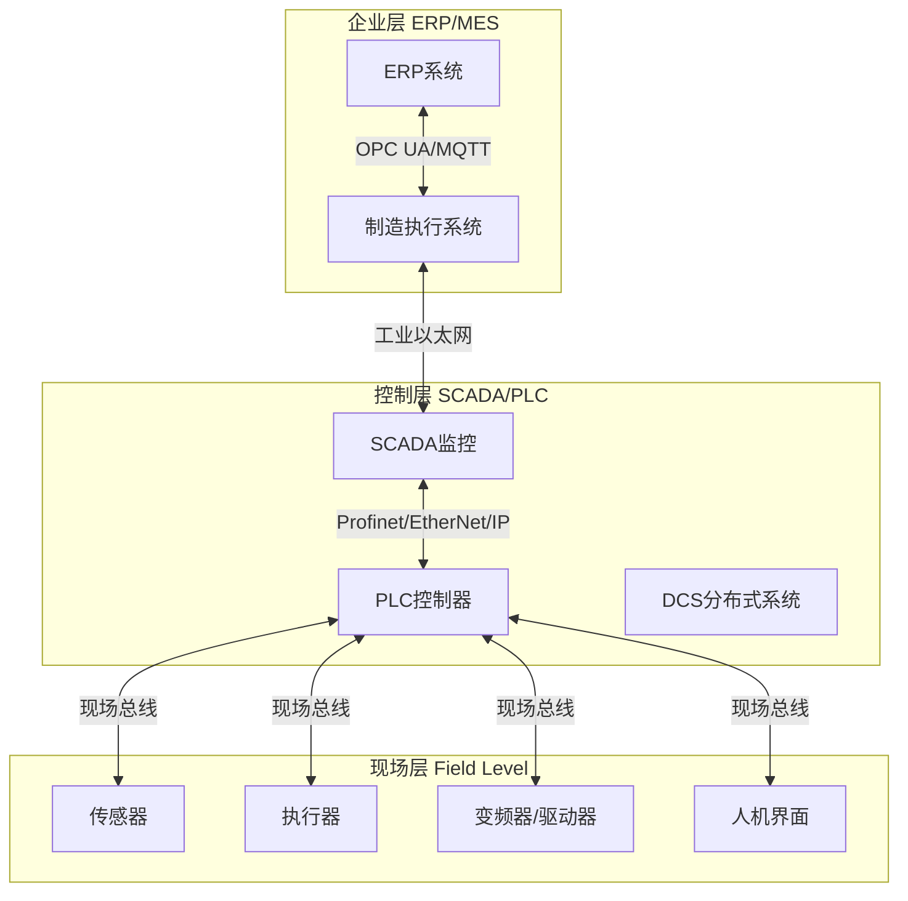

**工业通信的核心价值：**

| 价值维度 | 具体体现 | 量化指标 |
|:---------|:---------|:---------|
| **生产效率** | 实时监控、快速响应 | 设备利用率提升 15-25% |
| **质量控制** | 全程追溯、数据分析 | 缺陷率降低 30-50% |
| **成本优化** | 预测维护、能耗管理 | 维护成本降低 20-40% |
| **柔性制造** | 快速换线、批量定制 | 换线时间缩短 50-70% |
| **安全保障** | 故障诊断、安全联锁 | 事故率降低 60-80% |

### 1.2 工业通信 vs 传统IT通信

工业通信与传统IT通信在设计和应用上存在本质差异：

| 特性维度 | 工业通信 | 传统IT通信 |
|:---------|:---------|:-----------|
| **实时性要求** | 毫秒级/微秒级确定性响应 | 秒级/分钟级非确定性响应 |
| **可靠性要求** | 99.999% (五个9) | 99.9% (三个9) |
| **数据特性** | 周期性小数据包 (几十字节) | 突发性大数据流 (MB级) |
| **环境适应性** | 强电磁干扰、宽温湿度范围 | 恒温机房、洁净环境 |
| **拓扑结构** | 线性、总线型、环型为主 | 星型、网状为主 |
| **协议开放性** | 多厂商私有协议并存 | 标准化程度高 |
| **生命周期** | 15-20年 | 3-5年 |
| **安全重点** | 功能安全 + 信息安全 | 信息安全为主 |

### 1.3 应用场景

工业通信技术广泛应用于以下领域：

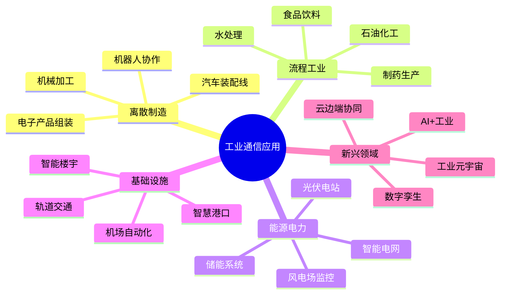

---

## 2. 通信协议分层模型

### 2.1 OSI参考模型在工业中的应用

工业通信协议通常采用**简化的OSI模型**，将部分层次合并以提高效率：

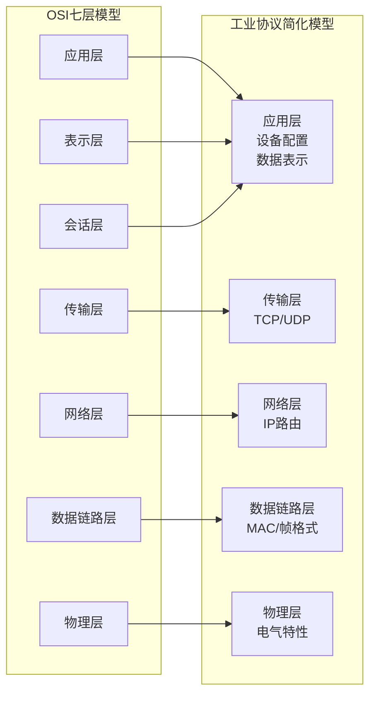

**各层功能说明：**

| 层次 | 工业协议对应 | 核心功能 | 典型协议示例 |
|:-----|:-------------|:---------|:-------------|
| **应用层** | 应用层 | 设备配置、数据表示、服务接口 | OPC UA, MQTT, DDS |
| **传输层** | 传输层 | 端到端连接、可靠传输 | TCP, UDP |
| **网络层** | 网络层 | 寻址、路由、分段 | IP, ICMP |
| **数据链路层** | 数据链路层 | MAC寻址、帧格式、CRC校验 | Ethernet MAC, CAN, Profibus |
| **物理层** | 物理层 | 电气特性、线缆、连接器 | RS-485, Ethernet PHY,光纤 |

### 2.2 工业通信协议栈

现代工业通信形成了**金字塔式**的协议体系：

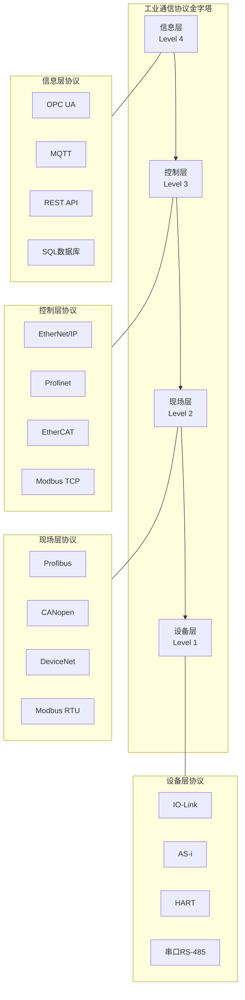

---

## 3. 子目录详细介绍

### 3.1 物理层 (Physical Layer)

物理层是工业通信的**基础**，负责比特流的电气/光学传输。

**目录位置**: [Physical_Layer/](Physical_Layer/)

| 文件 | 描述 | 关键技术 |
|:-----|:-----|:---------|
| [01_GPIO_Driver.md](Physical_Layer/01_GPIO_Driver.md) | GPIO通用输入输出驱动 | 引脚配置、中断处理、电平转换 |
| [02_I2C_Driver.md](Physical_Layer/02_I2C_Driver.md) | I2C总线驱动实现 | 起始/停止条件、ACK/NACK、时钟同步 |

**物理层核心技术栈：**

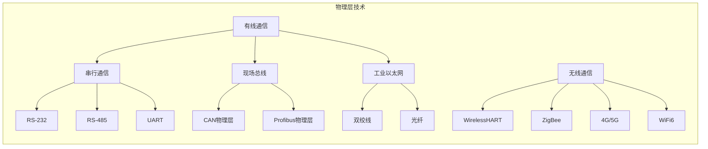

**物理层选型对比：**

| 接口类型 | 传输距离 | 最大速率 | 节点数 | 抗干扰性 | 成本 |
|:---------|:---------|:---------|:-------|:---------|:-----|
| RS-232 | 15m | 115.2Kbps | 点对点 | 低 | 低 |
| RS-485 | 1200m | 10Mbps | 32/128/256 | 高 | 低 |
| CAN | 1000m@50Kbps | 1Mbps | 110 | 极高 | 中 |
| 以太网(铜缆) | 100m | 1/10Gbps | 无限 | 中 | 中 |
| 光纤 | 数km | 1/10/40Gbps | 无限 | 极高 | 高 |
| WiFi6 | 100m | 9.6Gbps | 数百 | 低 | 中 |

### 3.2 数据链路层 (Data Link Layer)

数据链路层负责**帧的封装/解封装**、**MAC寻址**、**差错检测**和**介质访问控制**。

**目录位置**: [Data_Link_Layer/](Data_Link_Layer/)

| 文件 | 描述 | 关键技术 |
|:-----|:-----|:---------|
| [01_Data_Link_Protocols.md](Data_Link_Layer/01_Data_Link_Protocols.md) | 数据链路层协议详解 | 帧格式、CRC校验、CSMA/CD、令牌传递 |

**数据链路层功能架构：**

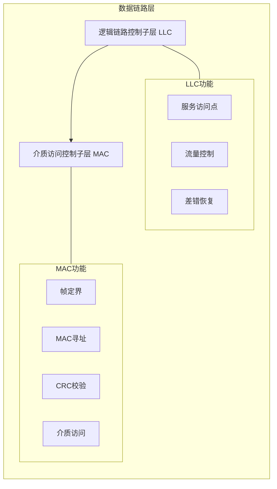

### 3.3 工业通信协议

本模块提供完整的**工业通信协议栈实现**指南。

**文档位置**: [01_Industrial_Communication_Protocols.md](01_Industrial_Communication_Protocols.md)

**涵盖协议清单：**

| 协议 | 类型 | 应用领域 | 实时性 | 复杂度 |
|:-----|:-----|:---------|:-------|:-------|
| **Modbus RTU** | 串行主从 | 通用工业 | 中 | 低 |
| **Modbus TCP** | 以太网主从 | 通用工业 | 中 | 低 |
| **CAN/CANopen** | 现场总线 | 汽车、机械 | 高 | 中 |
| **Profibus DP** | 现场总线 | 过程自动化 | 高 | 高 |
| **Profinet** | 工业以太网 | 工厂自动化 | 极高 | 高 |
| **EtherCAT** | 工业以太网 | 运动控制 | 极高 | 高 |
| **EtherNet/IP** | 工业以太网 | 工厂自动化 | 高 | 中 |
| **OPC UA** | 信息模型 | 工业4.0 | 中 | 高 |

---

## 4. 典型应用场景

### 4.1 智能制造

智能制造场景对通信的**实时性、同步性和可靠性**要求极高。

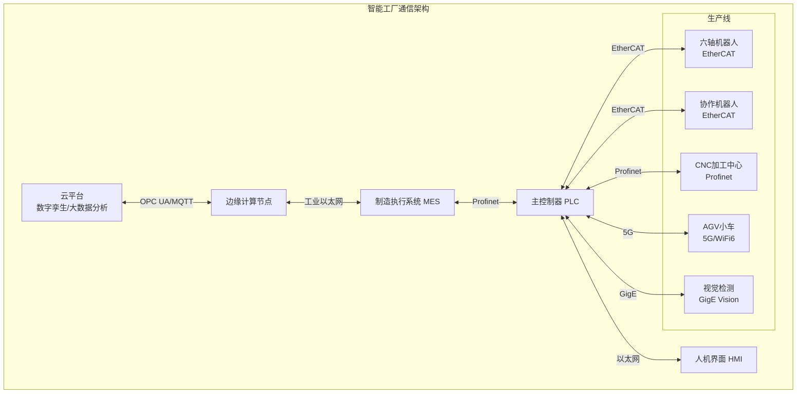

**智能制造通信需求：**

| 应用场景 | 通信协议 | 实时性要求 | 同步精度 | 带宽需求 |
|:---------|:---------|:-----------|:---------|:---------|
| 机器人协同 | EtherCAT | < 1ms | < 100ns | 100Mbps |
| CNC加工 | Profinet IRT | < 10ms | < 1μs | 1Gbps |
| AGV调度 | 5G uRLLC | < 10ms | - | 100Mbps |
| 视觉检测 | GigE Vision | < 50ms | - | 1-10Gbps |
| 预测维护 | OPC UA PubSub | < 1s | - | 10Mbps |

### 4.2 能源电力

能源电力行业强调**广域覆盖、高可靠性和安全性**。

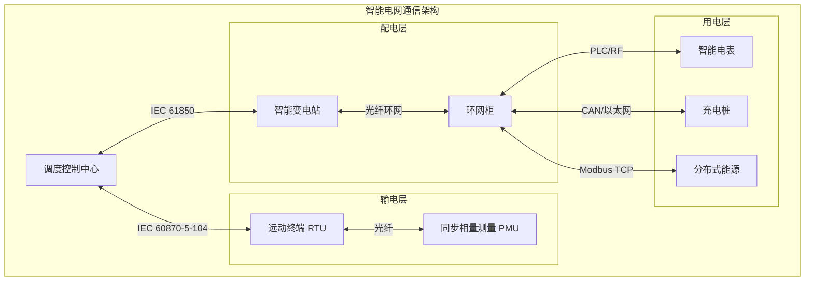

**能源电力通信协议：**

| 应用场景 | 协议标准 | 传输介质 | 安全机制 |
|:---------|:---------|:---------|:---------|
| 变电站自动化 | IEC 61850 | 光纤/以太网 | 数字证书 |
| 调度自动化 | IEC 60870-5-104 | 光纤/4G | 加密认证 |
| 配电自动化 | DNP3 | 无线/载波 | 加密认证 |
| 用电信息采集 | DL/T 645 | PLC/RF | 数据加密 |
| 分布式能源 | SunSpec Modbus | 以太网/RS-485 | 访问控制 |

### 4.3 交通运输

交通运输系统需要**高可靠、高实时、广覆盖**的通信网络。

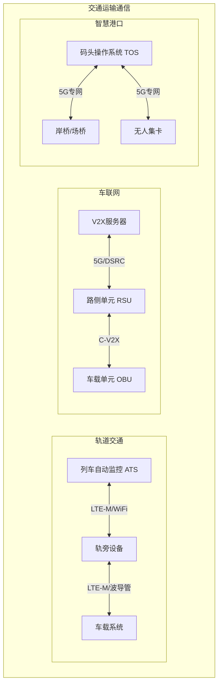

---

## 5. 选型决策指南

### 5.1 协议对比分析

**主流工业以太网协议对比：**

| 特性 | EtherCAT | Profinet | EtherNet/IP | Modbus TCP |
|:-----|:---------|:---------|:------------|:-----------|
| **实时性能** | 极佳 (< 100μs) | 优 (< 1ms) | 良 (< 10ms) | 一般 (< 100ms) |
| **同步精度** | < 100ns | < 1μs | < 10μs | - |
| **拓扑灵活性** | 线型/树型/星型 | 线型/树型/星型/环型 | 星型/线型 | 星型/线型 |
| **设备节点数** | 65,535 | 512/环 | 不限 | 不限 |
| **标准组织** | ETG | PI | ODVA | Modbus-IDA |
| **CIP集成** | 否 | 否 | 是 | 否 |
| **诊断功能** | 丰富 | 丰富 | 丰富 | 基础 |
| **安全认证** | FSoE | Profisafe | CIP Safety | - |
| **学习曲线** | 陡峭 | 中等 | 中等 | 平缓 |

**现场总线协议对比：**

| 特性 | Profibus DP | CANopen | Modbus RTU | DeviceNet |
|:-----|:------------|:--------|:-----------|:----------|
| **传输速率** | 12Mbps | 1Mbps | 115.2Kbps | 500Kbps |
| **传输距离** | 1200m | 1000m | 1200m | 500m |
| **节点数** | 126 | 127 | 247 | 64 |
| **介质** | RS-485 | 双绞线 | RS-485 | 双绞线 |
| **主从结构** | 主从 | 多主 | 主从 | 主从 |
| **应用领域** | 工厂自动化 | 机械/汽车 | 通用 | 工厂自动化 |
| **成本** | 中 | 低 | 极低 | 中 |

### 5.2 选型决策树

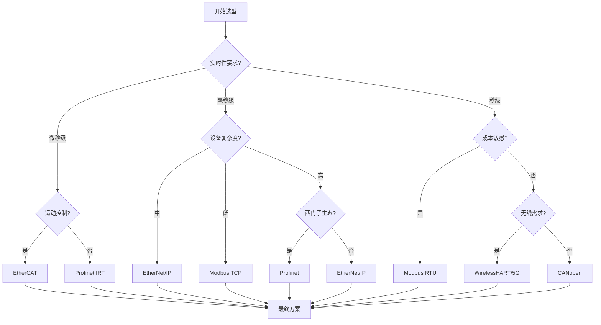

**选型关键考虑因素：**

| 优先级 | 考虑因素 | 权重建议 | 说明 |
|:-------|:---------|:---------|:-----|
| 1 | 实时性需求 | 25% | 控制周期决定协议选择 |
| 2 | 现有生态 | 20% | 与现有设备的兼容性 |
| 3 | 成本预算 | 15% | 硬件、软件、培训成本 |
| 4 | 可扩展性 | 15% | 未来升级和扩展能力 |
| 5 | 技术支持 | 10% | 厂商技术文档和社区支持 |
| 6 | 安全性 | 10% | 功能安全和信息安全 |
| 7 | 维护性 | 5% | 诊断工具和故障排查 |

---

## 6. 学习路径推荐

### 6.1 初级工程师路径 (4-8周)

适合刚接触工业通信的工程师，重点掌握基础协议和简单应用。

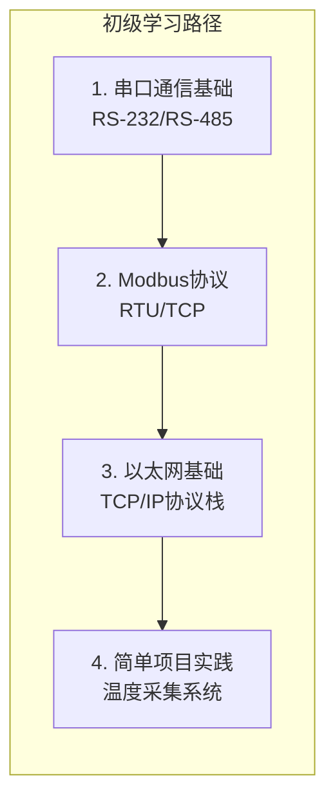

**学习资源推荐：**

| 阶段 | 主题 | 推荐资源 | 实践项目 |
|:-----|:-----|:---------|:---------|
| 第1周 | 串口通信 | [Physical_Layer](Physical_Layer/) | 串口调试工具开发 |
| 第2-3周 | Modbus RTU | [01_Industrial_Communication_Protocols.md](01_Industrial_Communication_Protocols.md) | Modbus主站/从机实现 |
| 第4周 | Modbus TCP | [01_Industrial_Communication_Protocols.md](01_Industrial_Communication_Protocols.md) | 以太网转串口网关 |
| 第5-6周 | 工业以太网基础 | Profinet/EtherNet/IP入门 | 简单HMI通信 |
| 第7-8周 | 综合项目 | 多协议转换网关 | 温度监控上位机 |

### 6.2 中级工程师路径 (8-16周)

适合有一定基础的工程师，深入学习实时以太网和现场总线。

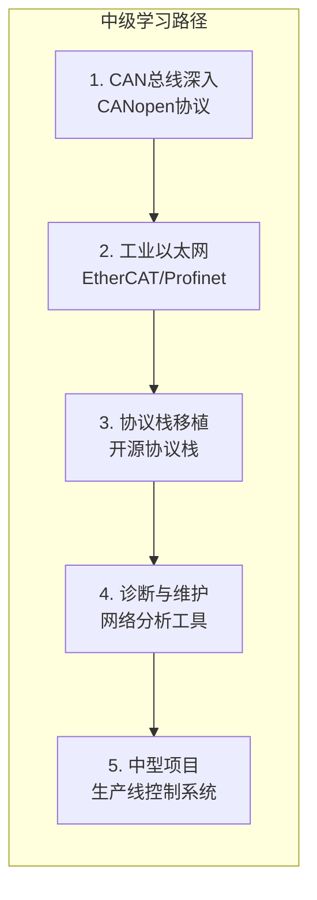

### 6.3 高级工程师路径 (16周以上)

面向架构师和资深工程师，掌握复杂系统设计和前沿技术。

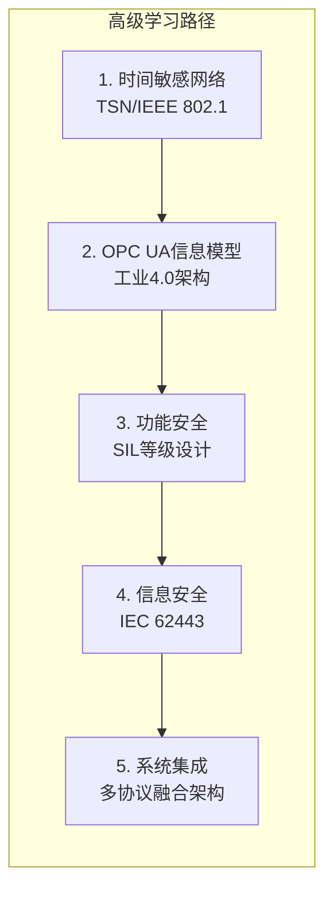

---

## 7. 相关标准和规范

### 7.1 国际标准

| 标准编号 | 标准名称 | 适用范围 | 重要性 |
|:---------|:---------|:---------|:-------|
| **IEC 61158** | 工业以太网协议系列标准 | 工业以太网 | ★★★★★ |
| **IEC 61784** | 工业通信网络行规 | 协议选型 | ★★★★★ |
| **IEC 61131** | 可编程控制器编程语言 | PLC编程 | ★★★★☆ |
| **IEC 62443** | 工业自动化网络安全 | 信息安全 | ★★★★★ |
| **ISO 11898** | CAN总线标准 | 汽车/工业CAN | ★★★★☆ |
| **IEEE 802.1** | 时间敏感网络(TSN) | 实时以太网 | ★★★★☆ |
| **IEEE 802.3** | 以太网标准 | 工业以太网 | ★★★★★ |

### 7.2 行业规范

| 行业 | 规范编号 | 规范名称 | 应用领域 |
|:-----|:---------|:---------|:---------|
| **汽车** | ISO 26262 | 道路车辆功能安全 | 汽车电子 |
| **汽车** | AUTOSAR | 汽车软件架构 | ECU开发 |
| **航空** | ARINC 429 | 航空电子总线 | 航空电子 |
| **航空** | MIL-STD-1553 | 军用航空总线 | 军用航空 |
| **能源** | IEC 61850 | 变电站通信网络 | 智能电网 |
| **能源** | IEC 60870 | 远动设备及系统 | 电力调度 |
| **过程** | ISA-95 | 企业-控制系统集成 | MES系统 |

### 7.3 协议组织

| 组织名称 | 官方网站 | 主要协议 |
|:---------|:---------|:---------|
| **ETG (EtherCAT技术组)** | <www.ethercat.org> | EtherCAT |
| **PI (Profinet国际组织)** | <www.profibus.com> | Profinet/Profibus |
| **ODVA** | <www.odva.org> | EtherNet/IP, DeviceNet |
| **CiA (CAN in Automation)** | <www.can-cia.org> | CANopen, CAN FD |
| **OPC Foundation** | <www.opcfoundation.org> | OPC UA |
| **Modbus组织** | <www.modbus.org> | Modbus |

---

## 8. 模块关联关系

### 8.1 与04_Industrial_Scenarios其他模块的关联

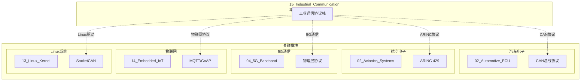

**详细关联说明：**

| 关联模块 | 关联内容 | 技术交集 | 应用场景 |
|:---------|:---------|:---------|:---------|
| [02_Automotive_ECU](../02_Automotive_ECU/README.md) | CAN总线协议 | ISO 11898, CAN FD, CANopen | 汽车网络通信 |
| [02_Avionics_Systems](../02_Avionics_Systems/README.md) | 航空总线 | ARINC 429, MIL-STD-1553 | 航空电子通信 |
| [04_5G_Baseband](../04_5G_Baseband/README.md) | 无线通信 | 5G uRLLC, 时间同步 | 工业无线 |
| [14_Embedded_IoT](../14_Embedded_IoT/README.md) | 物联网协议 | MQTT, CoAP, LoRa | 工业物联网 |
| [13_Linux_Kernel](../13_Linux_Kernel/README.md) | 驱动开发 | SocketCAN, 网络驱动 | Linux工业网关 |
| [03_High_Frequency_Trading](../03_High_Frequency_Trading/README.md) | 低延迟通信 | DPDK, 内核旁路 | 高频数据采集 |

### 8.2 知识依赖关系

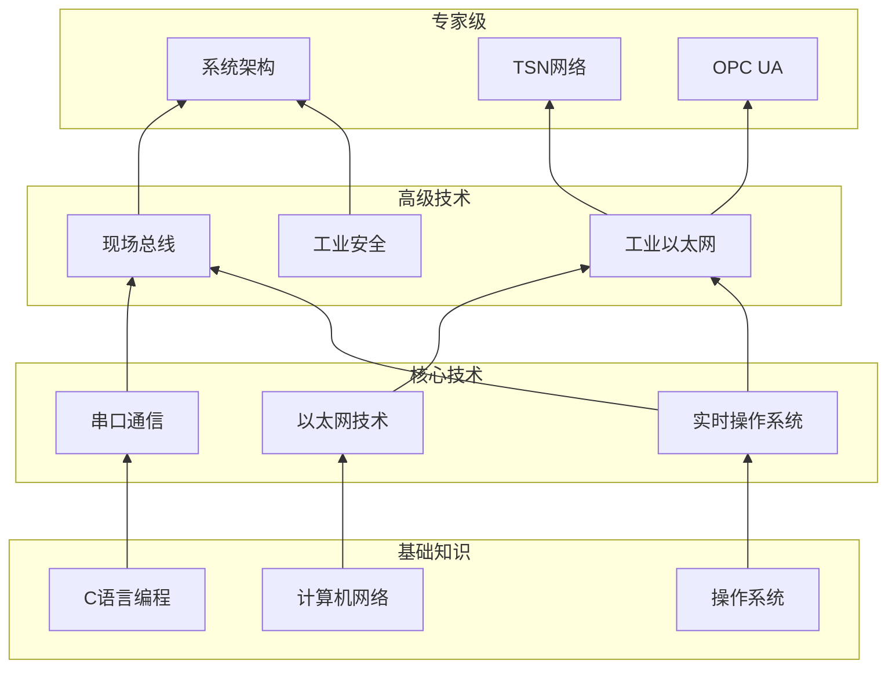

---

## 附录

### 术语表

| 术语 | 英文 | 说明 |
|:-----|:-----|:-----|
| **现场总线** | Fieldbus | 用于现场设备通信的工业网络 |
| **工业以太网** | Industrial Ethernet | 适用于工业环境的以太网技术 |
| **实时性** | Real-time | 系统在确定时间内响应的能力 |
| **确定性** | Determinism | 传输延迟可预测的特性 |
| **TSN** | Time-Sensitive Networking | 时间敏感网络，IEEE 802.1标准 |
| **OPC UA** | OPC Unified Architecture | 开放平台通信统一架构 |
| **CIP** | Common Industrial Protocol | 通用工业协议 |
| **SIL** | Safety Integrity Level | 安全完整性等级 |

### 快速参考

| 操作 | 常用工具 | 命令/方法 |
|:-----|:---------|:----------|
| 串口调试 | minicom/Putty | `minicom -D /dev/ttyUSB0` |
| CAN分析 | candump/cansend | `candump can0` |
| Modbus测试 | modpoll/diagslave | `modpoll -m rtu -a 1 -r 1 COM1` |
| 网络抓包 | Wireshark/tcpdump | `tcpdump -i eth0` |
| 协议分析 | Profinet Analyzer | 专用软件 |

---

> **文档维护**: 本指南持续更新，如有问题请提交Issue
> **返回导航**: [04_Industrial_Scenarios](../README.md) | [知识库总览](../../README.md)

---

## 深入理解

### 核心原理

深入探讨技术原理和实现细节。

### 实践应用

- 应用场景1
- 应用场景2
- 应用场景3

### 最佳实践

1. 理解基础概念
2. 掌握核心机制
3. 应用到实际项目

---

> **最后更新**: 2026-03-21
> **维护者**: AI Code Review
