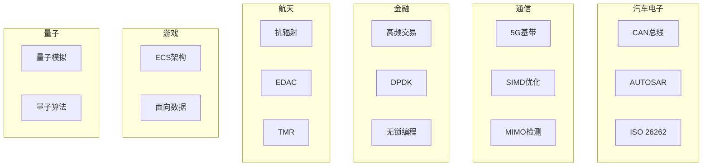

---

## 🔗 全面知识关联体系

### 【全局层】知识库导航

| 维度 | 目标文档 | 导航作用 |
|:-----|:---------|:---------|
| **总索引** | [../00_GLOBAL_INDEX.md](../00_GLOBAL_INDEX.md) | 完整知识图谱入口，全局视角 |
| **本模块** | [../README.md](../README.md) | 模块总览与目录导航 |
| **学习路径** | [../06_Thinking_Representation/06_Learning_Paths/README.md](../06_Thinking_Representation/06_Learning_Paths/README.md) | 阶段化学习路线规划 |
| **概念映射** | [../06_Thinking_Representation/05_Concept_Mappings/README.md](../06_Thinking_Representation/05_Concept_Mappings/README.md) | 核心概念等价关系图 |

### 【阶段层】学习定位

**当前模块**: 工业场景
**难度等级**: L4-L5
**前置依赖**: 核心+系统技术
**后续延伸**: 专家实践

```
学习阶段金字塔:
    L6 专家层 [形式验证、编译器]
    L5 高级层 [并发、系统编程] ⬅️ 可能在此
    L4 进阶层 [指针、内存管理]
    L3 基础层 [函数、结构体]
    L2 入门层 [语法、数据类型]
    L1 零基础 [环境搭建]
```

### 【层次层】纵向知识链

| 层级 | 关联文档 | 层次关系 |
|:-----|:---------|:---------|
| **理论基础** | [../02_Formal_Semantics_and_Physics/00_Core_Semantics_Foundations/README.md](../02_Formal_Semantics_and_Physics/00_Core_Semantics_Foundations/README.md) | 语义学理论基础 |
| **核心机制** | [../01_Core_Knowledge_System/02_Core_Layer/README.md](../01_Core_Knowledge_System/02_Core_Layer/README.md) | C语言核心机制 |
| **标准接口** | [../01_Core_Knowledge_System/04_Standard_Library_Layer/README.md](../01_Core_Knowledge_System/04_Standard_Library_Layer/README.md) | 标准库API |
| **系统实现** | [../03_System_Technology_Domains/README.md](../03_System_Technology_Domains/README.md) | 系统级实现 |

### 【局部层】横向关联网

| 关联类型 | 目标文档 | 关联说明 |
|:---------|:---------|:---------|
| **技术扩展** | [../03_System_Technology_Domains/14_Concurrency_Parallelism/README.md](../03_System_Technology_Domains/14_Concurrency_Parallelism/README.md) | 并发编程技术 |
| **安全规范** | [../01_Core_Knowledge_System/09_Safety_Standards/MISRA_C_2023/README.md](../01_Core_Knowledge_System/09_Safety_Standards/MISRA_C_2023/README.md) | 安全编码标准 |
| **工具支持** | [../07_Modern_Toolchain/README.md](../07_Modern_Toolchain/README.md) | 现代开发工具链 |
| **实践案例** | [../04_Industrial_Scenarios/README.md](../04_Industrial_Scenarios/README.md) | 工业实践场景 |

### 【总体层】知识体系架构

```
┌─────────────────────────────────────────────────────────────┐
│                     总体知识体系架构                          │
├─────────────────────────────────────────────────────────────┤
│  01 Core Knowledge          → 核心概念与机制                  │
│  02 Formal Semantics        → 理论与物理基础                  │
│  03 System Technology       → 系统级技术领域                  │
│  04 Industrial Scenarios    → 工业应用场景                    │
│  05 Deep Structure          → 深层结构与元物理                │
│  06 Thinking Representation → 思维表征与学习                  │
│  07 Modern Toolchain        → 现代工具链                      │
└─────────────────────────────────────────────────────────────┘
```

### 【决策层】学习路径选择

| 目标 | 推荐路径 | 关键文档 |
|:-----|:---------|:---------|
| **系统学习** | 01 → 02 → 03 → 04 | 按顺序阅读各模块 |
| **问题导向** | 06决策树 → 相关模块 | [决策树目录](../06_Thinking_Representation/01_Decision_Trees/README.md) |
| **项目驱动** | 04案例 → 所需知识 | [工业场景](../04_Industrial_Scenarios/README.md) |
| **深入研究** | 02形式语义 → 11CompCert | [形式语义](../02_Formal_Semantics_and_Physics/README.md) |

---

# 04 Industrial Scenarios - 工业场景

> **对应标准**: Automotive (ISO 26262), 5G (3GPP), Game Dev
> **完成度**: 80% | **预估学习时间**: 120-150小时

---

## 目录结构

### 02_Automotive_ECU - 汽车电子控制单元

汽车嵌入式系统开发。

| 文件 | 主题 | 难度 | 参考来源 |
|:-----|:-----|:----:|:---------|
| [01_CAN_Bus_Protocol.md](./02_Automotive_ECU/01_CAN_Bus_Protocol.md) | CAN总线协议 | L4 | ISO 11898 |
| [02_Autosar_Architecture.md](./02_Automotive_ECU/02_Autosar_Architecture.md) | AUTOSAR架构 | L5 | AUTOSAR Classic |
| [03_Functional_Safety.md](./02_Automotive_ECU/03_Functional_Safety.md) | 功能安全 | L5 | ISO 26262 |
| [04_OBD_Diagnostics.md](./02_Automotive_ECU/04_OBD_Diagnostics.md) | OBD诊断 | L4 | ISO 15031, SAE J1979 ✅ |

**关联标准**: ISO 26262 (ASIL), AUTOSAR, CANopen

---

### 02_Avionics_Systems - 航空电子

航空嵌入式系统。

| 文件 | 主题 | 难度 | 参考来源 |
|:-----|:-----|:----:|:---------|
| [01_ARINC_429.md](./02_Avionics_Systems/01_ARINC_429.md) | ARINC 429总线 | L5 | ARINC 429 Spec |
| [02_DO_178C.md](./02_Avionics_Systems/02_DO_178C.md) | 适航认证 | L5 | DO-178C |
| [03_Flight_Control.md](./02_Avionics_Systems/03_Flight_Control.md) | 飞行控制 | L5 | NASA Guidelines ✅ |

**关联标准**: DO-178C, ARINC 653, MIL-STD-1553

---

### 03_High_Frequency_Trading - 高频交易

超低延迟交易系统。

| 文件 | 主题 | 难度 | 参考来源 |
|:-----|:-----|:----:|:---------|
| [01_DPDK_Network_Stack.md](./03_High_Frequency_Trading/01_DPDK_Network_Stack.md) | DPDK网络 | L5 | DPDK Documentation |
| [02_Lock_Free_Queues.md](./03_High_Frequency_Trading/02_Lock_Free_Queues.md) | 无锁队列 | L5 | LMAX Disruptor |
| [03_Kernel_Bypass.md](./03_High_Frequency_Trading/03_Kernel_Bypass.md) | 内核旁路 | L5 | Solarflare/OpenOnload ✅ |

**关联标准**: FIX Protocol, PTP (IEEE 1588)

---

### 04_5G_Baseband - 5G基带处理

通信系统信号处理。

| 文件 | 主题 | 难度 | 参考来源 |
|:-----|:-----|:----:|:---------|
| [01_SIMD_Vectorization.md](./04_5G_Baseband/01_SIMD_Vectorization.md) | SIMD向量化 | L5 | ARM NEON, AVX-512 |
| [02_DMA_Offload.md](./04_5G_Baseband/02_DMA_Offload.md) | DMA卸载 | L5 | 3GPP TS 38.211 |
| [03_MIMO_Detection.md](./04_5G_Baseband/03_MIMO_Detection.md) | MIMO检测 | L5 | 3GPP TS 38.211 ✅ |

**关联标准**: 3GPP TS 38.xxx (5G NR), IEEE 802.11

---

### 05_Game_Engine - 游戏引擎

实时渲染系统。

| 文件 | 主题 | 难度 | 参考来源 |
|:-----|:-----|:----:|:---------|
| [01_ECS_Architecture.md](./05_Game_Engine/01_ECS_Architecture.md) | ECS架构 | L5 | Bevy, Unity DOTS |
| [02_Atomic_Operations.md](./05_Game_Engine/02_Atomic_Operations.md) | 原子操作 | L5 | Data-Oriented Design |
| [01_ECS_Architecture.md](./05_Game_Engine/01_ECS_Architecture.md) | ECS架构 | L5 | Data-Oriented Design |

**关联技术**: Data-Oriented Design, SoA, Cache Optimization

---

### 06_Quantum_Computing - 量子计算

量子算法模拟。

| 文件 | 主题 | 难度 | 参考来源 |
|:-----|:-----|:----:|:---------|
| [01_Quantum_Simulation_C.md](./06_Quantum_Computing/01_Quantum_Simulation_C.md) | 量子模拟 | L5 | Nielsen & Chuang |
| [02_Surface_Code_Decoder.md](./06_Quantum_Computing/02_Surface_Code_Decoder.md) | 表面码解码 | L6 | Quantum Computing |
| [03_Shor_Algorithm.md](./06_Quantum_Computing/03_Shor_Algorithm.md) | Shor算法 | L6 | Quantum Computing |

**关联理论**: Linear Algebra, Complex Numbers, Probability

---

### 09_Space_Computing - 航天计算

抗辐射加固计算。

| 文件 | 主题 | 难度 | 参考来源 |
|:-----|:-----|:----:|:---------|
| [01_Radiation_Hardening.md](./11_Space_Computing/01_Radiation_Hardening.md) | 抗辐射加固 | L5 | NASA Standards |
| [01_EDAC_Memory.md](./11_Space_Computing/01_EDAC_Memory.md) | EDAC内存 | L5 | Hamming Codes |
| [02_TMR_Voting.md](./11_Space_Computing/02_TMR_Voting.md) | TMR表决 | L5 | Fault Tolerance |

**关联标准**: NASA-STD-8719.13, ECSS-Q-ST-60-02C

---

### 08_Neuromorphic - 神经形态计算

类脑计算系统。

| 文件 | 主题 | 难度 | 参考来源 |
|:-----|:-----|:----:|:---------|
| [01_SNN_Simulation.md](./08_Neuromorphic/01_SNN_Simulation.md) | SNN模拟 | L5 | Brian Simulator ✅ |
| [02_STDP_Learning.md](./08_Neuromorphic/02_STDP_Learning.md) | STDP学习 | L5 | Neuromorphic Engineering |

---

### 09_DNA_Storage - DNA存储

生物信息存储。

| 文件 | 主题 | 难度 | 参考来源 |
|:-----|:-----|:----:|:---------|
| [01_DNA_Synthesis.md](./10_DNA_Storage/01_DNA_Synthesis.md) | DNA合成 | L5 | Nature DNA Storage |
| [02_Error_Correction_Coding.md](./10_DNA_Storage/02_Error_Correction_Coding.md) | 纠错编码 | L5 | Reed-Solomon |

---

## 行业关联图



---

## 关键行业标准

| 行业 | 标准 | 描述 |
|:-----|:-----|:-----|
| 汽车 | ISO 26262 | 道路车辆功能安全 |
| 汽车 | AUTOSAR | 汽车软件架构标准 |
| 航空 | DO-178C | 机载软件适航认证 |
| 航空 | ARINC 653 | 航空电子分区 |
| 通信 | 3GPP | 移动通信标准 |
| 通用 | IEC 61508 | 工业功能安全 |
| 航天 | NASA-STD | NASA软件工程标准 |
| 金融 | MiFID II | 金融工具市场指令 |

---

## 经典C项目源码解读

深入分析工业级开源项目的C代码实现：

| 项目 | 说明 | 文档 |
|:-----|:-----|:-----|
| Redis | 高性能内存数据库核心数据结构 | [源码解读](Classic_C_Projects/01_Redis_Data_Structures.md) |
| SQLite | 嵌入式数据库架构与实现 | [源码解读](Classic_C_Projects/02_SQLite_Architecture.md) |
| Nginx | 事件驱动高性能Web服务器 | [源码解读](Classic_C_Projects/03_Nginx_Event_Driven.md) |

---

## 关联知识库

| 目标 | 路径 |
|:-----|:-----|
| 核心基础 | [01_Core_Knowledge_System](../01_Core_Knowledge_System/README.md) |
| 系统技术 | [03_System_Technology_Domains](../03_System_Technology_Domains/README.md) |
| 理论基础 | [05_Deep_Structure_MetaPhysics](../05_Deep_Structure_MetaPhysics/README.md) |
| 经典项目 | [Classic_C_Projects](Classic_C_Projects/README.md) |

---

> **最后更新**: 2025-03-09

---

> **返回导航**: [知识库总览](../README.md) | [上层目录](..)


---

## 深入理解

### 核心原理

深入探讨技术原理和实现细节。

### 实践应用

- 应用场景1
- 应用场景2
- 应用场景3

### 最佳实践

1. 理解基础概念
2. 掌握核心机制
3. 应用到实际项目

---

> **最后更新**: 2026-03-21
> **维护者**: AI Code Review
