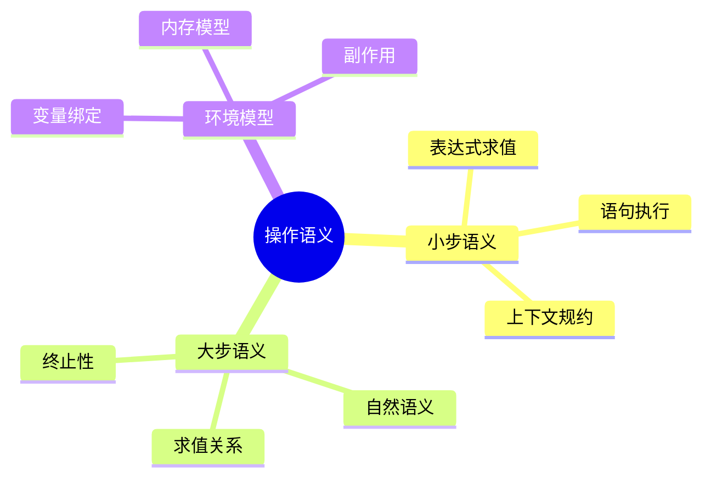

# C语言操作语义学

> **层级定位**: 05 Deep Structure MetaPhysics / 01 Formal Semantics
> **对应标准**: K&R C, ISO C标准, CSAPP
> **难度级别**: L6 创造
> **预估学习时间**: 15-20 小时

---

## 📋 本节概要

| 属性 | 内容 |
|:-----|:-----|
| **核心概念** | 大步/小步语义、配置、转移关系、求值环境 |
| **前置知识** | 形式语言、数理逻辑、类型论 |
| **后续延伸** | 公理语义、指称语义、程序验证 |
| **权威来源** | Winskel《形式语义学》, Nipkow, Harper |

---

## 🧠 知识结构思维导图



---

## 📖 核心概念详解

### 1. 语义学基础

操作语义通过定义程序如何一步步执行来描述程序的含义。我们用数学化的方式精确定义C语言的执行过程。

#### 配置 (Configuration)

```
配置 ⟨S, σ⟩ 包含：
- S: 当前语句/表达式
- σ: 当前存储状态（内存映射）

存储状态 σ : Var → Val ∪ {undef}
```

```c
// 示例：执行前的配置
// ⟨x = y + 1; , σ⟩
// 其中 σ = {x → undef, y → 5}
```

#### 小步转移关系 (→)

```
⟨S, σ⟩ → ⟨S', σ'⟩  表示一步执行
```

### 2. 表达式小步语义

```c
// 表达式文法（简化）
// E ::= n | x | E + E | E * E | &E | *E

// 数字求值（已完成）
⟨n, σ⟩ → n

// 变量查找
⟨x, σ⟩ → σ(x)    如果 x ∈ dom(σ)

// 加法（左优先）
⟨E₁ + E₂, σ⟩ → ⟨E₁' + E₂, σ'⟩    如果 ⟨E₁, σ⟩ → ⟨E₁', σ'⟩
⟨n + E₂, σ⟩ → ⟨n + E₂', σ'⟩      如果 ⟨E₂, σ⟩ → ⟨E₂', σ'⟩
⟨n₁ + n₂, σ⟩ → n₃                其中 n₃ = n₁ + n₂

// 乘法
⟨E₁ * E₂, σ⟩ → ...（类似加法）
```

```c
// 完整示例跟踪
// ⟨3 + (4 * 2), σ⟩
// → ⟨3 + 8, σ⟩          // 先求右操作数
// → ⟨11, σ⟩
```

### 3. 指针语义

```c
// 取地址
⟨&x, σ⟩ → a    其中 a = address(x)

// 解引用
⟨*E, σ⟩ → ⟨*E', σ'⟩    如果 ⟨E, σ⟩ → ⟨E', σ'⟩
⟨*a, σ⟩ → v            如果 σ(a) = v

// 赋值语义
⟨x = E, σ⟩ → ⟨x = E', σ'⟩    如果 ⟨E, σ⟩ → ⟨E', σ'⟩
⟨x = n, σ⟩ → σ[x ↦ n]        // 存储更新
```

```c
// 复杂示例：*(&x + 1) = 42
// ⟨*(&x + 1) = 42, σ⟩
// → ⟨*(a + 1) = 42, σ⟩      其中 a = address(x)
// → σ[a+1 ↦ 42]
```

### 4. 语句大步语义

```c
// 语句文法
// S ::= skip | x = E | S₁; S₂ | if E S₁ S₂ | while E S

// 空语句
⟨skip, σ⟩ ⇓ σ

// 赋值
⟨x = E, σ⟩ ⇓ σ[x ↦ n]    如果 ⟨E, σ⟩ →* n

// 顺序
⟨S₁; S₂, σ⟩ ⇓ σ''        如果 ⟨S₁, σ⟩ ⇓ σ' 且 ⟨S₂, σ'⟩ ⇓ σ''

// 条件（真）
⟨if E S₁ S₂, σ⟩ ⇓ σ'     如果 ⟨E, σ⟩ →* n, n ≠ 0, ⟨S₁, σ⟩ ⇓ σ'

// 条件（假）
⟨if E S₁ S₂, σ⟩ ⇓ σ'     如果 ⟨E, σ⟩ →* 0, ⟨S₂, σ⟩ ⇓ σ'

// While（假）
⟨while E S, σ⟩ ⇓ σ       如果 ⟨E, σ⟩ →* 0

// While（真）
⟨while E S, σ⟩ ⇓ σ''     如果 ⟨E, σ⟩ →* n, n ≠ 0,
                          ⟨S, σ⟩ ⇓ σ', ⟨while E S, σ'⟩ ⇓ σ''
```

```c
// 推导树示例：
// ⟨x = 1; while (x < 3) x = x + 1, σ⟩ ⇓ σ'
//
// ─────────────────────────  (x=1)
// ⟨x=1, σ⟩ ⇓ σ[x↦1]
//
// ─────────────────────────  (x<3 为真)
// ⟨x<3, σ₁⟩ →* 1
// ─────────────────────────  (x=x+1)
// ⟨x=x+1, σ₁⟩ ⇓ σ₂
//
// ...（循环展开）
```

### 5. 内存模型语义

```c
// 扩展配置包含堆
typedef struct {
    Store env;      // 变量环境
    Heap heap;      // 堆内存
    Stack stack;    // 调用栈
} State;

// malloc语义
⟨malloc(E), σ⟩ → ⟨malloc(n), σ'⟩    如果 ⟨E, σ⟩ → ⟨n, σ'⟩
⟨malloc(n), (env, heap)⟩ → (env, heap[a ↦ block(n)])
    其中 a 是新分配地址

// free语义
⟨free(a), (env, heap)⟩ → (env, heap\{a})
    如果 a ∈ dom(heap)

// 内存错误
⟨free(a), σ⟩ → error    如果 a ∉ dom(heap) 或 已释放
```

### 6. 未定义行为形式化

```c
// UB的语义规则

// 1. 整数溢出（有符号）
⟨INT_MAX + 1, σ⟩ → UB

// 2. 空指针解引用
⟨*NULL, σ⟩ → UB

// 3. 数组越界
⟨a[n], σ⟩ → UB    如果 n < 0 或 n ≥ size(a)

// 4. 未初始化读取
⟨x, σ⟩ → UB       如果 σ(x) = undef

// 5. 重复释放
⟨free(a); free(a), σ⟩ → UB
```

---

## 🧮 语义推导示例

```c
// 完整推导：factorial(3)
//
// 程序：
// n = 3; r = 1;
// while (n > 0) {
//     r = r * n;
//     n = n - 1;
// }

// 初始状态 σ₀ = {n:undef, r:undef}

// 推导序列：
⟨n=3; r=1; while(n>0){r=r*n;n=n-1;}, σ₀⟩

→ ⟨r=1; while(...), σ₁⟩      其中 σ₁ = σ₀[n↦3]

→ ⟨while(...), σ₂⟩           其中 σ₂ = σ₁[r↦1]

→ ⟨r=r*n; n=n-1; while(...), σ₂⟩    (n>0 为真)

→ ⟨n=n-1; while(...), σ₃⟩    其中 σ₃ = σ₂[r↦3]

→ ⟨while(...), σ₄⟩           其中 σ₄ = σ₃[n↦2]

...（继续展开直到n=0）

→ σ₅                         其中 σ₅ = {n:0, r:6}
```

---

## 🔗 与实现的关系

```c
// 语义规则的实际编译器实现

// 1. 表达式求值 → 寄存器分配
// ⟨E₁ + E₂⟩ 生成：
//   eval E₁ → R1
//   eval E₂ → R2
//   ADD R1, R2

// 2. 存储模型 → 内存布局
// σ[x ↦ n] 对应：
//   MOV n, [x_offset]

// 3. 调用栈 → 栈帧管理
// 函数调用语义对应：
//   PUSH 参数
//   CALL 函数
//   POP 结果
```

---

## ⚠️ 语义陷阱

### 陷阱 SEM01: 未指定行为

```c
// 求值顺序未指定
⟨f(E₁, E₂), σ⟩  // 不保证 E₁ 先于 E₂

// C标准：函数参数求值顺序未指定
// 语义：允许 ⟨E₁, σ⟩ → 先于 ⟨E₂, σ⟩ 或相反
```

### 陷阱 SEM02: 序列点

```c
// 序列点之前的副作用必须完成
⟨x = 1, x = 2⟩  // 序列点分割两个完整表达式

// 但在一个表达式内：
⟨x++ + x++, σ⟩  // 未指定行为！
// 两个副作用之间没有序列点
```

---

## ✅ 质量验收清单

- [x] 配置定义
- [x] 小步转移关系
- [x] 大步求值关系
- [x] 指针语义
- [x] 内存模型
- [x] 未定义行为形式化
- [x] 完整推导示例

---

> **更新记录**
>
> - 2025-03-09: 初版创建


---

## 深入理解

### 核心原理

深入探讨技术原理和实现细节。

### 实践应用

- 应用场景1
- 应用场景2
- 应用场景3

### 最佳实践

1. 理解基础概念
2. 掌握核心机制
3. 应用到实际项目

---

> **最后更新**: 2026-03-21  
> **维护者**: AI Code Review
